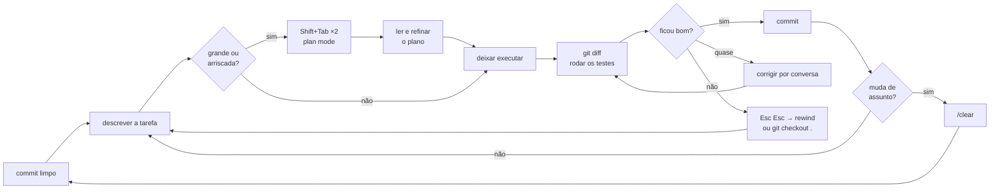

# 04 · Como começar

**Nível:** iniciante · Assume o ambiente pronto pelo [03](03-instalacao.md).
Atualizado em 13/08/2026.

---

## O "hello world" que vale a pena

Ignore o "peça para ele escrever um fizzbuzz". Isso mostra o modelo, não o
agente. O primeiro exercício útil é aquele em que o agente precisa **olhar** e
**verificar** — porque é isso que ele faz de diferente.

Vamos criar um repositório com um bug real e um teste que o pega.

### Passo 1 — o campo de provas

```bash
mkdir ~/primeiro-agente && cd ~/primeiro-agente && git init
```

```bash
cat > conta.py <<'EOF'
def media(numeros):
    return sum(numeros) / len(numeros)
EOF
```
Uma função com um bug esperando: lista vazia divide por zero.

```bash
cat > teste_conta.py <<'EOF'
from conta import media

def test_media_simples():
    assert media([1, 2, 3]) == 2

def test_media_de_lista_vazia():
    assert media([]) == 0
EOF
```

```bash
python3 -m pytest -q 2>&1 | tail -3
# esperado: 1 failed, 1 passed  (ZeroDivisionError)
# Se disser "No module named pytest": pip install pytest, ou use uv.
```

```bash
git add -A && git commit -q -m "estado inicial" && echo "commit feito"
```
**Sempre comece uma sessão com a árvore limpa.** É o seu botão de desfazer
real — melhor que qualquer checkpoint interno.

### Passo 2 — abrir a sessão

```bash
claude
```

Você verá o prompt. Digite, em português:

```
o teste está falhando. descubra por quê e corrija.
```

### Passo 3 — o que deve acontecer na tela

```
● Vou rodar a suíte para ver a falha.
  Bash(python3 -m pytest -q)
  ⎿  E   ZeroDivisionError: division by zero
     1 failed, 1 passed

● Read(conta.py)
  ⎿  2 linhas

● `media([])` divide por zero. O teste espera 0 para lista vazia.
  Edit(conta.py)
     def media(numeros):
  +      if not numeros:
  +          return 0
         return sum(numeros) / len(numeros)

  Do you want to make this edit to conta.py?
  ❯ 1. Yes
    2. Yes, and don't ask again for edits in this session
    3. No, tell Claude what to do differently
```

**Pare aqui e olhe.** Esse diálogo de permissão é o núcleo do modelo de
segurança. Escolha `1`.

```
● Bash(python3 -m pytest -q)
  ⎿  2 passed

  `media([])` estourava ZeroDivisionError. Adicionei a guarda para lista
  vazia retornando 0, como o teste espera.
```

### Passo 4 — verificar por fora

Nunca acredite no relatório do agente sem conferir. É o hábito mais
importante do curso.

```bash
git diff
# esperado: exatamente as duas linhas adicionadas, nada mais

python3 -m pytest -q
# esperado: 2 passed
```

Se `git diff` mostrar mudanças que você não pediu — um arquivo de
configuração criado, um `README` reescrito — você acabou de aprender por que
o commit do passo 1 existe: `git checkout .` e recomece com um pedido mais
específico.

---

## O ciclo de trabalho do dia a dia



Quatro hábitos que fazem toda a diferença, e nenhum é óbvio no primeiro dia:

1. **Commit antes, commit depois.** O agente é um colaborador que não abre PR.
   O `git diff` é a sua revisão de código.
2. **`/clear` ao trocar de assunto.** Contexto acumulado de uma tarefa anterior
   não ajuda a próxima — atrapalha e custa. Ver
   [14](14-contexto-memoria-compactacao.md).
3. **Plan mode para qualquer coisa grande.** `Shift+Tab` duas vezes: ele
   explora e propõe, sem tocar em nada. Corrigir um plano custa uma frase;
   corrigir uma implementação errada custa a tarefa inteira.
4. **Interrompa cedo.** `Esc` para no meio do caminho e mantém o que já foi
   feito. Se você viu o agente pegar o caminho errado na terceira linha, não
   espere a trigésima.

---

## Cinco erros que todo iniciante comete no **uso**

(Erros de instalação estão no [03](03-instalacao.md#11-solução-de-problemas--mensagens-literais).)

### 1. Pedido vago, e depois culpar o agente

```
❌  melhore esse código
```
"Melhor" é indefinido. Ele vai adivinhar — e adivinhar significa refatorar
coisas que você não queria tocar.

```
✅  a função `processar_pedido` em src/pedidos.py tem 120 linhas e três
    níveis de aninhamento. Extraia a validação para uma função separada,
    mantendo o comportamento. Rode `pytest tests/pedidos` no final.
```

Regra prática: **um pedido bom cabe a resposta "como eu saberia que deu
certo?"**. Se você não sabe responder, o agente também não.

### 2. Não dar contra o que verificar

O agente é muito melhor quando pode checar o próprio trabalho. Dê a ele um
teste, um comando, uma saída esperada, um print de tela.

```
✅  implemente `validar_cpf`. Casos: '111.444.777-35' → True,
    '111.111.111-11' → False, 'abc' → False. Escreva os testes primeiro,
    depois a implementação, e rode.
```

### 3. Deixar a sessão crescer sem parar

Uma sessão de três horas sobre cinco assuntos diferentes vira um agente
confuso e caro. Sintomas: ele "esquece" o que você disse no começo, repete
trabalho, ignora uma regra que você deu.

```
/context     # veja o que está ocupando espaço
/compact     # resume e libera, mantendo a conversa
/clear       # zera de vez, ao trocar de tarefa
```

### 4. Aprovar tudo sem ler

O `2. Yes, and don't ask again` é conveniente e é onde os acidentes moram.
Use-o para operações que você conferiria por amostragem (`Edit` dentro do seu
projeto). Não use para `Bash` genérico.

O caminho correto para reduzir cliques não é aprovar tudo, é **listar o que é
seguro**:

```
/permissions
```
e permitir `Bash(npm test)`, `Bash(git status)`, `Bash(git diff:*)`. Ver
[17](17-hooks-permissoes-seguranca.md).

### 5. Achar que ele lembra da sessão de ontem

Ele não lembra. Cada sessão começa com contexto novo. O que persiste é o que
você escreveu no `CLAUDE.md` (lido em toda sessão) e a memória automática, se
ativada.

```
/memory      # editar o CLAUDE.md e ver a memória automática
/resume      # retomar uma conversa antiga, aí sim com o histórico
```

Se você se pegou repetindo a mesma explicação três vezes, ela pertence ao
`CLAUDE.md`.

---

## O `CLAUDE.md`, em uma tela

É o arquivo que entra no contexto de **toda** sessão naquele projeto. Portanto:
o que vale sempre entra; o resto não.

```markdown
# nome-do-projeto

API de cobrança recorrente. Python 3.12 + FastAPI + PostgreSQL.

## Comandos
- testes rápidos: `pytest -q -m "not slow"`
- suíte inteira: `pytest`
- lint: `ruff check --fix`
- subir local: `docker compose up -d`

## Convenções
- Dinheiro **sempre** em centavos, como `int`. Nunca `float`.
- Toda data com timezone, em UTC. Nunca `datetime.now()` sem tz.
- Migrações com Alembic; nunca `ALTER TABLE` na mão.

## O que não fazer
- Não toque em `src/legado/` — está congelado até a migração terminar.
- Não adicione dependência sem falar comigo antes.
```

**O erro clássico é escrever demais.** Documentação que o agente descobriria
lendo o código (estrutura de pastas, o que cada módulo faz) não pertence ao
`CLAUDE.md`: ela consome contexto em toda sessão para dizer algo que uma
chamada de `Read` diria de graça. O que pertence é o que **não está no
código**: convenções, decisões, o que dói.

Regra de bolso: se o `CLAUDE.md` passou de ~100 linhas, rode `/doctor` — ele
sugere o que cortar e o que virar [skill](18-skills-plugins-extensibilidade.md).

---

## Os quatro modos de permissão

`Shift+Tab` alterna entre eles. O modo aparece no rodapé.

| Modo | Comportamento | Quando |
|---|---|---|
| **Manual** (padrão) | pergunta antes de editar e de rodar comandos | aprendendo; código que você não conhece |
| **Accept edits** | edita sem perguntar; ainda pergunta para comandos | tarefa bem definida no seu próprio projeto |
| **Plan** | explora e propõe, **não** edita nada | qualquer tarefa grande — comece sempre aqui |
| **Auto** | avalia cada ação com verificações de segurança em segundo plano | fluxo do dia a dia, depois que você confia no setup |

Existe ainda o `bypassPermissions` (`--dangerously-skip-permissions`), que
pula tudo. **Use apenas em contêiner descartável sem credenciais.** O nome da
flag é um aviso, não um enfeite.

---

## Verificação final desta etapa

Você concluiu o `04` quando conseguir, sem consultar:

```bash
cd ~/primeiro-agente && claude
```
```
/context        # entender o que está ocupando o contexto
/permissions    # abrir e fechar sem medo
```
`Shift+Tab` até chegar em **plan**, pedir uma mudança grande, ler o plano,
sair sem executar (`Esc`), e conferir com `git status` que nada mudou.

---

## Onde ir depois

- Referência de comandos e atalhos: [05-manual-de-uso.md](05-manual-de-uso.md)
- Receitas prontas, do trivial ao real: [06-exemplos.md](06-exemplos.md)
- Projeto completo e executável: [07-projeto-modelo/](07-projeto-modelo/README.md)
- Entender o que está acontecendo por dentro: [10-fundamentos.md](10-fundamentos.md)

---

## Autoteste

1. Por que o "hello world" deste capítulo usa um teste que falha, em vez de
   pedir um programa novo?
2. O que o `git commit` antes da sessão protege, que o `Esc Esc` não protege?
3. Um pedido é bom quando você consegue responder a qual pergunta?
4. Qual a diferença entre `/compact` e `/clear`, e quando usar cada um?
5. Por que "Yes, and don't ask again" é seguro para `Edit` e arriscado para
   `Bash`?
6. Dê um exemplo de informação que **pertence** ao `CLAUDE.md` e um que **não**
   pertence, explicando o critério.
7. Você pediu uma refatoração e o `git diff` mostra três arquivos alterados,
   sendo que você esperava um. Quais são suas duas opções imediatas?
8. Em qual modo de permissão você começaria uma migração de banco de dados, e
   por quê?
