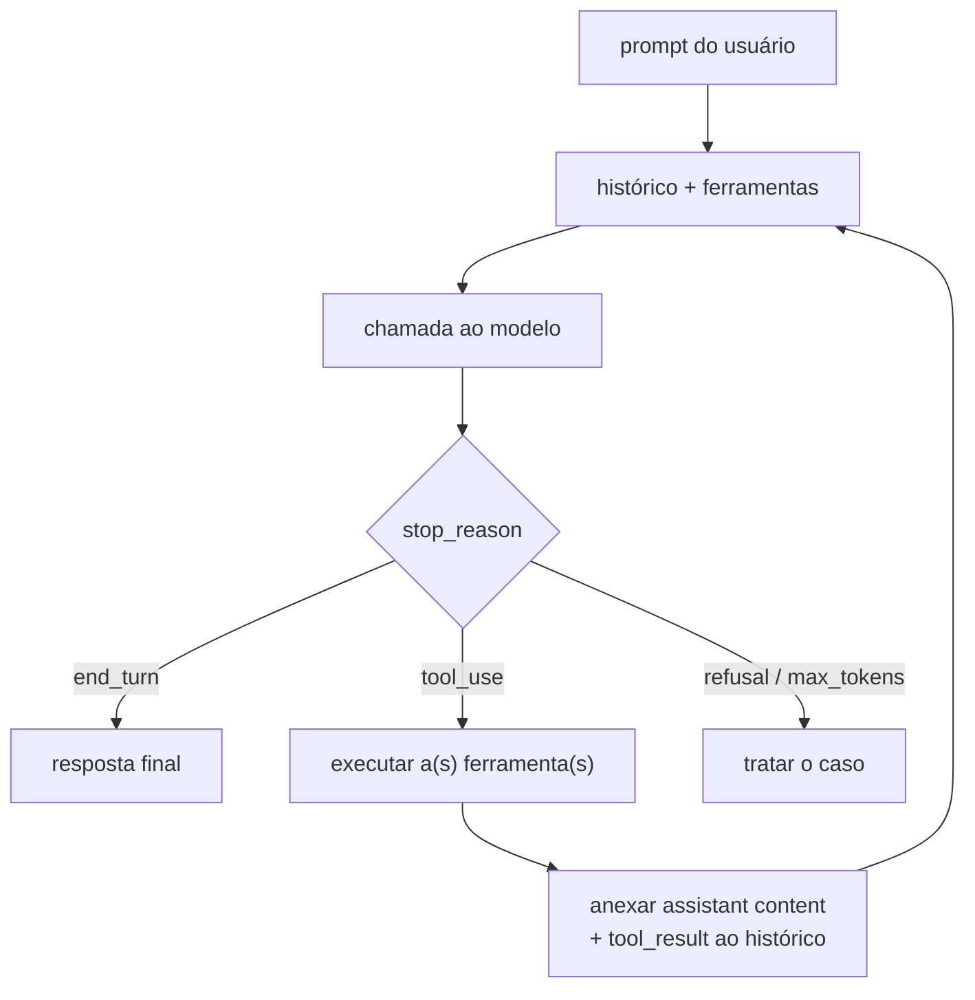

# 10 · Fundamentos

**Nível:** intermediário · Atualizado em 13/08/2026

---

## Definição

> Um **agente de IA** é um sistema em que um modelo de linguagem decide, a cada
> passo, qual ação tomar, executa essa ação por meio de **ferramentas**,
> observa o resultado, e repete — até julgar que o objetivo foi atingido ou
> até que um limite externo o interrompa.

Três cláusulas, e cada uma exclui alguma coisa:

| Cláusula | Exclui |
|---|---|
| "o modelo decide, a cada passo, qual ação tomar" | pipelines com fluxo escrito por você |
| "executa por meio de ferramentas" | chatbots que só produzem texto |
| "observa o resultado e repete" | uma única chamada com uma única ferramenta |

O terceiro é o mais importante e o mais esquecido. **Sem o retorno da
observação para dentro da próxima decisão, não há agente** — há uma chamada de
função com linguagem natural na frente.

---

## O vocabulário mínimo

Cada termo é definido antes de ser usado; todos estão no
[GLOSSARIO.md](GLOSSARIO.md).

**Modelo (LLM).** Uma função que recebe um texto e devolve o próximo pedaço de
texto. Não tem memória, não tem estado, não executa nada. Toda a "memória" de
uma conversa é você reenviando o histórico inteiro a cada chamada.

**Ferramenta (tool).** Uma função do seu programa que você **descreve** para o
modelo — nome, para que serve, quais parâmetros aceita. O modelo não executa a
função: ele emite um pedido estruturado dizendo "chame `ler_arquivo` com
`caminho='src/a.py'`". Quem executa é você.

**Arnês (harness).** O programa que embrulha o modelo: mantém o histórico,
oferece as ferramentas, executa os pedidos, devolve os resultados, gerencia o
contexto, aplica permissões e decide quando parar. O Claude Code é um arnês.
O `agente_minimo.py` do [projeto-modelo](07-projeto-modelo/README.md) é um
arnês de 120 linhas.

**Contexto (context window).** O texto que o modelo enxerga numa chamada:
instruções do sistema, histórico da conversa, conteúdo de arquivos lidos,
saídas de comandos. Tem tamanho máximo (1 milhão de tokens nos modelos Claude
atuais). Encheu, alguma coisa precisa sair.

**Token.** A unidade em que o texto é fatiado e cobrado. Grosseiramente, ~4
caracteres em inglês e um pouco menos em português. Você paga por token de
entrada e por token de saída, e o preço de saída é ~5× o de entrada.

**Turno (turn).** Uma iteração do laço: uma chamada ao modelo, mais as
ferramentas que ela pediu, mais os resultados delas.

**Parada (stop reason).** Por que o modelo parou de gerar. Os valores que
importam: `end_turn` (terminou), `tool_use` (quer uma ferramenta),
`max_tokens` (bateu o teto de saída), `refusal` (recusou por segurança).
**O laço inteiro é um `while stop_reason == "tool_use"`.**

---

## O laço, na sua forma mínima



Em pseudocódigo, sem esconder nada:

```python
mensagens = [{"role": "user", "content": pedido}]

while True:
    r = modelo(mensagens, ferramentas)

    if r.stop_reason != "tool_use":
        return r.texto

    mensagens.append({"role": "assistant", "content": r.content})
    resultados = [executar(b) for b in r.content if b.type == "tool_use"]
    mensagens.append({"role": "user", "content": resultados})
```

É isso. O Claude Code é esse laço com dezenas de anos-pessoa de engenharia em
torno: ferramentas boas, gestão de contexto, permissões, checkpoints,
subagentes, hooks. Mas o núcleo é essa dúzia de linhas, e vale conhecê-la
para saber onde as coisas dão errado.

O [12-anatomia-do-loop-agentico.md](12-anatomia-do-loop-agentico.md) abre cada
uma dessas linhas.

---

## As três fases de um turno

A documentação da Anthropic descreve o laço como **reunir contexto → agir →
verificar**. As fases se misturam na prática, mas a distinção é útil para
diagnosticar:

| Fase | Ferramentas típicas | Falha característica |
|---|---|---|
| **Reunir contexto** | busca, leitura, `git log`, web | age sobre um palpite; não leu o arquivo certo |
| **Agir** | edição, comandos, chamadas de API | faz a coisa errada com convicção |
| **Verificar** | testes, compilador, rodar o app, screenshot | **pula esta fase** — a falha mais cara |

Quando um agente decepciona, quase sempre dá para apontar em qual das três ele
falhou. E a fase 3 é a que mais falha, porque é a única que o modelo pode
"pular" e ainda produzir uma resposta que parece boa.

> **Consequência prática, e talvez a regra mais útil do curso:** *a qualidade
> de um agente numa tarefa é limitada pela qualidade do sinal de verificação
> disponível para aquela tarefa.* Tarefa com teste automatizado → excelente.
> Tarefa com compilador → muito bom. Tarefa com revisão humana no fim →
> razoável. Tarefa sem nada que cheque → você recebe texto plausível e não
> tem como saber se está certo.

---

## Agente × workflow: a distinção que separa o joio

Este quadro é da Anthropic, do artigo *Building Effective Agents* (dez/2024),
e continua sendo a melhor lente disponível:

| | **Workflow** | **Agente** |
|---|---|---|
| Quem decide o próximo passo | você, no código | o modelo, a cada volta |
| Fluxo de controle | escrito com antecedência | emergente |
| Previsível? | sim | não |
| Custo | conhecido | variável |
| Depuração | direta | difícil |
| Bom para | tarefas bem definidas | tarefas que você não consegue especificar de antemão |

Os cinco padrões de **workflow** que a Anthropic cataloga — e que resolvem a
maioria dos problemas reais:

1. **Encadeamento (prompt chaining)** — saída de uma chamada é entrada da
   próxima. Ex.: extrair → normalizar → resumir.
2. **Roteamento (routing)** — classifique a entrada, mande para o tratamento
   especializado. Ex.: triagem de ticket.
3. **Paralelização** — divida em partes independentes, junte no fim. Ou
   *voting*: rode a mesma coisa N vezes e compare.
4. **Orquestrador-trabalhadores** — um modelo decompõe e delega a outros.
5. **Avaliador-otimizador** — um modelo gera, outro critica, repete.

E um único padrão de **agente**: o laço da seção anterior.

> **Opinião profissional, com convicção:** *a maior parte dos "agentes" que se
> vê em 2026 deveria ser workflow. Se você consegue desenhar o fluxograma
> antes de rodar, escreva o fluxograma — ele é mais barato, mais rápido, mais
> confiável e infinitamente mais fácil de depurar. Agência custa: latência,
> imprevisibilidade e erro que se acumula ao longo das voltas. Pague esse
> preço só quando a flexibilidade valer mais — e ela vale, com frequência, em
> codificação, onde o espaço de soluções é grande demais para você enumerar.*

**Regra prática de decisão.** Antes de construir um agente, responda quatro
perguntas (também da Anthropic):

1. **Complexidade** — a tarefa é multi-passo e difícil de especificar por
   inteiro de antemão?
2. **Valor** — o resultado justifica custo e latência maiores?
3. **Viabilidade** — o modelo é bom nesse tipo de tarefa hoje?
4. **Custo do erro** — dá para pegar e recuperar erros (testes, revisão,
   rollback)?

Um "não" em qualquer uma delas → fique no nível mais simples.

---

## Por que agentes funcionam agora e não funcionavam em 2023

Quatro coisas mudaram, e nenhuma delas é "o modelo ficou mais inteligente" no
sentido genérico:

1. **Uso de ferramentas virou capacidade treinada.** Emitir uma chamada de
   função bem-formada, com os argumentos certos, na hora certa, deixou de ser
   um truque de prompt e passou a ser parte do treinamento.
2. **Contexto longo ficou barato o bastante.** Um agente lê muito: arquivos,
   saídas, erros. Com 8 mil tokens, você acabava o contexto antes de terminar
   a tarefa. Com 1 milhão e cache de prompt, não.
3. **Aprendizado por reforço em tarefas agênticas.** Os modelos passaram a ser
   treinados em trajetórias inteiras — não "qual é a próxima palavra", mas "o
   teste passou no final?".
4. **Recuperação de erro.** O comportamento que mais mudou: modelos de 2023
   entravam em ciclo depois de uma ferramenta falhar; modelos de 2026 leem a
   mensagem de erro e mudam de estratégia. Isso é o que torna o laço viável
   por dezenas de voltas.

---

## Os cinco porquês: por que o modelo não executa a ferramenta ele mesmo?

**1. Por que o modelo só *pede* a ferramenta, em vez de executá-la?**
Porque o modelo é uma função de texto para texto, rodando num servidor da
Anthropic. Ele não tem sistema de arquivos, processo, nem rede — só produz
tokens.

**2. Por que não colocar um interpretador junto do modelo, no servidor?**
Existe: é a ferramenta de execução de código server-side. Mas ela roda no
sandbox *deles*, não no seu repositório. Para mexer no **seu** projeto, a
execução precisa acontecer na **sua** máquina.

**3. Por que não mandar a máquina do usuário para o servidor?**
Porque isso é o mesmo problema, invertido, e pior: você exportaria o seu
ambiente inteiro — credenciais, VPN, chaves SSH — para um terceiro. A
fronteira "o modelo decide, o cliente executa" existe para que a fronteira de
confiança fique **na sua máquina**.

**4. Por que essa fronteira importa tanto na prática?**
Porque é onde você consegue interpor controle: pedir permissão, negar comando,
rodar um hook, registrar no log, cortar orçamento. Se o modelo executasse
direto, não haveria ponto de interceptação — e você não teria como impedir
nada.

**5. E se o modelo pedir algo destrutivo?**
Aí o pedido é só isso: um pedido. O arnês decide. É por isso que
`--dangerously-skip-permissions` tem esse nome: ele remove o único lugar do
sistema onde alguém verifica antes de agir.

*Parada legítima:* é uma decisão de arquitetura de segurança, deliberada e
documentada, com um trade-off explícito (você perde velocidade em troca de
poder auditar).

---

## O que muda quando o agente é de código

Codificação é a área onde agentes funcionam melhor hoje, e não por acaso:

| Propriedade | Por que ajuda |
|---|---|
| **Verificação barata e automática** | compilador, tipos, testes, linter. O agente descobre que errou sem você |
| **Erro reversível** | git. Desfazer custa um comando |
| **Ambiente já é textual** | arquivos, comandos e logs são texto — o meio nativo do modelo |
| **Massa de dados de treino** | décadas de código público, com histórico de correções |
| **Ciclo curto** | rodar um teste leva segundos, não semanas |

Compare com "agente que negocia contrato": verificação cara e lenta, erro
irreversível, meio não textual, poucos dados. Não é que o modelo seja pior em
contratos — é que o **laço** não fecha.

Quando alguém te propuser um agente para o domínio X, faça a pergunta: **como
esse agente descobre, sozinho, que errou?** Se não houver resposta, o que
está sendo proposto é um gerador de texto com passos.

---

## Autoteste

1. Defina agente em uma frase, e diga o que cada cláusula da sua definição
   está excluindo.
2. Qual é a única condição de parada normal do laço agêntico?
3. Por que "sem observação retornando à decisão não há agente"?
4. Das três fases do turno, qual falha mais e por quê?
5. Enuncie a regra que liga qualidade do agente ao sinal de verificação. Dê um
   exemplo de tarefa onde ela prevê fracasso.
6. Cite três dos cinco padrões de workflow e diga que problema cada um resolve.
7. Um colega quer trocar um pipeline determinístico de ETL por um agente.
   Aplique as quatro perguntas e dê uma recomendação.
8. Por que o modelo pede a ferramenta em vez de executá-la? Chegue até a
   consequência de segurança.
9. Por que codificação é o melhor domínio para agentes em 2026? Liste três
   propriedades.
