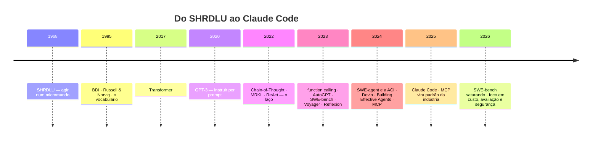

# 11 · História

**Nível:** intermediário · Atualizado em 13/08/2026

Uma coisa a guardar antes de começar: **quase nada aqui é ideia nova.** A
palavra "agente" tem 40 anos de literatura em IA, e o laço percepção → decisão
→ ação é anterior a qualquer modelo de linguagem. O que é novo é a peça que
faltava — um decisor de propósito geral, bom o bastante.

---

## Antes dos LLMs: o agente como conceito (1956–2015)

**Anos 1950–70 — os sistemas simbólicos.** SHRDLU (Terry Winograd, 1968–70)
entendia comandos em inglês sobre um mundo de blocos e agia sobre ele: "pegue
o bloco vermelho e ponha em cima da caixa". Funcionava lindamente **dentro do
mundo de blocos**, e caía imediatamente fora dele. A lição foi cara e é a
mesma até hoje: um agente que só funciona no domínio para o qual foi
programado à mão não escala.

**Anos 1980–90 — a arquitetura BDI.** *Belief–Desire–Intention* (Bratman;
Rao & Georgeff, 1995) formalizou o que é ser um agente: crenças sobre o mundo,
desejos (objetivos) e intenções (planos assumidos). É a origem do vocabulário
que ainda usamos. O problema de sempre: alguém precisava escrever as crenças e
os planos.

**1995 — o livro-texto.** Russell & Norvig, *Artificial Intelligence: A Modern
Approach*, consolida a definição que a área usa até hoje: um agente é o que
**percebe** o ambiente por sensores e **age** sobre ele por atuadores,
escolhendo ações que maximizam uma medida de desempenho. Troque "sensores" por
"resultados de ferramentas" e "atuadores" por "chamadas de ferramenta": é
literalmente o mesmo diagrama.

**Anos 2000–2010 — aprendizado por reforço.** Agentes que aprendem a política
por tentativa e erro. DQN (2013), AlphaGo (2016). Excelentes dentro de um
ambiente fechado com recompensa definida; inúteis fora dele. Nova versão do
problema do SHRDLU.

**A peça que faltava**, o tempo todo: um decisor de **propósito geral**, capaz
de entender um objetivo em linguagem natural num domínio que nunca viu.

---

## 2017–2022: o decisor aparece

| Ano | Marco | Por que importa aqui |
|---|---|---|
| 2017 | *Attention Is All You Need* — o Transformer | a arquitetura que viabilizou escala |
| 2018 | BERT, GPT-1 | pré-treino + ajuste fino vira o padrão (ver [`bert`](../bert/00-MAPA.md)) |
| 2020 | GPT-3 | *few-shot*: instruir por prompt, sem retreinar. Nasce a ideia de "programar em linguagem natural" |
| 2022 | InstructGPT / RLHF | modelos passam a **seguir instruções** em vez de completar texto. Sem isso, nada de agente |
| jan/2022 | **Chain-of-Thought** (Wei et al.) | "pense passo a passo" melhora raciocínio. O modelo passa a ter um espaço de rascunho |

O modelo já sabia decidir. Ainda não sabia agir.

---

## 2022–2023: o laço é inventado (e desinventado)

**Maio/2022 — MRKL Systems** (AI21). Propõe combinar um LLM com módulos
externos — calculadora, base de dados — roteando a pergunta. É o primeiro
esboço público de "LLM + ferramentas".

**Outubro/2022 — ReAct** (Yao et al., ICLR 2023). O paper fundador. A ideia:
intercalar **Reasoning** e **Acting** num mesmo traço:

```
Pergunta: Qual a altitude da região onde fica o Colorado orogeny?
Pensamento: Preciso buscar Colorado orogeny e achar a região.
Ação: buscar[Colorado orogeny]
Observação: A orogenia de Colorado foi um episódio de formação de montanhas...
Pensamento: Não menciona a região. Vou buscar "eastern sector".
Ação: buscar[eastern sector]
Observação: ...estende-se até as High Plains.
Pensamento: Preciso da altitude das High Plains.
Ação: buscar[High Plains altitude]
...
```

**Esse formato — pensamento, ação, observação, repete — é o laço agêntico.**
Todo agente moderno é uma variação dele. O que mudou desde 2022: o "pensamento"
virou nativo do modelo em vez de convenção textual, e a "ação" virou uma
chamada estruturada em vez de texto entre colchetes.

**Fevereiro/2023 — Toolformer** (Meta). Modelos aprendem *sozinhos*, com
auto-supervisão, quando chamar uma API. Sinaliza a direção: uso de ferramenta
como capacidade treinada, não como truque de prompt.

**Março/2023 — function calling** na API da OpenAI, seguido pelo *tool use* da
Anthropic. O ponto de virada de engenharia: o modelo passa a emitir **JSON
validado** em vez de texto que você tenta interpretar com regex. Sem isso, o
laço é frágil demais para produção.

**Março–abril/2023 — AutoGPT e BabyAGI.** O momento de hype. AutoGPT bateu
100 mil estrelas no GitHub em poucas semanas: dê um objetivo, ele se decompõe
em subtarefas, cria mais subtarefas, executa, indefinidamente.

Não funcionava. E vale entender exatamente por quê, porque as quatro causas
ainda são as causas de fracasso hoje:

1. **Sem verificação.** Ele nunca sabia se um passo tinha dado certo — então
   seguia empilhando passos sobre um erro.
2. **Sem gestão de contexto.** Estourava a janela em poucas voltas e "esquecia"
   o objetivo.
3. **Modelo fraco demais para o laço.** GPT-3.5 e o GPT-4 de 2023 entravam em
   ciclo depois de uma falha.
4. **Objetivos vagos demais.** "Aumente o faturamento da empresa" não tem
   condição de parada.

> **Opinião:** *o AutoGPT foi extraordinariamente útil como experimento
> público e desastroso como produto. Ele queimou a palavra "agente" por dois
> anos — e ensinou à indústria, em tempo recorde, que autonomia sem
> verificação é um gerador de lixo caro.*

**Julho/2023 — Voyager** (NVIDIA/Caltech). Um agente em Minecraft que escreve
código, testa no ambiente, guarda o que funcionou numa biblioteca de skills e
reutiliza. Demonstra os três ingredientes que faltavam ao AutoGPT: currículo
automático, **verificação pelo ambiente** e memória de habilidades.

**Outubro/2023 — Reflexão e crítica.** *Reflexion* (Shinn et al.) e a linha de
*self-critique*: o agente escreve por que falhou e usa isso na próxima
tentativa. Junto com *Tree of Thoughts* (Yao, 2023), estabelece que **iterar
com feedback vale mais que gerar melhor de primeira**.

---

## 2024: agentes de código começam a funcionar

**Outubro/2023 — SWE-bench** (Jimenez et al., Princeton). O benchmark que
mudou a conversa: 2 294 issues reais do GitHub, com os testes reais do projeto.
O agente recebe o repositório e a issue; o critério é objetivo — **os testes
passam ou não**.

Os primeiros resultados foram humilhantes: ~2%. Isso foi bom. Deu à área um
número honesto para perseguir, num domínio onde o sinal de verificação é
barato e automático.

**Março/2024 — Devin** (Cognition), anunciado como "o primeiro engenheiro de
software de IA". Demo impressionante, resultados reais bem abaixo do
prometido, e uma boa quantidade de crítica sobre a honestidade da demo. Mas
puxou muito capital e muita atenção para agentes de código.

**2024 — SWE-agent** (Princeton). Introduz o conceito que virou o centro de
tudo: a **Agent–Computer Interface (ACI)**. A tese: mantido o modelo fixo,
*desenhar melhor as ferramentas* melhora o desempenho drasticamente. Um
comando `edit` que valida a sintaxe e mostra o contexto ao redor vence um
`sed` cru — não porque o modelo mudou, mas porque a interface reduz o espaço
de erro.

> Essa é a lição de engenharia mais transferível de todo o período: **a
> qualidade das ferramentas é um parâmetro de projeto tão importante quanto a
> escolha do modelo.** É por isso que o [13](13-ferramentas-e-tool-use.md)
> existe.

**Dezembro/2024 — dois marcos da Anthropic no mesmo mês:**

- ***Building Effective Agents***, o artigo de engenharia que estabeleceu a
  distinção workflow × agente e os cinco padrões. Continua sendo a leitura
  mais útil da área — e a mensagem central é *comece simples, adicione
  agência só quando a flexibilidade compensar*.
- **MCP — Model Context Protocol**, aberto. Um protocolo para ligar modelos a
  ferramentas e dados, de forma que uma integração escrita uma vez sirva a
  qualquer cliente. Resolve um problema em forma de M×N (M clientes × N
  ferramentas) transformando-o em M+N. Ver [15](15-mcp-model-context-protocol.md).

**2024 — o resto do ecossistema.** Aider (agente de código no terminal, 2023),
OpenHands/OpenDevin (2024, aberto), Cursor Composer, GitHub Copilot Workspace.
Frameworks: LangGraph, CrewAI, AutoGen, e depois `smolagents` (Hugging Face).

---

## 2025–2026: consolidação

**Fevereiro/2025 — Claude Code**, primeiro como research preview. A aposta de
produto: o terminal, e não a IDE, é o lugar certo para um agente de código —
porque o terminal já é a interface universal para tudo que se pode
automatizar.

Ao longo de 2025 e 2026 o Claude Code acumula as camadas que o transformam de
laço em plataforma: subagentes, hooks, skills, plugins, worktrees, agent view,
workflows dinâmicos, sessões na nuvem, e o SDK que empacota o arnês como
biblioteca.

**2025 — MCP vira padrão de fato.** OpenAI, Google DeepMind e Microsoft adotam
o protocolo ao longo de 2025. Uma especificação aberta, publicada por um
fornecedor e adotada pelos concorrentes, é raro o bastante para merecer nota.

**2025–2026 — os números do SWE-bench viram rotina.** De ~2% em 2023 para
patamares acima de 80–90% no SWE-bench Verified em 2026. Junto com os
números, veio a crítica saudável: auditorias mostram que uma fração relevante
das soluções "corretas" passa nos testes por motivos errados
(*[UTBoost](https://arxiv.org/pdf/2506.09289)*, e trabalhos de auditoria de
benchmark como *BenchJack*). Surgem alternativas mais duras: SWE-bench Pro,
Terminal-Bench, e o hábito de reportar o par **agente + modelo** em vez do
modelo sozinho. Ver [20](20-avaliacao-e-benchmarks.md).

**2026 — o problema deixa de ser "consegue?" e passa a ser "quanto custa, e dá
para confiar?"** As perguntas de engenharia do momento são orçamento de
tokens, isolamento, injeção de prompt, e como avaliar um agente sem se enganar.

---

## Linha do tempo



---

## Cinco ideias que sobreviveram

Se você lê só uma seção deste arquivo, leia esta.

1. **O laço percepção–ação (ReAct, 2022).** Nada substituiu.
2. **Verificação pelo ambiente (Voyager, SWE-bench).** É o que separa agente de
   gerador de texto.
3. **A interface agente–computador importa tanto quanto o modelo (SWE-agent).**
   Ferramenta bem desenhada rende mais que trocar de modelo.
4. **Comece simples; agência é um custo (Anthropic, 2024).** A maioria dos
   problemas quer workflow.
5. **Protocolo aberto ganha de integração pontual (MCP, 2024).** M+N em vez de
   M×N.

E duas que morreram:

- **Autonomia irrestrita sem verificação** (AutoGPT). Não volta.
- **"O prompt certo resolve".** Não resolve: ferramentas, contexto e
  verificação decidem.

---

## Autoteste

1. Que ideia do SHRDLU (1968) o campo levou 50 anos para superar, e o que a
   superou?
2. Qual é a contribuição específica do ReAct, e em que ela difere do
   Chain-of-Thought?
3. Por que o *function calling* de 2023 foi mais decisivo para agentes do que
   qualquer aumento de tamanho de modelo daquele ano?
4. Liste as quatro causas do fracasso do AutoGPT e diga qual delas ainda é a
   mais comum em 2026.
5. O que o SWE-bench fez pela área além de medir?
6. Explique a tese da ACI (SWE-agent) e dê um exemplo concreto.
7. Que problema o MCP resolve, e por que se descreve como M+N em vez de M×N?
8. Por que a saturação do SWE-bench em 2026 é motivo de cautela e não só de
   comemoração?
9. Das cinco ideias que sobreviveram, qual muda mais o seu trabalho amanhã?
