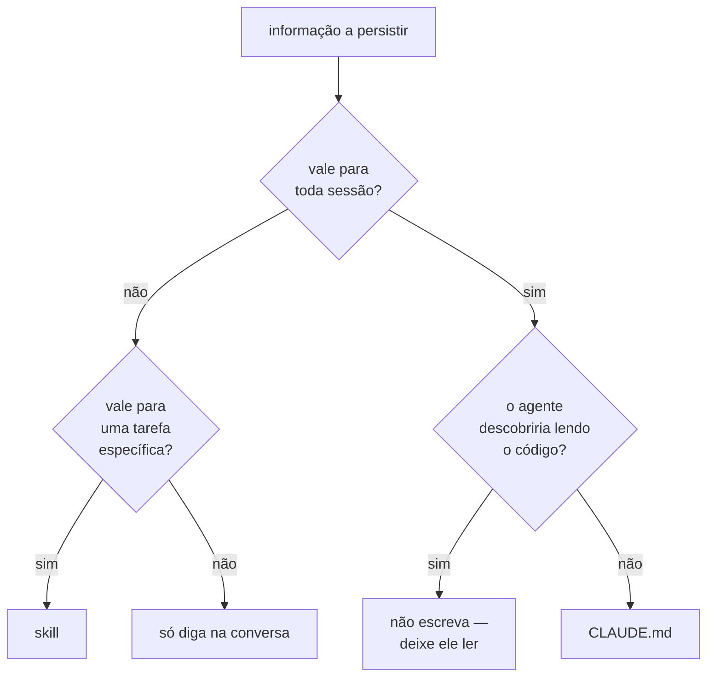

# 14 · Contexto, memória e compactação

**Nível:** intermediário · Atualizado em 13/08/2026

O recurso mais escasso de um agente não é inteligência: é **espaço na janela
de contexto**. Este capítulo é sobre administrar esse orçamento.

---

## 1. O que ocupa a janela

Numa sessão do Claude Code, o contexto é composto de:

| Item | Quando entra | Você controla? |
|---|---|---|
| Prompt de sistema | sempre | pouco (`--append-system-prompt`) |
| Definições de ferramenta | sempre | sim (`--tools`, tool search) |
| `CLAUDE.md` (projeto, pessoal, ancestrais) | toda sessão | **sim, e é onde mais se erra** |
| Descrições de skills | toda sessão | sim (`/skills`, `skillOverrides`) |
| Memória automática (`MEMORY.md`) | início da sessão, até 200 linhas ou 25 KB | sim |
| Histórico da conversa | acumula | sim (`/compact`, `/clear`) |
| Conteúdo de arquivos lidos | quando ele lê | indiretamente |
| Saída de comandos | quando ele roda | **muito** — `\| tail -50` |
| Resultados de ferramentas MCP | quando chama | sim (tool search) |

```
/context
```

Mostra tudo isso numa grade colorida, com sugestões. **É o comando mais
subutilizado do Claude Code.** Rode-o nas duas situações: numa sessão nova
(para ver o custo fixo do seu setup) e quando ele começar a "esquecer" coisas.

Uma sessão nova saudável abre com poucos por cento ocupados. Se a sua abre com
25%, o problema está no setup, não na conversa.

---

## 2. Quando enche

O Claude Code administra sozinho, em duas etapas:

1. **Limpa saídas antigas de ferramenta** — o material mais volumoso e menos
   reutilizado.
2. **Compacta**: resume a conversa e substitui o histórico pelo resumo.

O que sobrevive à compactação: os seus pedidos, os trechos-chave de código, o
`CLAUDE.md` (que é recarregado). O que se perde: instruções detalhadas que
você deu lá no começo, e que estavam **só** na conversa.

> **Consequência direta, e a regra mais prática deste arquivo:** *regra que
> precisa valer até o fim da sessão pertence ao `CLAUDE.md`, não à
> conversa.* Se você disse "não mexa em `src/legado/`" no minuto 3 e ele mexeu
> no minuto 90, não foi desobediência: a instrução saiu no resumo.

Controles:

```
/compact                              # compacta agora
/compact foque nas mudanças de API    # com instruções de foco
/autocompact 500k                     # em que ponto o automático dispara
/clear                                # zera de vez
```

Você também pode adicionar uma seção `## Compact Instructions` no `CLAUDE.md`
dizendo o que sempre preservar no resumo.

**Thrashing.** Se um único arquivo ou saída for tão grande que o contexto
volta a encher imediatamente após cada resumo, o Claude Code desiste depois de
algumas tentativas e mostra um erro em vez de entrar em ciclo. A correção não
é compactar mais: é parar de despejar aquele arquivo no contexto.

---

## 3. As quatro camadas de memória

| Camada | Vive onde | Dura | Custa contexto? |
|---|---|---|---|
| **Conversa** | histórico da sessão | até `/clear` ou compactação | sim, e cresce |
| **`CLAUDE.md`** | arquivo no repo (e `~/.claude/CLAUDE.md`) | para sempre | **sim, em toda sessão** |
| **Memória automática** (`MEMORY.md`) | `~/.claude/.../memory/` | para sempre | sim, o índice |
| **Skills** | `.claude/skills/*/SKILL.md` | para sempre | **só a descrição** |

A quarta linha é a mais importante e a menos usada. Uma skill de 300 linhas
custa, enquanto não é invocada, exatamente uma linha de descrição. É o
mecanismo de **divulgação progressiva**: o índice sempre presente, o conteúdo
sob demanda.

### Escolhendo a camada



O ramo `F` é onde quase todo mundo erra. "A pasta `src/api/` tem os endpoints"
é derivável de um `ls`. Ocupar contexto em **toda** sessão para dizer isso é
pagar aluguel por uma informação gratuita. O que não é derivável — "dinheiro
sempre em centavos", "não toque em `src/legado/`", "o CI quebra se você
esquecer de rodar `make proto`" — esse é o material do `CLAUDE.md`.

---

## 4. `CLAUDE.md`: o que entra e o que não entra

**Entra:**

- Comandos do projeto (testar, lintar, subir), porque descobri-los custa
  voltas.
- Convenções não óbvias no código (unidades, timezone, padrões de erro).
- Restrições (áreas congeladas, o que exige aprovação).
- Decisões e seus porquês (é o "por quê" que impede a refatoração ingênua).
- Armadilhas conhecidas do repositório.

**Não entra:**

- Estrutura de pastas — um `ls` resolve.
- O que cada módulo faz — um `Read` resolve.
- Virtudes genéricas ("escreva código limpo", "seja cuidadoso") — o modelo já
  vem assim, e a repetição só dilui o resto.
- Procedimentos longos usados de vez em quando → **skill**.
- Regras que precisam valer **sempre, sem falha** → **hook**
  ([17](17-hooks-permissoes-seguranca.md)).

**Hierarquia.** O Claude Code lê `CLAUDE.md` do diretório atual e dos
ancestrais, mais o pessoal (`~/.claude/CLAUDE.md`). Em monorepo, isso é uma
ferramenta e tanto: um arquivo raiz com o comum, um por pacote com o
específico — e o do pacote só carrega quando você trabalha nele.

```
/memory     # editar os arquivos e gerenciar a memória automática
/doctor     # sugere o que cortar de um CLAUDE.md inchado
```

**Diagnóstico honesto:** se o seu `CLAUDE.md` passou de ~100 linhas, é quase
certo que metade dele é derivável do código. Rode `/doctor`.

---

## 5. Subagentes: o mecanismo mais forte de gestão de contexto

Um subagente tem **janela de contexto própria**. A conversa dele não é a sua.
Quando termina, volta um resumo — não o traço inteiro.

```
❌  "procure todas as chamadas ao serviço de pagamento"
    → 4 000 linhas de resultado de busca na SUA conversa, para sempre

✅  @investigador procure todas as chamadas ao serviço de pagamento
    → 20 linhas de conclusão na sua conversa; as 4 000 ficaram lá
```

Este é o uso principal de subagente, e não "paralelizar": **isolar contexto**.
Toda tarefa cujo *processo* é volumoso e cujo *resultado* é curto é candidata.
Ver [16](16-subagentes-e-orquestracao.md).

---

## 6. Cache de prompt: por que a ordem importa

O cache cobra ~10% pelo prefixo repetido em vez do preço cheio. A regra que o
governa é **casamento de prefixo**: qualquer byte diferente invalida tudo dali
para frente.

A ordem de renderização é: `tools` → `system` → `messages`.

| Faça | Não faça |
|---|---|
| conteúdo estável primeiro | data/hora ou UUID no prompt de sistema |
| ordenar as ferramentas de forma determinística | montar a lista de ferramentas por usuário |
| manter o modelo fixo na sessão | trocar de modelo no meio (invalida tudo) |
| pôr o volátil no fim | interpolar id da sessão no início |

Um `datetime.now()` no prompt de sistema é o assassino silencioso mais comum:
tudo continua funcionando, e o custo triplica sem qualquer sinal. O
diagnóstico é olhar `cache_read_input_tokens` na resposta — se ele é sempre
zero em requisições com o mesmo prefixo, há um invalidador escondido.

---

## 7. Táticas de economia

| Tática | Ganho | Custo |
|---|---|---|
| `/clear` ao trocar de assunto | grande | reexplicar o contexto |
| `/compact` com foco | médio | perde detalhe |
| Subagente para trabalho volumoso | grande | mais tokens no total, menos na sua janela |
| `\| tail -50` nas saídas de comando | grande | perde a saída completa |
| `CLAUDE.md` enxuto | fixo, em toda sessão | esforço de curadoria |
| Skills em vez de `CLAUDE.md` | fixo | organizar |
| Tool search para muitas ferramentas MCP | fixo | uma volta a mais na primeira chamada |
| `--effort low` em subagente de leitura | médio | menos profundidade |
| Cache com prefixo estável | grande | disciplina de ordem |

> **Contraintuitivo, mas verdadeiro:** subagentes gastam **mais** tokens no
> total (o subagente relê o que precisa) e **menos** na sua janela principal.
> Se o seu problema é custo, subagente não ajuda. Se é o agente perder o fio
> numa sessão longa, ajuda muito.

---

## 8. Os cinco porquês: por que ele "esqueceu" o que eu disse?

**1. Por que ele esqueceu a instrução que dei no início?**
Porque a conversa foi compactada e a instrução não sobreviveu ao resumo.

**2. Por que o resumo não a preservou?**
Porque o resumo prioriza os seus pedidos e o código relevante. Uma instrução
de procedimento dita há 80 mensagens não se destaca do resto.

**3. Por que compactar, então?**
Porque a janela é finita. Sem compactação, a sessão simplesmente para de
funcionar ao bater o teto.

**4. Por que a janela é finita?**
Porque o custo de atenção do Transformer cresce de forma superlinear com o
comprimento da sequência, e porque a qualidade degrada em contextos muito
longos (o efeito "perdido no meio"). Há um limite econômico e um limite de
qualidade, não só um limite técnico.

**5. Então como fazer uma instrução sobreviver?**
Tirando-a da conversa. Um arquivo (`CLAUDE.md`) é recarregado a cada sessão e
preservado na compactação. Um hook não depende de o modelo lembrar de nada:
ele executa.

*Parada legítima:* limite arquitetural do Transformer combinado com um
trade-off econômico explícito — atenção quadrática e degradação de qualidade
em contexto longo.

---

## 9. Diagnóstico rápido

| Sintoma | Comando | Correção provável |
|---|---|---|
| Sessão nova já 25% cheia | `/context` | `CLAUDE.md` inchado, skills demais, MCP demais |
| "Esquece" instruções | `/context` | mover a regra para `CLAUDE.md` ou hook |
| Custo alto e crescente | `/usage` + `/context` | `/clear` mais cedo; cache invalidado |
| Compactando o tempo todo | `/context` | alguma ferramenta despeja saída gigante |
| Erro de thrashing de compactação | — | pare de ler o arquivo enorme; leia por faixa de linhas |
| Uma skill que você nunca usa ocupando espaço | `/skills` | `Espaço` para esconder |

---

## Autoteste

1. Liste cinco coisas que ocupam a janela numa sessão nova.
2. Qual comando mostra a distribuição, e nas duas situações em que se deve
   rodá-lo?
3. O que sobrevive à compactação e o que se perde?
4. Enuncie a regra sobre onde colocar uma instrução que precisa valer até o
   fim da sessão.
5. Por que uma skill de 300 linhas é mais barata que 30 linhas no `CLAUDE.md`?
6. Dê um exemplo de informação que **não** deve entrar no `CLAUDE.md` e diga
   por quê.
7. Qual é o uso principal de subagente, e por que não é paralelismo?
8. Por que um `datetime.now()` no prompt de sistema é caro, e como você
   detecta isso?
9. Se o seu problema é custo total, subagente ajuda? Explique.
10. Percorra os cinco porquês de "ele esqueceu" até a parada legítima.
