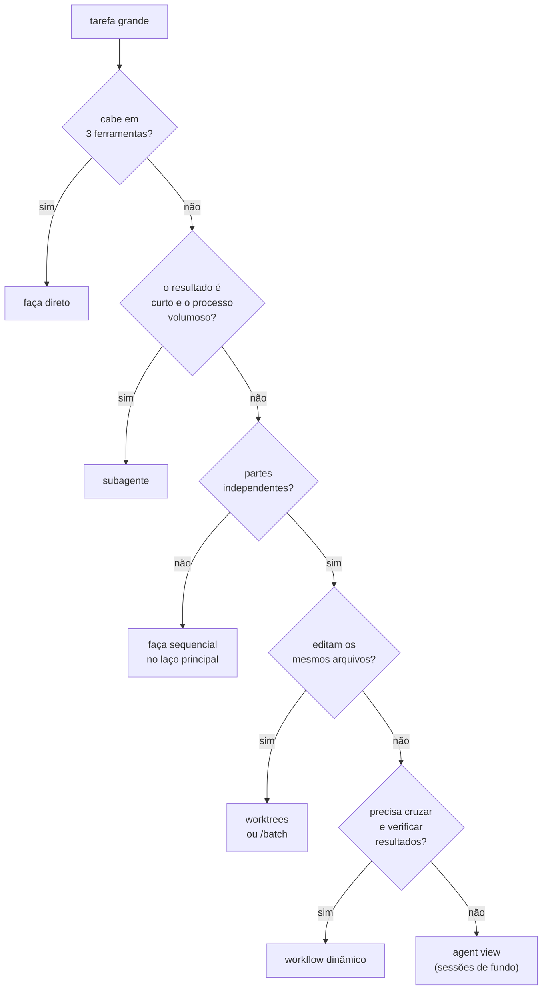

# 16 · Subagentes e orquestração

**Nível:** avançado · Atualizado em 13/08/2026

---

## 1. As quatro formas de paralelizar

O Claude Code oferece quatro mecanismos distintos, e confundi-los é a causa
mais comum de "montei um sistema multiagente e ficou pior".

| Mecanismo | O que é | Quem coordena | Use quando |
|---|---|---|---|
| **Subagentes** | trabalhadores dentro de uma sessão, com contexto próprio, que devolvem um resumo | o Claude, na sua conversa | uma tarefa lateral inundaria a sua conversa |
| **Agent view** (`claude agents`) | painel de sessões independentes rodando em segundo plano | **você** | várias tarefas independentes, você confere depois |
| **Agent teams** | várias sessões coordenadas, com lista de tarefas e mensagens entre elas (experimental, desligado por padrão) | um líder | o Claude deve dividir, atribuir e sincronizar |
| **Workflows dinâmicos** | um *script* que orquestra muitos subagentes e cruza resultados | o script | trabalho grande demais para coordenar turno a turno |

Três apoios que não são formas de paralelizar, mas viabilizam:

- **Worktrees** — cada sessão num checkout git separado, para não se
  atropelarem.
- **Mensagens entre sessões** — sessões suas conversando entre si.
- **`/batch`** — uma skill que empacota "subagentes + worktrees + um PR por
  unidade".

---

## 2. Subagente: o mecanismo básico

O que ele dá, em ordem de importância real:

1. **Contexto isolado** — este é o motivo principal, não o paralelismo.
2. **Ferramentas restritas** — por construção, não por promessa.
3. **Modelo e esforço próprios** — leitura pesada em `sonnet`/`low`; a sua
   conversa fica em `opus`.
4. **Execução concorrente** — vários ao mesmo tempo.

Definição em `.claude/agents/nome.md`:

```markdown
---
name: revisor-de-seguranca
description: Revisa um diff procurando vulnerabilidades. Use antes de abrir PR que toque autenticação, upload de arquivo ou consulta SQL.
tools: Read, Grep, Glob, Bash
disallowedTools: Edit, Write
model: opus
effort: high
color: red
---

Você revisa segurança e **não corrige nada**.

Procure, nesta ordem de prioridade:
1. Injeção (SQL, comando, template, path traversal)
2. Autenticação e autorização — quem pode chamar isto?
3. Dados sensíveis em log, mensagem de erro ou resposta
4. Dependência com CVE conhecido

Para cada achado: `arquivo:linha`, o cenário concreto de exploração
(entrada → efeito), e a correção sugerida em uma linha.

Ordene do mais grave ao menos grave, no máximo 10 achados. Se não achar nada,
diga isso em uma linha — **não invente achado para parecer útil.**
```

Campos que valem conhecer no frontmatter: `name`, `description`
(obrigatórios), `tools`, `disallowedTools`, `model`, `effort`,
`permissionMode`, `maxTurns`, `skills`, `mcpServers`, `hooks`, `memory`,
`background`, `isolation: worktree`, `color`.

Invocar:

```
@revisor-de-seguranca revise o diff do branch atual
/subtask investigue por que o teste de integração é instável
```

`/subtask` cria um subagente que **herda a conversa atual**; `@nome` usa a
definição do arquivo, com contexto novo.

---

## 3. Onde subagentes ajudam — e onde atrapalham

**Ajudam:**

| Caso | Por quê |
|---|---|
| Busca ampla no repositório | processo volumoso, resultado curto |
| Revisão (código, segurança, ferramentas) | contexto separado + ferramentas restritas |
| Ler documentação externa longa | 50 páginas viram 20 linhas |
| Explorar N caminhos independentes | de verdade paralelo |
| Verificação com olhar novo | quem escreveu não é bom juiz do próprio código |

**Atrapalham:**

| Caso | Por quê |
|---|---|
| Tarefa que você faria em 3 chamadas de ferramenta | o custo de briefar + relatar excede a economia |
| Trabalho que depende de contexto que só você tem | o subagente começa do zero e adivinha |
| Edições no mesmo conjunto de arquivos | dois subagentes se sobrescrevem — precisa de worktree |
| Cadeia sequencial disfarçada de paralela | não há paralelismo; só overhead |

> **Cada delegação custa uma rodada de briefing e uma de relatório.** Se a
> tarefa cabe em três chamadas de ferramenta, fazer direto é mais rápido e mais
> barato.

**Um detalhe que muda de modelo para modelo, e vale calibrar:** modelos
diferentes têm propensões diferentes a delegar. Alguns delegam de menos e
precisam de instrução explícita ("quando a tarefa se abrir em itens
independentes, use subagentes"); outros delegam de mais e precisam de teto
("nunca mais de N subagentes em paralelo; não use subagente para verificar seu
próprio trabalho — verificação fica no laço principal"). Observe o seu, e
escreva a regra correspondente no `CLAUDE.md`.

---

## 4. Worktrees: o pré-requisito do paralelismo real

Duas sessões editando a mesma pasta se atropelam. A solução do git é o
worktree: vários checkouts da mesma história, em diretórios diferentes.

```bash
claude -w feature-auth        # cria e entra em <repo>/.claude/worktrees/feature-auth
claude -w '#1234'             # worktree a partir de um PR
claude -w tarefa --tmux       # painéis tmux/iTerm2
```

Ou, num subagente, `isolation: worktree` no frontmatter — o worktree é
removido sozinho se o subagente não mudar nada.

Sem isolamento, "10 agentes em paralelo" é teatro: eles produzem conflitos de
escrita, não trabalho.

---

## 5. Workflows dinâmicos

Um degrau acima. Em vez de o Claude decidir a delegação turno a turno, **um
script** define a estrutura: o que abre em leque, o que verifica, o que
sintetiza. O script é reexecutável e auditável.

Padrões que valem conhecer, porque são reaproveitáveis fora do Claude Code:

| Padrão | O que faz | Quando |
|---|---|---|
| **Pipeline** | cada item percorre todas as etapas independentemente, sem barreira | o padrão — evita esperar o item mais lento |
| **Barreira (parallel)** | espera todos antes de seguir | só quando a etapa seguinte precisa do conjunto (dedup, contagem total) |
| **Verificação adversarial** | N céticos independentes tentam **refutar** cada achado; sobrevive o que a maioria não refuta | mata achado plausível-mas-errado |
| **Painel de juízes** | N tentativas independentes, avaliadas em paralelo, sintetiza a vencedora | espaço de solução amplo (design, arquitetura) |
| **Loop até secar** | continua até K rodadas sem nada novo | descoberta de tamanho desconhecido (bugs) |
| **Varredura multimodal** | vários agentes buscando de formas diferentes (por container, por conteúdo, por entidade, por tempo) | um ângulo de busca não acha tudo |
| **Crítico de completude** | um agente final pergunta "o que ficou de fora?" | o que ele achar vira a próxima rodada |

O padrão mais valioso da lista é o **verificador adversarial**, e a razão é
específica de LLM: um agente que gera e depois se auto-avalia tende a
confirmar o que produziu. Um agente instruído a *refutar*, com contexto
próprio, não tem esse viés. É o mesmo princípio de por que autor não revisa o
próprio artigo.

```
/workflows      # acompanhar, pausar, retomar, salvar
```

---

## 6. Escolhendo, na prática



---

## 7. Custo — sem eufemismo

Multiagente multiplica tokens. Um workflow com 20 subagentes pode consumir
20× o de uma conversa, mais o custo do orquestrador lendo os relatórios.

Faça a conta antes:

```
/usage        # antes
<rode>
/usage        # depois
```

E use `--max-budget-usd` em qualquer execução não interativa.

> **Opinião, contra a corrente:** *a maioria dos sistemas multiagente que se
> vê em 2026 é um workflow sequencial fantasiado. Se você não consegue nomear
> qual informação cada agente tem que os outros não têm, você não tem um
> sistema multiagente — tem uma cadeia de chamadas cara. O ganho real de
> multiagente vem de duas coisas só: **isolamento de contexto** e
> **independência de julgamento** (o verificador que não viu você gerar). Se
> nenhuma das duas está presente, faça sequencial.*

---

## Autoteste

1. Qual é o benefício **principal** de um subagente? (Não é paralelismo.)
2. Diferença entre `@nome` e `/subtask`.
3. Que linha do frontmatter garante que um revisor não edite arquivos, e por
   que isso é mais forte que pedir no prompt?
4. Por que dois subagentes editando os mesmos arquivos exigem worktree?
5. Quando uma barreira (`parallel`) é justificada, e quando é só latência
   desperdiçada?
6. Explique o padrão de verificação adversarial e por que ele funciona melhor
   que auto-avaliação.
7. Quando delegar é mais caro que fazer direto?
8. Qual é o critério para dizer que um sistema multiagente é real e não um
   pipeline fantasiado?
9. Você tem uma migração de 500 arquivos. Percorra o fluxograma da §6 e diga
   onde para.
