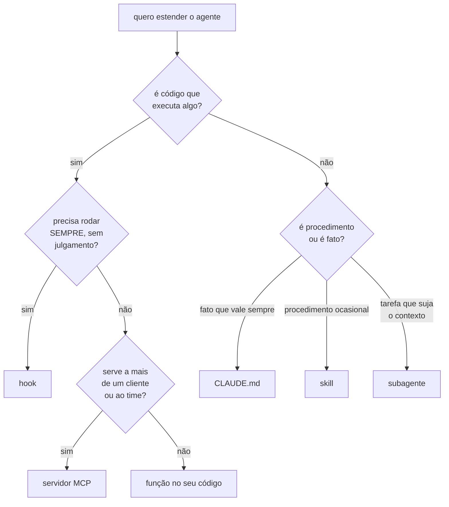

# 18 · Skills, plugins e extensibilidade

**Nível:** intermediário → avançado · Atualizado em 13/08/2026

---

## 1. Os cinco mecanismos, e como escolher

| Mecanismo | O que é | Custo de contexto | Quem dispara |
|---|---|---|---|
| **`CLAUDE.md`** | fatos e regras do projeto | **toda sessão** | sempre carregado |
| **Skill** | procedimento em Markdown, sob demanda | só a `description` | você (`/nome`) ou o Claude |
| **Subagente** | trabalhador com contexto próprio | só a `description` | o Claude ou você (`@nome`) |
| **Hook** | comando determinístico no ciclo de vida | zero | evento |
| **MCP** | ferramentas e dados por protocolo | definições (adiáveis) | o Claude |



---

## 2. Skills

Uma skill é uma pasta com um `SKILL.md`. O **corpo não ocupa contexto** até
ser usado — só a linha `description` fica visível. É o mecanismo de
**divulgação progressiva**, e é a razão pela qual uma skill de 300 linhas é
mais barata que 20 linhas no `CLAUDE.md`.

```
.claude/skills/
  release-notes/
    SKILL.md            ← obrigatório
    exemplo-boa.md      ← material de apoio, lido só se o SKILL.md mandar
    gerar.py            ← script que a skill pode executar
```

```markdown
---
name: migracao-de-tabela
description: Procedimento para adicionar ou alterar coluna em tabela de produção com Alembic. Use quando o pedido envolver mudança de schema, migração ou ALTER TABLE.
---

# Migração de schema

Ordem obrigatória. Não pule nem reordene — o passo 3 depende do 2 ter
rodado em staging.

1. `alembic revision -m "<descrição>"` — nunca edite uma migração já aplicada.
2. Toda coluna nova entra **nullable**, mesmo que o objetivo final seja NOT
   NULL. Preencher e depois restringir é reversível; o contrário não.
3. Rode em staging: `make migrate-staging`. Cole a saída antes de seguir.
4. Só então gere a segunda migração que aplica o NOT NULL.
5. Atualize `docs/SCHEMA.md`.

**Nunca** rode `alembic upgrade head` apontando para produção a partir da
sua máquina. O deploy faz isso.
```

**Frontmatter:** `name` e `description` são obrigatórios.
`disable-model-invocation: true` faz a skill só rodar quando você a chama
(mantém a descrição fora da decisão do modelo, útil para procedimentos
sensíveis). `allowed-tools` restringe o que ela pode usar.

**Escopos:** `.claude/skills/` (projeto, versionado) ·
`~/.claude/skills/` (você, todos os projetos) · plugin (equipe/comunidade).

```
/skills          # listar; `t` ordena por custo em tokens; Espaço esconde
/reload-skills   # recarregar as adicionadas durante a sessão
```

**Comandos personalizados foram unificados com skills.** Um arquivo em
`.claude/commands/deploy.md` e uma skill em `.claude/skills/deploy/SKILL.md`
criam ambos o comando `/deploy` e funcionam igual. Os `commands/` antigos
continuam válidos; skills acrescentam pasta de apoio e frontmatter.

**Argumentos:** o texto após o comando é passado à skill. `/migracao-de-tabela
adicionar coluna cpf em clientes` entrega essa frase como argumento. Skills
podem ser encadeadas (até seis): `/skill-a /skill-b faça X`.

### Escrever skill que funciona

| Faça | Não faça |
|---|---|
| `description` com **gatilho** ("use quando…") | descrição genérica |
| passos exatos onde a ordem importa | roteiro passo a passo para tarefa de julgamento |
| dizer *por que*, não só *o quê* | lista de proibições sem motivo |
| um arquivo, uma responsabilidade | skill que faz três coisas |
| material longo em arquivo de apoio | tudo no `SKILL.md` |

**O erro mais comum é o oposto do que se espera:** skills escritas com passos
excessivamente prescritivos para tarefas que exigem julgamento **pioram** o
resultado nos modelos atuais. Eles seguem o roteiro em vez de resolver o
problema. Prescreva onde a ordem é frágil (migrações, deploy, autenticação);
descreva o objetivo e as restrições onde há espaço de solução.

### Skills que já vêm com o Claude Code

`/code-review` · `/simplify` · `/debug` · `/doctor` · `/run` · `/verify` ·
`/batch` · `/loop` · `/dataviz` · `/claude-api` · `/fewer-permission-prompts` ·
`/run-skill-generator` · `/design-sync` · `/deep-research` (workflow)

Leia o `SKILL.md` delas — são referência de como escrever.

---

## 3. Plugins

Um plugin empacota skills + subagentes + hooks + servidores MCP + temas num
artefato instalável, distribuído por um **marketplace** (um repositório git
com um manifesto).

```bash
claude plugin marketplace add https://github.com/org/nosso-marketplace
claude plugin install padroes-da-empresa@nosso-marketplace
```
```
/plugin list
/plugin disable padroes-da-empresa
/reload-plugins
```

Estrutura:

```
meu-plugin/
├── .claude-plugin/plugin.json     ← manifesto
├── skills/
├── agents/
├── hooks/hooks.json
└── .mcp.json
```

**Quando plugin em vez de skills soltas:** quando mais de um repositório
precisa da mesma configuração. Uma equipe com 12 serviços não deveria copiar
o mesmo `.claude/skills/` doze vezes.

⚠️ Um plugin traz hooks e servidores MCP — ou seja, **código que roda na sua
máquina**. Trate a instalação com o mesmo cuidado de uma dependência: origem
conhecida, versão fixada, revisão do que ele adiciona.

---

## 4. Output styles e persona

```
/config    → Output style
```

Adapta o Claude Code para usos fora de engenharia de software (redação,
análise, ensino) trocando o prompt de sistema. Para ajustes pontuais, prefira
`--append-system-prompt`; para uma persona compartilhada e versionada, output
style.

---

## 5. Um exemplo integrado

Uma equipe de 12 microsserviços, tudo junto:

| Necessidade | Mecanismo | Onde |
|---|---|---|
| Convenções da empresa (dinheiro em centavos, UTC) | `CLAUDE.md` raiz | cada repo |
| Como fazer migração de schema | skill `migracao-de-tabela` | plugin da empresa |
| Como abrir um PR no padrão do time | skill `abrir-pr` | plugin |
| Lint obrigatório após editar | hook `PostToolUse` | plugin |
| Bloquear comando que toque produção | hook `PreToolUse` + `deny` | plugin |
| Consultar o catálogo interno de serviços | servidor MCP | plugin |
| Revisão de segurança antes de PR | subagente `revisor-de-seguranca` | plugin |
| Não ler `.env` | `deny` | `settings.json` de cada repo |

Um `claude plugin install` e o desenvolvedor novo tem tudo. É esse o argumento
do plugin.

---

## Autoteste

1. Por que o corpo de uma skill não custa contexto e o `CLAUDE.md` custa?
2. Quando `disable-model-invocation: true`?
3. Qual erro comum torna uma skill **pior** que não ter skill nenhuma?
4. Skills e comandos personalizados: qual é a relação hoje?
5. Você precisa que o lint rode toda vez após editar. Skill ou hook? Por quê?
6. Quando um plugin se justifica em vez de arquivos soltos?
7. Que risco de segurança um plugin traz que uma skill sozinha não traz?
8. Percorra o fluxograma da §1 para: "o agente precisa consultar nosso
   catálogo interno de serviços".
