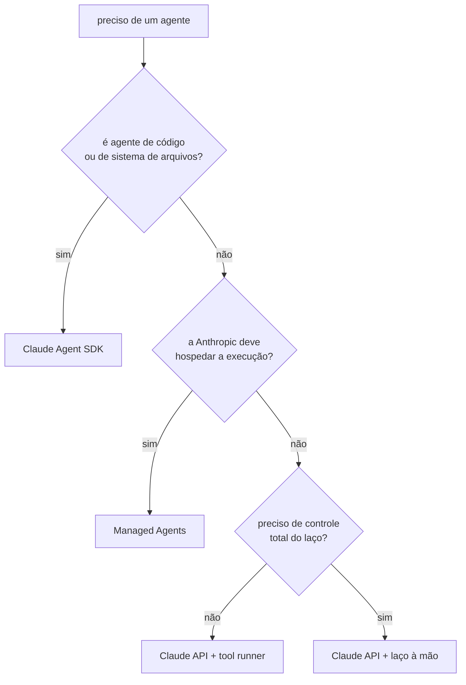

# 19 · Construir o seu próprio agente

**Nível:** avançado · Atualizado em 13/08/2026
Pré-requisito: [12](12-anatomia-do-loop-agentico.md) e
[13](13-ferramentas-e-tool-use.md).

---

## 1. Quatro caminhos, e a pergunta que os separa

Duas perguntas independentes decidem tudo: **quem escreve o arnês** (o laço +
a gestão de contexto) e **quem hospeda a execução**.

| # | Caminho | Você escreve | Arnês e hospedagem | Ferramentas |
|---|---|---|---|---|
| 1 | **Claude API — laço à mão** | o `while stop_reason == "tool_use"` | você faz e você hospeda | só as suas |
| 2 | **Claude API — tool runner** | só as funções das ferramentas | o SDK faz o laço; **você hospeda** | só as suas |
| 3 | **Managed Agents** (beta) | a configuração do agente | a Anthropic faz o laço **e** hospeda o sandbox | sandbox (bash, arquivos, código) + MCP + suas |
| 4 | **Claude Agent SDK** | um prompt e opções | o SDK traz o arnês do Claude Code; **você hospeda** | Read/Write/Edit/Bash/Glob/Grep/Web + MCP + subagentes |

O ponto que se confunde: **1, 2 e 4 deixam a hospedagem com você.** Só o 3
adiciona hospedagem gerenciada. E o "tool runner" (do SDK da API) não é o
"Agent SDK" — são pacotes diferentes, com escopos muito diferentes.

### Escolhendo



> **Antes de tudo isso, pergunte se você precisa mesmo de um agente.** As
> quatro perguntas do [10](10-fundamentos.md#agente--workflow-a-distinção-que-separa-o-joio):
> complexidade, valor, viabilidade e custo do erro. Um "não" em qualquer uma
> → fique num nível mais simples. Um workflow determinístico com uma chamada
> de LLM no lugar certo resolve mais problemas do que a literatura sugere.

---

## 2. Caminho 1 — o laço à mão

Está inteiro no [projeto-modelo](07-projeto-modelo/agente_minimo.py), com
comentários. O essencial:

```python
import anthropic

cliente = anthropic.Anthropic()
mensagens = [{"role": "user", "content": pedido}]

for _ in range(MAX_VOLTAS):
    r = cliente.messages.create(
        model="claude-opus-5",
        max_tokens=16000,
        system=SISTEMA,
        thinking={"type": "adaptive"},
        output_config={"effort": "high"},
        tools=FERRAMENTAS,
        messages=mensagens,
    )

    if r.stop_reason == "refusal":
        return tratar_recusa(r)
    if r.stop_reason != "tool_use":
        return "".join(b.text for b in r.content if b.type == "text")

    mensagens.append({"role": "assistant", "content": r.content})   # INTEIRO
    resultados = []
    for b in r.content:
        if b.type == "tool_use":
            texto, erro = executar(b.name, b.input)
            resultados.append({"type": "tool_result", "tool_use_id": b.id,
                               "content": texto, "is_error": erro})
    mensagens.append({"role": "user", "content": resultados})       # UMA mensagem
```

Escolha este caminho quando precisar de um transporte próprio, de uma forma de
requisição que o SDK não monta, ou quando quiser evitar a dependência beta do
tool runner.

**Não** escolha por "preciso de controle": aprovação humana, log,
interceptação e modificação de resultado são todas possíveis com o tool
runner, pelos ganchos por volta.

---

## 3. Caminho 2 — tool runner

O SDK roda o laço; você escreve as funções.

```python
from anthropic import Anthropic, beta_tool

cliente = Anthropic()

@beta_tool
def buscar_pedido(numero: str) -> str:
    """Busca um pedido pelo número.

    Use sempre que a pergunta envolver um pedido específico — o status muda
    ao longo do dia, então nunca responda de memória.

    Args:
        numero: número do pedido, ex.: 'PED-2026-0042'.
    """
    return consulta_no_banco(numero)

runner = cliente.beta.messages.tool_runner(
    model="claude-opus-5",
    max_tokens=16000,
    tools=[buscar_pedido],
    messages=[{"role": "user", "content": pergunta}],
)

for mensagem in runner:      # cada iteração = uma volta; você pode intervir aqui
    ...
```

O esquema JSON sai da assinatura e do docstring — mais uma razão para o
docstring ser código de produção.

Em TypeScript: `betaZodTool` + `client.beta.messages.toolRunner`. Há
equivalentes em Go, Java, Ruby, C# e PHP.

**Atenção real:** o tool runner não retoma sozinho um `pause_turn` (que
acontece com ferramentas de servidor, como busca web). Ele encerra e devolve a
mensagem pausada como final, sem erro — uma resposta silenciosamente truncada.
Se você misturar ferramentas de servidor, cheque `stop_reason` a cada
iteração.

---

## 4. Caminho 4 — Claude Agent SDK

É o Claude Code empacotado como biblioteca: laço, gestão de contexto,
ferramentas embutidas (ler, escrever, editar, bash, glob, grep, web),
subagentes, hooks, permissões e sessões.

```bash
pip install claude-agent-sdk           # Python
npm install @anthropic-ai/claude-agent-sdk   # TypeScript
```

```python
from claude_agent_sdk import query

async for mensagem in query(
    prompt="Encontre e corrija o vazamento de memória em src/cache.py",
    options={"cwd": "/caminho/do/repo", "permission_mode": "acceptEdits"},
):
    print(mensagem)
```

Escolha quando o seu agente é **de código ou de sistema de arquivos** e você
quer as ferramentas prontas. É o caminho mais curto entre a ideia e um agente
que funciona — e o mais difícil de justificar quando o domínio não é
arquivos.

Documentação: `code.claude.com/docs/en/agent-sdk`.

---

## 5. Caminho 3 — Managed Agents

A Anthropic roda o laço **e** hospeda um contêiner por sessão, onde as
ferramentas executam. Fluxo obrigatório: crie um **Agent** (uma vez,
versionado) e depois **Sessions** que o referenciam.

```
POST /v1/agents     → model, system, tools, mcp_servers, skills   (UMA VEZ)
POST /v1/sessions   → agent_id + environment_id                   (a cada execução)
GET  /v1/sessions/{id}/events/stream                              (SSE)
```

O anti-padrão número um: chamar `agents.create()` a cada execução. Isso
acumula agentes órfãos, paga latência de criação toda vez e joga fora o
versionamento — que é a razão de o Agent ser um objeto separado.

Escolha quando quiser sessões longas com espaço de trabalho, agendamento, e
não quiser operar contêineres. Não está disponível em Bedrock/Vertex/Foundry.

---

## 6. As sete decisões de projeto

Independentes do caminho.

**1. Superfície de ferramentas.** Comece com poucas e amplas; promova a
dedicada o que precisar de barreira, renderização, auditoria ou paralelismo.
Ver [13](13-ferramentas-e-tool-use.md).

**2. Gestão de contexto.** Três mecanismos, para três problemas:

| Mecanismo | Faz o quê | Quando |
|---|---|---|
| Edição de contexto | **remove** resultados antigos e blocos de pensamento | histórico ficou obsoleto |
| Compactação | **resume** quando aproxima do limite | conversa vai ultrapassar a janela |
| Memória | persiste **entre** sessões | estado precisa sobreviver ao processo |

**3. Prompt de sistema.** Diga o que só você sabe: público, produto, critério
de qualidade, restrições e **os porquês**. Não repita virtudes que o modelo já
tem ("seja cuidadoso", "seja preciso") — elas diluem o resto. E não escreva
roteiro passo a passo para tarefa de julgamento.

**4. Esforço e modelo.** `effort` costuma render mais que trocar de modelo.
Suba para tarefa agêntica difícil; desça em subagentes de leitura.

**5. Cache.** Estável primeiro, volátil depois. Nada de timestamp ou UUID no
prompt de sistema. Verifique `cache_read_input_tokens` — se é sempre zero, há
um invalidador escondido.

**6. Travas.** Voltas, orçamento, timeout por ferramenta, interrupção humana.
Nenhuma é opcional em produção.

**7. Observabilidade.** Registre, por volta: qual ferramenta, com quais
argumentos, o resultado (truncado), o `stop_reason` e o `usage`. Sem isso,
"o agente ficou caro" e "o agente errou" são indepuráveis.

---

## 7. Erros que custam caro em produção

| Erro | O que acontece |
|---|---|
| Guardar só o texto da resposta | `tool_use_id` órfão; o próximo turno quebra |
| Resultados de ferramenta em mensagens separadas | o modelo para de paralelizar; sem erro visível |
| Exceção em vez de `is_error` | o agente morre na primeira ferramenta que falha |
| Sem limite de voltas | ciclo consome o orçamento até o teto da conta |
| Sem timeout de ferramenta | um `subprocess` travado trava tudo |
| Ler `content[0]` sem checar `stop_reason` | `IndexError` numa recusa |
| Timestamp no prompt de sistema | cache sempre frio; custo triplica em silêncio |
| Criar o "agente" (Managed) a cada execução | agentes órfãos, latência, sem versionamento |
| Mensagens de erro genéricas | o agente repete a mesma chamada |
| Descrições de ferramenta de uma linha | ferramenta ignorada ou usada errado |

---

## 8. Avaliar antes de confiar

Escrever um agente é a parte fácil. Saber se ele funciona é
[20](20-avaliacao-e-benchmarks.md). O mínimo viável:

1. **20 a 50 casos reais** do seu domínio, com resultado esperado.
2. **Critério automático** sempre que possível (teste, comparação exata,
   validação de schema).
3. **Registre custo e voltas por caso**, não só acerto — um agente que acerta
   gastando 40 voltas não é utilizável.
4. **Rode a suíte a cada mudança** de prompt, ferramenta ou modelo. Sem isso,
   toda "melhoria" é palpite.

---

## Autoteste

1. Quais são as duas perguntas que separam os quatro caminhos?
2. Diferença entre o *tool runner* e o *Claude Agent SDK*.
3. Por que "preciso de controle sobre o laço" **não** é boa razão para o laço
   à mão?
4. Qual comportamento silencioso do tool runner pode truncar respostas?
5. Qual é o anti-padrão número um em Managed Agents, e quais três coisas se
   perdem com ele?
6. Diferença entre edição de contexto, compactação e memória.
7. Cite quatro travas obrigatórias em produção.
8. O que registrar por volta, e qual pergunta cada campo responde?
9. Um timestamp no prompt de sistema não dá erro. Qual é o dano, e como você o
   detecta?
