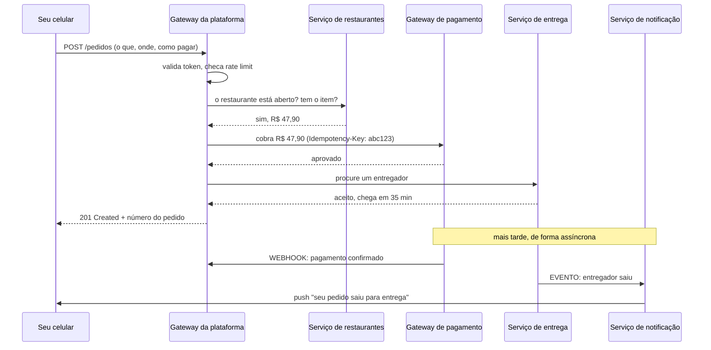

# 01 · O que é uma API, explicado do zero

`Nível: iniciante` · `Atualizado: 11/08/2026` · Pré-requisito: nenhum.

Sem jargão. Todo termo técnico que aparece é definido na frase seguinte.
Este arquivo responde, devagar, exatamente às quatro perguntas que motivaram este material.

---

## 1. A analogia do restaurante

Você entra num restaurante. Não vai até a cozinha. Não precisa saber se o fogão é a gás ou
por indução, quem é o cozinheiro, ou de onde veio o tomate.

Você recebe um **cardápio**. Nele está escrito:

- **o que dá para pedir** ("filé à parmegiana", "suco de laranja");
- **o que você precisa informar** ("ponto da carne: mal passado, ao ponto ou bem passado");
- **quanto custa**;
- e, implicitamente, **o que você vai receber de volta**.

Você faz o pedido ao **garçom**. Ele leva à cozinha. A cozinha faz o prato. O garçom traz.

**Uma API é o cardápio + o garçom.** Ela é a lista de coisas que um software sabe fazer,
mais o caminho pelo qual você pede que ele faça, mais a garantia do que volta.

E o ponto central da analogia é este: **a cozinha pode mudar completamente sem que o
cardápio mude.** Trocaram o fogão, contrataram outro chef, mudaram o fornecedor de tomate —
você continua pedindo "filé à parmegiana" do mesmo jeito e recebendo a mesma coisa.

Essa separação entre *o que se pede* e *como é feito* é a razão de as APIs existirem.

**API** é a sigla de *Application Programming Interface* — em português, **interface de
programação de aplicações**. "Interface" é a palavra que importa: é a superfície de contato
entre duas coisas. A maçaneta é a interface entre você e a porta; você não precisa entender
a fechadura.

---

## 2. A definição, em uma frase

> **Uma API é um contrato: um conjunto de operações que um software oferece para que
> outro software o utilize, sem precisar saber como ele funciona por dentro.**

Duas palavras dessa frase merecem atenção:

**"Contrato"** — porque há promessas dos dois lados. Quem oferece promete: se você pedir
assim, eu respondo assado. Quem consome promete: eu peço do jeito combinado. Quebrar o
contrato quebra o outro lado. É por isso que mudar uma API é uma decisão séria — assunto de
[18-operacao-e-ciclo-de-vida.md](18-operacao-e-ciclo-de-vida.md).

**"Outro software"** — e essa é a distinção mais importante deste arquivo:

| Interface para | Chamada de | Exemplo |
|---|---|---|
| **Pessoas** | UI (*User Interface*) — interface de usuário | um site, um botão, um formulário |
| **Programas** | **API** | o que este material trata |

O site do seu banco é uma **UI**. Quando o aplicativo de finanças pessoais busca seu saldo
sozinho, ele conversa com uma **API**. É a mesma informação, servida de dois jeitos: um
bonito para o olho humano, outro estruturado para a máquina ler.

---

## 3. Um exemplo concreto, do começo ao fim

Você abre um aplicativo de previsão do tempo no celular. Ele mostra "São Paulo, 19 °C,
chuva fraca".

O aplicativo **não sabe** a temperatura. Ele perguntou.

**O que ele enviou** (uma "requisição", em inglês *request*):

```http
GET /v1/clima?cidade=sao-paulo HTTP/1.1
Host: api.exemplo-clima.com
Accept: application/json
```

Traduzindo linha por linha:
- `GET` — o **verbo**: "me dê", "quero ler algo". Não quero mudar nada.
- `/v1/clima?cidade=sao-paulo` — **o quê**: a informação de clima, da cidade São Paulo.
- `Host: api.exemplo-clima.com` — **onde**: em qual servidor.
- `Accept: application/json` — **em que formato eu quero a resposta**.

**O que voltou** (uma "resposta", *response*):

```http
HTTP/1.1 200 OK
Content-Type: application/json
Cache-Control: max-age=600

{
  "cidade": "São Paulo",
  "temperatura_c": 19.2,
  "condicao": "chuva fraca",
  "atualizado_em": "2026-08-11T14:00:00Z"
}
```

- `200 OK` — deu certo. (Se a cidade não existisse: `404 Not Found`. Se o servidor
  quebrasse: `500 Internal Server Error`. Ver [12-http-por-dentro.md](12-http-por-dentro.md).)
- `Content-Type: application/json` — o formato do que veio.
- `Cache-Control: max-age=600` — "pode reaproveitar essa resposta por 10 minutos sem me
  perguntar de novo". Isso é dinheiro e velocidade economizados.
- O bloco entre chaves é **JSON**, um formato de texto que tanto humano quanto máquina
  leem. É o formato dominante em APIs web desde ~2010.

**É só isso.** Uma API web, no essencial, é: você manda um texto estruturado, recebe um
texto estruturado de volta. Todo o resto deste material é sobre fazer isso **bem**.

---

## 4. Por que APIs existem — o problema que elas resolvem

Suponha que sua empresa precise mostrar o preço do dólar no sistema interno.

**Sem API**, as opções seriam:
1. alguém digitar o valor todo dia (erra, esquece, atrasa);
2. um programa "raspar" o site do Banco Central lendo o HTML (quebra toda vez que o site
   muda de layout — isso se chama *scraping* e é frágil por natureza);
3. o Banco Central te mandar um arquivo por e-mail (lento, manual).

**Com API**, seu sistema pergunta e recebe o valor, na hora, num formato estável.

Generalizando, APIs resolvem **quatro** problemas:

| Problema | Como a API resolve |
|---|---|
| **Reuso** | não reescrevo mapas, pagamento ou envio de SMS — uso o de quem já fez |
| **Integração** | dois sistemas de fornecedores diferentes conversam |
| **Desacoplamento** | posso reescrever a cozinha sem mudar o cardápio |
| **Escala organizacional** | 50 times entregam em paralelo se cada um expuser um contrato |

O quarto merece destaque, porque é o menos óbvio e o mais poderoso. Uma empresa com 500
programadores num único programa gigante **não consegue** entregar rápido: todo mundo pisa
no pé de todo mundo. Se ela quebra o sistema em 40 serviços com APIs bem definidas, cada
time trabalha no seu, e a coordenação acontece pelo contrato, não por reunião.

> **Fato histórico frequentemente citado, com ressalva:** conta-se que por volta de 2002
> Jeff Bezos determinou por memorando interno que todos os times da Amazon passassem a
> expor seus dados e funcionalidades exclusivamente por interfaces de serviço. O relato
> mais conhecido veio de um texto público de Steve Yegge, em 2011, não de um documento
> oficial da Amazon. **Trate como anedota bem documentada, não como fonte primária.**
> Independentemente da veracidade dos detalhes, a arquitetura resultante da Amazon é fato,
> e ela viabilizou a AWS.

### Os cinco porquês: por que não basta compartilhar o banco de dados?

Uma pergunta legítima: se dois sistemas precisam dos mesmos dados, por que não deixar os
dois lerem o mesmo banco de dados?

**1. Por que não compartilhar o banco?**
Porque a estrutura das tabelas viraria um contrato implícito com todo mundo, e você não
poderia mais mudá-la sem quebrar sistemas que nem sabe que existem.

**2. Por que a estrutura da tabela é um contrato ruim?**
Porque ela é um detalhe de **implementação**, otimizada para armazenar, não para ser usada.
Um contrato bom expressa **intenção de negócio** ("cancelar pedido"); uma tabela expressa
**armazenamento** ("update pedidos set status = 7").

**3. Por que isso importa na prática?**
Porque toda regra de negócio precisaria ser reimplementada em cada consumidor. Se a regra
"só cancela pedido não faturado" vive no código de quem lê, ela vive em cinco lugares — e
diverge em três deles.

**4. Por que não colocar a regra num procedimento armazenado no banco, então?**
Aí você teria uma API — só que escrita numa linguagem de banco de dados, acoplada a um
fornecedor de banco, sem versionamento, sem controle de acesso granular, sem observabilidade
e sem poder escalar independentemente. É uma API ruim, mas é uma API.

**5. E por que o modelo de API sobre HTTP venceu?**
Porque HTTP já estava em toda parte por causa da web: atravessa firewall, tem cache,
tem proxy, tem balanceador, tem TLS, tem ferramenta de depuração, e todo programador já
sabia. **Venceu por infraestrutura preexistente, não por mérito técnico intrínseco.**
Ver [11-historia.md](11-historia.md) §5.

*(Parada legítima: chegamos a uma decisão de mercado documentada e a um trade-off explícito.)*

---

## 5. Então, o que é uma API "RESTful"?

Aqui está a sua segunda pergunta, e a resposta honesta tem duas camadas.

### 5.1 A resposta que você vai ouvir por aí

"REST é quando você usa URLs para representar coisas e verbos HTTP para operar sobre elas."

```http
GET    /clientes         → lista os clientes
GET    /clientes/42      → mostra o cliente 42
POST   /clientes         → cria um cliente
PUT    /clientes/42      → substitui o cliente 42
PATCH  /clientes/42      → altera parte do cliente 42
DELETE /clientes/42      → apaga o cliente 42
```

Isso é organizado, previsível e legível. **É o que 95% do mercado chama de REST.**

### 5.2 A resposta correta

**REST** (*REpresentational State Transfer*) é um **estilo arquitetural** descrito por
**Roy Fielding** em 2000, no capítulo 5 da tese de doutorado dele. Roy Fielding não é um
autor qualquer: ele é coautor da especificação do HTTP.

REST não é uma tecnologia nem um formato. É um conjunto de **seis restrições**:

| # | Restrição | O que exige |
|---|---|---|
| 1 | **Cliente–servidor** | separar interface de armazenamento |
| 2 | **Sem estado** (*stateless*) | cada requisição carrega tudo que o servidor precisa saber |
| 3 | **Cacheável** | a resposta diz se pode ser guardada e por quanto tempo |
| 4 | **Sistema em camadas** | pode haver proxy, gateway, CDN no meio, de forma transparente |
| 5 | **Interface uniforme** | as mesmas regras valem para todos os recursos |
| 6 | **Código sob demanda** *(opcional)* | o servidor pode enviar código a executar |

E a restrição 5 tem uma sub-regra chamada **HATEOAS** (*Hypermedia As The Engine Of
Application State*): a resposta deve conter **os links** que dizem o que fazer em seguida,
como uma página web contém os links para navegar.

```json
{
  "id": 42,
  "nome": "Maria Rosa",
  "situacao": "ativa",
  "_links": {
    "self":      { "href": "/clientes/42" },
    "pedidos":   { "href": "/clientes/42/pedidos" },
    "desativar": { "href": "/clientes/42/desativacao", "method": "POST" }
  }
}
```

**A verdade incômoda:** quase nenhuma API que se diz REST implementa HATEOAS. Fielding
escreveu publicamente, em 2008, que uma API sem hipermídia não deveria ser chamada de REST.
Ele perdeu essa disputa de vocabulário — completamente.

### 5.3 O que fazer com essa informação

Não é pedantismo inútil. É útil por dois motivos práticos:

1. **Você vai ver "REST" significando coisas diferentes** em documentações e entrevistas.
   Saber que a palavra foi diluída evita mal-entendido.
2. **As restrições 2, 3 e 4 valem por si**, independentemente do nome. "Sem estado" e
   "cacheável" são o que permite colocar uma CDN na frente da sua API e atender 100× mais
   gente pelo mesmo custo. Isso é dinheiro real.

O tratamento completo, com o **Modelo de Maturidade de Richardson** (uma régua de 0 a 3
para medir o quão REST uma API é), está em [13-rest-e-restful.md](13-rest-e-restful.md).

---

## 6. Qual a diferença entre "API" e "API RESTful"?

Sua terceira pergunta. A resposta é de **gênero e espécie**:

```text
                          API
                (qualquer contrato de software)
                           │
        ┌──────────────────┼──────────────────┐
        │                  │                  │
   API LOCAL          API DE SO           API REMOTA
   (biblioteca)       (syscall)           (rede)
   Math.random()      open(), read()            │
   List.add()                          ┌────────┴────────┐
                                       │                 │
                                   WEB API          outras redes
                              (sobre HTTP)        (TCP cru, fila…)
                                       │
              ┌──────────┬─────────────┼──────────┬──────────┐
              │          │             │          │          │
            REST      GraphQL        gRPC       SOAP      WebSocket
              │
        ┌─────┴─────┐
        │           │
   RESTful de    "REST-ish"
   verdade       (o que 95%
   (com HATEOAS)  do mercado faz)
```

Em palavras:

- **Toda API RESTful é uma API.** A recíproca é falsa.
- `Math.random()` do JavaScript é uma API — e não tem nada a ver com REST, nem com rede.
- A função `open()` do Linux é uma API — do sistema operacional.
- Uma API REST é um **subtipo de web API**, que é um **subtipo de API remota**, que é um
  **subtipo de API**.

**Erro comum a evitar:** dizer "vou consumir a API" quando se quer dizer "vou consumir a
API REST daquele serviço". A imprecisão passa despercebida até o dia em que alguém entrega
um cliente SOAP.

---

## 7. Quais tipos existem? — o panorama

Sua quarta pergunta. Existem **duas classificações independentes**, e confundi-las é a
fonte número um de conversa cruzada em reunião técnica.

### 7.1 Por **escopo** — quem tem permissão de usar

| Tipo | Quem usa | Exemplo |
|---|---|---|
| **Privada / interna** | só times da própria empresa | a API do time de estoque, usada pelo time de vendas |
| **De parceiro** | empresas específicas, sob contrato | a API que a transportadora expõe ao e-commerce |
| **Pública / aberta** | qualquer um, com cadastro | API do IBGE, do ViaCEP, do Banco Central |
| **Composta** | agrega várias outras | um *Backend for Frontend* que junta 5 serviços |

### 7.2 Por **localidade** — onde o código roda

| Tipo | Onde | Custo de uma chamada |
|---|---|---|
| **Biblioteca** (local) | mesmo processo | nanossegundos |
| **Sistema operacional** (syscall) | mesma máquina, muda de contexto | microssegundos |
| **IPC** (entre processos) | mesma máquina | microssegundos |
| **Remota (rede)** | outra máquina | **milissegundos — 1.000.000× mais lento** |

> **Guarde esse último número.** A diferença entre chamar uma função local e chamar uma API
> pela rede é de **seis ordens de grandeza**. Toda a dificuldade de sistemas distribuídos
> nasce daí, e o erro clássico da carreira é desenhar uma API remota como se fosse uma
> chamada local. Isso tem nome — *falácias da computação distribuída* — e está em
> [60-teoria-avancada.md](60-teoria-avancada.md) §1.

### 7.3 Por **estilo de conversa** — a classificação que você provavelmente queria

Este é o quadro que responde diretamente a "quais tipos existem e quais as diferenças".
Versão resumida; a completa está em [19-como-escolher.md](19-como-escolher.md).

| Estilo | Ideia central | Formato | Direção | Use quando |
|---|---|---|---|---|
| **REST** | recursos identificados por URL + verbos HTTP | JSON | cliente → servidor | API pública, CRUD, cache importa |
| **RPC / JSON-RPC** | chamar funções remotas | JSON | cliente → servidor | ações que não são "coisas" |
| **gRPC** | RPC com contrato binário e HTTP/2 | Protobuf (binário) | os dois lados, streaming | comunicação interna, alta performance |
| **GraphQL** | o cliente descreve exatamente o que quer | JSON | cliente → servidor | muitas telas com necessidades diferentes |
| **SOAP** | envelope XML com padrões formais | XML | cliente → servidor | integração corporativa e legada, governo, bancos |
| **WebSocket** | canal aberto nos dois sentidos | livre | bidirecional, contínuo | chat, jogo, colaboração ao vivo |
| **SSE** | servidor empurra eventos por HTTP | texto | servidor → cliente | notificação, painel ao vivo, *streaming* de IA |
| **Webhook** | o servidor **chama você** quando algo acontece | JSON | servidor → seu servidor | "me avise quando o pagamento cair" |
| **Mensageria** | eventos numa fila ou tópico | livre | assíncrona | desacoplamento, pico de carga, integração |
| **MCP** | expõe ferramentas e dados a agentes de IA | JSON-RPC | agente ↔ ferramenta | dar capacidades a um modelo de linguagem |

**As diferenças que mais importam, em três frases:**

1. **REST vs. GraphQL:** em REST, o **servidor** decide o formato da resposta; em GraphQL,
   o **cliente** decide. Isso resolve o problema de buscar dados demais ou de menos, e cria
   o problema de cache e de consultas caras.
2. **REST vs. gRPC:** REST otimiza para **interoperabilidade** (qualquer um lê JSON num
   navegador); gRPC otimiza para **eficiência** (binário, contrato forte, streaming). Por
   isso REST na borda e gRPC por dentro é um arranjo tão comum.
3. **Síncrono vs. assíncrono:** REST, GraphQL e gRPC são "eu pergunto, você responde, eu
   espero". Webhook e mensageria são "acontece, e eu sou avisado depois". Escolher errado
   entre esses dois eixos é um erro de arquitetura, não de tecnologia.

---

## 8. Um dia na vida de uma API

Você pede comida por aplicativo. Em ~4 segundos, acontece aproximadamente isto:



Nesse desenho você já viu, na prática: uma **API REST** (o `POST /pedidos`), um **gateway**,
**autenticação**, **rate limiting**, chamadas **internas** entre serviços, uma
**chave de idempotência** (para você não ser cobrado duas vezes se a rede falhar), um
**webhook** e um **evento assíncrono**.

Todos esses termos têm um arquivo dedicado neste material. Você acabou de ver o mapa inteiro
funcionando junto.

---

## 9. Quando **não** usar uma API

Um material honesto diz isso cedo.

| Situação | Por que a API atrapalha | O que fazer |
|---|---|---|
| Duas partes do mesmo programa | 1.000.000× mais lento que chamar a função | chamada de função direta |
| Você é uma pessoa só, num sistema só | complexidade sem benefício | monólito bem organizado |
| Transferir 50 GB de dados | HTTP não foi feito para isso | arquivo, S3, transferência de dados dedicada |
| Latência abaixo de 1 ms é requisito | a rede sozinha já custa mais | mesma máquina, memória compartilhada |
| Precisa de transação atômica entre sistemas | **não existe** entre sistemas independentes | rever o desenho — ver [60](60-teoria-avancada.md) §3 |
| O dado muda 1× por ano | requisição a cada leitura é desperdício | arquivo publicado, cache longo |

> **Opinião profissional:** a moda de microsserviços fez muita gente transformar chamadas
> de função em chamadas de rede sem ganho nenhum, comprando latência, falha parcial,
> versionamento e observabilidade em troca de nada. Uma API é uma **fronteira**, e
> fronteiras têm custo. Crie uma quando houver um motivo — times diferentes, ciclos de
> release diferentes, escalas diferentes, ou um consumidor externo. Não porque é moderno.

---

## 10. O que fazer agora

1. [02-pre-requisitos.md](02-pre-requisitos.md) — 10 minutos, evita frustração.
2. [03-instalacao.md](03-instalacao.md) — instale `curl` e um cliente gráfico. Ou **nem
   instale**: a §1 de lá mostra como fazer sua primeira chamada só com o navegador.
3. [04-como-comecar.md](04-como-comecar.md) — primeira chamada a uma API real e primeira
   API própria, em 40 minutos.

Se você quer entender antes de mexer: [10-fundamentos.md](10-fundamentos.md) e
[13-rest-e-restful.md](13-rest-e-restful.md).

---

## Autoteste

1. Explique o que é uma API para alguém que não é da área, sem usar a palavra "interface".
2. Qual a diferença entre UI e API? Dê um exemplo em que a mesma informação é servida pelas duas.
3. Escreva uma requisição HTTP mínima que pede a previsão do tempo, e explique cada linha.
4. Cite os quatro problemas que APIs resolvem. Qual deles é o menos óbvio?
5. Por que não basta dois sistemas compartilharem o mesmo banco de dados? Vá até o terceiro "porquê".
6. Quais são as seis restrições de REST? Qual delas quase ninguém cumpre?
7. Desenhe a relação de gênero e espécie entre API, web API e API REST. Dê um exemplo de API que não é REST.
8. Quantas ordens de grandeza separam uma chamada de função local de uma chamada de rede?
9. Em uma frase cada, diga a diferença entre REST e GraphQL, e entre REST e gRPC.
10. Cite três situações em que criar uma API é a decisão errada.

---

### Fontes consultadas (11/08/2026)

- Fielding, R. T. *Architectural Styles and the Design of Network-based Software Architectures* (tese, 2000), cap. 5 — https://ics.uci.edu/~fielding/pubs/dissertation/rest_arch_style.htm
- Fielding, R. T. *REST APIs must be hypertext-driven* (2008) — https://roy.gbiv.com/untangled/2008/rest-apis-must-be-hypertext-driven
- IETF — RFC 9110, *HTTP Semantics* — https://www.rfc-editor.org/rfc/rfc9110.html
