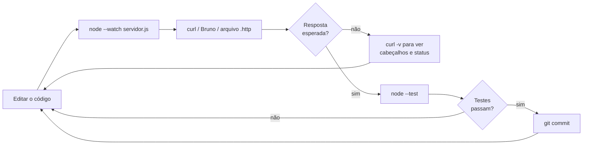

# 04 · Como começar — da primeira chamada à sua primeira API

`Nível: iniciante` · `Atualizado: 11/08/2026`

Assume o ambiente de [03-instalacao.md](03-instalacao.md). **Não repetimos a instalação —
referenciamos.** Se `curl --version` não funciona, volte ao `03` §2.

Tempo estimado: **40 a 60 minutos**. Ao final você terá **consumido** uma API real e
**construído** uma API própria que responde no seu navegador.

---

## Parte 1 · Consumir (20 minutos)

### 1.1 A primeira chamada

```bash
curl https://api.github.com/repos/nodejs/node
```
*Pede ao GitHub os dados do repositório do Node.js. Sem cadastro, sem chave.*

**Verificação:** um bloco grande de JSON, tudo em uma pasta só. Ilegível de propósito —
vamos resolver isso agora.

```bash
curl -s https://api.github.com/repos/nodejs/node | jq
```
*`-s` esconde a barra de progresso; `jq` sem argumentos formata e colore.*

```text
# esperado (trecho):
{
  "id": 27193779,
  "name": "node",
  "full_name": "nodejs/node",
  "private": false,
  "description": "Node.js JavaScript runtime ...",
  "stargazers_count": 115000,
  "license": {
    "key": "mit",
    "spdx_id": "MIT"
  },
  ...
}
```

### 1.2 Ver o que realmente acontece

```bash
curl -i -s https://api.github.com/repos/nodejs/node | head -20
```
*`-i` inclui os cabeçalhos da resposta antes do corpo.*

```text
# esperado (trecho):
HTTP/2 200
content-type: application/json; charset=utf-8
cache-control: public, max-age=60, s-maxage=60
etag: W/"a1b2c3d4e5f6..."
x-ratelimit-limit: 60
x-ratelimit-remaining: 58
x-ratelimit-reset: 1786553400
```

**Leia essas linhas — cada uma é uma aula:**

| Linha | O que ensina |
|---|---|
| `HTTP/2 200` | o protocolo usado e o status: deu certo |
| `content-type: application/json` | o formato do corpo |
| `cache-control: public, max-age=60` | pode guardar por 60 s sem perguntar de novo |
| `etag: W/"..."` | uma "impressão digital" da resposta — usada para não baixar de novo |
| `x-ratelimit-remaining: 58` | você tem 58 chamadas restantes na sua cota |

### 1.3 Usar o ETag para não baixar duas vezes

```bash
ETAG=$(curl -s -I https://api.github.com/repos/nodejs/node | grep -i '^etag:' | tr -d '\r' | cut -d' ' -f2)
echo "ETag: $ETAG"
```
*`-I` faz um `HEAD`: pede só os cabeçalhos, sem o corpo.*

```bash
curl -s -o /dev/null -w '%{http_code}\n' \
  -H "If-None-Match: $ETAG" \
  https://api.github.com/repos/nodejs/node
```
```text
# esperado: 304
```

**`304 Not Modified` significa: "nada mudou, use o que você já tem".** O corpo vem vazio.
Você economizou banda, tempo e, em muitas APIs, **uma unidade da sua cota de chamadas**.

Isso é a restrição de **cacheabilidade** do REST em ação — ver
[13-rest-e-restful.md](13-rest-e-restful.md) §3.

### 1.4 Paginação: o que fazer quando há muitos resultados

```bash
curl -s 'https://api.github.com/repos/nodejs/node/tags?per_page=5' | jq -r '.[].name'
```
```text
# esperado: cinco nomes de tag, um por linha, ex.:
# v24.5.0
# v24.4.1
# ...
```

Agora veja **como o servidor diz onde está a próxima página**:
```bash
curl -s -I 'https://api.github.com/repos/nodejs/node/tags?per_page=5' | grep -i '^link:'
```
```text
# esperado (uma linha longa):
# link: <https://api.github.com/repositories/27193779/tags?per_page=5&page=2>; rel="next", ...
```

O cabeçalho `Link` (RFC 8288) carrega os links de navegação. **Isso é hipermídia** — o
servidor dizendo ao cliente o que fazer em seguida, sem o cliente montar URL na mão.
É a única parte de HATEOAS que a maioria das APIs implementa.

### 1.5 Enviar dados: POST

Use o `httpbin.org`, um serviço público que devolve o que você mandou — perfeito para
aprender.

```bash
curl -s -X POST https://httpbin.org/post \
  -H 'Content-Type: application/json' \
  -d '{"nome":"Maria Rosa","idade":34,"ativo":true}' | jq '.json, .headers."Content-Type"'
```
```text
# esperado:
# {
#   "ativo": true,
#   "idade": 34,
#   "nome": "Maria Rosa"
# }
# "application/json"
```

**Três coisas aconteceram e você precisa entender cada uma:**
- `-X POST` — o **método**: estou criando/enviando algo, não apenas lendo.
- `-H 'Content-Type: application/json'` — **eu declaro** o formato do que estou mandando.
  Sem isso, muitos servidores respondem `415 Unsupported Media Type`.
- `-d '...'` — o **corpo** da requisição.

### 1.6 Autenticação

A maior parte das APIs úteis exige identificação. O padrão mais comum:

```bash
export GITHUB_TOKEN="seu_token_aqui"     # crie em github.com/settings/tokens
curl -s -H "Authorization: Bearer $GITHUB_TOKEN" https://api.github.com/user | jq '.login, .name'
```

**Verificação:** seu nome de usuário aparece. Se der `401`, o token está errado ou expirado.

Compare a cota antes e depois de autenticar:
```bash
curl -s -I https://api.github.com/repos/nodejs/node | grep -i ratelimit-limit
# esperado: 60      (anônimo)

curl -s -I -H "Authorization: Bearer $GITHUB_TOKEN" https://api.github.com/repos/nodejs/node | grep -i ratelimit-limit
# esperado: 5000    (autenticado)
```

**Autenticar não é só permissão — é cota.** Esse é um padrão universal: quem se identifica
recebe mais. Ver [16-seguranca.md](16-seguranca.md) e
[18-operacao-e-ciclo-de-vida.md](18-operacao-e-ciclo-de-vida.md) §3.

> **Lembrete de [03-instalacao.md](03-instalacao.md) §11:** o token vai numa variável de
> ambiente, nunca no comando digitado (fica no histórico), nunca no código, nunca no Git.

### 1.7 Ler erros

```bash
curl -s -i https://api.github.com/repos/nodejs/repositorio-que-nao-existe | head -5
```
```text
# esperado:
# HTTP/2 404
# content-type: application/json; charset=utf-8
```
```bash
curl -s https://api.github.com/repos/nodejs/repositorio-que-nao-existe | jq
```
```text
# esperado:
# {
#   "message": "Not Found",
#   "documentation_url": "https://docs.github.com/rest/repos/repos#get-a-repository",
#   "status": "404"
# }
```

**Uma boa API erra bem:** status correto (`404`), mensagem legível, e um **link para a
documentação**. Guarde esse padrão — você vai reproduzi-lo na Parte 2 e formalizá-lo com o
RFC 9457 em [14-design-de-api-rest.md](14-design-de-api-rest.md) §6.

---

## Parte 2 · Construir (25 minutos)

Vamos escrever uma API de verdade. **Sem nenhuma dependência** — só o Node.js instalado.
Isso é de propósito: você vai ver o HTTP cru antes de um framework escondê-lo.

### 2.1 O esqueleto

```bash
mkdir -p minha-primeira-api && cd minha-primeira-api
```

Crie `servidor.js`:

```javascript
// servidor.js — uma API HTTP sem nenhuma dependência externa.
// Node 24 já traz tudo que é usado aqui.
import { createServer } from 'node:http';

const PORTA = Number(process.env.PORT ?? 3000);

// "Banco de dados" em memória. Some quando o processo morre — e tudo bem,
// o objetivo aqui é entender HTTP, não persistência.
const livros = new Map([
  [1, { id: 1, titulo: 'Dom Casmurro',        autor: 'Machado de Assis', ano: 1899 }],
  [2, { id: 2, titulo: 'Grande Sertão: Veredas', autor: 'Guimarães Rosa', ano: 1956 }],
  [3, { id: 3, titulo: 'Vidas Secas',          autor: 'Graciliano Ramos', ano: 1938 }]
]);
let proximoId = 4;

/** Envia uma resposta JSON com os cabeçalhos corretos. */
function responder(res, status, corpo, cabecalhosExtras = {}) {
  const texto = corpo === null ? '' : JSON.stringify(corpo, null, 2);
  res.writeHead(status, {
    'Content-Type': 'application/json; charset=utf-8',
    'Content-Length': Buffer.byteLength(texto),
    ...cabecalhosExtras
  });
  res.end(texto);
}

/**
 * Envia um erro no formato RFC 9457 (Problem Details for HTTP APIs).
 * É o padrão da IETF para erros de API — ver 14-design-de-api-rest.md §6.
 */
function erro(res, status, titulo, detalhe, extras = {}) {
  const problema = {
    type: `https://exemplo.com/erros/${titulo.toLowerCase().replace(/\s+/g, '-')}`,
    title: titulo,
    status,
    detail: detalhe,
    ...extras
  };
  const texto = JSON.stringify(problema, null, 2);
  res.writeHead(status, {
    // Media type próprio: o cliente sabe que é um erro estruturado, não um recurso.
    'Content-Type': 'application/problem+json; charset=utf-8',
    'Content-Length': Buffer.byteLength(texto)
  });
  res.end(texto);
}

/** Lê o corpo da requisição com limite de tamanho. */
async function lerCorpo(req, limiteBytes = 1_000_000) {
  const partes = [];
  let total = 0;
  for await (const parte of req) {
    total += parte.length;
    // Sem esse limite, um cliente malicioso derruba o servidor por memória.
    if (total > limiteBytes) {
      const e = new Error('Corpo grande demais');
      e.codigo = 413;
      throw e;
    }
    partes.push(parte);
  }
  if (total === 0) return null;
  try {
    return JSON.parse(Buffer.concat(partes).toString('utf8'));
  } catch {
    const e = new Error('JSON inválido');
    e.codigo = 400;
    throw e;
  }
}

/** Valida a entrada. Retorna a lista de problemas encontrados. */
function validarLivro(dados) {
  const problemas = [];
  if (typeof dados?.titulo !== 'string' || dados.titulo.trim() === '') {
    problemas.push({ campo: 'titulo', mensagem: 'obrigatório, texto não vazio' });
  }
  if (typeof dados?.autor !== 'string' || dados.autor.trim() === '') {
    problemas.push({ campo: 'autor', mensagem: 'obrigatório, texto não vazio' });
  }
  if (dados?.ano !== undefined) {
    const anoAtual = new Date().getUTCFullYear();
    if (!Number.isInteger(dados.ano) || dados.ano < 1450 || dados.ano > anoAtual) {
      problemas.push({ campo: 'ano', mensagem: `inteiro entre 1450 e ${anoAtual}` });
    }
  }
  return problemas;
}

const servidor = createServer(async (req, res) => {
  // URL relativa precisa de uma base para ser parseada. O host é irrelevante aqui.
  const url = new URL(req.url, `http://${req.headers.host ?? 'localhost'}`);
  const caminho = url.pathname.replace(/\/+$/, '') || '/';
  const metodo = req.method;

  try {
    // ---- Sonda de saúde: todo serviço precisa de uma ----
    if (metodo === 'GET' && caminho === '/health') {
      return responder(res, 200, { status: 'ok', uptime_s: Math.floor(process.uptime()) });
    }

    // ---- Listar, com paginação ----
    if (metodo === 'GET' && caminho === '/livros') {
      const limite  = Math.min(Number(url.searchParams.get('limite') ?? 10) || 10, 100);
      const inicio  = Math.max(Number(url.searchParams.get('inicio') ?? 0) || 0, 0);
      const busca   = (url.searchParams.get('q') ?? '').toLowerCase();

      let itens = [...livros.values()];
      if (busca) {
        itens = itens.filter(l =>
          l.titulo.toLowerCase().includes(busca) || l.autor.toLowerCase().includes(busca));
      }
      const total = itens.length;
      const pagina = itens.slice(inicio, inicio + limite);

      return responder(res, 200, {
        dados: pagina,
        paginacao: {
          total,
          inicio,
          limite,
          // Hipermídia mínima: o cliente não precisa montar a próxima URL na mão.
          proxima: inicio + limite < total
            ? `/livros?inicio=${inicio + limite}&limite=${limite}`
            : null
        }
      });
    }

    // ---- Obter um ----
    const casaId = caminho.match(/^\/livros\/(\d+)$/);
    if (metodo === 'GET' && casaId) {
      const livro = livros.get(Number(casaId[1]));
      if (!livro) {
        return erro(res, 404, 'Livro nao encontrado',
                    `Não existe livro com id ${casaId[1]}.`);
      }
      return responder(res, 200, livro, { 'Cache-Control': 'public, max-age=60' });
    }

    // ---- Criar ----
    if (metodo === 'POST' && caminho === '/livros') {
      const tipo = req.headers['content-type'] ?? '';
      if (!tipo.includes('application/json')) {
        return erro(res, 415, 'Tipo nao suportado',
                    'Envie Content-Type: application/json.');
      }
      const dados = await lerCorpo(req);
      const problemas = validarLivro(dados);
      if (problemas.length > 0) {
        // 422: a sintaxe está certa (é JSON válido), mas o conteúdo é inválido.
        return erro(res, 422, 'Dados invalidos',
                    'Um ou mais campos não passaram na validação.', { erros: problemas });
      }

      const livro = {
        id: proximoId++,
        titulo: dados.titulo.trim(),
        autor: dados.autor.trim(),
        ano: dados.ano ?? null
      };
      livros.set(livro.id, livro);

      // 201 Created + Location: onde o recurso novo pode ser encontrado.
      return responder(res, 201, livro, { Location: `/livros/${livro.id}` });
    }

    // ---- Substituir ----
    if (metodo === 'PUT' && casaId) {
      const id = Number(casaId[1]);
      if (!livros.has(id)) {
        return erro(res, 404, 'Livro nao encontrado', `Não existe livro com id ${id}.`);
      }
      const dados = await lerCorpo(req);
      const problemas = validarLivro(dados);
      if (problemas.length > 0) {
        return erro(res, 422, 'Dados invalidos',
                    'Um ou mais campos não passaram na validação.', { erros: problemas });
      }
      const livro = { id, titulo: dados.titulo.trim(), autor: dados.autor.trim(),
                      ano: dados.ano ?? null };
      livros.set(id, livro);
      return responder(res, 200, livro);
    }

    // ---- Apagar ----
    if (metodo === 'DELETE' && casaId) {
      const id = Number(casaId[1]);
      // DELETE é IDEMPOTENTE: apagar duas vezes tem o mesmo efeito de apagar uma.
      // Por isso devolvemos 204 mesmo se já não existir — o estado desejado foi atingido.
      livros.delete(id);
      return responder(res, 204, null);
    }

    // ---- Nada casou ----
    // 405 quando o caminho existe mas o método não é permitido; 404 quando nem o caminho existe.
    if (caminho === '/livros' || casaId) {
      const permitidos = caminho === '/livros' ? 'GET, POST' : 'GET, PUT, DELETE';
      res.writeHead(405, { Allow: permitidos, 'Content-Type': 'application/problem+json' });
      return res.end(JSON.stringify({
        type: 'https://exemplo.com/erros/metodo-nao-permitido',
        title: 'Metodo nao permitido', status: 405,
        detail: `${metodo} não é permitido em ${caminho}. Use: ${permitidos}.`
      }));
    }
    return erro(res, 404, 'Rota nao encontrada', `Nada em ${metodo} ${caminho}.`);

  } catch (e) {
    if (e.codigo === 400) return erro(res, 400, 'JSON invalido', e.message);
    if (e.codigo === 413) return erro(res, 413, 'Corpo grande demais', e.message);
    // Erro inesperado: registre o detalhe no log, devolva o genérico ao cliente.
    // Vazar stack trace numa resposta é uma falha de segurança clássica.
    console.error('erro inesperado:', e);
    return erro(res, 500, 'Erro interno', 'Algo deu errado. Tente novamente.');
  }
});

servidor.listen(PORTA, () => {
  console.log(`API no ar em http://localhost:${PORTA}`);
  console.log(`Teste: curl -s http://localhost:${PORTA}/livros | jq`);
});
```

Crie também um `package.json` mínimo (necessário para o `import` funcionar):
```bash
cat > package.json <<'EOF'
{
  "name": "minha-primeira-api",
  "private": true,
  "type": "module",
  "scripts": { "start": "node servidor.js" }
}
EOF
```
*`"type": "module"` habilita a sintaxe `import`. Sem isso, o Node espera `require`.*

### 2.2 Rodar

```bash
node servidor.js
```
```text
# esperado:
# API no ar em http://localhost:3000
# Teste: curl -s http://localhost:3000/livros | jq
```

**Deixe esse terminal aberto** e abra um segundo terminal para os testes.

### 2.3 Exercitar cada rota

```bash
# Saúde
curl -s http://localhost:3000/health | jq
# esperado: { "status": "ok", "uptime_s": 3 }
```

```bash
# Listar
curl -s http://localhost:3000/livros | jq '.paginacao, (.dados | length)'
# esperado: { "total": 3, "inicio": 0, "limite": 10, "proxima": null }  e  3
```

```bash
# Buscar
curl -s 'http://localhost:3000/livros?q=machado' | jq -r '.dados[].titulo'
# esperado: Dom Casmurro
```

```bash
# Um só
curl -s -i http://localhost:3000/livros/1 | head -4
# esperado: HTTP/1.1 200 OK  e  Cache-Control: public, max-age=60
```

```bash
# Inexistente — repare no Content-Type
curl -s -i http://localhost:3000/livros/999 | head -3
# esperado: HTTP/1.1 404 Not Found
#           Content-Type: application/problem+json; charset=utf-8
```

```bash
# Criar
curl -s -i -X POST http://localhost:3000/livros \
  -H 'Content-Type: application/json' \
  -d '{"titulo":"Memórias Póstumas de Brás Cubas","autor":"Machado de Assis","ano":1881}' \
  | head -5
# esperado: HTTP/1.1 201 Created  e  Location: /livros/4
```

```bash
# Validação falhando — o motivo vem estruturado
curl -s -X POST http://localhost:3000/livros \
  -H 'Content-Type: application/json' \
  -d '{"titulo":"","ano":3000}' | jq
```
```text
# esperado:
# {
#   "type": "https://exemplo.com/erros/dados-invalidos",
#   "title": "Dados invalidos",
#   "status": 422,
#   "detail": "Um ou mais campos não passaram na validação.",
#   "erros": [
#     { "campo": "titulo", "mensagem": "obrigatório, texto não vazio" },
#     { "campo": "autor",  "mensagem": "obrigatório, texto não vazio" },
#     { "campo": "ano",    "mensagem": "inteiro entre 1450 e 2026" }
#   ]
# }
```

```bash
# Content-Type faltando
curl -s -X POST http://localhost:3000/livros -d 'titulo=x' | jq -r .title
# esperado: Tipo nao suportado
```

```bash
# Método errado no caminho certo — repare no cabeçalho Allow
curl -s -i -X PATCH http://localhost:3000/livros | head -3
# esperado: HTTP/1.1 405 Method Not Allowed
#           Allow: GET, POST
```

```bash
# Apagar — e apagar de novo (idempotência)
curl -s -o /dev/null -w '%{http_code}\n' -X DELETE http://localhost:3000/livros/3
curl -s -o /dev/null -w '%{http_code}\n' -X DELETE http://localhost:3000/livros/3
# esperado: 204 nas duas vezes
```

**Esse último teste é o mais importante da Parte 2.** DELETE é **idempotente**: repetir a
operação não muda o resultado. Se a rede cair depois que o servidor apagou mas antes de a
resposta chegar, o cliente pode repetir com segurança. Isso não é detalhe — é o que
permite retentativa automática. Ver [14-design-de-api-rest.md](14-design-de-api-rest.md) §7.

### 2.4 Um teste automatizado, sem instalar nada

O Node 24 traz um executor de testes embutido (`node:test`).

Crie `servidor.test.js`:
```javascript
import { test, before, after } from 'node:test';
import assert from 'node:assert/strict';
import { spawn } from 'node:child_process';

const BASE = 'http://localhost:3999';
let processo;

before(async () => {
  processo = spawn('node', ['servidor.js'], {
    env: { ...process.env, PORT: '3999' },
    stdio: 'ignore'
  });
  // Espera o servidor subir, tentando a sonda de saúde.
  for (let i = 0; i < 50; i++) {
    try {
      const r = await fetch(`${BASE}/health`);
      if (r.ok) return;
    } catch { /* ainda não subiu */ }
    await new Promise(r => setTimeout(r, 100));
  }
  throw new Error('servidor não subiu em 5 s');
});

after(() => processo?.kill());

test('GET /livros devolve a lista paginada', async () => {
  const r = await fetch(`${BASE}/livros`);
  assert.equal(r.status, 200);
  assert.match(r.headers.get('content-type'), /application\/json/);
  const corpo = await r.json();
  assert.ok(Array.isArray(corpo.dados));
  assert.equal(corpo.paginacao.total, 3);
});

test('GET /livros/999 devolve 404 no formato problem+json', async () => {
  const r = await fetch(`${BASE}/livros/999`);
  assert.equal(r.status, 404);
  assert.match(r.headers.get('content-type'), /application\/problem\+json/);
  const corpo = await r.json();
  assert.equal(corpo.status, 404);
  assert.ok(corpo.title);
});

test('POST /livros cria e devolve 201 com Location', async () => {
  const r = await fetch(`${BASE}/livros`, {
    method: 'POST',
    headers: { 'Content-Type': 'application/json' },
    body: JSON.stringify({ titulo: 'Iracema', autor: 'José de Alencar', ano: 1865 })
  });
  assert.equal(r.status, 201);
  assert.match(r.headers.get('location'), /^\/livros\/\d+$/);
  const corpo = await r.json();
  assert.equal(corpo.titulo, 'Iracema');
});

test('POST com dados inválidos devolve 422 e lista os campos', async () => {
  const r = await fetch(`${BASE}/livros`, {
    method: 'POST',
    headers: { 'Content-Type': 'application/json' },
    body: JSON.stringify({ titulo: '', ano: 3000 })
  });
  assert.equal(r.status, 422);
  const corpo = await r.json();
  assert.ok(corpo.erros.some(e => e.campo === 'titulo'));
  assert.ok(corpo.erros.some(e => e.campo === 'ano'));
});

test('DELETE é idempotente: 204 nas duas chamadas', async () => {
  const primeira = await fetch(`${BASE}/livros/2`, { method: 'DELETE' });
  const segunda  = await fetch(`${BASE}/livros/2`, { method: 'DELETE' });
  assert.equal(primeira.status, 204);
  assert.equal(segunda.status, 204);
});

test('PATCH em /livros devolve 405 com o cabeçalho Allow', async () => {
  const r = await fetch(`${BASE}/livros`, { method: 'PATCH' });
  assert.equal(r.status, 405);
  assert.equal(r.headers.get('allow'), 'GET, POST');
});
```

```bash
node --test
```
```text
# esperado:
# ✔ GET /livros devolve a lista paginada
# ✔ GET /livros/999 devolve 404 no formato problem+json
# ✔ POST /livros cria e devolve 201 com Location
# ✔ POST com dados inválidos devolve 422 e lista os campos
# ✔ DELETE é idempotente: 204 nas duas chamadas
# ✔ PATCH em /livros devolve 405 com o cabeçalho Allow
# ...
# # pass 6
# # fail 0
```

**Você acabou de escrever testes de API sem instalar uma única dependência.** `fetch`,
`test` e `assert` são todos nativos do Node desde a versão 18/20.

---

## O ciclo de trabalho do dia a dia



```bash
node --watch servidor.js
```
*Reinicia sozinho a cada alteração de arquivo. Recurso nativo do Node, sem `nodemon`.*

**Comandos que compõem o ciclo:**

| Quero | Comando |
|---|---|
| Rodar recarregando | `node --watch servidor.js` |
| Ver requisição e resposta completas | `curl -v <url>` |
| Ver só o status | `curl -s -o /dev/null -w '%{http_code}\n' <url>` |
| Ver o tempo | `curl -s -o /dev/null -w '%{time_total}s\n' <url>` |
| Formatar JSON | `... \| jq` |
| Extrair um campo | `... \| jq -r '.campo'` |
| Rodar os testes | `node --test` |
| Ver quem ocupa a porta | `lsof -i :3000` (Unix) · `netstat -ano \| findstr :3000` (Win) |

---

## Os cinco primeiros erros de uso

### 1. Esquecer o `Content-Type` no POST

```bash
curl -X POST http://localhost:3000/livros -d '{"titulo":"x"}'
```
Sem o cabeçalho, o curl envia `application/x-www-form-urlencoded`. O servidor recusa com
`415`. **Sempre declare o tipo do que você envia.**

### 2. Confundir `-d` com parâmetros de URL

`-d` monta o **corpo** da requisição. Parâmetros de consulta vão na **URL**:
```bash
curl 'http://localhost:3000/livros?q=machado&limite=5'
```
*As aspas simples são obrigatórias: sem elas, o shell interpreta o `&` como "rodar em
segundo plano" e você recebe um erro bizarro.*

### 3. Achar que `200` significa "deu tudo certo"

`200` significa que a **requisição HTTP** funcionou. O corpo pode conter um erro de negócio.
Uma API mal projetada devolve `200 {"erro": "saldo insuficiente"}` — e aí o cliente precisa
inspecionar o corpo para saber se deu certo. **Não faça isso na sua API.** Ver
[75-armadilhas.md](75-armadilhas.md) §2.

### 4. Testar só o caminho feliz

Todo teste da §2.4, exceto o primeiro, testa um **caminho de erro**. É onde os bugs vivem.
Se sua suíte só tem casos de sucesso, ela não está testando quase nada.

### 5. Vazar o erro interno na resposta

O `catch` final do `servidor.js` registra o detalhe no log e devolve uma mensagem genérica.
Devolver a *stack trace* ao cliente expõe caminhos de arquivo, versões de biblioteca e às
vezes credenciais em mensagens de erro de banco. É uma vulnerabilidade catalogada — ver
[16-seguranca.md](16-seguranca.md) §7.

---

## Onde ir agora

| Você quer | Vá para |
|---|---|
| Entender cada status, método e cabeçalho | [12-http-por-dentro.md](12-http-por-dentro.md) |
| Saber o que é REST de verdade | [13-rest-e-restful.md](13-rest-e-restful.md) |
| Mais receitas prontas | [06-exemplos.md](06-exemplos.md) — 15 exemplos |
| Referência de comandos | [05-manual-de-uso.md](05-manual-de-uso.md) |
| Uma API completa e realista | [07-projeto-modelo/](07-projeto-modelo/README.md) |
| Exercícios com critério de aprovação | [70-pratica.md](70-pratica.md) |

---

## Autoteste

1. O que significa `304 Not Modified`, e o que você precisa enviar para recebê-lo?
2. Para que serve o cabeçalho `ETag`?
3. Qual a diferença entre `400`, `415` e `422`? Dê um exemplo de cada.
4. Por que `DELETE` devolve `204` mesmo quando o recurso já não existe?
5. O que o cabeçalho `Allow` acompanha, e em que status ele é obrigatório?
6. Por que se devolve `Location` num `201 Created`?
7. Por que autenticar aumentou a cota de chamadas de 60 para 5000?
8. Por que não se deve devolver a *stack trace* numa resposta de erro?
9. Escreva o comando que mostra apenas o código de status de uma URL.
10. Por que `curl 'http://x?a=1&b=2'` precisa de aspas no shell?
