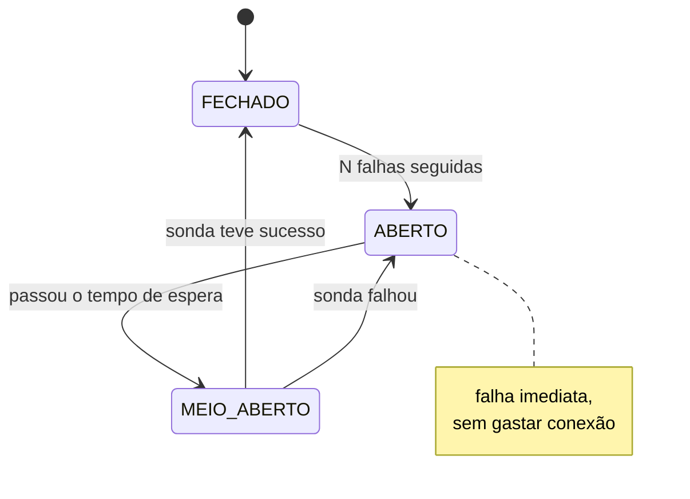
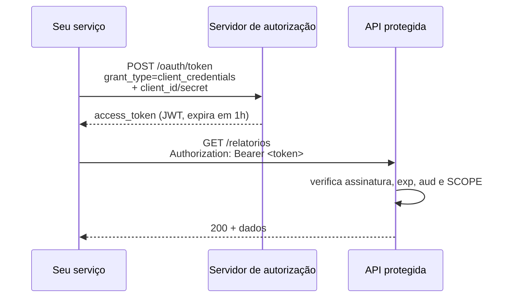

# 06 · Exemplos

`Nível: intermediário` · `Atualizado: 11/08/2026` · `Node.js 24 LTS`

15 exemplos completos e executáveis. Cada um: **problema → solução → explicação**.
Nada de `...` escondendo o que importa.

Os exemplos **1 a 12 rodam sem instalar nenhuma dependência** — só Node 24 e curl.
Os que exigem `npm install` estão marcados com 📦.

> **Verificação (11/08/2026).** Os exemplos 2, 3, 4, 5, 6, 7, 8, 9, 10, 11, 12 e 15 foram
> **executados** durante a escrita deste arquivo (Node v24.18.0; Fastify 5.11.3), e as
> saídas documentadas são as saídas reais. Os exemplos 1 e 2.1 dependem de rede externa e
> foram validados apenas quanto à sintaxe. Os exemplos 13 (GraphQL) e 14 (gRPC) **não foram
> executados** no ambiente de escrita — o código segue a documentação oficial das
> bibliotecas, mas trate as saídas esperadas como derivadas dela, não como medidas.

| # | Exemplo | Precisa de |
|---|---|---|
| 1 | Cache condicional com ETag | curl |
| 2 | Percorrer todas as páginas (cursor vs. offset) | curl + jq |
| 3 | Retentativa com backoff exponencial e jitter | Node |
| 4 | Cliente resiliente: timeout, retry, circuit breaker | Node |
| 5 | **POST idempotente** com `Idempotency-Key` | Node |
| 6 | Concorrência otimista com `ETag` + `If-Match` | Node |
| 7 | Erros no padrão RFC 9457 | Node |
| 8 | Validação de entrada com JSON Schema | Node |
| 9 | OAuth 2.0 Client Credentials, ponta a ponta | Node |
| 10 | **Webhook com assinatura HMAC** (emitir e verificar) | Node |
| 11 | Server-Sent Events (SSE) | Node |
| 12 | WebSocket sem biblioteca | Node |
| 13 | GraphQL: consulta, mutação e o problema N+1 | 📦 |
| 14 | gRPC: contrato, servidor e cliente | 📦 |
| 15 | OpenAPI: contrato, validação e geração de cliente | 📦 |

---

## Exemplo 1 — Cache condicional com ETag

**Problema.** Você consulta uma API a cada minuto. Na maior parte das vezes nada mudou, e
você gasta banda, tempo e cota à toa.

**Solução.**

```bash
#!/usr/bin/env bash
# etag.sh — só baixa de novo se mudou.
set -euo pipefail

URL='https://api.github.com/repos/nodejs/node'
CACHE_CORPO='.cache-corpo.json'
CACHE_ETAG='.cache-etag'

etag=""
[ -f "$CACHE_ETAG" ] && etag=$(cat "$CACHE_ETAG")

# -D - manda os cabeçalhos para o stdout, que separamos depois.
resposta=$(curl -s -D /tmp/hdr -o /tmp/body \
  ${etag:+-H "If-None-Match: $etag"} \
  -w '%{http_code}' "$URL")

case "$resposta" in
  304)
    echo "304 — nada mudou, usando o cache local"
    ;;
  200)
    novo_etag=$(grep -i '^etag:' /tmp/hdr | tr -d '\r' | cut -d' ' -f2-)
    cp /tmp/body "$CACHE_CORPO"
    printf '%s' "$novo_etag" > "$CACHE_ETAG"
    echo "200 — atualizado. ETag: $novo_etag"
    ;;
  *)
    echo "erro HTTP $resposta" >&2
    exit 1
    ;;
esac

jq -r '.full_name, .stargazers_count' "$CACHE_CORPO"
```

```bash
chmod +x etag.sh
./etag.sh    # primeira vez: 200 — atualizado
./etag.sh    # segunda vez:  304 — nada mudou
```

**Explicação.**

- O servidor calcula um **ETag**: uma impressão digital da representação atual.
- Você devolve esse ETag em `If-None-Match`. Se ainda for o mesmo, o servidor responde
  **`304 Not Modified` com corpo vazio**.
- `W/"abc"` é um ETag **fraco** (*weak*): as representações são semanticamente
  equivalentes, mas talvez não byte a byte. `"abc"` sem o `W/` é **forte**, exigido para
  requisições com `Range`.
- **Ganho real:** no GitHub, uma resposta `304` **não consome** sua cota de rate limit.
  Em APIs pagas por chamada, isso é dinheiro.

**A alternativa mais fraca:** `Last-Modified` + `If-Modified-Since`. Tem granularidade de
**segundo**, então duas alterações no mesmo segundo passam despercebidas. Use ETag quando
houver escolha.

---

## Exemplo 2 — Percorrer todas as páginas

**Problema.** A API devolve 100 itens por vez. Você quer todos.

### 2.1 Paginação por link (a forma correta de consumir)

```bash
#!/usr/bin/env bash
# paginar.sh — segue o cabeçalho Link até acabar.
set -euo pipefail

url='https://api.github.com/repos/nodejs/node/tags?per_page=100'
total=0

while [ -n "$url" ]; do
  curl -s -D /tmp/h -H 'Accept: application/vnd.github+json' "$url" -o /tmp/b

  n=$(jq 'length' /tmp/b)
  total=$((total + n))
  jq -r '.[].name' /tmp/b

  # Extrai o rel="next" do cabeçalho Link (RFC 8288)
  url=$(tr ',' '\n' < /tmp/h \
        | grep -i 'rel="next"' \
        | sed -E 's/.*<([^>]+)>.*/\1/' \
        | tr -d '\r' || true)

  echo "--- acumulado: $total" >&2
  sleep 0.2    # seja educado: não martele a API
done
```

### 2.2 Cursor vs. offset — a diferença que importa

```javascript
// paginacao.js — demonstra por que offset quebra e cursor não.
// Rode: node paginacao.js

const registros = Array.from({ length: 10 }, (_, i) => ({
  id: i + 1, nome: `item-${i + 1}`, criado_em: 1000 + i
}));

/** OFFSET: "pule N, pegue M". Simples e frágil. */
function porOffset(dados, offset, limite) {
  return { itens: dados.slice(offset, offset + limite), proximo_offset: offset + limite };
}

/** CURSOR: "me dê o que vem depois DESTE item". Estável. */
function porCursor(dados, cursor, limite) {
  const ordenados = [...dados].sort((a, b) => a.criado_em - b.criado_em || a.id - b.id);
  const inicio = cursor == null ? 0 : ordenados.findIndex(r => r.id === cursor) + 1;
  const itens = ordenados.slice(inicio, inicio + limite);
  return { itens, proximo_cursor: itens.length === limite ? itens.at(-1).id : null };
}

console.log('=== OFFSET, sem alterações ===');
console.log(porOffset(registros, 0, 3).itens.map(r => r.nome).join(', '));
console.log(porOffset(registros, 3, 3).itens.map(r => r.nome).join(', '));

console.log('\n=== OFFSET, com um item INSERIDO no topo entre as páginas ===');
const p1 = porOffset(registros, 0, 3);
console.log('página 1:', p1.itens.map(r => r.nome).join(', '));
const comNovo = [{ id: 0, nome: 'item-NOVO', criado_em: 999 }, ...registros];
const p2 = porOffset(comNovo, 3, 3);
console.log('página 2:', p2.itens.map(r => r.nome).join(', '));
console.log('>>> item-3 apareceu DUAS vezes. Um registro foi lido em duplicidade.');

console.log('\n=== CURSOR, mesmo cenário ===');
const c1 = porCursor(registros, null, 3);
console.log('página 1:', c1.itens.map(r => r.nome).join(', '));
const c2 = porCursor(comNovo, c1.proximo_cursor, 3);
console.log('página 2:', c2.itens.map(r => r.nome).join(', '));
console.log('>>> nenhuma duplicata: o cursor ancora numa POSIÇÃO REAL, não numa contagem.');
```

```bash
node paginacao.js
```
```text
# esperado (trecho):
# === OFFSET, com um item INSERIDO no topo entre as páginas ===
# página 1: item-1, item-2, item-3
# página 2: item-3, item-4, item-5
# >>> item-3 apareceu DUAS vezes. Um registro foi lido em duplicidade.
#
# === CURSOR, mesmo cenário ===
# página 1: item-1, item-2, item-3
# página 2: item-4, item-5, item-6
# >>> nenhuma duplicata
```

**Explicação.**

| | Offset | Cursor |
|---|---|---|
| Pular para a página 500 | ✅ trivial | ❌ impossível |
| Estável sob inserção/remoção | ❌ **duplica ou pula** | ✅ |
| Custo no banco | **O(offset)** — varre e descarta | **O(log n)** com índice |
| Total de itens | fácil | caro ou impossível |

**A regra:** ofereça **offset** só se o conjunto for pequeno e estável, e o usuário precisar
pular páginas. Para qualquer coisa que cresce ou muda, **cursor**. `?offset=1000000` faz o
banco varrer um milhão de linhas para jogá-las fora — é o gargalo silencioso mais comum em
APIs de listagem.

---

## Exemplo 3 — Retentativa com backoff exponencial e jitter

**Problema.** A API falha às vezes. Retentar imediatamente piora o problema.

```javascript
// retry.js — retentativa correta.
// Rode: node retry.js

/** Códigos que vale a pena retentar. Note que 4xx (exceto 429) NÃO estão aqui. */
const RETENTAVEIS = new Set([408, 425, 429, 500, 502, 503, 504]);

async function buscarComRetry(url, opcoes = {}, config = {}) {
  const {
    tentativasMax = 5,
    baseMs = 200,
    tetoMs = 20_000,
    timeoutMs = 10_000
  } = config;

  let ultimoErro;

  for (let tentativa = 1; tentativa <= tentativasMax; tentativa++) {
    // AbortController: sem timeout, uma requisição pendurada trava seu processo para sempre.
    const controlador = new AbortController();
    const alarme = setTimeout(() => controlador.abort(), timeoutMs);

    try {
      const resposta = await fetch(url, { ...opcoes, signal: controlador.signal });

      if (resposta.ok) {
        return resposta;
      }
      if (!RETENTAVEIS.has(resposta.status)) {
        // 400, 401, 403, 404, 422: retentar não vai mudar nada. Desista já.
        throw new Error(`HTTP ${resposta.status} (não retentável)`);
      }

      // O servidor pode dizer explicitamente quanto esperar. Respeite.
      const retryAfter = resposta.headers.get('retry-after');
      const esperaServidor = retryAfter
        ? (Number.isNaN(Number(retryAfter))
            ? Math.max(0, new Date(retryAfter) - Date.now())   // formato de data
            : Number(retryAfter) * 1000)                        // formato de segundos
        : null;

      ultimoErro = new Error(`HTTP ${resposta.status}`);
      if (tentativa === tentativasMax) break;

      const espera = esperaServidor ?? calcularEspera(tentativa, baseMs, tetoMs);
      console.log(`tentativa ${tentativa} falhou (${resposta.status}), esperando ${Math.round(espera)}ms`);
      await dormir(espera);

    } catch (e) {
      ultimoErro = e;
      // Erro não retentável lançado acima, ou abortado pelo usuário: propague.
      if (e.message?.includes('não retentável')) throw e;
      if (tentativa === tentativasMax) break;

      const espera = calcularEspera(tentativa, baseMs, tetoMs);
      console.log(`tentativa ${tentativa} falhou (${e.name}: ${e.message}), esperando ${Math.round(espera)}ms`);
      await dormir(espera);

    } finally {
      clearTimeout(alarme);
    }
  }
  throw new Error(`falhou após ${tentativasMax} tentativas: ${ultimoErro?.message}`);
}

/**
 * Backoff exponencial com "full jitter".
 * Sem o jitter, mil clientes que falharam juntos retentam JUNTOS de novo,
 * e derrubam o servidor exatamente quando ele tenta se recuperar.
 * É o "thundering herd".
 */
function calcularEspera(tentativa, baseMs, tetoMs) {
  const exponencial = Math.min(tetoMs, baseMs * 2 ** (tentativa - 1));
  return Math.random() * exponencial;   // full jitter
}

const dormir = ms => new Promise(r => setTimeout(r, ms));

// ---------------------------------------------------------------------------
// Demonstração AUTOCONTIDA: sobe um servidor local que erra de propósito.
// Assim o exemplo é verificável sem depender de internet, de serviço externo
// nem de proxy corporativo (ver a nota sobre proxy no fim deste exemplo).
// ---------------------------------------------------------------------------
import { createServer } from 'node:http';

const roteiro = {
  '/instavel': [503, 503, 200],   // falha duas vezes, depois funciona
  '/sempre-503': [503, 503, 503, 503, 503],
  '/nao-existe': [404],
  '/com-retry-after': [429, 200]
};
const contadores = {};

const servidor = createServer((req, res) => {
  const seq = roteiro[req.url] ?? [200];
  const i = contadores[req.url] = (contadores[req.url] ?? 0);
  const status = seq[Math.min(i, seq.length - 1)];
  contadores[req.url] = i + 1;

  if (status === 429) res.setHeader('Retry-After', '1');
  res.writeHead(status, { 'Content-Type': 'application/json' });
  res.end(JSON.stringify({ status, tentativa: i + 1 }));
});

await new Promise(r => servidor.listen(3090, r));
const BASE = 'http://localhost:3090';

for (const caminho of ['/instavel', '/com-retry-after', '/nao-existe', '/sempre-503']) {
  console.log(`\n--- ${caminho} ---`);
  try {
    const r = await buscarComRetry(`${BASE}${caminho}`, {}, { tentativasMax: 4, baseMs: 100 });
    console.log(`✓ sucesso: ${r.status} na tentativa ${(await r.json()).tentativa}`);
  } catch (e) {
    console.log(`✗ ${e.message}`);
  }
}
servidor.close();
```

```bash
node retry.js
```
```text
# esperado:
# --- /instavel ---
# tentativa 1 falhou (503), esperando 47ms
# tentativa 2 falhou (503), esperando 133ms
# ✓ sucesso: 200 na tentativa 3
#
# --- /com-retry-after ---
# tentativa 1 falhou (429), esperando 1000ms      ← respeitou o Retry-After do servidor
# ✓ sucesso: 200 na tentativa 2
#
# --- /nao-existe ---
# ✗ HTTP 404 (não retentável)                     ← desistiu na primeira, corretamente
#
# --- /sempre-503 ---
# tentativa 1 falhou (503) ... tentativa 3 falhou (503) ...
# ✗ falhou após 4 tentativas: HTTP 503
```
*Os tempos de espera variam a cada execução — é o **jitter** funcionando.*

**Explicação — as quatro decisões:**

1. **Nem todo erro merece retentativa.** `4xx` (exceto `429`, `408`, `425`) significa que a
   sua requisição está errada. Retentar é desperdício e ruído no log de quem opera a API.
2. **Backoff exponencial** (200 ms → 400 → 800 → 1600) dá tempo ao servidor de se recuperar.
3. **Jitter é obrigatório.** Sem aleatoriedade, todos os clientes que falharam no mesmo
   instante retentam no mesmo instante. Isso é *thundering herd*, e transforma um soluço em
   um apagão.
4. **`Retry-After` do servidor tem prioridade.** Ele sabe algo que você não sabe. Ignorá-lo
   após um `429` é a forma mais rápida de ser bloqueado.

> **Armadilha de rede corporativa que custa horas:** o **`fetch` do Node ignora as variáveis
> `HTTP_PROXY`/`HTTPS_PROXY`**, enquanto o `curl` as respeita. Numa rede que exige proxy, o
> sintoma é desconcertante: `curl https://api.exemplo.com` funciona, o mesmo endereço no
> Node dá timeout, e você passa a tarde culpando o seu código. A correção é configurar um
> *dispatcher* explícito:
> ```javascript
> import { ProxyAgent, setGlobalDispatcher } from 'undici';
> if (process.env.HTTPS_PROXY) setGlobalDispatcher(new ProxyAgent(process.env.HTTPS_PROXY));
> ```
> *(`undici` já vem embutido no Node, mas para importá-lo como módulo é preciso
> `npm i undici`.)* Ver [03-instalacao.md](03-instalacao.md) §13.1.

---

## Exemplo 4 — Cliente resiliente: timeout, retry e circuit breaker

**Problema.** O serviço de que você depende ficou fora. Suas retentativas estão consumindo
todas as suas conexões e derrubando o **seu** sistema junto.

```javascript
// circuito.js — circuit breaker completo.
// Rode: node circuito.js

class CircuitBreaker {
  /**
   * @param {object} cfg
   * @param {number} cfg.limiteFalhas   falhas seguidas para abrir
   * @param {number} cfg.esperaMs       quanto tempo fica aberto
   * @param {number} cfg.sucessosParaFechar sucessos em meia-abertura para fechar
   */
  constructor({ limiteFalhas = 5, esperaMs = 10_000, sucessosParaFechar = 2 } = {}) {
    this.limiteFalhas = limiteFalhas;
    this.esperaMs = esperaMs;
    this.sucessosParaFechar = sucessosParaFechar;

    this.estado = 'FECHADO';   // FECHADO → ABERTO → MEIO_ABERTO → FECHADO
    this.falhas = 0;
    this.sucessos = 0;
    this.abertoAte = 0;
  }

  async executar(fn) {
    if (this.estado === 'ABERTO') {
      if (Date.now() < this.abertoAte) {
        // Falha IMEDIATA: não gasta conexão, não gasta tempo, não pressiona o outro lado.
        const e = new Error('circuito ABERTO — falha rápida');
        e.circuitoAberto = true;
        throw e;
      }
      this.estado = 'MEIO_ABERTO';
      this.sucessos = 0;
      console.log('circuito: ABERTO → MEIO_ABERTO (tentando uma sonda)');
    }

    try {
      const resultado = await fn();
      this.aoTerSucesso();
      return resultado;
    } catch (e) {
      this.aoFalhar();
      throw e;
    }
  }

  aoTerSucesso() {
    this.falhas = 0;
    if (this.estado === 'MEIO_ABERTO') {
      this.sucessos++;
      if (this.sucessos >= this.sucessosParaFechar) {
        this.estado = 'FECHADO';
        console.log('circuito: MEIO_ABERTO → FECHADO');
      }
    }
  }

  aoFalhar() {
    this.falhas++;
    if (this.estado === 'MEIO_ABERTO' || this.falhas >= this.limiteFalhas) {
      this.estado = 'ABERTO';
      this.abertoAte = Date.now() + this.esperaMs;
      console.log(`circuito: → ABERTO por ${this.esperaMs}ms (${this.falhas} falhas)`);
    }
  }
}

// --- demonstração com um serviço que sempre falha ---
const breaker = new CircuitBreaker({ limiteFalhas: 3, esperaMs: 2000, sucessosParaFechar: 1 });

let chamadasReais = 0;
const servicoQuebrado = async () => {
  chamadasReais++;
  throw new Error('serviço fora do ar');
};

for (let i = 1; i <= 8; i++) {
  try {
    await breaker.executar(servicoQuebrado);
  } catch (e) {
    console.log(`chamada ${i}: ${e.circuitoAberto ? '⚡ rejeitada sem tentar' : '✗ ' + e.message}`);
  }
}
console.log(`\nChamadas que REALMENTE saíram para a rede: ${chamadasReais} de 8`);
console.log('Sem o breaker, seriam 8. O breaker protegeu VOCÊ e o serviço do outro lado.');
```

```bash
node circuito.js
```
```text
# esperado (trecho final):
# Chamadas que REALMENTE saíram para a rede: 3 de 8
```

**Explicação.**



O circuit breaker resolve um problema que timeout e retry **agravam**: quando o outro lado
está fora, cada requisição sua fica pendurada até o timeout, ocupando uma conexão e uma
thread. Com concorrência, você esgota o próprio pool e **o seu serviço cai junto** — a
falha se propaga em cascata.

**Padrão que quase ninguém implementa e deveria:** combine o breaker com um **fallback** —
cache antigo, valor padrão, ou resposta degradada. Falhar rápido é melhor que travar;
degradar é melhor que falhar. Fonte: Nygard, *Release It!*
([90-bibliografia.md](90-bibliografia.md)).

---

## Exemplo 5 — POST idempotente com `Idempotency-Key`

**Problema.** O cliente envia um pagamento. A rede cai **depois** de o servidor processar
mas **antes** de a resposta chegar. O cliente retenta. **O cliente é cobrado duas vezes.**

Este é o problema mais importante deste arquivo.

```javascript
// idempotente.js — servidor com Idempotency-Key.
// Rode: node idempotente.js
import { createServer } from 'node:http';
import { createHash } from 'node:crypto';

const PORTA = Number(process.env.PORT ?? 3010);

const pagamentos = new Map();
/**
 * Registro de idempotência: chave → { status, corpo, impressaoRequisicao, expiraEm }
 * Em produção isto vive num Redis ou numa tabela com TTL e UNIQUE na chave —
 * NUNCA em memória de um processo, que some no restart e não é compartilhada
 * entre réplicas.
 */
const idempotencia = new Map();
const JANELA_MS = 24 * 60 * 60 * 1000;   // 24 h é o padrão de mercado

const lerCorpo = async req => {
  const partes = [];
  for await (const p of req) partes.push(p);
  return partes.length ? JSON.parse(Buffer.concat(partes).toString()) : null;
};

const responder = (res, status, corpo, extras = {}) => {
  const t = JSON.stringify(corpo, null, 2);
  res.writeHead(status, { 'Content-Type': 'application/json', 'Content-Length': Buffer.byteLength(t), ...extras });
  res.end(t);
};

createServer(async (req, res) => {
  if (req.method !== 'POST' || req.url !== '/pagamentos') {
    return responder(res, 404, { erro: 'não encontrado' });
  }

  const chave = req.headers['idempotency-key'];
  if (!chave) {
    return responder(res, 400, {
      type: 'https://exemplo.com/erros/chave-idempotencia-ausente',
      title: 'Idempotency-Key obrigatorio',
      status: 400,
      detail: 'Envie o cabeçalho Idempotency-Key com um UUID único por operação.'
    });
  }

  const corpo = await lerCorpo(req);
  // Impressão digital do PEDIDO: a mesma chave com corpo diferente é erro do cliente.
  const impressao = createHash('sha256').update(JSON.stringify(corpo)).digest('hex');

  const registro = idempotencia.get(chave);
  if (registro && registro.expiraEm > Date.now()) {
    if (registro.impressaoRequisicao !== impressao) {
      // 422: você reusou a chave para outra coisa. Isso é bug do cliente, e é grave.
      return responder(res, 422, {
        type: 'https://exemplo.com/erros/chave-idempotencia-reusada',
        title: 'Chave reutilizada com corpo diferente',
        status: 422,
        detail: 'Esta Idempotency-Key já foi usada com um corpo diferente.'
      });
    }
    // MESMA chave, MESMO corpo: devolve a resposta original, sem processar de novo.
    console.log(`↻ chave ${chave.slice(0, 8)} repetida — devolvendo resposta guardada`);
    return responder(res, registro.status, registro.corpo, { 'Idempotency-Replayed': 'true' });
  }

  // --- processamento real, que acontece UMA vez por chave ---
  console.log(`✓ processando pagamento para a chave ${chave.slice(0, 8)}`);
  const id = `pag_${Math.random().toString(36).slice(2, 10)}`;
  const pagamento = {
    id,
    valor_centavos: corpo.valor_centavos,
    moeda: corpo.moeda ?? 'BRL',
    status: 'aprovado',
    criado_em: new Date().toISOString()
  };
  pagamentos.set(id, pagamento);

  idempotencia.set(chave, {
    status: 201,
    corpo: pagamento,
    impressaoRequisicao: impressao,
    expiraEm: Date.now() + JANELA_MS
  });

  responder(res, 201, pagamento, { Location: `/pagamentos/${id}` });
}).listen(PORTA, () => console.log(`servidor de pagamentos em http://localhost:${PORTA}`));
```

**Testando:**

```bash
node idempotente.js &
CHAVE=$(uuidgen 2>/dev/null || python3 -c 'import uuid;print(uuid.uuid4())')

# Primeira vez: processa
curl -s -X POST http://localhost:3010/pagamentos \
  -H 'Content-Type: application/json' \
  -H "Idempotency-Key: $CHAVE" \
  -d '{"valor_centavos":4790,"moeda":"BRL"}' | jq -r .id

# Segunda vez, MESMA chave: devolve o MESMO id, sem cobrar de novo
curl -s -X POST http://localhost:3010/pagamentos \
  -H 'Content-Type: application/json' \
  -H "Idempotency-Key: $CHAVE" \
  -d '{"valor_centavos":4790,"moeda":"BRL"}' | jq -r .id

# Mesma chave, corpo DIFERENTE: 422
curl -s -X POST http://localhost:3010/pagamentos \
  -H 'Content-Type: application/json' \
  -H "Idempotency-Key: $CHAVE" \
  -d '{"valor_centavos":9999}' | jq -r .title
```
```text
# esperado:
# pag_a1b2c3d4       ← primeira
# pag_a1b2c3d4       ← MESMO id
# Chave reutilizada com corpo diferente
```

**Explicação — por que cada peça existe:**

| Peça | Sem ela |
|---|---|
| Chave fornecida **pelo cliente** | o servidor não tem como saber que duas requisições são "a mesma" |
| Guardar a **resposta**, não só "já processei" | a retentativa recebe uma resposta diferente da original |
| Comparar a **impressão do corpo** | um bug do cliente reusa a chave e você devolve o pagamento errado |
| **Janela de expiração** | o registro cresce para sempre |
| Armazenamento **compartilhado** (Redis/banco) com `UNIQUE` | duas réplicas processam em paralelo e duplicam mesmo assim |

> **A garantia tem que estar no banco, não no código.** Um `if (jaExiste)` seguido de um
> `insert` tem uma janela entre as duas operações, e concorrência encontra janelas. O certo
> é uma **constraint de unicidade** na chave: o banco rejeita a segunda inserção, e você
> trata a rejeição. Ver [60-teoria-avancada.md](60-teoria-avancada.md) §4.

**Quem faz isso:** Stripe popularizou o cabeçalho `Idempotency-Key`, e ele está em processo
de padronização na IETF (`draft-ietf-httpapi-idempotency-key-header`). Adote o nome padrão,
não invente um `X-Meu-Token-Unico`.

---

## Exemplo 6 — Concorrência otimista com `ETag` + `If-Match`

**Problema.** Ana e Bruno abrem o mesmo registro. Ana salva. Bruno salva 10 segundos depois
e **apaga silenciosamente** a alteração de Ana. Isso se chama *lost update*.

```javascript
// concorrencia.js — atualização condicional.
// Rode: node concorrencia.js
import { createServer } from 'node:http';
import { createHash } from 'node:crypto';

const PORTA = Number(process.env.PORT ?? 3020);

const produtos = new Map([
  ['p1', { id: 'p1', nome: 'Teclado', preco_centavos: 25000, versao: 1 }]
]);

/** O ETag é derivado do conteúdo. Mudou o conteúdo, mudou o ETag. */
const etagDe = obj => `"${createHash('sha256').update(JSON.stringify(obj)).digest('hex').slice(0, 16)}"`;

const lerCorpo = async req => {
  const p = []; for await (const c of req) p.push(c);
  return p.length ? JSON.parse(Buffer.concat(p).toString()) : null;
};
const responder = (res, status, corpo, extras = {}) => {
  const t = corpo === null ? '' : JSON.stringify(corpo, null, 2);
  res.writeHead(status, { 'Content-Type': 'application/json', 'Content-Length': Buffer.byteLength(t), ...extras });
  res.end(t);
};

createServer(async (req, res) => {
  const id = req.url.replace('/produtos/', '');
  const produto = produtos.get(id);
  if (!produto) return responder(res, 404, { title: 'Nao encontrado', status: 404 });

  if (req.method === 'GET') {
    return responder(res, 200, produto, { ETag: etagDe(produto), 'Cache-Control': 'no-cache' });
  }

  if (req.method === 'PUT') {
    const ifMatch = req.headers['if-match'];

    // 428: exijo a pré-condição. Sem isso, o cliente sobrescreve às cegas.
    if (!ifMatch) {
      return responder(res, 428, {
        type: 'https://exemplo.com/erros/precondicao-obrigatoria',
        title: 'If-Match obrigatorio', status: 428,
        detail: 'Faça um GET, pegue o ETag e envie-o em If-Match.'
      });
    }

    const etagAtual = etagDe(produto);
    if (ifMatch !== etagAtual && ifMatch !== '*') {
      // 412: alguém alterou entre o seu GET e o seu PUT.
      return responder(res, 412, {
        type: 'https://exemplo.com/erros/conflito-de-versao',
        title: 'Precondicao falhou', status: 412,
        detail: 'O recurso foi alterado por outra pessoa. Releia e tente de novo.',
        etag_atual: etagAtual
      }, { ETag: etagAtual });
    }

    const dados = await lerCorpo(req);
    const atualizado = { ...produto, ...dados, id, versao: produto.versao + 1 };
    produtos.set(id, atualizado);
    return responder(res, 200, atualizado, { ETag: etagDe(atualizado) });
  }

  responder(res, 405, { title: 'Metodo nao permitido', status: 405 }, { Allow: 'GET, PUT' });
}).listen(PORTA, () => console.log(`servidor em http://localhost:${PORTA}`));
```

**Simulando o conflito:**

```bash
node concorrencia.js &
sleep 1
BASE=http://localhost:3020/produtos/p1

# Ana e Bruno leem, ao mesmo tempo, a MESMA versão
ETAG_ANA=$(curl -s -D - -o /dev/null $BASE | grep -i '^etag:' | tr -d '\r' | cut -d' ' -f2)
ETAG_BRUNO="$ETAG_ANA"
echo "os dois têm o ETag $ETAG_ANA"

# Ana salva primeiro — funciona
curl -s -o /dev/null -w 'Ana:   %{http_code}\n' -X PUT $BASE \
  -H 'Content-Type: application/json' -H "If-Match: $ETAG_ANA" \
  -d '{"preco_centavos":22000}'

# Bruno salva com o ETag ANTIGO — é barrado
curl -s -w '\nBruno: %{http_code}\n' -X PUT $BASE \
  -H 'Content-Type: application/json' -H "If-Match: $ETAG_BRUNO" \
  -d '{"preco_centavos":30000}' | jq -r '.title // empty'

# Sem If-Match nenhum — 428
curl -s -o /dev/null -w 'Sem If-Match: %{http_code}\n' -X PUT $BASE \
  -H 'Content-Type: application/json' -d '{"preco_centavos":1}'
```
```text
# esperado:
# Ana:   200
# Precondicao falhou
# Bruno: 412
# Sem If-Match: 428
```

**Explicação.**

| Estratégia | Como | Custo |
|---|---|---|
| **Nenhuma** | último a salvar vence | perda silenciosa de dados |
| **Otimista** (`ETag` + `If-Match`) | detecta o conflito na hora de salvar | o cliente precisa relidar |
| **Pessimista** (bloqueio) | ninguém mais edita enquanto um edita | trava, e trava para sempre se o cliente sumir |

**Otimista é quase sempre a resposta certa em APIs HTTP**, porque HTTP é sem estado e um
bloqueio exigiria estado no servidor com timeout, renovação e limpeza. O custo — o cliente
receber `412` e precisar reler — é aceitável porque conflitos reais são raros.

**Alternativa sem HTTP condicional:** um campo `versao` no corpo, e `409 Conflict` se não
bater. Funciona, mas não aproveita a semântica padrão nem a infraestrutura de cache.

---

## Exemplo 7 — Erros no padrão RFC 9457

**Problema.** Cada endpoint da sua API erra de um jeito. O cliente precisa de um `if` para
cada.

```javascript
// erros.js — RFC 9457 (Problem Details for HTTP APIs) completo.
// Rode: node erros.js

/** Base de todos os erros de negócio da aplicação. */
export class ProblemaHttp extends Error {
  /**
   * @param {number} status  código HTTP
   * @param {string} type    URI que identifica o TIPO do problema (estável, documentado)
   * @param {string} title   resumo legível, curto, ESTÁVEL entre ocorrências
   * @param {string} detail  explicação desta ocorrência específica
   * @param {object} extras  campos adicionais específicos do tipo
   */
  constructor(status, type, title, detail, extras = {}) {
    super(detail ?? title);
    this.status = status;
    this.type = type;
    this.title = title;
    this.detail = detail;
    this.extras = extras;
  }

  paraJSON(instancia) {
    return {
      type: this.type,
      title: this.title,
      status: this.status,
      detail: this.detail,
      // "instance" identifica ESTA ocorrência. Usar o request-id aqui é o que
      // permite o suporte achar a sua requisição no log entre bilhões.
      instance: instancia,
      ...this.extras
    };
  }
}

// --- catálogo de problemas do domínio ---
export const Problemas = {
  saldoInsuficiente: (disponivel, solicitado) => new ProblemaHttp(
    422,
    'https://api.exemplo.com/problemas/saldo-insuficiente',
    'Saldo insuficiente',
    `Saldo disponível de R$ ${(disponivel / 100).toFixed(2)}, solicitado R$ ${(solicitado / 100).toFixed(2)}.`,
    { saldo_disponivel_centavos: disponivel, solicitado_centavos: solicitado }
  ),

  validacao: (erros) => new ProblemaHttp(
    422,
    'https://api.exemplo.com/problemas/validacao',
    'Dados invalidos',
    'Um ou mais campos não passaram na validação.',
    { erros }
  ),

  naoEncontrado: (tipo, id) => new ProblemaHttp(
    404,
    'https://api.exemplo.com/problemas/nao-encontrado',
    'Recurso nao encontrado',
    `${tipo} com identificador ${id} não existe.`
  ),

  limiteExcedido: (limite, janelaS, esperarS) => new ProblemaHttp(
    429,
    'https://api.exemplo.com/problemas/limite-excedido',
    'Limite de requisicoes excedido',
    `Você excedeu ${limite} requisições em ${janelaS}s.`,
    { limite, janela_segundos: janelaS, tentar_em_segundos: esperarS }
  ),

  conflito: (motivo) => new ProblemaHttp(
    409,
    'https://api.exemplo.com/problemas/conflito',
    'Conflito de estado',
    motivo
  )
};

/** Middleware genérico: transforma qualquer erro numa resposta RFC 9457. */
export function responderErro(res, e, requestId) {
  if (e instanceof ProblemaHttp) {
    const corpo = JSON.stringify(e.paraJSON(`/requisicoes/${requestId}`), null, 2);
    const cabecalhos = {
      'Content-Type': 'application/problem+json; charset=utf-8',
      'Content-Length': Buffer.byteLength(corpo),
      'X-Request-Id': requestId
    };
    // Cabeçalhos que o status EXIGE — esquecê-los é erro de conformidade.
    if (e.status === 429 && e.extras.tentar_em_segundos) {
      cabecalhos['Retry-After'] = String(e.extras.tentar_em_segundos);
    }
    res.writeHead(e.status, cabecalhos);
    return res.end(corpo);
  }

  // Erro inesperado: log completo do lado de cá, mensagem genérica do lado de lá.
  console.error(`[${requestId}] erro não tratado:`, e);
  const corpo = JSON.stringify({
    type: 'about:blank',
    title: 'Internal Server Error',
    status: 500,
    detail: 'Ocorreu um erro inesperado. Informe o identificador ao suporte.',
    instance: `/requisicoes/${requestId}`
  });
  res.writeHead(500, {
    'Content-Type': 'application/problem+json',
    'Content-Length': Buffer.byteLength(corpo),
    'X-Request-Id': requestId
  });
  res.end(corpo);
}

// --- demonstração ---
console.log(JSON.stringify(Problemas.saldoInsuficiente(1500, 4790).paraJSON('/req/abc'), null, 2));
console.log(JSON.stringify(Problemas.validacao([
  { campo: 'email', motivo: 'formato inválido' },
  { campo: 'idade', motivo: 'deve ser >= 18' }
]).paraJSON('/req/def'), null, 2));
```

```bash
node erros.js
```

**Explicação — os campos do RFC 9457:**

| Campo | Obrigatório? | Regra |
|---|---|---|
| `type` | não (padrão `about:blank`) | **URI** que identifica o tipo. **Deve ser estável e documentada.** É o campo que o cliente usa no `if` |
| `title` | não | resumo curto, **igual para todas as ocorrências do mesmo tipo** |
| `status` | não | o mesmo do HTTP (duplicado de propósito: sobrevive a proxies) |
| `detail` | não | explicação **desta** ocorrência. Para humanos |
| `instance` | não | URI desta ocorrência específica |
| *(extras)* | — | qualquer campo seu, específico do tipo |

**A regra que faz a diferença:** o cliente deve programar contra o **`type`**, nunca contra
o `detail`. `title` e `detail` são para humanos e podem mudar (inclusive por tradução).
`type` é o contrato de máquina.

**Cabeçalho:** `Content-Type: application/problem+json`. Isso permite ao cliente distinguir
um erro estruturado de um recurso, sem inspecionar o corpo.

> **Nunca coloque no `detail`:** stack trace, SQL, caminho de arquivo, nome de host interno,
> versão de biblioteca. É reconhecimento gratuito para um atacante — ver
> [16-seguranca.md](16-seguranca.md) §7.

---

## Exemplo 8 — Validação de entrada com JSON Schema

**Problema.** Validar campo a campo com `if` gera código repetitivo, incompleto e
divergente da documentação.

```javascript
// validacao.js — validador de JSON Schema mínimo, sem dependência.
// Em produção use Ajv (Exemplo 15). Este existe para você ver COMO funciona.
// Rode: node validacao.js

const esquemaLivro = {
  type: 'object',
  required: ['titulo', 'autor'],
  additionalProperties: false,
  properties: {
    titulo: { type: 'string', minLength: 1, maxLength: 200 },
    autor:  { type: 'string', minLength: 1, maxLength: 120 },
    ano:    { type: 'integer', minimum: 1450, maximum: 2100 },
    isbn:   { type: 'string', pattern: '^97[89]-?\\d{1,5}-?\\d{1,7}-?\\d{1,7}-?\\d$' },
    generos: {
      type: 'array', maxItems: 5,
      items: { type: 'string', enum: ['romance', 'ensaio', 'poesia', 'tecnico'] }
    }
  }
};

/** Validador recursivo. Cobre o subconjunto do JSON Schema usado acima. */
function validar(dados, esquema, caminho = '') {
  const erros = [];
  const p = c => (caminho ? `${caminho}.${c}` : c);

  const tipoReal = Array.isArray(dados) ? 'array' : dados === null ? 'null' : typeof dados;
  if (esquema.type === 'integer') {
    if (!Number.isInteger(dados)) { erros.push({ campo: caminho || '(raiz)', motivo: 'deve ser inteiro' }); return erros; }
  } else if (esquema.type && esquema.type !== tipoReal) {
    erros.push({ campo: caminho || '(raiz)', motivo: `deve ser ${esquema.type}, veio ${tipoReal}` });
    return erros;
  }

  if (esquema.type === 'object') {
    for (const req of esquema.required ?? []) {
      if (dados[req] === undefined) erros.push({ campo: p(req), motivo: 'obrigatório' });
    }
    if (esquema.additionalProperties === false) {
      for (const chave of Object.keys(dados)) {
        if (!esquema.properties?.[chave]) {
          // Rejeitar campo desconhecido pega erro de digitação do cliente cedo.
          erros.push({ campo: p(chave), motivo: 'campo não reconhecido' });
        }
      }
    }
    for (const [chave, sub] of Object.entries(esquema.properties ?? {})) {
      if (dados[chave] !== undefined) erros.push(...validar(dados[chave], sub, p(chave)));
    }
  }

  if (esquema.type === 'string') {
    if (esquema.minLength != null && dados.length < esquema.minLength)
      erros.push({ campo: caminho, motivo: `mínimo de ${esquema.minLength} caracteres` });
    if (esquema.maxLength != null && dados.length > esquema.maxLength)
      erros.push({ campo: caminho, motivo: `máximo de ${esquema.maxLength} caracteres` });
    if (esquema.pattern && !new RegExp(esquema.pattern).test(dados))
      erros.push({ campo: caminho, motivo: 'formato inválido' });
    if (esquema.enum && !esquema.enum.includes(dados))
      erros.push({ campo: caminho, motivo: `deve ser um de: ${esquema.enum.join(', ')}` });
  }

  if (esquema.type === 'integer' || esquema.type === 'number') {
    if (esquema.minimum != null && dados < esquema.minimum)
      erros.push({ campo: caminho, motivo: `mínimo ${esquema.minimum}` });
    if (esquema.maximum != null && dados > esquema.maximum)
      erros.push({ campo: caminho, motivo: `máximo ${esquema.maximum}` });
  }

  if (esquema.type === 'array') {
    if (esquema.maxItems != null && dados.length > esquema.maxItems)
      erros.push({ campo: caminho, motivo: `máximo de ${esquema.maxItems} itens` });
    dados.forEach((item, i) => erros.push(...validar(item, esquema.items, `${caminho}[${i}]`)));
  }

  return erros;
}

// --- demonstração ---
const casos = [
  { rotulo: 'válido',            dados: { titulo: 'Iracema', autor: 'José de Alencar', ano: 1865, generos: ['romance'] } },
  { rotulo: 'faltando autor',    dados: { titulo: 'Sem autor' } },
  { rotulo: 'ano fora da faixa', dados: { titulo: 'X', autor: 'Y', ano: 3000 } },
  { rotulo: 'campo extra',       dados: { titulo: 'X', autor: 'Y', preco: 30 } },
  { rotulo: 'gênero inválido',   dados: { titulo: 'X', autor: 'Y', generos: ['suspense'] } },
  { rotulo: 'tipo errado',       dados: { titulo: 123, autor: 'Y' } }
];

for (const { rotulo, dados } of casos) {
  const erros = validar(dados, esquemaLivro);
  console.log(`\n${rotulo}: ${erros.length === 0 ? '✓ válido' : '✗ ' + erros.length + ' erro(s)'}`);
  erros.forEach(e => console.log(`   ${e.campo}: ${e.motivo}`));
}
```

```bash
node validacao.js
```

**Explicação.**

- **JSON Schema é um padrão** (draft 2020-12), não uma invenção de framework. O mesmo
  esquema serve para: validar no servidor, validar no cliente, gerar formulário, gerar
  documentação e gerar tipos.
- **`additionalProperties: false` é a decisão de design mais importante aqui.** Ela rejeita
  campos desconhecidos. O benefício: quando o cliente digita `titullo`, ele descobre na
  hora, em vez de o campo ser silenciosamente ignorado. O custo: adicionar um campo novo à
  API vira uma mudança que pode quebrar clientes antigos que já mandavam lixo. É um
  trade-off real — ver [18-operacao-e-ciclo-de-vida.md](18-operacao-e-ciclo-de-vida.md) §5.
- **O mesmo esquema entra no OpenAPI** (Exemplo 15), e aí contrato, validação e
  documentação param de divergir. Esse é o ponto inteiro.

---

## Exemplo 9 — OAuth 2.0 Client Credentials, ponta a ponta

**Problema.** Seu serviço precisa chamar outro serviço. Não há usuário envolvido.

```javascript
// oauth.js — servidor de autorização E cliente, num arquivo.
// Rode: node oauth.js
import { createServer } from 'node:http';
import { createHmac, randomUUID, timingSafeEqual } from 'node:crypto';

const PORTA = Number(process.env.PORT ?? 3030);
const SEGREDO_JWT = 'segredo-de-exemplo-nunca-use-isso-em-producao';

// Registro de clientes. Em produção: banco, com o segredo guardado como HASH.
const clientes = new Map([
  ['relatorios-app', { segredo: 'sh_9f2a8b1c', escopos: ['relatorios:ler', 'usuarios:ler'] }]
]);

// ---------- utilidades de JWT (implementadas à mão, para você ver o formato) ----------
const b64url = buf => Buffer.from(buf).toString('base64url');

function assinarJWT(payload, segredo, segundos = 3600) {
  const agora = Math.floor(Date.now() / 1000);
  const cabecalho = { alg: 'HS256', typ: 'JWT' };
  const corpo = { ...payload, iat: agora, exp: agora + segundos, jti: randomUUID() };
  const parte1 = b64url(JSON.stringify(cabecalho));
  const parte2 = b64url(JSON.stringify(corpo));
  const assinatura = createHmac('sha256', segredo).update(`${parte1}.${parte2}`).digest('base64url');
  return `${parte1}.${parte2}.${assinatura}`;
}

function verificarJWT(token, segredo) {
  const partes = token.split('.');
  if (partes.length !== 3) throw new Error('formato inválido');
  const [p1, p2, assinaturaRecebida] = partes;

  const esperada = createHmac('sha256', segredo).update(`${p1}.${p2}`).digest('base64url');
  const a = Buffer.from(assinaturaRecebida);
  const b = Buffer.from(esperada);
  // Comparação em tempo constante: comparar com === vaza informação por timing.
  if (a.length !== b.length || !timingSafeEqual(a, b)) throw new Error('assinatura inválida');

  const payload = JSON.parse(Buffer.from(p2, 'base64url').toString());
  if (payload.exp < Math.floor(Date.now() / 1000)) throw new Error('token expirado');
  return payload;
}

// ---------- servidor ----------
const lerCorpo = async req => {
  const p = []; for await (const c of req) p.push(c);
  return Buffer.concat(p).toString();
};
const json = (res, status, corpo, extras = {}) => {
  const t = JSON.stringify(corpo, null, 2);
  res.writeHead(status, { 'Content-Type': 'application/json', 'Content-Length': Buffer.byteLength(t), ...extras });
  res.end(t);
};

createServer(async (req, res) => {
  // ---- endpoint de token (RFC 6749 §4.4) ----
  if (req.method === 'POST' && req.url === '/oauth/token') {
    const corpo = new URLSearchParams(await lerCorpo(req));

    // O cliente pode se identificar no corpo OU em Basic Auth. Suporte os dois.
    let clientId = corpo.get('client_id');
    let clientSecret = corpo.get('client_secret');
    const auth = req.headers.authorization;
    if (auth?.startsWith('Basic ')) {
      const [u, s] = Buffer.from(auth.slice(6), 'base64').toString().split(':');
      clientId = u; clientSecret = s;
    }

    if (corpo.get('grant_type') !== 'client_credentials') {
      return json(res, 400, { error: 'unsupported_grant_type' });
    }
    const cliente = clientes.get(clientId);
    if (!cliente || cliente.segredo !== clientSecret) {
      // 401 + WWW-Authenticate é o que o RFC 6750 manda.
      return json(res, 401, { error: 'invalid_client' }, { 'WWW-Authenticate': 'Basic realm="oauth"' });
    }

    // Escopo: o cliente pede, o servidor concede no máximo o que ele tem direito.
    const pedidos = (corpo.get('scope') ?? '').split(' ').filter(Boolean);
    const concedidos = pedidos.length
      ? pedidos.filter(e => cliente.escopos.includes(e))
      : cliente.escopos;
    if (pedidos.length && concedidos.length === 0) {
      return json(res, 400, { error: 'invalid_scope' });
    }

    const token = assinarJWT({ sub: clientId, scope: concedidos.join(' '), aud: 'api-relatorios' }, SEGREDO_JWT, 3600);
    return json(res, 200, {
      access_token: token,
      token_type: 'Bearer',
      expires_in: 3600,
      scope: concedidos.join(' ')
    }, { 'Cache-Control': 'no-store' });   // token NUNCA vai para cache
  }

  // ---- recurso protegido ----
  if (req.method === 'GET' && req.url === '/relatorios') {
    const auth = req.headers.authorization ?? '';
    if (!auth.startsWith('Bearer ')) {
      return json(res, 401, { error: 'invalid_request' },
                  { 'WWW-Authenticate': 'Bearer realm="api"' });
    }
    try {
      const payload = verificarJWT(auth.slice(7), SEGREDO_JWT);

      // AUTORIZAÇÃO: autenticado não é o mesmo que autorizado.
      if (!payload.scope.split(' ').includes('relatorios:ler')) {
        return json(res, 403, { error: 'insufficient_scope', scope_necessario: 'relatorios:ler' },
                    { 'WWW-Authenticate': 'Bearer error="insufficient_scope", scope="relatorios:ler"' });
      }
      return json(res, 200, { cliente: payload.sub, relatorios: ['vendas-2026-07', 'vendas-2026-08'] });

    } catch (e) {
      return json(res, 401, { error: 'invalid_token', motivo: e.message },
                  { 'WWW-Authenticate': `Bearer error="invalid_token", error_description="${e.message}"` });
    }
  }

  json(res, 404, { error: 'not_found' });
}).listen(PORTA, async () => {
  console.log(`servidor OAuth em http://localhost:${PORTA}\n`);

  // ---------- cliente, no mesmo processo, para a demonstração ----------
  const base = `http://localhost:${PORTA}`;

  console.log('1) pedindo o token...');
  const r = await fetch(`${base}/oauth/token`, {
    method: 'POST',
    headers: {
      'Content-Type': 'application/x-www-form-urlencoded',
      Authorization: 'Basic ' + Buffer.from('relatorios-app:sh_9f2a8b1c').toString('base64')
    },
    body: new URLSearchParams({ grant_type: 'client_credentials', scope: 'relatorios:ler' })
  });
  const { access_token, expires_in, scope } = await r.json();
  console.log(`   token obtido (expira em ${expires_in}s, escopo "${scope}")`);
  console.log(`   ${access_token.slice(0, 60)}...`);

  console.log('\n2) chamando o recurso protegido...');
  const r2 = await fetch(`${base}/relatorios`, { headers: { Authorization: `Bearer ${access_token}` } });
  console.log(`   ${r2.status} →`, await r2.json());

  console.log('\n3) chamando sem token...');
  const r3 = await fetch(`${base}/relatorios`);
  console.log(`   ${r3.status} → WWW-Authenticate: ${r3.headers.get('www-authenticate')}`);

  console.log('\n4) chamando com token adulterado...');
  const r4 = await fetch(`${base}/relatorios`, { headers: { Authorization: `Bearer ${access_token.slice(0, -3)}xxx` } });
  console.log(`   ${r4.status} →`, await r4.json());

  process.exit(0);
});
```

```bash
node oauth.js
```

**Explicação.**



**Os quatro fluxos OAuth e quando usar cada um:**

| Fluxo | Quando | Situação em 2026 |
|---|---|---|
| **Client Credentials** | serviço ↔ serviço, sem usuário | ✅ é o deste exemplo |
| **Authorization Code + PKCE** | app web, mobile ou SPA com usuário | ✅ o padrão para tudo com usuário |
| Implicit | — | ⛔ **obsoleto**, inseguro |
| Password (ROPC) | — | ⛔ **obsoleto**; expõe a senha ao aplicativo |

**Detalhes de segurança que este código demonstra e que costumam faltar:**
- `timingSafeEqual` — comparar assinaturas com `===` vaza informação pelo tempo de execução;
- `Cache-Control: no-store` na resposta do token;
- `WWW-Authenticate` em todo `401`, com `error` e `error_description` (RFC 6750);
- distinção clara entre **401** (não sei quem você é) e **403** (sei, e o escopo não basta);
- `aud` (audiência) no token — sem isso, um token emitido para o serviço A vale no B.

> **Este código é didático.** Em produção use uma biblioteca (`jose`, `node-jsonwebtoken`)
> e prefira **RS256/ES256** com chaves assimétricas e um endpoint **JWKS**, para que os
> serviços verifiquem sem compartilhar segredo. Ver [16-seguranca.md](16-seguranca.md) §4.

---

## Exemplo 10 — Webhook com assinatura HMAC

**Problema.** Você recebe uma notificação de pagamento numa URL pública. **Como saber que
veio mesmo de quem diz?** Qualquer um na internet pode fazer um `POST` ali.

```javascript
// webhook.js — o emissor assina, o receptor verifica.
// Rode: node webhook.js
import { createServer } from 'node:http';
import { createHmac, timingSafeEqual, randomUUID } from 'node:crypto';

const SEGREDO = 'whsec_exemplo_compartilhado_entre_as_partes';
const PORTA = Number(process.env.PORT ?? 3040);
const TOLERANCIA_S = 300;   // 5 minutos

// ---------- EMISSOR ----------
function assinarPayload(payload, segredo, timestamp) {
  // Assina "timestamp.corpo", NÃO só o corpo.
  // Sem o timestamp na assinatura, um atacante que capture uma requisição
  // válida pode reenviá-la para sempre (replay attack).
  const base = `${timestamp}.${payload}`;
  return createHmac('sha256', segredo).update(base).digest('hex');
}

async function enviarWebhook(url, evento) {
  const payload = JSON.stringify(evento);
  const ts = Math.floor(Date.now() / 1000);
  const assinatura = assinarPayload(payload, SEGREDO, ts);

  return fetch(url, {
    method: 'POST',
    headers: {
      'Content-Type': 'application/json',
      'Webhook-Id': randomUUID(),
      'Webhook-Timestamp': String(ts),
      'Webhook-Signature': `v1,${assinatura}`,
      'User-Agent': 'exemplo-webhooks/1.0'
    },
    body: payload
  });
}

// ---------- RECEPTOR ----------
function verificarAssinatura(corpoBruto, cabecalhos, segredo) {
  const ts = Number(cabecalhos['webhook-timestamp']);
  const recebida = (cabecalhos['webhook-signature'] ?? '').replace(/^v1,/, '');

  if (!ts || !recebida) return { ok: false, motivo: 'cabeçalhos ausentes' };

  // 1. Janela de tempo — barra replay de mensagens antigas.
  const idade = Math.abs(Math.floor(Date.now() / 1000) - ts);
  if (idade > TOLERANCIA_S) return { ok: false, motivo: `timestamp fora da janela (${idade}s)` };

  // 2. Assinatura, comparada em tempo constante.
  const esperada = assinarPayload(corpoBruto, segredo, ts);
  const a = Buffer.from(recebida, 'utf8');
  const b = Buffer.from(esperada, 'utf8');
  if (a.length !== b.length || !timingSafeEqual(a, b)) {
    return { ok: false, motivo: 'assinatura não confere' };
  }
  return { ok: true };
}

const idsProcessados = new Set();   // em produção: Redis/banco com TTL

createServer(async (req, res) => {
  if (req.method !== 'POST' || req.url !== '/webhooks/pagamentos') {
    res.writeHead(404); return res.end();
  }

  // CRÍTICO: assine e verifique o corpo BRUTO, em bytes.
  // Se você fizer JSON.parse e depois JSON.stringify, a ordem das chaves e os
  // espaços mudam, e a assinatura nunca vai bater. Este é o erro nº 1 de webhooks.
  const partes = []; for await (const p of req) partes.push(p);
  const corpoBruto = Buffer.concat(partes).toString('utf8');

  const veredito = verificarAssinatura(corpoBruto, req.headers, SEGREDO);
  if (!veredito.ok) {
    console.log(`✗ rejeitado: ${veredito.motivo}`);
    res.writeHead(401, { 'Content-Type': 'application/json' });
    return res.end(JSON.stringify({ error: 'assinatura inválida' }));
  }

  const id = req.headers['webhook-id'];
  if (idsProcessados.has(id)) {
    // Webhooks são AT-LEAST-ONCE: a mesma mensagem chega mais de uma vez.
    // Deduplicar pelo id é obrigatório, não opcional.
    console.log(`↻ duplicado (${id.slice(0, 8)}) — ignorando, mas respondendo 200`);
    res.writeHead(200); return res.end('{"ok":true,"duplicado":true}');
  }
  idsProcessados.add(id);

  const evento = JSON.parse(corpoBruto);
  console.log(`✓ aceito: ${evento.tipo} — ${evento.dados.id}`);

  // Responda RÁPIDO (2xx) e processe depois, numa fila.
  // Se você processar aqui e demorar, o emissor considera timeout e reenvia.
  res.writeHead(200, { 'Content-Type': 'application/json' });
  res.end('{"ok":true}');

}).listen(PORTA, async () => {
  const url = `http://localhost:${PORTA}/webhooks/pagamentos`;
  console.log(`receptor em ${url}\n`);

  const evento = {
    tipo: 'pagamento.aprovado',
    criado_em: new Date().toISOString(),
    dados: { id: 'pag_abc123', valor_centavos: 4790, moeda: 'BRL' }
  };

  console.log('1) webhook legítimo:');
  await enviarWebhook(url, evento);

  console.log('\n2) mesma mensagem reenviada (mesmo Webhook-Id):');
  const payload = JSON.stringify(evento);
  const ts = Math.floor(Date.now() / 1000);
  const idFixo = 'id-repetido-para-o-teste';
  for (let i = 0; i < 2; i++) {
    await fetch(url, {
      method: 'POST',
      headers: {
        'Content-Type': 'application/json',
        'Webhook-Id': idFixo,
        'Webhook-Timestamp': String(ts),
        'Webhook-Signature': `v1,${assinarPayload(payload, SEGREDO, ts)}`
      },
      body: payload
    });
  }

  console.log('\n3) atacante sem o segredo:');
  await fetch(url, {
    method: 'POST',
    headers: {
      'Content-Type': 'application/json',
      'Webhook-Id': randomUUID(),
      'Webhook-Timestamp': String(Math.floor(Date.now() / 1000)),
      'Webhook-Signature': 'v1,' + 'f'.repeat(64)
    },
    body: JSON.stringify({ tipo: 'pagamento.aprovado', dados: { id: 'FRAUDE', valor_centavos: 999999 } })
  });

  console.log('\n4) mensagem antiga (replay de 1 hora atrás):');
  const tsVelho = Math.floor(Date.now() / 1000) - 3600;
  await fetch(url, {
    method: 'POST',
    headers: {
      'Content-Type': 'application/json',
      'Webhook-Id': randomUUID(),
      'Webhook-Timestamp': String(tsVelho),
      'Webhook-Signature': `v1,${assinarPayload(payload, SEGREDO, tsVelho)}`
    },
    body: payload
  });

  setTimeout(() => process.exit(0), 300);
});
```

```bash
node webhook.js
```
```text
# esperado:
# 1) webhook legítimo:
# ✓ aceito: pagamento.aprovado — pag_abc123
# 2) mesma mensagem reenviada:
# ✓ aceito: pagamento.aprovado — pag_abc123
# ↻ duplicado (id-repet) — ignorando, mas respondendo 200
# 3) atacante sem o segredo:
# ✗ rejeitado: assinatura não confere
# 4) mensagem antiga:
# ✗ rejeitado: timestamp fora da janela (3600s)
```

**Explicação — o checklist de quem recebe webhook:**

| Item | Por quê |
|---|---|
| Verificar **assinatura HMAC** | qualquer um pode fazer POST na sua URL pública |
| Assinar o **corpo bruto**, em bytes | re-serializar muda a string e quebra a assinatura |
| Incluir o **timestamp na assinatura** | senão, uma requisição capturada é reutilizável para sempre |
| **Janela de tolerância** (5 min) | limita a janela de replay |
| `timingSafeEqual` | comparação com `===` vaza a assinatura por *timing* |
| **Deduplicar** por `Webhook-Id` | entrega é *at-least-once*; duplicatas são normais |
| Responder **`2xx` rápido**, processar depois | se demorar, o emissor considera falha e reenvia |
| Aceitar **HTTPS apenas** | HMAC protege integridade, não confidencialidade |
| Tratar **evento fora de ordem** | webhooks não têm ordem garantida; use o `criado_em` |

> **Padronização:** existe um esforço de padronizar os nomes desses cabeçalhos
> (`webhook-id`, `webhook-timestamp`, `webhook-signature`) sob o nome **Standard Webhooks**.
> Antes dele, cada fornecedor inventava o seu (`Stripe-Signature`, `X-Hub-Signature-256`…).
> Se você emite webhooks, siga a convenção padrão.

---

## Exemplo 11 — Server-Sent Events (SSE)

**Problema.** O cliente precisa ser notificado quando algo acontece, sem ficar perguntando
("polling") a cada segundo.

```javascript
// sse.js — servidor e cliente de Server-Sent Events.
// Rode: node sse.js
import { createServer } from 'node:http';

const PORTA = Number(process.env.PORT ?? 3050);
const inscritos = new Set();
let idEvento = 0;

createServer((req, res) => {
  if (req.url !== '/eventos') { res.writeHead(404); return res.end(); }

  res.writeHead(200, {
    'Content-Type': 'text/event-stream',      // o media type que define SSE
    'Cache-Control': 'no-cache, no-transform',// no-transform impede proxy de bufferizar
    Connection: 'keep-alive',
    'X-Accel-Buffering': 'no'                 // desliga o buffer do nginx
  });

  // O cliente pode dizer de onde retomar após uma queda.
  const ultimoId = Number(req.headers['last-event-id'] ?? 0);
  if (ultimoId) console.log(`cliente retomando a partir do evento ${ultimoId}`);

  // Comentário SSE (linha começando com ':') serve de keep-alive.
  res.write(': conectado\n\n');

  inscritos.add(res);
  console.log(`+ cliente conectado (${inscritos.size} no total)`);

  req.on('close', () => {
    inscritos.delete(res);
    console.log(`- cliente saiu (${inscritos.size} restantes)`);
  });
}).listen(PORTA, async () => {
  console.log(`SSE em http://localhost:${PORTA}/eventos\n`);

  /** Formato SSE: campos "id:", "event:", "data:", "retry:", terminados por linha em branco. */
  function publicar(tipo, dados) {
    idEvento++;
    const quadro =
      `id: ${idEvento}\n` +
      `event: ${tipo}\n` +
      // Cada linha de dados precisa do prefixo "data:". JSON numa linha só resolve.
      `data: ${JSON.stringify(dados)}\n\n`;
    for (const res of inscritos) res.write(quadro);
    console.log(`→ publicado #${idEvento} ${tipo}`);
  }

  // Keep-alive: sem tráfego, proxies fecham a conexão em 30–60 s.
  setInterval(() => { for (const res of inscritos) res.write(': ping\n\n'); }, 15_000).unref();

  // ---------- cliente, no mesmo processo ----------
  const resposta = await fetch(`http://localhost:${PORTA}/eventos`, {
    headers: { Accept: 'text/event-stream' }
  });

  (async () => {
    const leitor = resposta.body.getReader();
    const decodificador = new TextDecoder();
    let buffer = '';

    while (true) {
      const { done, value } = await leitor.read();
      if (done) break;
      buffer += decodificador.decode(value, { stream: true });

      // Eventos são separados por linha em branco.
      let corte;
      while ((corte = buffer.indexOf('\n\n')) !== -1) {
        const bloco = buffer.slice(0, corte);
        buffer = buffer.slice(corte + 2);

        const evento = {};
        for (const linha of bloco.split('\n')) {
          if (linha.startsWith(':')) continue;                  // comentário
          const i = linha.indexOf(':');
          if (i === -1) continue;
          const campo = linha.slice(0, i);
          const valor = linha.slice(i + 1).trimStart();
          evento[campo] = campo === 'data' ? (evento.data ?? '') + valor : valor;
        }
        if (evento.data) {
          console.log(`   ← recebido [${evento.event ?? 'message'}] #${evento.id}:`, JSON.parse(evento.data));
        }
      }
    }
  })();

  await new Promise(r => setTimeout(r, 200));
  publicar('pedido.criado',   { id: 'ped_1', total_centavos: 4790 });
  await new Promise(r => setTimeout(r, 300));
  publicar('pedido.pago',     { id: 'ped_1' });
  await new Promise(r => setTimeout(r, 300));
  publicar('entrega.a_caminho', { id: 'ped_1', minutos: 35 });
  await new Promise(r => setTimeout(r, 500));
  process.exit(0);
});
```

```bash
node sse.js
```

**Também dá para ver no terminal:**
```bash
curl -N http://localhost:3050/eventos
```
*`-N` desliga o buffer do curl. Sem ele, você não vê nada chegando.*

**No navegador, o cliente é uma linha:**
```javascript
const es = new EventSource('/eventos');
es.addEventListener('pedido.pago', e => console.log(JSON.parse(e.data)));
// Reconexão automática já vem de graça, com o Last-Event-ID enviado sozinho.
```

**Explicação — SSE vs. WebSocket vs. polling:**

| | Polling | **SSE** | WebSocket |
|---|---|---|---|
| Direção | cliente pergunta | **servidor → cliente** | bidirecional |
| Protocolo | HTTP | **HTTP comum** | upgrade para `ws://` |
| Atravessa proxy/CDN | ✅ | ✅ **na maioria** | ⚠️ exige configuração |
| Reconexão automática | você faz | ✅ **nativa no navegador** | você faz |
| Retomada após queda | você faz | ✅ `Last-Event-ID` | você faz |
| Formato | qualquer | **só texto UTF-8** | texto ou binário |
| Compressão, auth, cache do HTTP | ✅ | ✅ | limitado |
| Custo de implementação | baixo | **baixo** | médio |

> **SSE é subestimado.** Para o caso mais comum — "o servidor precisa avisar o cliente" —
> ele é mais simples que WebSocket, funciona com toda a infraestrutura HTTP existente
> (autenticação, proxy, balanceador, HTTP/2) e traz reconexão de graça. É também o
> mecanismo por trás do *streaming* de respostas de modelos de linguagem.
> Só escolha WebSocket quando você precisar mesmo enviar **do cliente para o servidor** com
> frequência.

---

## Exemplo 12 — WebSocket sem biblioteca

**Problema.** Chat, jogo, edição colaborativa: os dois lados falam a qualquer momento.

```javascript
// websocket.js — handshake e enquadramento RFC 6455, sem dependências.
// Didático: em produção use a biblioteca `ws`.
// Rode: node websocket.js
import { createServer } from 'node:http';
import { createHash } from 'node:crypto';

const PORTA = Number(process.env.PORT ?? 3060);
const GUID = '258EAFA5-E914-47DA-95CA-C5AB0DC85B11';   // constante fixada no RFC 6455

const clientes = new Set();

const servidor = createServer((_, res) => { res.writeHead(426); res.end('Upgrade Required'); });

// O WebSocket começa como HTTP e é "promovido" (upgrade) para outro protocolo.
servidor.on('upgrade', (req, socket) => {
  const chave = req.headers['sec-websocket-key'];
  if (req.headers.upgrade?.toLowerCase() !== 'websocket' || !chave) {
    socket.write('HTTP/1.1 400 Bad Request\r\n\r\n'); return socket.destroy();
  }

  // O aceite é SHA-1(chave + GUID) em base64. Prova que o servidor entende WebSocket
  // e evita que um proxy ingênuo seja enganado a abrir um túnel.
  const aceite = createHash('sha1').update(chave + GUID).digest('base64');
  socket.write(
    'HTTP/1.1 101 Switching Protocols\r\n' +
    'Upgrade: websocket\r\n' +
    'Connection: Upgrade\r\n' +
    `Sec-WebSocket-Accept: ${aceite}\r\n\r\n`
  );

  clientes.add(socket);
  console.log(`+ cliente conectado (${clientes.size})`);

  socket.on('data', buffer => {
    const quadro = decodificarQuadro(buffer);
    if (!quadro) return;
    if (quadro.opcode === 0x8) { socket.end(); return; }         // close
    if (quadro.opcode === 0x9) { socket.write(montarQuadro(quadro.payload, 0xA)); return; } // ping→pong
    if (quadro.opcode !== 0x1) return;                            // só texto neste exemplo

    console.log(`   ← "${quadro.payload}"`);
    // Difusão para todos os outros
    for (const outro of clientes) {
      if (outro !== socket && !outro.destroyed) {
        outro.write(montarQuadro(`eco: ${quadro.payload}`));
      }
    }
    socket.write(montarQuadro(`recebi: ${quadro.payload}`));
  });

  socket.on('close', () => { clientes.delete(socket); console.log(`- cliente saiu (${clientes.size})`); });
  socket.on('error', () => { clientes.delete(socket); });
});

/** Decodifica um quadro do cliente. Quadros do cliente são SEMPRE mascarados (RFC 6455 §5.3). */
function decodificarQuadro(buf) {
  if (buf.length < 2) return null;
  const opcode = buf[0] & 0x0f;
  const mascarado = (buf[1] & 0x80) !== 0;
  let tamanho = buf[1] & 0x7f;
  let deslocamento = 2;

  if (tamanho === 126) { tamanho = buf.readUInt16BE(2); deslocamento = 4; }
  else if (tamanho === 127) { tamanho = Number(buf.readBigUInt64BE(2)); deslocamento = 10; }

  let mascara = null;
  if (mascarado) { mascara = buf.subarray(deslocamento, deslocamento + 4); deslocamento += 4; }

  const dados = buf.subarray(deslocamento, deslocamento + tamanho);
  const saida = Buffer.alloc(dados.length);
  for (let i = 0; i < dados.length; i++) {
    saida[i] = mascarado ? dados[i] ^ mascara[i % 4] : dados[i];
  }
  return { opcode, payload: saida.toString('utf8') };
}

/** Monta um quadro do servidor. Quadros do servidor NÃO são mascarados. */
function montarQuadro(texto, opcode = 0x1) {
  const dados = Buffer.from(texto, 'utf8');
  const n = dados.length;
  let cabecalho;
  if (n < 126) {
    cabecalho = Buffer.from([0x80 | opcode, n]);
  } else if (n < 65536) {
    cabecalho = Buffer.alloc(4);
    cabecalho[0] = 0x80 | opcode; cabecalho[1] = 126; cabecalho.writeUInt16BE(n, 2);
  } else {
    cabecalho = Buffer.alloc(10);
    cabecalho[0] = 0x80 | opcode; cabecalho[1] = 127; cabecalho.writeBigUInt64BE(BigInt(n), 2);
  }
  return Buffer.concat([cabecalho, dados]);
}

servidor.listen(PORTA, async () => {
  console.log(`WebSocket em ws://localhost:${PORTA}\n`);

  // Cliente: o Node 24 traz WebSocket nativo, sem instalar nada.
  const ws = new WebSocket(`ws://localhost:${PORTA}`);
  ws.addEventListener('open', () => {
    console.log('cliente: conectado');
    ws.send('olá, servidor');
    setTimeout(() => ws.send('segunda mensagem'), 200);
  });
  ws.addEventListener('message', e => console.log(`cliente: ${e.data}`));
  setTimeout(() => { ws.close(); process.exit(0); }, 800);
});
```

```bash
node websocket.js
```

**Explicação — o que este código revela sobre o protocolo:**

1. **WebSocket começa como HTTP.** O `GET` com `Upgrade: websocket` e a resposta
   `101 Switching Protocols`. Depois disso, **não é mais HTTP** — é um fluxo binário de
   quadros. Por isso você perde: cache, códigos de status, cabeçalhos por mensagem,
   e a maior parte das ferramentas de depuração HTTP.
2. **O `Sec-WebSocket-Accept`** prova que o servidor entende o protocolo, impedindo que um
   proxy ingênuo seja induzido a abrir um túnel arbitrário.
3. **Quadros do cliente são obrigatoriamente mascarados**, os do servidor não. O motivo é
   defensivo: impedir que um cliente malicioso injete algo que um proxy intermediário
   interprete como requisição HTTP (*cache poisoning*).
4. **Ping/pong** existem no protocolo para manter a conexão viva através de NATs e proxies
   que fecham conexões ociosas.

**Em produção, use `ws` (Node), Socket.IO (com fallback) ou o WebSocket nativo do navegador.**
Este exemplo existe para você saber o que está por baixo.

**Quando NÃO usar WebSocket:**
- se o fluxo é só servidor → cliente, **use SSE** (Exemplo 11) — é mais simples e usa HTTP;
- se as mensagens são raras (menos de uma por minuto), *polling* com `ETag` é mais barato;
- se você precisa de cache, autenticação HTTP padrão e observabilidade — WebSocket atrapalha.

---

## Exemplo 13 📦 — GraphQL: consulta, mutação e o problema N+1

```bash
mkdir exemplo-graphql && cd exemplo-graphql
npm init -y && npm pkg set type=module
npm install graphql@16 graphql-yoga@5
```

```javascript
// graphql.js — servidor GraphQL demonstrando o problema N+1 e a solução.
// Rode: node graphql.js
import { createServer } from 'node:http';
import { createSchema, createYoga } from 'graphql-yoga';

// --- "banco de dados" ---
const autores = new Map([
  [1, { id: 1, nome: 'Machado de Assis' }],
  [2, { id: 2, nome: 'Clarice Lispector' }]
]);
const livros = [
  { id: 1, titulo: 'Dom Casmurro',   autorId: 1, ano: 1899 },
  { id: 2, titulo: 'Quincas Borba',  autorId: 1, ano: 1891 },
  { id: 3, titulo: 'A Hora da Estrela', autorId: 2, ano: 1977 },
  { id: 4, titulo: 'Memórias Póstumas', autorId: 1, ano: 1881 }
];

let consultasAoBanco = 0;
const buscarAutor = id => { consultasAoBanco++; return autores.get(id); };

/** DataLoader mínimo: junta as buscas de um mesmo "tick" numa só. */
function criarLoader(buscarEmLote) {
  const fila = [];
  let agendado = false;
  return function carregar(chave) {
    return new Promise((resolve, reject) => {
      fila.push({ chave, resolve, reject });
      if (!agendado) {
        agendado = true;
        // process.nextTick: executa depois de todos os resolvers do nível atual,
        // quando a fila já acumulou todas as chaves.
        process.nextTick(() => {
          const lote = fila.splice(0);
          agendado = false;
          const chaves = [...new Set(lote.map(i => i.chave))];
          const resultado = buscarEmLote(chaves);
          for (const item of lote) item.resolve(resultado.get(item.chave));
        });
      }
    });
  };
}

const buscarAutoresEmLote = ids => {
  consultasAoBanco++;   // UMA consulta para todos os ids
  return new Map(ids.map(id => [id, autores.get(id)]));
};

const schema = createSchema({
  typeDefs: /* GraphQL */ `
    type Autor { id: ID!  nome: String!  livros: [Livro!]! }
    type Livro { id: ID!  titulo: String!  ano: Int  autor: Autor! }
    type Query {
      livros: [Livro!]!
      livrosComLoader: [Livro!]!
      estatisticas: Estatisticas!
    }
    type Estatisticas { consultasAoBanco: Int! }
    type Mutation { adicionarLivro(titulo: String!, autorId: ID!, ano: Int): Livro! }
  `,
  resolvers: {
    Query: {
      livros: () => { consultasAoBanco = 0; return livros; },
      livrosComLoader: (_p, _a, ctx) => { consultasAoBanco = 0; ctx.usarLoader = true; return livros; },
      estatisticas: () => ({ consultasAoBanco })
    },
    Mutation: {
      adicionarLivro: (_p, { titulo, autorId, ano }) => {
        const novo = { id: livros.length + 1, titulo, autorId: Number(autorId), ano };
        livros.push(novo);
        return novo;
      }
    },
    Livro: {
      // ESTE resolver roda UMA VEZ POR LIVRO. É aqui que nasce o N+1.
      autor: (livro, _a, ctx) =>
        ctx.usarLoader ? ctx.loaderAutor(livro.autorId) : buscarAutor(livro.autorId)
    },
    Autor: {
      livros: autor => livros.filter(l => l.autorId === autor.id)
    }
  }
});

const yoga = createYoga({
  schema,
  context: () => ({ loaderAutor: criarLoader(buscarAutoresEmLote) })
});

createServer(yoga).listen(4000, () => {
  console.log('GraphQL em http://localhost:4000/graphql (abra no navegador para o GraphiQL)');
});
```

**Provando o N+1:**

```bash
node graphql.js &
sleep 1

echo "== SEM DataLoader =="
curl -s -X POST http://localhost:4000/graphql \
  -H 'Content-Type: application/json' \
  -d '{"query":"{ livros { titulo autor { nome } } estatisticas { consultasAoBanco } }"}' \
  | jq '.data.estatisticas'

echo "== COM DataLoader =="
curl -s -X POST http://localhost:4000/graphql \
  -H 'Content-Type: application/json' \
  -d '{"query":"{ livrosComLoader { titulo autor { nome } } estatisticas { consultasAoBanco } }"}' \
  | jq '.data.estatisticas'
```
```text
# esperado:
# == SEM DataLoader ==
# { "consultasAoBanco": 4 }     ← 1 por livro
# == COM DataLoader ==
# { "consultasAoBanco": 1 }     ← todos de uma vez
```

**Explicação.**

**O problema N+1** é a maior armadilha de GraphQL: o resolver de `autor` roda uma vez por
livro. Com 4 livros, 4 consultas. Com 1.000 livros, 1.000 consultas. O cliente escreveu uma
consulta inocente e derrubou o banco.

**A solução é o DataLoader**, que acumula as chaves de um mesmo ciclo de execução e faz uma
consulta em lote. Isso não é opcional em GraphQL de produção — é infraestrutura obrigatória.

**O que GraphQL resolve bem:**
- **over-fetching**: em REST, `/usuarios/1` traz 40 campos e você usa 3;
- **under-fetching**: em REST, montar uma tela exige 5 chamadas encadeadas;
- **evolução**: campos são marcados `@deprecated` sem quebrar quem não os usa;
- **um contrato para muitos clientes**: web, iOS e Android pedem coisas diferentes.

**O que GraphQL cria de problema:**

| Problema | Detalhe |
|---|---|
| **Cache HTTP some** | tudo é `POST /graphql`. A CDN não ajuda. Precisa de *persisted queries* |
| **N+1** | resolvido com DataLoader, que você tem que lembrar de usar em todo resolver |
| **Consultas maliciosas** | aninhamento profundo pode ser exponencial. Exige *depth limiting* e *cost analysis* |
| **Status HTTP** | erros vêm em `200` com um array `errors`. Monitoramento por status não funciona |
| **Upload de arquivo** | não faz parte da spec; exige extensão |
| **Complexidade operacional** | mais peças móveis que REST |

> **Recomendação:** GraphQL compensa quando há **muitos clientes com necessidades de dados
> diferentes** sobre um **grafo de dados rico**. Não compensa numa API pública simples nem
> num CRUD de um consumidor só, onde REST entrega o mesmo valor com muito menos maquinário.
> Ver [19-como-escolher.md](19-como-escolher.md).

---

## Exemplo 14 📦 — gRPC: contrato, servidor e cliente

```bash
mkdir exemplo-grpc && cd exemplo-grpc
npm init -y && npm pkg set type=module
npm install @grpc/grpc-js@1 @grpc/proto-loader@0.7
```

`catalogo.proto` — **o contrato vem primeiro**:
```protobuf
syntax = "proto3";
package catalogo;

service Catalogo {
  // Unário: uma requisição, uma resposta
  rpc ObterLivro (ObterLivroPedido) returns (Livro);
  // Streaming do servidor: uma requisição, muitas respostas
  rpc ListarLivros (ListarPedido) returns (stream Livro);
}

message ObterLivroPedido {
  int32 id = 1;                 // o NÚMERO é o que vai no fio, não o nome
}

message ListarPedido {
  string filtro_autor = 1;
  int32  limite = 2;
}

message Livro {
  int32  id = 1;
  string titulo = 2;
  string autor = 3;
  int32  ano = 4;
  // Campo adicionado na v2: clientes antigos simplesmente o ignoram.
  repeated string generos = 5;
}
```

```javascript
// servidor.js
import grpc from '@grpc/grpc-js';
import protoLoader from '@grpc/proto-loader';
import { fileURLToPath } from 'node:url';
import { dirname, join } from 'node:path';

const aqui = dirname(fileURLToPath(import.meta.url));
const definicao = protoLoader.loadSync(join(aqui, 'catalogo.proto'), {
  keepCase: true, longs: String, enums: String, defaults: true, oneofs: true
});
const proto = grpc.loadPackageDefinition(definicao).catalogo;

const LIVROS = [
  { id: 1, titulo: 'Dom Casmurro',      autor: 'Machado de Assis',  ano: 1899, generos: ['romance'] },
  { id: 2, titulo: 'A Hora da Estrela', autor: 'Clarice Lispector', ano: 1977, generos: ['romance'] },
  { id: 3, titulo: 'Grande Sertão',     autor: 'Guimarães Rosa',    ano: 1956, generos: ['romance'] }
];

const servidor = new grpc.Server();
servidor.addService(proto.Catalogo.service, {
  ObterLivro(chamada, callback) {
    const livro = LIVROS.find(l => l.id === chamada.request.id);
    if (!livro) {
      // gRPC tem códigos de status próprios — NÃO são códigos HTTP.
      return callback({ code: grpc.status.NOT_FOUND, message: `livro ${chamada.request.id} não existe` });
    }
    callback(null, livro);
  },

  ListarLivros(fluxo) {
    const filtro = fluxo.request.filtro_autor ?? '';
    const limite = fluxo.request.limite || 100;
    LIVROS.filter(l => l.autor.includes(filtro)).slice(0, limite)
          .forEach(l => fluxo.write(l));       // envia um por vez, sem esperar
    fluxo.end();
  }
});

servidor.bindAsync('0.0.0.0:50051', grpc.ServerCredentials.createInsecure(), (e, porta) => {
  if (e) throw e;
  console.log(`gRPC em 0.0.0.0:${porta}`);
});
```

```javascript
// cliente.js
import grpc from '@grpc/grpc-js';
import protoLoader from '@grpc/proto-loader';
import { fileURLToPath } from 'node:url';
import { dirname, join } from 'node:path';

const aqui = dirname(fileURLToPath(import.meta.url));
const proto = grpc.loadPackageDefinition(
  protoLoader.loadSync(join(aqui, 'catalogo.proto'), { keepCase: true, defaults: true })
).catalogo;

const cliente = new proto.Catalogo('localhost:50051', grpc.credentials.createInsecure());

// --- unário ---
cliente.ObterLivro({ id: 1 }, (erro, livro) => {
  if (erro) return console.error(`erro ${erro.code}: ${erro.message}`);
  console.log('unário:', livro.titulo, '—', livro.autor);

  // --- erro tipado ---
  cliente.ObterLivro({ id: 999 }, e => {
    console.log(`erro esperado: code=${e.code} (NOT_FOUND=${grpc.status.NOT_FOUND}) "${e.message}"`);

    // --- streaming do servidor ---
    const fluxo = cliente.ListarLivros({ filtro_autor: '', limite: 10 });
    fluxo.on('data', l => console.log('  stream:', l.titulo));
    fluxo.on('end', () => { console.log('fim'); process.exit(0); });
  });
});
```

```bash
node servidor.js &
sleep 1 && node cliente.js
```
```text
# esperado:
# unário: Dom Casmurro — Machado de Assis
# erro esperado: code=5 (NOT_FOUND=5) "livro 999 não existe"
#   stream: Dom Casmurro
#   stream: A Hora da Estrela
#   stream: Grande Sertão
# fim
```

**Explorando sem escrever cliente** (com `grpcurl`):
```bash
grpcurl -plaintext -proto catalogo.proto -d '{"id":1}' localhost:50051 catalogo.Catalogo/ObterLivro
```

**Explicação.**

| Aspecto | gRPC | REST |
|---|---|---|
| Contrato | **`.proto`, obrigatório** | OpenAPI, opcional na prática |
| Formato | Protobuf **binário** | JSON texto |
| Transporte | **HTTP/2** obrigatório | qualquer HTTP |
| Streaming | ✅ 4 modos (unário, servidor, cliente, bidirecional) | limitado (SSE, chunked) |
| Legível por humano | ❌ | ✅ |
| Do navegador | ⚠️ só via **gRPC-Web** + proxy | ✅ direto |
| Geração de código | ✅ excelente, em ~12 linguagens | possível, menos madura |
| Tamanho na rede | **~30–50% menor** | maior |
| Depuração | precisa de `grpcurl` | `curl` |

**O detalhe de compatibilidade que faz o Protobuf brilhar:** os **números** dos campos são
o contrato, não os nomes. Você pode renomear `titulo` para `nome` e nada quebra — o número
`2` continua o mesmo. E adicionar o campo `5` é seguro: clientes antigos o ignoram. As
regras são: **nunca reutilize um número**, **nunca mude o tipo de um campo**, e use
`reserved` ao remover.

> **Quando usar gRPC:** comunicação **interna** entre serviços, alto volume, latência
> importa, times em linguagens diferentes, streaming. **Quando não usar:** API pública, API
> consumida por navegador, ou quando a facilidade de depuração vale mais que a eficiência.
> O arranjo mais comum é **REST na borda, gRPC por dentro**.

---

## Exemplo 15 📦 — OpenAPI: contrato, validação e geração de cliente

```bash
mkdir exemplo-openapi && cd exemplo-openapi
npm init -y && npm pkg set type=module
npm install fastify@5 @fastify/swagger@9 @fastify/swagger-ui@5
```

```javascript
// api.js — o contrato OpenAPI é GERADO a partir dos schemas que já validam.
// Uma fonte da verdade: validação, documentação e contrato não podem divergir.
// Rode: node api.js
import Fastify from 'fastify';
import swagger from '@fastify/swagger';
import swaggerUi from '@fastify/swagger-ui';

const app = Fastify({ logger: { level: 'warn' } });

await app.register(swagger, {
  openapi: {
    openapi: '3.1.0',
    info: {
      title: 'API de Livros',
      version: '1.0.0',
      description: 'Exemplo do curso de APIs.',
      contact: { name: 'Equipe', email: 'api@exemplo.com' }
    },
    servers: [{ url: 'http://localhost:3070', description: 'local' }],
    tags: [{ name: 'livros', description: 'Catálogo' }]
  }
});
await app.register(swaggerUi, { routePrefix: '/docs' });

const LivroSchema = {
  $id: 'Livro',
  type: 'object',
  required: ['id', 'titulo', 'autor'],
  properties: {
    id:     { type: 'integer', examples: [1] },
    titulo: { type: 'string', minLength: 1, maxLength: 200, examples: ['Dom Casmurro'] },
    autor:  { type: 'string', minLength: 1, maxLength: 120, examples: ['Machado de Assis'] },
    ano:    { type: 'integer', minimum: 1450, maximum: 2100, examples: [1899] }
  }
};
const ProblemaSchema = {
  $id: 'Problema',
  type: 'object',
  properties: {
    type:   { type: 'string', format: 'uri' },
    title:  { type: 'string' },
    status: { type: 'integer' },
    detail: { type: 'string' },
    // ATENÇÃO: o Fastify SERIALIZA a resposta contra este schema e DESCARTA
    // qualquer campo que não esteja declarado aqui. Se você esquecer "erros",
    // o array simplesmente não aparece na resposta — sem erro, sem aviso.
    // É a pegadinha nº 1 de quem usa response schema pela primeira vez.
    erros: {
      type: 'array',
      items: {
        type: 'object',
        properties: { campo: { type: 'string' }, motivo: { type: 'string' } }
      }
    }
  }
};
app.addSchema(LivroSchema);
app.addSchema(ProblemaSchema);

const livros = new Map([
  [1, { id: 1, titulo: 'Dom Casmurro', autor: 'Machado de Assis', ano: 1899 }]
]);
let proximoId = 2;

app.get('/livros', {
  schema: {
    tags: ['livros'],
    summary: 'Lista livros',
    querystring: {
      type: 'object',
      properties: {
        limite: { type: 'integer', minimum: 1, maximum: 100, default: 20 },
        q:      { type: 'string' }
      }
    },
    response: {
      200: {
        type: 'object',
        properties: {
          dados: { type: 'array', items: { $ref: 'Livro#' } },
          total: { type: 'integer' }
        }
      }
    }
  }
}, async (req) => {
  const { limite = 20, q = '' } = req.query;
  const itens = [...livros.values()]
    .filter(l => !q || l.titulo.toLowerCase().includes(q.toLowerCase()));
  return { dados: itens.slice(0, limite), total: itens.length };
});

app.post('/livros', {
  schema: {
    tags: ['livros'],
    summary: 'Cria um livro',
    body: {
      type: 'object',
      required: ['titulo', 'autor'],
      additionalProperties: false,
      properties: {
        titulo: { type: 'string', minLength: 1, maxLength: 200 },
        autor:  { type: 'string', minLength: 1, maxLength: 120 },
        ano:    { type: 'integer', minimum: 1450, maximum: 2100 }
      }
    },
    response: {
      201: { $ref: 'Livro#' },
      // O contrato documenta o erro. Sem isso, o cliente descobre errando.
      400: { $ref: 'Problema#' }
    }
  }
}, async (req, reply) => {
  const livro = { id: proximoId++, ...req.body };
  livros.set(livro.id, livro);
  reply.code(201).header('Location', `/livros/${livro.id}`);
  return livro;
});

// Erros de validação do Fastify saem no formato RFC 9457.
app.setErrorHandler((erro, _req, reply) => {
  if (erro.validation) {
    return reply.code(400).type('application/problem+json').send({
      type: 'https://exemplo.com/problemas/validacao',
      title: 'Dados invalidos',
      status: 400,
      detail: erro.message,
      erros: erro.validation.map(v => ({ campo: v.instancePath || v.params?.missingProperty, motivo: v.message }))
    });
  }
  reply.code(erro.statusCode ?? 500).type('application/problem+json').send({
    type: 'about:blank',
    title: erro.statusCode ? erro.message : 'Internal Server Error',
    status: erro.statusCode ?? 500
  });
});

await app.listen({ port: 3070, host: '0.0.0.0' });
console.log('API   → http://localhost:3070/livros');
console.log('Docs  → http://localhost:3070/docs');
// A rota do JSON é derivada do routePrefix do swagger-ui: "/docs" → "/docs/json".
console.log('Spec  → http://localhost:3070/docs/json');
```

**Usando o contrato:**

```bash
node api.js &
sleep 1

# 1. O contrato OpenAPI, gerado automaticamente
#    Com routePrefix "/docs", o JSON fica em /docs/json (e o YAML em /docs/yaml).
curl -s http://localhost:3070/docs/json | jq '.openapi, .info.title, (.paths | keys)'

# 2. A validação acontece de graça, a partir do mesmo schema
curl -s -X POST http://localhost:3070/livros \
  -H 'Content-Type: application/json' \
  -d '{"titulo":"","autor":"X","ano":3000}' | jq

# 3. Auditar a qualidade do contrato
curl -s http://localhost:3070/docs/json > openapi.json
npx @stoplight/spectral-cli lint openapi.json

# 4. Gerar um cliente TypeScript a partir do contrato
npx openapi-typescript openapi.json -o cliente.d.ts

# 5. Detectar mudanças quebradoras entre duas versões (em CI)
# npx oasdiff breaking openapi-v1.json openapi-v2.json
```

**Explicação — por que gerar o contrato a partir do código, e não o contrário:**

Há duas escolas, e as duas são defensáveis:

| | **Design-first** (contrato → código) | **Code-first** (código → contrato) |
|---|---|---|
| Quem escreve o contrato | pessoas, antes de codar | gerado do código |
| Front e back em paralelo | ✅ desde o dia 1 | ❌ só depois |
| Contrato e implementação divergem | ✅ possível divergir | ❌ impossível |
| Revisão do contrato em PR | ✅ natural | parcial |
| Curva inicial | maior | menor |

> **Minha recomendação:** **design-first para APIs públicas ou com consumidores externos**
> — o contrato é uma decisão de produto e merece revisão antes do código. **Code-first para
> APIs internas** com um time só, onde a garantia de não divergir vale mais.
>
> O que **não** é aceitável é escrever a documentação **à mão**, separada do código. Ela
> diverge em semanas, e uma documentação errada é pior que nenhuma — porque o consumidor
> confia nela.

**O que o contrato OpenAPI habilita, e é onde está o retorno do investimento:**
- documentação interativa (Swagger UI, Redoc, Scalar);
- validação automática de requisição e resposta;
- geração de clientes em dezenas de linguagens;
- geração de servidores-esqueleto e de *mocks* (Prism);
- **testes automáticos baseados no contrato** (Schemathesis);
- **detecção de mudança quebradora em CI** (`oasdiff`) — o mais subestimado de todos;
- importação em gateways (AWS, Kong, Apigee) e em ferramentas de segurança.

---

## Autoteste

1. O que é um ETag e o que acontece quando você o envia em `If-None-Match`?
2. Por que paginação por offset duplica registros? Em que caso ela ainda é aceitável?
3. Por que o jitter é obrigatório no backoff? O que é *thundering herd*?
4. Explique os três estados de um circuit breaker e o que ele protege que o retry não protege.
5. Por que a garantia de idempotência precisa estar no banco e não no código?
6. O que é *lost update*, e como `ETag` + `If-Match` o evita? O que significam 412 e 428?
7. No RFC 9457, contra qual campo o cliente deve programar, e por quê?
8. Por que assinar o **corpo bruto** do webhook, e por que incluir o timestamp na assinatura?
9. Quando você escolheria SSE em vez de WebSocket? Cite três vantagens do SSE.
10. O que é o problema N+1 em GraphQL e como o DataLoader o resolve?
11. Por que renomear um campo em Protobuf não quebra clientes, mas mudar seu número quebra?
12. Compare design-first e code-first. Qual você usaria para uma API pública, e por quê?
