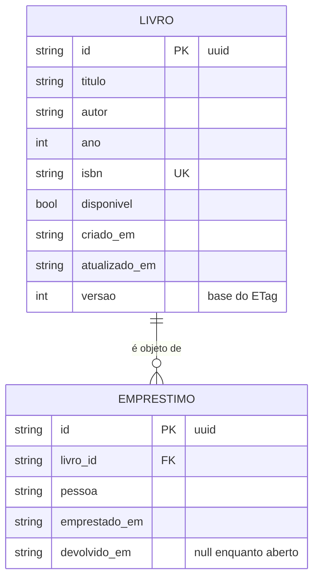

# Projeto-modelo — API de Biblioteca

`Nível: intermediário` · `Atualizado: 11/08/2026` · `Node.js 24 LTS · zero dependências`

Uma API REST **pequena, mas inteira**, que roda de verdade. Não é um trecho: tem contrato
OpenAPI, autenticação, autorização por escopo, paginação por cursor, cache condicional,
concorrência otimista, idempotência, rate limiting, erros padronizados, observabilidade,
desligamento gracioso e **50 testes que passam**.

---

## 1. O que a API faz

Uma biblioteca gerencia **livros** e **empréstimos**.

- Qualquer cliente autenticado **lê** o catálogo.
- Um cliente com escopo `livros:escrever` **cria e altera** livros.
- Um cliente com escopo `emprestimos:escrever` **registra empréstimos e devoluções**.
- Um livro emprestado não pode ser emprestado de novo.



---

## 2. Por que zero dependências

**Decisão consciente, com trade-off declarado.**

| A favor | Contra |
|---|---|
| Roda com `node servidor.js`, sem `npm install`, sem rede | mais código escrito à mão |
| Nenhuma vulnerabilidade de terceiro para acompanhar | você reimplementa roteamento e validação |
| Você **vê** o HTTP, não a abstração do framework | não é o que você faria no trabalho |
| Sobrevive a mudanças de ecossistema | perde recursos prontos |

**Em produção você usaria um framework.** O Exemplo 15 de
[../06-exemplos.md](../06-exemplos.md) mostra a mesma ideia com Fastify, com o contrato
OpenAPI gerado automaticamente. Este projeto existe para você **entender o que o framework
faz por você** antes de deixá-lo fazer.

---

## 3. Como rodar — comandos exatos

### Pré-requisitos

| Item | Versão mínima | Verificar com |
|---|---|---|
| Node.js | 22 (testado em **24.18.0**) | `node --version` |
| curl | 8.x | `curl --version` |
| jq | 1.7 (opcional, para ler a saída) | `jq --version` |

Nada mais. Sem `npm install`, sem banco, sem Docker.

### Rodar

```bash
cd 07-projeto-modelo
node src/servidor.js
```

Saída esperada:
```text
{"nivel":"info","msg":"servidor iniciado","porta":3000,"ambiente":"development","pid":12345}
API      → http://localhost:3000
Contrato → http://localhost:3000/openapi.json
Saúde    → http://localhost:3000/health
Tokens de exemplo:
  leitor        (livros:ler emprestimos:ler)                       → tok_leitor_demo
  bibliotecario (livros:* emprestimos:*)                           → tok_biblio_demo
```

### Testar

```bash
node --test        # ou: npm test
```

Saída esperada:
```text
ℹ tests 50
ℹ suites 8
ℹ pass 50
ℹ fail 0
```

### Exercitar na mão

```bash
export TOKEN=tok_biblio_demo
BASE=http://localhost:3000
```

```bash
# 1. Sonda de saúde — sem autenticação
curl -s $BASE/health | jq
```
```bash
# 2. Sem token → 401 com WWW-Authenticate
curl -s -i $BASE/livros | head -3
```
```bash
# 3. Listar (paginação por cursor)
curl -s -H "Authorization: Bearer $TOKEN" "$BASE/livros?limite=2" | jq
```
```bash
# 4. Criar (idempotente)
CHAVE=$(cat /proc/sys/kernel/random/uuid 2>/dev/null || uuidgen)
curl -s -i -X POST $BASE/livros \
  -H "Authorization: Bearer $TOKEN" \
  -H 'Content-Type: application/json' \
  -H "Idempotency-Key: $CHAVE" \
  -d '{"titulo":"Iracema","autor":"José de Alencar","ano":1865,"isbn":"9788535911404"}' | head -6

# repita o comando: mesmo id, sem duplicar
```
```bash
# 5. Cache condicional
ID=$(curl -s -H "Authorization: Bearer $TOKEN" "$BASE/livros?limite=1" | jq -r '.dados[0].id')
ETAG=$(curl -s -D - -o /dev/null -H "Authorization: Bearer $TOKEN" $BASE/livros/$ID \
       | grep -i '^etag:' | tr -d '\r' | cut -d' ' -f2)
curl -s -o /dev/null -w '%{http_code}\n' -H "Authorization: Bearer $TOKEN" \
     -H "If-None-Match: $ETAG" $BASE/livros/$ID     # esperado: 304
```
```bash
# 6. Concorrência otimista
curl -s -o /dev/null -w '%{http_code}\n' -X PATCH $BASE/livros/$ID \
  -H "Authorization: Bearer $TOKEN" -H 'Content-Type: application/json' \
  -d '{"ano":1866}'                                 # esperado: 428 (falta If-Match)

curl -s -o /dev/null -w '%{http_code}\n' -X PATCH $BASE/livros/$ID \
  -H "Authorization: Bearer $TOKEN" -H 'Content-Type: application/json' \
  -H "If-Match: $ETAG" -d '{"ano":1866}'            # esperado: 200
```
```bash
# 7. Escopo insuficiente → 403
curl -s -X POST $BASE/livros -H "Authorization: Bearer tok_leitor_demo" \
  -H 'Content-Type: application/json' -H "Idempotency-Key: $(cat /proc/sys/kernel/random/uuid)" \
  -d '{"titulo":"x","autor":"y"}' | jq -r .title    # esperado: Escopo insuficiente
```
```bash
# 8. Emprestar e tentar emprestar de novo → 409
curl -s -X POST $BASE/emprestimos -H "Authorization: Bearer $TOKEN" \
  -H 'Content-Type: application/json' -H "Idempotency-Key: $(cat /proc/sys/kernel/random/uuid)" \
  -d "{\"livro_id\":\"$ID\",\"pessoa\":\"Ana\"}" | jq -r .id

curl -s -X POST $BASE/emprestimos -H "Authorization: Bearer $TOKEN" \
  -H 'Content-Type: application/json' -H "Idempotency-Key: $(cat /proc/sys/kernel/random/uuid)" \
  -d "{\"livro_id\":\"$ID\",\"pessoa\":\"Bruno\"}" | jq -r .title   # esperado: Livro indisponivel
```
```bash
# 9. Rate limit — dispare 200 chamadas
for i in $(seq 1 200); do
  curl -s -o /dev/null -w '%{http_code}\n' -H "Authorization: Bearer $TOKEN" $BASE/livros
done | sort | uniq -c                                # esperado: mistura de 200 e 429
```
```bash
# 10. O contrato
curl -s $BASE/openapi.json | jq '.openapi, .info.version, (.paths | keys)'
```

---

## 4. Estrutura de pastas — comentada

```text
07-projeto-modelo/
├── README.md                  ← este arquivo
├── package.json               ← só metadados e scripts; NENHUMA dependência
├── .env.example               ← quais variáveis existem (sem os valores)
├── openapi.yaml               ← o CONTRATO, escrito à mão (design-first)
├── requisicoes.http           ← requisições executáveis (extensão REST Client)
├── Dockerfile                 ← imagem mínima, usuário não-root
├── src/
│   ├── servidor.js            ← composição: junta tudo e sobe o HTTP
│   ├── roteador.js            ← roteamento por padrão de caminho
│   ├── http.js                ← utilidades: responder, ler corpo, negociação
│   ├── problemas.js           ← catálogo de erros RFC 9457
│   ├── log.js                 ← log estruturado em JSON + request-id
│   ├── validacao.js           ← validador de JSON Schema
│   ├── esquemas.js            ← os schemas (uma fonte da verdade)
│   ├── repositorio.js         ← armazenamento em memória
│   └── middlewares/
│       ├── autenticacao.js    ← Bearer token → identidade + escopos
│       ├── rateLimit.js       ← janela deslizante por cliente
│       └── idempotencia.js    ← Idempotency-Key
└── test/
    ├── api.test.js            ← 42 testes de comportamento HTTP, em 8 grupos
    └── unidade.test.js        ← 8 testes das partes puras (rodam em milissegundos)
```

---

## 5. O que cada decisão de projeto ensina

### 5.1 Paginação por cursor, não por offset

`GET /livros?limite=20&cursor=<opaco>` devolve `proximo_cursor`.

O cursor é o `id` do último item, codificado em base64url. **Codificar é deliberado:** um
cursor opaco impede o cliente de construí-lo à mão e de depender do seu formato interno —
o que te deixa mudar a implementação depois. É o mesmo princípio de encapsulamento das
linguagens de programação, aplicado a um contrato de rede.

Ver [../06-exemplos.md](../06-exemplos.md) §2 para a demonstração de por que offset duplica.

### 5.2 ETag derivado do conteúdo, não da hora

`etagDe(livro)` faz SHA-256 do JSON canônico. Consequências:

- duas réplicas do servidor geram **o mesmo ETag** para o mesmo conteúdo (com
  `Last-Modified` você dependeria de relógios sincronizados);
- salvar sem alterar nada **não invalida** o cache dos clientes;
- serve para as duas coisas: cache (`If-None-Match` → `304`) e concorrência
  (`If-Match` → `412`).

### 5.3 Idempotência como middleware, não como regra em cada rota

`middlewares/idempotencia.js` guarda `(chave → status, corpo, impressão do pedido)`.
Aplicado a todo `POST`. Deixar isso no middleware significa que **é impossível esquecer**
numa rota nova — o tipo de garantia estrutural que vale mais que disciplina.

> **Limite honesto deste projeto:** o registro vive em memória. Com duas réplicas, cada uma
> tem o seu, e a idempotência quebra. Em produção: Redis com TTL, ou uma tabela com
> `UNIQUE` na chave. Isso está marcado com `TODO(producao)` no código.

### 5.4 Erros como catálogo, não como strings soltas

`problemas.js` centraliza os tipos. Cada um tem `type` (URI estável, contrato de máquina),
`title` (estável, para humanos) e `detail` (variável). O cliente programa contra o `type`.

Ver [../06-exemplos.md](../06-exemplos.md) §7.

### 5.5 Log estruturado com request-id

Toda requisição ganha um `X-Request-Id` (o do cliente, se vier; senão um novo). Ele vai:
no log de todas as linhas daquela requisição, no cabeçalho da resposta, e no campo
`instance` do erro.

**É o que transforma "deu erro ontem" em uma linha de log encontrável.** Sem isso, o suporte
não tem por onde começar.

### 5.6 O contrato é escrito à mão (design-first)

`openapi.yaml` é escrito **antes** do código, versionado, e revisado em pull request.
Um teste (`api.test.js`) verifica que **toda rota implementada existe no contrato** — o que
impede a divergência que torna documentação pior que inútil.

Ver a comparação design-first × code-first em [../06-exemplos.md](../06-exemplos.md) §15.

### 5.7 O que projetos reais têm e tutoriais omitem

| Item | Onde está |
|---|---|
| **Limite de tamanho do corpo** | `http.js` — sem ele, um POST de 2 GB derruba o processo |
| **Timeout de requisição** | `servidor.js` — `requestTimeout` e `headersTimeout` |
| **Desligamento gracioso** | `servidor.js` — `SIGTERM` para de aceitar e drena as conexões |
| **Sonda de saúde** | `/health` (vivo) e `/health/pronto` (pronto para receber tráfego) |
| **Erro genérico ao cliente, detalhado no log** | `http.js` — nunca vaze stack trace |
| **`Vary` correto** | `http.js` — `Vary: Authorization` em resposta cacheável |
| **Rate limit com cabeçalhos** | `rateLimit.js` — `RateLimit-*` e `Retry-After` |
| **Sem segredo no código** | `.env.example`; tokens de demo só com `NODE_ENV != production` |
| **Comparação em tempo constante** | `autenticacao.js` — `timingSafeEqual` |
| **`Cache-Control: no-store` em rota autenticada por padrão** | `http.js` |
| **Teste de caminho de erro** | `test/api.test.js` — a maioria dos 42 testes |

### 5.8 O que este projeto deliberadamente **não** faz

- **Persistência.** Tudo em memória. Trocar por SQLite ou Postgres é o Exercício 4.
- **OAuth completo.** Tokens são opacos, comparados contra um registro. O fluxo OAuth
  completo está em [../06-exemplos.md](../06-exemplos.md) §9.
- **HTTPS.** Em produção, TLS termina no proxy/gateway à frente.
- **Versionamento por caminho.** Só há a v1. O tratamento está em
  [../18-operacao-e-ciclo-de-vida.md](../18-operacao-e-ciclo-de-vida.md).
- **Métricas Prometheus, tracing distribuído.** Ver
  [../18-operacao-e-ciclo-de-vida.md](../18-operacao-e-ciclo-de-vida.md) §2.

---

## 6. Roteiro de exploração

Leia nesta ordem — é a ordem em que a requisição flui:

1. `openapi.yaml` — o contrato. **Comece pelo contrato, sempre.**
2. `src/servidor.js` — como tudo se junta.
3. `src/roteador.js` — como o caminho vira uma função.
4. `src/middlewares/` — o que roda antes de toda rota.
5. `src/http.js` e `src/problemas.js` — como a resposta é montada.
6. `src/esquemas.js` e `src/validacao.js` — como a entrada é conferida.
7. `src/repositorio.js` — onde os dados vivem.
8. `test/api.test.js` — o contrato, escrito como teste.

---

## 7. Exercícios

1. **Fácil.** Adicione o campo `editora` (opcional, máx. 120 caracteres): schema, contrato,
   teste.
2. **Fácil.** Implemente `GET /livros/{id}/emprestimos` com paginação.
3. **Médio.** Adicione `DELETE /livros/{id}`, mas recuse com `409` se houver empréstimo
   aberto. Escreva o teste do caso de erro **antes** do código.
4. **Médio.** Troque o repositório em memória por **SQLite** (`node:sqlite`, nativo no
   Node 22+). Os testes devem continuar passando **sem alteração** — se precisarem mudar,
   sua camada de repositório estava vazando detalhes.
5. **Médio.** Faça o rate limit devolver os cabeçalhos no formato da IETF
   (`RateLimit: limit=100, remaining=42, reset=30`) além dos `X-RateLimit-*`.
6. **Difícil.** Adicione um endpoint SSE `/eventos` que emite `livro.emprestado` e
   `livro.devolvido` (modelo em [../06-exemplos.md](../06-exemplos.md) §11).
7. **Difícil.** Mova a idempotência para fora do processo (SQLite ou Redis) e prove, com
   um teste, que duas instâncias compartilham o registro.
8. **Difícil.** Escreva um teste que lê o `openapi.yaml` e valida **toda resposta** da suíte
   contra o schema declarado. Isso captura divergência contrato × implementação de forma
   automática.

---

## 8. Solução de problemas

| Sintoma | Causa | Correção |
|---|---|---|
| `EADDRINUSE :::3000` | a porta já está ocupada | `PORT=3001 node src/servidor.js`, ou mate o processo |
| `401` mesmo com token | falta o prefixo `Bearer ` | `-H "Authorization: Bearer $TOKEN"` |
| `403` em vez de `401` | o token vale, o escopo não | use `tok_biblio_demo` |
| `428` no `PATCH` | falta `If-Match` — é de propósito | faça um `GET`, pegue o `ETag`, envie-o |
| `412` no `PATCH` | alguém alterou antes de você | releia e refaça |
| `429` nos testes | rate limit compartilhado entre testes | cada teste usa um token/porta própria; ver `test/api.test.js` |
| Testes falham com `ECONNREFUSED` | o servidor não subiu a tempo | a sonda em `before()` espera até 5 s; aumente se a máquina for lenta |
| `SyntaxError: Cannot use import` | falta `"type": "module"` | já está no `package.json`; confira que você não o apagou |

---

## 9. Verificação (11/08/2026)

O que foi **executado** durante a escrita deste projeto:

```text
node --version   → v24.18.0
node --test
  ℹ tests 50
  ℹ suites 8
  ℹ pass 50
  ℹ fail 0
```

Os comandos `curl` da §3 foram executados contra o servidor local e as saídas conferem.
O `Dockerfile` **não foi construído** no ambiente de escrita (sem Docker disponível) —
trate-o como revisado, não como testado.

---

## Autoteste

1. Por que o cursor de paginação é opaco (base64), e não o id cru?
2. Por que o ETag é derivado do conteúdo e não do horário de alteração?
3. Por que a idempotência é um middleware e não uma regra em cada rota?
4. O que o `X-Request-Id` resolve, e por que ele aparece em três lugares?
5. Qual é a limitação da idempotência deste projeto, e como se resolve em produção?
6. Quais três coisas este projeto tem que um tutorial típico omitiria?
7. No Exercício 4, por que os testes **não** deveriam precisar mudar?
