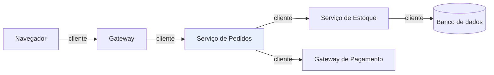
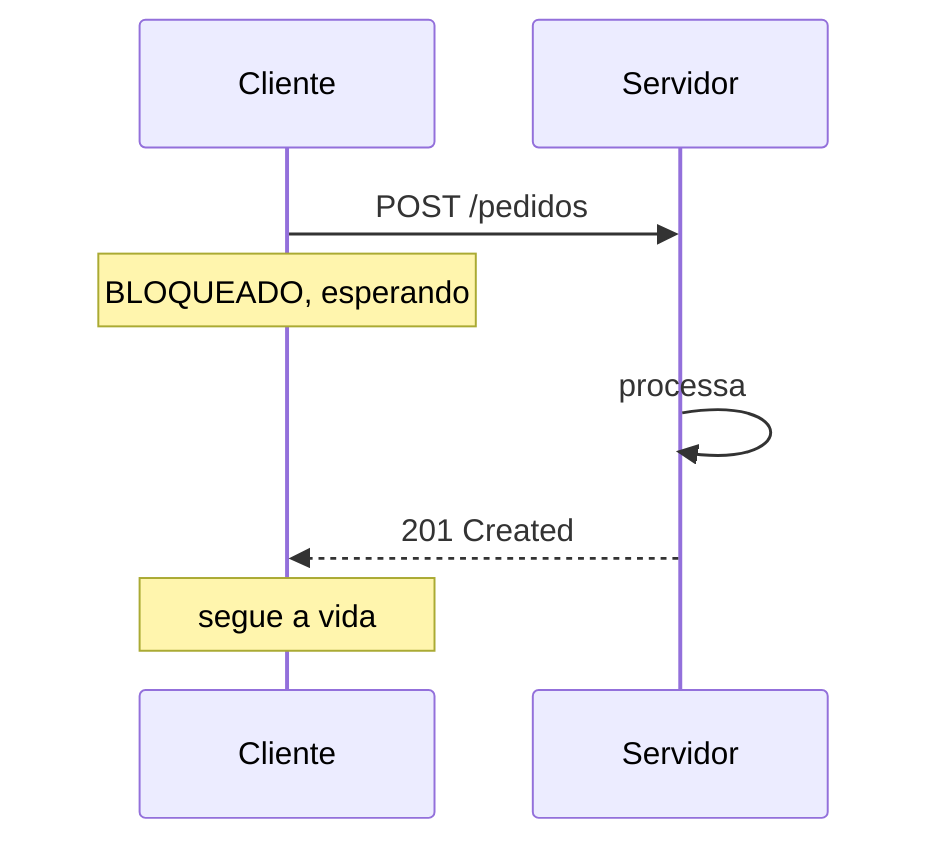
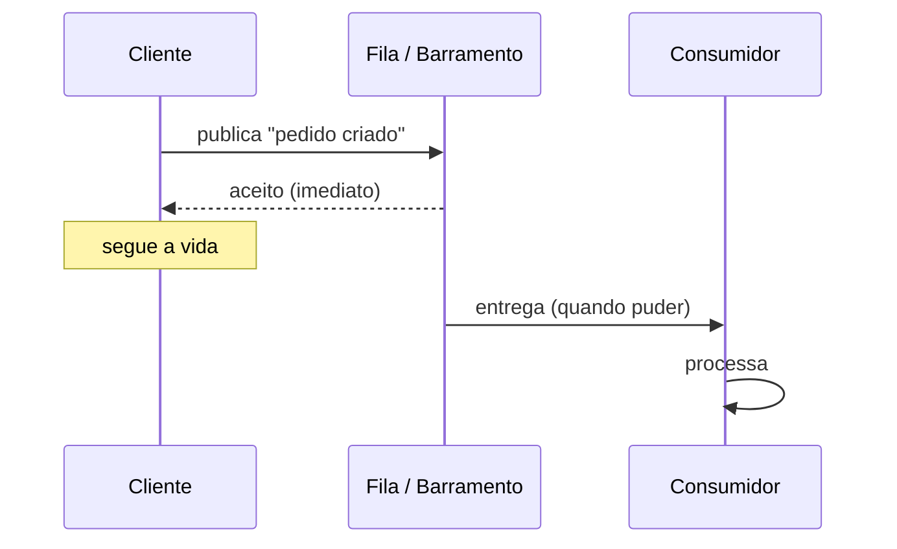

# 10 · Fundamentos

`Nível: iniciante → intermediário` · `Atualizado: 11/08/2026`

Os modelos mentais sem os quais o resto não faz sentido.

---

## 1. Interface, contrato, implementação

Três palavras que parecem sinônimos e não são.

| Termo | O que é | Exemplo |
|---|---|---|
| **Interface** | a superfície de contato: o que se pode pedir | a maçaneta |
| **Contrato** | interface + as promessas sobre comportamento | "girar abre a porta; se estiver trancada, não gira" |
| **Implementação** | como é feito por dentro | a fechadura, a mola, os pinos |

**Uma API é o contrato.** A implementação é o que fica escondido — e é justamente essa
ocultação que dá valor à API: você pode trocar a fechadura sem trocar a maçaneta.

**O que faz parte do contrato** (e portanto não pode mudar sem aviso):

- os nomes das operações e dos campos;
- os tipos e as faixas de valores aceitos;
- o significado de cada operação;
- os erros possíveis e quando ocorrem;
- as garantias: é idempotente? é atômico? qual a ordem?
- **o comportamento observável**, mesmo o não documentado.

Esse último item é a **Lei de Hyrum**, e merece um parágrafo:

> *Com um número suficiente de usuários de uma API, não importa o que você promete no
> contrato: todos os comportamentos observáveis do seu sistema serão dependidos por alguém.*
> — Hyrum Wright

Na prática: se sua API sempre devolveu os resultados ordenados por data, alguém dependeu
disso, mesmo sem você nunca ter prometido. No dia em que a ordem mudar, você quebrou um
cliente — e ele vai reclamar, com razão prática, ainda que sem razão contratual. É por isso
que se **documenta o que não se garante**: "a ordem não é garantida" é uma frase que
economiza anos.

---

## 2. API, web API, REST: gênero e espécie

Retomando o [01-introducao-leigo.md](01-introducao-leigo.md) §6 com mais precisão:

| Nível | Definição | Exemplo |
|---|---|---|
| **API** | qualquer contrato entre softwares | `Math.max()`, `open()`, uma API REST |
| **API remota** | API cujas chamadas atravessam a rede | REST, gRPC, SOAP, GraphQL |
| **Web API** | API remota sobre HTTP | REST, GraphQL, SOAP sobre HTTP |
| **REST** | web API que respeita as 6 restrições de Fielding | poucas, de verdade |
| **"REST"** (uso comum) | JSON sobre HTTP com URLs de recursos | quase todas |

**A confusão é tão generalizada que virou vocabulário.** Quando alguém diz "API REST" numa
vaga de emprego ou numa reunião, 95% das vezes quer dizer a última linha. Saber disso evita
tanto o pedantismo quanto o mal-entendido.

---

## 3. Cliente e servidor: os papéis, não as máquinas

**Cliente** é quem inicia a requisição. **Servidor** é quem responde.

São **papéis numa conversa**, não tipos de máquina. O mesmo processo pode ser servidor de
uma API e cliente de três outras — e é exatamente isso que acontece num sistema de
microsserviços.



O *Serviço de Pedidos* é **servidor** para o gateway e **cliente** de dois outros
serviços — ao mesmo tempo, na mesma requisição.

**Consequência prática que muita gente demora a internalizar:** a latência que o usuário
sente é a **soma** da cadeia. Se cada salto leva 50 ms e há 5 saltos em série, são 250 ms —
antes de qualquer processamento. É por isso que chamadas em paralelo, cache e limitar a
profundidade da cadeia são decisões de arquitetura, não otimizações tardias.

---

## 4. Síncrono vs. assíncrono: o eixo mais importante

Esta distinção é mais estrutural do que a escolha entre REST, gRPC ou GraphQL.

### 4.1 Síncrono — "pergunto e espero"



| A favor | Contra |
|---|---|
| simples de entender e depurar | o cliente fica preso ao tempo do servidor |
| resposta imediata | se o servidor cai, o cliente falha junto |
| erro aparece na hora | a disponibilidade dos dois se multiplica |

**O ponto sobre disponibilidade merece o número:** se A depende sincronamente de B, e cada
um tem 99,9% de disponibilidade, o conjunto tem **99,8%** (0,999 × 0,999). Com cinco
dependências em série: **99,5%** — de 8,7 horas de indisponibilidade por ano para 43 horas.
Acoplamento síncrono **multiplica falhas**.

### 4.2 Assíncrono — "aviso e sigo"



| A favor | Contra |
|---|---|
| o cliente não espera | você não sabe **quando** vai acontecer |
| absorve pico de carga (a fila enfileira) | erro aparece depois, longe de quem causou |
| se o consumidor cai, a mensagem espera | a ordem raramente é garantida |
| desacopla os ciclos de release | depurar exige rastreamento distribuído |

### 4.3 Como escolher

| Pergunta | Se sim → |
|---|---|
| O usuário precisa da resposta **agora** para continuar? | síncrono |
| A operação leva mais de ~2 segundos? | assíncrono |
| A carga tem picos que o consumidor não absorve? | assíncrono |
| Falha do outro lado pode derrubar você? | assíncrono |
| Precisa de resposta imediata **e** processamento longo? | **híbrido**: `202 Accepted` + polling ou webhook |

**O padrão híbrido, que resolve a maioria dos casos difíceis:**

```http
POST /relatorios
→ 202 Accepted
  Location: /relatorios/abc123
  Retry-After: 5

GET /relatorios/abc123
→ 200 { "status": "processando", "progresso": 0.4 }
...
→ 200 { "status": "pronto", "url": "https://.../abc123.pdf" }
```

Isso mantém a interface HTTP síncrona e o processamento assíncrono. É o desenho correto
para exportação, geração de relatório e qualquer coisa demorada.

---

## 5. Acoplamento — a métrica que decide a qualidade da sua API

**Acoplamento** é o quanto uma mudança de um lado força mudança do outro. É o critério
central para julgar um desenho de API.

| Tipo | Descrição | Como reduzir |
|---|---|---|
| **De formato** | o cliente quebra se o JSON mudar de forma | evolução compatível; campos opcionais |
| **Temporal** | os dois precisam estar no ar ao mesmo tempo | mensageria, fila |
| **De implementação** | o contrato expõe detalhes internos | modele o **domínio**, não a tabela |
| **De localização** | o cliente conhece IP e porta fixos | DNS, service discovery, gateway |
| **Semântico** | o cliente reimplementa a sua regra de negócio | exponha **intenção**, não estado cru |

**O acoplamento semântico é o pior e o menos percebido.** Exemplo:

```http
❌ PATCH /pedidos/42  { "status": "CANCELADO", "estoque_devolvido": true,
                        "cobranca_estornada": true }
```
Aqui o **cliente** precisa saber que cancelar envolve devolver estoque e estornar cobrança.
Se a regra mudar, todos os clientes mudam.

```http
✅ POST /pedidos/42/cancelamento  { "motivo": "cliente desistiu" }
```
Aqui o cliente expressa **intenção**; o servidor conhece as consequências. Mudou a regra?
Muda um lugar só.

> **Isto é o coração do bom design de API**, e é o que separa uma API que envelhece bem de
> uma que precisa ser reescrita a cada dois anos. Voltamos a ele em
> [14-design-de-api-rest.md](14-design-de-api-rest.md) §3.

---

## 6. Recurso, representação, estado

Três termos do vocabulário REST que valem além dele.

- **Recurso** — a *coisa* de que se fala: "o pedido 42". É abstrato e tem identidade estável.
- **Representação** — uma *forma concreta* daquela coisa: o JSON, o XML, o PDF, o HTML.
- **Estado** — os valores naquele momento: `{"status": "pago", "total": 4790}`.

**Um recurso pode ter várias representações.** A mesma URL pode devolver JSON ou PDF,
conforme o `Accept` do cliente. É a **negociação de conteúdo**:

```bash
curl -H 'Accept: application/json' https://api.exemplo.com/faturas/42   # JSON
curl -H 'Accept: application/pdf'  https://api.exemplo.com/faturas/42   # PDF
```

**Por que a distinção importa:** ela separa **identidade** de **formato**. A URL identifica
o recurso; o `Accept` escolhe a representação. Isso permite adicionar formatos novos sem
criar URLs novas — e é a razão de `/faturas/42.pdf` ser considerado inferior a
`/faturas/42` com negociação.

*(Na prática, `.pdf` na URL é comum e funciona. É pior por acoplar formato à identidade,
mas é mais fácil de usar num navegador. Trade-off legítimo, decidido caso a caso.)*

---

## 7. Estado: no servidor ou na requisição?

**Sem estado** (*stateless*) significa: **cada requisição carrega tudo que o servidor
precisa para atendê-la.** O servidor não guarda contexto entre requisições.

```http
❌ Com estado no servidor
POST /login          → o servidor guarda "sessão 7 = Maria" na memória
GET  /meus-pedidos   → o servidor lembra que a sessão 7 é a Maria

✅ Sem estado
GET /meus-pedidos
Authorization: Bearer <token que já identifica a Maria>
```

**Por que isso importa tanto:**

| Consequência | Detalhe |
|---|---|
| **Escala horizontal trivial** | qualquer réplica atende qualquer requisição |
| Sem sessão pegajosa | o balanceador não precisa mandar você sempre ao mesmo servidor |
| Reinício não derruba ninguém | não há memória a perder |
| Cache funciona | a resposta depende só da requisição |
| Depuração simples | uma requisição contém tudo |

**O custo:** cada requisição carrega mais dados (o token, os filtros, a paginação).
Em troca, você ganha a capacidade de multiplicar servidores sem coordenação.

> **Nota importante:** "sem estado" não significa "sem banco de dados". O banco é **estado
> do recurso**, e é normal. O que não pode haver é **estado da conversa** guardado no
> processo do servidor. A distinção é essa.

---

## 8. Idempotência e segurança — os dois adjetivos que decidem a retentativa

| Propriedade | Significa | Métodos HTTP |
|---|---|---|
| **Seguro** | não altera nada | `GET`, `HEAD`, `OPTIONS` |
| **Idempotente** | repetir = fazer uma vez | `GET`, `HEAD`, `PUT`, `DELETE`, `OPTIONS` |
| Nenhum dos dois | — | `POST`, `PATCH` |

**Por que isto é o conceito mais prático deste arquivo:**

Numa rede, quando você não recebe resposta, **você não sabe** se a operação aconteceu.
As duas hipóteses são indistinguíveis:

```text
Hipótese A: a requisição não chegou    → retentar é correto
Hipótese B: chegou e a resposta se perdeu → retentar duplica
```

Se a operação é **idempotente**, você não precisa distinguir: retente. Se não é, você
precisa de um mecanismo — a **chave de idempotência** — para tornar-la idempotente
artificialmente. Ver [06-exemplos.md](06-exemplos.md) §5 e
[60-teoria-avancada.md](60-teoria-avancada.md) §4.

**Nunca use `GET` para alterar estado.** Não é convenção estética: o pré-carregador do
navegador, o antivírus corporativo, o proxy e o robô de indexação **fazem `GET` sozinhos**,
porque `GET` é seguro por contrato. Um `GET /usuarios/42/apagar` será executado sem que
ninguém clique. Isso já aconteceu com empresas grandes.

---

## 9. Versionamento: o problema que não tem solução boa

Toda API muda. A pergunta é como mudar sem quebrar quem já usa.

**Mudanças compatíveis** (o cliente antigo continua funcionando):
- adicionar um campo **opcional** na resposta;
- adicionar um parâmetro **opcional** na requisição;
- adicionar um endpoint novo;
- adicionar um valor novo a um enum **de resposta**, se o cliente foi orientado a tolerar.

**Mudanças quebradoras** (o cliente antigo para):
- remover ou renomear um campo;
- mudar o tipo de um campo (`"42"` → `42`);
- tornar obrigatório um campo antes opcional;
- mudar o significado de um valor;
- mudar um código de status;
- **tornar mais rígida** uma validação;
- mudar a ordem quando alguém dependia dela (Lei de Hyrum, §1).

As estratégias e seus trade-offs estão em
[18-operacao-e-ciclo-de-vida.md](18-operacao-e-ciclo-de-vida.md) §4. Por ora, a regra:

> **Adicionar é barato. Remover é caro. Renomear é remover + adicionar.**
> Pense duas vezes antes de nomear um campo, porque o nome é para sempre.

---

## 10. Os cinco porquês: por que APIs web usam HTTP?

**1. Por que quase toda API remota é sobre HTTP, e não sobre um protocolo binário próprio?**
Porque HTTP atravessa firewall. A porta 443 está aberta em toda rede corporativa do mundo;
qualquer outra porta exige aprovação, ticket e negociação.

**2. Por que a porta 443 está aberta em toda parte?**
Porque a web existe. Bloqueá-la significa bloquear o acesso a sites, o que nenhuma empresa
faz. É uma consequência não planejada da adoção da web nos anos 90.

**3. Além do firewall, o que mais HTTP traz de graça?**
Uma pilha inteira já construída e operada: TLS, cache, proxy reverso, balanceador de carga,
CDN, compressão, autenticação, ferramentas de depuração, bibliotecas em toda linguagem, e
programadores que já sabem tudo isso. Construir o equivalente sobre TCP cru é anos de
trabalho.

**4. Mas HTTP não é ineficiente para chamadas internas?**
É, e essa é uma crítica correta. Cabeçalhos em texto, uma requisição por resposta em
HTTP/1.1, JSON verboso. Foi exatamente para isso que gRPC (HTTP/2 + binário) foi criado —
e por isso ele domina a **comunicação interna**, onde firewall e navegador não são
problema, e a eficiência é.

**5. E por que HTTP venceu mesmo assim, na borda?**
Porque o gargalo de adoção de uma tecnologia raramente é a eficiência — é o **custo de
integração**. Uma API que qualquer pessoa consegue chamar com `curl` no primeiro minuto tem
mais consumidores do que uma 40% mais eficiente que exige gerar código a partir de um
`.proto`. **HTTP venceu por acessibilidade, não por mérito técnico.** Esta é minha leitura
profissional; a evidência é o arranjo dominante hoje: REST na borda, gRPC por dentro.

*(Paradas legítimas: consequência histórica documentada e trade-off econômico explícito.)*

---

## 11. Erros de modelo mental que custam caro

| Você pensa | A realidade |
|---|---|
| "A rede é confiável" | É a primeira das **oito falácias da computação distribuída** ([60](60-teoria-avancada.md) §1) |
| "Chamar a API é como chamar uma função" | É ~1.000.000× mais lento e pode falhar de formas que uma função não pode |
| "Se não recebi resposta, não aconteceu" | Pode ter acontecido. Você não tem como saber |
| "200 significa sucesso" | Significa que o HTTP funcionou. O corpo pode conter um erro |
| "Vou versionar depois" | Depois é tarde; o primeiro consumidor já congelou o contrato |
| "REST é o jeito certo" | É *um* estilo, ótimo para alguns casos e ruim para outros |
| "Microsserviços resolvem acoplamento" | Transformam acoplamento de código em acoplamento de rede, que é pior de depurar |
| "Documentação eu escrevo no fim" | Ela diverge do código em semanas. Gere-a do contrato |
| "O cliente vai ler a documentação" | Ele vai copiar o exemplo. Faça o exemplo estar certo |

---

## Autoteste

1. Qual a diferença entre interface, contrato e implementação? O que a Lei de Hyrum acrescenta?
2. Explique por que cliente e servidor são papéis e não máquinas. Dê um exemplo com três serviços.
3. Cinco dependências síncronas de 99,9% cada dão qual disponibilidade? Por que isso importa?
4. Descreva o padrão híbrido `202 Accepted`. Que problema ele resolve?
5. Cite os cinco tipos de acoplamento. Qual é o pior e por quê?
6. Reescreva `PATCH /pedidos/42 {"status":"CANCELADO", ...}` reduzindo o acoplamento semântico.
7. Qual a diferença entre recurso, representação e estado? Como a negociação de conteúdo usa isso?
8. "Sem estado" proíbe usar banco de dados? Explique a distinção.
9. Por que um método idempotente pode ser retentado automaticamente e um não-idempotente não?
10. Por que APIs web usam HTTP? Vá até o quarto "porquê".
