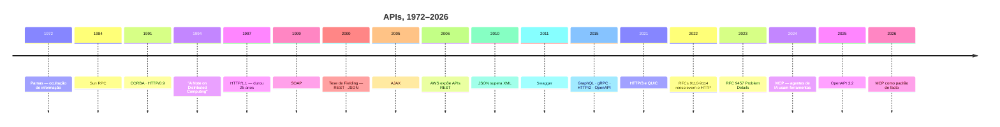

# 11 · História

`Nível: iniciante → intermediário` · `Atualizado: 11/08/2026`

Quase toda esquisitice das APIs de hoje tem uma data e um motivo. Conhecê-los é o que
separa quem decora regras de quem prevê consequências.

---

## 1. Antes da rede: a API como chamada de biblioteca (1950–1980)

A palavra "API" é anterior à internet. Ela nasce da ideia de **biblioteca de sub-rotinas**:
código escrito uma vez, chamado por muitos programas.

| Marco | O que trouxe |
|---|---|
| **Anos 1950–60** | sub-rotinas reutilizáveis; a ideia de "não reescrever o que já existe" |
| **1968** — *A ideia de interface como contrato* | discussões seminais sobre modularidade |
| **1972** — Parnas, *On the Criteria To Be Used in Decomposing Systems into Modules* | **o artigo fundador**: módulos devem esconder decisões que podem mudar |
| **1970s** — Unix | syscalls (`open`, `read`, `write`) e a API mais duradoura da computação |

**O artigo de David Parnas (1972) é a origem intelectual de tudo neste material.**
A tese: um módulo deve **esconder** as decisões que provavelmente vão mudar, expondo apenas
o que é estável. Isso é exatamente o que uma API faz — e é por isso que expor a estrutura da
sua tabela numa API é um erro conceitual de 50 anos de idade.

---

## 2. A rede entra: RPC (1980–1995)

A ideia natural: **se posso chamar uma função local, por que não uma remota?**

| Ano | Tecnologia | Ideia |
|---|---|---|
| 1984 | **Sun RPC** | chamada remota de procedimento; base do NFS |
| 1991 | **CORBA** | objetos distribuídos, independentes de linguagem |
| ~1993 | **DCE/RPC**, **DCOM** (Microsoft) | RPC corporativo |
| 1997 | **Java RMI** | objetos remotos em Java |

**Todos falharam em escala global, e o motivo importa.**

Em 1994, Waldo, Wyant, Wollrath e Kendall publicaram ***A Note on Distributed Computing***,
um dos artigos mais importantes da área. A tese, em uma frase:

> **A tentativa de fazer uma chamada remota parecer uma chamada local é fundamentalmente
> equivocada**, porque as duas diferem em quatro dimensões que não podem ser abstraídas:
> **latência**, **memória (ponteiros não atravessam a rede)**, **falha parcial** e
> **concorrência**.

Uma chamada local ou funciona ou o programa inteiro morre. Uma chamada remota pode
**demorar, falhar sozinha, ou você nunca saber se aconteceu**. Esconder isso atrás de uma
sintaxe idêntica à de uma função faz o programador esquecer de tratar o que só existe na
rede.

**Isso ecoa até hoje.** É a razão de gRPC, apesar de ser RPC, expor explicitamente
*deadlines*, *cancelamento* e códigos de erro de rede — em vez de fingir que a chamada é
local.

---

## 3. A web muda tudo (1990–2000)

| Ano | Marco |
|---|---|
| 1989–91 | Tim Berners-Lee cria a web no CERN |
| 1991 | **HTTP/0.9** — só `GET`, sem cabeçalhos, sem status |
| 1996 | **HTTP/1.0** (RFC 1945) — métodos, cabeçalhos, códigos de status |
| **1997/1999** | **HTTP/1.1** (RFC 2068 / 2616) — conexões persistentes, `Host`, cache. **Durou 25 anos** |
| 1998 | **XML** 1.0 (W3C) |
| 1998 | **XML-RPC** — Dave Winer: RPC sobre HTTP com XML |
| 1999 | **SOAP** 1.0 — a evolução formal do XML-RPC |

**Por que HTTP/1.1 durou tanto:** ele resolveu o suficiente. Conexões persistentes
(*keep-alive*) eliminaram o custo de abrir TCP a cada arquivo; o cabeçalho `Host` permitiu
vários sites por IP — sem o qual a web não teria escalado; e o modelo de cache com
`ETag`/`Last-Modified` continua sendo o mesmo hoje.

---

## 4. 2000: os dois caminhos se separam

Dois eventos no mesmo ano, com destinos opostos.

### 4.1 SOAP e o WS-*

SOAP (*Simple Object Access Protocol* — o "simple" envelheceu mal) padroniza envelopes XML
sobre HTTP, com **WSDL** descrevendo o contrato e uma constelação de padrões em volta:
WS-Security, WS-Addressing, WS-ReliableMessaging, WS-Transaction…

| A favor | Contra |
|---|---|
| contrato formal e verificável (WSDL) | verboso: um envelope de 800 bytes para enviar 20 |
| geração de código madura | complexidade explosiva do "WS-*" |
| transações, segurança em nível de mensagem | difícil de depurar à mão |
| independente de transporte | curva de aprendizado alta |

### 4.2 REST

No mesmo ano, **Roy Fielding** — coautor da especificação do HTTP — defende a tese
*Architectural Styles and the Design of Network-based Software Architectures*. O capítulo 5
descreve o **REST**.

O ponto crucial, e quase sempre perdido: **Fielding não estava propondo um jeito de fazer
APIs.** Ele estava **descrevendo, a posteriori, por que a web funcionou** — quais restrições
arquiteturais permitiram que ela escalasse de dezenas para bilhões de nós.

REST é a descrição da arquitetura da web. Aplicá-la a APIs veio depois, por analogia.

---

## 5. 2005–2015: REST vence, e o nome se dilui

| Ano | Marco |
|---|---|
| 2000 | **JSON** é formalizado por Douglas Crockford |
| 2005 | AJAX populariza chamadas assíncronas do navegador |
| 2006 | **AWS S3 e EC2** expõem APIs REST — infraestrutura vira API |
| 2006 | **Twitter API**; 2007: **Facebook Platform** — a era das plataformas |
| 2008 | Fielding escreve *REST APIs must be hypertext-driven*, reclamando do uso do termo |
| 2010 | **JSON supera XML** em APIs públicas |
| 2011 | **Swagger** (depois OpenAPI) |
| 2013 | **RAML**, **API Blueprint** — concorrentes que perderam |

**Por que REST venceu SOAP** — e são quatro motivos, não um:

1. **JSON é mais leve que XML** e é nativo do JavaScript, a linguagem do navegador.
2. **Você consegue testar com o navegador.** Um `GET` é uma URL. SOAP exige uma ferramenta.
3. **A curva de aprendizado é de minutos**, não de semanas.
4. **A web 2.0 precisava de integração rápida**, não de garantias formais. Startups não
   tinham tempo nem gente para WS-*.

**E por que o nome se diluiu:** "REST" virou sinônimo de "não é SOAP". Como praticamente
ninguém implementava hipermídia, a palavra passou a designar "JSON sobre HTTP com URLs de
recursos". Fielding protestou publicamente em 2008 e **perdeu a disputa de vocabulário** —
de forma tão completa que hoje corrigir alguém sobre isso soa pedante.

> **Opinião profissional:** a diluição foi ruim para o rigor e boa para a adoção. Uma ideia
> que exige entender seis restrições arquiteturais espalha-se menos que uma que cabe numa
> tabela de verbos e URLs. O custo é que perdemos o vocabulário para falar da parte que
> realmente importava — hipermídia e evolutibilidade.

---

## 6. 2015–2020: a fragmentação produtiva

Quando REST vira padrão, aparecem os problemas que ele não resolve. Cada um gera uma resposta.

| Ano | Tecnologia | Problema que resolve |
|---|---|---|
| **2015** | **GraphQL** (Facebook, aberto em 2015) | o app móvel busca dados demais ou faz 5 chamadas encadeadas |
| **2015/16** | **gRPC** (Google, sobre HTTP/2) | REST+JSON é ineficiente entre serviços internos |
| 2015 | **HTTP/2** (RFC 7540) | uma requisição por conexão em HTTP/1.1 |
| 2015 | **Swagger → OpenAPI** (doado à Linux Foundation) | contrato padronizado e neutro |
| 2016 | **JSON:API**, **HAL** | padronizar formato de resposta e hipermídia |
| 2018 | **AsyncAPI** | descrever APIs orientadas a evento |
| 2019 | **tRPC**, **Server Actions** | tipagem de ponta a ponta em times TypeScript |

**A lição desta década:** não houve substituto de REST. Houve **especialização**. Cada
tecnologia ocupou o nicho onde REST era pior — e REST continuou dominando a borda pública,
onde interoperabilidade vale mais que eficiência.

---

## 7. 2020–2026: consolidação e a virada dos agentes

| Ano | Marco |
|---|---|
| 2021 | **HTTP/3** (RFC 9114) e **QUIC** (RFC 9000) — sobre UDP, resolve *head-of-line blocking* do TCP |
| **jun/2022** | **RFCs 9110–9114** — o HTTP inteiro é **reescrito e reorganizado**. Não muda o protocolo, muda a especificação |
| 2021 | **OpenAPI 3.1** — alinhamento total com JSON Schema |
| dez/2023 | **AsyncAPI 3.0** |
| **jul/2023** | **RFC 9457** — Problem Details, substituindo o RFC 7807 |
| mai/2024 | **RFC 9562** — UUID, agora com **UUIDv7** (ordenável no tempo) |
| **nov/2024** | **MCP** (Model Context Protocol), da Anthropic — como um agente de IA usa ferramentas |
| **set/2025** | **OpenAPI 3.2.0** — streaming de primeira classe (SSE, JSON Lines), tags hierárquicas |
| 2025–26 | MCP adotado por OpenAI, Google e Microsoft; vira padrão de facto do setor |
| jul/2026 | Nova especificação MCP move a arquitetura para **stateless** |

**A reorganização dos RFCs de 2022 merece nota**, porque muda como se estuda HTTP:

| Antes (2014) | Depois (jun/2022) |
|---|---|
| RFC 7230 — sintaxe e roteamento | **RFC 9110 — Semântica** (métodos, status, cabeçalhos) |
| RFC 7231 — semântica | **RFC 9111 — Cache** |
| RFC 7232 — requisições condicionais | **RFC 9112 — HTTP/1.1** |
| RFC 7233 — range | **RFC 9113 — HTTP/2** |
| RFC 7234 — cache | **RFC 9114 — HTTP/3** |
| RFC 7235 — autenticação | |

A ideia nova: **separar a semântica da versão**. `GET`, `404` e `ETag` significam a mesma
coisa em HTTP/1.1, /2 e /3 — o que muda é só como os bytes vão pelo fio. Se você for ler um
RFC de HTTP na vida, leia o **9110**.

---

## 8. MCP: por que ele existe e o que ele não é

**O problema (2023–2024):** um modelo de linguagem que precisa usar 20 ferramentas exige 20
integrações artesanais, cada uma com formato próprio de descrição. É o problema de M×N
integrações — o mesmo que ODBC resolveu para bancos de dados nos anos 90 e que USB resolveu
para periféricos.

**MCP** padroniza como um agente descobre e usa ferramentas, dados e prompts. Baseado em
JSON-RPC.

**O que MCP não é** — e a confusão é comum:

| MCP **não** é | Porque |
|---|---|
| um substituto de REST | suas APIs continuam servindo humanos e sistemas |
| um padrão de API de propósito geral | é um protocolo de **acesso a ferramentas por LLM** |
| uma camada de orquestração | não decide o que fazer, só expõe o que dá para fazer |

Na prática, **um servidor MCP costuma ser um invólucro sobre a sua API REST existente**, com
descrições legíveis por modelo. A sua API não some; ela ganha um consumidor novo.

**A tendência que isso inaugura, e que vale observar:** APIs passam a ter **dois públicos** —
programadores e agentes. Um agente lê a descrição em linguagem natural, não a documentação.
Isso muda o que "boa documentação de API" significa. É o eixo de
[65-estado-da-arte.md](65-estado-da-arte.md) §5.

---

## 9. Linha do tempo compacta

---

## 10. O que a história explica sobre o presente

| Estranheza de hoje | Origem |
|---|---|
| "REST" significa duas coisas diferentes | Fielding descreveu a web (2000); o mercado apropriou o nome (2005–2010) |
| Quase ninguém faz HATEOAS | custo alto, benefício invisível no curto prazo. Ver [13](13-rest-e-restful.md) §5 |
| JSON não tem tipo data | Crockford manteve o formato minúsculo de propósito |
| Cabeçalhos `X-` por toda parte | convenção dos anos 90, **desaconselhada desde 2012** (RFC 6648) |
| gRPC existe apesar de REST | RPC nunca morreu; voltou onde a eficiência importa mais que a acessibilidade |
| GraphQL não usa códigos de status | nasceu como camada sobre HTTP, não como uso do HTTP |
| SOAP ainda existe em banco e governo | sistemas de 20 anos não se reescrevem; e WS-Security resolve coisas que REST não resolve |
| HTTP/3 não passou de ~20–35% | UDP bloqueado em rede corporativa; ganho pequeno em rede boa. Ver [65](65-estado-da-arte.md) §3 |
| Toda API tem `/v1/` na URL | é a estratégia mais feia e a mais fácil de operar. Ver [18](18-operacao-e-ciclo-de-vida.md) §4 |

---

## 11. Os cinco porquês: por que REST venceu e não foi substituído?

**1. Por que REST venceu SOAP?**
Menor custo de integração: JSON, testável no navegador, curva de minutos.

**2. Por que o custo de integração pesou mais que as garantias formais do SOAP?**
Porque o consumidor mudou. Nos anos 90, quem integrava eram equipes internas de grandes
empresas, com tempo e orçamento. A partir de 2005, quem integrava era um desenvolvedor
externo qualquer tentando usar a API do Twitter num sábado. Para esse público,
**facilidade é a única métrica que importa**.

**3. Por que GraphQL e gRPC não substituíram REST, então?**
Porque resolvem problemas que só aparecem em contextos específicos: muitos clientes com
necessidades diferentes (GraphQL) e alto volume interno (gRPC). Na API pública simples —
que é a maioria — eles adicionam complexidade sem resolver dor real.

**4. Por que a "melhor tecnologia" não vence nessas disputas?**
Porque o custo dominante em integração é **humano**, não computacional. Uma tecnologia 40%
mais eficiente que exige 10× mais tempo de aprendizado perde. Isso se repete: VHS/Betamax,
x86/Alpha, JavaScript/qualquer-coisa-melhor.

**5. E o que poderia mudar isso?**
Uma redução no custo humano de integração — que é exatamente o que geração de código a
partir de contrato e, agora, agentes de IA prometem. Se o agente lê o `.proto` e escreve o
cliente, a vantagem de "eu consigo testar com curl" encolhe. **É a hipótese que eu
observaria nos próximos cinco anos**, e é opinião, não previsão.

*(Paradas legítimas: mudança documentada de público e trade-off econômico explícito.)*

---

## Autoteste

1. Qual é a tese de Parnas (1972) e como ela se aplica a APIs hoje?
2. Quais são as quatro dimensões que separam chamada local de chamada remota, segundo Waldo et al. (1994)?
3. O que Fielding estava realmente fazendo em 2000 — propondo ou descrevendo? Por que a diferença importa?
4. Cite quatro motivos pelos quais REST venceu SOAP.
5. O que a reorganização dos RFCs de junho de 2022 separou? Qual RFC ler se for ler um só?
6. Que problema o MCP resolve, e a que padrões históricos ele se compara?
7. Por que MCP não substitui a sua API REST?
8. Por que "a melhor tecnologia" costuma perder essas disputas? O que poderia mudar isso?

---

### Fontes consultadas (11/08/2026)

- Fielding, R. T. — tese de doutorado (2000), cap. 5 — https://ics.uci.edu/~fielding/pubs/dissertation/rest_arch_style.htm
- Fielding, R. T. — *REST APIs must be hypertext-driven* (2008) — https://roy.gbiv.com/untangled/2008/rest-apis-must-be-hypertext-driven
- Parnas, D. L. — *On the Criteria To Be Used in Decomposing Systems into Modules*, CACM, 1972
- Waldo, J. et al. — *A Note on Distributed Computing*, Sun Microsystems Labs, 1994
- IETF — RFC 9110 (HTTP Semantics), RFC 9111 (Caching), RFC 9112 (HTTP/1.1), RFC 9113 (HTTP/2), RFC 9114 (HTTP/3) — https://www.rfc-editor.org/
- IETF — RFC 9457 (Problem Details, jul/2023) — https://www.rfc-editor.org/rfc/rfc9457.html
- OpenAPI Initiative — https://www.openapis.org
- Model Context Protocol — blog e especificação — https://blog.modelcontextprotocol.io
