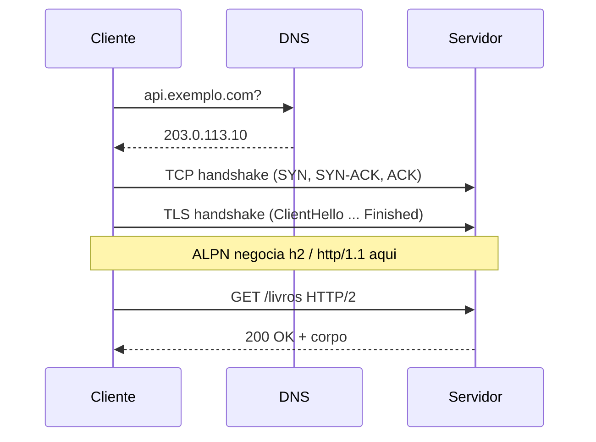
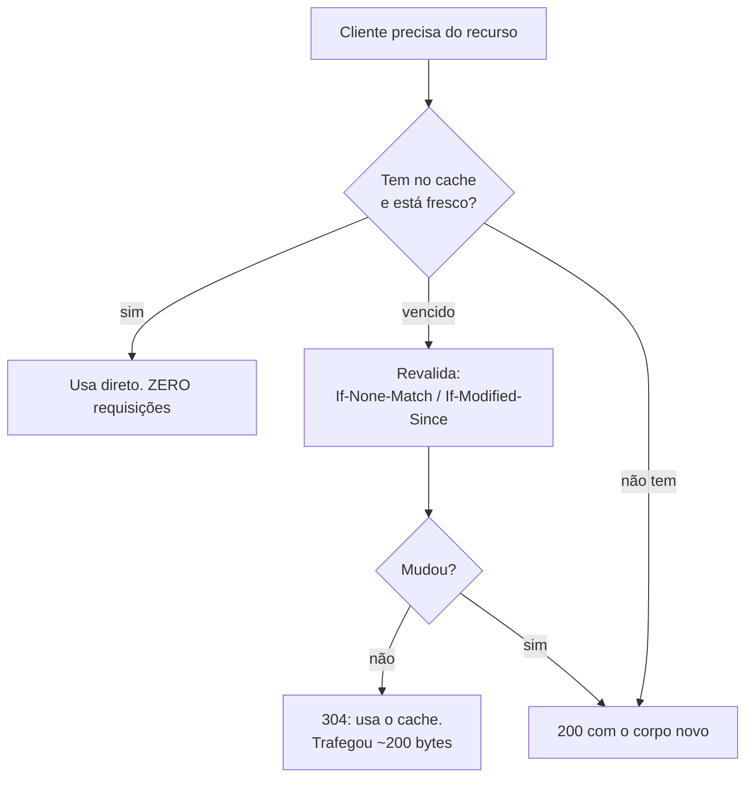
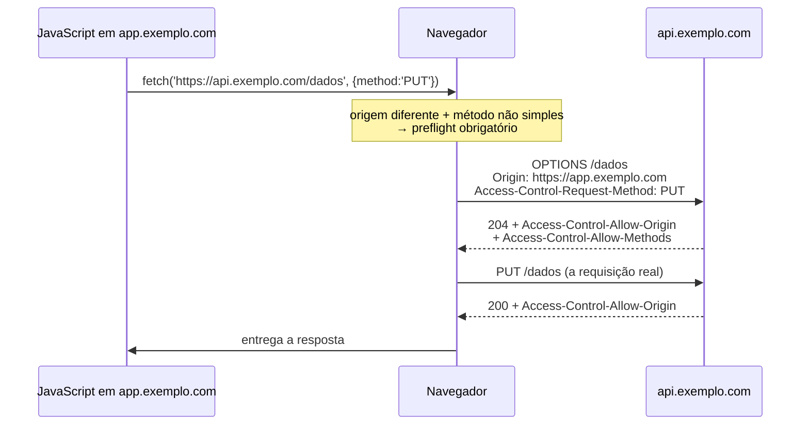

# 12 · HTTP por dentro

`Nível: intermediário` · `Atualizado: 11/08/2026` · `Base: RFC 9110–9114 (jun/2022)`

Este arquivo é o seu curso de HTTP. **A maior parte do que se chama de "aprender APIs" é,
na verdade, aprender HTTP.** Quem domina isto lê qualquer API sem documentação.

---

## 1. O que acontece quando você chama uma API



**O custo de cada etapa, em números típicos:**

| Etapa | Tempo típico | Como reduzir |
|---|---|---|
| DNS | 10–100 ms (0 se em cache) | TTL adequado, DNS pré-resolvido |
| TCP handshake | 1 RTT (~10–100 ms) | conexão persistente |
| TLS handshake | 1–2 RTT (TLS 1.3: 1) | *session resumption*, 0-RTT |
| Requisição + resposta | 1 RTT + processamento | cache, CDN |

> **É por isso que reutilizar conexão (`keep-alive`) é a otimização mais importante de um
> cliente HTTP.** Abrir uma conexão nova a cada chamada pode triplicar a latência.
> Em Node, o `fetch` já reutiliza; em bibliotecas antigas, verifique.
>
> Meça você mesmo com o `curl -w` de [05-manual-de-uso.md](05-manual-de-uso.md) §5.4.

---

## 2. Anatomia da requisição e da resposta

```http
POST /v1/livros?rascunho=true HTTP/1.1        ← linha de requisição
Host: api.exemplo.com                          ← ┐
Authorization: Bearer eyJhbGc...               ← │
Content-Type: application/json                 ← │ cabeçalhos
Accept: application/json                       ← │
Idempotency-Key: 9f2a-4b1c-...                 ← ┘
                                               ← linha em branco: separa
{"titulo": "Iracema", "autor": "Alencar"}      ← corpo
```

```http
HTTP/1.1 201 Created                           ← linha de status
Content-Type: application/json; charset=utf-8
Content-Length: 143
Location: /v1/livros/42
ETag: "a1b2c3"

{"id": 42, "titulo": "Iracema", ...}
```

**Regras que causam bug quando ignoradas:**
- **cabeçalhos são insensíveis a maiúsculas** (`Content-Type` == `content-type`);
- em **HTTP/2 e /3**, os nomes vão obrigatoriamente **em minúsculas**;
- a **linha em branco** é obrigatória, com `\r\n`;
- `Host` é **obrigatório** em HTTP/1.1 — é ele que permite vários sites por IP;
- o corpo pode existir em qualquer método, mas `GET` com corpo é território de comportamento
  indefinido: proxies e servidores tratam de formas diferentes. **Não faça.**

---

## 3. Métodos — semântica, não sintaxe

| Método | Semântica | Seguro | Idempotente | Corpo |
|---|---|---|---|---|
| `GET` | recupera a representação | ✅ | ✅ | não |
| `HEAD` | só os cabeçalhos do `GET` | ✅ | ✅ | não |
| `POST` | processa o corpo conforme a semântica do recurso | ❌ | ❌ | sim |
| `PUT` | **substitui** a representação inteira | ❌ | ✅ | sim |
| `PATCH` | aplica uma **modificação parcial** | ❌ | ❌ | sim |
| `DELETE` | remove | ❌ | ✅ | opcional |
| `OPTIONS` | comunica opções | ✅ | ✅ | não |
| `TRACE` | eco de diagnóstico | ✅ | ✅ | não |
| `CONNECT` | túnel (proxy HTTPS) | ❌ | ❌ | — |

**Todo recurso que aceita `GET` deve aceitar `HEAD`** (RFC 9110 §9.3.2). É a regra mais
esquecida — e o projeto-modelo deste curso a violou até um teste pegar.

### 3.1 `PUT` vs. `PATCH` — a diferença que gera bug

```http
Estado atual: {"titulo": "Iracema", "autor": "Alencar", "ano": 1865}

PUT /livros/42     {"titulo": "Iracema", "ano": 1866}
→ resultado: {"titulo": "Iracema", "ano": 1866}
             ↑ o AUTOR SUMIU. PUT substitui tudo.

PATCH /livros/42   {"ano": 1866}
→ resultado: {"titulo": "Iracema", "autor": "Alencar", "ano": 1866}
```

**Formatos de PATCH** (o `Content-Type` decide):

| Formato | Content-Type | Exemplo |
|---|---|---|
| **Merge Patch** (RFC 7386) | `application/merge-patch+json` | `{"ano": 1866, "isbn": null}` — `null` **apaga** |
| **JSON Patch** (RFC 6902) | `application/json-patch+json` | `[{"op":"replace","path":"/ano","value":1866}]` |
| "PATCH informal" | `application/json` | o que 90% do mercado faz |

> **Recomendação:** para APIs simples, o PATCH informal (campos presentes são alterados) é
> aceitável **se documentado**, e é o que o projeto-modelo usa. Quando você precisar
> distinguir "não mandei o campo" de "quero apagar o campo", vá para **merge-patch**, onde
> `null` significa remoção. JSON Patch é poderoso e desconfortável; use só quando precisar
> de operações em arrays (`add`, `move`, `test`).

---

## 4. Códigos de status — o mapa completo

A tabela de referência está em [05-manual-de-uso.md](05-manual-de-uso.md) §2. Aqui, o que
está por trás.

**A regra estrutural:** `4xx` = repetir vai falhar de novo. `5xx` = repetir pode funcionar.
É literalmente isso que o cliente precisa para decidir sobre retentativa.

**Os que quase ninguém usa e deveria:**

| Código | Quando | Por que ajuda |
|---|---|---|
| **202 Accepted** | aceitei, processo depois | o único jeito honesto de responder a operação longa |
| **207 Multi-Status** | operação em lote com resultados mistos | evita ter que escolher entre 200 e 400 |
| **410 Gone** | existiu, foi removido de propósito | diz ao cliente para **parar de tentar**; `404` não diz |
| **412 / 428** | pré-condição falhou / é obrigatória | evita *lost update* |
| **429 + Retry-After** | limite excedido | sem o `Retry-After`, o cliente martela |
| **503 + Retry-After** | manutenção | permite drenar tráfego com elegância |

**Os antipadrões clássicos:**

```json
❌ HTTP 200 OK
   {"sucesso": false, "erro": "saldo insuficiente"}
```
Todo cliente, todo proxy, todo painel de monitoramento e todo alerta vê um sucesso. O erro
fica invisível nas métricas. **Use 422.**

```json
❌ HTTP 500 Internal Server Error
   {"erro": "CPF inválido"}
```
Isso é erro do cliente. Ao devolver `5xx`, você faz o cliente retentar, aciona o seu alerta
de madrugada e polui a sua taxa de erro. **Use 422.**

---

## 5. Cabeçalhos: negociação de conteúdo

O mesmo recurso, várias representações. O cliente pede; o servidor escolhe.

```http
Accept: application/json;q=1.0, application/xml;q=0.8, */*;q=0.1
Accept-Language: pt-BR, pt;q=0.9, en;q=0.5
Accept-Encoding: br, gzip;q=0.9
```

`q` é a **qualidade relativa**, de 0 a 1. O padrão é 1.0. O servidor escolhe a melhor
combinação que consegue produzir; se não conseguir nenhuma, responde **406**.

**Ao servir conteúdo negociado, o `Vary` é obrigatório:**
```http
Vary: Accept, Accept-Language
```
Sem ele, um cache entrega a versão em inglês para quem pediu português — e não há como
depurar, porque depende de quem chegou primeiro.

---

## 6. Cache — o mecanismo mais subutilizado do HTTP



### 6.1 Frescor: `Cache-Control`

```http
Cache-Control: public, max-age=300, s-maxage=3600, stale-while-revalidate=60
```

| Diretiva | Efeito |
|---|---|
| `public` / `private` | qualquer cache / só o do usuário |
| `no-cache` | guarde, mas **revalide antes de servir** |
| `no-store` | **não guarde** — para dado sensível |
| `max-age=N` | fresco por N segundos |
| `s-maxage=N` | idem, para caches compartilhados (tem precedência) |
| `must-revalidate` | ao vencer, é proibido servir vencido |
| `stale-while-revalidate=N` | sirva o vencido por N s enquanto busca o novo, em segundo plano |
| `stale-if-error=N` | sirva o vencido se a origem estiver fora |
| `immutable` | nunca muda; nem revalide |

> **`no-cache` não impede o armazenamento.** Quem quer isso precisa de **`no-store`**.
> Essa confusão de nomenclatura já vazou dado sensível para cache de proxy corporativo.

### 6.2 Validação: `ETag` e `Last-Modified`

| | `ETag` | `Last-Modified` |
|---|---|---|
| Granularidade | qualquer mudança | **1 segundo** |
| Custo de gerar | hash do conteúdo | trivial |
| Funciona entre réplicas | ✅ se derivado do conteúdo | ⚠️ exige relógios sincronizados |
| Cabeçalho de requisição | `If-None-Match` | `If-Modified-Since` |

**Prefira ETag.** Duas alterações no mesmo segundo são invisíveis para `Last-Modified` — e
isso acontece o tempo todo em sistemas ativos.

### 6.3 O que se ganha

Uma API pública com `Cache-Control: public, max-age=60` atrás de uma CDN pode atender
**centenas de vezes mais tráfego** com a mesma infraestrutura de origem. Esse é o valor
concreto da restrição de cacheabilidade do REST ([13](13-rest-e-restful.md) §3) — não é
teoria arquitetural, é a conta do fim do mês.

**O que impede o cache de funcionar:**
- `Authorization` na requisição (caches compartilhados não guardam, por padrão);
- `Set-Cookie` na resposta;
- `POST` (raramente cacheável);
- ausência de `Cache-Control` — o cache então **adivinha**, e adivinha mal;
- GraphQL, que manda tudo por `POST` numa URL só.

---

## 7. HTTP/1.1 vs. HTTP/2 vs. HTTP/3

| | HTTP/1.1 (1997) | HTTP/2 (2015) | HTTP/3 (2021) |
|---|---|---|---|
| RFC | 9112 | 9113 | 9114 |
| Transporte | TCP | TCP | **QUIC sobre UDP** |
| Formato | texto | **binário** | binário |
| Requisições por conexão | 1 por vez (com pipelining quebrado na prática) | **multiplexadas** | multiplexadas |
| Head-of-line blocking | na **aplicação** | no **TCP** | **eliminado** |
| Compressão de cabeçalho | não | HPACK | QPACK |
| Server push | não | sim (**abandonado na prática**) | não |
| Handshake | TCP + TLS (2–3 RTT) | idem | **TLS embutido no QUIC (1 RTT, ou 0)** |
| Migração de conexão | não | não | ✅ **troca de Wi-Fi para 4G sem cair** |

**A cascata de head-of-line blocking, que é a chave para entender a evolução:**

```text
HTTP/1.1: 6 conexões por origem. A 7ª requisição espera.
          → gambiarras: sharding de domínio, sprites, concatenação de arquivos

HTTP/2:   uma conexão, muitos fluxos multiplexados.
          MAS: o TCP entrega em ordem. Um pacote perdido trava TODOS os fluxos,
          porque o TCP não entrega o resto até retransmitir.

HTTP/3:   QUIC implementa fluxos independentes sobre UDP.
          Um pacote perdido trava apenas o SEU fluxo.
```

**Onde HTTP/3 realmente ganha:** rede com perda de pacote — móvel, Wi-Fi ruim, longa
distância. Em datacenter, com perda quase zero, o ganho é marginal.

**A adoção estagnou.** Medições de 2026 mostram HTTP/3 entre **~20% e ~35%** do tráfego,
conforme a metodologia (páginas carregadas vs. sites que suportam), com alguns
levantamentos registrando **queda** em meados de 2026. Os motivos apontados: **UDP bloqueado
em muitas redes corporativas**, ganho pequeno em rede boa, e complexidade operacional maior.
Ver [65-estado-da-arte.md](65-estado-da-arte.md) §3.

**O que isso muda para você, na prática:** quase nada no código — a semântica é idêntica.
Muda na operação: habilite HTTP/2 (ganho real, custo baixo) e trate HTTP/3 como otimização
opcional com fallback garantido.

---

## 8. Conexões e limites

| Recurso | HTTP/1.1 | HTTP/2+ |
|---|---|---|
| Conexões por origem (navegador) | ~6 | 1 |
| Requisições concorrentes | ~6 | ~100 (negociável) |
| Tamanho de cabeçalho | ~8 KB (varia por servidor) | comprimido |
| Tamanho de URL | ~2.000–8.000 caracteres (varia) | idem |

> **Se sua requisição tem parâmetros longos** (um filtro complexo, uma lista de 500 ids),
> a URL estoura. As saídas: `POST` com o filtro no corpo (perde cacheabilidade), ou criar um
> recurso "consulta salva" e referenciá-lo por id. Não há resposta bonita.

---

## 9. CORS — a regra do navegador que confunde todo mundo

**CORS não é um mecanismo de segurança da sua API.** É uma proteção do **navegador** para o
usuário. Entender isso resolve 90% da confusão.

**O problema que ele resolve:** você está logado no seu banco. Um site malicioso faz
JavaScript chamar `https://banco.com/api/transferir`. O navegador enviaria seus cookies
automaticamente. **CORS impede que o site malicioso leia a resposta.**



**Quando há preflight** (uma requisição `OPTIONS` extra):
- método diferente de `GET`, `HEAD`, `POST`;
- `Content-Type` diferente de `text/plain`, `multipart/form-data`,
  `application/x-www-form-urlencoded` — **ou seja, `application/json` sempre dispara**;
- qualquer cabeçalho customizado (incluindo `Authorization`).

**Cabeçalhos da resposta:**

| Cabeçalho | Para quê |
|---|---|
| `Access-Control-Allow-Origin` | qual origem pode ler. `*` **não** funciona com credenciais |
| `Access-Control-Allow-Methods` | métodos permitidos |
| `Access-Control-Allow-Headers` | cabeçalhos que o cliente pode enviar |
| `Access-Control-Allow-Credentials: true` | permite cookies. Exige origem explícita |
| `Access-Control-Max-Age: 86400` | cacheia o preflight — **economiza metade das requisições** |
| `Access-Control-Expose-Headers` | quais cabeçalhos o JS pode **ler** (por padrão, quase nenhum) |

**Os três mal-entendidos que custam mais tempo:**

1. **"Vou desabilitar o CORS no meu código."** Não dá — quem aplica é o navegador. O que
   você faz é o servidor **autorizar** a origem.
2. **`curl` não tem CORS.** Se funciona no curl e falha no navegador, é CORS. Isso confunde
   porque parece que a API está quebrada.
3. **`Access-Control-Allow-Origin: *` é seguro?** Para dado público, sim. **Nunca** com
   `Allow-Credentials: true` — e a especificação proíbe a combinação, justamente por isso.

**O erro de esquecer `Expose-Headers`:** sua API devolve `X-Total-Count` e o JavaScript não
consegue lê-lo. Não é bug do fetch — o navegador esconde cabeçalhos não expostos por padrão.

---

## 10. Compressão

```http
Accept-Encoding: br, gzip, zstd
→
Content-Encoding: br
```

| Algoritmo | Taxa em JSON | CPU | Uso |
|---|---|---|---|
| `gzip` | ~70–80% de redução | baixo | universal, sempre suportado |
| `br` (Brotli) | ~5–15% melhor que gzip | médio | ótimo para texto; padrão em CDN |
| `zstd` | próximo do br, mais rápido | baixo | crescendo |

**Ligue compressão para JSON. É o ganho mais barato que existe** — JSON é texto repetitivo e
comprime muito bem.

> **Duas ressalvas.** (1) Não comprima o que já está comprimido (imagem, vídeo, zip): gasta
> CPU sem ganho. (2) Comprimir resposta que mistura **segredo e entrada do usuário** sobre
> TLS abre a porta a ataques de oráculo de compressão (família BREACH). O risco é real
> principalmente para HTML com token CSRF; para APIs JSON com token no cabeçalho, é baixo —
> mas se a sua resposta reflete entrada do usuário **e** contém segredo, avalie.

---

## 11. Os cinco porquês: por que o cache do HTTP é tão pouco usado em APIs?

**1. Por que a maioria das APIs não usa cache HTTP?**
Porque quase toda API exige `Authorization`, e caches compartilhados, por padrão, não
guardam respostas autenticadas.

**2. Por que caches compartilhados ignoram respostas autenticadas?**
Porque servir a resposta de um usuário para outro é um vazamento catastrófico. O padrão
conservador é a escolha certa.

**3. Mas dá para cachear com autenticação?**
Dá: `Cache-Control: private` (só o cliente guarda) ou, para caches compartilhados,
`public` + **`Vary: Authorization`** — que faz a chave do cache incluir o token. Funciona,
mas a taxa de acerto despenca, porque cada token vira uma entrada própria.

**4. Então qual é a saída real?**
Separar. Dados **públicos e comuns** (catálogo, tabela de preços, configuração) numa rota
sem autenticação, cacheável agressivamente na CDN. Dados **por usuário**, `private` com
`ETag` para revalidação barata. A maioria das APIs mistura os dois na mesma rota e perde
os dois benefícios.

**5. E por que quase ninguém faz essa separação?**
Porque exige pensar em cache **no desenho da API**, não depois. Quando o time percebe o
custo de infraestrutura, o contrato já está publicado e mudá-lo quebra clientes. **É uma
decisão de design que parece uma decisão de operação** — e por isso é tomada tarde demais.

*(Parada legítima: trade-off arquitetural explícito com consequência econômica.)*

---

## Autoteste

1. Quais são as quatro etapas antes do primeiro byte da resposta? Qual otimização elimina três delas?
2. Por que `GET` com corpo é má ideia?
3. Dê um exemplo em que `PUT` apaga um dado sem querer. Como `PATCH` evita isso?
4. Qual a diferença entre merge-patch e JSON Patch? Quando cada um se justifica?
5. Por que `200 {"sucesso": false}` é um antipadrão? E `500 {"erro": "CPF inválido"}`?
6. Qual a diferença entre `no-cache` e `no-store`?
7. Por que preferir `ETag` a `Last-Modified`?
8. Explique a cascata de head-of-line blocking de HTTP/1.1 → /2 → /3.
9. Por que a adoção de HTTP/3 estagnou em torno de 20–35%?
10. CORS protege a sua API ou o usuário do navegador? Por que "desabilitar CORS no servidor" é uma frase confusa?
11. Por que a maioria das APIs desperdiça o cache do HTTP? Qual é a saída real?

---

### Fontes consultadas (11/08/2026)

- IETF — RFC 9110 *HTTP Semantics* — https://www.rfc-editor.org/rfc/rfc9110.html
- IETF — RFC 9111 *HTTP Caching* — https://www.rfc-editor.org/rfc/rfc9111.html
- IETF — RFC 9112/9113/9114 (HTTP/1.1, /2, /3) — https://www.rfc-editor.org/
- MDN Web Docs — HTTP — https://developer.mozilla.org/pt-BR/docs/Web/HTTP
- WHATWG — Fetch Standard (CORS) — https://fetch.spec.whatwg.org/
- Dados de adoção de HTTP/3 em 2026 — Cloudflare Radar e levantamentos independentes; ver [65-estado-da-arte.md](65-estado-da-arte.md)
