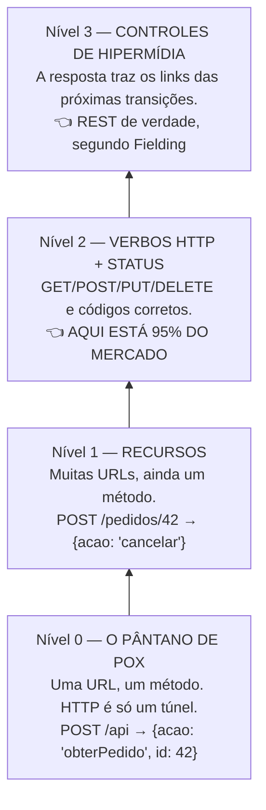

# 13 · REST e "RESTful" — o que é, de verdade

`Nível: intermediário` · `Atualizado: 11/08/2026`

Este é o arquivo que responde à sua segunda e terceira perguntas com todo o rigor.
Ele tem uma tese: **a palavra "REST" hoje significa duas coisas diferentes, e as duas
são úteis — desde que você saiba qual está usando.**

---

## 1. A origem

**REST** = *REpresentational State Transfer*.

Definido por **Roy Thomas Fielding** no capítulo 5 da tese de doutorado dele, na
Universidade da Califórnia em Irvine, em **2000**.

Duas informações que mudam como você lê isso:

1. **Fielding é coautor da especificação do HTTP** (RFC 2616 e sucessores). Ele não é um
   comentarista opinando sobre a web; ele é um dos autores dela.
2. **A tese não propõe um jeito de fazer APIs.** Ela **descreve, a posteriori, por que a
   web funcionou** — quais restrições arquiteturais permitiram escalar de dezenas de
   servidores para bilhões de nós, com atores que não se conhecem e evoluem
   independentemente.

REST é a **descrição da arquitetura da web**. Aplicá-la a APIs veio depois, por analogia —
e a analogia é boa, mas não é o texto original.

> **A frase que resume a tese:** REST é um conjunto de restrições que, quando respeitadas,
> produzem um sistema com **escalabilidade**, **evolutibilidade** (partes mudam sem
> coordenação) e **visibilidade** (intermediários entendem o tráfego sem conhecer a
> aplicação).

---

## 2. As seis restrições

REST é definido por **restrições** — coisas que você **abre mão** de fazer, em troca de
propriedades desejáveis. É crucial entender que cada restrição tem um **custo**.

### 2.1 Cliente–servidor

**Restrição:** separe a interface do usuário do armazenamento de dados.

**Ganha:** os dois lados evoluem independentemente. O app móvel muda sem o servidor mudar.

**Custo:** rede entre os dois, com tudo que isso implica.

### 2.2 Sem estado (*stateless*)

**Restrição:** cada requisição contém **tudo** que o servidor precisa. O servidor não guarda
contexto entre requisições.

**Ganha:**
- **escala horizontal trivial** — qualquer réplica atende qualquer requisição;
- **confiabilidade** — reiniciar um servidor não derruba ninguém;
- **visibilidade** — um intermediário entende a requisição sozinho.

**Custo:** cada requisição carrega mais dados (token, filtros, paginação). Repetição na rede
em troca de simplicidade na infraestrutura.

> **É a restrição de maior impacto econômico das seis.** Ela é o que permite colocar dez
> réplicas atrás de um balanceador sem coordenação nenhuma. Um sistema com sessão no
> servidor precisa de sessão pegajosa, ou de sessão compartilhada num Redis — e aí você
> comprou um ponto único de falha.

### 2.3 Cacheável

**Restrição:** a resposta deve declarar, explicitamente, se pode ser guardada e por quanto
tempo.

**Ganha:** requisições que nem chegam ao servidor. Uma CDN à frente pode multiplicar a
capacidade por centenas.

**Custo:** risco de servir dado velho. Exige pensar em invalidação — que é, notoriamente,
um dos dois problemas difíceis da computação.

### 2.4 Sistema em camadas

**Restrição:** o cliente não sabe se está falando com o servidor final ou com um
intermediário.

**Ganha:** dá para inserir CDN, balanceador, gateway, cache, WAF e proxy sem mudar nem
cliente nem servidor. **Toda a infraestrutura moderna de web depende disso.**

**Custo:** latência de cada salto; depuração mais difícil.

### 2.5 Interface uniforme — **a restrição central**

Fielding a divide em **quatro sub-restrições**:

| Sub-restrição | Significa |
|---|---|
| **Identificação de recursos** | cada coisa tem um identificador (URI) |
| **Manipulação por representações** | você manda uma representação, não comandos |
| **Mensagens autodescritivas** | a mensagem carrega tudo para ser entendida (`Content-Type`, método, cache) |
| **HATEOAS** | a resposta contém os **links** para as transições possíveis |

**Ganha:** intermediários genéricos funcionam. Um proxy sabe que `GET` é cacheável sem saber
nada da sua aplicação. Ferramentas funcionam com qualquer API.

**Custo:** você perde eficiência. Uma interface genérica é sempre menos eficiente que uma
sob medida para o seu caso — Fielding diz isso **explicitamente** na tese.

### 2.6 Código sob demanda *(opcional)*

**Restrição:** o servidor pode enviar código para o cliente executar.

Na web: JavaScript. Em APIs: praticamente nunca. É a **única restrição opcional**, e a única
que a maioria das APIs pode ignorar sem debate.

---

## 3. HATEOAS — a restrição que quase ninguém cumpre

*Hypermedia As The Engine Of Application State.*

**A ideia:** o cliente não deve construir URLs. Ele começa por um único ponto de entrada e
**segue links** que o servidor fornece — exatamente como uma pessoa navega num site sem
digitar URLs.

### 3.1 Sem HATEOAS (o que 95% faz)

```json
GET /pedidos/42
{ "id": 42, "status": "aguardando_pagamento", "total_centavos": 4790 }
```

O cliente precisa **saber, no seu código**:
- que a URL para pagar é `POST /pedidos/42/pagamento`;
- que só dá para pagar quando o status é `aguardando_pagamento`;
- que a URL para cancelar é `POST /pedidos/42/cancelamento`;
- que não dá para cancelar depois de enviado.

**Toda essa lógica de negócio está duplicada no cliente.** Muda a regra, mudam todos os
clientes.

### 3.2 Com HATEOAS

```json
GET /pedidos/42
{
  "id": 42,
  "status": "aguardando_pagamento",
  "total_centavos": 4790,
  "_links": {
    "self":       { "href": "/pedidos/42" },
    "pagamento":  { "href": "/pedidos/42/pagamento",    "method": "POST" },
    "cancelar":   { "href": "/pedidos/42/cancelamento", "method": "POST" },
    "cliente":    { "href": "/clientes/7" }
  }
}
```

Depois de pago:
```json
{
  "id": 42, "status": "pago",
  "_links": {
    "self":        { "href": "/pedidos/42" },
    "nota_fiscal": { "href": "/pedidos/42/nota-fiscal" },
    "rastreio":    { "href": "/pedidos/42/rastreio" }
  }
}
```

**O link de pagamento sumiu.** O cliente não precisa saber que pedido pago não se paga de
novo — ele só oferece ao usuário os botões que existem nos links. **A regra de negócio ficou
num lugar só.**

### 3.3 Por que quase ninguém faz

| Motivo | Peso |
|---|---|
| O cliente teria que ser genérico, e escrever cliente genérico é difícil | **alto** |
| A maioria dos clientes é feita pelo mesmo time do servidor — o acoplamento não incomoda | **alto** |
| Payload maior | médio |
| Não há um formato vencedor: HAL, JSON:API, Siren, Collection+JSON, JSON-LD… | **alto** |
| O benefício aparece em anos; o custo, hoje | **alto** |
| Ferramentas e geradores de cliente não ajudam | médio |

> **Minha opinião profissional, formada em campo:** HATEOAS completo raramente compensa. Mas
> a **hipermídia parcial** compensa quase sempre, e é subutilizada:
>
> - **links de paginação** (`next`, `prev`) — poupa o cliente de montar URL e é o único
>   jeito correto de fazer paginação por cursor;
> - **link para o recurso relacionado** em vez de só o id — economiza uma consulta à doc;
> - **lista de ações permitidas** no estado atual — mata a duplicação de regra de negócio;
> - `Location` no `201`, `Link` no cabeçalho (RFC 8288).
>
> Isso captura a maior parte do valor com uma fração do custo. É o que eu recomendo, e é o
> que o projeto-modelo deste curso faz.

### 3.4 O protesto de Fielding

Em **2008**, incomodado com o uso do termo, Fielding escreveu *REST APIs must be
hypertext-driven*, com uma frase que ficou:

> *"Se o mecanismo do estado da aplicação (e, portanto, a API) não está sendo dirigido por
> hipertexto, então ele não pode ser RESTful."*

**Ele perdeu essa disputa, completamente.** Em 2026, "REST" significa, no uso corrente,
"JSON sobre HTTP com URLs de recursos". Corrigir alguém sobre isso numa reunião é
tecnicamente certo e socialmente inútil.

**O que fazer com essa informação:** não use para ganhar discussão. Use para **saber o que
você está abrindo mão** quando escolhe não fazer hipermídia — e para reconhecer, quando
alguém disser "nossa API é RESTful", que isso não te informa quase nada sobre o desenho dela.

---

## 4. O Modelo de Maturidade de Richardson

Proposto por **Leonard Richardson** (2008) e popularizado por Martin Fowler: uma régua de
0 a 3 para medir o quanto uma API usa o HTTP.



### Nível 0 — o pântano de POX (*Plain Old XML*)

```http
POST /api
{"metodo": "obterPedido", "params": {"id": 42}}

POST /api
{"metodo": "cancelarPedido", "params": {"id": 42}}
```
HTTP é apenas um transporte. Você perde: cache, códigos de status significativos, e a
capacidade de qualquer intermediário entender o que está acontecendo.
**SOAP e a maioria das APIs GraphQL estão aqui**, tecnicamente.

### Nível 1 — recursos

```http
POST /pedidos/42   {"acao": "cancelar"}
POST /pedidos/42   {"acao": "pagar"}
```
Já há URLs distintas por coisa. Mas tudo ainda é `POST`, então nada é cacheável e o
significado está no corpo.

### Nível 2 — verbos e status

```http
GET    /pedidos/42        → 200
POST   /pedidos           → 201 + Location
PATCH  /pedidos/42        → 200
DELETE /pedidos/42        → 204
GET    /pedidos/999       → 404
```

**É aqui que está a esmagadora maioria das APIs "REST" do mundo, e é um lugar perfeitamente
respeitável.** Neste nível você já ganha:
- cache HTTP funcionando;
- semântica de idempotência e segurança (retentativa automática!);
- intermediários genéricos entendendo o tráfego;
- ferramentas (curl, Postman, gateways) funcionando sem configuração.

**Isso é 80% do valor prático do REST com 20% do custo.**

### Nível 3 — hipermídia

O nível 2 mais os links. É o único que Fielding chamaria de REST.

> **Recomendação prática, sem ambiguidade:** **mire no nível 2 com hipermídia parcial**
> (links de paginação, `Location`, links para relacionados). Vá ao nível 3 completo quando
> houver **consumidores externos que você não controla** e a API tiver **muitos estados com
> transições condicionais** — que é justamente o cenário em que a duplicação de regra no
> cliente mais dói.

---

## 5. Então: qual a diferença entre "API" e "API RESTful"?

Fechando sua terceira pergunta, agora com o vocabulário completo.

| | **API** | **API RESTful** |
|---|---|---|
| O que é | qualquer contrato entre softwares | uma API remota que respeita as restrições de REST |
| Precisa de rede? | não (`Math.max` é uma API) | sim |
| Precisa de HTTP? | não | não em teoria; na prática, sempre |
| Tem regras definidas? | não | sim: seis restrições |
| Quem define se "é"? | ninguém — é o gênero | Fielding (2000), na teoria; o mercado, na prática |

**Em uma frase:** *toda API RESTful é uma API; a maioria das APIs não é RESTful — e a maioria
das que se dizem RESTful também não é, no sentido estrito.*

**A pergunta útil não é "isso é REST?"** Isso é uma discussão de vocabulário. As perguntas
úteis são:

1. **Usa os verbos e status do HTTP corretamente?** (nível 2 de Richardson)
2. **É sem estado?** (dá para escalar horizontalmente?)
3. **Declara cacheabilidade?** (dá para pôr uma CDN na frente?)
4. **O contrato expõe o domínio ou a implementação?** (vai envelhecer bem?)
5. **Dá para evoluir sem quebrar clientes?**

Essas cinco perguntas dizem mais sobre a qualidade de uma API do que qualquer rótulo.

---

## 6. Quando REST é a escolha errada

Um material honesto precisa desta seção.

| Situação | Por que REST atrapalha | Use |
|---|---|---|
| Muitos clientes com necessidades de dados diferentes | over/under-fetching; N chamadas para montar uma tela | **GraphQL** |
| Comunicação interna de alto volume | JSON em texto e HTTP/1.1 desperdiçam banda e CPU | **gRPC** |
| Streaming bidirecional (chat, jogo) | HTTP é requisição–resposta | **WebSocket** |
| Servidor precisa avisar o cliente | *polling* é desperdício | **SSE** ou **webhook** |
| Operações que não são "coisas" (`calcular`, `traduzir`, `validar`) | não há recurso natural; vira `POST /calculos` forçado | **RPC** é mais honesto |
| Transações longas com garantias formais | REST não tem transação | **SOAP/WS-**, ou repensar o desenho |
| Desacoplamento temporal (o consumidor pode estar fora) | REST é síncrono | **mensageria** |
| Comunicação com agentes de IA | descrições legíveis por modelo, descoberta de ferramentas | **MCP** (sobre a sua API REST) |

**O caso das "ações que não são coisas" merece atenção**, porque é onde REST mais força a
barra. Como modelar "enviar e-mail de boas-vindas"?

```http
❌ POST /enviarEmailBoasVindas          ← RPC disfarçado de REST
✅ POST /usuarios/42/emails-de-boas-vindas   ← reifica a ação como recurso
✅ POST /usuarios/42/emails  {"tipo": "boas-vindas"}
```

A segunda e a terceira funcionam e são defensáveis. Mas note que estamos **inventando um
substantivo** para caber no modelo. Quando você se pega fazendo isso o tempo todo, o seu
domínio é orientado a ação, e **RPC é mais honesto** que REST torturado.

---

## 7. Os cinco porquês: por que HATEOAS não pegou?

**1. Por que quase nenhuma API implementa HATEOAS?**
Porque o cliente típico é escrito pelo mesmo time do servidor, e não sofre com o acoplamento
que a hipermídia resolveria.

**2. Por que isso importa? O acoplamento não some por ser interno.**
Não some, mas o **custo dele é pago pela mesma equipe**, no mesmo sprint. Quando quem paga o
custo é quem toma a decisão, a decisão racional é aceitar o acoplamento e entregar mais
rápido. É economia, não preguiça.

**3. Então quando o cálculo muda?**
Quando os consumidores são **externos e desconhecidos** — e mudar o contrato exige coordenar
com dezenas de times ou empresas. Aí o custo de mudança explode, e hipermídia se paga. É por
isso que quem mais fez hipermídia foram APIs públicas de larga escala.

**4. Por que nem essas adotaram amplamente?**
Porque falta padronização. HAL, JSON:API, Siren, Collection+JSON, JSON-LD — **nenhum
venceu**. Sem formato dominante, não há ferramenta genérica; sem ferramenta genérica, cada
cliente reimplementa o consumo de links; e aí a economia prometida evapora.

**5. E isso pode mudar?**
Talvez, por um caminho inesperado: **agentes de IA**. Um agente que descobre o que fazer lendo
os links e as descrições da resposta é exatamente o "cliente genérico" que HATEOAS sempre
pressupôs e que nunca existiu, porque era caro demais escrever. Se agentes virarem
consumidores relevantes de API, o cálculo de custo/benefício da hipermídia muda de sinal.
**Isto é especulação fundamentada, não previsão** — mas é o eixo que eu observaria.

*(Paradas legítimas: incentivo econômico explícito e ausência de padrão dominante — um fato
de mercado.)*

---

## 8. Checklist: a sua API está no nível 2 com hipermídia parcial?

- [ ] Cada coisa tem uma URL estável e previsível.
- [ ] `GET` nunca altera estado.
- [ ] `PUT` e `DELETE` são idempotentes de verdade.
- [ ] Os códigos de status são corretos (`201` + `Location`, `404`, `409`, `422`, `429`).
- [ ] `405` acompanha `Allow`; `429` e `503` acompanham `Retry-After`.
- [ ] `HEAD` funciona em tudo que aceita `GET`.
- [ ] Erros seguem o RFC 9457, com `type` estável.
- [ ] Respostas declaram `Cache-Control` explicitamente (mesmo que `no-store`).
- [ ] `ETag` nos recursos individuais; `If-None-Match` e `If-Match` respeitados.
- [ ] Paginação devolve **link ou cursor**, não obriga o cliente a montar URL.
- [ ] Nenhuma sessão no servidor — cada requisição se basta.
- [ ] O contrato expressa o **domínio**, não a estrutura da tabela.

Se você marcou tudo, sua API é melhor que a grande maioria — e o rótulo que ela recebe
deixa de importar.

---

## Autoteste

1. Quem é Roy Fielding e por que a autoria dele muda o peso da tese?
2. A tese de 2000 **propõe** ou **descreve**? Qual é a consequência dessa distinção?
3. Liste as seis restrições e, para cada uma, um ganho e um custo.
4. Qual restrição tem maior impacto econômico, e por quê?
5. Explique HATEOAS com um exemplo de dois estados do mesmo recurso.
6. Cite quatro motivos pelos quais HATEOAS não foi adotado.
7. Descreva os quatro níveis de Richardson. Onde está a maioria das APIs, e por que isso é aceitável?
8. Qual a diferença entre "API" e "API RESTful"? Dê um exemplo de API que não é REST.
9. Quais cinco perguntas são mais úteis que "isso é REST?"
10. Cite quatro situações em que REST é a escolha errada, e o que usar em cada uma.
11. Por que "ações que não são coisas" torturam o modelo REST? O que fazer?

---

### Fontes consultadas (11/08/2026)

- Fielding, R. T. — *Architectural Styles and the Design of Network-based Software Architectures*, cap. 5 (2000) — https://ics.uci.edu/~fielding/pubs/dissertation/rest_arch_style.htm
- Fielding, R. T. — *REST APIs must be hypertext-driven* (2008) — https://roy.gbiv.com/untangled/2008/rest-apis-must-be-hypertext-driven
- Fowler, M. — *Richardson Maturity Model* — https://martinfowler.com/articles/richardsonMaturityModel.html
- IETF — RFC 8288 *Web Linking* — https://www.rfc-editor.org/rfc/rfc8288.html
