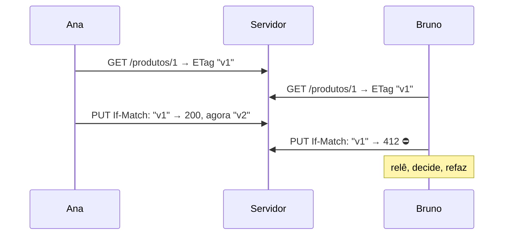

# 14 · Design de API REST

`Nível: intermediário` · `Atualizado: 11/08/2026`

Decisões concretas, com recomendação explícita. Onde houver controvérsia real, os dois lados
aparecem e eu digo qual eu escolho.

---

## 1. Nomeando recursos

| Regra | ✅ | ❌ |
|---|---|---|
| Substantivo, não verbo | `/pedidos` | `/obterPedidos` |
| Plural, consistente | `/pedidos/42` | `/pedido/42` e `/pedidos` misturados |
| Minúsculas com hífen | `/notas-fiscais` | `/notasFiscais`, `/notas_fiscais` |
| Hierarquia real | `/pedidos/42/itens` | `/itens?pedido=42` para itens que só existem no pedido |
| Sem extensão de formato | `/pedidos/42` + `Accept` | `/pedidos/42.json` |
| Sem sufixo redundante | `/pedidos` | `/api/v1/rest/pedidos/lista` |
| Identificador opaco | `/pedidos/{uuid}` | `/pedidos/1043` (vaza volume e permite enumerar) |

**Sobre singular vs. plural:** há quem defenda singular (`/pedido/42` lê melhor). O
argumento do plural é a **consistência com a coleção**: `/pedidos` é uma coleção e
`/pedidos/42` é um item dela. **Escolha um e nunca misture** — a inconsistência custa mais
que a escolha.

**Aninhamento — a regra dos dois níveis:**

```http
✅ /pedidos/42/itens              # o item só existe dentro do pedido
✅ /pedidos/42/itens/7
❌ /clientes/9/pedidos/42/itens/7/produto/3    # profundo demais
✅ /itens/7                       # se o item tem identidade própria, dê acesso direto
✅ /pedidos?cliente_id=9          # relação por filtro, não por caminho
```

**Por que dois níveis:** URLs profundas acoplam o cliente à hierarquia. Se um dia o item
puder existir fora do pedido, a URL mente. Aninhe apenas quando o filho **não faz sentido**
sem o pai.

---

## 2. Coleções: filtro, ordenação, campos, busca

```http
GET /pedidos?status=pago&criado_apos=2026-01-01&ordenar=-criado_em&campos=id,total&limite=20
```

| Necessidade | Convenção recomendada |
|---|---|
| Filtro simples | `?status=pago` |
| Filtro múltiplo (OU) | `?status=pago,enviado` |
| Faixa | `?criado_apos=...&criado_antes=...` ou `?valor_min=&valor_max=` |
| Ordenação | `?ordenar=-criado_em,nome` — o `-` é descendente |
| Campos esparsos | `?campos=id,nome,total` |
| Busca textual | `?q=termo` |
| Paginação | `?limite=20&cursor=...` |

**Filtros complexos:** quando o cliente precisa de `(a OU b) E (c > 10)`, você tem três
saídas, todas com custo:

| Saída | Custo |
|---|---|
| Linguagem de filtro na query (`?filtro=status eq 'pago' and total gt 100`) | você inventou uma linguagem; precisa de parser e vira superfície de ataque |
| `POST /pedidos/consultas` com o filtro no corpo | perde cacheabilidade e a semântica de "leitura segura" |
| Adotar **GraphQL** para esse caso | outro maquinário inteiro |

> **Minha recomendação:** resista a criar uma linguagem de consulta. Ofereça os 5–10 filtros
> que 95% dos clientes precisam. Se aparecer demanda real por consultas arbitrárias, é sinal
> de que o problema é analítico — e a resposta certa costuma ser exportação de dados ou um
> endpoint dedicado, não um interpretador de expressões na sua API pública.

---

## 3. Modele o domínio, não a tabela

**O erro mais caro de design de API**, e ele quase nunca é percebido a tempo.

```http
❌ A API espelha o banco
PATCH /pedidos/42
{"status_id": 7, "estoque_baixado": true, "cobranca_id": null,
 "data_cancelamento": "2026-08-11T14:00:00Z"}
```

O cliente precisa saber: que `7` significa cancelado, que cancelar exige devolver estoque, e
que a cobrança precisa ser zerada. **A sua regra de negócio vazou para dentro de cada
cliente.** Mudou a regra? Mudaram todos.

```http
✅ A API expressa intenção
POST /pedidos/42/cancelamento
{"motivo": "cliente desistiu"}
→ 200 {"id": 42, "status": "cancelado", "estorno": {"status": "processando"}}
```

O cliente diz **o que quer**; o servidor sabe **o que isso implica**. A regra fica num lugar
só, e o modelo interno pode mudar completamente sem quebrar ninguém.

**O teste que revela o problema:** *se eu trocasse o banco de dados inteiro, quantos campos
da minha API mudariam?* Se a resposta for "muitos", a API está acoplada à implementação.

**Como modelar ações que não são CRUD** — reifique a ação como recurso:

| Ação | Recurso |
|---|---|
| cancelar pedido | `POST /pedidos/42/cancelamento` |
| aprovar despesa | `POST /despesas/7/aprovacao` |
| reenviar e-mail | `POST /mensagens/9/reenvios` |
| publicar artigo | `POST /artigos/3/publicacao` |
| arquivar | `POST /documentos/5/arquivamento` |

**A vantagem escondida:** a ação vira uma coisa com histórico. `GET /despesas/7/aprovacao`
mostra quem aprovou e quando. Isso não existiria num `PATCH {"aprovado": true}`.

---

## 4. Paginação

| Estratégia | Como | Quando |
|---|---|---|
| **Offset** | `?offset=40&limite=20` | conjunto pequeno e estável; usuário precisa pular páginas |
| **Cursor** | `?cursor=eyJpZCI6NDJ9&limite=20` | **padrão para qualquer coisa que cresce** |
| **Keyset** | `?depois_de=2026-01-01&limite=20` | cursor "aberto", quando o campo de ordenação é público |
| **Page/size** | `?pagina=3&tamanho=20` | equivalente a offset; mesma fragilidade |

**Por que cursor é o padrão:**

| | Offset | Cursor |
|---|---|---|
| Custo no banco | **O(offset)** — varre e descarta | O(log n) com índice |
| Estável sob inserção | ❌ **duplica ou pula itens** | ✅ |
| Pular para a página 500 | ✅ | ❌ |
| Total de itens | fácil | caro |

A demonstração de por que offset duplica está em [06-exemplos.md](06-exemplos.md) §2.2.

**Formato de resposta recomendado:**
```json
{
  "dados": [ ... ],
  "paginacao": {
    "limite": 20,
    "proximo_cursor": "eyJpZCI6NDJ9",
    "total": 1043
  }
}
```

**Três decisões dentro dessa escolha:**

1. **Cursor opaco (base64).** Não porque é segredo, mas para **impedir o cliente de
   construí-lo**. Se ele for um id legível, alguém vai montá-lo na mão e você nunca mais
   poderá mudar a implementação.
2. **`total` é opcional e caro.** Um `COUNT(*)` com filtro numa tabela grande pode custar
   mais que a própria consulta. Ofereça sob demanda (`?incluir_total=true`) ou não ofereça.
3. **Envelopar (`{"dados": [...]}`) ou devolver o array puro?** Envelope, porque você
   precisa de um lugar para a paginação e para metadados futuros. Array puro fecha essa
   porta e, historicamente, teve implicações de segurança em navegadores antigos.

---

## 5. Erros — RFC 9457

```http
HTTP/1.1 422 Unprocessable Content
Content-Type: application/problem+json

{
  "type": "https://api.exemplo.com/problemas/saldo-insuficiente",
  "title": "Saldo insuficiente",
  "status": 422,
  "detail": "Saldo disponível de R$ 15,00, solicitado R$ 47,90.",
  "instance": "/requisicoes/9f2a-4b1c",
  "saldo_disponivel_centavos": 1500,
  "solicitado_centavos": 4790
}
```

| Campo | Regra |
|---|---|
| `type` | **URI estável e documentada**. É contra ele que o cliente programa |
| `title` | resumo **igual para todas as ocorrências** do mesmo tipo |
| `status` | duplica o HTTP de propósito: sobrevive a proxies que reescrevem |
| `detail` | explicação **desta** ocorrência, para humanos |
| `instance` | identificador desta ocorrência — **use o request-id** |
| extras | campos seus, específicos do tipo |

**As cinco regras de erro que separam boa API de ruim:**

1. **Um `type` por causa distinta.** Se o cliente precisa reagir diferente, é outro tipo.
2. **Nunca vaze detalhe interno** no `detail`: stack trace, SQL, caminho de arquivo, nome de
   host, versão de biblioteca. É reconhecimento gratuito para um atacante.
3. **Erros de validação vêm todos de uma vez**, num array. Devolver o primeiro e parar faz o
   usuário corrigir um campo por vez — é hostil.
4. **Inclua o `instance`/request-id** e devolva-o também em `X-Request-Id`. É o que torna um
   chamado de suporte resolvível.
5. **Documente cada `type`** no contrato, com quando ocorre e o que fazer.

---

## 6. Idempotência

**O problema:** numa rede, ausência de resposta é ambígua — a operação pode ter acontecido.

**Para métodos idempotentes** (`GET`, `PUT`, `DELETE`), o cliente pode retentar sem medo.

**Para `POST`**, use a chave de idempotência:

```http
POST /pagamentos
Idempotency-Key: 9f2a4b1c-3d5e-4f7a-8b9c-0d1e2f3a4b5c
Content-Type: application/json

{"valor_centavos": 4790}
```

**O contrato do servidor:**

| Situação | Resposta |
|---|---|
| Chave nova | processa; guarda `(chave → resposta, impressão do pedido)` |
| Chave repetida, **mesmo** corpo | devolve a resposta original, sem reprocessar |
| Chave repetida, corpo **diferente** | `422` — é bug do cliente |
| Chave em processamento | `409` — peça para tentar em instantes |
| Chave expirada (24 h é o usual) | trata como nova |

**A regra inegociável:** a garantia tem que estar numa **constraint de unicidade do
armazenamento**, não num `if` no código. Entre um `SELECT` e um `INSERT` existe uma janela, e
concorrência encontra janelas. Implementação em [06-exemplos.md](06-exemplos.md) §5.

**`PUT` como alternativa elegante:** se o cliente puder gerar o id (UUID), `PUT /pedidos/{id}`
é naturalmente idempotente e dispensa a chave. É subutilizado e vale considerar.

---

## 7. Concorrência: evitando o *lost update*



| Status | Quando |
|---|---|
| **428 Precondition Required** | o cliente não mandou `If-Match` e a operação exige |
| **412 Precondition Failed** | mandou, mas o recurso mudou |

**Exigir `If-Match` em `PUT`/`PATCH` de recursos disputados** é a decisão certa e quase
ninguém toma. Sem ela, a sobrescrita silenciosa acontece e ninguém percebe — porque não
gera erro nenhum.

**A alternativa mais simples:** um campo `versao` no corpo e `409` se não bater. Funciona,
mas não aproveita a semântica padrão nem a infraestrutura de cache.

---

## 8. Assíncrono: operações longas

```http
POST /relatorios
→ 202 Accepted
  Location: /operacoes/abc123
  Retry-After: 5
  { "id": "abc123", "status": "na_fila" }

GET /operacoes/abc123
→ 200 { "status": "processando", "progresso": 0.4 }
→ 200 { "status": "concluida", "resultado": {"url": "https://.../rel.pdf"} }
→ 200 { "status": "falhou", "erro": { ...RFC 9457... } }
```

**Regras:**
- **`202`, nunca `200`.** `200` significa "está feito".
- **`Location`** aponta para o recurso de acompanhamento.
- **`Retry-After`** diz de quanto em quanto tempo perguntar.
- **Ofereça webhook** como alternativa ao *polling*, se puder.
- A operação também é um recurso: ela tem histórico, dá para cancelar (`DELETE`).

---

## 9. Formatos: as decisões pequenas que geram atrito

| Decisão | Recomendação | Por quê |
|---|---|---|
| Nomes de campo | `snake_case` **ou** `camelCase` — **um só, em tudo** | consistência vale mais que a escolha |
| Datas | ISO 8601 em UTC: `2026-08-11T14:30:00Z` | sem ambiguidade de fuso ou de ordem dia/mês |
| Dinheiro | inteiro em centavos + moeda ISO 4217 | ponto flutuante erra centavos |
| Booleano | `true`/`false` de verdade | não `"true"`, não `1`, não `"S"` |
| Nulo vs. ausente | escolha e documente | `null` = "sei que é vazio"; ausente = "não sei" |
| Enum | string maiúscula: `"CANCELADO"` | número mágico não sobrevive à leitura humana |
| Id | **string**, sempre | número perde zeros à esquerda e limita mudança futura |
| Lista vazia | `[]`, nunca `null` | evita um `if` em cada cliente |
| Objeto vazio | omita o campo, ou `{}` — nunca alterne | previsibilidade |
| Números grandes | string acima de 2⁵³ | JSON usa float duplo; perde precisão |

**Sobre `snake_case` vs. `camelCase`:** não há vencedor técnico. `snake_case` domina em APIs
públicas (Stripe, GitHub); `camelCase` domina onde o consumidor é JavaScript. **Escolha pelo
seu consumidor principal e nunca misture** — misturar é o único erro real aqui.

---

## 10. Segurança no design

Detalhe completo em [16-seguranca.md](16-seguranca.md). No desenho:

- **Nunca coloque segredo na URL.** URLs vão para log de acesso, histórico do navegador,
  `Referer` e log de proxy. Token vai em cabeçalho, sempre.
- **Ids opacos** (UUID) evitam enumeração — a vulnerabilidade nº 1 do OWASP API Top 10.
- **`404` em vez de `403`** quando revelar a existência já é vazamento.
- **Valide no servidor**, sempre. A validação do cliente é conforto, não segurança.
- **Limite tudo:** tamanho do corpo, itens por página, profundidade de aninhamento,
  quantidade de itens em operação em lote.
- **Rate limit desde o dia 1**, com `429` + `Retry-After`.
- **HTTPS sempre**, sem exceção — inclusive em rede interna.

---

## 11. Os cinco porquês: por que não expor ids sequenciais?

**1. Por que `/pedidos/1043` é problemático?**
Porque revela que você teve 1.043 pedidos. É inteligência de negócio dada de graça ao
concorrente, e há casos famosos de startups tendo o volume estimado assim.

**2. Só isso?**
Não — e o resto é pior. Ids sequenciais permitem **enumeração**: `/pedidos/1`, `/pedidos/2`…
Se houver qualquer falha de autorização em qualquer rota, o atacante colhe a base inteira
com um laço.

**3. Mas se a autorização estiver correta, o id sequencial não é seguro?**
Em teoria sim. Na prática, **BOLA** (*Broken Object Level Authorization*) é a vulnerabilidade
nº 1 do OWASP API Security Top 10 há anos — porque basta **uma** rota entre centenas
esquecer a checagem. Id opaco é **defesa em profundidade**: reduz o dano de um erro que
estatisticamente vai acontecer.

**4. Por que UUIDv7 e não UUIDv4?**
Porque o v4 é aleatório puro, e inserir chaves aleatórias num índice B-tree fragmenta o
índice e degrada a escrita em tabelas grandes. O **UUIDv7** (RFC 9562, mai/2024) embute um
timestamp no início, então é **ordenável no tempo** e agrupa bem — mantendo a
não-enumerabilidade prática.

**5. E se eu precisar de um número curto para o usuário falar ao telefone?**
Tenha **dois** identificadores: o UUID como chave da API, e um "número do pedido" curto e
legível como **atributo**, não como caminho da URL. É o que companhias aéreas fazem com o
localizador. Assim você atende a usabilidade sem abrir a enumeração.

*(Parada legítima: trade-off explícito entre usabilidade e superfície de ataque.)*

---

## 12. Checklist de design

**Recursos**
- [ ] Substantivos, plural, minúsculas com hífen, consistentes.
- [ ] Aninhamento de no máximo dois níveis.
- [ ] Ids opacos (UUIDv7).
- [ ] Ações não-CRUD reificadas como sub-recursos.

**Coleções**
- [ ] Paginação por cursor, com limite máximo.
- [ ] Filtros documentados; sem linguagem de consulta improvisada.
- [ ] Ordenação explícita e determinística (com desempate!).
- [ ] Resposta envelopada, com bloco de paginação.

**Semântica HTTP**
- [ ] Verbos corretos; `GET` nunca altera nada.
- [ ] `201` + `Location`; `204` sem corpo; `202` para assíncrono.
- [ ] `405` + `Allow`; `429`/`503` + `Retry-After`.
- [ ] `HEAD` funciona onde `GET` funciona.
- [ ] `Cache-Control` explícito em toda resposta.
- [ ] `ETag` + `If-None-Match` para leitura; `If-Match` para escrita.

**Robustez**
- [ ] `Idempotency-Key` em todo `POST` que muda estado relevante.
- [ ] Erros em RFC 9457, com `type` estável e documentado.
- [ ] Validação completa, devolvendo **todos** os erros de uma vez.
- [ ] Limites em tamanho de corpo, página e aninhamento.

**Evolução**
- [ ] Versão definida desde o dia 1.
- [ ] Contrato OpenAPI versionado no repositório.
- [ ] Política de depreciação escrita, com `Deprecation` e `Sunset`.

---

## Autoteste

1. Por que aninhar no máximo dois níveis? Quando aninhar se justifica?
2. Reescreva `PATCH /pedidos/42 {"status_id": 7, ...}` expressando intenção. O que se ganha?
3. Que teste revela se a sua API está acoplada à implementação?
4. Por que o cursor de paginação deve ser opaco? Por que `total` é caro?
5. Cite as cinco regras de erro. Contra qual campo o cliente deve programar?
6. Descreva o contrato completo de `Idempotency-Key`, incluindo os casos de erro.
7. O que são 412 e 428, e que problema eles evitam?
8. Por que `202` e não `200` para operação longa? O que mais a resposta deve trazer?
9. Como transmitir dinheiro em JSON? Por quê?
10. Por que não expor ids sequenciais? Vá até o terceiro "porquê".
11. Como atender à necessidade de um "número curto" sem abrir enumeração?
