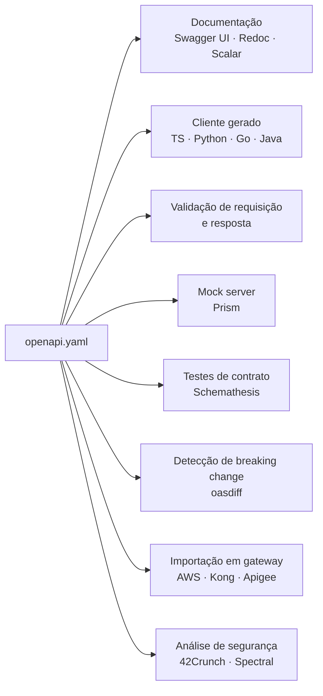
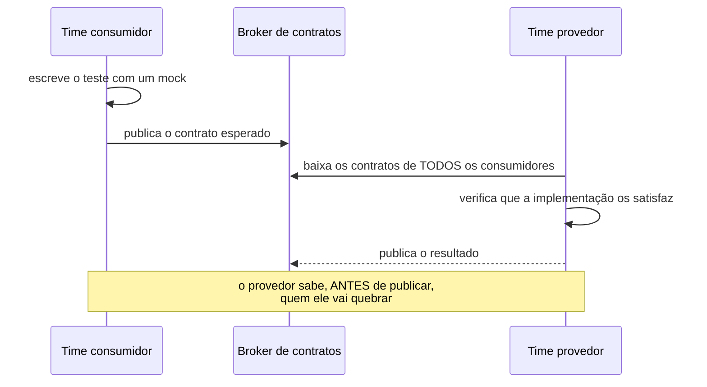

# 17 · Contratos e documentação

`Nível: avançado` · `Atualizado: 11/08/2026` · `OpenAPI 3.2.0 (set/2025)`

Uma API sem contrato legível por máquina é uma API que só existe na cabeça de quem a
escreveu. Este arquivo é sobre transformar isso em artefato.

---

## 1. Por que um contrato formal

| Sem contrato | Com contrato |
|---|---|
| documentação escrita à mão, que diverge | gerada da fonte da verdade |
| cliente descoberto por tentativa e erro | gerado automaticamente |
| validação duplicada em cada camada | uma declaração, várias aplicações |
| mudança quebradora descoberta em produção | detectada em CI |
| teste escrito à mão | gerado a partir do contrato |
| mock feito na mão | servido a partir do contrato |

**O retorno maior e menos citado: detecção automática de mudança quebradora.** Uma
ferramenta compara duas versões do contrato e falha o pipeline se você removeu um campo,
apertou uma validação ou mudou um tipo. Isso transforma "torcer para não quebrar ninguém"
em uma verificação mecânica.

---

## 2. OpenAPI

O padrão dominante para APIs HTTP. Antigo **Swagger**, doado à Linux Foundation em 2015.

### 2.1 Versões

| Versão | Quando | O que trouxe |
|---|---|---|
| Swagger 2.0 | 2014 | o padrão de facto |
| OpenAPI 3.0 | 2017 | `components`, `oneOf`, callbacks, links |
| **OpenAPI 3.1** | fev/2021 | **compatibilidade total com JSON Schema 2020-12**, webhooks |
| **OpenAPI 3.2.0** | **set/2025** | streaming de primeira classe (**SSE, JSON Lines, multipart**), tags hierárquicas, métodos HTTP customizados via `additionalOperations`, fluxo Device Authorization |
| OpenAPI 4.0 "Moonwalk" | — | **ainda não existe** em ago/2026; em fase de projeto, sem data |

> **Use 3.1 ou 3.2.** O salto de 3.0 para 3.1 é o que importa: até a 3.0, o "JSON Schema" do
> OpenAPI era um dialeto **incompatível** com o JSON Schema de verdade — o que obrigava a
> manter dois schemas para a mesma coisa. A 3.1 acabou com isso.
>
> **Não espere pela 4.0.** Ela está em projeto desde 2024 sem data de entrega, e a
> recomendação da própria OpenAPI Initiative é usar as versões 3.x existentes.

### 2.2 Estrutura

```yaml
openapi: 3.1.0
info:
  title: API de Biblioteca
  version: 1.0.0
servers:
  - url: https://api.exemplo.com/v1
security:
  - bearerAuth: []              # padrão para tudo; sobrescrevível por operação
tags:
  - name: livros
paths:
  /livros/{id}:
    get:
      operationId: obterLivro   # vira o nome da função no cliente gerado
      parameters: [...]
      responses:
        '200': { ... }
components:
  schemas: { ... }              # reutilizáveis via $ref
  responses: { ... }
  parameters: { ... }
  securitySchemes: { ... }
```

**O `operationId` importa mais do que parece:** ele vira o nome do método no cliente gerado.
`obterLivro()` é bom; `get_livros_id_get()` é o que você recebe quando não o define.

### 2.3 As dez coisas que faltam em 90% dos contratos

1. **Exemplos** (`examples`) — é o que as pessoas realmente leem. Um exemplo vale dez linhas
   de descrição.
2. **Todos os erros possíveis** — `401`, `403`, `404`, `409`, `422`, `429` documentados por
   operação, não só o `200`.
3. **Cabeçalhos de resposta** — `ETag`, `Location`, `Retry-After`, `Link`.
4. **`readOnly` / `writeOnly`** — `id` e `criado_em` não podem vir na requisição.
5. **`format`** — `uuid`, `date-time`, `email`, `uri`. Muda a validação e o código gerado.
6. **`deprecated: true`** — antes de remover, marque.
7. **Descrição dos parâmetros** — "o que é `cursor`?" não deveria exigir ler o código.
8. **`nullable` / `type: [string, 'null']`** — explicitar o que pode ser nulo.
9. **`additionalProperties: false`** — declarar que campo desconhecido é recusado.
10. **`servers`** por ambiente — produção, homologação, local.

---

## 3. JSON Schema

O vocabulário de validação por baixo do OpenAPI 3.1+. Vale conhecer por si.

```json
{
  "$schema": "https://json-schema.org/draft/2020-12/schema",
  "$id": "https://api.exemplo.com/schemas/livro.json",
  "type": "object",
  "required": ["titulo", "autor"],
  "additionalProperties": false,
  "properties": {
    "titulo": { "type": "string", "minLength": 1, "maxLength": 200 },
    "ano":    { "type": "integer", "minimum": 1450 },
    "isbn":   { "type": "string", "pattern": "^97[89](-?\\d){10}$" },
    "tipo":   { "enum": ["fisico", "digital"] }
  },
  "allOf": [{
    "if":   { "properties": { "tipo": { "const": "digital" } } },
    "then": { "required": ["url_download"] }
  }]
}
```

| Palavra-chave | Faz |
|---|---|
| `type`, `required`, `properties` | o básico |
| `additionalProperties: false` | recusa campo desconhecido |
| `oneOf` / `anyOf` / `allOf` / `not` | composição |
| `if` / `then` / `else` | validação condicional |
| `$ref` / `$defs` | reuso |
| `format` | semântica (`uuid`, `date-time`, `email`) |
| `const` / `enum` | valores fixos |
| `minimum`/`maximum`, `minLength`/`maxLength`, `pattern` | restrições |
| `minItems`/`maxItems`/`uniqueItems` | arrays |
| `readOnly` / `writeOnly` | direção |
| `examples` | exemplos |

**Bibliotecas maduras:** Ajv (JS, a referência), `jsonschema`/`fastjsonschema` (Python),
`everit`/`networknt` (Java), `santhosh-tekuri` (Go), `jsonschema` (Rust).

---

## 4. Design-first vs. code-first

| | **Design-first** | **Code-first** |
|---|---|---|
| Ordem | contrato → código | código → contrato gerado |
| Front e back em paralelo | ✅ desde o dia 1, com mock | ❌ só depois |
| Divergência contrato × código | **possível** | **impossível** |
| Revisão do contrato em PR | ✅ natural, é um arquivo | parcial |
| Curva inicial | maior | menor |
| Bom para | API pública, múltiplos times, contrato como produto | API interna, um time, iteração rápida |

> **Minha recomendação:** **design-first quando houver consumidor externo ou outro time**
> — o contrato é uma decisão de produto e merece revisão antes do código. **Code-first para
> API interna de um time só**, onde a garantia de não divergir vale mais que o paralelismo.
>
> **O que não é aceitável é a terceira via:** documentação escrita à mão, separada do
> código. Ela diverge em semanas, e documentação errada é **pior que nenhuma** — porque o
> consumidor confia nela e perde horas antes de desconfiar.

**Se você for design-first, um teste é obrigatório:** algo que verifique que toda rota
implementada existe no contrato. Sem isso, o design-first vira code-first com passos extras.
(O projeto-modelo deste curso tem esse teste.)

---

## 5. O que o contrato habilita



| Ferramenta | Faz |
|---|---|
| **Redoc / Scalar / Swagger UI** | documentação navegável |
| **Spectral** | lint do contrato com regras próprias |
| **oasdiff** | **detecta mudança quebradora entre versões** |
| **Prism** | mock server a partir do contrato |
| **Schemathesis** | gera casos de teste (fuzzing) a partir do contrato |
| **openapi-generator** | cliente e servidor em dezenas de linguagens |
| **openapi-typescript** | tipos TypeScript a partir do contrato |
| **42Crunch** | auditoria de segurança do contrato |

```bash
npx @stoplight/spectral-cli lint openapi.yaml
npx @redocly/cli build-docs openapi.yaml -o docs.html
npx oasdiff breaking openapi-v1.yaml openapi-v2.yaml     # falha o CI se quebrar
```

---

## 6. Governança: um linter com as suas regras

O poder do Spectral é permitir codificar as convenções do seu time.

```yaml
# .spectral.yaml
extends: [[spectral:oas, recommended]]

rules:
  # Toda operação precisa de operationId — senão o cliente gerado fica ilegível.
  operation-operationId:
    severity: error

  # Toda operação precisa documentar 4xx.
  operacao-documenta-erros:
    description: Toda operação deve documentar ao menos uma resposta 4xx.
    given: $.paths[*][get,post,put,patch,delete].responses
    severity: error
    then:
      function: schema
      functionOptions:
        schema:
          type: object
          anyOf:
            - required: ['400']
            - required: ['401']
            - required: ['404']
            - required: ['422']

  # Caminhos em kebab-case, sem camelCase nem underscore.
  caminho-kebab-case:
    description: Caminhos devem usar kebab-case.
    given: $.paths[*]~
    severity: error
    then:
      function: pattern
      functionOptions:
        match: '^(/[a-z0-9-]+|/\{[a-zA-Z0-9_]+\})+$'

  # Todo schema de resposta precisa de exemplo.
  resposta-tem-exemplo:
    given: $.paths[*][*].responses[*].content[*]
    severity: warn
    then:
      field: examples
      function: truthy
```

**Rode no CI.** Convenção que não é verificada não é convenção — é sugestão.

---

## 7. Testes de contrato

Três níveis, do mais barato ao mais caro:

### 7.1 Validação de resposta contra o schema

```javascript
import Ajv from 'ajv';
const ajv = new Ajv({ strict: false });
const valida = ajv.compile(schemaLivro);

test('a resposta obedece ao contrato', async () => {
  const r = await fetch(`${base}/livros/1`);
  const corpo = await r.json();
  if (!valida(corpo)) {
    throw new Error('resposta fora do contrato: ' + ajv.errorsText(valida.errors));
  }
});
```

**Faça isso para todas as respostas da sua suíte.** É barato e pega divergência
imediatamente. É o Exercício 8 do projeto-modelo.

### 7.2 Teste gerado a partir do contrato

```bash
pip install schemathesis
schemathesis run https://api.exemplo.com/openapi.json --checks all
```
Gera entradas conforme os schemas e verifica: status declarados, conformidade da resposta,
e se a API quebra com entrada estranha. **Encontra casos que ninguém pensaria em escrever.**

### 7.3 Consumer-driven contract testing (Pact)

Para quando **você é o consumidor** de uma API de outro time.



**Resolve um problema real:** o provedor sabe exatamente **quais consumidores** dependem de
quais campos. Sem isso, remover um campo é um salto no escuro.

**O custo:** infraestrutura (broker), disciplina dos dois lados, e uma curva de aprendizado
real. **Vale quando** há vários times consumindo a sua API internamente. Não vale para API
pública com consumidores anônimos — aí a resposta é versionamento e depreciação.

---

## 8. Documentação para humanos

O contrato gera a **referência**. Ele **não** gera o que as pessoas mais precisam.

| Tipo | O que é | Gerável do contrato? |
|---|---|---|
| **Referência** | cada endpoint, campo, erro | ✅ |
| **Tutorial** | "do zero à primeira chamada em 5 minutos" | ❌ |
| **Guia de tarefa** | "como paginar", "como tratar 429", "como assinar webhook" | ❌ |
| **Explicação** | modelo de dados, decisões, limites | ❌ |
| **Changelog** | o que mudou, quando, o que fazer | ❌ |

*(Esta divisão em quatro é o framework **Diátaxis**, de Daniele Procida — vale conhecer.)*

**O que faz diferença de verdade, em ordem:**

1. **Um exemplo `curl` completo e copiável** no topo de cada endpoint. É o que 80% das
   pessoas usam.
2. **Guia de "primeiros 5 minutos"** que funciona sem ler mais nada.
3. **Documentar os erros** tanto quanto os sucessos.
4. **Documentar os limites**: rate limit, tamanho máximo, itens por página.
5. **Changelog com data e instrução de migração**.
6. **Coleção pronta** (arquivo `.http`, Bruno, Postman) versionada no repositório.
7. **Dizer o que não se garante** — ordem, tempo de propagação, formato de id. Isso previne
   a Lei de Hyrum ([10-fundamentos.md](10-fundamentos.md) §1).

> **O teste da documentação:** dê a URL para alguém que nunca viu a API e peça a primeira
> chamada bem-sucedida. Cronometre. Se passar de 10 minutos, o problema é a documentação,
> não a pessoa.

---

## 9. AsyncAPI — o contrato para eventos

OpenAPI descreve requisição–resposta. Para mensageria, webhooks e streams, o análogo é o
**AsyncAPI** (versão **3.0**, dez/2023).

```yaml
asyncapi: 3.0.0
info:
  title: Eventos de Pedido
  version: 1.0.0
servers:
  producao:
    host: kafka.exemplo.com:9092
    protocol: kafka
channels:
  pedidoCriado:
    address: pedidos.criado
    messages:
      PedidoCriado:
        payload:
          type: object
          required: [id, cliente_id, total_centavos]
          properties:
            id:             { type: string, format: uuid }
            cliente_id:     { type: string, format: uuid }
            total_centavos: { type: integer }
operations:
  receberPedidoCriado:
    action: receive
    channel: { $ref: '#/channels/pedidoCriado' }
```

Menos maduro que o OpenAPI em ferramental, mas resolve um problema real: **eventos costumam
não ter contrato nenhum**, e o consumidor descobre o formato lendo uma mensagem de exemplo
que alguém colou no chat.

---

## 10. Os cinco porquês: por que a documentação de API sempre está errada?

**1. Por que a documentação diverge do código?**
Porque são dois artefatos separados, e só um deles quebra quando está errado. O código
errado falha o teste; a documentação errada não falha nada.

**2. Por que não escrever a documentação junto com o código, então?**
Porque a pressão de entrega recai sobre o comportamento, não sobre a descrição dele.
Quando o prazo aperta, corta-se o que não quebra o build — e documentação nunca quebra o
build.

**3. Então a solução é disciplina?**
Não. Disciplina falha na escala de um time e ao longo do tempo — é a mesma lição de
[16-seguranca.md](16-seguranca.md) §10. A solução é **estrutural**: fazer o contrato ser a
fonte da validação. Se o schema errado faz a requisição válida ser rejeitada, ele **não pode**
ficar desatualizado, porque errar dói imediatamente.

**4. Isso resolve tudo?**
Resolve a **referência**. Não resolve tutorial, guia e explicação — que não são geráveis e
continuam dependendo de alguém escrever. Para esses, o que funciona é tratá-los como
código: no mesmo repositório, revisados no mesmo PR, e com exemplos **executados no CI**.

**5. Exemplos executados no CI?**
Sim, e é a prática mais subestimada deste arquivo. Um exemplo `curl` na documentação que é
**executado** no pipeline não pode estar errado. Ferramentas de *documentation testing*
extraem os blocos de código, rodam e comparam a saída. É o mesmo princípio da fonte única
da verdade, aplicado à parte que não é gerável.

*(Parada legítima: incentivo estrutural explícito — o que não quebra não é mantido.)*

---

## 11. Checklist

**Contrato**
- [ ] OpenAPI 3.1+ versionado no repositório, junto do código.
- [ ] Todas as operações com `operationId`, `summary` e `tags`.
- [ ] Todos os erros documentados por operação.
- [ ] Exemplos em requisições e respostas.
- [ ] `readOnly`/`writeOnly`, `format` e `additionalProperties` declarados.
- [ ] Cabeçalhos de resposta documentados.
- [ ] Esquemas de segurança declarados.

**Automação**
- [ ] Lint do contrato no CI (Spectral, com regras do time).
- [ ] Detecção de mudança quebradora no CI (`oasdiff`).
- [ ] Validação de resposta contra o schema nos testes.
- [ ] Documentação publicada automaticamente a cada release.
- [ ] Mock server disponível para os consumidores.

**Humanos**
- [ ] Guia de "primeiros 5 minutos" que funciona sozinho.
- [ ] Exemplo `curl` copiável por endpoint — e testado no CI.
- [ ] Guias de tarefa: paginação, erros, rate limit, webhook.
- [ ] Changelog com instrução de migração.
- [ ] O que **não** é garantido, dito explicitamente.

---

## Autoteste

1. Qual é o retorno menos citado e mais valioso de ter um contrato formal?
2. O que a OpenAPI 3.1 corrigiu em relação à 3.0? Por que isso importava tanto?
3. A OpenAPI 4.0 existe em agosto de 2026? O que fazer a respeito?
4. Cite cinco coisas que faltam na maioria dos contratos.
5. Compare design-first e code-first. Qual é a terceira via inaceitável, e por quê?
6. Que teste é obrigatório num projeto design-first?
7. O que o `oasdiff` faz e por que ele muda o processo de release?
8. Explique o fluxo do consumer-driven contract testing. Quando ele se justifica?
9. Quais tipos de documentação o contrato **não** gera?
10. Por que a documentação sempre diverge? Qual é a solução estrutural, e o que ela não resolve?

---

### Fontes consultadas (11/08/2026)

- OpenAPI Initiative — https://www.openapis.org · especificação — https://spec.openapis.org
- OpenAPI Initiative — SIG Moonwalk (estado da 4.0) — https://github.com/OAI/sig-moonwalk
- APIScout — *OpenAPI 3.2: What's New & Migration Guide 2026* — https://apiscout.dev/guides/openapi-4-whats-new-migration-guide-2026
- JSON Schema — https://json-schema.org
- AsyncAPI — https://www.asyncapi.com
- Spectral — https://docs.stoplight.io/docs/spectral
- Pact — https://docs.pact.io
- Diátaxis — https://diataxis.fr
