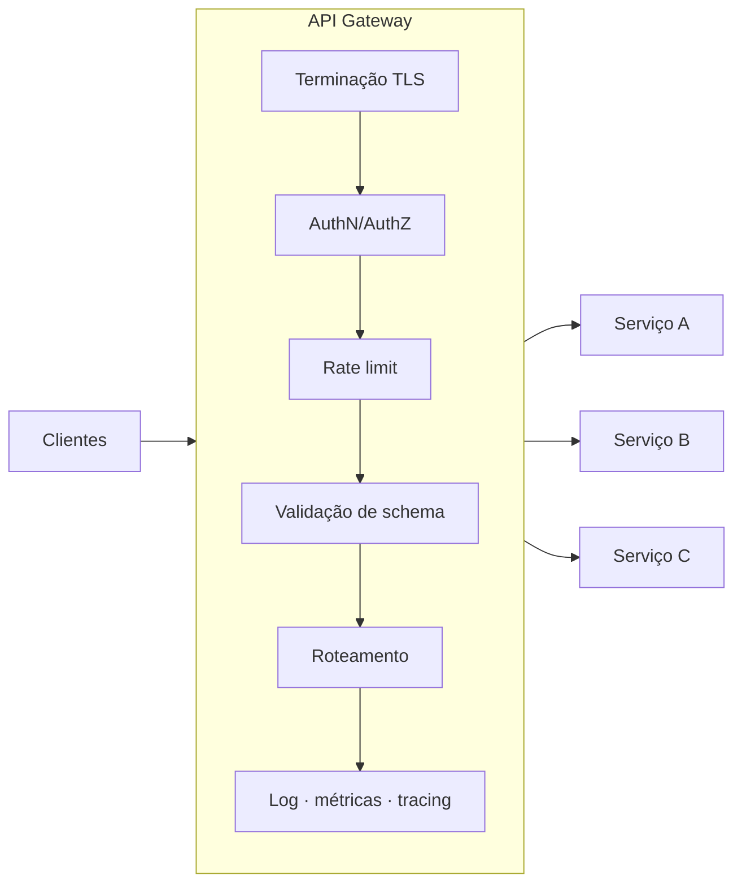
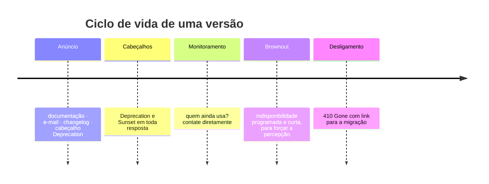

# 18 · Operação e ciclo de vida

`Nível: avançado` · `Atualizado: 11/08/2026`

Publicar a API é o começo. Este arquivo trata do que vem depois — e é onde as APIs
realmente falham.

---

## 1. API Gateway

Um intermediário na frente das suas APIs, que assume o que é comum a todas.



| Faz | Por que ali e não em cada serviço |
|---|---|
| Terminação TLS | um lugar para renovar certificado |
| Autenticação | um lugar para a lógica de token |
| Rate limit | **global de verdade**; num serviço replicado, o limite vira N × limite |
| Roteamento e versionamento | move tráfego sem mexer no cliente |
| Transformação de requisição/resposta | adapta contrato legado sem tocar no serviço |
| Cache | resposta comum servida sem tocar a origem |
| Observabilidade uniforme | log e métrica com o mesmo formato para tudo |
| WAF | proteção comum |

**O trade-off:** o gateway vira um **ponto único de falha** e um gargalo de mudança
(toda alteração passa por um time). Em compensação, sem ele cada serviço reimplementa
autenticação e rate limit — e implementa diferente, o que é pior.

> **Recomendação:** com **um** serviço, não use gateway; um proxy reverso simples (nginx,
> Caddy) basta. A partir de **três ou quatro** serviços com clientes externos, o gateway se
> paga. E note que o rate limit é o argumento mais forte: replicado, ele só funciona
> centralizado ou com estado compartilhado.

Custos e comparação de fornecedores em [80-custos-e-licencas.md](80-custos-e-licencas.md).

---

## 2. Observabilidade

**Três pilares, e um quarto que amarra tudo.**

### 2.1 Métricas — os quatro sinais dourados

| Sinal | O que medir | Por quê |
|---|---|---|
| **Latência** | p50, **p95**, **p99** — nunca a média | a média esconde a cauda; o p99 é a experiência do seu cliente mais importante |
| **Tráfego** | requisições por segundo, por rota | dimensionamento e detecção de anomalia |
| **Erros** | taxa de 4xx e de 5xx, **separadas** | 4xx sobe = cliente com problema; 5xx sobe = você com problema |
| **Saturação** | CPU, memória, conexões, fila | o que está perto do limite |

> **Nunca alerte sobre média de latência.** Se 99% responde em 20 ms e 1% em 30 s, a média
> fica em ~320 ms e parece ótima — enquanto 1% dos seus usuários está tendo uma experiência
> terrível. **Alerte sobre p95 e p99.**

**Separar 4xx de 5xx é a segunda regra mais importante:** uma alta de `422` significa que um
cliente novo está integrando errado — é um problema de documentação ou de contrato, não uma
falha sua. Misturar os dois na mesma métrica produz alerta inútil.

### 2.2 Logs

Estruturados, em JSON, uma linha por evento, **sem segredo**. O `log.js` do projeto-modelo
é uma implementação mínima e correta.

**O que registrar em toda requisição:** timestamp, request-id, método, rota (o **padrão**,
não a URL com o id — senão a cardinalidade explode), status, duração, identidade,
user-agent, tamanho da resposta.

### 2.3 Tracing distribuído

Sem ele, "por que essa requisição demorou 3 s?" é indecifrável numa cadeia de cinco serviços.

**OpenTelemetry** é o padrão vencedor, sob a CNCF — e é neutro em relação a fornecedor, o
que importa: você instrumenta uma vez e troca de backend (Jaeger, Tempo, Datadog, Honeycomb)
sem reinstrumentar.

**A propagação é feita pelo cabeçalho `traceparent`** (W3C Trace Context):
```http
traceparent: 00-4bf92f3577b34da6a3ce929d0e0e4736-00f067aa0ba902b7-01
             │  └─ trace id (a requisição inteira) ─┘ └ span id ─┘ └ flags
             versão
```

**Repasse esse cabeçalho em toda chamada que você fizer.** É a única coisa que conecta os
saltos, e esquecê-lo em um serviço quebra o rastro inteiro.

### 2.4 O que amarra: o request-id

Um identificador por requisição, que vai:
- no log de **todas** as linhas daquela requisição;
- no cabeçalho `X-Request-Id` da resposta;
- no campo `instance` do erro RFC 9457;
- propagado aos serviços seguintes.

**É o que transforma "deu erro ontem às 15h" numa busca de um segundo.** Sem ele, o suporte
não tem por onde começar.

### 2.5 Sondas de saúde

| Sonda | Responde | Consulta dependências? |
|---|---|---|
| **Liveness** (`/health`) | o processo está vivo? | **não** |
| **Readiness** (`/health/pronto`) | consigo atender? | **sim** |
| **Startup** | já terminei de iniciar? | parcial |

**A distinção não é burocracia.** Se a sonda de *liveness* consultar o banco e o banco cair,
o orquestrador **reinicia todos os seus processos** — que estavam saudáveis — e você troca
uma indisponibilidade parcial por uma total. *Liveness* responde sobre o processo;
*readiness* responde sobre a capacidade de atender.

---

## 3. Rate limiting e cotas

| Objetivo | Mecanismo |
|---|---|
| Proteger a infraestrutura | limite por segundo/minuto |
| Garantir justiça entre clientes | limite por identidade |
| Monetizar | cota por plano |
| Conter abuso | limite mais rígido por IP em rotas sensíveis |

**Camadas típicas, do mais geral ao mais específico:**
```text
1. Por IP, na borda/WAF        — contém DDoS e varredura
2. Por identidade, no gateway  — justiça e cota do plano
3. Por rota, no gateway        — protege a rota cara (busca, relatório)
4. Por custo, na aplicação     — GraphQL, operações em lote
```

**O limite por custo é o que falta na maioria das APIs.** Contar requisições não faz sentido
quando uma consulta custa 1 ms e outra custa 4 s. Atribua um custo por operação e limite o
**orçamento**, não a contagem. É obrigatório em GraphQL, onde o cliente escolhe a
complexidade.

**Sempre responda:** `429` + `Retry-After` + cabeçalhos `RateLimit`. Ver
[16-seguranca.md](16-seguranca.md) §6.

---

## 4. Versionamento

**Estratégias, com o custo real de cada uma:**

| Estratégia | Exemplo | A favor | Contra |
|---|---|---|---|
| **Caminho** | `/v1/pedidos` | explícito, cacheável, trivial de rotear | polui a URL; "o recurso é o mesmo" é violado |
| **Cabeçalho** | `Accept: application/vnd.api.v2+json` | URL limpa; puro segundo REST | invisível, difícil de testar no navegador |
| **Query** | `/pedidos?versao=2` | simples | atrapalha cache; fácil de esquecer |
| **Cabeçalho customizado** | `X-API-Version: 2` | simples | não é padrão |
| **Por data** | `Stripe-Version: 2026-08-11` | granularidade fina, evolução contínua | complexo de manter |
| **Sem versão** | só mudanças compatíveis | mais simples de todas | exige disciplina absoluta |

> **Recomendação:** **versão no caminho** (`/v1/`) para a maioria. É a menos elegante e a
> mais operável: dá para rotear no gateway, dá para cachear separado, dá para ver no log, e
> qualquer pessoa entende sem ler documentação. Elegância perde para operabilidade aqui.
>
> **A abordagem por data (Stripe) é a mais sofisticada** e vale conhecer: o cliente fixa uma
> data, e o servidor aplica transformações encadeadas para converter a resposta atual no
> formato daquela data. Permite evoluir continuamente sem `/v2`. **O custo é alto:** você
> mantém uma cadeia de transformações para sempre. Só compensa com muitos clientes externos
> que você não pode coordenar.

**A regra que evita a maior parte do problema:** **versione o menos possível.** Uma nova
versão obriga você a manter duas implementações e obriga todos os clientes a migrar. Prefira
mudanças compatíveis — adicione, não remova; torne opcional, não obrigatório.

---

## 5. Evolução compatível

**Mudanças seguras** (o cliente antigo continua funcionando):
- adicionar campo **opcional** na resposta;
- adicionar parâmetro **opcional** na requisição;
- adicionar um endpoint;
- adicionar um valor a um enum de **resposta** — *se* você documentou que o cliente deve
  tolerar valores desconhecidos;
- **afrouxar** uma validação.

**Mudanças quebradoras:**
- remover ou renomear campo;
- mudar tipo (`"42"` → `42`);
- tornar obrigatório o que era opcional;
- **apertar** uma validação (o cliente que mandava 300 caracteres agora falha);
- mudar código de status;
- mudar o significado de um valor;
- mudar a ordem, quando alguém dependia dela (**Lei de Hyrum**).

**O Princípio da Robustez, e por que ele é controverso:**

> *"Seja conservador no que você envia, liberal no que você aceita."* — Jon Postel

O conselho clássico. **A crítica moderna, que eu considero correta:** ser liberal demais no
que se aceita **perpetua bugs de cliente** e, com o tempo, o comportamento tolerado vira o
comportamento esperado (Lei de Hyrum de novo). Há um rascunho da IETF —
*The Harmful Consequences of the Robustness Principle* — argumentando exatamente isso.

**Minha recomendação, que é um meio-termo:**
- **rigoroso na entrada** (`additionalProperties: false`) — o cliente descobre o erro cedo;
- **tolerante na saída, do lado do cliente** — ignore campos que você não conhece, não
  quebre com valor de enum novo.

Isso é o inverso parcial de Postel, e é o que funciona melhor em API com contrato explícito.

---

## 6. Depreciação — como aposentar sem trair



**Cabeçalhos padronizados:**
```http
Deprecation: @1786553400
Sunset: Sat, 31 Jan 2027 23:59:59 GMT
Link: <https://docs.exemplo.com/migracao-v2>; rel="deprecation"
```
*(`Deprecation`: RFC 9745. `Sunset`: RFC 8594.)*

**O checklist honesto:**

1. **Anuncie com prazo generoso** — 6 a 12 meses para API pública.
2. **Envie os cabeçalhos** em toda resposta da versão antiga.
3. **Meça quem ainda usa**, por identidade. Sem isso você está adivinhando.
4. **Contate os que restam, diretamente.** Anúncio genérico não é lido.
5. **Faça um *brownout***: desligue por 1 hora, avisando antes. É a única coisa que faz o
   cliente perceber que precisa migrar — o e-mail ele arquivou.
6. **Desligue com `410 Gone`** e um link para a migração, nunca com `404` silencioso.
7. **Ofereça um caminho de migração** — documento, guia, e idealmente um período em que as
   duas versões coexistam.

> **O erro mais comum:** desligar sem medir quem usa. O segundo mais comum: nunca desligar,
> e acumular versões para sempre até que manter a API custe mais que reescrevê-la.

---

## 7. SLO e confiabilidade

| Termo | O que é |
|---|---|
| **SLI** | o que se mede: "% de requisições com resposta < 300 ms" |
| **SLO** | a meta interna: "99,5% em 30 dias" |
| **SLA** | o compromisso contratual, com multa. **Sempre mais frouxo que o SLO** |
| **Error budget** | o que sobra: 100% − SLO |

**O *error budget* é a ideia mais útil aqui.** Com SLO de 99,9% em 30 dias, você tem
**43 minutos** de falha permitidos. Se o mês vai bem, gaste o orçamento com deploys
arriscados. Se o orçamento acabou, **congele mudanças** até o próximo período.

Isso transforma a briga eterna entre "entregar rápido" e "manter estável" em uma **conta
objetiva** — e é a contribuição mais prática da disciplina de SRE.

**Números para calibrar:**

| Disponibilidade | Indisponibilidade/mês | Indisponibilidade/ano |
|---|---|---|
| 99% | 7 h 18 min | 3,65 dias |
| 99,9% | 43 min | 8,8 h |
| 99,95% | 21 min | 4,4 h |
| 99,99% | 4,4 min | 52 min |
| 99,999% | 26 s | 5,3 min |

> **Cada "nove" custa aproximadamente uma ordem de grandeza a mais.** Antes de prometer
> 99,99%, faça a conta: são 4 minutos por mês, o que significa que **um único deploy ruim**
> consome o mês inteiro. E lembre-se de [10-fundamentos.md](10-fundamentos.md) §4: sua
> disponibilidade é limitada pelo **produto** das dependências síncronas.

---

## 8. Padrões de resiliência

| Padrão | Resolve |
|---|---|
| **Timeout** | requisição pendurada segurando recurso |
| **Retry com backoff e jitter** | falha transitória — sem agravar |
| **Circuit breaker** | falha em cascata quando a dependência cai |
| **Bulkhead** | isolar pools por dependência, para que uma não afogue as outras |
| **Fallback** | resposta degradada (cache antigo, valor padrão) |
| **Load shedding** | recusar tráfego excedente **rápido**, em vez de degradar todo mundo |
| **Backpressure** | sinalizar ao produtor que ele precisa desacelerar |

**A ordem de implementação importa**, e quase todo mundo faz na ordem errada:

1. **Timeout** — sem ele, nada mais funciona. É o pré-requisito de tudo.
2. **Retry com jitter** — só para erros retentáveis.
3. **Circuit breaker** — porque o retry sozinho **piora** a falha em cascata.
4. **Fallback** — degradar é melhor que falhar.
5. **Bulkhead** e **load shedding** — quando a escala exigir.

> **Retry sem circuit breaker é perigoso.** Quando a dependência cai, cada requisição sua
> vira 3 ou 5 requisições, e você **multiplica** a carga sobre um sistema que já está
> caindo — exatamente quando ele mais precisa de folga para se recuperar.

Implementações em [06-exemplos.md](06-exemplos.md) §3 e §4.

---

## 9. Deploy sem quebrar

| Estratégia | Como | Bom para |
|---|---|---|
| **Rolling** | substitui instância por instância | padrão do Kubernetes |
| **Blue/green** | dois ambientes, troca o tráfego de uma vez | rollback instantâneo |
| **Canário** | 1% → 10% → 50% → 100%, medindo | mudança arriscada |
| **Feature flag** | código já publicado, comportamento desligado | separar deploy de release |

**Regras específicas de API:**

1. **Compatibilidade nos dois sentidos durante o rolling.** Durante a substituição, versões
   antiga e nova rodam **ao mesmo tempo**. A nova não pode exigir nada que a antiga não
   produza, e vice-versa.
2. **Migração de banco em duas fases** — a regra *expand/contract*:
   ```text
   Fase 1 (expand):  adicione a coluna nova, escreva nas DUAS, leia da antiga
   Fase 2:           passe a ler da nova
   Fase 3 (contract): pare de escrever na antiga
   Fase 4:           remova a antiga  ← só depois que ninguém mais a usa
   ```
   Fazer tudo de uma vez quebra durante o rolling, garantidamente.
3. **Desligamento gracioso** — `SIGTERM` deve parar de aceitar conexões novas e **drenar**
   as em andamento. Sem isso, cada deploy devolve conexões fechadas a clientes que não sabem
   se é seguro retentar. O projeto-modelo implementa isso.
4. **Sem downtime na troca de contrato:** publique o servidor que **aceita** o formato novo
   antes de publicar o cliente que o **envia**.

---

## 10. Os cinco porquês: por que APIs acumulam versões que ninguém desliga?

**1. Por que a v1 continua no ar cinco anos depois da v3?**
Porque desligar tem risco de quebrar alguém, e manter parece não ter custo.

**2. Manter não tem custo mesmo?**
Tem, e é alto: cada versão exige teste, correção de segurança, capacidade de infraestrutura
e espaço na cabeça de quem mantém. Mas o custo é **difuso e adiado**, enquanto o risco de
desligar é **concentrado e imediato**.

**3. Por que a assimetria decide?**
Porque quem decide desligar leva a culpa se algo quebrar hoje, e não recebe crédito pela
economia diluída ao longo de anos. **O incentivo individual aponta para não desligar** —
mesmo quando o incentivo da organização aponta para o contrário.

**4. Como corrigir esse incentivo?**
Tornando o custo **visível e atribuído**: métrica de uso por versão num painel, data de
sunset definida **no lançamento** (não depois), e a depreciação como parte do processo
normal de release — não como um projeto especial que alguém precisa defender.

**5. E se ninguém tiver coragem de desligar mesmo assim?**
Então o **brownout** é a ferramenta. Uma indisponibilidade programada e curta transfere a
descoberta para o cliente, **antes** do desligamento definitivo, e converte a decisão
política numa mecânica. É desconfortável de propósito — e é o único método que eu vi
funcionar com consistência.

*(Parada legítima: desalinhamento de incentivos, explicitado.)*

---

## 11. Checklist de produção

**Antes de publicar**
- [ ] Sondas de liveness e readiness, **distintas**.
- [ ] Log estruturado com request-id, sem segredo.
- [ ] Métricas dos quatro sinais dourados, com 4xx e 5xx separados.
- [ ] Tracing com propagação de `traceparent`.
- [ ] Rate limit com `429` + `Retry-After`.
- [ ] Timeout em toda chamada externa.
- [ ] Desligamento gracioso no `SIGTERM`.
- [ ] Limites de tamanho, página e lote.
- [ ] Contrato publicado e versionado.
- [ ] Versão definida na URL desde o dia 1.

**Depois de publicar**
- [ ] Alertas sobre **p95/p99** e taxa de 5xx — nunca sobre média.
- [ ] Painel de uso **por versão e por cliente**.
- [ ] SLO definido, com error budget acompanhado.
- [ ] Circuit breaker nas dependências críticas.
- [ ] Runbook do que fazer quando o alerta disparar.
- [ ] Política de depreciação escrita, com prazos.
- [ ] Changelog público e atualizado.

---

## Autoteste

1. Quando um gateway se justifica? Qual é o argumento mais forte a favor dele?
2. Por que nunca alertar sobre média de latência?
3. Por que separar as métricas de 4xx e 5xx?
4. O que acontece se a sonda de liveness consultar o banco?
5. O que é limite por custo, e por que ele é obrigatório em GraphQL?
6. Compare as estratégias de versionamento. Qual você escolhe e por quê?
7. Qual é a crítica moderna ao Princípio da Robustez? Qual meio-termo este arquivo recomenda?
8. O que é um brownout e por que ele é a única coisa que costuma funcionar?
9. Calcule o error budget de um SLO de 99,9% em 30 dias. Como usá-lo?
10. Por que retry sem circuit breaker é perigoso?
11. Explique o padrão expand/contract de migração de banco. O que acontece se você pular etapas?
12. Por que APIs acumulam versões que ninguém desliga? Vá até o terceiro "porquê".

---

### Fontes consultadas (11/08/2026)

- Google — *Site Reliability Engineering* (livro gratuito) — https://sre.google/books/
- OpenTelemetry — https://opentelemetry.io
- W3C — *Trace Context* — https://www.w3.org/TR/trace-context/
- IETF — RFC 8594 (*Sunset* header) e RFC 9745 (*Deprecation* header)
- IETF — *The Harmful Consequences of the Robustness Principle* (draft) — https://datatracker.ietf.org/doc/draft-iab-protocol-maintenance/
- Nygard, M. — *Release It!*, 2ª ed., Pragmatic Bookshelf, 2018
