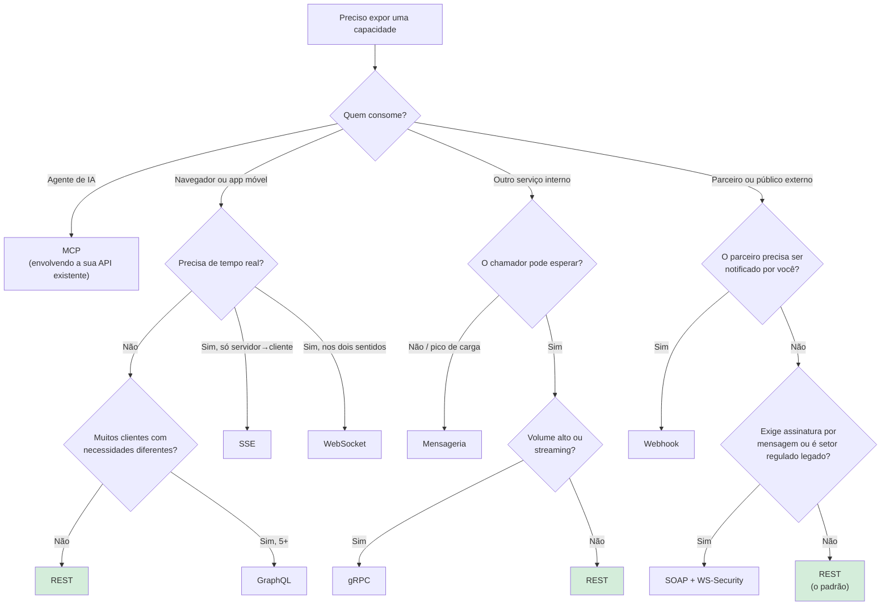

# 19 · Como escolher — a comparação completa

`Nível: todos` · `Atualizado: 11/08/2026`

Este é o arquivo que responde à sua quarta pergunta: **quais tipos existem e quais as
diferenças**. Tabelas lado a lado, fluxograma de decisão, e recomendações por cenário.

Se você leu só o [01-introducao-leigo.md](01-introducao-leigo.md), pode vir direto para cá.

---

## 1. As duas classificações que não se misturam

O erro mais comum em conversas técnicas é misturar dois eixos independentes.

### Eixo 1 — **escopo**: quem tem permissão de usar

| Tipo | Quem usa | Consequências de design |
|---|---|---|
| **Privada / interna** | times da mesma empresa | pode mudar rápido; coordenação por conversa |
| **De parceiro** | empresas específicas, sob contrato | mudança negociada; SLA formal |
| **Pública / aberta** | qualquer um, com cadastro | **o contrato é imutável na prática**; versionamento sério; documentação é produto |
| **Composta / BFF** | agrega várias outras para uma tela | otimizada para um cliente específico |

### Eixo 2 — **estilo**: como se conversa

REST, RPC, gRPC, GraphQL, SOAP, WebSocket, SSE, webhook, mensageria, MCP.

**Os dois eixos são ortogonais.** Existe API interna em REST e API pública em gRPC. Quando
alguém pergunta "que tipo de API é essa?", a resposta útil menciona os dois:
*"é uma API interna, em gRPC"*.

**Por que confundir gera erro:** as decisões de **escopo** determinam o rigor
(versionamento, documentação, estabilidade); as de **estilo** determinam a mecânica. Um time
que trata uma API pública com a informalidade de uma interna quebra clientes; um time que
trata uma interna com o cerimonial de uma pública entrega devagar sem motivo.

---

## 2. A tabela mestre

| Critério | **REST** | **GraphQL** | **gRPC** | **SOAP** | **WebSocket** | **SSE** | **Webhook** | **Mensageria** | **MCP** |
|---|---|---|---|---|---|---|---|---|---|
| **Ano** | 2000 | 2015 | 2015 | 1999 | 2011 | 2009 | ~2007 | anos 80 | 2024 |
| **Transporte** | HTTP | HTTP | HTTP/2 | HTTP+ | TCP | HTTP | HTTP | broker | JSON-RPC |
| **Formato** | JSON | JSON | Protobuf | XML | livre | texto | JSON | livre | JSON |
| **Direção** | C→S | C→S | ambos | C→S | ambos | S→C | S→C | assíncrona | ambos |
| **Quem define a resposta** | servidor | **cliente** | servidor | servidor | — | servidor | servidor | produtor | servidor |
| **Contrato obrigatório** | ❌ | ✅ | ✅ | ✅ | ❌ | ❌ | ❌ | ❌ | ✅ |
| **Cache HTTP** | ✅ | ❌ | ❌ | ❌ | ❌ | ❌ | — | — | ❌ |
| **Streaming** | limitado | parcial | ✅ 4 modos | ❌ | ✅ | ✅ | — | ✅ | ✅ |
| **Do navegador** | ✅ | ✅ | ⚠️ gRPC-Web | ⚠️ | ✅ | ✅ | — | ❌ | — |
| **Legível por humano** | ✅ | ✅ | ❌ | ⚠️ | varia | ✅ | ✅ | varia | ✅ |
| **Testável com curl** | ✅ | ✅ | ❌ | ⚠️ | ❌ | ✅ | ✅ | ❌ | ⚠️ |
| **Eficiência de banda** | média | média | **alta** | **baixa** | alta | média | média | alta | média |
| **Curva de aprendizado** | baixa | média | média | **alta** | média | **baixa** | baixa | alta | média |
| **Maturidade do ferramental** | **altíssima** | alta | alta | alta | alta | média | média | alta | crescendo |
| **Acoplamento temporal** | síncrono | síncrono | síncrono | síncrono | contínuo | contínuo | **assíncrono** | **assíncrono** | síncrono |

---

## 3. As comparações que mais importam, duas a duas

### 3.1 REST × GraphQL

| | REST | GraphQL |
|---|---|---|
| **Quem decide os campos** | servidor | **cliente** |
| Over-fetching | comum | resolvido |
| Under-fetching (N chamadas) | comum | resolvido |
| Cache HTTP / CDN | ✅ natural | ❌ exige *persisted queries* |
| Códigos de status | ✅ semânticos | ❌ tudo `200` com array `errors` |
| Rate limit | por requisição | **por custo da consulta** |
| N+1 no banco | você controla | **exige DataLoader em todo resolver** |
| Upload de arquivo | nativo | extensão |
| Curva do time | baixa | média |
| Observabilidade | por rota, trivial | por operação; ferramentas próprias |

> **Escolha GraphQL quando:** há **muitos clientes com necessidades diferentes** (web, iOS,
> Android, parceiros) sobre um **grafo de dados rico e interconectado**, e o time tem
> maturidade para operar DataLoader, limite de complexidade e cache próprio.
>
> **Escolha REST quando:** API pública, CRUD, poucos consumidores, ou cache é importante.
>
> **A pergunta decisiva:** *quantos clientes diferentes consomem os mesmos dados de formas
> diferentes?* Um ou dois → REST. Cinco ou mais, com telas muito distintas → GraphQL começa
> a se pagar.

### 3.2 REST × gRPC

| | REST | gRPC |
|---|---|---|
| Otimiza para | **interoperabilidade** | **eficiência** |
| Bytes na rede | maior | **30–50% menor** |
| Latência | maior | menor |
| Contrato | opcional (OpenAPI) | **obrigatório (.proto)** |
| Geração de código | possível | **excelente** |
| Do navegador | direto | precisa de gRPC-Web + proxy |
| Depuração | `curl` | `grpcurl` |
| Streaming | limitado | **4 modos** |
| Cache | ✅ | ❌ |

> **O arranjo dominante, e ele não é indecisão:** **REST na borda, gRPC por dentro.**
> Na borda você precisa que qualquer um consiga integrar; por dentro você precisa de
> eficiência e contrato forte. Cada um onde ganha.

### 3.3 WebSocket × SSE × polling × webhook

Todos resolvem "o servidor precisa avisar o cliente". As diferenças são grandes.

| | Polling | Long polling | **SSE** | **WebSocket** | **Webhook** |
|---|---|---|---|---|---|
| Quem inicia | cliente, repetidamente | cliente, segurando | cliente, **uma vez** | cliente, uma vez | **servidor** |
| Direção | C→S | C→S | **S→C** | **ambos** | S→S |
| Requer o cliente online | sim | sim | sim | sim | **não — é servidor↔servidor** |
| Latência | até o intervalo | baixa | **baixa** | **mínima** | baixa |
| Desperdício | **alto** | médio | mínimo | mínimo | zero |
| Reconexão | trivial | trivial | ✅ **automática** | você implementa | N/A (retentativa do emissor) |
| Retomada após queda | trivial | trivial | ✅ `Last-Event-ID` | você implementa | id + dedup |
| Atravessa proxy/CDN | ✅ | ✅ | ✅ | ⚠️ configuração | ✅ |
| Cabe em HTTP normal | ✅ | ✅ | ✅ | ❌ (upgrade) | ✅ |
| Complexidade | mínima | baixa | **baixa** | média | média |

> **A regra que resolve 90% dos casos:**
> - só **servidor → cliente**, cliente é navegador ou app → **SSE**;
> - **os dois lados** falam com frequência (chat, jogo, colaboração) → **WebSocket**;
> - **servidor → outro servidor** → **webhook**;
> - eventos rarísimos e você não pode manter conexão → **polling com ETag**.
>
> **SSE é a escolha certa com muito mais frequência do que é escolhido.** WebSocket é
> selecionado por reflexo, e traz complexidade de reconexão, autenticação e escala que
> muitos projetos não precisavam pagar.

### 3.4 Síncrono × assíncrono (o eixo mais importante de todos)

| | Síncrono (REST, gRPC, GraphQL) | Assíncrono (fila, evento) |
|---|---|---|
| O cliente espera | sim | não |
| Erro aparece | na hora | depois, longe |
| Disponibilidade | **multiplica** com a cadeia | isolada |
| Pico de carga | derruba | **enfileira** |
| Ordem | natural | difícil |
| Depuração | direta | exige tracing |
| Consistência | imediata | **eventual** |

**Este eixo é mais estrutural que a escolha do estilo.** Trocar REST por gRPC é uma
refatoração; trocar síncrono por assíncrono é um redesenho do domínio, porque muda o que o
usuário vê e o que o negócio garante.

---

## 4. Fluxograma de decisão



**Leia o fluxograma com uma ressalva:** ele mostra o **ponto de partida**, não uma sentença.
Sistemas reais combinam vários — e devem.

---

## 5. Cenários concretos

| Cenário | Escolha | Por quê |
|---|---|---|
| CRUD de um sistema administrativo | **REST** | simples, cacheável, todo mundo entende |
| API pública para desenvolvedores externos | **REST** + OpenAPI | menor custo de integração; ferramental universal |
| App móvel com telas muito diferentes | **GraphQL** ou **BFF em REST** | evita 5 chamadas encadeadas na rede móvel |
| Microsserviços internos de alto volume | **gRPC** | eficiência, contrato forte, streaming |
| Chat / edição colaborativa / jogo | **WebSocket** | bidirecional e de baixa latência |
| Painel ao vivo, notificação, streaming de IA | **SSE** | mais simples e usa a infraestrutura HTTP |
| Avisar um parceiro de um pagamento | **Webhook** | ele não precisa perguntar; não precisa estar online |
| Processar 10 mil pedidos em pico | **Mensageria** | a fila absorve o pico |
| Integrar com banco ou órgão público | **SOAP**, se for o que existe | não há escolha; aprenda a ler WSDL |
| Exportar relatório de 500 MB | **`202` + link** para arquivo | HTTP não foi feito para transferir isso na resposta |
| Dar capacidades a um agente de IA | **MCP** sobre a API existente | descoberta de ferramentas e descrição para modelo |
| Consulta analítica arbitrária | **nem API** — exportação ou data warehouse | não force uma linguagem de consulta na sua API |

---

## 6. Combinações que fazem sentido

Escolher um não exclui os outros. Arranjos comuns e defensáveis:

```text
Navegador ──REST──►  Gateway ──gRPC──►  Serviços internos
                        │
                        └──SSE──►  Navegador (notificações)

Serviço A ──publica evento──► Kafka ──► Serviço B, C, D
                                          │
                                          └──webhook──► Parceiro externo

API REST ──envolvida por──► Servidor MCP ──► Agente de IA
```

| Combinação | Quando |
|---|---|
| REST na borda + gRPC dentro | o arranjo mais comum em arquitetura de serviços |
| REST para CRUD + SSE para tempo real | painel que lista e atualiza ao vivo |
| REST síncrono + evento assíncrono | responder rápido e propagar depois (*outbox*) |
| GraphQL como BFF sobre REST | unifica várias APIs para uma tela, sem reescrevê-las |
| Webhook **+** endpoint de polling | o parceiro escolhe; webhook falha, o polling salva |
| API REST + servidor MCP | mesmo domínio, dois públicos |

> **O conselho mais valioso deste arquivo:** o erro caro não é escolher o protocolo errado —
> é **acoplar a sua lógica de negócio ao protocolo**. Se o domínio estiver isolado do
> transporte, trocar REST por gRPC, ou adicionar SSE, é escrever um adaptador. Se estiver
> acoplado, é reescrever o sistema.

---

## 7. Como decidir, em quatro perguntas

Quando estiver em dúvida, responda a estas quatro. Elas resolvem quase tudo.

**1. Quem consome?**
Navegador → precisa de HTTP e algo que o JavaScript fale.
Serviço interno → pode usar binário e contrato forte.
Parceiro externo → precisa de estabilidade e documentação.
Agente de IA → precisa de descrição semântica.

**2. Qual o volume e a sensibilidade à latência?**
Baixo → escolha pela simplicidade.
Alto → a eficiência começa a pagar a complexidade.

**3. O consumidor pode esperar?**
Sim → síncrono.
Não, ou há pico → assíncrono.
Precisa de resposta imediata **e** processamento longo → `202` + acompanhamento.

**4. Qual a maturidade operacional do time?**
GraphQL sem DataLoader e limite de complexidade é uma bomba-relógio.
gRPC sem quem saiba depurar Protobuf é atrito diário.
Kafka sem quem saiba operá-lo é um ponto único de falha caro.
**Escolher tecnologia acima da maturidade do time é como o projeto morre — e é sempre a
falha menos discutida.**

---

## 8. Antipadrões de escolha

| Antipadrão | Por que dá errado |
|---|---|
| "Vamos de GraphQL porque é moderno" | complexidade sem o problema que ela resolve |
| "Vamos de gRPC porque é rápido" | e aí o navegador não consegue chamar |
| "WebSocket para tudo que é tempo real" | SSE resolveria com metade do custo |
| "Kafka porque escala" | um Postgres com uma tabela de fila resolveria por 5 anos |
| "REST porque é o padrão" (para 30 ações e nenhum recurso) | RPC seria mais honesto |
| "Uma API por tabela" | vaza a implementação e acopla tudo |
| "Microsserviços desde o dia 1" | acoplamento de rede é pior que acoplamento de código |
| "Vamos suportar REST **e** GraphQL **e** gRPC" | três superfícies para manter e testar |

> **O padrão comum a todos:** escolher pela tecnologia, não pelo problema. A pergunta certa
> nunca é "qual é o melhor?", e sim **"qual é o meu problema, e o que ele exige?"**

---

## 9. Os cinco porquês: por que não existe um estilo vencedor?

**1. Por que ainda há tantos estilos em 2026?**
Porque os requisitos são genuinamente conflitantes.

**2. Que conflitos?**
Eficiência **contra** legibilidade. Flexibilidade do cliente **contra** cacheabilidade.
Contrato rígido **contra** facilidade de começar. Sincronia **contra** resiliência.

**3. Por que a engenharia não resolve esses conflitos?**
Porque são **trade-offs**, não problemas. Binário é sempre menos legível que texto — isso é
a definição, não uma limitação. Se o cliente escolhe a forma da resposta, o cache não pode
prever a resposta. São verdades lógicas, não obstáculos de implementação.

**4. Então por que se fala em "X vai substituir Y"?**
Porque conteúdo sobre tecnologia é consumido em ciclos de moda, e moda precisa de vencedor.
Além disso, comparações costumam ser feitas **fora de contexto** — e fora de contexto
nenhuma delas significa nada.

**5. Qual é a atitude correta, então?**
Conhecer os trade-offs, escolher pelo contexto, **combinar quando fizer sentido**, e manter
a lógica de negócio independente do transporte para que a escolha continue reversível.
**Não há resposta certa universal — há resposta certa para o seu problema, hoje, com o seu
time.**

*(Parada legítima: trade-offs irredutíveis, declarados como tais.)*

---

## Autoteste

1. Quais são os dois eixos de classificação de APIs? Por que confundi-los gera erro?
2. Qual a diferença central entre REST e GraphQL? Qual pergunta decide entre os dois?
3. Por que "REST na borda, gRPC por dentro" não é indecisão?
4. Compare SSE e WebSocket em cinco dimensões. Por que SSE é subutilizado?
5. Por que o eixo síncrono/assíncrono é mais estrutural que a escolha do estilo?
6. Percorra o fluxograma para: "app móvel que precisa mostrar notificações ao vivo".
7. Cite três combinações de estilos que fazem sentido juntas.
8. Quais são as quatro perguntas de decisão? Qual delas é a menos discutida e mais fatal?
9. Escolha três antipadrões e explique o erro comum a todos eles.
10. Por que não existe um estilo vencedor? Vá até o terceiro "porquê".
