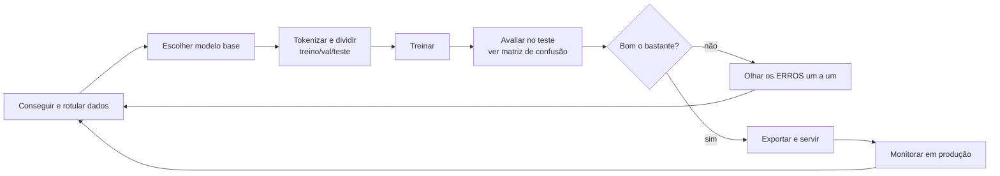

# 04 · Como começar — do ambiente pronto ao primeiro resultado

`Nível: iniciante` · `Todas as saídas foram executadas em 12/08/2026` ·
`transformers 5.15.0 · torch 2.13.0+cpu · Python 3.10.12`

---

Este arquivo assume que você **já instalou tudo** seguindo
[03-instalacao.md](03-instalacao.md) — ou que está num notebook do Colab. Nada de
instalação se repete aqui.

Objetivo: em 15 minutos, sair do zero e ter (1) BERT completando lacunas, (2) BERT
transformando frases em vetores, (3) o ciclo de trabalho do dia a dia na cabeça.

---

## Passo 1 · O "olá mundo" do BERT: completar a lacuna

Este é o único uso em que o BERT faz exatamente o que foi treinado para fazer, sem
nenhum ajuste. Crie `hello_bert.py`:

```python
from transformers import pipeline

# 'fill-mask' = completar a palavra escondida. É a tarefa nativa do BERT.
completar = pipeline("fill-mask", model="neuralmind/bert-base-portuguese-cased")

frase = "O Brasil é o maior país da América do [MASK]."

for resultado in completar(frase)[:3]:
    print(f"{resultado['score']:.3f}  {resultado['token_str']}")
```

```bash
python hello_bert.py
```

**Saída real:**

```
0.955  Sul
0.042  Norte
0.002  sul
```

O que aconteceu, na ordem:

1. `pipeline(...)` baixou ~440 MB do Hugging Face Hub para `~/.cache/huggingface`
   (só na primeira vez — depois é instantâneo).
2. O texto virou números (*tokens*).
3. O modelo calculou, para **cada uma das 29.794 palavras do seu vocabulário**, a
   probabilidade de ela ser a que está escondida.
4. Você viu as três mais prováveis.

### Você vai ver este aviso — e ele NÃO é erro

```
[transformers] BertForMaskedLM LOAD REPORT from: neuralmind/bert-base-portuguese-cased
Key                         | Status
----------------------------+------------
bert.pooler.dense.weight    | UNEXPECTED
cls.seq_relationship.weight | UNEXPECTED
```

Tradução: o arquivo baixado contém pesos de partes que **esta tarefa não usa** (o *pooler*
e a cabeça de NSP — ver [14-pre-treino-mlm-nsp.md](14-pre-treino-mlm-nsp.md)). Ignorar é o
comportamento correto. Quando aparecer `MISSING` no lugar de `UNEXPECTED`, aí sim preste
atenção: significa que uma parte foi inicializada aleatoriamente e o modelo **precisa** ser
treinado antes de servir para alguma coisa.

### Brinque antes de seguir

Troque a frase e observe. Sugestões que ensinam algo:

```python
completar("A capital da França é [MASK].")
# 0.826 Paris | 0.095 Cannes | 0.044 Nice   ← conhecimento factual veio do pré-treino

completar("Ele foi ao banco para [MASK] dinheiro.")
# 0.448 pegar | 0.281 pedir | 0.036 conseguir   ← desambiguou "banco" pelo contexto

completar("A [MASK] tomou a decisão final sobre o caso.")
# veja quais profissões e gêneros ele sugere — isso é viés aprendido do corpus,
# assunto de 75-armadilhas.md
```

> **Atenção ao `[MASK]`:** o token tem que ser escrito exatamente assim, em maiúsculas.
> `[mask]` ou `<mask>` não funcionam neste modelo — cada família usa o seu
> (RoBERTa usa `<mask>`). Use `completar.tokenizer.mask_token` para não errar.

---

## Passo 2 · Ver o texto virar números

Este passo parece burocrático e é o mais importante do arquivo. Quase todo bug de
principiante mora aqui.

```python
from transformers import AutoTokenizer

tok = AutoTokenizer.from_pretrained("neuralmind/bert-base-portuguese-cased")

entrada = tok("O gato subiu no telhado.")
print("input_ids:", entrada["input_ids"])
print("tokens   :", tok.convert_ids_to_tokens(entrada["input_ids"]))
print("decode   :", tok.decode(entrada["input_ids"]))
print("vocabulário:", tok.vocab_size)
```

**Saída real:**

```
input_ids: [101, 231, 15997, 10996, 202, 16267, 119, 102]
tokens   : ['[CLS]', 'O', 'gato', 'subiu', 'no', 'telhado', '.', '[SEP]']
decode   : [CLS] O gato subiu no telhado. [SEP]
vocabulário: 29794
```

Três coisas para notar:

1. **`[CLS]` e `[SEP]` foram inseridos sozinhos.** `[CLS]` (id 101) marca o início e é a
   posição de onde se lê o "resumo da frase" na classificação; `[SEP]` (id 102) marca o fim.
   Você **não** os digita — o tokenizador põe. Ver
   [13-arquitetura-encoder.md](13-arquitetura-encoder.md).
2. **Palavra ≠ token.** Palavras raras são quebradas em pedaços:

```python
print(tok.tokenize("O paralelepípedo antidesestabelecimentarismo"))
```
```
['O', 'paral', '##ele', '##p', '##íp', '##ed', '##o', 'anti', '##des', '##esta',
 '##belec', '##ime', '##ntar', '##ismo']
```

O `##` significa "cola no anterior, sem espaço". É assim que um vocabulário de 30 mil
entradas cobre uma língua inteira, inclusive palavras que nunca viu. Detalhes em
[12-tokenizacao-wordpiece.md](12-tokenizacao-wordpiece.md).

3. **Pares de frases existem e são nativos:**

```python
par = tok("Qual a capital?", "A capital é Brasília.")
print(tok.convert_ids_to_tokens(par["input_ids"]))
print(par["token_type_ids"])
```
```
['[CLS]','Qual','a','capital','?','[SEP]','A','capital','é','Brasília','.','[SEP]']
[0, 0, 0, 0, 0, 0, 1, 1, 1, 1, 1, 1]
```

O `token_type_ids` diz ao modelo qual frase é qual. É o que viabiliza tarefas de par:
pergunta-resposta, similaridade, "esta resposta serve para esta pergunta?".

### A pegadinha do `model_max_length`

```python
print(tok.model_max_length)
# 1000000000000000019884624838656   ← não, o modelo não aceita isso
```

Alguns modelos (BERTimbau entre eles) não declaram o limite no arquivo de configuração, e a
biblioteca preenche com esse número absurdo, que quer dizer "sem limite declarado". O limite
real do BERT é **512 tokens** — e se você passar mais, o erro que aparece é um
`IndexError` cru vindo de dentro do PyTorch, sem explicação.

**Regra prática: sempre passe `truncation=True` e `max_length` explícito.**

```python
tok(texto, truncation=True, max_length=512)
```

---

## Passo 3 · O que sai de dentro do modelo

Agora sem `pipeline`, olhando o que o BERT realmente produz.

```python
import torch
from transformers import AutoTokenizer, AutoModel

M = "neuralmind/bert-base-portuguese-cased"
tok = AutoTokenizer.from_pretrained(M)
modelo = AutoModel.from_pretrained(M)   # AutoModel = só o "tronco", sem cabeça de tarefa
modelo.eval()                           # desliga dropout

entrada = tok("O gato subiu no telhado.", return_tensors="pt")

with torch.no_grad():                   # não vamos treinar: economiza memória e tempo
    saida = modelo(**entrada)

print(saida.last_hidden_state.shape)
print(f"{sum(p.numel() for p in modelo.parameters())/1e6:.1f}M parâmetros")
```

**Saída real:**

```
torch.Size([1, 8, 768])
108.9M parâmetros
```

Leia essa forma com atenção — é a coisa mais importante do arquivo:

```
torch.Size([1, 8, 768])
             │  │   └── 768 números que descrevem cada token, EM CONTEXTO
             │  └────── 8 tokens (incluindo [CLS] e [SEP])
             └───────── 1 frase no lote
```

**BERT devolve um vetor de 768 números por token, não um por frase.** E o vetor do token
"banco" em "banco do parque" é *diferente* do de "banco" em "sacar no banco". Essa é a
diferença central entre BERT e as técnicas anteriores (word2vec), em que cada palavra tinha
um vetor fixo, para sempre, independente do contexto. Ver
[11-historia.md](11-historia.md).

E os 108,9M parâmetros: é isso que "modelo pequeno" quer dizer. Cabe em 440 MB e roda no seu
notebook.

---

## Passo 4 · Comparar significados (o uso mais valioso hoje)

Sem treinar nada, dá para medir se duas frases falam da mesma coisa:

```python
import torch
import torch.nn.functional as F
from transformers import AutoTokenizer, AutoModel

M = "neuralmind/bert-base-portuguese-cased"
tok, modelo = AutoTokenizer.from_pretrained(M), AutoModel.from_pretrained(M)
modelo.eval()

frases = [
    "quero cancelar minha assinatura",
    "desejo encerrar meu plano",
    "qual o horário de funcionamento",
]

lote = tok(frases, padding=True, truncation=True, max_length=128, return_tensors="pt")
with torch.no_grad():
    h = modelo(**lote).last_hidden_state          # (3, tokens, 768)

# MEAN POOLING: média dos tokens, ignorando o preenchimento.
# Não use o vetor do [CLS] cru para similaridade — explicação abaixo.
mascara = lote["attention_mask"].unsqueeze(-1)
vetores = (h * mascara).sum(1) / mascara.sum(1)   # (3, 768)
vetores = F.normalize(vetores, dim=-1)            # normaliza: produto escalar = cosseno

print(f"cancelar × encerrar : {vetores[0] @ vetores[1]:.3f}")
print(f"cancelar × horário  : {vetores[0] @ vetores[2]:.3f}")
```

**Saída real:**

```
cancelar × encerrar : 0.672
cancelar × horário  : 0.504
```

Funcionou na direção certa — frases sinônimas ficaram mais próximas — mas **os números são
ruins**: 0,672 contra 0,504 é uma separação estreita para frases que não têm nada a ver.

Isso não é defeito da sua implementação; é uma verdade sobre o BERT cru: **ele não foi
treinado para produzir vetores de frase comparáveis por cosseno.** Se você usar o vetor do
`[CLS]` sem tratamento, fica pior ainda (na mesma execução: 0,789 × 0,641 — quase tudo
"parecido com tudo").

A solução do campo foi treinar modelos específicos para isso (Sentence-BERT, 2019):

```python
# pip install sentence-transformers
from sentence_transformers import SentenceTransformer

modelo = SentenceTransformer("paraphrase-multilingual-MiniLM-L12-v2")
v = modelo.encode(frases, normalize_embeddings=True)
print(f"cancelar × encerrar : {v[0] @ v[1]:.3f}")
print(f"cancelar × horário  : {v[0] @ v[2]:.3f}")
```

A separação fica muito maior. Por que, e como isso sustenta busca semântica e RAG:
[16-embeddings-e-busca-semantica.md](16-embeddings-e-busca-semantica.md).

---

## Passo 5 · Espiar a atenção por dentro

Uma linha a mais e você vê o mecanismo que faz tudo funcionar:

```python
from transformers import AutoModel, AutoTokenizer
import torch

M = "neuralmind/bert-base-portuguese-cased"
tok = AutoTokenizer.from_pretrained(M)
# attn_implementation="eager" é obrigatório: a implementação rápida (SDPA/Flash)
# não materializa a matriz de atenção, e output_attentions volta vazio.
modelo = AutoModel.from_pretrained(M, attn_implementation="eager").eval()

e = tok("O gato que estava com medo subiu no telhado", return_tensors="pt")
with torch.no_grad():
    saida = modelo(**e, output_attentions=True)

print("camadas:", len(saida.attentions))
print("forma por camada:", tuple(saida.attentions[0].shape))
```

**Saída real:**

```
camadas: 12
forma por camada: (1, 12, 11, 11)
```

Ou seja: 12 camadas × 12 cabeças de atenção, cada uma com uma matriz 11×11 dizendo
**quanto cada token olhou para cada outro token**. São 144 matrizes dessas para uma frase de
11 tokens. Isso *é* o BERT. O resto é aritmética em torno disso.
Em [13-arquitetura-encoder.md](13-arquitetura-encoder.md) essa matriz é calculada à mão,
número por número.

---

## O ciclo de trabalho do dia a dia

Depois de instalado, o trabalho real tem esta forma — e é bem menos glamouroso do que parece:



Três observações que só se aprendem apanhando:

- **A seta que mais importa é `G → A`.** Em 8 de 10 casos, a correção certa é mexer nos
  dados, não nos hiperparâmetros. O [projeto-modelo](07-projeto-modelo/README.md) tem a
  medição empírica disso: dobrar os dados levou a F1 de 0,70 para 0,91; nenhum ajuste de
  época ou taxa de aprendizado chegou perto.
- **Olhe os erros individualmente, sempre.** Imprima as 20 frases que o modelo errou com mais
  confiança. Em minutos você descobre se o problema é rótulo errado, classe ambígua ou um
  atalho que ele aprendeu.
- **Cada volta do ciclo deve mudar UMA coisa.** Mudar modelo, taxa de aprendizado e dados de
  uma vez e ver o número subir não te ensina nada sobre o que funcionou.

---

## Os cinco primeiros erros de uso (não de instalação)

### 1. Esquecer `truncation=True` e receber um `IndexError` incompreensível

```
IndexError: index out of range in self
```

Vem de dentro da camada de *embeddings*: você passou mais de 512 tokens e a tabela de
posições não tem essa linha. **Correção:** `tok(texto, truncation=True, max_length=512)`.

### 2. Usar o modelo sem treinar a cabeça e achar que ele "não funciona"

```python
from transformers import AutoModelForSequenceClassification
m = AutoModelForSequenceClassification.from_pretrained("neuralmind/bert-base-portuguese-cased", num_labels=4)
```
```
classifier.weight | MISSING
classifier.bias   | MISSING
```

Esse aviso está dizendo: **a cabeça de classificação é aleatória**. As predições serão puro
acaso (~25% com 4 classes) até você afinar. Não é bug; é o passo que falta. Ver
[15-fine-tuning.md](15-fine-tuning.md).

### 3. Esquecer `model.eval()` e obter respostas diferentes para a mesma frase

O *dropout* continua ligado em modo de treino, desligando neurônios ao acaso a cada chamada.
Sintoma clássico: "o modelo está instável em produção". **Correção:** `modelo.eval()` sempre,
antes de inferir.

### 4. Comparar embeddings do `[CLS]` cru e concluir que "tudo é parecido"

Explicado no Passo 4. **Correção:** *mean pooling*, e para valer mesmo, um modelo da família
`sentence-transformers`.

### 5. Recarregar o modelo dentro do laço

```python
for texto in textos:                       # ERRADO: 2 s por item
    p = pipeline("fill-mask", model=M)
    p(texto)
```

```python
p = pipeline("fill-mask", model=M)         # CERTO: carrega uma vez
resultados = p(textos, batch_size=16)      # e processa em lote
```

Carregar o modelo custa ~2 s e 440 MB de leitura de disco. Dentro do laço, isso domina 99% do
tempo de execução. Além disso, processar em lote aproveita paralelismo: 16 textos de uma vez
custa bem menos que 16 chamadas separadas.

---

## Checklist "primeiro resultado"

- [ ] `fill-mask` rodou e devolveu palavras plausíveis
- [ ] Entendi que `[CLS]` e `[SEP]` são inseridos pelo tokenizador
- [ ] Sei que a saída do BERT é um vetor por **token**, com 768 números
- [ ] Vi a similaridade entre frases e entendi por que o BERT cru é ruim nisso
- [ ] Sei que existem 12 camadas × 12 cabeças de atenção
- [ ] Sei que sem afinar a cabeça, a classificação é aleatória

---

## Onde ir depois

| Você quer... | Vá para |
|---|---|
| Ver 12 receitas curtas e completas | [06-exemplos.md](06-exemplos.md) |
| Uma aplicação inteira que roda | [07-projeto-modelo/](07-projeto-modelo/README.md) |
| Consultar comandos e opções | [05-manual-de-uso.md](05-manual-de-uso.md) |
| Entender o que acontece por dentro | [10-fundamentos.md](10-fundamentos.md) |
| Treinar no seu próprio dado | [15-fine-tuning.md](15-fine-tuning.md) |

---

## Autoteste

1. O que `[CLS]` e `[SEP]` fazem, e quem os coloca no texto?
2. Por que `tok.model_max_length` mostra um número gigante, e qual é o limite real?
3. A saída `torch.Size([1, 8, 768])` significa o quê, em cada uma das três posições?
4. Por que o vetor de "banco" muda entre duas frases, e por que isso é a novidade do BERT?
5. Por que a similaridade entre "cancelar assinatura" e "encerrar plano" deu só 0,672 no BERT cru?
6. O que significa `classifier.weight | MISSING` ao carregar um modelo de classificação?
7. Qual bug aparece se você esquecer `model.eval()`, e como ele se manifesta?
8. Qual é a seta mais importante do ciclo de trabalho, e por quê?

---

*Anterior: [03-instalacao.md](03-instalacao.md) · Próximo: [05-manual-de-uso.md](05-manual-de-uso.md)*
