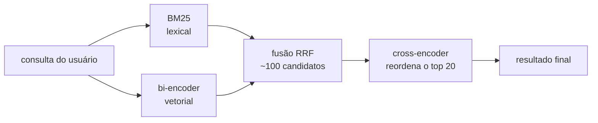
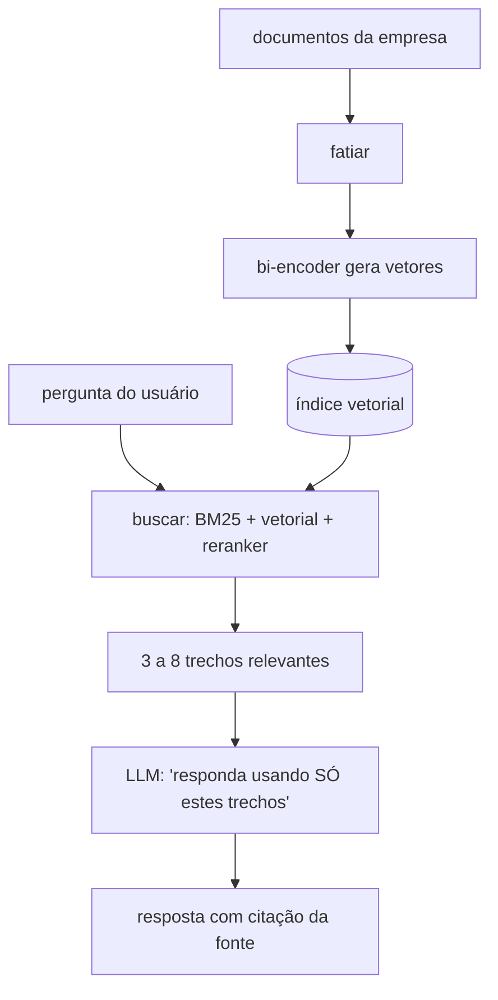

# 16 · Embeddings e busca semântica — como o BERT virou o motor do RAG

`Nível: intermediário → avançado` · `Medições executadas em 12/08/2026`

O uso que mais cresceu desde 2023 e o que mantém encoders relevantes na era dos LLMs.
Se você trabalha com RAG, este é o arquivo mais importante do curso.

---

## 1 · O problema: busca por palavra não é busca por significado

```
Documento na base:  "Cancelamento de assinatura"
Usuário digita:     "quero encerrar meu plano"

Palavras em comum:  ZERO
Busca lexical (BM25) encontra?  NÃO
```

Busca lexical (BM25, Elasticsearch padrão) casa palavras. Funciona bem quando o usuário usa o
vocabulário do documento — e falha exatamente quando ele não usa, que é o caso mais comum em
atendimento, jurídico e suporte.

A solução: representar significado como um ponto no espaço, e buscar por proximidade.

---

## 2 · Do BERT cru ao Sentence-BERT

**O BERT cru não serve para isso**, e vale entender por quê antes de sair usando.

Medição real feita neste curso ([04](04-como-comecar.md) e [06](06-exemplos.md)):

| Método | sim(cancelar, encerrar) | sim(cancelar, horário) | **separação** |
|---|---|---|---|
| BERTimbau, vetor do `[CLS]` cru | 0,789 | 0,641 | 0,148 |
| BERTimbau, mean pooling | 0,672 | 0,504 | 0,168 |
| MiniLM multilíngue (sentence-transformers) | 0,567 | 0,200 | **0,367** |

O modelo treinado para similaridade tem números **menores** em valor absoluto e uma separação
**duas vezes maior**. É a separação que faz a busca funcionar; o valor absoluto não significa
nada.

### Por que o BERT cru falha

Duas razões, ambas estudadas:

1. **Ele nunca foi treinado para isso.** Nada no MLM otimiza "frases parecidas ficam próximas
   no cosseno". A geometria do espaço não foi construída para essa métrica.
2. **Anisotropia.** Os vetores do BERT ocupam um cone estreito do espaço de 768 dimensões, em
   vez de se espalharem. Resultado: **tudo é parecido com tudo** — similaridades altas até
   entre frases sem relação (Ethayarajh, 2019; Li et al., 2020).

### A correção: Sentence-BERT (2019)

Reimers e Gurevych treinaram o BERT numa arquitetura **siamesa**: duas cópias com pesos
compartilhados processam duas frases, e a perda empurra pares similares para perto e pares
dissimilares para longe.

```
        frase A ──► BERT ──► pooling ──► vetor A ─┐
                     ▲                             ├──► cosseno ──► perda
        frase B ──► BERT ──► pooling ──► vetor B ─┘
                (MESMOS pesos)
```

Perdas usadas, em ordem de importância prática:

| Perda | Como funciona | Quando usar |
|---|---|---|
| **MultipleNegativesRanking (MNRL)** | dado um par positivo, todos os outros do lote são negativos | **a mais usada**; só precisa de pares (pergunta, resposta) |
| CosineSimilarity | regressão para uma nota de similaridade | quando você tem notas 0–1 anotadas |
| Triplet | (âncora, positivo, negativo) | quando negativos difíceis importam |

A MNRL merece destaque porque resolve o problema prático: você quase nunca tem exemplos
negativos anotados, mas quase sempre tem pares positivos (pergunta e resposta certa, título e
corpo, chamado e categoria). Ela usa o resto do lote como negativos de graça — e por isso
**lotes grandes melhoram muito** o resultado com essa perda.

---

## 3 · Estratégias de pooling

Como transformar `n × 768` (um vetor por token) em `1 × 768` (um vetor por frase):

| Estratégia | Cálculo | Qualidade |
|---|---|---|
| `[CLS]` | pega o primeiro vetor | ruim sem treino; boa se o modelo foi treinado com ela |
| **Mean pooling** | média dos tokens, ignorando padding | **melhor padrão** sem treino específico |
| Max pooling | máximo por dimensão | raramente melhor |
| Mean dos últimos 4 layers | concatena/soma camadas | ganho marginal, custo maior |

Implementação correta do mean pooling (o detalhe é a máscara — sem ela você inclui `[PAD]` na
média e degrada tudo):

```python
def mean_pooling(saida_modelo, attention_mask):
    tokens = saida_modelo.last_hidden_state           # (B, N, 768)
    m = attention_mask.unsqueeze(-1).float()          # (B, N, 1)
    return (tokens * m).sum(1) / m.sum(1).clamp(min=1e-9)
```

**Regra:** use o pooling com que o modelo foi treinado. Um modelo `sentence-transformers`
declara isso no arquivo `1_Pooling/config.json`; a biblioteca cuida disso para você. Se você
carregar um modelo desses com `AutoModel` e aplicar outro pooling, degrada o resultado sem
receber aviso nenhum.

---

## 4 · A arquitetura de busca que funciona em produção

Ninguém sério usa busca vetorial pura. O padrão de 2026 tem três estágios:



| Estágio | O que faz | Custo | Por que existe |
|---|---|---|---|
| **BM25** | casa palavras exatas | baratíssimo | acerta nomes próprios, códigos, siglas e termos raros — onde o vetorial erra |
| **Bi-encoder** | acha por significado | barato (índice pré-calculado) | acerta paráfrase e sinônimo |
| **Fusão RRF** | combina os dois rankings | grátis | *Reciprocal Rank Fusion*: soma `1/(k + posição)`. Simples e robusto |
| **Cross-encoder** | lê consulta+documento juntos | caro (1 execução por par) | ganha 5 a 15 pontos de precisão no topo |

**Por que a busca híbrida é obrigatória:** demonstrado com a falha real medida em
[06-exemplos.md, exemplo 6](06-exemplos.md#6--busca-semântica-em-uma-base-de-perguntas) — o
modelo vetorial colocou "cancelar assinatura" acima de "redefinir senha" para a consulta
"esqueci minha senha", **que contém a palavra senha**. O BM25 acertaria isso instantaneamente.
Vetores erram justamente onde palavras funcionam, e vice-versa. Usar só um dos dois é jogar
fora metade do sinal.

### O reranker é o melhor custo-benefício do pipeline

Opinião profissional, e forte: se você tem um RAG funcionando mal, **acrescentar um
cross-encoder no topo dos 20 primeiros é a mudança de maior retorno por hora de trabalho** —
maior do que trocar o modelo de embedding, aumentar o índice ou refinar o *prompt* do LLM.
Custa uma execução de modelo pequeno sobre 20 pares, algo como 50 a 200 ms.

---

## 5 · Código completo do pipeline

```python
# pip install sentence-transformers rank-bm25
from sentence_transformers import SentenceTransformer, CrossEncoder, util
from rank_bm25 import BM25Okapi

base = [
    "Como cancelar minha assinatura pelo portal do cliente",
    "Alterar a forma de pagamento para cartão ou boleto",
    "Redefinir a senha de acesso à plataforma",
    "Emitir a segunda via do boleto vencido",
    "Horário de atendimento do suporte técnico",
]

# --- estágio 1a: lexical -------------------------------------------------
bm25 = BM25Okapi([d.lower().split() for d in base])

# --- estágio 1b: vetorial ------------------------------------------------
bi = SentenceTransformer("paraphrase-multilingual-MiniLM-L12-v2")
indice = bi.encode(base, normalize_embeddings=True, convert_to_tensor=True)

# --- estágio 2: reordenação ----------------------------------------------
cross = CrossEncoder("cross-encoder/ms-marco-MiniLM-L-6-v2")

def buscar(consulta: str, k: int = 3):
    # ranking lexical
    r_bm25 = sorted(range(len(base)), key=lambda i: -bm25.get_scores(consulta.lower().split())[i])
    # ranking vetorial
    emb = bi.encode(consulta, normalize_embeddings=True, convert_to_tensor=True)
    r_vet = [h["corpus_id"] for h in util.semantic_search(emb, indice, top_k=len(base))[0]]

    # fusão RRF: soma 1/(60 + posição) de cada ranking
    notas = {}
    for ranking in (r_bm25, r_vet):
        for posicao, doc in enumerate(ranking):
            notas[doc] = notas.get(doc, 0) + 1 / (60 + posicao)
    candidatos = sorted(notas, key=notas.get, reverse=True)[:5]

    # reordenação final com cross-encoder
    pares = [(consulta, base[i]) for i in candidatos]
    finais = sorted(zip(candidatos, cross.predict(pares)), key=lambda x: -x[1])
    return [(base[i], float(n)) for i, n in finais[:k]]

for c in ["quero encerrar meu plano", "esqueci minha senha"]:
    print(c, "→", buscar(c)[0][0])
```

> O `cross-encoder/ms-marco-MiniLM-L-6-v2` é treinado em **inglês**. Para produção em
> português, procure um reranker multilíngue (family `mmarco`, `bge-reranker-v2-m3`) e
> **meça com as suas consultas** — não confie na tabela de nenhum model card.

---

## 6 · Onde guardar os vetores

| Opção | Escala | Quando usar |
|---|---|---|
| NumPy em memória + produto escalar | até ~100 mil | protótipo, base pequena. Simples e rápido |
| **FAISS** (Meta) | milhões | padrão de fato para índice local |
| SQLite + `sqlite-vec` | centenas de milhares | quando você já usa SQLite e quer zero infraestrutura |
| pgvector (PostgreSQL) | milhões | **melhor escolha se você já tem Postgres** — evita mais um banco na operação |
| Qdrant, Weaviate, Milvus | dezenas de milhões+ | quando filtro por metadado e escala justificam um serviço dedicado |
| Pinecone, serviços gerenciados | qualquer | quando você prefere pagar a operar |

**Opinião profissional:** a maioria dos projetos que instala um banco vetorial dedicado tem
menos de 50 mil documentos e caberia num `pgvector` ou até num array NumPy. Complexidade
operacional é um custo real; adote banco vetorial quando a escala exigir, não porque está na
moda.

### Detalhes que quebram na prática

- **Normalize os vetores** (`normalize_embeddings=True`) e use produto interno. Assim o
  produto escalar **é** o cosseno, e todo índice fica mais simples e rápido.
- **Índice aproximado (HNSW, IVF) troca recall por velocidade.** Meça o quanto você perdeu —
  a maioria das pessoas nem sabe que perdeu algo.
- **Reindexe tudo ao trocar de modelo.** Vetores de modelos diferentes não são comparáveis, em
  nenhuma circunstância. Guarde o nome e a revisão do modelo junto com o índice.
- **Fatie documentos longos.** BERT lê 512 tokens; um contrato tem 8.000. Fatias de 200 a 500
  tokens com 10 a 20% de sobreposição é o ponto de partida usual.

---

## 7 · Onde isso entra no RAG



**O papel do encoder é decidir o que o LLM vai ler.** Se a recuperação trouxer o trecho
errado, nenhum modelo de linguagem, por maior que seja, conserta — ele vai responder com
confiança sobre o documento errado.

Consequência que quase todo time de RAG demora a aceitar: **quando o RAG responde mal, o
problema quase nunca está no LLM.** Está na fatiação, na recuperação ou na ausência de
reranker. Antes de trocar de LLM ou reescrever o prompt, meça a recuperação isoladamente:
"em que fração das perguntas o trecho certo está entre os 5 primeiros?". Esse número é o teto
do seu sistema.

---

## 8 · Como avaliar recuperação

Métricas, do mais simples ao mais informativo:

| Métrica | O que mede | Quando usar |
|---|---|---|
| **Recall@k** | o documento certo está entre os k primeiros? | a métrica mais importante para RAG |
| MRR | 1/posição do primeiro acerto | quando só o primeiro resultado importa |
| **nDCG@k** | qualidade da ordem, com relevância graduada | avaliação séria, com julgamentos por nível |
| Precision@k | fração de relevantes entre os k | quando o usuário lê todos os k |

Como montar um conjunto de avaliação sem orçamento: pegue 50 perguntas reais dos seus
usuários, marque à mão qual documento responde cada uma, e meça Recall@5. **50 pares levam
uma tarde e valem mais que qualquer benchmark público**, porque medem o seu domínio, com o
seu vocabulário.

O benchmark público de referência é o **MTEB** (*Massive Text Embedding Benchmark*), com
placar no Hugging Face. Use-o para escolher **candidatos**, nunca como decisão final: modelos
são otimizados para subir no MTEB, e a correlação com o seu caso é imperfeita. Ver
[18-avaliacao-e-benchmarks.md](18-avaliacao-e-benchmarks.md).

---

## Autoteste

1. Por que o BERT cru é ruim para similaridade por cosseno? Dê as duas razões.
2. O que é anisotropia e que efeito ela tem nas similaridades?
3. Como funciona o treino siamês do Sentence-BERT?
4. Por que a perda MultipleNegativesRanking é a mais usada na prática?
5. Escreva o mean pooling correto. Qual é o detalhe que quase todo mundo erra?
6. Por que busca híbrida (lexical + vetorial) bate qualquer uma das duas sozinha? Dê um exemplo concreto.
7. O que é RRF e por que ele é usado em vez de somar as notas?
8. Qual é a mudança de maior retorno num RAG que responde mal?
9. Por que é preciso reindexar tudo ao trocar de modelo de embedding?
10. Como montar uma avaliação de recuperação para o seu caso em uma tarde?

---

## Fontes

- Reimers & Gurevych (2019). *Sentence-BERT*. [arXiv:1908.10084](https://arxiv.org/abs/1908.10084)
- Ethayarajh (2019). *How Contextual are Contextualized Word Representations?* [arXiv:1909.00512](https://arxiv.org/abs/1909.00512)
- Li et al. (2020). *On the Sentence Embeddings from Pre-trained Language Models* (BERT-flow). [arXiv:2011.05864](https://arxiv.org/abs/2011.05864)
- Cormack et al. (2009). *Reciprocal Rank Fusion*.
- Muennighoff et al. (2022). *MTEB: Massive Text Embedding Benchmark*. [arXiv:2210.07316](https://arxiv.org/abs/2210.07316)
- [sbert.net](https://sbert.net/) — documentação do `sentence-transformers`

---

*Anterior: [15-fine-tuning.md](15-fine-tuning.md) · Próximo: [17-familia-bert.md](17-familia-bert.md)*
