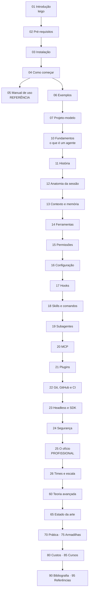

# Claude Code — do leigo ao profissional

> **Nível:** todos · **Atualizado em:** 13/08/2026
> **Base verificada:** Claude Code **2.1.231**, Node v24.18.0, Ubuntu 22.04.5 LTS.
> Documentação oficial consultada em 13/08/2026 em `code.claude.com/docs`.

---

## O que é este material

Um curso completo sobre **Claude Code**: o agente de programação de linha de comando da
Anthropic. Do "o que raios é um agente" até engenharia de contexto, orquestração de
subagentes, hooks, MCP, automação em CI e os limites teóricos do que um agente pode
garantir sobre o seu código.

Três perguntas conduzem o material, que são exatamente as três que originaram este curso:

1. **O que é um agente Claude Code?** → [`01`](01-introducao-leigo.md), [`10`](10-fundamentos.md), [`12`](12-anatomia-de-uma-sessao.md)
2. **Quais são os comandos?** → [`05`](05-manual-de-uso.md) (referência completa), [`04`](04-como-comecar.md)
3. **O que se precisa saber para ser profissional e tirar o melhor proveito?** →
   [`25`](25-o-oficio-do-profissional.md) é a resposta direta; os arquivos `13`–`24` são o
   que a sustenta; [`75`](75-armadilhas.md) é o que fazer ao contrário.

**Se você tem 20 minutos:** leia [`01`](01-introducao-leigo.md), depois
[`04`](04-como-comecar.md), depois a seção "As sete decisões" do
[projeto-modelo](07-projeto-modelo/README.md).

**Se você já usa e quer parar de perder tempo:** vá direto para
[`25-o-oficio-do-profissional.md`](25-o-oficio-do-profissional.md) e
[`75-armadilhas.md`](75-armadilhas.md).

---

## O que você saberá ao final

- Explicar o que é um agente, o laço agêntico e por que isso é diferente de autocompletar.
- Instalar Claude Code em Linux, macOS e Windows, com e sem privilégio de administrador.
- Usar a superfície inteira de comandos: CLI, comandos de barra, atalhos, modos de permissão.
- Escrever `CLAUDE.md` que o agente **de fato** segue, e saber quando ele não basta.
- Escrever hooks que **obrigam** — validação, formatação, testes, bloqueio de segredos.
- Empacotar procedimentos como skills e delegar trabalho a subagentes sem estourar contexto.
- Conectar ferramentas externas por MCP sem afundar o orçamento de contexto.
- Rodar Claude Code sem terminal: `-p`, JSON estruturado, CI, GitHub Actions.
- Estimar e controlar custo real por pessoa e por time.
- Discutir, com fundamento, o que um agente **não pode** garantir — e por quê.

---

## Roteiro de leitura

---

## Índice completo

### Bloco A · Porta de entrada (01–09)

| Arquivo | O que traz |
|---|---|
| [`01-introducao-leigo.md`](01-introducao-leigo.md) | O que é, sem jargão. Analogia do funcionário novo. Por que existe. |
| [`02-pre-requisitos.md`](02-pre-requisitos.md) | O que saber e ter antes. Tempo realista por nível. Rota de resgate. |
| [`03-instalacao.md`](03-instalacao.md) | Manual de campo: Linux, macOS, Windows nativo e WSL2, Docker, sem instalar nada. PATH, permissões, proxy, desinstalação, tabela de erros literais. |
| [`04-como-comecar.md`](04-como-comecar.md) | Do terminal vazio ao primeiro código escrito pelo agente. Ciclo de trabalho. Cinco erros de estreante. |
| [`05-manual-de-uso.md`](05-manual-de-uso.md) | **Referência.** Todos os comandos de barra, flags de CLI, atalhos, ferramentas, variáveis de ambiente. |
| [`06-exemplos.md`](06-exemplos.md) | 14 receitas completas, do trivial a dois casos de produção. |
| [`07-projeto-modelo/`](07-projeto-modelo/README.md) | API de tarefas + `.claude/` completo (3 hooks, subagente, 2 skills, permissões) + script que valida a configuração. **Executado.** |

### Bloco B · Núcleo (10–69)

| Arquivo | O que traz |
|---|---|
| [`10-fundamentos.md`](10-fundamentos.md) | LLM, laço agêntico, contexto, ferramentas, tokens. O modelo mental inteiro. |
| [`11-historia.md`](11-historia.md) | De 1970 ao agente: autocompletar → Copilot → chat → agente. Por que 2025 e não antes. |
| [`12-anatomia-de-uma-sessao.md`](12-anatomia-de-uma-sessao.md) | O que existe dentro de uma sessão: prompt de sistema, turno, laço, compactação, checkpoint. |
| [`13-contexto-e-memoria.md`](13-contexto-e-memoria.md) | `CLAUDE.md`, `rules/`, memória automática, `/compact`, `/context`. Engenharia de contexto. |
| [`14-ferramentas.md`](14-ferramentas.md) | Todas as ferramentas embutidas, o que cada uma custa e quando o agente escolhe cada uma. |
| [`15-permissoes-e-modos.md`](15-permissoes-e-modos.md) | Os seis modos, sintaxe de regras, o que `acceptEdits` realmente libera, sandbox. |
| [`16-configuracao.md`](16-configuracao.md) | Hierarquia de `settings.json`, as chaves que importam, depuração de configuração. |
| [`17-hooks.md`](17-hooks.md) | 30 eventos, 5 tipos de handler, códigos de saída, JSON de decisão. Os quatro hooks que valem a pena. |
| [`18-skills-e-comandos.md`](18-skills-e-comandos.md) | `SKILL.md`, frontmatter completo, `context: fork`, argumentos, quando skill vence CLAUDE.md. |
| [`19-subagentes.md`](19-subagentes.md) | Isolamento de contexto, frontmatter, paralelismo, times de agentes, worktrees. |
| [`20-mcp.md`](20-mcp.md) | O protocolo, transportes, escopos, custo de contexto, e por que quase sempre a CLI vence. |
| [`21-plugins-e-marketplaces.md`](21-plugins-e-marketplaces.md) | Empacotar e distribuir configuração para um time inteiro. |
| [`22-git-github-e-ci.md`](22-git-github-e-ci.md) | Commits, PRs, revisão automática, GitHub Actions, worktrees, sessões em background. |
| [`23-headless-e-sdk.md`](23-headless-e-sdk.md) | `-p`, `--output-format json`, `--json-schema`, `--bare`, Agent SDK, Claude Code como peça de pipeline. |
| [`24-seguranca.md`](24-seguranca.md) | Injeção de prompt, fronteira de diretório, credenciais, contêineres, modelo de ameaça honesto. |
| [`25-o-oficio-do-profissional.md`](25-o-oficio-do-profissional.md) | **O arquivo central.** O que separa quem tira 10× de quem tira 1,2×. |
| [`26-times-e-escala.md`](26-times-e-escala.md) | Configuração gerenciada, política de organização, métricas, adoção, o que dá errado em escala. |
| [`60-teoria-avancada.md`](60-teoria-avancada.md) | Atenção e custo quadrático, degradação de contexto longo, indecidibilidade, o que é impossível garantir. |
| [`65-estado-da-arte.md`](65-estado-da-arte.md) | Fronteira em agosto de 2026: o que mudou, o que está em disputa, o que ainda não funciona. |

### Bloco C · Prática e erros (70–79)

| Arquivo | O que traz |
|---|---|
| [`70-pratica.md`](70-pratica.md) | 12 laboratórios progressivos, do primeiro hook à orquestração paralela. |
| [`75-armadilhas.md`](75-armadilhas.md) | 28 erros clássicos, mitos e más práticas — com o porquê de cada um persistir. |

### Bloco D · Economia e ecossistema (80–89)

| Arquivo | O que traz |
|---|---|
| [`80-custos-e-licencas.md`](80-custos-e-licencas.md) | Preços com data de consulta, planos × API, custo real por dev, licença, custos ocultos, alternativas. |
| [`85-cursos-e-certificacoes.md`](85-cursos-e-certificacoes.md) | Cursos gratuitos em PT, EN e FR — pesquisados na web. Certificados: quais existem e quais valem. |

### Bloco E · Fontes (90–99)

| Arquivo | O que traz |
|---|---|
| [`90-bibliografia.md`](90-bibliografia.md) | Livros e leituras longas, com nível e o que cada um faz melhor. |
| [`95-referencias.md`](95-referencias.md) | Documentação oficial, specs, papers, repositórios e pessoas a seguir. |
| [`GLOSSARIO.md`](GLOSSARIO.md) | ~150 termos definidos. |

---

## Status por bloco

| A | B | C | D | E | Glossário |
|---|---|---|---|---|---|
| ✅ | ✅ | ✅ | ✅ | ✅ | ✅ |

**O que foi executado de verdade nesta máquina** (Ubuntu 22.04.5, Node v24.18.0,
Claude Code 2.1.231, 13/08/2026):

- A suíte do projeto-modelo: **20 testes, 0 falhas**.
- Os três hooks, com JSON de evento simulado — inclusive o caminho de falha
  (`PostToolUse` saiu com código 2 e devolveu `'baixa' !== 'media'` ao agente).
- O script `verificar-configuracao.mjs`: **17 verificações ok, 0 problemas**.
- A API, com `curl` real: 201 + `Location`, 400 com mensagem de validação, 404, 204.

**O que não foi executado e está declarado:** instalação em macOS e Windows (não há essas
máquinas aqui — os comandos vêm da documentação oficial de 13/08/2026); o roteiro
interativo de 8 passos do projeto-modelo, que exige uma sessão humana; os laboratórios
do [`70-pratica.md`](70-pratica.md).

---

## Manutenção

| Arquivo | Reavaliar |
|---|---|
| [`03-instalacao.md`](03-instalacao.md) | a cada 3 meses — versões e comandos mudam |
| [`05-manual-de-uso.md`](05-manual-de-uso.md) | a cada 3 meses — comandos entram e saem rápido |
| [`65-estado-da-arte.md`](65-estado-da-arte.md) | a cada 4 meses |
| [`80-custos-e-licencas.md`](80-custos-e-licencas.md) | a cada 6 meses |
| [`85-cursos-e-certificacoes.md`](85-cursos-e-certificacoes.md) | a cada 12 meses |

> **Aviso honesto sobre validade.** Claude Code é software em movimento rápido: a versão
> aqui documentada, 2.1.231, é de agosto de 2026, e a numeração avança várias vezes por
> semana. Comandos e chaves de configuração **entram e saem**. Este material foi escrito
> para envelhecer bem no conceitual (blocos B, C) e mal no específico (05, 65, 80).
> A defesa é sempre a mesma: `/help` e `claude --help` são a fonte da verdade da sua versão.
