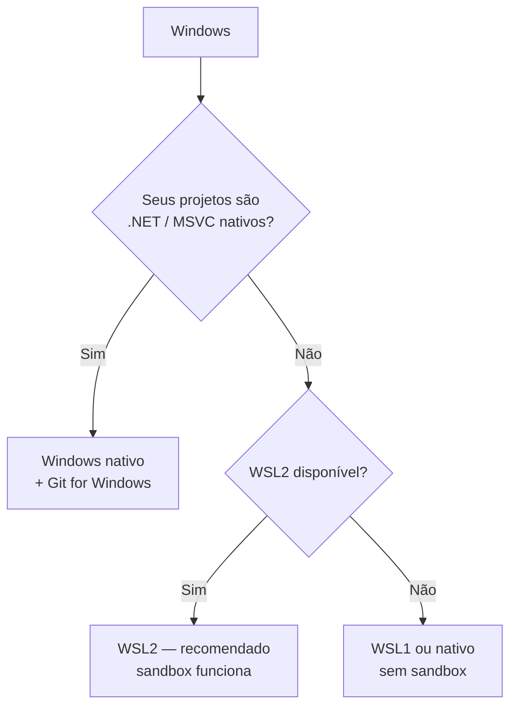

# 03 · Manual de instalação

> **Nível:** iniciante · **Atualizado em:** 13/08/2026
> **Testado em:** Claude Code **2.1.231**, Ubuntu 22.04.5 LTS, Node v24.18.0, npm 12.0.1, git 2.34.1 — em 13/08/2026.
> Comandos de macOS e Windows vêm da documentação oficial consultada em 13/08/2026 e **não** foram
> executados aqui (não há essas máquinas neste ambiente). Isso está declarado por honestidade, não por dúvida.

Manual de campo. Siga na ordem, confira cada passo, não pule verificação.

---

## Atalho: comece hoje, sem instalar nada

Se você quer o primeiro resultado **em cinco minutos**, ou não pode instalar software nesta
máquina, use um destes. Instale depois, quando já souber se vale.

| Opção | Como | O que perde |
|---|---|---|
| **Claude Code na web** | [claude.ai/code](https://claude.ai/code) — abre sessão numa VM gerenciada pela Anthropic, ligada ao seu repositório do GitHub | Não mexe nos arquivos locais; rede restrita por padrão |
| **App Desktop** | Baixe para [macOS](https://claude.ai/api/desktop/darwin/universal/dmg/latest/redirect), [Windows](https://claude.com/download) ou Linux | Nada relevante: usa o mesmo motor, com interface gráfica |
| **GitHub Codespaces** | Abra o repositório em Codespace e rode `curl -fsSL https://claude.ai/install.sh \| bash` lá dentro | Custo de Codespace (há camada gratuita mensal) |
| **Contêiner descartável** | Ver a seção [Docker](#h-docker--isolamento) abaixo | Precisa ter Docker |

Todas exigem conta paga (Pro, Max, Team, Enterprise ou Console/API). Ver [`80`](80-custos-e-licencas.md).

---

## O conjunto de tecnologias envolvido

Um erro comum de manual é instalar só a ferramenta principal. Aqui está **tudo** que
compõe um ambiente de trabalho funcional, e o que é obrigatório de verdade:

| Tecnologia | Obrigatório? | Para quê | Seção |
|---|---|---|---|
| **Claude Code** | Sim | a ferramenta | [A](#a-instalar-o-claude-code) |
| **Conta Anthropic paga** ou chave de API | Sim | autenticação | [B](#b-autenticar) |
| **git** | Não, mas praticamente | ver e desfazer o que o agente fez | [C](#c-git) |
| **ripgrep** | Já vem embutido | busca em arquivos | [C](#c-git) |
| **Node.js** | Só se instalar via npm | não é usado em tempo de execução | [D](#d-nodejs--só-se-for-usar-npm) |
| **jq** | Não | escrever hooks confortavelmente | [E](#e-ferramentas-de-apoio-opcionais) |
| **Git for Windows** | Windows nativo | dá a ferramenta Bash ao agente | [G](#g-windows) |
| **Extensão de IDE** | Não | usar dentro do VS Code/JetBrains | [F](#f-integração-com-editor) |
| **Docker** | Não | isolamento | [H](#h-docker--isolamento) |

---

## A. Instalar o Claude Code

### Escolha do método — recomendação explícita

| Método | Atualiza sozinho? | Precisa de Node? | Use quando |
|---|---|---|---|
| **Instalador nativo** | **Sim** | Não | **É a recomendação padrão.** Serve para 90% dos casos |
| Homebrew (macOS/Linux) | Não (`brew upgrade`) | Não | Você já gerencia tudo com brew |
| WinGet (Windows) | Não (`winget upgrade`) | Não | Windows corporativo com WinGet padronizado |
| apt / dnf / apk | Não (upgrade do sistema) | Não | Servidor, imagem de CI, política de repositório assinado |
| npm global | Sim | Node 22+ para instalar | Você já tem Node e prefere um só gerenciador |
| Contêiner | — | Não | Isolamento, CI, ambiente descartável |

> **Por que o nativo é o recomendado:** ele baixa um binário compilado, não depende do seu
> Node, e se atualiza em segundo plano. A instalação via npm baixa **o mesmo binário** por
> uma dependência opcional de plataforma — o Node só participa da instalação, nunca da execução.

---

### A.1 · Linux — família Debian/Ubuntu

**Caminho recomendado: instalador nativo.**

```bash
curl -fsSL https://claude.ai/install.sh | bash
```
> Baixa o binário para `~/.local/share/claude/versions/` e cria o atalho `~/.local/bin/claude`. **Não use `sudo`.**

Verificação imediata:

```bash
claude --version
# esperado: 2.1.231 (Claude Code)  — ou superior
```

Saída real desta máquina em 13/08/2026:

```
2.1.231 (Claude Code)
```

**Se der `claude: command not found`:** o diretório `~/.local/bin` não está no `PATH`.
Vá para a seção [PATH](#path-e-variáveis-de-ambiente) antes de qualquer outra coisa.

**Alternativa: repositório apt assinado** (para servidor, imagem ou política corporativa).
Exige mais passos, mas é auditável e integra com a atualização do sistema.

```bash
sudo apt install curl gnupg
```
> `curl` e `gnupg` podem faltar numa instalação enxuta; sem eles os próximos passos falham.

```bash
sudo install -d -m 0755 /etc/apt/keyrings
sudo curl -fsSL https://downloads.claude.ai/keys/claude-code.asc -o /etc/apt/keyrings/claude-code.asc
```
> Baixa a chave de assinatura das versões.

```bash
gpg --show-keys /etc/apt/keyrings/claude-code.asc
# esperado: impressão digital 31DDDE24DDFAB679F42D7BD2BAA929FF1A7ECACE
```
> **Confira caractere por caractere.** Se não bater, pare: você não baixou o que pensa que baixou.

```bash
echo "deb [signed-by=/etc/apt/keyrings/claude-code.asc] https://downloads.claude.ai/claude-code/apt/stable stable main" \
  | sudo tee /etc/apt/sources.list.d/claude-code.list
sudo apt update
sudo apt install claude-code
```
> Registra o canal `stable` (~1 semana de atraso, pula releases com regressão grave) e instala.

Para o canal `latest`, troque **as duas** ocorrências de `stable` na linha `deb` por `latest`.
Atualizar depois: `sudo apt update && sudo apt upgrade claude-code`.

---

### A.2 · Linux — família Fedora/RHEL

```bash
sudo tee /etc/yum.repos.d/claude-code.repo <<'EOF'
[claude-code]
name=Claude Code
baseurl=https://downloads.claude.ai/claude-code/rpm/stable
enabled=1
gpgcheck=1
gpgkey=https://downloads.claude.ai/keys/claude-code.asc
EOF
sudo dnf install claude-code
```
> O dnf pede confirmação da impressão digital na primeira instalação. Deve ser
> `31DD DE24 DDFA B679 F42D 7BD2 BAA9 29FF 1A7E CACE`. Recuse se for diferente.

```bash
claude --version
# esperado: 2.1.x (Claude Code)
```

Atualizar: `sudo dnf upgrade claude-code`.
O instalador nativo (`curl … | bash`) também funciona aqui e é mais simples.

---

### A.3 · Linux — Alpine e distribuições com musl

Alpine não traz `bash` nem `curl`, então o comando padrão falha com `not found`.

```bash
apk add bash curl libgcc libstdc++ ripgrep
```
> `libgcc` e `libstdc++` são exigidos em tempo de execução; `ripgrep` porque o embutido não roda em musl.

Se o `apk` disser que `ripgrep` não existe, adicione o repositório *community*:

```bash
echo "https://dl-cdn.alpinelinux.org/alpine/v3.22/community" >> /etc/apk/repositories
apk update
```

Depois, desligue o ripgrep embutido em `~/.claude/settings.json`:

```json
{ "env": { "USE_BUILTIN_RIPGREP": "0" } }
```

Instalação por repositório apk assinado:

```bash
wget -O /etc/apk/keys/claude-code.rsa.pub https://downloads.claude.ai/keys/claude-code.rsa.pub
echo "https://downloads.claude.ai/claude-code/apk/stable" >> /etc/apk/repositories
apk add claude-code
```

```bash
sha256sum /etc/apk/keys/claude-code.rsa.pub
# esperado: 395759c1f7449ef4cdef305a42e820f3c766d6090d142634ebdb049f113168b6
```

---

### A.4 · macOS (Intel e Apple Silicon)

O binário é universal; **não há diferença de comando entre Intel e Apple Silicon**. O
instalador escolhe a arquitetura certa. Requer macOS 13.0 ou superior.

**Recomendado — instalador nativo:**

```bash
curl -fsSL https://claude.ai/install.sh | bash
```

```bash
claude --version
# esperado: 2.1.231 (Claude Code) ou superior
```

**Alternativa — Homebrew:**

```bash
brew install --cask claude-code
```
> Cask `claude-code` = canal estável. Cask `claude-code@latest` = canal latest.

> ⚠️ **Homebrew não se atualiza sozinho.** Rode `brew upgrade claude-code` (ou
> `claude-code@latest`) periodicamente — é isso ou ficar meses para trás. Para o Claude Code
> rodar o upgrade por você, defina `CLAUDE_CODE_PACKAGE_MANAGER_AUTO_UPDATE=1`.
> `brew cleanup` de vez em quando recupera disco: as versões antigas ficam.

Se o `zsh` não achar o comando, veja [PATH](#path-e-variáveis-de-ambiente).
Para as teclas `Option+P`/`Option+T` funcionarem, configure Option como Meta no seu
terminal (iTerm2: *Preferences → Profiles → Keys → Left Option key: Esc+*).

---

### A.5 · Windows nativo

Windows 10 build 1809+ ou Windows Server 2019+. **Não precisa de Administrador.**

Descubra em qual console você está: o prompt mostra `PS C:\...` no PowerShell e
`C:\...` sem o `PS` no CMD. Rodar o comando errado gera exatamente estes erros:

- `The token '&&' is not a valid statement separator` → você está no **PowerShell**, usou comando de CMD.
- `'irm' is not recognized...` → você está no **CMD**, usou comando de PowerShell.

**PowerShell:**

```powershell
irm https://claude.ai/install.ps1 | iex
```

**CMD:**

```batch
curl -fsSL https://claude.ai/install.cmd -o install.cmd && install.cmd && del install.cmd
```

**WinGet** (alternativa corporativa):

```powershell
winget install Anthropic.ClaudeCode
```
> Não se atualiza sozinho: rode `winget upgrade Anthropic.ClaudeCode`. O upgrade pode falhar
> com o Claude Code aberto, porque o Windows tranca o executável.

Verificação:

```powershell
claude --version
# esperado: 2.1.x (Claude Code)
```

**Instale também o [Git for Windows](https://git-scm.com/downloads/win).** Sem ele, o agente
não tem a ferramenta `Bash` e cai para a ferramenta `PowerShell` — o que quebra praticamente
todo exemplo de shell escrito por terceiros, incluindo os deste curso. Se o Claude Code não
encontrar o Git Bash, aponte o caminho:

```json
{ "env": { "CLAUDE_CODE_GIT_BASH_PATH": "C:\\Program Files\\Git\\bin\\bash.exe" } }
```

---

### A.6 · Windows com WSL2 — **o caminho recomendado**

**Por que WSL2 e não Windows nativo**, sendo direto:

| | Windows nativo | WSL2 |
|---|---|---|
| Sandbox de comandos ([`24`](24-seguranca.md)) | **não suportado** | suportado |
| Ferramentas de shell da comunidade | frequentemente quebram | funcionam |
| Caminhos e permissões | duas convenções misturadas | uma só |
| Quando escolher | seus projetos são .NET/MSVC nativos | qualquer outro caso |

```powershell
wsl --install -d Ubuntu
```
> No PowerShell **como Administrador**. Reinicie ao final e crie o usuário Linux.

Depois, **dentro do terminal do Ubuntu** (não no PowerShell):

```bash
curl -fsSL https://claude.ai/install.sh | bash
claude --version
```

> **Erro clássico:** instalar no WSL e tentar rodar `claude` no PowerShell. São dois sistemas
> de arquivos e dois `PATH` diferentes. Instale e rode no mesmo lugar.
>
> **Segundo erro clássico:** trabalhar em `/mnt/c/Users/...`. O acesso a disco através da
> fronteira Windows↔Linux é **muito** lento, e ferramentas de busca sofrem. Mantenha os
> repositórios em `~/` dentro do WSL.

---

### A.7 · npm (qualquer SO)

```bash
npm install -g @anthropic-ai/claude-code
```

Exige Node 22+ **para instalar** (versões antigas só emitem `EBADENGINE` e seguem). O binário
instalado não usa Node em tempo de execução.

> ⚠️ **Nunca `sudo npm install -g`.** Explicando o porquê, que quase nenhum manual faz:
> o `npm` executa scripts `postinstall` dos pacotes. Com `sudo`, esses scripts rodam **como
> root**, ou seja, você entregou root a código de terceiros. Além disso, arquivos criados
> como root no seu diretório de cache passam a exigir `sudo` para sempre, e você entra num
> ciclo de erros de permissão. A saída correta é mudar o prefixo global para dentro do seu
> `$HOME` — ou, melhor, usar o instalador nativo, que não tem esse problema.

Reparar um prefixo global sem `sudo`:

```bash
mkdir -p ~/.npm-global
npm config set prefix ~/.npm-global
echo 'export PATH="$HOME/.npm-global/bin:$PATH"' >> ~/.bashrc   # ou ~/.zshrc
source ~/.bashrc
```

Atualizar: `npm install -g @anthropic-ai/claude-code@latest`
(**não** `npm update -g`, que respeita a faixa semver da instalação original e pode te deixar parado).

---

### A.8 · Verificar a integridade do binário

Faça isto se você trabalha em ambiente regulado ou instalou fora do gerenciador de pacotes.

```bash
curl -fsSL https://downloads.claude.ai/keys/claude-code.asc | gpg --import
gpg --fingerprint security@anthropic.com
# esperado conter: 31DD DE24 DDFA B679 F42D  7BD2 BAA9 29FF 1A7E CACE
```

```bash
REPO=https://downloads.claude.ai/claude-code-releases
VERSION=2.1.231
curl -fsSLO "$REPO/$VERSION/manifest.json"
curl -fsSLO "$REPO/$VERSION/manifest.json.sig"
gpg --verify manifest.json.sig manifest.json
# esperado: Good signature from "Anthropic Claude Code Release Signing <security@anthropic.com>"
```

> O aviso `WARNING: This key is not certified with a trusted signature!` é **esperado** para
> uma chave recém-importada e não indica problema. O que vale é a linha `Good signature` e a
> conferência da impressão digital. Assinaturas destacadas existem a partir da versão 2.1.89.

Depois compare o `sha256sum` do binário com o campo `platforms.<plataforma>.checksum` do manifesto.
No macOS, os binários também são assinados pela "Anthropic PBC" e notarizados
(`codesign --verify --verbose ./claude`); no Windows, `Get-AuthenticodeSignature .\claude.exe`.

---

## B. Autenticar

```bash
claude
```
> Na primeira execução abre o navegador para login. Se `ANTHROPIC_API_KEY` estiver definida
> no ambiente, ele pergunta uma vez se deve usar a chave, em vez de abrir o navegador.

```bash
claude auth status
# esperado: JSON com o método de autenticação e a organização
```

| Situação | Comando |
|---|---|
| Trocar de conta | `claude auth logout` e depois `claude auth login` |
| Login pela Console (API) | `claude auth login --console` |
| Token de longa duração para CI | `claude setup-token` |
| Bedrock / Google Cloud / Foundry | use as credenciais do provedor; ver docs do provedor |

**Onde ficam as credenciais:** no Keychain no macOS; em arquivo protegido por permissões no
Linux e Windows. Nunca em texto plano num arquivo de projeto — e **nunca** coloque
`ANTHROPIC_API_KEY` num `.env` versionado.

---

## C. git

Não é obrigatório, mas usar um agente que edita arquivos sem controle de versão é
imprudência pura: o `/rewind` cobre a sessão, o git cobre tudo.

```bash
# Debian/Ubuntu
sudo apt install git
# Fedora/RHEL
sudo dnf install git
# macOS (já vem, ou)
brew install git
# Windows
winget install Git.Git
```

```bash
git --version
# esperado: git version 2.x
```

Saída real: `git version 2.34.1`.

**ripgrep** já vem embutido no Claude Code — só instale (`sudo apt install ripgrep`) se a
busca falhar, ou em musl (ver [A.3](#a3--linux--alpine-e-distribuições-com-musl)).

---

## D. Node.js — só se for usar npm

Só é necessário para o **método de instalação** por npm, e para rodar o projeto-modelo
deste curso.

```bash
# Debian/Ubuntu (versão do sistema costuma ser velha demais)
sudo apt install nodejs npm
```

**Melhor caminho: um gerenciador de versões.** Evita `sudo`, permite várias versões e
torna o ambiente reprodutível.

```bash
curl -o- https://raw.githubusercontent.com/nvm-sh/nvm/v0.40.3/install.sh | bash
source ~/.bashrc
nvm install 22
nvm use 22
```

```bash
node --version
# esperado: v22.x ou superior
```

Saída real desta máquina: `v24.18.0` (e `npm 12.0.1`).

Alternativas equivalentes: `fnm` (mais rápido), `mise` ou `asdf` (gerenciam várias
linguagens de uma vez). Para reprodutibilidade, fixe a versão num arquivo:

```bash
echo "22" > .nvmrc          # nvm/fnm
echo "nodejs 22.14.0" > .tool-versions   # asdf/mise
```

---

## E. Ferramentas de apoio (opcionais)

| Ferramenta | Para quê | Instalação |
|---|---|---|
| **jq** | ler o JSON dos hooks confortavelmente | `sudo apt install jq` / `brew install jq` / `winget install jqlang.jq` |
| **gh** (GitHub CLI) | o agente cria PR e lê issues sem MCP — **mais barato em contexto que um servidor MCP** ([`20`](20-mcp.md)) | `sudo apt install gh` / `brew install gh` |
| **fd, bat, delta** | conforto seu, não do agente | opcional |

Verificação: `jq --version` (esperado `jq-1.6` ou superior), `gh --version`.

---

## F. Integração com editor

| Editor | Como |
|---|---|
| **VS Code / Cursor / Windsurf** | Instale a extensão "Claude Code" no marketplace, ou rode `claude` no terminal integrado — ele detecta e conecta |
| **JetBrains** (IntelliJ, PyCharm, WebStorm…) | Plugin "Claude Code" no marketplace de plugins |
| **Vim/Neovim, Emacs** | Sem plugin oficial. Use no terminal ao lado; `editorMode: "vim"` em `settings.json` dá as teclas do vim na caixa de entrada |

Dentro de uma sessão, `/ide` mostra e gerencia a conexão. `claude --ide` conecta na abertura.
O ganho real da integração: o agente vê sua seleção e os erros do editor, e os diffs
aparecem na interface do editor em vez de no terminal.

---

## G. Windows

Recapitulando a decisão, porque é a que mais causa arrependimento:



---

## H. Docker — isolamento

Isolar o agente muda a conversa sobre risco: com `--dangerously-skip-permissions` fora de
um contêiner você entrega a máquina; dentro, o estrago fica na caixa. Ver [`24`](24-seguranca.md).

```dockerfile
# Dockerfile — ambiente descartável com Claude Code
FROM node:22-bookworm-slim

RUN apt-get update && apt-get install -y --no-install-recommends \
      curl ca-certificates git ripgrep jq \
    && rm -rf /var/lib/apt/lists/*

# usuário sem privilégio: instalar como root traria os mesmos problemas do sudo npm -g
RUN useradd -ms /bin/bash dev
USER dev
WORKDIR /home/dev

RUN curl -fsSL https://claude.ai/install.sh | bash
ENV PATH="/home/dev/.local/bin:${PATH}"

RUN claude --version
CMD ["bash"]
```

```bash
docker build -t claude-lab .
docker run -it --rm \
  -v "$PWD":/home/dev/projeto \
  -v claude-config:/home/dev/.claude \
  -w /home/dev/projeto \
  claude-lab
```
> O volume nomeado `claude-config` preserva login e configuração entre execuções — sem ele
> você refaz o login toda vez.

> ⚠️ Este `Dockerfile` **não foi construído** neste ambiente (sem Docker disponível na
> máquina de escrita). Ele segue os comandos oficiais de instalação; trate como referência a
> validar. Para um caminho oficialmente mantido, veja o
> [devcontainer de referência](https://code.claude.com/docs/en/devcontainer).

---

## PATH e variáveis de ambiente

**Este é o problema nº 1 de instalação.** Você instalou, mas o shell não acha o programa.

O instalador nativo coloca o executável em:

| SO | Caminho |
|---|---|
| Linux / macOS / WSL | `~/.local/bin/claude` |
| Windows | `%USERPROFILE%\.local\bin\claude.exe` |

Conferir se está no `PATH`:

```bash
echo "$PATH" | tr ':' '\n' | grep -c "$HOME/.local/bin"
# esperado: 1 ou mais. Se der 0, o diretório não está no PATH
```

```bash
which claude
# esperado: /home/SEU_USUARIO/.local/bin/claude
```

Saída real desta máquina: `/home/ronivaldo/.local/bin/claude`.

Corrigir, **no arquivo de perfil do seu shell**:

| Shell | Arquivo | Linha a acrescentar |
|---|---|---|
| bash | `~/.bashrc` | `export PATH="$HOME/.local/bin:$PATH"` |
| zsh (padrão do macOS) | `~/.zshrc` | `export PATH="$HOME/.local/bin:$PATH"` |
| fish | `~/.config/fish/config.fish` | `fish_add_path ~/.local/bin` |
| PowerShell | `$PROFILE` | `$env:Path = "$env:USERPROFILE\.local\bin;$env:Path"` |

Depois:

```bash
source ~/.bashrc   # ou abra um terminal novo
```

### Por que "não pegou" antes de reabrir o terminal

Porque um processo só lê o arquivo de perfil **quando começa**. Editar o `.bashrc` não
altera o `PATH` de um shell já rodando — variáveis de ambiente são copiadas do pai para o
filho na criação do processo, e não há canal de volta. Não é bug: é como processos Unix
funcionam desde os anos 1970. `source` força a releitura no shell atual.

*(Parada legítima: decisão de projeto do modelo de processos Unix, não convenção arbitrária.)*

### Variáveis que importam

| Variável | Para quê |
|---|---|
| `ANTHROPIC_API_KEY` | Autenticar por chave de API em vez de assinatura |
| `DISABLE_AUTOUPDATER=1` | Congelar a versão (ambiente auditado) |
| `CLAUDE_CODE_ENABLE_TELEMETRY=1` | Exportar métricas por OpenTelemetry ([`26`](26-times-e-escala.md)) |
| `MAX_THINKING_TOKENS` | Limitar o raciocínio estendido em modelos de orçamento fixo ([`80`](80-custos-e-licencas.md)) |
| `HTTPS_PROXY` / `NO_PROXY` | Rede corporativa (abaixo) |
| `CLAUDE_CODE_GIT_BASH_PATH` | Windows nativo, quando o Git Bash não é encontrado |
| `USE_BUILTIN_RIPGREP=0` | Alpine/musl |

O lugar certo para fixá-las de forma durável é o bloco `env` do `settings.json`, não o
`.bashrc` — assim vale para todas as sessões, inclusive as iniciadas pelo editor:

```json
{ "env": { "DISABLE_AUTOUPDATER": "1", "CLAUDE_CODE_ENABLE_TELEMETRY": "1" } }
```

---

## Permissões — o caminho certo

| Situação | Errado | Certo | Por quê |
|---|---|---|---|
| Instalar globalmente | `sudo npm install -g …` | instalador nativo, ou `npm config set prefix ~/.npm-global` | `sudo` roda `postinstall` de terceiros como root e envenena o cache |
| Instalador nativo | `sudo curl … \| sudo bash` | `curl … \| bash` sem sudo | ele instala no seu `$HOME`; com root, o arquivo fica de root e o auto-update quebra |
| `~/.claude` de root | — | `sudo chown -R "$USER":"$USER" ~/.claude` | conserta o estrago se já aconteceu |

---

## Rede corporativa

Proxy:

```bash
export HTTPS_PROXY="http://proxy.empresa.com:8080"
export HTTP_PROXY="http://proxy.empresa.com:8080"
export NO_PROXY="localhost,127.0.0.1,.empresa.interna"
```
> Coloque no perfil do shell **ou** no `env` do `settings.json`. Sem `NO_PROXY`, chamadas a
> serviços internos saem pelo proxy e falham.

Certificado interno (TLS inspecionado):

```bash
export NODE_EXTRA_CA_CERTS=/caminho/para/ca-da-empresa.pem
```
> Sintoma sem isso: `unable to get local issuer certificate` ou `self-signed certificate in
> certificate chain`.

Firewall: o Claude Code precisa alcançar `api.anthropic.com`, `claude.ai` e
`downloads.claude.ai` (esta última para atualizar). Peça a liberação **antes** de abrir
chamado dizendo "não funciona".

---

## Convivência de versões

```bash
claude install 2.1.89     # instala uma versão específica
claude install stable     # troca para o canal estável
claude --version
```

As versões nativas convivem em `~/.local/share/claude/versions/`; o atalho
`~/.local/bin/claude` decide qual roda. Para congelar em ambiente auditado:

```json
{
  "autoUpdatesChannel": "stable",
  "minimumVersion": "2.1.200",
  "env": { "DISABLE_AUTOUPDATER": "1" }
}
```
> `minimumVersion` é piso para atualizações. Para o Claude Code **recusar iniciar** fora de
> uma faixa, use `requiredMinimumVersion` / `requiredMaximumVersion` em configuração gerenciada.

---

## Reprodutibilidade

Um ambiente de agente reprodutível tem quatro peças, e é isso que separa "funciona na
minha máquina" de "funciona no time":

| Peça | Arquivo | Versionar? |
|---|---|---|
| Configuração do projeto | `.claude/settings.json` | **Sim** |
| Suas preferências | `.claude/settings.local.json` | Não (`.gitignore`) |
| Servidores MCP do projeto | `.mcp.json` | Sim |
| Versão das linguagens | `.nvmrc`, `.tool-versions` | Sim |
| Canal e versão mínima | `autoUpdatesChannel`, `minimumVersion` | Sim |

Em CI, use `claude --bare` para ignorar hooks, skills e MCP da máquina hospedeira e obter o
mesmo resultado em qualquer runner ([`23`](23-headless-e-sdk.md)).

---

## Atualizar e voltar atrás

```bash
claude update
# esperado: Successfully updated from 2.1.220 to version 2.1.231
#        ou: Claude Code is up to date (2.1.231)
```

```bash
claude install 2.1.220     # voltar para uma versão anterior
claude --version           # confirmar
```

```bash
claude doctor              # diagnóstico: instalação, configuração, resultado do último update
```

`claude doctor` é a primeira coisa a rodar quando algo estranho acontece. Ele lista erros de
validação dos arquivos de configuração — inclusive os que falham em silêncio numa sessão.

---

## Desinstalar por completo

```bash
# 1. binário (instalação nativa)
rm -f ~/.local/bin/claude
rm -rf ~/.local/share/claude

# 2. ou, conforme o método usado
brew uninstall --cask claude-code
winget uninstall Anthropic.ClaudeCode
sudo apt remove claude-code && sudo rm /etc/apt/sources.list.d/claude-code.list /etc/apt/keyrings/claude-code.asc
sudo dnf remove claude-code && sudo rm /etc/yum.repos.d/claude-code.repo
npm uninstall -g @anthropic-ai/claude-code

# 3. configuração, sessões e caches do usuário  ⚠️ apaga histórico e memória
rm -rf ~/.claude
rm -f ~/.claude.json

# 4. configuração de um projeto (rode dentro dele)
rm -rf .claude
rm -f .mcp.json
```

> **Pegadinha:** a extensão do VS Code, o plugin JetBrains e o app Desktop também escrevem em
> `~/.claude/`. Se algum continuar instalado, a pasta reaparece. Desinstale-os antes.
>
> **Segunda pegadinha:** se `claude` ainda responder depois de tudo, você tem uma segunda
> instalação ou um alias antigo no shell. `type -a claude` mostra todas as ocorrências.

---

## Solução de problemas — mensagens literais

| Mensagem | Causa provável | Correção |
|---|---|---|
| `claude: command not found` | `~/.local/bin` fora do `PATH`, ou terminal não reaberto | Ver [PATH](#path-e-variáveis-de-ambiente); depois `source ~/.bashrc` |
| `'irm' is not recognized as an internal or external command` | Você está no CMD e usou comando de PowerShell | Use a versão CMD, ou abra o PowerShell |
| `The token '&&' is not a valid statement separator` | Você está no PowerShell e usou comando de CMD | Use `irm https://claude.ai/install.ps1 \| iex` |
| `EACCES: permission denied, mkdir '/usr/lib/node_modules/...'` | `npm install -g` sem permissão no prefixo global | **Não use sudo.** `npm config set prefix ~/.npm-global` e ajuste o `PATH` |
| `syntax error near unexpected token '<'` (no `curl \| bash`) | O servidor devolveu HTML (proxy, portal cativo, 403) em vez do script | Baixe primeiro (`curl -fsSL … -o i.sh`), inspecione o arquivo, depois rode |
| `unable to get local issuer certificate` | TLS inspecionado por proxy corporativo | `export NODE_EXTRA_CA_CERTS=/caminho/ca.pem` |
| `NO_PUBKEY BAA929FF1A7ECACE` no `apt update` | A chave de assinatura não foi baixada | Refaça o passo do `curl` da chave e confira a impressão digital |
| `EBADENGINE` ao instalar por npm | Node abaixo de 22 | Aviso, não erro: a instalação completa. Ainda assim, atualize o Node |
| `Invalid API key · Please run /login` | Chave inválida, expirada, ou `ANTHROPIC_API_KEY` sobrescrevendo a assinatura | `claude auth status`; limpe a variável se quiser usar a assinatura |
| `claude` roda mas some depois do update | Instalação npm num prefixo sem permissão de escrita | `claude doctor` lista as correções |
| Busca não encontra arquivos que existem | ripgrep embutido incompatível (musl) | `apk add ripgrep` + `USE_BUILTIN_RIPGREP=0` |
| No WSL: `claude` não existe no PowerShell | Instalado dentro do WSL | Rode dentro do WSL. São dois sistemas |

Quando nenhuma linha acima serve: `claude doctor` primeiro, `claude --debug` depois.

---

## Checklist de ambiente pronto

Um comando por linha. Todas devem responder antes de você ir para o [`04`](04-como-comecar.md).

```bash
claude --version                # 2.1.231 (Claude Code) ou superior
claude doctor                   # sem erros em vermelho
claude auth status              # JSON com sua conta
git --version                   # git version 2.x
which claude                    # caminho, não vazio
echo "$PATH" | grep -q "$HOME/.local/bin" && echo "PATH ok"
cd /caminho/do/seu/projeto && claude -p "responda apenas: pronto"
```

A última linha é a verificação de ponta a ponta: instalação + autenticação + rede + modelo.
Se ela imprimir `pronto`, está tudo funcionando.

---

## Fontes consultadas

- Claude Code Docs — *Advanced setup*: https://code.claude.com/docs/en/setup (consultado em 13/08/2026)
- Claude Code Docs — *CLI reference*: https://code.claude.com/docs/en/cli-reference (13/08/2026)
- Claude Code Docs — *Settings*: https://code.claude.com/docs/en/settings (13/08/2026)
- Claude Code Docs — *Security*: https://code.claude.com/docs/en/security (13/08/2026)
- Execução local: `claude --version` → `2.1.231 (Claude Code)`; `node --version` → `v24.18.0`;
  `npm --version` → `12.0.1`; `git --version` → `git version 2.34.1`; `which claude` →
  `/home/ronivaldo/.local/bin/claude` — Ubuntu 22.04.5 LTS, 13/08/2026.

---

## Autoteste

1. Qual método de instalação é o recomendado, e qual a principal vantagem prática dele?
2. Por que **nunca** usar `sudo npm install -g`? Dê as duas razões, não uma.
3. Você editou o `.bashrc` e o `claude` continua não sendo encontrado. Por quê, e o que fazer?
4. No Windows, quando escolher nativo e quando escolher WSL2? Qual recurso você perde no nativo?
5. Qual é a impressão digital da chave de assinatura, e o que fazer se não bater?
6. O que `claude doctor` faz e em que momento você deve rodá-lo?
7. Liste os quatro artefatos que tornam um ambiente de agente reprodutível.
8. Você desinstalou tudo e `claude` ainda responde. Quais são as duas causas prováveis?
9. Por que `curl | bash` pode falhar com `syntax error near unexpected token '<'` numa rede corporativa?
