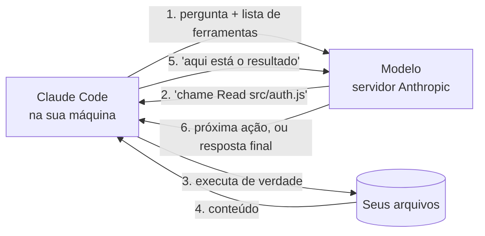

# 10 · Fundamentos — o que é, de verdade, um agente

> **Nível:** iniciante → intermediário · **Atualizado em:** 13/08/2026

Este arquivo constrói o modelo mental completo, do zero. Se você entender só este arquivo
e o [`12`](12-anatomia-de-uma-sessao.md), já saberá diagnosticar 80% dos problemas que
aparecem no uso diário — inclusive os que parecem mágicos.

---

## 1. A peça de baixo: um modelo de linguagem

Um **LLM** (*large language model*, modelo de linguagem grande) faz **uma coisa só**:
recebe uma sequência de texto e prevê qual pedaço de texto vem em seguida. Repete isso até
decidir parar.

Não há banco de dados dentro dele, não há execução de código, não há memória entre chamadas.
É uma função:

```
f(texto de entrada) → próximo pedaço de texto
```

Três consequências que explicam quase todo comportamento estranho que você vai encontrar:

| Propriedade | Consequência prática |
|---|---|
| **Sem estado** | Cada chamada recomeça do zero. Toda a "memória" é o texto reenviado a cada vez. |
| **Prevê o provável** | Ele produz o que *parece* certo dado o treino. Parecer certo e estar certo coincidem com frequência — mas não sempre, e ele não distingue os dois casos. |
| **Não sabe o que não sabe** | Não existe sinal interno de "não tenho essa informação". Por isso ele inventa com a mesma fluência com que acerta. |

A terceira é a mais importante para quem programa: **a confiança da resposta não carrega
informação sobre a correção dela.** É por isso que todo o material insiste em verificação
externa e automática.

### Token: a unidade de tudo

O modelo não vê letras nem palavras: vê **tokens**, pedaços de palavra. "programação" vira
algo como `progr` + `am` + `ação` — cerca de 3 tokens. Em português, a regra de bolso é
**~1 token para cada 3 a 4 caracteres**.

Token é simultaneamente:

- a **unidade de cobrança** (você paga por token de entrada e de saída);
- a **unidade de memória** (a janela de contexto é medida em tokens);
- a **unidade de tempo** (a saída é gerada token a token).

Quando este curso disser "isso custa contexto", leia "isso custa dinheiro e atenção do modelo".

---

## 2. A peça do meio: ferramentas

Sozinho, o modelo só fala. A virada foi ensiná-lo a **pedir ações**.

Funciona assim, e o detalhe é simples de mais para o efeito que produz: junto com a sua
pergunta, manda-se uma lista de ferramentas disponíveis, cada uma com nome, descrição e
formato de argumentos. O modelo pode então, em vez de responder texto, emitir uma
**chamada de ferramenta** — uma estrutura de dados dizendo "execute `Read` com
`file_path: src/auth.js`".

Quem executa é o **programa na sua máquina**, nunca o modelo. O resultado volta como texto
na conversa, e o modelo continua a partir dali.



**Esse desenho é o segredo inteiro do sistema de permissões.** Como o passo 3 acontece na
sua máquina, o Claude Code pode parar ali e perguntar. O modelo pede; ele não faz.

---

## 3. A peça de cima: o laço agêntico

Junte modelo + ferramentas + repetição e você tem um **agente**:

```
enquanto (o modelo pedir uma ferramenta e não tiver terminado):
    executar a ferramenta pedida
    acrescentar o resultado ao contexto
    perguntar ao modelo de novo
devolver a resposta final
```

É isso. Não há mais nada. Um agente é um LLM dentro de um `while`.

O que torna o laço poderoso é a **realimentação**: o resultado da ação anterior entra no
contexto da decisão seguinte. Rodar o teste e ver `AssertionError: 'baixa' !== 'media'` é
informação que o modelo não tinha e agora tem — e ela vem do mundo, não do treino.

### Por que isso muda tudo

| Sem laço (chat) | Com laço (agente) |
|---|---|
| Você é o intermediário de cada passo | O agente encadeia passos sozinho |
| Ele **supõe** o conteúdo dos seus arquivos | Ele **lê** os arquivos |
| Ele **acha** que o código funciona | Ele **roda** e vê |
| Erro só aparece quando você testa | Erro aparece no mesmo turno |
| Você copia e cola | Ele edita |

E o custo desse poder: **um agente errado erra rápido, em vários arquivos**. É o motivo de
permissões, checkpoints e git existirem em volta dele.

---

## 4. Contexto: a única memória que existe

O modelo não guarda nada. Toda "memória" é o texto reenviado a cada chamada. Esse texto é
a **janela de contexto**, e ela tem tamanho máximo.

O que ocupa contexto numa sessão típica:

```
┌──────────────────────────────────────────────────────────┐
│ prompt de sistema (do Claude Code, fixo)                 │  ~5–15 mil tokens
├──────────────────────────────────────────────────────────┤
│ definições das ferramentas disponíveis                   │  ~5–10 mil
│   + ferramentas de servidores MCP conectados             │  0–50 mil (!)
├──────────────────────────────────────────────────────────┤
│ CLAUDE.md + regras + memória automática                  │  1–10 mil
├──────────────────────────────────────────────────────────┤
│ sua conversa: perguntas, respostas                       │  cresce
│ conteúdo dos arquivos lidos                              │  cresce muito
│ saída dos comandos executados                            │  cresce MUITO
└──────────────────────────────────────────────────────────┘
```

Modelos atuais chegam a **1 milhão de tokens** de janela (o `contextWindow: 1000000`
aparece no JSON real do exemplo do [`04`](04-como-comecar.md)). Parece infinito. Não é,
por três razões independentes:

1. **Custo.** Cada token do contexto é reenviado e cobrado a **cada** turno. Contexto grande
   multiplica o custo de cada pergunta, mesmo as triviais.
2. **Latência.** Mais tokens, mais tempo por resposta.
3. **Degradação.** Modelos ficam mensuravelmente piores em contexto muito longo — sobretudo
   para informação no meio da janela. Fenômeno conhecido como *context rot*; ver
   [`60-teoria-avancada.md`](60-teoria-avancada.md).

Daí a disciplina central do ofício, que o [`13`](13-contexto-e-memoria.md) desenvolve:
**contexto é um orçamento, não um depósito.**

### Cache: por que sessão longa pode ser barata

O provedor guarda o prefixo já processado do contexto. Se a próxima chamada começa com o
mesmo prefixo, ele não é reprocessado do zero — é lido do cache, a um preço bem menor.

Isso inverte uma intuição comum. No JSON real do [`04`](04-como-comecar.md):

```
"input_tokens": 4,  "cache_read_input_tokens": 47811
```

Quase todo o contexto veio do cache. Por isso **continuar** uma sessão costuma sair mais
barato que recomeçar — o oposto do que a intuição de "limpar sempre" sugere. A regra
prática que concilia as duas coisas: `/clear` ao **trocar de assunto** (contexto velho
atrapalha), mas não a cada pergunta da mesma tarefa (você joga fora o cache).

O cache expira: uma hora em assinatura, cinco minutos com créditos de uso ou chave de API.
A primeira mensagem depois de um intervalo longo reprocessa tudo e custa caro.

---

## 5. Turno, sessão, subagente

Três palavras que este curso usa com precisão:

| Termo | O que é |
|---|---|
| **Turno** | Uma ida ao modelo. Uma tarefa que usa 5 ferramentas consome ~6 turnos. `num_turns` no JSON conta isso. |
| **Sessão** | Uma conversa inteira, do `claude` até o `/clear` ou a saída. Tem um contexto próprio. |
| **Subagente** | Uma sessão-filha, com **contexto próprio e separado**, que faz um trabalho e devolve só o resumo. |

O subagente é a ferramenta de gestão de contexto mais poderosa que existe: trabalho ruidoso
(vasculhar 40 arquivos, ler um log de 5 mil linhas) acontece no contexto dele, e a sua
conversa recebe três linhas de conclusão. Ver [`19`](19-subagentes.md).

---

## 6. Onde o Claude Code entra

O Claude Code é o programa que implementa o laço, e mais uma dúzia de coisas que ninguém
lembra até faltarem:

| Camada | O que faz |
|---|---|
| **Laço agêntico** | O `while` da seção 3 |
| **Ferramentas** | `Read`, `Edit`, `Bash`, `Grep`… ([`14`](14-ferramentas.md)) |
| **Permissões** | Decide o que roda direto, o que pergunta, o que nega ([`15`](15-permissoes-e-modos.md)) |
| **Contexto** | Monta o prompt, carrega `CLAUDE.md`, compacta quando enche ([`13`](13-contexto-e-memoria.md)) |
| **Hooks** | Executa código seu em pontos do ciclo de vida ([`17`](17-hooks.md)) |
| **Checkpoints** | Permite `/rewind` de código e conversa |
| **Extensões** | Skills, subagentes, MCP, plugins ([`18`](18-skills-e-comandos.md)–[`21`](21-plugins-e-marketplaces.md)) |
| **Sessões** | Persistência, retomada, ramificação, execução em background |

O modelo é o motor; o Claude Code é o carro. E, como em carros, quase todo acidente é de
condução, não de motor.

---

## 7. Os cinco porquês: por que o agente "esquece" o que eu disse?

1. **Por que ele esqueceu a instrução que dei há 20 minutos?**
   Porque o contexto foi **compactado**: ao encher, o histórico antigo é resumido, e
   detalhes se perdem no resumo.
2. **Por que compactar em vez de guardar tudo?**
   Porque a janela tem limite físico. Ultrapassá-lo é erro de API, não degradação suave.
3. **Por que a janela tem limite?**
   Porque o mecanismo de atenção do transformador compara cada token com todos os outros:
   o custo cresce com o **quadrado** do comprimento. Dobrar o contexto quadruplica o
   trabalho. Existem variantes mais baratas, mas nenhuma sem perda relevante em produção.
4. **Por que não resolveram isso ainda?**
   Porque é um problema de complexidade computacional, não de engenharia. Há dez anos de
   pesquisa em atenção esparsa, linear e recorrente; nada substituiu a atenção completa nos
   modelos de fronteira sem custo de qualidade. Ver [`60`](60-teoria-avancada.md).
5. **Então o que eu faço?**
   Escreve. O que precisa sobreviver ao esquecimento vai para **arquivo**: `CLAUDE.md`,
   `.claude/rules/`, skill, ou hook. Conversa é volátil por construção; arquivo é lido a
   cada sessão. *(Parada legítima: limite de complexidade computacional.)*

---

## 8. Modelo mental em uma frase

> **Um agente é um preditor de texto sem memória, dentro de um laço, com permissão de mexer
> na sua máquina — e a qualidade do resultado depende quase inteiramente do que você
> colocou no contexto e de que verificação automática você deixou pronta.**

Guarde esta frase. Cada pedaço dela vira um arquivo do curso:

- *"sem memória"* → [`13-contexto-e-memoria.md`](13-contexto-e-memoria.md)
- *"dentro de um laço"* → [`12-anatomia-de-uma-sessao.md`](12-anatomia-de-uma-sessao.md)
- *"permissão de mexer"* → [`15`](15-permissoes-e-modos.md), [`24`](24-seguranca.md)
- *"o que você colocou no contexto"* → [`13`](13-contexto-e-memoria.md), [`18`](18-skills-e-comandos.md), [`19`](19-subagentes.md)
- *"verificação automática"* → [`17-hooks.md`](17-hooks.md), [`25`](25-o-oficio-do-profissional.md)

---

## Autoteste

1. O que um LLM faz, exatamente? Cite as três consequências disso.
2. Por que "a confiança da resposta não carrega informação sobre a correção"?
3. Descreva o laço agêntico em quatro linhas.
4. Por que o modelo não toca nos seus arquivos, e o que essa arquitetura torna possível?
5. Cite as três razões independentes pelas quais uma janela de 1 milhão de tokens não é "infinita".
6. Por que continuar uma sessão pode sair mais barato que começar outra? E quando ainda assim vale `/clear`?
7. Por que o custo da atenção cresce com o quadrado do contexto, e por que isso não é um bug a ser corrigido?
8. Reescreva com suas palavras a frase da seção 8 e diga qual parte dela você domina menos.
