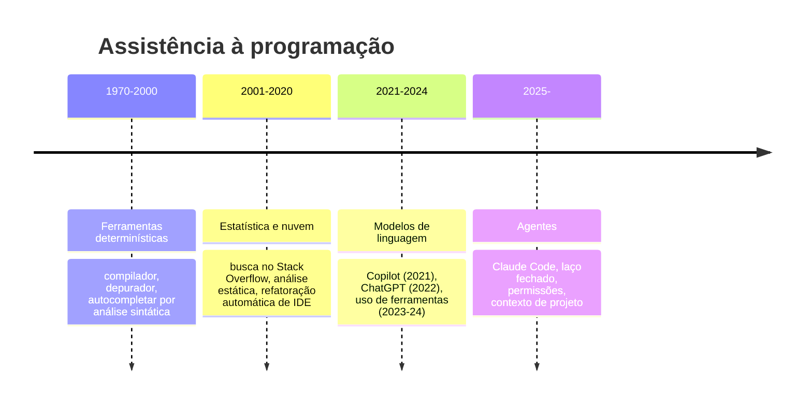

# 11 · História — como se chegou ao agente de código

> **Nível:** intermediário · **Atualizado em:** 13/08/2026
> Datas de produtos e versões são verificáveis. Onde há interpretação, está marcado como tal.

Ninguém entende uma tecnologia sem saber que problema ela veio resolver e o que se tentou
antes. Este arquivo é curto de propósito: o que interessa é a **linha causal**.

---

## Três eras de "o computador me ajuda a programar"

### Era 1 — determinística (até ~2000)

Autocompletar do editor sabia que `str.` seria seguido de um método de `String` porque
**analisava o tipo**. Preciso, verificável, e absolutamente incapaz de adivinhar intenção.
Você só ganhava velocidade de digitação.

Aqui nasce uma lição que volta no fim da história: **ferramenta determinística acerta sempre
dentro do seu escopo estreito.** É por isso que o compilador e o teste continuam sendo os
melhores amigos de um agente — eles são o oráculo que o modelo não tem.

### Era 2 — estatística (2001–2020)

Refatorações automáticas de IDE, análise estática, e o hábito social de copiar do Stack
Overflow. O gargalo migrou: escrever ficou barato, **entender e verificar** ficou caro.

### Era 3 — modelos de linguagem (2021–2024)

| Ano | Marco | O que trouxe | O que faltava |
|---|---|---|---|
| jun/2021 | **GitHub Copilot** (prévia) | completar linhas a partir do comentário e do arquivo aberto | não via o projeto, não rodava nada |
| nov/2022 | **ChatGPT** | conversar sobre código, explicar, gerar trechos | você era o intermediário: copiava, colava, testava, voltava |
| mar/2023 | **Uso de ferramentas / function calling** | o modelo passa a **pedir ações** em formato estruturado | ainda faltava confiabilidade para encadear muitos passos |
| 2023–24 | **Janelas grandes** (100k → 200k tokens) | caber um projeto inteiro no contexto | custo por token ainda alto para laços longos |

A Era 3 tinha todas as peças separadas. Faltava juntá-las e o preço cair.

---

## 2025 — o agente

**Fevereiro de 2025:** a Anthropic lança o **Claude Code** em prévia de pesquisa, junto com
o Claude 3.7 Sonnet. A proposta é diferente das anteriores em um ponto: em vez de sugerir
código no editor, ele **roda no terminal, dentro do seu repositório, com permissão de
executar comandos**.

**Maio de 2025:** disponibilidade geral, junto com a família Claude 4.

**Ao longo de 2025 e 2026:** a superfície cresce em camadas, e a ordem em que elas
apareceram diz muito sobre o que se descobriu ser necessário:

| O que apareceu | Que problema resolveu |
|---|---|
| `CLAUDE.md` | "ele não conhece meu projeto" |
| Modos de permissão, `plan mode` | "ele age antes de eu entender o que vai fazer" |
| **Hooks** | "ele *sabe* a regra e mesmo assim não segue" |
| **Subagentes** | "trabalho ruidoso entope minha conversa" |
| **MCP** | "ele não enxerga meu Jira, meu banco, meu Sentry" |
| **Skills** | "meu `CLAUDE.md` virou um manual de 800 linhas" |
| Modo headless, SDK, GitHub Actions | "quero isso em CI, não só no meu terminal" |
| Sessões em nuvem, background, Remote Control | "quero mais de uma coisa acontecendo ao mesmo tempo" |
| Configuração gerenciada, analytics | "somos 300 pessoas e ninguém controla nada" |

**Repare no padrão**: cada recurso é a resposta a uma falha do recurso anterior. `CLAUDE.md`
resolveu a ignorância do projeto — e criou o problema da aderência, que virou hooks. Hooks
resolveram a garantia — e o `CLAUDE.md` inchou, o que virou skills. Esta é a história real
de qualquer plataforma: ela cresce nas cicatrizes.

**Agosto de 2026:** a versão documentada aqui é a **2.1.231**. O produto existe em CLI,
app desktop, extensões de IDE, web e mobile.

---

## Por que 2025, e não 2019?

A pergunta correta não é "quando o modelo ficou bom", e sim **"quando as quatro condições
se encontraram"**. Nenhuma delas sozinha bastava.

| Condição | Por que era necessária | Quando amadureceu |
|---|---|---|
| **Janela de contexto grande** | Um agente precisa ver arquivos, saídas de comando e o histórico — tudo junto. Com 4 mil tokens (GPT-3, 2020), não cabia nem um arquivo médio. | 2023–2025: 4k → 200k → 1M |
| **Uso confiável de ferramentas** | Num laço de 20 passos, 95% de acerto por passo dá 36% de acerto no total. Precisa de ~99%. | 2024–2025 |
| **Preço por token baixo** | Um laço agêntico reenvia o contexto a cada turno. Ao preço de 2021, uma tarefa custaria dezenas de dólares. | 2024–2026, com cache de prompt |
| **Ergonomia de permissão** | Sem um jeito prático de dizer "isto pode, aquilo não", ninguém deixa um programa rodar comandos no seu repositório. | 2025, e ainda evoluindo |

A **matemática do laço** merece um parágrafo próprio, porque explica por que agentes
pareceram surgir de repente. Um laço de 20 passos com taxa de acerto $p$ por passo termina
certo com probabilidade $p^{20}$:

| $p$ por passo | $p^{20}$ (tarefa inteira) |
|---|---|
| 0,90 | 12% |
| 0,95 | 36% |
| 0,98 | 67% |
| 0,99 | 82% |
| 0,995 | 90% |

Entre 95% e 99% de confiabilidade por passo há uma diferença pequena em *benchmark* e uma
diferença **entre inútil e útil** no produto. Isso é o que faz avanços incrementais no
modelo produzirem saltos descontínuos na experiência. É também por que o mesmo agente
parece genial num repositório com testes rápidos (que elevam o $p$ efetivo, porque erros
são detectados e corrigidos) e sofrível num repositório sem verificação.

---

## O que a história já ensinou (e continua ensinando)

Cinco lições que este curso repete em outros arquivos, aqui na origem:

1. **A parte cara nunca foi digitar.** Toda geração de ferramenta que só acelerou a
   digitação teve ganho modesto. As que atacaram *entender* e *verificar* mudaram o trabalho.
2. **Realimentação vale mais que capacidade bruta.** Um modelo mediano que roda o teste e
   se corrige supera um modelo excelente que só escreve. Esta é a base de todo o material
   sobre hooks.
3. **O gargalo migrou para a revisão.** Quando gerar código fica barato, revisar código
   vira o recurso escasso. Times que adotam agentes sem repensar revisão criam uma fila.
   *(Opinião profissional, não consenso: acredito que esta é a mudança organizacional mais
   subestimada da adoção de agentes.)*
4. **Cada recurso novo é a cicatriz de uma falha anterior.** Ao encontrar uma feature que
   parece exagerada, pergunte que dor a criou. Geralmente a dor é sua também.
5. **Modas vão e voltam.** "IA vai substituir programadores" é a versão 2025 de uma frase
   dita sobre COBOL nos anos 1960, sobre CASE tools nos 1980 e sobre programação visual nos
   1990. O que muda de fato é **onde** o trabalho humano se concentra — nunca desapareceu,
   sempre subiu de nível de abstração. *(Opinião fundamentada.)*

---

## Linha do tempo condensada

| Data | Evento |
|---|---|
| 2021-06 | GitHub Copilot em prévia técnica |
| 2022-11 | ChatGPT |
| 2023-03 | Uso de ferramentas / *function calling* em APIs de LLM |
| 2023-11 | Janelas de 100k+ tokens em modelos comerciais |
| 2024-11 | **MCP** anunciado pela Anthropic como padrão aberto |
| 2025-02 | **Claude Code** em prévia de pesquisa |
| 2025-05 | Claude Code em disponibilidade geral |
| 2025–2026 | Hooks, subagentes, skills, plugins, headless, nuvem, times de agentes |
| 2026-03 | Anthropic Academy: cursos oficiais gratuitos ([`85`](85-cursos-e-certificacoes.md)) |
| 2026-08 | Versão documentada neste curso: **2.1.231** |

---

## Fontes consultadas

- Documentação oficial do Claude Code (code.claude.com/docs), consultada em 13/08/2026 —
  para a superfície de recursos atual e o histórico de versões citado nas notas de release.
- Especificação do Model Context Protocol: https://modelcontextprotocol.io — origem e datas.
- Versão verificada localmente: `claude --version` → `2.1.231 (Claude Code)`, 13/08/2026.
- Datas de Copilot e ChatGPT são de domínio público e amplamente documentadas.

---

## Autoteste

1. Qual era a limitação essencial do Copilot de 2021, e por que ela não era só "modelo pior"?
2. O que "uso de ferramentas" acrescentou que a conversa sozinha não dava?
3. Cite as quatro condições que precisaram se encontrar, e explique por que nenhuma bastava sozinha.
4. Com 95% de acerto por passo, qual a chance de uma tarefa de 20 passos terminar certa? E com 99%?
5. Como essa conta explica um agente parecer "genial" num repositório e "burro" em outro?
6. Que padrão liga `CLAUDE.md` → hooks → skills? O que ele diz sobre como plataformas evoluem?
7. Qual das cinco lições da seção final é opinião do autor, e não consenso?
