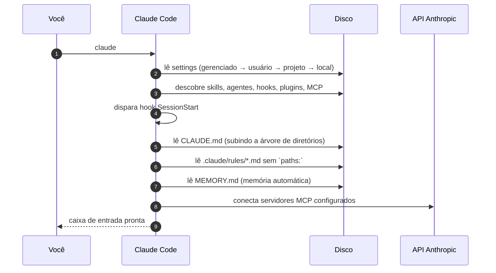
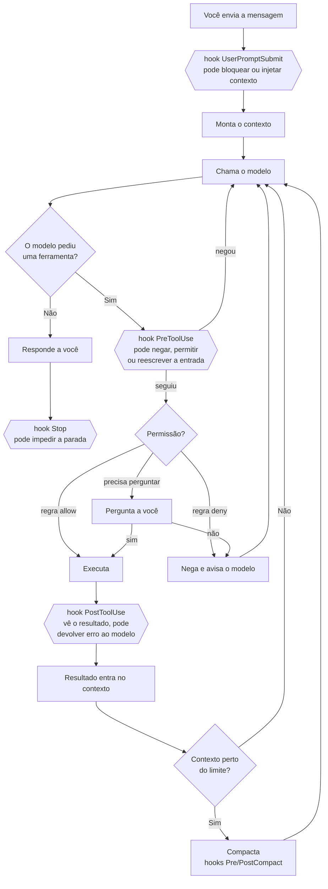

# 12 · Anatomia de uma sessão — o que acontece por dentro

> **Nível:** intermediário · **Atualizado em:** 13/08/2026 · Claude Code 2.1.231

O [`10`](10-fundamentos.md) deu o modelo mental. Aqui abrimos a caixa: o que é montado, em
que ordem, e onde cada mecanismo do produto se encaixa. Sem esta anatomia, hooks e
permissões parecem magia arbitrária; com ela, cada um cai no lugar.

---

## 1. O que acontece quando você digita `claude`



Tudo isso acontece **antes da sua primeira palavra**, e tudo isso já ocupa contexto.
`/context` mostra o custo dessa montagem; é comum um ambiente muito configurado começar com
40 mil tokens gastos. Não é problema em si — é orçamento que você já comprometeu.

---

## 2. Como o contexto é montado

Um turno enviado ao modelo tem esta estrutura, nesta ordem:

```
┌─ prompt de sistema ─────────────────────────────────────────┐
│ Identidade, regras de comportamento, formato das respostas  │
│ Ambiente: SO, diretório, modelo, data                       │
│ Fixo, escrito pela Anthropic. Você acrescenta com            │
│ --append-system-prompt; substitui com --system-prompt        │
├─ definições de ferramentas ─────────────────────────────────┤
│ Read, Edit, Bash, Grep... + ferramentas MCP                 │
├─ instruções carregadas ─────────────────────────────────────┤
│ CLAUDE.md (gerenciado → usuário → projeto → local)          │
│ .claude/rules/*.md   ·   MEMORY.md                          │
│  ⚠ entram como MENSAGEM DE USUÁRIO, não como prompt de       │
│    sistema — daí a aderência não ser garantida               │
├─ histórico da conversa ─────────────────────────────────────┤
│ suas mensagens, respostas, chamadas de ferramenta,          │
│ resultados, blocos de raciocínio                            │
├─ sua mensagem atual ────────────────────────────────────────┘
```

> **Este detalhe explica a queixa mais comum do curso inteiro.** "Por que ele ignora meu
> `CLAUDE.md`?" Porque `CLAUDE.md` é entregue como *mensagem de usuário* logo após o prompt
> de sistema. O modelo lê e tenta seguir, mas não há mecanismo de imposição. Instrução vaga
> ou contraditória será seguida de forma inconsistente. Quando você precisa de **garantia**,
> a resposta nunca é texto: é hook ([`17`](17-hooks.md)) ou permissão ([`15`](15-permissoes-e-modos.md)).

---

## 3. O laço, com todos os pontos de intervenção

Aqui está onde cada recurso do produto engata. Este diagrama é o mais denso do curso e vale
voltar a ele depois de ler os arquivos 15, 17 e 19.



Sete pontos de intervenção, e o que cada um habilita:

| Ponto | O que você consegue fazer ali |
|---|---|
| `UserPromptSubmit` | Injetar contexto automático (ticket atual, branch), ou barrar prompts |
| `PreToolUse` | **Negar** uma ação, ou **reescrever** o comando antes de rodar |
| Permissões | Decidir sem código o que passa direto e o que pergunta |
| `PostToolUse` | Ver o resultado e **devolver erro ao modelo** — a receita de ouro |
| Compactação | Preservar o que importa com `/compact <instruções>` |
| `Stop` | Impedir que ele termine antes de uma condição sua |
| `SessionStart` | Injetar o estado do repositório no começo |

---

## 4. Compactação: o que sobrevive e o que morre

Quando o contexto se aproxima do limite (ou você roda `/compact`), o Claude Code resume o
histórico e substitui as mensagens antigas pelo resumo.

| Sobrevive | Não sobrevive |
|---|---|
| `CLAUDE.md` da raiz — é relido do disco e reinjetado | Detalhes de conversa não escritos em arquivo |
| O resumo gerado | Conteúdo integral dos arquivos lidos antes |
| Mensagens recentes | Saídas completas de comandos antigos |
| Prompt de sistema e ferramentas | `CLAUDE.md` **aninhados** e regras com `paths:` (recarregam quando um arquivo casar de novo) |

**Consequência prática, e é uma das mais úteis do curso:** se uma instrução importante foi
dada só na conversa, ela **vai evaporar**. É exatamente o que sentimos como "ele esqueceu".
A defesa é escrever: `CLAUDE.md`, `.claude/rules/`, ou o `#` que grava na memória automática.

Controles:

```bash
/compact foque nas decisões de API e nos testes que escrevemos   # dirige o resumo
/autocompact 500k                                                # muda o limiar
```

```json
{ "autoCompactEnabled": false, "autoCompactWindow": 500000 }
```

> **Recomendação profissional:** não desligue a compactação automática sem trocar por outra
> disciplina. Sem ela, você bate no teto da janela e a sessão morre no meio de uma tarefa —
> o que é pior do que um resumo imperfeito.

---

## 5. Checkpoints e `/rewind`

O Claude Code fotografa seus arquivos antes de cada mudança
(`fileCheckpointingEnabled`, ligado por padrão). Isso permite:

```
Esc Esc          # rebobina
/rewind          # escolhe o ponto na lista
/rewind 3        # três turnos atrás
```

**A diferença crucial em relação ao git:** `/rewind` volta **código e conversa**. Só o git
não tira da cabeça do modelo o caminho errado — se você reverte o arquivo mas o contexto
ainda contém "decidimos usar a abordagem X", o agente vai reconstruir a abordagem X.

Isso **não substitui git**: checkpoints são da sessão, locais, e somem com o tempo
(`cleanupPeriodDays`, 30 dias por padrão). Commit é para sempre e é compartilhável.

---

## 6. Onde tudo isso fica no disco

| Caminho | O que é |
|---|---|
| `~/.claude/settings.json` | Sua configuração global |
| `~/.claude/CLAUDE.md` | Suas instruções para todos os projetos |
| `~/.claude/agents/`, `~/.claude/skills/`, `~/.claude/rules/` | Suas extensões pessoais |
| `~/.claude/projects/<projeto>/` | Transcrições das sessões daquele repositório |
| `~/.claude/projects/<projeto>/memory/MEMORY.md` | **Memória automática** — o que o Claude aprendeu sozinho |
| `~/.claude.json` | Estado global (MCP por projeto, preferências) |
| `~/.claude/usage-data/report.html` | Relatório do `/insights` |
| `.claude/settings.json` | Configuração do projeto — **versionada** |
| `.claude/settings.local.json` | Suas preferências no projeto — **no `.gitignore`** |
| `.mcp.json` | Servidores MCP do projeto — versionado |
| `CLAUDE.md`, `CLAUDE.local.md` | Memória do projeto |

Transcrições são apagadas depois de `cleanupPeriodDays` (30 por padrão). **A pasta `memory/`
é excluída dessa limpeza** — ela persiste até você ou o Claude editarem.

---

## 7. Sessão, retomada, ramificação

| Comando | O que faz |
|---|---|
| `claude -c` | Continua a mais recente desta pasta |
| `claude -r "nome"` | Retoma por nome ou ID |
| `claude -r "nome" --fork-session` | Retoma **criando um ID novo** — não contamina a original |
| `/branch` | Ramifica a conversa atual para tentar outro caminho |
| `/fork` | Copia a conversa para uma sessão em segundo plano |
| `/clear` | Zera o contexto (a sessão anterior continua existindo em disco) |

`--fork-session` é subutilizado: permite testar uma direção arriscada a partir de um bom
ponto de partida, sem medo de estragar a sessão que estava dando certo.

---

## 8. Os cinco porquês: por que às vezes ele lê o mesmo arquivo duas vezes?

1. **Por que ele leu `src/auth.js` de novo, se já leu há dez minutos?**
   Porque a leitura anterior saiu do contexto na compactação.
2. **Por que a compactação joga fora conteúdo de arquivo?**
   Porque é o que mais ocupa espaço, e é o mais fácil de reobter — o arquivo está no disco.
3. **Por que não guardar um índice do que já foi lido, em vez do conteúdo?**
   O resumo faz uma versão disso, mas comprimida e com perdas: ele registra "vimos que
   `auth.js` valida o token", não as 300 linhas.
4. **Por que não manter o conteúdo em cache fora do contexto?**
   Porque o modelo só "vê" o que está no contexto. Não existe consulta a memória externa
   sem passar pelo contexto — o que existe é ler de novo, que é justamente o que ele fez.
5. **Isso é desperdício?**
   Só parcialmente: reler um arquivo custa muito menos que manter 300 linhas em **todos** os
   turnos desde então. Trocar releitura ocasional por contexto permanentemente inflado é
   quase sempre o negócio certo. *(Parada legítima: trade-off econômico explícito.)*

---

## Autoteste

1. Em que ponto da montagem do contexto entra o `CLAUDE.md`, e por que isso explica a aderência imperfeita?
2. Cite os sete pontos de intervenção do laço e um uso real para cada um.
3. O que sobrevive à compactação e o que morre? Qual a consequência prática mais importante?
4. Qual a diferença entre `/rewind` e `git checkout`? Por que a segunda sozinha não basta?
5. Onde fica a memória automática e por que ela não é apagada com as transcrições?
6. Para que serve `--fork-session`, e por que é subutilizado?
7. Por que o agente relê arquivos, e por que isso normalmente é o comportamento economicamente correto?
