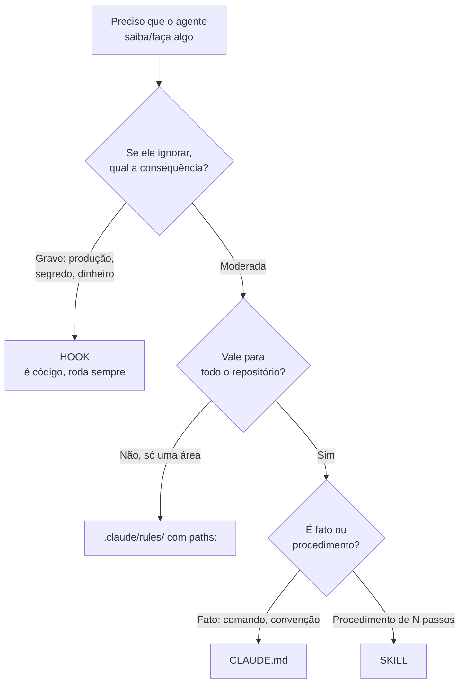

# 13 · Contexto e memória — a disciplina central

> **Nível:** intermediário · **Atualizado em:** 13/08/2026 · Claude Code 2.1.231

Se você só puder dominar **um** arquivo do Bloco B, que seja este. Engenharia de contexto é
o que separa quem obtém resultados consistentes de quem obtém resultados aleatórios.

---

## 1. A ideia em uma frase

> **Contexto é um orçamento, e a qualidade da resposta depende mais da razão
> sinal/ruído dele do que do tamanho dele.**

Duas consequências que contrariam a intuição:

1. **Mais contexto pode piorar a resposta.** Dez arquivos irrelevantes junto com o relevante
   fazem o modelo se distrair. O fenômeno é medido e tem nome: *context rot* ([`60`](60-teoria-avancada.md)).
2. **A pergunta certa não é "o que ele precisa saber?", e sim "o que ele precisa saber
   *agora*, e o que só atrapalha?"**

---

## 2. As cinco camadas de memória

Existem cinco lugares onde informação pode viver. Escolher errado é o erro mais comum e o
mais caro.

| # | Camada | Quando carrega | Custo | Garantia | Use para |
|---|---|---|---|---|---|
| 1 | **Prompt de sistema** (`--append-system-prompt`) | sempre | alto | alta (mas ainda contexto) | automação; ruim para uso interativo |
| 2 | **`CLAUDE.md`** | toda sessão | alto | média | fatos que valem sempre |
| 3 | **`.claude/rules/` com `paths:`** | ao tocar arquivos que casam | zero até casar | média | convenções por área do código |
| 4 | **Skill** | quando invocada ou julgada relevante | zero até usar | média | procedimentos, checklists |
| 5 | **Hook** | evento do ciclo de vida | zero de contexto | **total** | regras que não podem falhar |



Decore este diagrama. Ele resolve, sozinho, metade das dúvidas de configuração.

---

## 3. `CLAUDE.md`

### Onde pode ficar, e em que ordem carrega

Do mais amplo para o mais específico — e o mais específico é lido por **último**, portanto
tem a última palavra na prática:

| Escopo | Caminho | Compartilhado com |
|---|---|---|
| Política gerenciada | `/etc/claude-code/CLAUDE.md` (Linux/WSL), `/Library/Application Support/ClaudeCode/CLAUDE.md` (macOS), `C:\Program Files\ClaudeCode\CLAUDE.md` | toda a organização; **não pode ser excluído** |
| Usuário | `~/.claude/CLAUDE.md` | só você, em todos os projetos |
| Projeto | `./CLAUDE.md` ou `./.claude/CLAUDE.md` | o time, via git |
| Local | `./CLAUDE.local.md` | só você, neste projeto (ponha no `.gitignore`) |

O Claude Code **sobe a árvore de diretórios** a partir de onde você abriu, e carrega todos
os `CLAUDE.md` encontrados, da raiz para baixo. Arquivos em **subdiretórios** carregam sob
demanda, quando o agente lê arquivos ali.

### Como escrever um que funcione

Regras que vêm de erro repetido, não de teoria:

**Tamanho: mire abaixo de 200 linhas.** Acima disso o custo sobe e — o que é pior — a
aderência cai. Um `CLAUDE.md` de 800 linhas é lido, mas seguido de forma seletiva.

**Específico, não genérico:**

| Ruim | Bom |
|---|---|
| "escreva código limpo" | "funções com no máximo 30 linhas; extraia acima disso" |
| "teste suas mudanças" | "rode `npm test` antes de dizer que terminou" |
| "organize os arquivos" | "handlers de API ficam em `src/api/handlers/`" |
| "siga as boas práticas" | (apague: não significa nada operacional) |

**Escreva o que ele não descobre sozinho.** Ele lê o código; não precisa de um mapa de
diretórios no `CLAUDE.md`. Precisa saber **por que** a arquitetura é assim, qual biblioteca
está proibida e por quê, qual armadilha já derrubou o time antes. O `/doctor` das versões
recentes até propõe esse corte automaticamente.

**Sem contradição.** Duas regras que se contradizem fazem o modelo escolher uma
arbitrariamente. Revise periodicamente, sobretudo em monorepo, onde `CLAUDE.md` de outros
times entram pela árvore acima (use `claudeMdExcludes` para cortá-los).

### Importar outros arquivos

```markdown
Visão geral em @README.md e comandos em @package.json.

# Instruções adicionais
- fluxo de git: @docs/git.md
- preferências pessoais: @~/.claude/minhas-preferencias.md
```

Até 4 níveis de profundidade. **Atenção:** importar **não** economiza contexto — o arquivo
importado é expandido e carregado no início, igual. Serve para organização, não para custo.
Para economizar de verdade, use `.claude/rules/` com `paths:`.

Para não importar um caminho citado em prosa, envolva em crases: `` `@README` `` é literal.

### `AGENTS.md`

O Claude Code lê `CLAUDE.md`, **não** `AGENTS.md`. Se seu repositório já usa `AGENTS.md`
para outros agentes:

```markdown
@AGENTS.md

## Específico do Claude Code
Use modo plano para mudanças em `src/billing/`.
```

Ou um symlink (`ln -s AGENTS.md CLAUDE.md`), se não precisar acrescentar nada. No Windows
symlink exige privilégio; prefira o import.

---

## 4. `.claude/rules/` — a camada subutilizada

O recurso com melhor relação valor/esforço de todo o produto, e o que menos gente usa.

```
.claude/rules/
├── estilo.md          # sem `paths:` → carrega sempre
├── testes.md          # com `paths:` → só ao tocar em test/ ou src/
└── frontend/
    └── react.md       # com `paths:` → só em componentes
```

```markdown
---
paths:
  - "src/**/*.{ts,tsx}"
  - "test/**/*.test.ts"
---

# Regras de TypeScript

- Nada de `any`. Se o tipo é desconhecido, use `unknown` e estreite.
- Erros de domínio são classes, não strings.
- ...
```

**Por que isto é tão bom:** você pode escrever 200 linhas de convenção detalhada sobre
testes e pagar **zero** de contexto quando está mexendo na documentação. A regra entra
quando o Claude lê um arquivo que casa com o padrão.

Regras sem `paths:` carregam sempre, com a mesma prioridade do `.claude/CLAUDE.md`.
Regras de usuário (`~/.claude/rules/`) carregam antes das de projeto, que têm prioridade maior.
`.claude/rules/` aceita symlink, o que permite compartilhar um conjunto entre repositórios.

Exemplo real neste curso:
[`07-projeto-modelo/.claude/rules/testes.md`](07-projeto-modelo/.claude/rules/testes.md).

---

## 5. Memória automática

O Claude escreve notas para si mesmo, sem você pedir: comandos de build que descobriu,
armadilhas, preferências suas que ele inferiu de correções.

| Onde | `~/.claude/projects/<projeto>/memory/` |
|---|---|
| Índice | `MEMORY.md` — **só as primeiras 200 linhas ou 25 KB** entram em toda sessão |
| Tópicos | `debugging.md`, `api.md`, … — lidos sob demanda |
| Escopo | por repositório (todos os worktrees compartilham) |
| Persistência | **não** é apagada com as transcrições |
| Desligar | `/memory`, ou `"autoMemoryEnabled": false`, ou `CLAUDE_CODE_DISABLE_AUTO_MEMORY=1` |

Você verá mensagens como *"Saved 2 memories"* e *"Recalled 2 memories"*.

**Recomendação profissional:** deixe ligada, mas **audite** com `/memory` de vez em quando.
Ela às vezes memoriza como permanente algo que era circunstancial ("o usuário prefere
`pnpm`" quando você usou `pnpm` uma vez, num projeto). São arquivos markdown comuns: leia,
edite, apague.

**Diferença essencial em relação ao `CLAUDE.md`:** `CLAUDE.md` é o que **você** decide que é
verdade; memória automática é o que **ele** concluiu. A primeira é contrato, a segunda é
observação.

---

## 6. Ferramentas de diagnóstico

### `/context` — o mais importante

Mostra em grade colorida o que ocupa o contexto: prompt de sistema, ferramentas, memória,
conversa, arquivos. `/context all` detalha tudo, inclusive o peso das definições de
ferramentas MCP.

Ler essa grade é o primeiro movimento diante de:

- sessão lenta ou cara;
- "ele não segue meu `CLAUDE.md`" (confira se ele **carregou**, na lista *Memory files*);
- "ele esqueceu o que eu disse".

### `/usage`, `/insights`

`/usage` dá tokens, custo e — nos planos por assinatura — a **atribuição**: quanto do seu
uso recente veio de skills, subagentes, plugins e cada servidor MCP, além de bandeiras de
comportamento (contexto longo, perda de cache) quando passam de 10%.

`/insights` gera um relatório HTML sobre os seus padrões de uso, em
`~/.claude/usage-data/report.html`. Analisa até 200 sessões por execução. Vale uma vez por mês.

---

## 7. Táticas de quem faz isso há tempo

**1. `/clear` ao trocar de assunto — sempre.**
Contexto velho não é neutro: ele compete pela atenção do modelo. O custo de recomeçar é
menor do que o custo de um agente distraído.

**2. Dê o dado pronto, não peça para caçar.**
```
!git log --oneline -20
!grep -rn "TODO" src/ | head -30
```
O prefixo `!` roda no seu shell e injeta a saída. Você conhece o repositório; ele não.
Um `grep` seu de 30 linhas vale mais que uma exploração de 20 turnos.

**3. Delegue trabalho ruidoso a subagentes.**
"Descubra em quais arquivos a função X é usada" pode custar 50 mil tokens de exploração. Num
subagente, esses 50 mil ficam lá e voltam 5 linhas ([`19`](19-subagentes.md)).

**4. Filtre a saída de comandos antes que ela chegue ao contexto.**
Um hook `PreToolUse` que reescreve `npm test` para mostrar só falhas troca 10 mil linhas por
100. Receita completa no [`06`](06-exemplos.md), exemplo 11.

**5. `/compact` com instruções, não pelado.**
`/compact foque nas decisões de arquitetura e no que já falhou` preserva o que interessa.

**6. Uma tarefa, uma sessão, um nome.**
`claude -n "refatorar-billing"` deixa `claude -r "refatorar-billing"` trivial, e você para de
misturar assuntos por preguiça de retomar.

**7. Meça antes de otimizar.**
`/context all` antes de sair cortando. O culpado costuma ser surpreendente — em ambientes
muito integrados, quase sempre são as definições de ferramentas MCP.

---

## 8. Os cinco porquês: por que meu `CLAUDE.md` não é seguido?

1. **Por que ele ignorou minha regra?**
   Porque `CLAUDE.md` chega como mensagem de usuário, não como imposição ([`12`](12-anatomia-de-uma-sessao.md)).
2. **Por que não colocar no prompt de sistema, então?**
   Dá para acrescentar (`--append-system-prompt`), mas precisa ser passado a cada invocação
   — inviável no uso interativo — e **mesmo assim não é garantia**: prompt de sistema
   também é texto, e texto é influência, não imposição.
3. **Por que texto não pode ser imposição?**
   Porque a saída do modelo é uma amostragem probabilística condicionada ao contexto inteiro.
   Não existe um caminho que force um token específico a nunca aparecer.
4. **Não dá para restringir a saída mecanicamente?**
   Dá, e é exatamente isso que o Claude Code faz — só que **fora** do modelo: permissões
   barram a ação, hooks barram a execução. A restrição vive no programa, não no texto.
5. **Então quando eu uso qual?**
   Texto para influenciar; código para garantir. Se a violação for cara, não escreva
   uma frase — escreva um hook. *(Parada legítima: natureza probabilística do modelo.)*

---

## Autoteste

1. Enuncie a "ideia em uma frase" deste arquivo e explique por que mais contexto pode piorar a resposta.
2. Liste as cinco camadas de memória em ordem de custo e de garantia.
3. Você quer 200 linhas de convenção sobre testes sem pagar contexto no resto do tempo. Qual camada, e como?
4. Por que importar com `@arquivo` **não** economiza contexto?
5. Qual a diferença conceitual entre `CLAUDE.md` e memória automática?
6. Qual é o primeiro comando a rodar quando a sessão está cara? O que costuma ser o culpado?
7. Por que texto — inclusive no prompt de sistema — não pode ser garantia? O que pode?
8. Cite três táticas de redução de contexto e o ganho de ordem de grandeza de cada uma.
