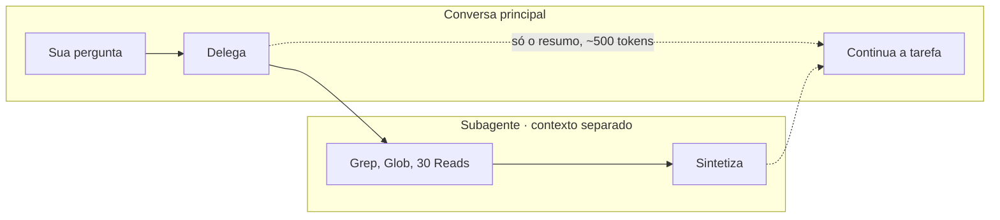

# 19 · Subagentes — isolar contexto e restringir poder

> **Nível:** avançado · **Atualizado em:** 13/08/2026 · Claude Code 2.1.231

Um subagente é uma sessão-filha com **contexto próprio**, prompt de sistema próprio,
conjunto de ferramentas próprio e permissões próprias. Ele faz um trabalho e devolve
**apenas o resumo** à conversa principal.

Duas razões para existir, e vale distinguir porque levam a configurações diferentes:

1. **Isolar contexto** — trabalho ruidoso não polui a sua conversa.
2. **Restringir poder** — um revisor que **não pode** editar é diferente de um revisor a
   quem se pediu para não editar.

---

## 1. A economia de contexto, em números

Pedido: *"em quais arquivos a função `validarToken` é usada, e o que cada uso espera?"*

| | Na conversa principal | Em subagente |
|---|---|---|
| Buscas e leituras | ~30 arquivos abertos | idem, mas no contexto **dele** |
| Tokens no **seu** contexto | ~80.000 | **~500** (o resumo) |
| Custo desses tokens em todo turno seguinte | recorrente | zero |

O ganho não é a busca ficar mais barata — é ela **não continuar custando** pelo resto da
sessão. Contexto poluído é imposto sobre todos os turnos futuros.



---

## 2. Subagentes embutidos

| Tipo | Para quê |
|---|---|
| `Explore` | Busca ampla em muitos arquivos e diretórios; lê trechos, não arquivos inteiros. **Localiza** código; não audita |
| `Plan` | Desenha estratégia de implementação, avalia trade-offs |
| `general-purpose` | Genérico, com todas as ferramentas |
| `fork` | Herda **todo o seu contexto** e continua dali |

`fork` é o único que herda a conversa. Os demais começam limpos — e é por isso que **o
prompt que você dá a eles é tudo**: um subagente não sabe do que vocês estavam falando.

---

## 3. Criar um subagente

```
.claude/agents/revisor-api.md          # do projeto (versionado)
~/.claude/agents/meu-revisor.md        # seu, em todos os projetos
```

```markdown
---
name: revisor-api
description: Revisa mudanças na camada HTTP procurando status errado, validação ausente e vazamento de detalhe interno. Use depois de qualquer alteração em src/.
tools: Read, Grep, Glob, Bash
disallowedTools: Edit, Write
model: sonnet
permissionMode: default
color: cyan
---

Você é um revisor de API. Você **não edita arquivos**.

1. `git diff` para ver o que mudou.
2. Leia os arquivos tocados por inteiro, não só o diff.
3. Confira: status HTTP, validação, vazamento, regra de negócio na camada errada, teste.
4. Rode `npm test` e reporte o resultado real.

Formato — nada além disso:
VEREDITO: aprovado | aprovado com ressalvas | reprovado
ACHADOS: [gravidade] arquivo:linha — problema. Correção: …

Não invente problema para parecer útil: revisor que reclama de tudo é ignorado.
```

Versão completa e validada em
[`07-projeto-modelo/.claude/agents/revisor-api.md`](07-projeto-modelo/.claude/agents/revisor-api.md).

> O assistente interativo do `/agents` foi **removido** na 2.1.198. Escreva o arquivo, ou
> peça ao Claude para escrevê-lo. Os locais e o formato não mudaram.

---

## 4. Frontmatter — referência

| Campo | Obrigatório | Para quê |
|---|---|---|
| `name` | **Sim** | Minúsculas e hífens. **Não pode conter `:`** (reservado para plugins). Nome inválido = arquivo não carrega, com erro só no log |
| `description` | **Sim** | Quando o Claude deve delegar a ele |
| `tools` | Não | Lista permitida. Sem o campo, herda tudo. Se nenhuma entrada resolver para uma ferramenta real, o subagente **falha ao iniciar** |
| `disallowedTools` | Não | Remove ferramentas da lista herdada |
| `model` | Não | `sonnet`, `opus`, `haiku`, `fable`, id completo, ou `inherit` (padrão) |
| `permissionMode` | Não | `default`, `acceptEdits`, `auto`, `dontAsk`, `bypassPermissions`, `plan` |
| `maxTurns` | Não | Teto de turnos — **freio contra laço infinito** |
| `skills` | Não | Skills pré-carregadas no contexto dele (conteúdo inteiro) |
| `mcpServers` | Não | Servidores MCP disponíveis a ele |
| `hooks` | Não | Hooks com escopo deste subagente |
| `memory` | Não | `user`, `project` ou `local` — memória persistente própria |
| `background` | Não | `true` = sempre em segundo plano |
| `effort` | Não | Esforço de raciocínio |
| `isolation` | Não | `worktree` = cópia isolada do repositório em worktree git |
| `color` | Não | Cor na lista de tarefas |
| `initialPrompt` | Não | Primeiro turno automático quando usado como agente principal (`--agent`) |

### `memory` — subagente que aprende

```yaml
memory: project     # .claude/agent-memory/<nome>/  — versionável
```

Opções: `user` (`~/.claude/agent-memory/<nome>/`), `project` (versionável),
`local` (`.claude/agent-memory-local/`, fora do git). Útil para um revisor acumular os
padrões de erro daquele repositório entre sessões.

### `isolation: worktree` — paralelismo real

Roda numa cópia isolada do repositório, ramificada por padrão do seu branch principal. É o
que permite N subagentes editando **sem conflito**. Custa ~200–500 ms e disco por agente;
worktrees sem alterações são removidos sozinhos. Use só quando houver escrita concorrente.

---

## 5. Como invocar

**Automático** — o Claude delega quando a `description` casa com a tarefa.

**Explícito:**
```
use o agente revisor-api para revisar o que mudou
```

**Por skill:** `context: fork` + `agent: revisor-api` ([`18`](18-skills-e-comandos.md)).

**Pela CLI, sem arquivo:**
```bash
claude --agents '{"revisor":{"description":"Revisa código","prompt":"Você revisa...","tools":["Read","Grep"]}}'
```

**Como agente principal da sessão:**
```bash
claude --agent revisor-api
```

---

## 6. Paralelismo

Vários subagentes rodam ao mesmo tempo. Sem isolamento, todos veem o mesmo disco — o que é
bom para leitura e desastroso para escrita.

| Cenário | Configuração |
|---|---|
| N leitores (busca, análise, revisão) | sem isolamento; `tools: Read, Grep, Glob` |
| N escritores (migração, refatoração em massa) | **`isolation: worktree` obrigatório** |
| Pipeline (achar → verificar → corrigir) | orquestração por `Workflow` ou `/batch` |

`/tasks` lista o que está rodando; `Ctrl+X Ctrl+K` para todos os subagentes em background.

> **Advertência de custo, com número da documentação oficial:** times de agentes
> (`CLAUDE_CODE_EXPERIMENTAL_AGENT_TEAMS=1`) consomem **cerca de 7× mais tokens** que uma
> sessão normal quando os companheiros rodam em modo plano, porque cada um mantém a própria
> janela de contexto. Use Sonnet para os companheiros, mantenha times pequenos e encerre
> quem terminou.

---

## 7. Quando usar, e quando não

**Use quando:**

| Situação | Por quê |
|---|---|
| Exploração ampla ("onde está X?") | 80 mil tokens viram 500 |
| Revisão independente | Contexto limpo evita viés: quem escreveu tende a aprovar |
| Trabalho que exige poder restrito | `disallowedTools` é garantia estrutural |
| Saída volumosa (logs, testes verbosos) | O ruído fica lá |
| Tarefas independentes em paralelo | Tempo de parede cai |

**Não use quando:**

| Situação | Por quê |
|---|---|
| A tarefa depende do que já foi conversado | Ele **não** herda o contexto (exceto `fork`) |
| A tarefa é curta | O overhead de montar o contexto dele não compensa |
| Você quer acompanhar passo a passo | A transparência diminui |
| A tarefa é ambígua | Você não vai poder corrigir o rumo no meio |

**A causa nº 1 de subagente inútil:** prompt subespecificado. O seu contexto não vai junto.
Se você não disser qual é o padrão do projeto e o que é "pronto", ele adivinha.

---

## 8. Cinco subagentes que valem a pena

1. **`revisor`** — `tools: Read, Grep, Glob, Bash`, `disallowedTools: Edit, Write`.
   Formato de saída fixo. O mais útil de todos.
2. **`explorador`** — `tools: Read, Grep, Glob`, `model: haiku`. Barato, para mapear código.
3. **`testador`** — roda a suíte e volta com **as falhas resumidas**, não com 10 mil linhas.
4. **`migrador`** — `isolation: worktree`, `maxTurns: 30`. Um por arquivo, em paralelo.
5. **`documentador`** — `model: haiku`, lê e escreve docs. Tarefa tolerante a modelo menor.

O padrão comum: **cada um faz uma coisa, com o mínimo de ferramentas necessário e um formato
de resposta fixo.** Subagente genérico com todas as ferramentas é só uma sessão extra e cara.

---

## 9. Os cinco porquês: por que o subagente devolveu algo genérico?

1. **Por que a resposta veio superficial?**
   Ele não tem o seu contexto. Começou do zero, com apenas o prompt de delegação.
2. **Por que não herda o contexto, se seria mais fácil?**
   Porque herdar é justamente o custo que se quer evitar: copiar 80 mil tokens para o filho
   anula a economia inteira. (`fork` herda, e paga por isso.)
3. **Por que não herdar só "o que importa"?**
   Ninguém sabe o que importa antes de saber a tarefa. Selecionar automaticamente exigiria
   um julgamento que é, ele próprio, uma chamada ao modelo.
4. **Então o que eu faço?**
   Escreve o prompt de delegação como se estivesse escrevendo para alguém que acabou de
   chegar: onde procurar, qual é o padrão, o que é "pronto", em que formato responder.
5. **E por que isso costuma sair melhor no fim?**
   Porque **explicitar o critério melhora o resultado também no principal**. O prompt de
   delegação bem escrito é, com frequência, a primeira vez que alguém definiu com precisão o
   que era a tarefa. *(Parada legítima: trade-off explícito entre custo de contexto e
   completude da informação.)*

---

## Autoteste

1. Quais são as duas razões para usar subagente, e por que levam a configurações diferentes?
2. Quanto contexto uma exploração de 30 arquivos custa na conversa principal e num subagente?
3. Quais subagentes embutidos existem, e qual deles herda o seu contexto?
4. O que `isolation: worktree` resolve, e qual o custo?
5. Quando você **não** deve usar subagente? Cite três situações.
6. Por que "prompt subespecificado" é a causa nº 1 de subagente inútil?
7. Qual o consumo relativo de tokens de times de agentes, segundo a documentação?
8. Descreva a configuração do subagente revisor e diga o que `disallowedTools` garante que o prompt não garante.
