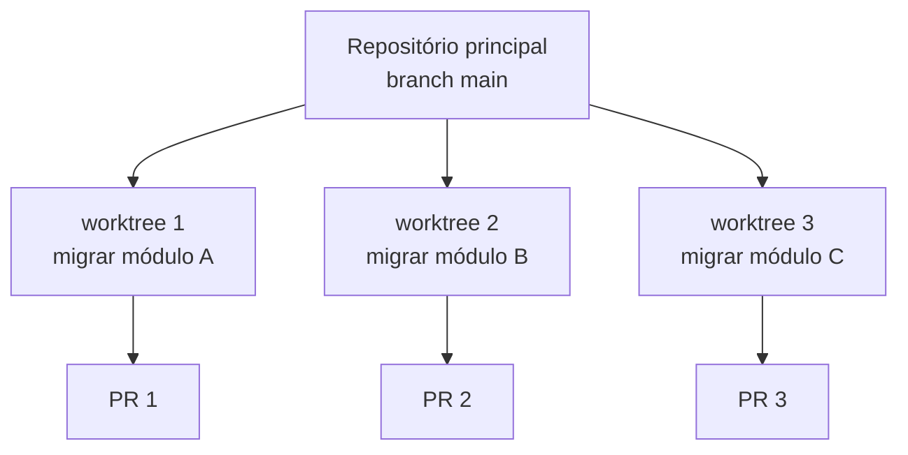

# 22 · Git, GitHub e trabalho paralelo

> **Nível:** intermediário → avançado · **Atualizado em:** 13/08/2026 · Claude Code 2.1.231

Git é a rede de segurança que torna aceitável deixar um agente editar seus arquivos. Este
arquivo cobre como usá-lo bem com o Claude Code, e como paralelizar sem virar bagunça.

---

## 1. A higiene mínima

Três hábitos que resolvem quase todos os sustos:

**1. Commit limpo antes de soltar o agente.**
```bash
git add -A && git commit -m "antes do claude: <o que vou pedir>"
```
Não é sobre a mensagem — é sobre ter um ponto de retorno atômico.

**2. Branch por tarefa.** O agente trabalha num branch, você revisa o diff, funde. Isso
transforma "ele mexeu em coisa que não devia" de problema em observação.

**3. Revisar o diff antes de commitar. Sempre.**
```
/diff
```
```bash
git diff --stat        # visão geral: quais arquivos, quanto mudou
git diff               # o conteúdo
```
`git diff --stat` é o filtro mais rápido: se aparecer um arquivo que você não esperava,
pare aí.

---

## 2. Deixar o agente usar git

O Claude Code usa git via `Bash`. Configuração sensata:

```json
{
  "permissions": {
    "allow": ["Bash(git status *)", "Bash(git diff *)", "Bash(git log *)", "Bash(git add *)"],
    "ask": ["Bash(git commit *)", "Bash(git push *)", "Bash(git checkout *)"],
    "deny": ["Bash(git push --force *)", "Bash(git reset --hard *)", "Bash(git clean -fd*)"]
  }
}
```

A lógica: **leitura livre, escrita local pergunta, destruição proibida.** `git push --force`
e `git reset --hard` destroem trabalho de forma que nem o `/rewind` recupera.

Commits pelo agente saem com uma linha de coautoria. Para mudar ou remover:

```json
{ "attribution": { "commit": "", "pr": "" } }
```

**Recomendação:** mantenha alguma atribuição. Daqui a seis meses, saber quais commits saíram
de sessões de agente é informação valiosa para o `git bisect` e para a arqueologia do repositório.

---

## 3. Integração com o GitHub

### `gh` — o caminho barato

Prefira a CLI ao servidor MCP do GitHub: custa **zero** de contexto até ser usada ([`20`](20-mcp.md)).

```json
{
  "permissions": {
    "allow": ["Bash(gh pr view *)", "Bash(gh pr diff *)", "Bash(gh issue view *)"],
    "ask": ["Bash(gh pr create *)", "Bash(gh pr merge *)"]
  }
}
```

```
leia a issue 412 com gh, implemente o que ela pede, rode os testes e abra um PR
```

### App do GitHub

```
/install-github-app
```
Instala o app no repositório e habilita mencionar `@claude` em issues e PRs para acionar uma
sessão na nuvem.

### `/autofix-pr`

Abre uma sessão na web que **vigia um PR** e empurra correções conforme o CI falha.
Poderoso e perigoso na mesma medida: use em branches de trabalho, nunca com merge automático.

---

## 4. Revisão automática

Três níveis, do mais barato ao mais completo:

```
/code-review                          # revisa o diff atual
/code-review high --fix               # mais fundo, aplica as correções
/code-review ultra 1234 --post        # multiagente na nuvem, comenta no PR
```

`ultra` é revisão multiagente na nuvem: dispara vários revisores com focos distintos e
verifica adversarialmente os achados antes de reportar. É paga e demorada — reserve para
mudanças grandes ou de risco.

No CI, use o modo headless — receita completa no [`06`](06-exemplos.md), exemplo 7:

```bash
git diff origin/main...HEAD | claude --bare -p "Revise este diff." \
  --max-budget-usd 1.00 --max-turns 5 --output-format json --json-schema '{…}'
```

**Nunca** rode agente em CI sem `--max-budget-usd` e `--max-turns`.

---

## 5. Worktrees — trabalho paralelo de verdade

Um *worktree* do git é uma segunda cópia do repositório, em outro diretório, apontando para
outro branch — compartilhando o mesmo `.git`. É o mecanismo que permite N agentes escrevendo
ao mesmo tempo sem se atropelarem.

```bash
git worktree add ../projeto-feature-x -b feature-x
cd ../projeto-feature-x && claude
```

No Claude Code, isso é automático:

- `isolation: worktree` no frontmatter de um subagente ([`19`](19-subagentes.md));
- `/batch <instrução>`, que decompõe uma mudança grande em 5–30 unidades independentes,
  cada uma no seu worktree;
- as ferramentas `EnterWorktree` / `ExitWorktree`;
- `claude -w feature-auth --tmux`, que ainda cria uma sessão tmux.



**Quando compensa:** tarefas **independentes** que escrevem arquivos. Migração de 30 módulos,
correção do mesmo bug em 5 serviços.

**Quando não compensa:** tarefas que dependem umas das outras (você vai gastar mais tempo
resolvendo conflito do que ganhou), ou que só leem (aí subagentes comuns bastam, sem o custo
de disco e dos ~200–500 ms por worktree).

---

## 6. Sessões em segundo plano e na nuvem

| Como | O que faz |
|---|---|
| `claude --bg "investigue o teste instável"` | Roda destacado; você continua trabalhando |
| `/background` | Manda a sessão atual para segundo plano |
| `claude agents` | Painel de todas as sessões em background |
| `claude attach <id>` / `logs <id>` / `stop <id>` | Anexar, ver saída, parar |
| `claude --cloud "conserte o bug do login"` | Sessão em VM gerenciada pela Anthropic |
| `claude --teleport` | Traz uma sessão da web para o terminal local |
| `/remote-control` | Continua esta sessão local de outro dispositivo |

Sessões na nuvem rodam em VM isolada, com acesso de rede restrito por padrão, `git push`
limitado ao branch de trabalho e registro de auditoria. É o caminho para tarefa longa que
você não quer segurando o terminal — e para deixar rodando enquanto vai almoçar.

---

## 7. Mensagem de commit e PR

O agente escreve boas mensagens **se você disser o que é bom**. No `CLAUDE.md`:

```markdown
## Commits
- Formato: `<tipo>(<escopo>): <o que mudou>` — tipos: feat, fix, refactor, test, docs, chore.
- O corpo explica **por que**, não o que — o diff já mostra o que.
- Um commit por mudança lógica. Não misture refatoração com correção.

## Pull requests
- Título no mesmo formato do commit.
- Corpo: problema, abordagem, como testar, o que ficou de fora.
- Se houver mudança incompatível, uma seção "Breaking" no topo.
```

Isso vale muito mais do que qualquer prompt no momento do commit — porque vale sempre.

---

## 8. Armadilhas

| Armadilha | Consequência | Defesa |
|---|---|---|
| Deixar o agente commitar sem revisar | Lixo no histórico, segredo commitado | `ask` em `git commit` + `/diff` |
| `git add -A` cego | Entra `.env`, `node_modules`, artefato | `.gitignore` correto + `git status` antes |
| Merge automático de PR do agente | Código não revisado em produção | Nunca automatize merge |
| Worktree para tarefas dependentes | Inferno de conflito | Worktree só para trabalho independente |
| Sessão de nuvem em repositório com segredo | Segredo na VM | Confira o que o repositório contém |
| Não commitar antes de começar | Não há ponto de retorno | O hábito nº 1 da seção 1 |

---

## 9. Os cinco porquês: por que branch por tarefa importa tanto com agente?

1. **Por que branch separado, se o agente é bom?**
   Porque a taxa de erro não é zero, e o custo de revisar cresce com o tamanho do diff.
2. **Por que o custo de revisão cresce mais que linearmente?**
   Porque diffs grandes escondem mudanças pequenas e erradas. Você lê 400 linhas e perde a
   que trocou `>` por `>=`.
3. **Por que isso é pior com agente do que com pessoa?**
   Porque o agente produz volume mais rápido. O mesmo mecanismo que faz "gerar 400 linhas em
   dois minutos" faz "esconder o erro no meio delas".
4. **Por que não confiar nos testes para pegar isso?**
   Testes pegam o que você previu. Um agente frequentemente altera comportamento não coberto —
   e a cobertura do seu repositório é o que é, não o que gostaríamos.
5. **Então qual é a disciplina?**
   **Diffs pequenos, branches curtos, revisão real.** É o mesmo conselho de sempre em
   engenharia de software; o agente só o tornou mais urgente, porque tornou fácil violá-lo.
   *(Parada legítima: propriedade estatística do processo de revisão humana.)*

---

## Autoteste

1. Quais são os três hábitos de higiene com git, e o que cada um previne?
2. Qual é a lógica da configuração de permissão para git? Por que `git push --force` no `deny`?
3. Por que preferir `gh` ao servidor MCP do GitHub?
4. O que é um worktree, e quando ele compensa? Quando não?
5. Quais duas flags são obrigatórias ao rodar agente em CI?
6. Por que definir convenção de commit no `CLAUDE.md` vale mais que pedir no prompt?
7. Por que o agente torna a disciplina de diffs pequenos mais urgente, e não menos?
