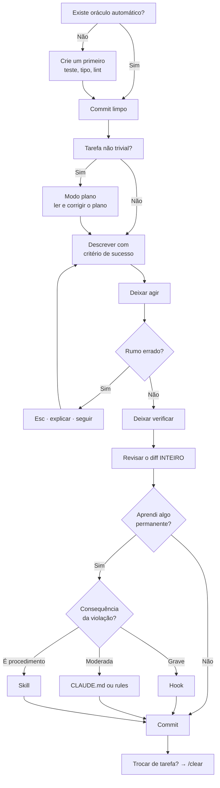

# 25 · O ofício — o que separa quem tira 10× de quem tira 1,2×

> **Nível:** avançado · **Atualizado em:** 13/08/2026
> Este é o arquivo central do curso, e a resposta direta à pergunta *"o que preciso saber
> para ser profissional em Claude Code e tirar o melhor proveito?"*.
> Marcações: **[fato]** verificável, **[consenso]** amplamente aceito na prática,
> **[opinião]** minha posição profissional, aberta a discordância.

---

## A tese

> **Amador otimiza o prompt. Profissional otimiza o ambiente.**

A diferença de resultado entre duas pessoas usando a mesma ferramenta, com o mesmo modelo,
no mesmo dia, é de uma ordem de grandeza. E quase nada dela vem de "saber escrever prompt".
Vem de três coisas: **o repositório está preparado**, **existe verificação automática**, e
**a pessoa sabe quando não usar**. **[opinião, fundamentada em padrão de adoção repetido]**

---

## Os sete pilares

### Pilar 1 · Verificação automática antes de tudo

**A regra de ouro:** *toda tarefa dada a um agente precisa de um jeito automático de saber
se está certa.* **[consenso]**

Por quê: um agente com verificação **itera até acertar**. Sem verificação, ele produz algo
plausível e para. A diferença não é de qualidade marginal — é entre "resolveu" e "gerou
texto que parece uma solução".

Isso reordena as prioridades de forma incômoda: **antes de configurar qualquer coisa do
Claude Code, arrume os testes.** Um projeto com suíte rápida e confiável extrai muito mais
de um agente mediano do que um projeto sem testes extrai do melhor modelo do mundo.

Hierarquia de oráculos, do mais forte ao mais fraco:

| Oráculo | Força | Custo de montar |
|---|---|---|
| Teste automatizado que falha com o bug | Máxima | Alto |
| Compilador / verificador de tipos | Alta | Baixo, se a linguagem tiver |
| Linter e formatador | Média | Baixo |
| `curl` que devolve o status esperado | Média | Baixo |
| Você olhando a tela | Baixa | Alto (é o **seu** tempo) |
| Nada | Zero | — |

O feche do laço é o hook `PostToolUse` ([`17`](17-hooks.md)): a suíte roda depois de cada
edição e a falha vai **para o agente**, não para você. **Verificado neste curso**: com um
padrão trocado de propósito, o hook devolveu `'baixa' !== 'media'` e o agente recebeu o
erro no mesmo turno.

### Pilar 2 · Engenharia de contexto

**[fato]** Qualidade cai com contexto poluído; **[consenso]** a maior alavanca isolada é
manter a razão sinal/ruído alta.

Cinco movimentos, em ordem de retorno:

1. **`/clear` ao trocar de assunto.** Grátis, e quase ninguém faz.
2. **Filtrar saída volumosa** antes que chegue ao contexto (hook com `updatedInput`). Troca
   10 mil linhas por 100 — economia de **ordem de grandeza**, não percentual.
3. **Delegar exploração a subagente.** 80 mil tokens viram 500 ([`19`](19-subagentes.md)).
4. **Dar o dado pronto** com `!comando` em vez de deixar o agente caçar.
5. **Mover procedimento do `CLAUDE.md` para skills**, e convenção para `.claude/rules/`
   com `paths:` ([`13`](13-contexto-e-memoria.md)).

Diagnóstico é `/context all`. Meça antes de otimizar: o culpado costuma ser diferente do
esperado — em ambiente muito integrado, quase sempre são as definições MCP.

### Pilar 3 · A escada de garantia

O modelo mental que resolve metade das dúvidas de configuração:

| Preciso que… | Use | Garantia |
|---|---|---|
| ele saiba um fato | `CLAUDE.md` | baixa |
| ele siga uma convenção numa área | `.claude/rules/` com `paths:` | baixa |
| ele siga um procedimento | skill | média |
| ele **não consiga** fazer algo | `permissions.deny` | alta |
| algo aconteça **sempre** | hook | **total** |

**O erro conceitual mais caro do campo** é escrever no `CLAUDE.md` uma regra cuja violação
custa caro. `CLAUDE.md` é contexto: ele **pede**. Se a consequência é produção quebrada,
segredo vazado ou dinheiro perdido, a regra precisa ser código. **[consenso]**

### Pilar 4 · Saber quando **não** usar

O sinal mais confiável de maturidade. **[opinião]**

**Não use quando:**

| Situação | Por quê |
|---|---|
| Você não sabe como é "certo" | Não pode avaliar o resultado. Você vira revisor de algo que não entende |
| Decisão arquitetural de longo prazo | Ele otimiza o pedido, não os próximos três anos |
| Não existe critério de sucesso | Sem oráculo, você fica no lugar do teste |
| Mudança de uma linha que você já sabe fazer | O tempo de explicar é maior que o de fazer |
| Domínio onde 95% certo = errado | Cripto, dinheiro, saúde, jurídico, segurança |
| Precisa entender profundamente o código | Delegar a leitura é delegar o entendimento |

**Use com confiança quando:** trabalho mecânico em escala, código-legado a explorar,
testes para código sem testes, primeira versão a corrigir, linguagem que você avalia mas
não domina, tarefa com oráculo automático.

**O caso mais interessante — "delegar a leitura é delegar o entendimento":** se você precisa
ficar dono daquele código, leia você. Um resumo perfeito não substitui ter percorrido o
caminho. **[opinião, e das mais importantes deste arquivo]**

### Pilar 5 · Interromper cedo

`Esc` na primeira frase que soar errada. **[consenso]**

Um agente errado erra rápido e em vários arquivos. O custo de deixar terminar não é só o
token: é o diff maior, mais difícil de revisar, e o contexto contaminado com a direção
errada — que ele vai reconstruir se você só reverter os arquivos.

Corolário: **modo plano em tudo que não é trivial.** Converte quinze passos errados em um
parágrafo errado. O melhor negócio disponível na ferramenta.

### Pilar 6 · Revisão é o novo gargalo

Quando gerar código fica barato, **revisar** vira o recurso escasso. Times que adotam
agentes sem repensar revisão criam uma fila e concluem que "a ferramenta não ajudou".
**[opinião]**

O que funciona:

- **Diffs pequenos.** Um PR de 800 linhas gerado por agente não é revisado — é aprovado.
- **Revisão em camadas**: `/code-review` primeiro, humano depois, no que sobrou.
- **Subagente revisor sem poder de edição** ([`19`](19-subagentes.md)).
- **Automação do que é mecânico** (lint, formato, cobertura) para o humano ver o que importa.
- **Explicitar o que o humano procura**: correção, segurança, adequação ao domínio.
  Estilo é trabalho de ferramenta.

### Pilar 7 · Economia

Um profissional sabe o que sua sessão custa. **[fato]** No JSON real medido neste curso,
uma pergunta trivial custou **US$ 0,19** porque arrastava ~64 mil tokens de contexto.

Cinco hábitos:

1. Modelo à altura da tarefa: Sonnet resolve a maior parte; Opus para o difícil de verdade.
2. `/clear` corta o contexto arrastado — e o custo por token seguinte.
3. Sessão contínua aproveita cache (`cache_read` custa fração do token novo).
4. Esforço (`/effort`) baixo em tarefa mecânica.
5. Teto em automação: `--max-budget-usd`, `--max-turns`. **Sem exceção.**

Ver [`80-custos-e-licencas.md`](80-custos-e-licencas.md).

---

## A rotina de quem faz isso bem

O laço `L → M` é o que faz a configuração melhorar sozinha ao longo dos meses. Sem ele, você
corrige o mesmo erro para sempre.

---

## Como escrever um pedido que funciona

Não é "engenharia de prompt". São quatro elementos, e a falta de qualquer um degrada o
resultado de forma previsível:

| Elemento | Sem ele acontece | Exemplo |
|---|---|---|
| **Objetivo concreto** | Mudança aleatória | "reduza a duplicação entre `a.js` e `b.js`" |
| **Critério de sucesso** | Ele para no plausível | "os 20 testes continuam passando" |
| **Restrição** | Ele toma a saída fácil | "não altere os testes para fazê-los passar" |
| **Saída esperada** | Relatório de três páginas | "ao final, mostre só os arquivos alterados e a contagem da suíte" |

Compare:

> ❌ *"melhore o código de autenticação"*
>
> ✅ *"em `src/auth.js`, extraia a validação de token repetida nas funções `login` e
> `refresh` para uma função única. Não mude o comportamento externo — os testes de
> `test/auth.test.js` precisam continuar passando sem alteração. Ao final, mostre o diff
> e o resultado de `npm test`."*

A segunda tem os quatro elementos. Ela não é "melhor escrita" — ela é **verificável**.

---

## Anti-padrões que parecem produtividade

| Anti-padrão | Por que parece bom | Por que é ruim |
|---|---|---|
| `--dangerously-skip-permissions` na máquina de trabalho | Acaba com os prompts | Remove a única barreira contra injeção e erro destrutivo |
| Sessão única o dia inteiro | "Ele mantém o contexto" | O contexto vira depósito; custo e confusão sobem |
| `CLAUDE.md` de 800 linhas | "Documentei tudo" | Custa sempre e é seguido **pior** que um de 100 linhas |
| Aprovar diff sem ler | Rápido | Você é o responsável pelo que fica no repositório |
| Cinco servidores MCP conectados | "Integração completa" | Dezenas de milhares de tokens em **toda** mensagem |
| Pedir "faça tudo" numa mensagem | Menos digitação | Sem ponto de correção; erro no passo 2 contamina até o 15 |
| Deixar rodando 20 minutos sem olhar | "Autonomia" | Se errou no minuto 2, foram 18 desperdiçados |
| Configurar tudo antes de usar | "Preparação" | Configuração especulativa envelhece mal e ninguém entende por que existe |

---

## O plano de 90 dias

| Semanas | Foco | Entregável |
|---|---|---|
| **1–2** | Fluência básica | Usar diariamente; modo plano virou hábito; `Esc` sem hesitar |
| **3–4** | Memória e permissões | `CLAUDE.md` enxuto (< 200 linhas); allowlist do que é seguro; `deny` de segredos e destrutivos |
| **5–6** | Verificação | **Um** hook `PostToolUse` rodando a suíte. Se a suíte não presta, arrume-a primeiro |
| **7–8** | Contexto | `/context all` como reflexo; regras com `paths:`; primeira skill |
| **9–10** | Delegação | Subagente revisor sem poder de edição; exploração delegada |
| **11–12** | Automação e escala | Um uso headless em CI, com teto de gasto; medir custo; ensinar o time |

Se você fizer só as semanas 5–6, já terá capturado a maior parte do valor. **[opinião]**

---

## Como saber que você chegou lá

Sete sinais, e nenhum deles é "escrevo prompts melhores":

1. Você **arruma o repositório** quando o agente erra, em vez de reescrever o prompt.
2. Você sabe, sem pensar, se um problema é de `CLAUDE.md`, de permissão ou de hook.
3. Você interrompe cedo, sem hesitar.
4. Você recusa tarefas: "isto eu faço na mão".
5. Você sabe o custo aproximado da sua sessão antes de olhar o `/usage`.
6. Sua configuração é **pequena** e cada peça existe por uma dor que você viveu.
7. Alguém do time copiou seu `.claude/` — e funcionou.

---

## Os cinco porquês: por que a mesma ferramenta produz resultados tão diferentes?

1. **Por que fulano tira 10× e beltrano tira 1,2×?**
   Porque fulano trabalha num repositório com verificação automática e beltrano não.
2. **Por que verificação muda tanto?**
   Porque com oráculo o agente itera até acertar; sem, ele para no plausível. É a diferença
   entre um laço convergente e um chute bem escrito.
3. **Por que isso não é óbvio para todo mundo?**
   Porque o resultado sem verificação **parece** bom: código plausível, bem formatado,
   confiante. O erro só aparece depois, e aí é atribuído ao modelo.
4. **Por que é atribuído ao modelo?**
   Porque o modelo é a parte visível e nova. O repositório é a parte velha e invisível — e
   ninguém culpa a própria suíte de testes ausente.
5. **Qual é a conclusão prática?**
   **A maior parte do trabalho de "ser bom em Claude Code" é trabalho de engenharia de
   software comum, feito antes de abrir o Claude Code.** Testes rápidos, convenções escritas,
   build de um comando, diffs pequenos. O agente amplifica o que já existe — inclusive a
   ausência de disciplina. *(Parada legítima: propriedade estrutural do laço agêntico.)*

---

## Autoteste

1. Enuncie a tese deste arquivo e defenda-a com um argumento.
2. Qual é "a regra de ouro"? Que reordenação de prioridades ela implica?
3. Descreva a escada de garantia e diga qual é o erro conceitual mais caro do campo.
4. Cite quatro situações em que você **não** deve usar um agente.
5. Por que "delegar a leitura é delegar o entendimento"?
6. Quais são os quatro elementos de um pedido que funciona? O que falta no exemplo ruim?
7. Escolha três anti-padrões da tabela e explique por que cada um parece produtividade.
8. Cite três dos sete sinais de maturidade. Quais você já tem?
9. Por que o resultado sem verificação **parece** bom, e por que a culpa acaba no modelo?
