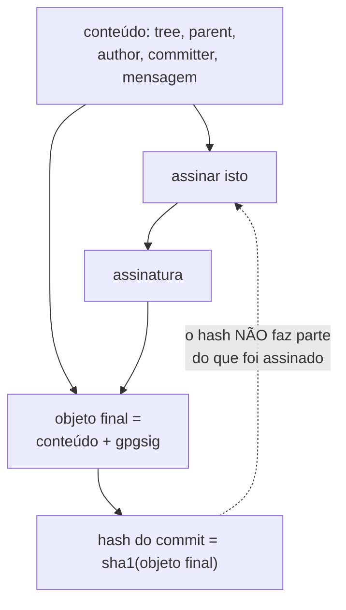

# 12 · Anatomia de um commit assinado

> Nível: intermediário · Atualizado em 13/08/2026 · **Todas as saídas foram executadas**

Sem caixa-preta: vamos abrir um commit, achar a assinatura, reconstruir exatamente o que foi
assinado, e verificá-la à mão, sem o Git. No fim disso, três coisas que pareciam mágicas
ficam óbvias: por que a assinatura muda o hash, por que o rebase "apaga" assinaturas, e por
que o campo se chama `gpgsig` mesmo quando é SSH.

---

## 1. O que é um commit, de verdade

Um commit não é um *diff*. É um pequeno arquivo de texto — um **objeto** — com quatro ou
cinco campos e a mensagem.

```bash
git cat-file commit HEAD
```

```
tree bddc0e5ccc2c058f14228a6ddf6cfb0f40cd5da8
author Ana Souza <ana@exemplo.dev> 1786635566 -0300
committer Ana Souza <ana@exemplo.dev> 1786635566 -0300

commit assinado com SSH
```

| Campo | O que é |
|---|---|
| `tree` | hash do estado completo dos arquivos naquele momento |
| `parent` | hash do commit anterior (ausente no primeiro; **dois ou mais** num merge) |
| `author` | quem escreveu a mudança, e quando |
| `committer` | quem a aplicou, e quando (difere do autor em rebase, cherry-pick, patch por e-mail) |
| *(linha em branco)* | separa cabeçalhos da mensagem |
| mensagem | texto livre |

E o **hash do commit** — o `SHA` que você usa o dia todo — é simplesmente:

```
sha1( "commit " + tamanho_em_bytes + "\0" + esse_texto_todo )
```

Confira você mesmo:

```bash
git cat-file commit HEAD | git hash-object -t commit --stdin
# devolve exatamente o mesmo hash de: git rev-parse HEAD
```

**Consequência imediata:** o hash é função de *todo* o conteúdo. Muda a mensagem, muda o
hash. Muda o autor, muda o hash. Muda a data por um segundo, muda o hash. Guarde isso.

---

## 2. Onde a assinatura entra

Agora o mesmo commit, assinado:

```bash
git cat-file commit HEAD
```

```
tree bddc0e5ccc2c058f14228a6ddf6cfb0f40cd5da8
author Ana Souza <ana@exemplo.dev> 1786635566 -0300
committer Ana Souza <ana@exemplo.dev> 1786635566 -0300
gpgsig -----BEGIN SSH SIGNATURE-----
 U1NIU0lHAAAAAQAAADMAAAALc3NoLWVkMjU1MTkAAAAgpm8kBRPbrT7WZq5T9HNpZRWzzg
 cnDmpIclQYQBQvOrgAAAADZ2l0AAAAAAAAAAZzaGE1MTIAAABTAAAAC3NzaC1lZDI1NTE5
 AAAAQMyiOrk7vqSPD2RhaYPU2v3sDHHu3XdQmad9UVCynREDmjDutIyiRAWxh4WwmHX7uy
 V6viAl/Lr39sTk9ipPoAU=
 -----END SSH SIGNATURE-----

commit assinado com SSH
```

A assinatura é **mais um cabeçalho**, chamado `gpgsig`, colocado depois de `committer`. As
linhas seguintes começam com **um espaço** — é a convenção de continuação de cabeçalho,
herdada do formato de e-mail (RFC 5322).

O mesmo commit, se fosse GPG (saída real do laboratório):

```
gpgsig -----BEGIN PGP SIGNATURE-----
 
 iHUEABYIAB0WIQQSNoILxSG465098sRp2H6sHAJiUwUCan3ihwAKCRBp2H6sHAJi
 Ux87AP9CdmXwk2IBQ5zOYZ/XZWEjCYUhOeoaBoP5tRI5+f4NqgD+Mc39v8ga+Qd0
 zIg35GFT+rsFtXP1Kt0dHBf0yQVBaQ4=
 =Fxet
 -----END PGP SIGNATURE-----
```

Mesmo campo, conteúdo diferente. O nome `gpgsig` ficou por compatibilidade: ele existe desde
o Git 1.7.9 (2012), quando GPG era a única opção, e renomeá-lo quebraria todo repositório já
assinado.

> Curiosidade útil para depurar: na assinatura PGP há uma **linha em branco** logo após o
> `BEGIN` (o cabeçalho vazio do formato *armor*), representada por um espaço solitário no
> objeto. Na SSH, não. Se você for manipular esses blocos com script, é a diferença que faz o
> seu `sed` falhar.

---

## 3. O que exatamente é assinado — demonstrado

Aqui está o ponto que quase nenhuma explicação cobre. A assinatura não pode incluir a si
mesma. Então **o que se assina é o objeto commit com o campo `gpgsig` inteiramente
removido** — cabeçalho e linhas de continuação.

Vamos provar, sem usar o Git para verificar:

```bash
SHA=$(git rev-parse HEAD)

# 1. extrair a assinatura
git cat-file commit "$SHA" \
  | sed -n '/BEGIN SSH SIGNATURE/,/END SSH SIGNATURE/p' \
  | sed 's/^gpgsig //; s/^ //' > /tmp/p.sig

# 2. reconstruir o payload: o objeto SEM o campo gpgsig
git cat-file commit "$SHA" | awk '
  /^gpgsig / {ingpg=1; next}     # descarta a linha do cabeçalho
  ingpg && /^ / {next}           # descarta as linhas de continuação
  {ingpg=0; print}
' > /tmp/p.txt

cat /tmp/p.txt
```

```
tree bddc0e5ccc2c058f14228a6ddf6cfb0f40cd5da8
author Ana Souza <ana@exemplo.dev> 1786635566 -0300
committer Ana Souza <ana@exemplo.dev> 1786635566 -0300

commit assinado com SSH
```

```bash
# 3. verificar com o ssh-keygen puro — o Git não participa disso
ssh-keygen -Y verify -f ~/.config/git/allowed_signers \
           -I ana@exemplo.dev -n git -s /tmp/p.sig < /tmp/p.txt
```

```
Good "git" signature for ana@exemplo.dev with ED25519 key SHA256:LVyS2nxFh6C4ukcqw8L4v0vI7Zhlo0ncpnOxA2o/OdE
```

**Executado, e confere.** O que a assinatura cobre, então:

| Coberto pela assinatura | **Não** coberto |
|---|---|
| o `tree` (logo, todo o conteúdo dos arquivos) | o hash do próprio commit |
| o(s) `parent` (logo, todo o histórico anterior) | as tags que apontam para ele |
| autor, committer e as duas datas | os *notes* do Git |
| a mensagem inteira | qualquer coisa fora do objeto |

Repare que assinar um commit assina, transitivamente, **todo o histórico até a raiz** — porque
o campo `parent` está incluído, e o pai contém o hash do avô, e assim por diante. Uma
assinatura na ponta é uma afirmação sobre a cadeia inteira.

Essa propriedade é o que torna útil o `merge.verifySignatures`, que só olha a ponta: a ponta
já compromete o resto. Com uma ressalva importante — ela compromete o *conteúdo* do histórico,
não as *assinaturas* dele. Um commit assinado pode perfeitamente ter pais não assinados.

---

## 4. Por que a assinatura muda o hash do commit

Consequência direta de tudo acima:

```
hash = sha1("commit " + tamanho + "\0" + objeto_INTEIRO)
                                          └── inclui o campo gpgsig
```

Então:

```
commit sem assinar   → hash A
o "mesmo" commit assinado → hash B ≠ A
```

Não é o mesmo commit com um adorno. É **outro objeto**. É por isso que `git commit --amend -S`
produz um hash diferente, e por isso que não existe "assinar depois sem mexer em nada".



---

## 5. Por que rebase, squash e cherry-pick "apagam" assinaturas

Eles não apagam nada. Eles **criam commits novos**.

| Operação | O que acontece com o objeto |
|---|---|
| `rebase` | muda o `parent` → objeto novo → hash novo → assinatura antiga não serve |
| `cherry-pick` | muda `parent` e `committer` → objeto novo |
| `squash` | funde vários objetos em um → objeto novo |
| `commit --amend` | reescreve o objeto → hash novo |
| `filter-repo` / `filter-branch` | reescreve em massa → tudo novo |

O commit original assinado continua existindo e continua válido — ele só deixou de estar no
ramo. O que você vê como "perdeu a assinatura" é, na verdade, "foi substituído por outro
objeto que ninguém assinou".

**O Git re-assina sozinho?** Sim, se você mandar. Verificado no teste, com
`commit.gpgsign=true` configurado no repositório:

```
antes do rebase:  aee16c5 [G] commit assinado que sera rebaseado
depois do rebase: 6615316 [G] commit assinado que sera rebaseado
                  └── hash diferente, assinatura nova, feita agora por você
```

Repare no que isso significa: as assinaturas resultantes são **suas**, com a data de *agora*.
Se você rebaseia commits de outra pessoa e re-assina, você está afirmando autoria criptográfica
sobre o trabalho dela. Tecnicamente correto (você é o `committer`), e eticamente vale saber
que é isso que está acontecendo.

**E no GitHub?** O botão *Rebase and merge* e o *Squash and merge* criam commits **no
servidor**, e o servidor não tem a sua chave privada. Resultado: commits sem assinatura.

| Botão do GitHub | Assinatura do resultado |
|---|---|
| **Create a merge commit** | assinado **pelo GitHub** (chave `web-flow`) → `Verified` |
| **Squash and merge** | assinado pelo GitHub → `Verified`, mas o autor original perde a dele |
| **Rebase and merge** | **sem assinatura** — o GitHub não consegue assinar aqui |

Se o repositório tiver ruleset exigindo assinatura, *Rebase and merge* simplesmente falha.
É a interação que mais surpreende equipes, e está detalhada em
[18-politica-de-equipe.md](18-politica-de-equipe.md).

---

## 6. Tags: um objeto diferente

Tag anotada é **outro tipo de objeto**, com sua própria assinatura — e nela a assinatura não
é um cabeçalho, vai no fim, depois da mensagem:

```bash
git cat-file tag v1.0.0
```

```
object 6dda04cf337b91b9660a32e3fb736026a0cf08d2
type commit
tag v1.0.0
tagger Ana Souza <ana@exemplo.dev> 1786635567 -0300

release 1.0.0
-----BEGIN SSH SIGNATURE-----
U1NIU0lHAAAAAQAAADMAAAALc3NoLWVkMjU1MTkAAAAgpm8kBRPbrT7WZq5T9HNpZRWzzg
...
-----END SSH SIGNATURE-----
```

Note que **as linhas não são recuadas** aqui, ao contrário do commit. Dois formatos, dois
parsers, e é a razão de tantos scripts caseiros de auditoria funcionarem para commits e
falharem para tags.

Tag **leve** (`git tag v1.0.0`, sem `-a` nem `-m`) não é objeto nenhum: é só um ponteiro num
arquivo. Não tem como assinar, não tem autor, não tem data. Se a sua release usa tag leve, ela
não tem procedência nenhuma — e isso é mais comum do que deveria.

---

## 7. Como o Git decide o que fazer

Ao commitar:

```
commit.gpgsign=true  ou  -S ?
        │ sim
        ▼
gpg.format = ssh ?  ──── sim ──▶ chama `ssh-keygen -Y sign -n git`
        │ não                    com a chave de user.signingkey
        ▼
chama `gpg --status-fd=2 -bsau <user.signingkey>`
        │
        ▼
insere a saída como cabeçalho gpgsig, e só então calcula o hash
```

Ao verificar:

```
o objeto tem gpgsig ?  ── não ──▶ %G? = N
        │ sim
        ▼
é PGP ou SSH ?
   │              │
   PGP            SSH
   │              │
   gpg --verify   ssh-keygen -Y find-principals  (quem é o dono desta chave?)
   │                      │
   │              achou?  ├─ não ──▶ %G? = U
   │                      └─ sim ──▶ ssh-keygen -Y verify ──▶ %G? = G ou B
   ▼
%G? = G / B / U / X / Y / R / E
```

Você pode ver a chamada real, se estiver curioso:

```bash
GIT_TRACE=1 git commit --allow-empty -m teste 2>&1 | grep -i 'ssh-keygen\|gpg'
```

---

## 8. Uma última demonstração: forjar e ser pego

O ato 8 do [projeto-modelo](07-projeto-modelo/) faz exatamente isto — reescreve o objeto à
mão, mantendo a assinatura:

```bash
git cat-file commit "$ALVO" > original.txt
sed 's/commit assinado com SSH/commit adulterado por terceiro/' original.txt > adulterado.txt
FALSO=$(git hash-object -t commit -w --stdin < adulterado.txt)
git verify-commit "$FALSO"
```

```
# saída real:
Could not verify signature.
Signature verification failed: incorrect signature
→ status [B]
```

O objeto forjado **existe** dentro do repositório: o Git aceita gravá-lo, porque `hash-object`
não julga conteúdo. O que ele não consegue é fazer a assinatura fechar. Isso é o mecanismo
inteiro, em cinco linhas de shell.

---

## Autoteste

1. Quais são os campos de um objeto commit, e qual deles amarra o histórico anterior?
2. O que exatamente é assinado num commit? Descreva o payload com precisão.
3. Por que a assinatura não pode incluir o hash do próprio commit?
4. Por que o rebase produz commits sem a assinatura original?
5. Assinar a ponta de um ramo diz alguma coisa sobre os commits anteriores? O quê, exatamente?
6. Qual botão de merge do GitHub produz commit sem assinatura, e por quê?
7. Qual a diferença de formato entre a assinatura numa tag e num commit?
8. Você pode assinar uma tag leve?

*(Respostas: 1 — `tree`, `parent`, `author`, `committer`, mensagem; o `parent`. 2 — o objeto
commit inteiro com o cabeçalho `gpgsig` e suas linhas de continuação removidos. 3 — o hash é
calculado sobre o objeto já contendo a assinatura; incluí-lo seria circular. 4 — rebase muda o
`parent`, criando objetos novos; os originais continuam válidos, só saíram do ramo. 5 — sim:
o `parent` está no payload assinado, então o conteúdo de todo o histórico está coberto — mas
não as assinaturas dele. 6 — *Rebase and merge*; o servidor cria commits novos e não tem sua
chave privada. 7 — na tag a assinatura vai no fim, sem recuo; no commit é um cabeçalho com
linhas recuadas por um espaço. 8 — não; tag leve não é um objeto, é só um ponteiro.)*

---

**Próximo:** [13-gpg-a-fundo.md](13-gpg-a-fundo.md).
