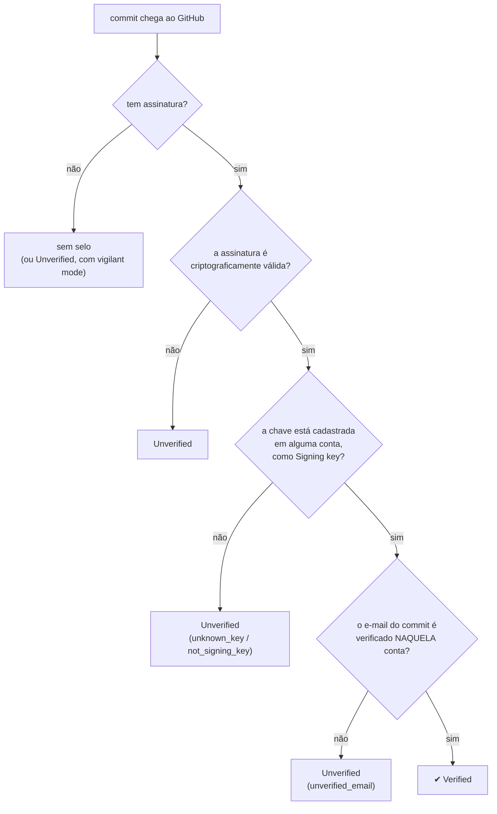

# 15 · Como o GitHub verifica — e o que o selo realmente diz

> Nível: intermediário · Atualizado em 13/08/2026 · Fontes: docs.github.com consultada em
> 13/08/2026

O selo `Verified` é o objetivo prático de quase todo mundo que chega a este assunto. Este
arquivo explica exatamente o que ele significa, como o GitHub chega a ele, e os quatro
comportamentos que surpreendem.

---

## 1. A pergunta que o GitHub responde

A verificação local responde: *"esta chave está na minha lista?"*
O GitHub responde outra, e é a que interessa:

> **A chave que assinou este commit está cadastrada em alguma conta, e o e-mail do commit é
> um e-mail verificado dessa mesma conta?**

Três condições, todas obrigatórias:



**Onde quase todo mundo tropeça:** os dois losangos de baixo. A criptografia quase nunca é o
problema; o cadastro e o e-mail, quase sempre.

---

## 2. Os estados

### Sem *vigilant mode* (padrão)

| Estado | Quando |
|---|---|
| **Verified** | assinado, válido, chave conhecida, e-mail verificado |
| **Unverified** | assinado, mas alguma condição falhou |
| *(nenhum selo)* | não assinado |

### Com *vigilant mode* ligado

| Estado | Quando |
|---|---|
| **Verified** | como acima, e o committer tem vigilant mode |
| **Partially verified** | assinado e válido, mas o **autor** é outra pessoa, que tem vigilant mode — logo, não se pode afirmar que ela consentiu |
| **Unverified** | **inclusive commits não assinados** |

Liga-se em <https://github.com/settings/keys>, em *Vigilant mode* → *Flag unsigned commits as
unverified*.

**Vale a pena?** Sim, com uma condição séria: só ligue se você assina **tudo**, sempre. A
partir do momento em que liga, qualquer commit não assinado seu — inclusive os que você fizer
de outra máquina, ou por uma ferramenta que não passa pela sua configuração — aparece como
`Unverified` publicamente. É esse o objetivo: transformar a ausência de assinatura em um
sinal, em vez de silêncio.

O que ele **não** faz: rejeitar nada. Vigilant mode é sinalização, não trava. A trava é o
ruleset ([18](18-politica-de-equipe.md)).

---

## 3. O comportamento que mais surpreende: a verificação é congelada

> "Uma vez verificada, a assinatura de um commit permanece verificada indefinidamente dentro
> da rede daquele repositório, mesmo que a chave seja depois revogada ou expirada."
> — GitHub Docs, consultada em 13/08/2026

O GitHub grava o resultado (e um `verified_at`) no momento em que verifica. Depois disso:

| Você faz | Commits antigos |
|---|---|
| deixa a chave expirar | continuam `Verified` |
| revoga a chave GPG | continuam `Verified` |
| **remove a chave da conta** | continuam `Verified` |
| apaga a conta | — |

**Isso é bom ou ruim?** Depende de qual pergunta você acha que o selo responde.

- Como *registro histórico*, faz sentido: em janeiro de 2024 aquela chave era válida e era
  sua; revogá-la em 2026 não muda o que aconteceu em 2024.
- Como *garantia atual*, é enganoso: se a sua chave foi roubada em 2024 e você só descobriu
  em 2026, todos os commits que o atacante assinou entre as duas datas continuam com selo
  verde, para sempre, e **não há como marcá-los**.

Essa é, na minha opinião profissional, a limitação mais séria do modelo do GitHub — e a que
mais raramente aparece em material introdutório. Sistemas com log de transparência (Sigstore
e o Rekor) atacam justamente isso, ao registrar *quando* cada assinatura foi feita de forma
que ninguém possa reescrever depois ([60](60-teoria-avancada.md)).

Efeito colateral prático e útil: **você pode migrar de GPG para SSH sem perder nada**, e não
precisa manter chave velha por medo de "desverificar" o passado no site. (Precisa mantê-la
para quem verifica **localmente** — veja [13 § 7](13-gpg-a-fundo.md).)

---

## 4. Os commits que o próprio GitHub assina

Quando a operação acontece no servidor, é ele quem assina, com a chave da conta
`web-flow <noreply@github.com>`:

| Operação | Assinado pelo GitHub? |
|---|---|
| editar arquivo pela interface web | **sim** |
| aceitar sugestão em revisão de código | **sim** |
| **Create a merge commit** | **sim** |
| **Squash and merge** | **sim** |
| **Rebase and merge** | **não** — ele não consegue assinar aqui |
| commit criado pela API REST/GraphQL | **sim** |
| commit pelo Codespaces (com *GPG verification* ligado) | **sim** |
| `git push` da sua máquina | **não** — é você que assina |

Você pode conferir a chave pública dele:

```bash
curl -s https://api.github.com/users/web-flow/gpg_keys | head -20
```

**O que esse selo significa, exatamente.** Que o GitHub afirma que aquela operação foi feita
por alguém autenticado na plataforma. É uma afirmação diferente da de um commit que **você**
assinou: ali, a prova é de posse da sua chave privada; aqui, a prova é de que o GitHub diz que
foi você. Se o seu modelo de ameaça inclui "a conta foi tomada", os dois selos verdes têm
valores bem diferentes — o commit assinado pela sua chave exige, além da conta, a chave.

**Nota importante para quem usa a API com bot:** commits feitos pela API são assinados pelo
GitHub e passam `Verified` mesmo num repositório com ruleset exigindo assinatura. É a
maneira mais simples de fazer um bot conviver com a exigência ([17](17-automacao-e-ci.md)).

---

## 5. Consultar o veredito por API

Fonte autoritativa — é o que o site exibe:

```bash
gh api repos/{owner}/{repo}/commits/{sha} --jq '.commit.verification'
```

```json
{
  "verified": true,
  "reason": "valid",
  "signature": "-----BEGIN SSH SIGNATURE-----\n...",
  "payload": "tree bddc0e...\nauthor Ana Souza <ana@exemplo.dev> ...",
  "verified_at": "2026-08-13T15:28:07Z"
}
```

Repare no campo `payload`: é **exatamente** o objeto commit sem o `gpgsig`, como reconstruímos
à mão em [12-anatomia-do-commit.md](12-anatomia-do-commit.md). Dá para pegar `signature` e
`payload` da API e verificar por conta própria, sem confiar no veredito `verified` — o que é
uma forma barata de reduzir a dependência da plataforma.

### Tabela de `reason`

| `reason` | Significa | Correção |
|---|---|---|
| `valid` | tudo certo | — |
| `unsigned` | não há assinatura | ligue `commit.gpgsign` **no repositório certo** |
| `unknown_key` | chave não cadastrada em conta nenhuma | cadastre |
| `not_signing_key` | cadastrada, mas como *authentication* | recadastre como **Signing Key** |
| `unverified_email` | e-mail do commit não verificado naquela conta | verifique em `settings/emails` |
| `bad_email` | o e-mail da chave GPG não bate com o do commit | `gpg --quick-add-uid` |
| `expired_key` | a chave estava vencida ao assinar | renove e re-assine |
| `unknown_signature_type` | formato não suportado (gitsign/Sigstore) | ver [65](65-estado-da-arte.md) |
| `malformed_signature` | assinatura corrompida | re-assine |
| `invalid` | a assinatura não confere com o conteúdo | investigue: isto não acontece por acaso |
| `gpgverify_error` / `gpgverify_unavailable` | falha do lado do GitHub | tente de novo mais tarde |
| `ocsp_*` | problemas de certificado S/MIME | contexto corporativo |

Auditar um PR inteiro:

```bash
gh api repos/{owner}/{repo}/pulls/{n}/commits --paginate \
   --jq '.[] | [.sha[0:9], .commit.verification.verified, .commit.verification.reason] | @tsv'
```

---

## 6. Os quatro pontos cegos do selo

Vale ter isso na ponta da língua antes de apresentar assinatura como controle de segurança a
alguém.

**1. O selo é sobre a chave, não sobre a pessoa.** Se a máquina de alguém for comprometida e a
chave usada, o commit sai `Verified`. Foi o caso do **xz-utils**: os commits do backdoor
estavam legitimamente assinados ([11](11-historia.md)).

**2. O selo é congelado no tempo.** Revogação não retroage (§ 3).

**3. O selo não diz nada sobre o conteúdo.** Nem revisão, nem testes, nem intenção.

**4. O selo depende do GitHub.** Ele é a autoridade certificadora de fato
([10 § 4](10-fundamentos.md)). Se a plataforma errar, for comprometida ou for compelida, o
selo acompanha. A defesa parcial é verificar localmente com `allowed_signers`, o que troca a
confiança no GitHub pela confiança no **seu** arquivo — e alguém precisou montá-lo de alguma
fonte.

---

## 7. Outras plataformas, em uma tabela

Só para situar; este curso é sobre GitHub.

| Plataforma | GPG | SSH | Observação |
|---|---|---|---|
| **GitHub** | sim | sim (desde 23/08/2022) | S/MIME também; gitsign não |
| **GitLab** | sim | sim | também suporta X.509; regras por *push rules* |
| **Bitbucket Cloud** | limitado | limitado | historicamente atrás dos outros dois |
| **Gitea / Forgejo** | sim | sim | permite ao servidor assinar merges com chave própria |
| **Azure DevOps** | parcial | — | verificação de assinatura é fraca |

---

## Autoteste

1. Enuncie as três condições para um commit ficar `Verified`.
2. Qual das três costuma falhar na prática?
3. Você revoga sua chave hoje. O que acontece com os commits assinados por ela no ano passado?
4. Por que isso é bom como registro histórico e ruim como garantia atual?
5. Qual botão de merge do GitHub produz commit **sem** assinatura?
6. Qual é a diferença de valor entre um commit assinado pela chave `web-flow` e um assinado
   pela sua?
7. Que campo da API permite verificar a assinatura por conta própria, sem confiar no
   `verified`?
8. Cite os quatro pontos cegos do selo.

*(Respostas: 1 — assinatura criptograficamente válida; chave cadastrada em uma conta como
*signing key*; e-mail do commit verificado naquela conta. 2 — as duas últimas: chave na lista
errada e e-mail não verificado. 3 — continuam `Verified`, para sempre. 4 — como registro,
reflete o que era verdade na época; como garantia, esconde commits feitos com chave roubada
antes da descoberta. 5 — *Rebase and merge*. 6 — o `web-flow` prova que o GitHub afirma que
foi você; o seu prova posse da sua chave privada, que a tomada de conta sozinha não dá.
7 — `payload` (com `signature`). 8 — é sobre a chave e não a pessoa; é congelado no tempo; não
diz nada sobre o conteúdo; depende da confiança no GitHub.)*

---

**Fontes:** docs.github.com — *About commit signature verification*, *Displaying verification
statuses for all of your commits*, *Telling Git about your signing key*; changelog do GitHub
de 23/08/2022 (*SSH commit verification now supported*). Consultadas em 13/08/2026.

**Próximo:** [16-hardware-e-agentes.md](16-hardware-e-agentes.md).
