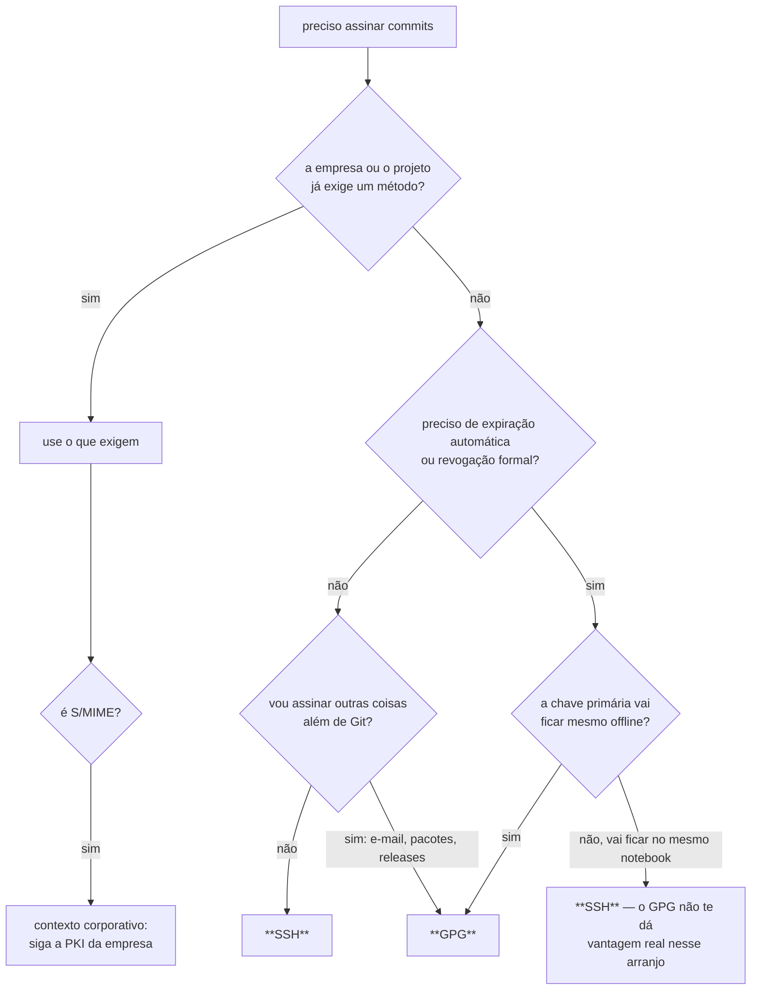

# 19 · Como escolher — SSH, GPG, S/MIME ou nada

> Nível: intermediário · Atualizado em 13/08/2026
> Este arquivo contém **opinião profissional explícita**, marcada como tal.

---

## 1. A primeira pergunta: assinar vale a pena para você?

Antes de escolher o método, vale checar se o problema é seu. Assinatura serve para:

| Você tem este problema | Assinar ajuda? |
|---|---|
| precisa provar autoria em auditoria, incidente ou disputa | **sim, muito** |
| publica software que outras pessoas instalam | **sim** |
| trabalha em repositório com várias pessoas com acesso de escrita | **sim** |
| tem exigência de conformidade (fornecedor de governo, setor regulado) | **sim** |
| quer o selinho verde no perfil | sim, e é um motivo legítimo — visibilidade cria adoção |
| quer impedir que entre código ruim | **não** — isso é revisão e teste |
| quer proteger contra a plataforma (GitHub) | parcialmente, e só com verificação local |
| repositório pessoal, você sozinho, código que ninguém instala | **pouco**; faça mesmo assim, custa 10 minutos e vira hábito |

O único caso em que eu desaconselharia é quando a implantação atrapalharia mais do que
ajuda — equipe em crise, prazo apertado, ferramenta legada que não assina. Aí adie e agende.

---

## 2. A árvore de decisão

O ramo do meio é o que costuma ser mal resolvido. O argumento "GPG é melhor porque tem
subchaves" só vale se a **primária ficar offline de verdade** — é isso que permite trocar
material criptográfico sem trocar identidade. Se ela mora no mesmo `~/.gnupg` do notebook,
você tem toda a complexidade do OpenPGP e nenhuma das vantagens.

---

## 3. Comparação por dimensão

| Dimensão | SSH | GPG | S/MIME |
|---|---|---|---|
| tempo até funcionar | 10 min | 30–60 min | depende do TI |
| peças a manter | 1 | 4 (chave, agente, pinentry, validade) | PKI da empresa |
| expiração nativa | não | **sim** | sim (certificado) |
| revogação | KRL, marginal | **certificado padronizado** | CRL/OCSP |
| rotação sem trocar identidade | não | **sim** (subchaves) | sim (renovar certificado) |
| identidade atestada por | GitHub | GitHub (ou rede de confiança, morta) | **autoridade certificadora** |
| serve fora do Git | pouco | **muito** | e-mail corporativo |
| hardware | FIDO2 | cartão OpenPGP | cartão corporativo |
| suporte no GitHub | sim | sim | sim |
| custo de onboarding numa equipe | **baixo** | alto | depende do TI |
| chance de a pessoa desistir no meio | baixa | **considerável** | — |

Essa última linha não é piada. Em implantação de equipe, o método que a maioria conclui vence
o método que é melhor no papel. É a lição que a história deste assunto já ensinou uma vez
([11-historia.md](11-historia.md)).

---

## 4. Minha recomendação, por perfil

> **As recomendações abaixo são opinião profissional**, formada pelo que costuma dar certo,
> e não consenso da indústria. Os fatos que as sustentam estão nos arquivos referenciados.

**Desenvolvedor individual, projetos próprios** → **SSH**.
Chave nova só para assinar, frase secreta, `ssh-agent -t 8h`, `allowed_signers` local. Vinte
minutos, uma vez.

**Equipe de produto (5 a 50 pessoas)** → **SSH**, com ruleset e verificação na CI.
O custo marginal de GPG aqui é altíssimo e o benefício não aparece: a identidade é atestada
pelo GitHub nos dois casos, e a revogação prática é "remover a chave da conta", que os dois
têm.

**Mantenedor de software que outros instalam** → **GPG**, com primária offline e subchave em
token; **e** tags assinadas; **e** assinatura dos artefatos com `cosign` ou proveniência.
Aqui o público de verificadores é grande e disperso, e trocar identidade custa caro. É o caso
em que subchave ganha de verdade.

**Empresa regulada, com PKI existente** → **S/MIME**, se o TI já opera certificados.
Não construa uma segunda infraestrutura de chaves ao lado da que já existe.

**Automação e CI** → **API do GitHub** sempre que possível; chave dedicada quando o pipeline
roda fora ([17](17-automacao-e-ci.md)). `gitsign` é o desenho certo e ainda não passa no selo.

**Organização com centenas de pessoas** → SSH com **certificado emitido por CA interna**
([14 § 4](14-ssh-signing-a-fundo.md)), quando manter a lista de chaves passar a custar mais
do que operar a CA.

---

## 5. Erros de escolha que eu vejo com frequência

**"Vamos de GPG porque é mais seguro."** A criptografia é equivalente — Ed25519 dos dois
lados. O que difere é o modelo de *gestão* de chave. Se você não vai usar subchaves nem
manter a primária offline, "mais seguro" aqui é só "mais complicado".

**"Vamos exigir assinatura, mas sem ruleset, na base do combinado."** Combinado não é
controle. Ou você liga a trava, ou está fazendo documentação, não segurança.

**"Vamos de `gitsign` porque é o futuro."** Provavelmente é. Mas em 13/08/2026 ele não passa
no ruleset do GitHub, e essa é a única coisa que interessa hoje. Adote quando o obstáculo cair
— e o obstáculo está de pé desde 2022.

**"Assinatura resolve nossa segurança de cadeia de suprimentos."** Não resolve. Resolve
atribuição. Foi o que o xz-utils demonstrou de forma dolorosa: commits legitimamente assinados,
backdoor entregue.

**"Cada um usa o que quiser."** Funciona tecnicamente (o GitHub aceita todos), e custa caro em
suporte: o time de plataforma passa a manter quatro fluxos de diagnóstico. Escolha um padrão
e aceite exceções justificadas.

---

## 6. Migrar depois é barato

Nada aqui é irreversível, e isso deve reduzir o peso da decisão:

| De → Para | Custo | O que fazer |
|---|---|---|
| SSH → GPG | baixo | gere a chave GPG, cadastre, mude `gpg.format`; ponha `valid-before` na chave SSH do `allowed_signers` |
| GPG → SSH | baixo | o inverso; **não revogue nem remova a chave GPG** ([13 § 7](13-gpg-a-fundo.md)) |
| software → hardware | médio | gere no token, cadastre, aposente a antiga por data |
| um método → dois em paralelo | baixo | o GitHub aceita várias chaves de tipos diferentes na mesma conta |

O passado permanece verificado no GitHub em qualquer um desses caminhos, porque o veredito é
congelado no momento da verificação ([15 § 3](15-verificacao-no-github.md)).

---

## Autoteste

1. Em que caso assinar commits **não** ajuda?
2. Qual é a única condição em que subchaves GPG dão vantagem real?
3. Por que "o método que a maioria conclui" é um critério legítimo de escolha?
4. Qual perfil justifica GPG com primária offline?
5. Por que `gitsign` não é recomendável hoje, apesar do desenho superior?
6. Migrar de GPG para SSH invalida os commits antigos no GitHub?
7. Qual é o erro na frase "vamos exigir assinatura na base do combinado"?

*(Respostas: 1 — contra código ruim ou malicioso; isso é revisão e teste. 2 — quando a chave
primária fica realmente offline, permitindo trocar subchave sem trocar identidade. 3 —
porque um controle parcialmente adotado protege menos que um controle simples adotado por
todos. 4 — mantenedor de software que terceiros instalam, com muitos verificadores dispersos.
5 — o GitHub não reconhece a raiz do Sigstore e devolve `unknown_signature_type`, reprovando
no ruleset. 6 — não; o veredito é congelado. Mas quem verifica **localmente** ainda precisa da
chave pública GPG. 7 — combinado não é controle; sem ruleset é documentação, não segurança.)*

---

**Próximo:** [60-teoria-avancada.md](60-teoria-avancada.md).
