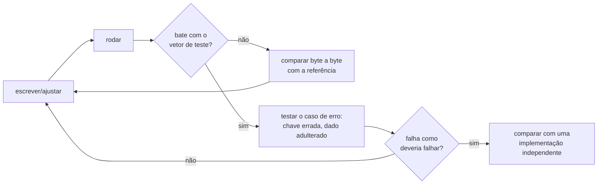

# 04 · Como começar: do ambiente pronto ao primeiro resultado

**Nível:** iniciante · **Última atualização:** 19/08/2026
**Pré-requisito:** [03-instalacao.md](03-instalacao.md) concluído, checklist verde.

Em 20 minutos você vai ter: gerado aleatoriedade de verdade, calculado um
hash, criado um par de chaves, assinado um documento, visto uma assinatura
falhar, cifrado um arquivo e espiado o TLS de um site real.

Todas as saídas mostradas abaixo foram **executadas de fato** em 19/08/2026
numa máquina Ubuntu 22.04.5 com OpenSSL 3.0.2 e age v1.3.1. Suas saídas com
valores aleatórios serão diferentes das minhas — e é exatamente isso que se
espera.

---

## Passo 0 · Uma pasta de trabalho

```bash
mkdir -p ~/lab-cripto && cd ~/lab-cripto
```

---

## Passo 1 · Aleatoriedade (a base de tudo)

Toda chave começa como bytes aleatórios. Se essa parte falhar, nada acima
adianta — e ela já falhou em produção mais de uma vez, com consequências
grandes (ver [16-aleatoriedade.md](16-aleatoriedade.md)).

```bash
openssl rand -hex 16
```

Saída real:

```
905176b75e18fc9f008a9141ba3fdaac
```

**Verificação:** rode o comando três vezes. Os três resultados devem ser
completamente diferentes. Se dois forem iguais, pare tudo — sua máquina tem um
problema grave de entropia.

Em Python, o equivalente correto:

```bash
python3 -c "import secrets; print(secrets.token_hex(16))"
```

> Use `secrets`, nunca `random`. O módulo `random` é um Mersenne Twister:
> quem observa 624 saídas reconstrói o estado interno e prevê todas as
> próximas. Ele é ótimo para simulação e péssimo para segredo.

---

## Passo 2 · Hash: a impressão digital

```bash
echo -n "criptografia" | sha256sum
```

Saída real:

```
d93449f3e5b4bc1fb096a29c2fe7cb71b2694f1436f738741c35950fdb36fbaf  -
```

**Verificação:** o resultado é o mesmo na minha máquina e na sua. Confira
caractere por caractere — se diferir, você provavelmente esqueceu o `-n` do
`echo`, que evita acrescentar uma quebra de linha. Um único byte a mais muda
o hash inteiro.

Veja o efeito avalanche:

```bash
echo -n "criptografia" | sha256sum
echo -n "criptografiA" | sha256sum
```

Compare as duas saídas: nenhuma semelhança residual, embora as entradas
difiram em um bit de uma letra.

---

## Passo 3 · Um par de chaves em dois comandos

Vamos usar **Ed25519**, o padrão recomendado para assinaturas em 2026: chaves
de 32 bytes, assinaturas de 64 bytes, rápido e sem os parâmetros perigosos do
RSA.

```bash
openssl genpkey -algorithm ed25519 -out chave.pem
openssl pkey -in chave.pem -pubout -out publica.pem
cat publica.pem
```

Saída real (a sua será diferente — é uma chave nova):

```
-----BEGIN PUBLIC KEY-----
MCowBQYDK2VwAyEAj3JU3DTpiZ7KGLA4BRHzSERHFk6hMpl7/yFsXwEJeAM=
-----END PUBLIC KEY-----
```

Repare no tamanho: 44 caracteres em Base64, porque uma chave pública Ed25519
tem **32 bytes** mais um cabeçalho de identificação do algoritmo. Uma chave
pública RSA-3072, de segurança comparável, ocuparia mais de 600 caracteres.

**Proteja a chave privada imediatamente:**

```bash
chmod 600 chave.pem
ls -l chave.pem
# esperado: -rw------- 1 voce voce ... chave.pem
```

---

## Passo 4 · Assinar e verificar

```bash
echo "eu autorizo o pagamento de R\$ 100" > doc.txt
openssl pkeyutl -sign -inkey chave.pem -rawin -in doc.txt -out doc.sig
ls -l doc.sig
```

Saída real:

```
-rw-rw-r-- 1 ronivaldo ronivaldo 64 ago 19 14:24 doc.sig
```

64 bytes. Sempre 64 bytes, para qualquer tamanho de documento.

```bash
openssl pkeyutl -verify -pubin -inkey publica.pem -rawin -in doc.txt -sigfile doc.sig
```

Saída real:

```
Signature Verified Successfully
```

### Agora quebre de propósito

```bash
echo "eu autorizo o pagamento de R\$ 900" > doc2.txt
openssl pkeyutl -verify -pubin -inkey publica.pem -rawin -in doc2.txt -sigfile doc.sig
echo "código de saída: $?"
```

Saída real:

```
Signature Verification Failure
código de saída: 1
```

Você acabou de ver a integridade e a autenticidade funcionando. Trocar **um
dígito** invalida a assinatura, e o código de saída 1 permite que um script
detecte isso. Guarde esse detalhe: em automação, **verifique o código de
saída**; um script que ignora o retorno e segue em frente é o modo mais comum
de "ter assinatura" e não ter proteção nenhuma.

---

## Passo 5 · Cifrar um arquivo com `age`

O `age` é a ferramenta moderna para isso: sem opções perigosas, sem escolha de
algoritmo, sem jeito de configurar errado. Por dentro é exatamente o que o
[projeto-modelo](07-projeto-modelo/README.md) implementa —
X25519 + ChaCha20-Poly1305.

```bash
age-keygen -o minha.age
```

Saída real:

```
Public key: age1cscgpa9u4eafplfq6spcpa9l3avyv0r50uwt2ny63tcdkfvklcxq2rcvr7
```

E o arquivo gerado:

```
# created: 2026-08-19T14:24:56-03:00
# public key: age1cscgpa9u4eafplfq6spcpa9l3avyv0r50uwt2ny63tcdkfvklcxq2rcvr7
AGE-SECRET-KEY-1DQF2QT38EGFQAY89Z5AHTH9XZTYN4J6VM2T7PATUJAVYQM6EXVTSPXM4CQ
```

> Essa chave privada foi gerada só para esta demonstração e nunca protegeu
> nada. **A sua nunca deve aparecer em lugar nenhum** — nem em captura de
> tela, nem em repositório, nem em mensagem de suporte.

Cifre usando **a chave pública** (troque pela sua):

```bash
echo "conteudo secreto" > s.txt
age -r age1cscgpa9u4eafplfq6spcpa9l3avyv0r50uwt2ny63tcdkfvklcxq2rcvr7 -o s.age s.txt
ls -l s.txt s.age
```

Saída real:

```
-rw-rw-r-- 1 ronivaldo ronivaldo 217 ago 19 14:25 s.age
-rw-rw-r-- 1 ronivaldo ronivaldo  17 ago 19 14:25 s.txt
```

17 bytes viraram 217. Esse crescimento não é desperdício: são a chave pública
efêmera, a etiqueta de autenticação e o cabeçalho do formato. **Criptografia
autenticada sempre custa alguns bytes fixos** — quem promete "zero overhead"
está omitindo a autenticação.

Espie o começo do arquivo:

```bash
xxd s.age | head -3
```

Saída real:

```
00000000: 6167 652d 656e 6372 7970 7469 6f6e 2e6f  age-encryption.o
00000010: 7267 2f76 310a 2d3e 2058 3235 3531 3920  rg/v1.-> X25519
00000020: 4245 3450 7a66 5679 5547 7345 6471 4d4d  BE4PzfVyUGsEdqMM
```

O cabeçalho é texto legível: nome do formato, versão, e o tipo de destinatário.
Isso é intencional — **o formato não é o segredo, a chave é**
(Kerckhoffs, [01](01-introducao-leigo.md)). O que você não vê é o conteúdo.

Decifre:

```bash
age -d -i minha.age s.age
```

Saída real:

```
conteudo secreto
```

---

## Passo 6 · Espiar o TLS de um site de verdade

```bash
curl -v -o /dev/null https://www.cloudflare.com 2>&1 | grep -E "SSL connection using|subject:|issuer:|expire date"
```

Saída real, em 19/08/2026:

```
* SSL connection using TLSv1.3 / TLS_AES_256_GCM_SHA384
*  subject: CN=www.cloudflare.com
*  expire date: Nov 12 21:26:08 2026 GMT
*  issuer: C=US; O=Google Trust Services; CN=WE1
```

Quatro fatos numa linha e três:

- **TLSv1.3** — a versão atual do protocolo (RFC 8446, de 2018).
- **TLS_AES_256_GCM_SHA384** — a suíte simétrica que protege os dados: AES de
  256 bits no modo GCM (que cifra e autentica), com SHA-384 na derivação de
  chaves.
- **subject: CN=www.cloudflare.com** — para quem o certificado foi emitido.
  É a comparação desse campo (e das SANs) com o endereço digitado que impede o
  ataque de impostor.
- **issuer / expire date** — quem emitiu e até quando vale. Repare no prazo:
  poucos meses. Certificados de vida curta são a tendência forte de 2026 —
  ver [21-pki-e-certificados.md](21-pki-e-certificados.md).

Se o comando `openssl s_client -connect www.cloudflare.com:443` não funcionar
na sua rede, provavelmente há um proxy corporativo no caminho: o `s_client`
não fala HTTP CONNECT com autenticação, e o `curl` fala. Foi o caso na máquina
onde este material foi escrito.

---

## Passo 7 · O projeto-modelo

```bash
cd caminho/para/criptografia/07-projeto-modelo
python3 cofre.py autoteste
```

Saída real:

```
[ok ] RFC 8439 2.8.2 AEAD (etiqueta)
[ok ] RFC 8439 2.5.2 Poly1305
[ok ] RFC 7748 6.1 X25519 (segredo compartilhado)
[ok ] RFC 5869 A.1 HKDF-SHA256
autoteste: tudo certo
```

Isso conferiu, contra os vetores oficiais dos RFCs, uma implementação de
ChaCha20-Poly1305 e X25519 escrita em Python puro, que você pode ler linha a
linha. É o caminho mais curto entre "usar criptografia" e "entender
criptografia".

---

## O ciclo de trabalho do dia a dia



Três hábitos que esse ciclo codifica:

1. **Vetor de teste antes de qualquer coisa.** "Funcionou" não é evidência.
2. **Teste o caminho de falha.** Um sistema que aceita uma etiqueta inválida
   passa em todos os testes felizes e não protege nada.
3. **Compare com uma implementação independente.** O projeto-modelo tem um
   arquivo de testes só para isso — ele confere byte a byte contra o OpenSSL.

Para inspecionar bytes, três comandos que você usará o tempo todo:

```bash
xxd arquivo.bin | head            # hexadecimal + ASCII
base64 arquivo.bin | head -c 100  # forma transportável em texto
openssl asn1parse -in cert.pem    # estrutura interna de um certificado
```

---

## Os cinco erros que todo iniciante comete no uso

Estes são erros de **uso**, não de instalação (aqueles estão na tabela do
[03](03-instalacao.md#12-solução-de-problemas)).

### 1. Cifrar com a chave privada, ou assinar com a pública

Sintoma: `openssl: unable to load Public Key` ou uma mensagem sobre tipo de
chave. Regra que resolve para sempre:

| Operação | Usa | Motivo |
|---|---|---|
| Cifrar para alguém | a chave **pública** dele | qualquer um pode trancar |
| Decifrar | sua chave **privada** | só você abre |
| Assinar | sua chave **privada** | só você produz |
| Verificar | a chave **pública** de quem assinou | qualquer um confere |

### 2. Achar que Base64 esconde alguma coisa

```bash
echo "senha123" | base64        # c2VuaGExMjMK
echo "c2VuaGExMjMK" | base64 -d # senha123
```
Nenhuma chave envolvida. Base64 é transporte, não proteção. Isso vale também
para o *payload* de um JWT ([ver o curso de JWT](../jwt/00-MAPA.md)).

### 3. Perder a chave privada, ou publicá-la

Não existe "esqueci minha senha" em criptografia. Chave privada perdida =
dados perdidos, definitivamente. Chave privada publicada (no Git, num print,
num chat) = comprometida para sempre, mesmo que você apague o commit — porque
alguém já clonou. Bots varrem o GitHub em segundos procurando exatamente isso.

Antes de qualquer `git commit`:

```bash
git status
grep -rIl --exclude-dir=.git -e "PRIVATE KEY" -e "AGE-SECRET-KEY" . || echo "nenhuma chave no diretório"
```

### 4. Reutilizar nonce ou IV

O erro mais destrutivo e menos visível: o programa continua funcionando
perfeitamente. Com AES-GCM ou ChaCha20-Poly1305, repetir o par (chave, nonce)
não só vaza o XOR das mensagens como **permite forjar mensagens novas**.
Regra: nonce vem de `os.urandom` ou de um contador que nunca reinicia — nunca
de uma constante, nunca de um timestamp de segundos.

### 5. Comparar segredos com `==`

```python
if hmac_calculado == hmac_recebido:      # ERRADO: tempo variável
if hmac.compare_digest(a, b):            # certo: tempo constante
```
A comparação comum sai no primeiro byte diferente. Medindo esse tempo, um
atacante descobre a etiqueta byte a byte. Detalhes e a demonstração em
[25-canais-laterais-e-implementacao.md](25-canais-laterais-e-implementacao.md).

---

## Para onde ir agora

| Se você quer... | Vá para |
|---|---|
| Uma referência dos comandos que acabou de usar | [05-manual-de-uso.md](05-manual-de-uso.md) |
| Mais receitas prontas, das simples às de produção | [06-exemplos.md](06-exemplos.md) |
| Ler um sistema completo e pequeno, por dentro | [07-projeto-modelo/](07-projeto-modelo/README.md) |
| Entender o que está acontecendo por baixo | [10-fundamentos.md](10-fundamentos.md) |
| Praticar com exercícios progressivos | [70-pratica.md](70-pratica.md) |

---

## Autoteste

1. Por que `echo -n` importa ao calcular um hash de teste?
2. Quantos bytes tem uma assinatura Ed25519? Isso muda com o tamanho do
   documento?
3. Você assinou `doc.txt` e alterou um dígito. O que acontece na verificação e
   qual o código de saída?
4. Um arquivo de 17 bytes virou 217 bytes ao ser cifrado com `age`. Explique
   para onde foram os outros 200.
5. O cabeçalho do arquivo `.age` é texto legível. Isso é uma falha? Justifique
   citando o princípio pertinente.
6. Qual chave se usa para cifrar para outra pessoa? E para assinar?
7. Escreva o comando que descobre a versão de TLS e o emissor do certificado
   de um site.
8. Cite dois motivos para nunca usar `random` do Python em código de segurança.

---

**Anterior:** [03-instalacao.md](03-instalacao.md) ·
**Próximo:** [05-manual-de-uso.md](05-manual-de-uso.md)
