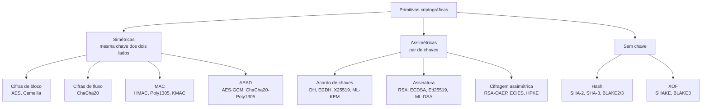

# 10 · Fundamentos: o vocabulário e os modelos mentais

**Nível:** iniciante a intermediário · **Última atualização:** 19/08/2026

Este arquivo define, com precisão, tudo o que o [01](01-introducao-leigo.md)
apresentou por analogia. A partir daqui, cada palavra tem um significado
técnico exato. Todos os termos entram no [GLOSSARIO.md](GLOSSARIO.md).

---

## 1. Os quatro objetivos, agora com definição

| Objetivo | Definição precisa | Primitiva típica | Falha típica |
|---|---|---|---|
| **Confidencialidade** | um adversário que observe o criptograma não obtém nenhuma informação sobre o texto claro além do seu comprimento | cifra simétrica em modo adequado | ECB, reuso de nonce |
| **Integridade** | qualquer alteração no dado é detectada com probabilidade esmagadora | MAC, AEAD, assinatura | cifrar sem autenticar |
| **Autenticidade** | o dado veio de quem detém uma chave específica | MAC (origem compartilhada), assinatura (origem única) | confiar no campo "remetente" |
| **Não repúdio** | um terceiro pode ser convencido da origem, mesmo contra a vontade do autor | assinatura digital | usar HMAC e prometer não repúdio |

Repare no par mais confundido: **MAC não dá não repúdio**. Como as duas partes
têm a mesma chave, qualquer uma poderia ter produzido a etiqueta; um juiz não
consegue distinguir. Assinatura dá, porque só o dono da chave privada produz.

Um quinto objetivo aparece em protocolos: **frescor** (*freshness*) — garantir
que a mensagem é de agora e não uma cópia de ontem. Não sai de graça de
nenhuma primitiva; exige nonce, contador ou carimbo de tempo no protocolo.

---

## 2. O mapa das primitivas



Uma primitiva raramente é usada sozinha. O que se usa são **construções**:
combinações padronizadas com prova de segurança. Encrypt-then-MAC, HKDF,
HMAC, OAEP, ECIES, HPKE são construções. **Inventar construção nova é o
trabalho de pesquisadores, com revisão por pares e anos de análise** — não é
tarefa de quem está resolvendo um problema de aplicação.

---

## 3. Chave, nonce, IV, sal: quatro coisas diferentes

Confundir esses quatro é a origem de uma fração enorme dos bugs reais.

| Nome | Secreto? | Único? | Aleatório? | Para quê |
|---|---|---|---|---|
| **Chave** | **sim** | por contexto | sim, na geração | é o segredo |
| **Nonce** (*number used once*) | não | **obrigatoriamente** | não precisa | fazer a mesma chave produzir saídas diferentes |
| **IV** (vetor de inicialização) | não | sim | **sim**, no CBC | idem, com exigência de imprevisibilidade no CBC |
| **Sal** (*salt*) | não | **sim, por senha** | sim | impedir tabelas pré-computadas e ataque em lote |

Regras que decorrem da tabela:

- Nonce **repetido** com a mesma chave é catastrófico
  ([exemplo 5](06-exemplos.md#5--reuso-de-nonce-explorado-na-prática)).
- Nonce **previsível** é aceitável em GCM/ChaCha20 (pode ser um contador), mas
  IV previsível em **CBC** é uma vulnerabilidade — foi essa a raiz do BEAST
  (2011).
- Sal repetido não é catastrófico, mas anula o benefício: duas contas com a
  mesma senha viram o mesmo hash, e um ataque em lote quebra as duas de uma vez.
- Nenhum dos três precisa ser secreto. Todos vão gravados junto ao dado.

---

## 4. Quanto é "seguro"? A escala de bits

**Nível de segurança de _n_ bits** significa: o melhor ataque conhecido custa
da ordem de 2ⁿ operações. Não é o tamanho da chave — é o custo do melhor
ataque.

| Bits | Situação em 2026 | Exemplo |
|---|---|---|
| 40 | quebrável em segundos num laptop | cifras de exportação dos anos 1990 |
| 56 | quebrado desde 1998 | DES |
| 64 | ao alcance de quem tem verba | limite do ataque de aniversário do 3DES |
| **80** | **abaixo do aceitável** | SHA-1 contra colisão (na prática, ~2⁶¹) |
| **112** | mínimo tolerado, depreciado após 2030 | RSA-2048, 3DES |
| **128** | **o padrão atual** | AES-128, X25519, P-256 |
| 192–256 | margem de sobra | AES-256, P-384 |

**Por que 128 bits é considerado suficiente, e por que 256 não é "o dobro":**

2¹²⁸ ≈ 3,4 × 10³⁸. Suponha um bilhão de máquinas, cada uma testando um bilhão
de chaves por segundo: 10¹⁸ testes por segundo. Levaria ~10²⁰ segundos, ou
cerca de 10¹² anos — cem vezes a idade do universo. Não há engenharia que
mude isso; a barreira é termodinâmica, não tecnológica (o **limite de
Landauer** dá um piso de energia por bit apagado, e percorrer 2²⁵⁶ estados
consumiria mais energia do que existe acessível no sistema solar).

Cada bit **dobra** o custo. Ir de 128 para 256 bits não dobra a segurança:
multiplica por 2¹²⁸. É por isso que "chave maior" quase nunca é a resposta
para uma preocupação real de segurança — o elo fraco está em outro lugar.

**Equivalências entre famílias** (NIST SP 800-57 Parte 1 Rev. 5):

| Segurança | Simétrico | Hash (colisão) | RSA/DH | Curva elíptica |
|---|---|---|---|---|
| 112 | 3DES | SHA-224 | 2048 | 224 |
| **128** | **AES-128** | **SHA-256** | **3072** | **256** |
| 192 | AES-192 | SHA-384 | 7680 | 384 |
| 256 | AES-256 | SHA-512 | 15360 | 512 |

A coluna do hash precisa de cuidado: um hash de *n* bits oferece *n/2* bits
contra colisão (paradoxo do aniversário) e *n* bits contra pré-imagem. SHA-256
dá 128 bits contra colisão e 256 contra pré-imagem.

---

## 5. Os cinco porquês do tamanho de chave

> **Por que AES-128 e não AES-100?**
> Porque a especificação define 128, 192 e 256.
>
> **Por que a especificação define esses três?**
> Porque o concurso do NIST (1997) exigiu suporte a esses tamanhos, para
> cobrir três níveis de confidencialidade do governo americano.
>
> **Por que 128 como piso?**
> Porque em 1997 já se via o DES de 56 bits cair; 128 dava margem para
> décadas, considerando a Lei de Moore.
>
> **Por que a margem é tão grande?**
> Porque criptografia protege dados que precisam continuar secretos por 30
> anos, e não se pode trocar a cifra de um satélite em órbita.
>
> **Por que não simplesmente usar 512 bits em tudo?**
> Custo. AES-256 é ~40% mais lento que AES-128 (14 rodadas contra 10). Numa
> chave simétrica, 128 bits já está além do fisicamente atacável, então o
> gasto extra não compra segurança — compra a sensação dela. A exceção real
> é o **algoritmo de Grover**, que reduz a busca quântica de 2ⁿ para 2^(n/2),
> e é por isso que se recomenda AES-256 quando a proteção precisa durar até a
> era quântica.

*Parada legítima: trade-off econômico explícito + limite físico.*

---

## 6. Modelo de ameaça: a pergunta que vem antes de tudo

Nenhum sistema é "seguro". Um sistema é seguro **contra um adversário
específico, com capacidades específicas, protegendo ativos específicos, por um
tempo específico**. Escrever isso é o modelo de ameaça.

Quatro perguntas, nesta ordem:

1. **O que estou protegendo?** (dados de saúde? chaves de assinatura? metadados?)
2. **Contra quem?** (colega curioso? administrador? crime organizado? Estado?)
3. **O que o adversário consegue fazer?**
4. **Por quanto tempo o dado precisa ficar secreto?**

Escala de capacidades, em ordem crescente:

| Adversário | Consegue | Defesa característica |
|---|---|---|
| **Passivo** | ler o tráfego | qualquer cifra decente |
| **Ativo** | alterar, injetar, repetir, bloquear | AEAD + autenticação + frescor |
| **Adaptativo escolhendo criptogramas** | mandar criptogramas forjados e ver a reação | segurança IND-CCA2 (todo AEAD sério) |
| **Com acesso ao canal lateral** | medir tempo, consumo, cache | implementação de tempo constante |
| **Com acesso físico** | abrir o chip, injetar falhas, congelar a RAM | elemento seguro, HSM, detecção de violação |
| **Com poder de coação** | exigir a chave por lei ou por força | sigilo futuro, cifragem negável, minimização de dados |
| **Do futuro** | gravar hoje, decifrar em 2040 | sigilo futuro, criptografia pós-quântica |

O último merece nome próprio: **"*harvest now, decrypt later*"** — colher
agora, decifrar depois. É o único caso em que uma ameaça que ainda não existe
justifica mudar o sistema hoje, e é o motor de toda a migração pós-quântica.

**Erro clássico:** projetar contra o adversário mais poderoso imaginável e, no
caminho, tornar o sistema tão difícil de usar que as pessoas o contornam. A
senha anotada no monitor é uma falha de modelo de ameaça, não de disciplina.

---

## 7. O princípio de Kerckhoffs e a segurança por obscuridade

Auguste Kerckhoffs, em *La Cryptographie Militaire* (1883), listou seis
requisitos. O segundo virou o princípio:

> *Il faut qu'il n'exige pas le secret, et qu'il puisse sans inconvénient
> tomber entre les mains de l'ennemi.*
> ("Não deve exigir segredo, e deve poder cair nas mãos do inimigo sem
> inconveniente.")

Shannon reformulou em 1949: **"o inimigo conhece o sistema"**.

Por que isso é obrigatório, e não filosofia:

1. **Algoritmos vazam** — por engenharia reversa, funcionário, processo
   judicial, código-fonte. Chaves são trocáveis; algoritmos, não.
2. **Só a análise pública gera evidência.** A confiança no AES vem de 25 anos
   de milhares de criptógrafos tentando quebrá-lo em público.
3. **A história é implacável.** Todo algoritmo secreto notável de larga escala
   caiu quando examinado: A5/1 (GSM), CSS (DVD), Mifare Crypto-1 (crachás),
   KeeLoq (chaves de carro), RC4 (vazado em 1994).

**O que não é obscuridade:** não publicar suas chaves, não expor sua topologia
de rede, não documentar publicamente cada endpoint interno. Isso é
compartimentação, e é sensato. Obscuridade é quando **a segurança depende** do
segredo do método.

---

## 8. O que significa "provado seguro"

Um resultado de segurança criptográfica quase nunca é "é impossível quebrar".
É quase sempre da forma:

> **Se** existir um adversário que quebre este esquema com vantagem ε em tempo
> t, **então** existe um algoritmo que resolve o problema P em tempo ≈ t com
> probabilidade ≈ ε.

Isso é uma **redução**. Ela transfere a confiança do esquema (novo) para o
problema P (velho e muito estudado: fatoração, logaritmo discreto, reticulados
curtos). Não prova que P é difícil — ninguém sabe provar isso, e provar
implicaria resolver P ≠ NP.

Três consequências práticas:

- Segurança criptográfica é **condicional**. "Seguro" quer dizer "tão difícil
  quanto um problema que a humanidade não resolveu".
- Existe uma exceção com **segurança incondicional**: a cifra de uso único
  (*one-time pad*) e o esquema de Shamir. São inúteis para a maior parte dos
  usos, por exigirem chave do tamanho da mensagem
  ([60-teoria-avancada.md](60-teoria-avancada.md)).
- Uma prova vale dentro do seu **modelo**. Uma prova no modelo do oráculo
  aleatório assume um hash idealizado que não existe; provas de sigilo não
  dizem nada sobre canais laterais. Sistemas provados seguros caem o tempo
  todo — por violação das premissas, nunca por erro na álgebra.

Detalhamento formal, com os jogos IND-CPA e IND-CCA2, em
[60-teoria-avancada.md](60-teoria-avancada.md).

---

## 9. Entropia: a medida do que o adversário não sabe

**Entropia** (de Shannon) mede a incerteza de uma variável aleatória, em bits.
Uma moeda honesta tem 1 bit. Um dado de 6 faces, log₂6 ≈ 2,58 bits.

Para criptografia, a medida relevante é a **min-entropia**: −log₂ da
probabilidade do resultado **mais provável**. É a pessimista, e é a certa,
porque o atacante começa pelo palpite mais provável.

Exemplo concreto e desconfortável:

| Segredo | Espaço | Entropia real |
|---|---|---|
| Chave AES-256 de `os.urandom` | 2²⁵⁶ | 256 bits |
| Senha de 8 caracteres "aleatória" escolhida por humano | — | ~20 a 30 bits |
| Quatro palavras sorteadas de uma lista de 7 776 | 7776⁴ | ~51 bits |
| PIN de 4 dígitos | 10⁴ | 13,3 bits (menos, na prática: 1234 e 0000 concentram ~10%) |
| UUIDv4 | 2¹²² | 122 bits |

Duas conclusões que orientam projeto:

1. **Senha humana nunca chega perto de uma chave.** É por isso que existe
   derivação lenta (scrypt, Argon2): ela compensa a falta de entropia com
   custo computacional. Não cria entropia — encarece cada palpite.
2. **A entropia é do processo, não do resultado.** `0000000000000000` gerado
   por `os.urandom(8)` tem os mesmos 64 bits de entropia de qualquer outro
   valor. O que importa é como foi escolhido.

---

## 10. Kerckhoffs aplicado: onde os sistemas realmente falham

Distribuição aproximada das causas em incidentes criptográficos reais, na
minha leitura de relatórios públicos (opinião profissional, não estatística
formal):

```
Matemática do algoritmo quebrada          ▏ <1%
Implementação com canal lateral           ███ 8%
Uso errado da API (modo, nonce, padding)  ████████████ 30%
Gestão de chaves (vazada, fraca, eterna)  ██████████████ 35%
Protocolo mal desenhado ao redor          ████████ 20%
Aleatoriedade defeituosa                  ██ 6%
```

A leitura é direta: **quase ninguém é derrotado pela matemática.** Você será
derrotado por uma chave no repositório Git, por um nonce reutilizado, por uma
biblioteca chamada com o parâmetro errado ou por um protocolo que aceita
"algoritmo: nenhum".

É por isso que este curso dedica os arquivos 22, 24, 25 e 75 a essas áreas, e
por que o conselho mais valioso é o mais chato: **use construções prontas,
com bibliotecas mantidas, do jeito que a documentação manda.**

---

## Autoteste

1. Por que um MAC não fornece não repúdio, e uma assinatura fornece?
2. Diferencie nonce, IV e sal em três dimensões: sigilo, unicidade e
   aleatoriedade.
3. O que significa "nível de segurança de 128 bits"? Por que 256 bits não é o
   dobro de 128?
4. Quantos bits de RSA equivalem a AES-128? E qual a consequência prática?
5. Escreva um modelo de ameaça de três linhas para um aplicativo de mensagens
   usado por jornalistas.
6. Enuncie o princípio de Kerckhoffs e dê dois motivos técnicos para ele.
7. O que exatamente uma "prova de segurança" prova? Cite um esquema com
   segurança incondicional.
8. Por que uma senha de 8 caracteres tem tão pouca entropia, e o que a
   derivação lenta faz a respeito?
9. Qual é a maior categoria de falha real em criptografia, e o que isso
   implica sobre onde investir atenção?

---

**Anterior:** [07-projeto-modelo/](07-projeto-modelo/README.md) ·
**Próximo:** [11-historia.md](11-historia.md)
