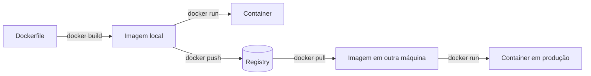

# Fundamentos: imagem, container, Dockerfile e registry

> **Nível:** iniciante
> **Última verificação:** 18/08/2026

## 1. O problema que fez o Docker existir

Antes da explicação técnica, o problema real. Você tem uma aplicação Python que
funciona na sua máquina. Você a coloca no servidor e ela quebra. Por quê?

- o servidor tem Python 3.9, você tem 3.12;
- falta uma biblioteca do sistema (`libpq`, `libjpeg`) que você instalou há dois
  anos e esqueceu;
- uma variável de ambiente existe só no seu `.bashrc`;
- o caminho `/home/voce/dados` não existe lá.

A frase "na minha máquina funciona" não é preguiça — é a constatação de que
**a aplicação não é só o código**. Ela é o código *mais* o interpretador, *mais*
as bibliotecas do sistema, *mais* os arquivos de configuração, *mais* as
variáveis de ambiente. Todo esse conjunto é o que precisa viajar junto.

Docker é a resposta a isso: empacotar o conjunto inteiro num artefato único que
roda igual em qualquer lugar.

### Por que não uma máquina virtual?

VM resolve o mesmo problema, e resolveu por 15 anos. A diferença:

```
   MÁQUINA VIRTUAL                    CONTAINER
┌───────────────────────┐      ┌───────────────────────┐
│  app A   │   app B    │      │  app A   │   app B    │
├──────────┼────────────┤      ├──────────┼────────────┤
│ bibliot. │  bibliot.  │      │ bibliot. │  bibliot.  │
├──────────┼────────────┤      ├──────────┴────────────┤
│ SO conv. │  SO conv.  │      │   Docker Engine       │
├──────────┴────────────┤      ├───────────────────────┤
│      Hypervisor       │      │  Kernel do host       │
├───────────────────────┤      ├───────────────────────┤
│    Kernel do host     │      │      Hardware         │
├───────────────────────┤      └───────────────────────┘
│      Hardware         │
└───────────────────────┘
   ~1 GB, ~30 s               ~50 MB, ~0,3 s
```

A VM carrega um sistema operacional inteiro, com kernel próprio. O container
**compartilha o kernel do host** e carrega só as bibliotecas de userspace. Daí
a diferença de uma ordem de grandeza em tamanho e duas em tempo de partida.

O preço: como o kernel é compartilhado, containers Linux precisam de kernel
Linux. É por isso que Docker no macOS e no Windows roda uma VM Linux por baixo —
e é por isso que o desempenho de I/O de arquivo é pior nesses sistemas.

## 2. Os quatro conceitos, com uma analogia que se sustenta

| Conceito | Analogia | Definição técnica |
|---|---|---|
| **Dockerfile** | a receita | arquivo de texto com as instruções de construção |
| **Imagem** | o bolo congelado | sistema de arquivos empacotado, imutável, em camadas |
| **Container** | o bolo no prato, sendo comido | um processo em execução a partir de uma imagem |
| **Registry** | a padaria/mercado | servidor onde imagens são publicadas e baixadas |

A relação entre imagem e container é a mesma entre **classe e objeto**, ou entre
**programa no disco e processo na memória**. De uma imagem você cria quantos
containers quiser, e cada um tem vida própria:

```bash
docker run -d --name a nginx    # container a
docker run -d --name b nginx    # container b
# uma imagem, dois containers, isolados um do outro
```

### O ponto que confunde todo mundo no começo

**A imagem é imutável. O container tem uma camada de escrita própria.**

Quando você roda um container, o Docker empilha uma camada gravável fina por
cima das camadas somente-leitura da imagem. Tudo que o container escreve vai
para essa camada. Quando o container é removido, **a camada some junto**.

```
        ┌──────────────────────────┐
        │ camada de escrita        │ ← só do container, morre com ele
        ├──────────────────────────┤
        │ COPY app/                │ ┐
        │ RUN pip install          │ │ imagem: somente leitura,
        │ FROM python:3.12-slim    │ │ compartilhada entre containers
        └──────────────────────────┘ ┘
```

É por isso que dados que precisam sobreviver vão para **volumes** — assunto do
[módulo 04](../04-armazenamento/bind-mount-vs-volume.md).

E é por isso que "instalei um pacote dentro do container com `docker exec`"
nunca é a solução: some no próximo `docker run`. O lugar de instalar pacote é o
Dockerfile.

## 3. Camadas: o mecanismo por trás de tudo

Cada instrução do Dockerfile que altera o filesystem cria uma **camada** — um
diff em relação à anterior, como um commit do git.

```dockerfile
FROM python:3.12-slim      # camada 1: ~43 MB
WORKDIR /app               # metadado, não cria camada de dados
COPY requirements.txt .    # camada 2: ~1 KB
RUN pip install -r requirements.txt   # camada 3: ~80 MB
COPY app/ ./app/           # camada 4: ~20 KB
```

Três consequências que valem ouro:

**1. Camadas são compartilhadas.** Dez imagens que partem de `python:3.12-slim`
guardam essa base **uma vez** no disco. Dez imagens de 100 MB ocupam ~130 MB,
não 1 GB.

**2. Camadas são cacheadas.** Se nada mudou numa instrução e nos arquivos que
ela toca, o Docker reaproveita a camada. É a base da otimização do
[módulo 02](../02-dockerfile/cache-de-camadas.md).

**3. Camadas são aditivas — apagar não diminui.** Este é o erro que produz
imagens gigantes:

```dockerfile
COPY segredo.txt /tmp/    # camada 5: grava o arquivo
RUN rm /tmp/segredo.txt   # camada 6: registra "apagado"
```

A imagem **continua com o arquivo** na camada 5. `docker history` mostra, e
qualquer um que baixe a imagem extrai o conteúdo. É exatamente assim que
credenciais vazam em imagens públicas. Para apagar de verdade, o arquivo não
pode entrar: use `.dockerignore`, multi-stage ou
`RUN --mount=type=secret`.

## 4. Registry, tags e a mentira do `:latest`

Uma referência completa de imagem tem quatro partes:

```
registry.exemplo.com/organizacao/aplicacao:1.4.2
└──── registry ────┘ └── namespace ┘ └─nome─┘ └tag┘
```

Sem registry explícito, o Docker assume Docker Hub. Sem tag, assume `:latest`.

**`:latest` não significa "a mais recente".** É apenas a tag aplicada quando
ninguém especifica outra. Um projeto pode ter `:latest` apontando para uma
versão de dois anos atrás. E como a tag é um ponteiro móvel, o mesmo
`FROM node:latest` pode trazer coisas diferentes em dias diferentes — build não
reprodutível, e o pior tipo de bug: o que aparece sem ninguém ter mudado nada.

Regra prática, e a mais valiosa deste arquivo:

| Uso | Recomendação |
|---|---|
| Experimentar rápido | `:latest` tudo bem |
| Desenvolvimento | tag de versão menor: `python:3.12-slim-trixie` |
| Produção | digest: `python:3.12-slim-trixie@sha256:2c941e86...` |

O digest é o hash do conteúdo. É a única referência **imutável** que existe.

Isso não é teórico: durante a escrita deste curso descobrimos que
`python:3.12-slim` e `python:3.12-slim-trixie` têm digest idêntico —
ou seja, a tag "genérica" já havia migrado de Debian bookworm para trixie.
Quem tivesse pinado a versão de um pacote apt de bookworm teria o build
quebrado sem ter mudado uma linha. O caso completo está na
[seção 7 do módulo 08](../08-projeto-aplicado/dockerfile-fastapi-sqlalchemy.md).

## 5. As peças em movimento



E a arquitetura cliente-servidor que explica muita mensagem de erro:

```
  você digita              conversa por socket
  docker build  ──────►  CLI  ──────►  Docker Daemon (dockerd)
                                        │ constrói, roda, gerencia
                                        └─ containerd ─ runc ─ kernel
```

O `docker` que você digita é só um **cliente**. Quem faz o trabalho é o
**daemon**, um serviço rodando como root. Duas consequências práticas:

- O erro `Cannot connect to the Docker daemon` significa que o daemon não está
  rodando ou você não tem permissão no socket — nunca que o Docker "não está
  instalado". (Foi exatamente o que aconteceu na máquina onde este curso foi
  escrito: CLI presente, socket `root:docker`, usuário fora do grupo.)
- Estar no grupo `docker` **equivale a ser root** na máquina, porque você pode
  montar `/` num container. Não é uma permissão trivial.

## 6. Os comandos que resolvem 90% do dia

```bash
# Imagens
docker pull nginx:1.29-alpine       # baixar
docker images                       # listar locais
docker history <imagem>             # ver as camadas e o que cada uma custou
docker rmi <imagem>                 # remover

# Containers
docker run -d -p 8080:80 --name web nginx:1.29-alpine
docker ps                           # rodando
docker ps -a                        # todos, inclusive parados
docker logs -f web                  # acompanhar a saída
docker exec -it web sh              # abrir shell dentro
docker stop web && docker rm web    # parar e remover

# Faxina (o disco enche mais rápido do que se imagina)
docker system df                    # quanto está ocupado, por categoria
docker system prune                 # remove parados, redes órfãs, cache
docker system prune -a --volumes    # remove TUDO que não está em uso — inclusive volumes
```

Cuidado com o último: `--volumes` apaga dados. Leia `docker system df` antes.

### Anatomia do `docker run`

```bash
docker run -d --rm -p 8080:80 -v dados:/var/lib/app -e CHAVE=valor --name web nginx:1.29-alpine
           │    │      │           │                    │            │        │
           │    │      │           │                    │            │        └ imagem
           │    │      │           │                    │            └ nome fixo
           │    │      │           │                    └ variável de ambiente
           │    │      │           └ volume: dados persistentes
           │    │      └ porta: host 8080 -> container 80
           │    └ remove o container ao parar
           └ detached: roda em segundo plano
```

Em `-p 8080:80` e em `-v origem:destino`, a ordem é sempre
**host primeiro, container depois**. Inverter é o erro mais comum da semana 1.

## 7. Os cinco porquês, aplicados

Vamos até o fundo em "por que um container é leve":

1. **Por que o container é leve?** Não carrega sistema operacional próprio.
2. **Por que não precisa?** Usa o kernel do host.
3. **Por que dá para compartilhar o kernel com segurança?** Porque o kernel
   Linux tem *namespaces* (o processo enxerga só o "seu" conjunto de PIDs, rede,
   pontos de montagem) e *cgroups* (limitam CPU, memória, I/O).
4. **Por que esses recursos existem no kernel?** Namespaces entraram a partir do
   2.4.19 (2002) e os cgroups foram contribuídos pelo Google em 2007, para
   isolar cargas de trabalho na infraestrutura deles.
5. **Então por que o Docker ficou famoso, e não os cgroups?** Porque a
   tecnologia existia mas era intragável de usar. LXC já fazia isso desde 2008.
   O Docker (2013) empacotou aquilo com **formato de imagem em camadas**,
   **Dockerfile** e um **registry público** — resolveu a distribuição, não o
   isolamento. **Parada legítima: decisão de produto, não avanço técnico.**

Essa é a lição histórica que separa quem entende de quem decora: o Docker
venceu pela experiência de uso e pela rede de compartilhamento, não por ter
inventado containers.

## 8. Erros que você provavelmente vai cometer

| Mensagem no terminal | Causa raiz | Correção |
|---|---|---|
| `Cannot connect to the Docker daemon at unix:///var/run/docker.sock` | daemon parado, ou seu usuário fora do grupo `docker` | `sudo systemctl start docker`; `sudo usermod -aG docker $USER` e reabrir a sessão |
| `docker: Error response from daemon: port is already allocated` | outro processo já usa a porta do host | `docker ps` para achar; trocar para `-p 8081:80` |
| Container sobe e morre na hora, sem erro | o processo principal terminou; container vive enquanto o PID 1 viver | `docker logs <nome>`; o processo precisa rodar em foreground |
| `no such file or directory` num `COPY` | o arquivo está fora do build context, ou barrado pelo `.dockerignore` | conferir o contexto (o `.` do `docker build .`) |
| Alterei o código e o container não mudou | container roda a **imagem**, não seu diretório | rebuildar, ou usar bind mount em dev |
| Disco cheio do nada | imagens, cache de build e volumes órfãos acumulam | `docker system df` e depois `prune` |

## 9. Autoteste

1. Explique a diferença entre imagem e container usando classe/objeto.
2. Por que um container sobe em milissegundos e uma VM em dezenas de segundos?
3. O que acontece com o que um container escreveu quando ele é removido?
4. Por que `RUN rm arquivo` não diminui o tamanho da imagem?
5. `:latest` significa "versão mais recente"? Justifique.
6. Qual a diferença entre tag e digest, e quando cada um se aplica?
7. Em `-p 8080:80`, qual número é do host?
8. Por que estar no grupo `docker` equivale a ter root?
9. Por que o Docker venceu se LXC já fazia containers desde 2008?

Não conseguiu responder alguma? Reveja a seção correspondente antes do
[exercício](exercicio.md).

---
[exercício →](exercicio.md) · [índice](../00-indice.md)
