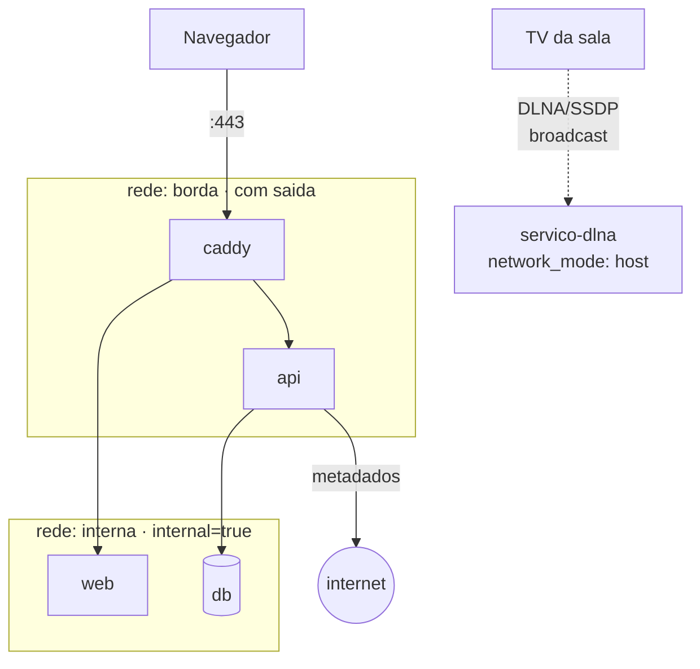

# Exercício — Redes

> **Tente antes de olhar.**

## Enunciado

### Parte A — diagnosticar

Um colega tem este compose. A API não sobe: `could not translate host name "db"`.

```yaml
services:
  api:
    image: minha-api:1.0
    ports:
      - "8000:8000"
    environment:
      DATABASE_URL: postgresql://user:senha@db:5433/app
    networks:
      - frontend

  db:
    image: postgres:17-alpine
    ports:
      - "5433:5432"
    environment:
      POSTGRES_PASSWORD: senha
    networks:
      - backend

networks:
  frontend:
  backend:
```

1. Qual é a causa do erro?
2. Há um **segundo** erro que apareceria logo depois de corrigir o primeiro.
   Qual?
3. Corrija o compose, mantendo a separação de redes onde ela faz sentido.

### Parte B — projetar

4. Projete a topologia de rede do FlixARD com estes requisitos:
   - só uma porta publicada no host (443)
   - a API precisa buscar metadados de filmes numa API externa da internet
   - o banco **não** pode ter rota para a internet
   - a TV da sala precisa **descobrir** o servidor de mídia via DLNA
   
   Desenhe e explique. O último requisito conflita com os outros — resolva.

### Parte C — investigar

5. Você acessa `http://192.168.1.10:8000` de outro computador da casa e
   funciona. Mas `sudo ufw status` mostra `8000 DENY`. Explique e corrija.

---
---
---

# SOLUÇÃO COMENTADA

## Parte A

### 1. Causa do erro

`api` está na rede `frontend`, `db` está na `backend`. **Redes diferentes.**
O DNS interno só resolve nomes de containers na **mesma** rede, então `db` não
existe do ponto de vista da `api`.

### 2. O segundo erro

Corrigindo só a rede, o próximo erro seria `connection refused`:

```yaml
DATABASE_URL: postgresql://user:senha@db:5433/app
                                          ^^^^
```

`5433` é a porta do **host**. Entre containers o tráfego vai direto pela rede
interna, onde o Postgres escuta em **5432**. O mapeamento `"5433:5432"` só vale
para quem chega pelo host.

### 3. Compose corrigido

```yaml
services:
  api:
    image: minha-api:1.0
    ports:
      - "127.0.0.1:8000:8000"
    environment:
      # Porta INTERNA (5432), e o host é o nome do serviço
      DATABASE_URL: postgresql://user:senha@db:5432/app
    networks:
      - frontend      # para ser alcançada
      - backend       # para alcançar o banco
    depends_on:
      db:
        condition: service_healthy
    restart: unless-stopped

  db:
    image: postgres:17-alpine
    # ports: REMOVIDO — o banco não precisa ser alcançado do host
    environment:
      POSTGRES_USER: user
      POSTGRES_PASSWORD: senha
      POSTGRES_DB: app
    volumes:
      - pgdata:/var/lib/postgresql/data
    networks:
      - backend       # só a rede interna
    restart: unless-stopped
    healthcheck:
      test: ["CMD-SHELL", "pg_isready -U user -d app"]
      interval: 10s
      timeout: 3s
      retries: 5
      start_period: 10s

networks:
  frontend:
  backend:
    internal: true    # o banco não tem rota para a internet

volumes:
  pgdata:
```

**A ideia central:** a `api` fica nas **duas** redes — é a ponte. O `db` fica só
na `backend`, que é `internal`. Assim, mesmo que a API seja comprometida, o
banco não consegue exfiltrar dados para a internet por conta própria.

E o `ports:` do banco foi removido: se ninguém no host precisa alcançá-lo,
publicá-lo só cria exposição. Para depurar pontualmente:

```bash
docker compose exec db psql -U user -d app
```

## Parte B — topologia do FlixARD



```yaml
services:
  caddy:
    image: caddy:2-alpine
    ports: ["443:443"]
    networks: [borda, interna]
    restart: unless-stopped

  api:
    build: ../app-fastapi
    networks:
      - borda      # precisa de saída para a API externa de metadados
      - interna    # precisa alcançar o banco
    restart: unless-stopped

  web:
    image: nginx:1.29-alpine
    networks: [interna]
    restart: unless-stopped

  db:
    image: postgres:17-alpine
    networks: [interna]     # sem rota para a internet
    volumes: [pgdata:/var/lib/postgresql/data]
    restart: unless-stopped

  # O serviço DLNA é o caso especial — ver explicação abaixo
  dlna:
    image: vladgh/minidlna
    network_mode: host
    volumes:
      - /srv/flixard/midia:/media:ro
    restart: unless-stopped

networks:
  borda:
  interna:
    internal: true

volumes:
  pgdata:
```

### O conflito e sua resolução

**O requisito do DLNA é incompatível com o resto.** DLNA/SSDP funciona por
**broadcast UDP**, e broadcast **não atravessa** o NAT da bridge do Docker. A TV
manda um "quem está aí?" para a rede local; o container atrás da bridge nunca
recebe.

Não há como resolver isso com `ports:` — não é questão de porta, é de camada 2.

Duas saídas:

| Opção | Como | Custo |
|---|---|---|
| **`network_mode: host`** no serviço DLNA | ele passa a viver na rede do host e recebe broadcast | perde isolamento de rede **desse serviço** |
| **`macvlan`** | ele ganha IP próprio na LAN | complexo; o host não fala com ele |

**Recomendação:** isolar o problema. Só o serviço DLNA usa `network_mode: host`;
todo o resto continua isolado. Como esse serviço só **lê** mídia (`:ro`) e não
toca no banco, a superfície exposta é pequena e aceitável.

Repare que o `dlna` **não** pode estar nas redes `borda`/`interna` ao mesmo
tempo que usa `network_mode: host` — os modos são mutuamente exclusivos. Ele
alcança a mídia por bind mount, não por rede, então não faz falta.

**A lição geral:** quando um requisito exige quebrar o isolamento, quebre no
menor escopo possível, em vez de baixar a guarda do sistema inteiro.

## Parte C — UFW que não protege

### O que está acontecendo

**O Docker escreve suas próprias regras de iptables e elas são avaliadas antes
das do UFW.** Quando você publica `-p 8000:8000`, o Docker insere uma regra de
DNAT na tabela `nat`, cadeia `PREROUTING`, que redireciona o pacote antes de ele
chegar às cadeias onde o UFW atua.

Resultado: `ufw deny 8000` está ativo, aparece no `status`, e **não tem efeito
nenhum** sobre tráfego destinado a container. É contraintuitivo e surpreende
praticamente todo mundo na primeira vez.

Verificar:

```bash
sudo iptables -t nat -L DOCKER -n
# vai listar a regra de DNAT para 8000

sudo ufw status
# 8000  DENY  Anywhere      <- presente, e inútil aqui
```

### A correção

**Opção 1 — publicar só no loopback (recomendada):**

```yaml
ports:
  - "127.0.0.1:8000:8000"
```

O Docker passa a escutar só em `127.0.0.1`. Nenhum aparelho da LAN alcança,
independentemente de firewall. Acesso externo passa por proxy reverso com TLS.

**Opção 2 — não publicar:**

Se só outros containers precisam do serviço, remova `ports:` por completo.

**Opção 3 — regra na cadeia `DOCKER-USER`:**

```bash
sudo iptables -I DOCKER-USER -i eth0 ! -s 127.0.0.1 -p tcp --dport 8000 -j DROP
```

A `DOCKER-USER` é avaliada **antes** das regras automáticas do Docker e é o
ponto de extensão oficial. Funciona, mas: não persiste após reboot sem
`iptables-persistent`, e é fácil errar e se trancar para fora.

**Opinião profissional:** use a opção 1. Ela é declarativa, fica no compose
junto do resto, versionada no git, e não depende de estado do firewall do host.
Firewall é a segunda linha de defesa; **não publicar é a primeira**.

---
[← DNS interno](dns-interno-entre-servicos.md) · [módulo 06: segurança →](../06-seguranca/usuario-nao-root.md) · [índice](../00-indice.md)
