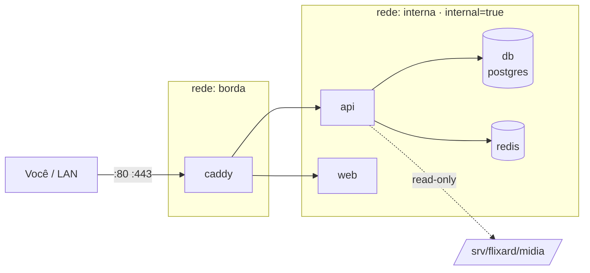

# Compose aplicado ao FlixARD

> **Nível:** intermediário → avançado
> **Última verificação:** 18/08/2026
> **Arquivo executável:** [`flixard/compose.yaml`](flixard/compose.yaml) — validado com `docker compose config`

## O problema

FlixARD é uma plataforma de streaming própria rodando em servidor local. Isso
significa: biblioteca de mídia grande em disco, front-end, API, banco, cache, e
um servidor que provavelmente faz outras coisas ao mesmo tempo. As decisões
difíceis não são "qual imagem usar" — são estas quatro:

1. Onde ficam os arquivos de mídia, e por que **não** num volume nomeado.
2. Como expor a plataforma sem abrir cinco portas no roteador.
3. Como impedir que um comprometimento do front-end chegue ao banco.
4. Como impedir que um transcode desgovernado derrube o servidor inteiro.

## A topologia



Só o `caddy` tem `ports:`. Todo o resto é inalcançável a partir do host e da
LAN — existe apenas dentro da rede do Compose.

## Decisão 1 — bind mount para a mídia, volume nomeado para o resto

```yaml
volumes:
  - /srv/flixard/midia:/midia:ro   # bind mount
  - thumbs:/app/thumbs             # volume nomeado
```

| | Biblioteca de mídia | Thumbnails |
|---|---|---|
| Tipo | bind mount | volume nomeado |
| Por quê | é um diretório **seu**, que você gerencia por fora (rsync, Samba, download) e precisa enxergar no `ls` | é artefato derivado, gerado pelo app, e ninguém precisa abrir na mão |
| Onde fica | `/srv/flixard/midia` | `/var/lib/docker/volumes/...` |
| Se perder | catástrofe | regenera |

Um volume nomeado para a mídia esconderia sua coleção dentro de
`/var/lib/docker/volumes/`, com dono root e caminho ilegível. Você não
conseguiria mais copiar um filme para lá sem passar pelo Docker. É a escolha
errada aqui — e é o erro mais comum em homelab.

O `:ro` merece uma frase própria: a API só **lê** mídia. Com `:ro`, uma falha de
path traversal na API não apaga sua coleção. Uma letra a mais, um desastre a
menos.

Mais em [bind mount vs volume](../04-armazenamento/bind-mount-vs-volume.md).

## Decisão 2 — uma porta só, com proxy reverso

Sem proxy você acabaria com `:8000` para API, `:3000` para o web, `:5432`
para o banco, e um roteador cheio de furos. Com o Caddy:

```yaml
caddy:
  ports: ["80:80", "443:443"]
```

E nenhum outro serviço publica porta. O Caddy roteia por caminho:

```
flixard.local {
    tls internal
    handle /api/* { reverse_proxy api:8000 }
    handle        { reverse_proxy web:80   }
}
```

`api:8000` é o nome do serviço resolvido pelo DNS interno do Compose — sem IP
fixo, sem `links`. Ver [DNS interno](../05-redes/dns-interno-entre-servicos.md).

Por que Caddy e não nginx aqui: TLS automático sem configuração. Em rede local
sem domínio público, `tls internal` emite certificado de uma CA local. Se você
já domina nginx, use nginx — a diferença é conveniência, não capacidade.

## Decisão 3 — duas redes, e a interna sem saída

```yaml
networks:
  borda:
  interna:
    internal: true
```

`internal: true` remove o gateway padrão: containers nessa rede **não têm rota
para a internet**. Consequências reais:

- o Postgres não consegue ser usado para exfiltrar dados para fora;
- se uma imagem vier com backdoor que "liga para casa", ela não liga.

O custo: containers na rede interna não conseguem baixar nada. Se algum serviço
precisar buscar algo na internet (atualizar metadados de filme, por exemplo),
ele precisa também estar em `borda`. É um trade-off explícito, não um esquecimento.

## Decisão 4 — limites de recurso

```yaml
deploy:
  resources:
    limits:
      cpus: "2.0"
      memory: 2g
```

Sem limite, um container pode consumir toda a RAM e o kernel aciona o OOM
killer — que **não** necessariamente mata o culpado. Ele mata pelo score, e
frequentemente derruba o Postgres. Em servidor de homelab que também guarda
suas coisas, isso é inaceitável.

Uma armadilha: `deploy.resources.limits` foi criado para o Swarm, mas o
`docker compose up` moderno **respeita** esse bloco. Já `deploy.replicas` é
ignorado fora do Swarm. Não são a mesma história.

## Como rodar

```bash
cd 08-projeto-aplicado/flixard
cp .env.example .env
$EDITOR .env               # troque POSTGRES_PASSWORD

mkdir -p /srv/flixard/midia /srv/flixard/backup

docker compose config --quiet     # valida antes de subir
docker compose up -d
docker compose ps                 # todos (healthy)?
docker compose logs -f caddy
```

## Verificação executada

```bash
docker compose config --quiet     # sem POSTGRES_PASSWORD
# saída obtida:
# error while interpolating services.api.environment.DATABASE_URL:
#   required variable POSTGRES_PASSWORD is missing a value: defina POSTGRES_PASSWORD no .env

POSTGRES_PASSWORD=teste docker compose config --quiet
# saída obtida: (vazio) -> válido
```

Isso demonstra a sintaxe `${VAR:?mensagem}`: o Compose **se recusa a subir** sem
a variável, com a mensagem que você escreveu. É muito melhor que um default
silencioso, porque uma senha padrão esquecida em produção é como incidentes
começam. Ver [variáveis de ambiente](../03-compose/variaveis-de-ambiente.md).

**Não validado:** o `up` de fato (daemon indisponível na máquina de escrita).
Imagens base foram conferidas na API do Docker Hub em 18/08/2026:
`caddy:2-alpine`, `nginx:1.29-alpine`, `postgres:17-alpine`, `redis:7-alpine`.

## Erros que você provavelmente vai cometer

| Sintoma | Causa raiz | Correção |
|---|---|---|
| `no such file or directory` no bind mount da mídia | `/srv/flixard/midia` não existe no host; o Docker **não** cria caminho de bind mount | `mkdir -p /srv/flixard/midia` antes do `up` |
| API enxerga `/midia` vazio | montou o caminho errado, ou a mídia está em disco não montado no boot | conferir com `docker compose exec api ls /midia` |
| `Permission denied` ao ler mídia | arquivos do host não são legíveis pelo UID 10001 | ajustar permissão no host, ou alinhar o UID do container ao dono dos arquivos |
| Caddy em loop de reinício | erro de sintaxe no `Caddyfile` | `docker compose logs caddy`; validar com `docker compose exec caddy caddy validate --config /etc/caddy/Caddyfile` |
| API não acha o `db` | serviço fora da rede `interna`, ou nome do serviço diferente do host da URL | o host **é** o nome do serviço |
| Certificado inválido no navegador | `tls internal` usa CA local | importar a CA do Caddy no sistema, ou usar domínio real |

## Autoteste

1. Por que a biblioteca de mídia é bind mount e os thumbnails são volume nomeado?
2. O que o `:ro` no bind mount evita, concretamente?
3. O que `internal: true` faz, e qual é o preço?
4. Por que só o Caddy tem `ports:`?
5. Como o Caddy encontra a API sem saber o IP dela?
6. O que acontece sem `limits.memory`, e por que o Postgres é a vítima provável?
7. Qual a diferença entre `${VAR}` e `${VAR:?mensagem}` num compose?

---
[← módulo 08](dockerfile-fastapi-sqlalchemy.md) · [sistema financeiro →](compose-sistema-financeiro.md) · [índice](../00-indice.md)
