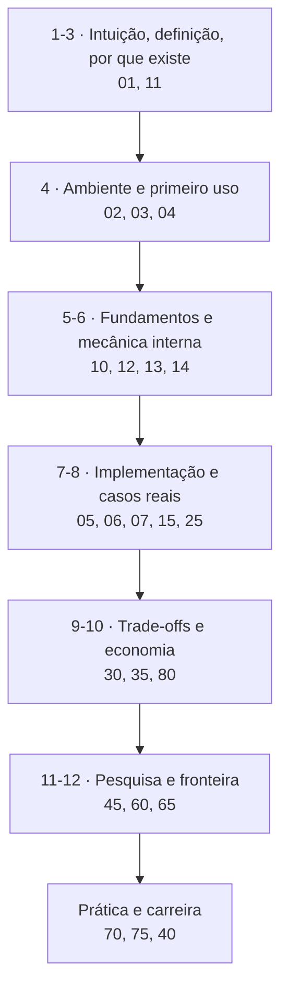

# Engenharia de Prompt — mapa do curso

**Do zero absoluto ao nível de pesquisa, em português.**
Escrito em 19/08/2026 · Ambiente de verificação: Python 3.10.12, Node v24.18.0

---

## O que é este material

Um curso completo sobre **engenharia de prompt** — o que é, o que o cargo
realmente exige em 2026, e como se tornar um profissional a partir do zero.

A tese que atravessa tudo:

> **O ativo não é o prompt. É a avaliação.** Prompt se reescreve numa tarde;
> um conjunto de casos rotulados por quem entende do negócio leva meses e não
> se copia de ninguém. Quem só sabe escrever texto perde valor a cada geração
> de modelo; quem sabe **definir e medir** ganha.

Metade do material é independente de fornecedor. Os exemplos usam a API da
Anthropic porque é preciso escolher uma; os conceitos valem para qualquer
modelo.

---

## O que você saberá ao final

- Explicar o que é engenharia de prompt sem jargão — e o que **não** é.
- Escrever prompt com papel, regras, exemplos e formato, e saber por que cada
  parte existe **mecanicamente**.
- Montar conjunto rotulado, arnês de avaliação e portão de CI — e dizer se uma
  diferença de métrica é significativa ou ruído.
- Extrair e validar saída estruturada com robustez de produção.
- Decidir o que entra na janela de contexto: RAG, recuperação medida,
  compactação.
- Controlar custo e latência: cache, cascata de modelos, lote, tamanho da saída.
- Defender o sistema: injeção direta e indireta, trinca letal, red team.
- Usar otimização automática de prompt (DSPy, GEPA) e saber quando não usar.
- Entender a teoria: por que o aprendizado em contexto funciona, por que a
  cadeia de pensamento **aumenta a classe de problemas solucionáveis**, e quais
  são os limites duros.
- Navegar a carreira com dado de mercado, portfólio e entrevista.

---

## Se você tem pouco tempo

| Tempo | Leia |
|---|---|
| **20 minutos** | [01-introducao-leigo](01-introducao-leigo.md) |
| **1 hora** | [01](01-introducao-leigo.md) + [04-como-comecar](04-como-comecar.md) |
| **1 dia** | Bloco A inteiro ([01](01-introducao-leigo.md)–[07](07-projeto-modelo/README.md)) |
| **1 semana** | Bloco A + [10](10-fundamentos.md), [12](12-anatomia-de-um-prompt.md), [13](13-tecnicas-nucleo.md), [20](20-avaliacao-e-evals.md) |
| **1 mês** | tudo, com os laboratórios do [70](70-pratica.md) |

**Se você só quer saber se vale a pena a carreira:**
[40-a-profissao](40-a-profissao.md) — leia antes de investir seis meses.

**Se você já trabalha com isso e quer o que falta:**
[20-avaliacao](20-avaliacao-e-evals.md), [30-custo](30-custo-latencia-caching.md),
[35-seguranca](35-seguranca-e-injecao.md), [45-otimizacao](45-otimizacao-automatica.md).

---

## Roteiro

### Bloco A · Porta de entrada

| # | Arquivo | Nível | O que tem |
|---|---|---|---|
| 01 | [introducao-leigo](01-introducao-leigo.md) | iniciante | a analogia do estagiário genial e amnésico; a definição em uma frase; o que **não** é |
| 02 | [pre-requisitos](02-pre-requisitos.md) | iniciante | o que saber e ter; tempo realista por nível; rota de resgate |
| 03 | [instalacao](03-instalacao.md) | iniciante | manual de campo: Python, uv, SDK, Node, promptfoo, DSPy, ollama, nos três SOs; PATH, permissões, proxy, desinstalação, 11 erros literais |
| 04 | [como-comecar](04-como-comecar.md) | iniciante | do ambiente pronto a JSON válido verificado; o ciclo do dia a dia; os 5 primeiros erros |
| 05 | [manual-de-uso](05-manual-de-uso.md) | iniciante → interm. | referência por tarefa; parâmetros da API; **tabela do obsoleto** |
| 06 | [exemplos](06-exemplos.md) | interm. → avançado | 12 casos com código de verificação executado, dois de produção |
| 07 | [projeto-modelo/](07-projeto-modelo/README.md) | interm. | `triador`: 3 versões de prompt, 22 casos rotulados, arnês de avaliação, 23 testes — **roda offline** |

### Bloco B · Núcleo

| # | Arquivo | Nível | O que tem |
|---|---|---|---|
| 10 | [fundamentos](10-fundamentos.md) | interm. | token, atenção, aprendizado em contexto, RLHF, amostragem, alucinação — o **porquê** de tudo |
| 11 | [historia](11-historia.md) | interm. | de 2017 a 2026; **quais técnicas envelheceram e por quê** |
| 12 | [anatomia-de-um-prompt](12-anatomia-de-um-prompt.md) | interm. | as sete partes dissecadas; prompt de produção comentado; ablação |
| 13 | [tecnicas-nucleo](13-tecnicas-nucleo.md) | interm. → avanç. | ficha de cada técnica: mecanismo, ganho, custo, modo de falha, status |
| 14 | [saida-estruturada](14-saida-estruturada.md) | interm. | esquema, decodificação restrita, 4 camadas de validação, 5 modos de falha |
| 15 | [contexto-e-rag](15-contexto-e-rag.md) | interm. → avanç. | orçamento de contexto, fatiamento, busca híbrida, **Recall@k**, degradação |
| 20 | [avaliacao-e-evals](20-avaliacao-e-evals.md) ⭐ | interm. → avanç. | o núcleo: conjunto rotulado, métricas, **intervalo de confiança**, juiz calibrado, CI, produção |
| 25 | [ferramentas-e-agentes](25-ferramentas-e-agentes.md) | avançado | descrição de ferramenta como prompt, política de parada, avaliação de agente |
| 30 | [custo-latencia-caching](30-custo-latencia-caching.md) | interm. → avanç. | preços datados, calculadora executada, cache por prefixo, invalidadores silenciosos |
| 35 | [seguranca-e-injecao](35-seguranca-e-injecao.md) | avançado | injeção direta e indireta, **trinca letal**, medidas que funcionam, 12 ataques |
| 40 | [a-profissao](40-a-profissao.md) | todos | o cargo real, mercado com números datados, plano de 6 meses, portfólio, entrevista, riscos |
| 45 | [otimizacao-automatica](45-otimizacao-automatica.md) | avançado → pesq. | otimizador de brinquedo executado, DSPy, GEPA, limites |
| 60 | [teoria-avancada](60-teoria-avancada.md) | pesquisa | por que o ICL funciona (3 hipóteses), CoT e classes de complexidade, fragilidade a formato, limites duros |
| 65 | [estado-da-arte](65-estado-da-arte.md) | avançado → pesq. | as três eras, fronteira ativa, movimentos de mercado de 2026, previsões marcadas |

### Bloco C · Prática e erros

| # | Arquivo | O que tem |
|---|---|---|
| 70 | [pratica](70-pratica.md) | 14 laboratórios progressivos, com critério de sucesso e armadilha esperada |
| 75 | [armadilhas](75-armadilhas.md) | 25 armadilhas + 12 mitos + por que as más práticas persistem |

### Bloco D · Economia e ecossistema

| # | Arquivo | O que tem |
|---|---|---|
| 80 | [custos-e-licencas](80-custos-e-licencas.md) | preços de 19/08/2026 em USD e BRL, licenças, 9 custos ocultos, quem paga o gratuito |
| 85 | [cursos-e-certificacoes](85-cursos-e-certificacoes.md) | cursos gratuitos PT/EN/FR pesquisados na web; a verdade sobre certificações |

### Bloco E · Fontes

| # | Arquivo | O que tem |
|---|---|---|
| 90 | [bibliografia](90-bibliografia.md) | livros com edição conferida, o que é legalmente gratuito, o que **não** ler |
| 95 | [referencias](95-referencias.md) | documentação oficial, papers com ID conferido, código para ler, pessoas |
| — | [GLOSSARIO](GLOSSARIO.md) | ~77 verbetes |

---

## A curva de profundidade

---

## O que foi verificado (e não apenas escrito)

| Verificação | Resultado |
|---|---|
| Projeto-modelo executado | `avaliar.py`: v1 0% · v2 82% · v3 91% (22 casos, provedor simulado) |
| Suíte de testes | **23/23 aprovados**, Python 3.10.12 |
| Trechos de código dos arquivos 06, 14, 20, 30, 45 | **todos executados**; as saídas publicadas são as reais |
| Versões de ferramentas | conferidas na web em 19/08/2026 (PyPI, npm, nodejs.org, python.org) |
| Preços | conferidos em 19/08/2026, com câmbio do dia (US$ 1 ≈ R$ 5,22) |
| Cursos PT/EN/FR | pesquisados na web em 19/08/2026 |
| Papers | IDs arXiv publicados **só onde conferidos**; os demais citados por autor e título |

**Achados que contrariam o folclore da área**, registrados como medição:

1. No otimizador do [45](45-otimizacao-automatica.md), a busca gulosa **cai numa
   armadilha real**: adota cedo a cadeia de pensamento (melhor ganho isolado) e
   termina com 98% a 570 tokens, quando existia 99% a **480 tokens**. É o mesmo
   erro de quem otimiza prompt à mão, um item por vez.
2. No [06, exemplo 10](06-exemplos.md), a seleção de exemplos por sobreposição
   de palavras escolhe **um** exemplo relevante em três — demonstração concreta
   de por que sistemas reais usam embeddings.
3. Dois erros do projeto-modelo **sobrevivem** ao few-shot, e por motivos
   diferentes: um pede regra nova, outro pede exemplo novo. Distinguir os dois
   é metade do ofício.

---

## Status

| A | B | C | D | E | Glossário |
|---|---|---|---|---|---|
| ✅ | ✅ | ✅ | ✅ | ✅ | ✅ |

**Manutenção sugerida:** reavaliar [65](65-estado-da-arte.md) e
[80](80-custos-e-licencas.md) a cada 6 meses; [03](03-instalacao.md) a cada 6
meses; [85](85-cursos-e-certificacoes.md) e [40](40-a-profissao.md) a cada ano.
