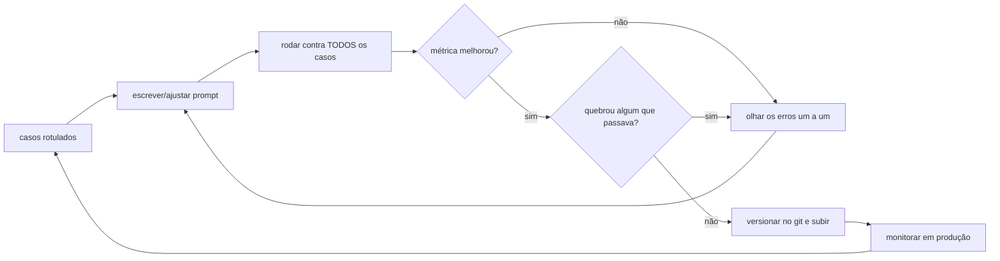

# 4 · Como começar — do ambiente pronto ao primeiro resultado

**Nível:** iniciante · **Escrito em:** 19/08/2026

Este arquivo supõe o ambiente do [03-instalacao](03-instalacao.md) pronto —
ou, se você optou por não instalar nada, uma aba aberta no
[Console Workbench](https://console.anthropic.com/workbench) ou no
[Google AI Studio](https://aistudio.google.com/).

---

## O "olá mundo" que vale alguma coisa

O "olá mundo" da engenharia de prompt **não** é fazer o modelo dizer olá. É
fazer o modelo produzir **dado utilizável por programa** e você **conferir**
que ele produziu.

Meta desta seção: em 10 minutos, uma saída JSON válida, verificada.

### Passo 1 — o prompt ruim, de propósito

Abra o Workbench (ou seu terminal) e mande:

```
Extraia o nome, o e-mail e a empresa deste texto:
"Oi, aqui é a Marina Alves da Vetorial Sistemas, meu contato é
marina.alves@vetorial.com.br. Podemos falar amanhã?"
```

Resposta típica:

```
Claro! Aqui estão as informações extraídas:

- **Nome:** Marina Alves
- **E-mail:** marina.alves@vetorial.com.br
- **Empresa:** Vetorial Sistemas

Precisa de mais alguma coisa?
```

Está certo. E é **inútil** para um programa: veio em markdown, com conversa em
volta, e amanhã pode vir em tabela.

### Passo 2 — o mesmo pedido, especificado

```
Extraia nome, e-mail e empresa do texto abaixo.

Responda com apenas o JSON, sem texto antes ou depois, neste formato exato:
{"nome": "...", "email": "...", "empresa": "..."}

Se algum campo não estiver no texto, use null.

<texto>
Oi, aqui é a Marina Alves da Vetorial Sistemas, meu contato é
marina.alves@vetorial.com.br. Podemos falar amanhã?
</texto>
```

Resposta:

```json
{"nome": "Marina Alves", "email": "marina.alves@vetorial.com.br", "empresa": "Vetorial Sistemas"}
```

Quatro coisas mudaram, e cada uma tem um nome que você vai usar o resto da vida:

| O que você fez | Nome técnico | O que evita |
|---|---|---|
| descreveu o formato exato | **especificação de saída** | markdown, prosa, formato variável |
| disse "apenas o JSON, sem texto antes ou depois" | **supressão de preâmbulo** | "Claro! Aqui está..." |
| separou o dado com `<texto>...</texto>` | **delimitação** | o modelo confundir instrução com conteúdo |
| definiu o que fazer com campo ausente | **tratamento do caso vazio** | invenção (o modelo preenche o buraco) |

### Passo 3 — verificar de verdade

Não confie no olho. Passe pelo validador:

```bash
python3 -c '
import json, sys
bruto = sys.stdin.read()
try:
    d = json.loads(bruto)
except json.JSONDecodeError as e:
    print("INVÁLIDO:", e); raise SystemExit(1)
faltando = [c for c in ("nome","email","empresa") if c not in d]
print("VÁLIDO" if not faltando else f"campos faltando: {faltando}")
' <<'JSON'
{"nome": "Marina Alves", "email": "marina.alves@vetorial.com.br", "empresa": "Vetorial Sistemas"}
JSON
# esperado: VÁLIDO
```

Cole a resposta do modelo aí no lugar. Se der `INVÁLIDO`, o problema é do
prompt, não do modelo — volte ao passo 2.

**Este é o ciclo inteiro do ofício, em miniatura:** pedir → receber →
**validar automaticamente** → corrigir o pedido.

---

## O mesmo, por código

Com o ambiente da [§4 do manual de instalação](03-instalacao.md#4--sdk-da-anthropic):

```python
# extrair.py — extração com validação. Roda com: python3 extrair.py
import json
import anthropic

SISTEMA = """Você extrai contatos de mensagens.

Responda com apenas o JSON, sem texto antes ou depois:
{"nome": "...", "email": "...", "empresa": "..."}

Use null para campo ausente. Não invente dado que não está no texto."""

TEXTO = ("Oi, aqui é a Marina Alves da Vetorial Sistemas, "
         "meu contato é marina.alves@vetorial.com.br. Podemos falar amanhã?")

cliente = anthropic.Anthropic()          # lê ANTHROPIC_API_KEY do ambiente

resposta = cliente.messages.create(
    model="claude-opus-5",
    max_tokens=256,
    system=SISTEMA,                      # instrução estável fica aqui
    messages=[{"role": "user", "content": f"<texto>\n{TEXTO}\n</texto>"}],
)

bruto = resposta.content[0].text
print("bruto:", bruto)

dados = json.loads(bruto)                # se estourar aqui, o prompt falhou
assert set(dados) == {"nome", "email", "empresa"}, f"campos inesperados: {dados}"
print("ok:", dados["email"])
```

```bash
python3 extrair.py
# esperado:
# bruto: {"nome": "Marina Alves", "email": "marina.alves@vetorial.com.br", "empresa": "Vetorial Sistemas"}
# ok: marina.alves@vetorial.com.br
```

Repare em três decisões que já são de profissional:

1. **A instrução vai em `system`, o dado vai em `messages`.** Separar os dois é
   o primeiro passo da defesa contra injeção de prompt ([35](35-seguranca-e-injecao.md))
   e o que permite usar cache ([30](30-custo-latencia-caching.md)).
2. **`json.loads` sem `try`, de propósito, no exemplo de estudo.** Em produção
   você trata o erro (o [projeto-modelo](07-projeto-modelo/triador.py) trata);
   aqui, você *quer* que ele estoure, para ver quando o prompt falha.
3. **`assert` no formato.** Verificação é código, não intenção.

---

## O ciclo de trabalho do dia a dia



Duas regras que valem mais que qualquer técnica:

> **Mude uma coisa por vez.** Se você alterou o papel, acrescentou dois
> exemplos e mudou o formato de saída na mesma rodada, e a métrica subiu, você
> não sabe o que funcionou — e não sabe o que remover quando o custo apertar.

> **Sempre releia os erros individualmente.** A métrica agregada diz *quanto*.
> Só o caso errado diz *por quê*. Uma hora lendo 20 saídas erradas vale mais
> que uma semana de teorização.

---

## Os cinco primeiros erros de uso (não de instalação)

### 1. Testar com um caso só

Você ajusta o prompt, o caso passa, você comemora. No dia seguinte, produção
quebra em três casos parecidos. **Correção:** mínimo de 20 casos desde o
primeiro dia. Vinte, escritos à mão em 30 minutos, mudam tudo. Ver
[20-avaliacao-e-evals](20-avaliacao-e-evals.md).

### 2. Achar que o modelo "entendeu" o formato

Ele produziu JSON três vezes seguidas, então você para de validar. Na quarta,
vem uma cerca de markdown em volta e o `json.loads` estoura em produção.
**Correção:** valide **sempre**, programaticamente, e trate a falha.

### 3. Escrever a instrução em negação

"Não seja prolixo", "não invente", "não use markdown". Instrução negativa
funciona pior que a positiva equivalente, porque descreve o que evitar sem
descrever o alvo. **Correção:** "Responda em no máximo 2 frases", "Use apenas
informação presente no texto; se não houver, escreva null", "Responda com
apenas o JSON".

### 4. Enterrar a instrução no meio de um texto enorme

Você cola 40 páginas de documento e escreve a pergunta no fim, sem separador.
A instrução se dilui. **Correção:** documento dentro de `<documento>...
</documento>`, instrução **fora**, e — para textos longos — instrução
**repetida no fim**, que é onde a atenção do modelo é mais forte.

### 5. Mexer no prompt sem versionar

Três dias depois, ficou pior e você não lembra o que mudou. **Correção:**
prompt em arquivo, no git, um commit por alteração, com a métrica no corpo da
mensagem: `prompt: fecha lista de categorias — ambos 82%→91% (22 casos)`.

---

## Verificação: você chegou lá?

- [ ] Obteve JSON válido do modelo, sem texto em volta.
- [ ] Validou a saída por programa, não por leitura.
- [ ] Conseguiu explicar, sem olhar, o que "delimitação" resolve.
- [ ] Rodou o mesmo prompt duas vezes e observou se a resposta mudou.
- [ ] Salvou o prompt em um arquivo `.md` versionado.

---

## Para onde ir agora

| Você quer | Vá para |
|---|---|
| a referência de técnicas, para consultar | [05-manual-de-uso](05-manual-de-uso.md) |
| ver 12 casos resolvidos, do trivial ao real | [06-exemplos](06-exemplos.md) |
| um sistema inteiro que roda e se mede | [07-projeto-modelo](07-projeto-modelo/README.md) |
| entender **por que** isso funciona | [10-fundamentos](10-fundamentos.md) |

---

## Autoteste

1. Por que a primeira resposta, apesar de correta, era inútil?
2. Nomeie as quatro mudanças do passo 2 e o que cada uma evita.
3. Por que a instrução vai em `system` e o dado em `messages`?
4. Por que "não seja prolixo" funciona pior que "responda em 2 frases"?
5. Onde colocar a instrução quando o texto de entrada tem 40 páginas, e por quê?
6. Qual é a regra sobre mudar várias coisas por vez, e qual é o custo prático
   de ignorá-la?
