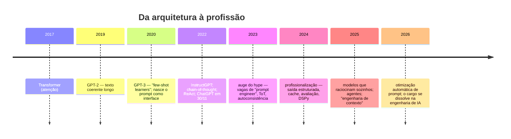

# 11 · História — como um pedaço de texto virou profissão

**Nível:** intermediário · **Escrito em:** 19/08/2026

História aqui não é enfeite. Metade das técnicas que circulam na internet são
**fósseis**: funcionaram numa geração de modelo e continuam sendo ensinadas.
Saber em que ano cada ideia nasceu, e contra qual modelo, é como você separa o
que vale do que virou folclore.

---

## Linha do tempo

---

## Antes: o que existia e por que não bastava

Até ~2018, fazer um computador executar tarefa de linguagem exigia **treinar um
modelo por tarefa**: um para análise de sentimento, outro para tradução, outro
para extração. Cada um pedia milhares de exemplos rotulados, semanas de
trabalho e uma equipe de aprendizado de máquina.

O **Transformer** (Vaswani et al., 2017) mudou a arquitetura, e o **GPT-2**
(OpenAI, fevereiro de 2019) mostrou que um modelo grande treinado só para
prever o próximo token escrevia texto coerente por parágrafos.

## 2020 — o nascimento acidental do prompt

O paper do **GPT-3** (Brown et al., maio/junho de 2020) tem um título que
explica tudo: *"Language Models are Few-Shot Learners"*. A descoberta central
não foi o tamanho: foi que, **colocando exemplos no próprio texto de entrada**,
o modelo executava tarefas para as quais não havia sido treinado — sem nenhum
ajuste de pesos.

Isso inverteu a economia da área. Em vez de "colete 10 mil exemplos e treine
por duas semanas", passou a ser "escreva três exemplos no prompt e teste em 30
segundos". O ciclo de iteração encurtou em cinco ordens de grandeza.

E criou o problema que sustenta esta profissão: **como se escreve esse texto de
entrada para obter o comportamento desejado?** Ninguém sabia. Descobriu-se
tentando — o que, na prática, quer dizer: sem método, e por muito tempo.

## 2021–2022 — as primeiras técnicas com nome

- **Ajuste de prompt** (*prompt tuning*, Lester et al., 2021): otimizar vetores
  contínuos anexados à entrada, em vez de escrever texto. Linha de pesquisa
  importante, pouco usada na prática de aplicação — mas é a avó intelectual da
  otimização automática de hoje ([45](45-otimizacao-automatica.md)).
- **InstructGPT** (Ouyang et al., março de 2022): treinar com preferência
  humana para que o modelo **siga instrução**. Sem esta etapa, "prompt" seria
  só "começo de um texto"; com ela, virou "comando". É a origem técnica da
  obediência que você usa todo dia ([10 §10.5](10-fundamentos.md)).
- **Cadeia de pensamento** (*chain-of-thought*, Wei et al., janeiro de 2022):
  pedir "pense passo a passo" melhorava dramaticamente problemas de raciocínio.
  Foi a técnica mais citada da década — e é a que mais envelheceu.
- **Autoconsistência** (Wang et al., 2022): gerar várias cadeias e votar na
  resposta mais frequente. Cara, e eficaz.
- **ReAct** (Yao et al., outubro de 2022): alternar raciocínio e ação com
  ferramentas. É o ancestral direto de todo agente de 2026
  ([25](25-ferramentas-e-agentes.md)).

## 30 de novembro de 2022 — ChatGPT

O modelo por trás não era novo. O que mudou foi a **interface**: qualquer
pessoa, sem API, sem cartão, sem código, podia escrever um prompt. Cem milhões
de usuários em dois meses.

Efeito colateral para esta profissão: **milhões de pessoas descobriram
simultaneamente que a forma de perguntar muda a resposta** — e concluíram, sem
método, que existiam "fórmulas". Nasceu a indústria de "1000 prompts
infalíveis".

## 2023 — o auge do hype e a bolha do cargo

Foi o ano das manchetes: "a profissão do futuro", "ganhe US$ 300 mil sem saber
programar". A vaga da Anthropic para *Prompt Engineer and Librarian*, com faixa
divulgada de US$ 175 mil a 335 mil, virou o símbolo — repetida em toda
reportagem, quase sempre sem mencionar que a descrição pedia experiência sólida
de engenharia.

No mesmo ano, a pesquisa avançou de verdade: **Árvore de Pensamentos**
(*Tree of Thoughts*, maio de 2023), **perdido no meio** (Liu et al., julho de
2023), e a consolidação de guias abertos como o *Prompt Engineering Guide*
(DAIR.AI) e o Learn Prompting.

E surgiu o primeiro sintoma de maturidade: **as técnicas paravam de funcionar
quando o modelo era trocado**. Quem tinha coleção de frases mágicas descobriu
que a coleção era específica de uma versão de um modelo.

## 2024 — a profissionalização

O ano em que a área deixou de ser escrita e virou engenharia:

| Mudança | Consequência prática |
|---|---|
| **Saída estruturada** garantida pela API | acabou a ginástica de implorar por JSON |
| **Cache de prompt** | ordem do prompt virou decisão de custo |
| **Avaliação** como disciplina (promptfoo, ferramentas de traço) | "eu acho que melhorou" deixou de ser aceitável |
| **DSPy** (Khattab et al., a partir de 2023, popularizado em 2024) | prompt como programa compilável, não texto artesanal |
| Livros sérios — *Prompt Engineering for LLMs* (O'Reilly, nov/2024) | o conhecimento saiu do fio de rede social |

## 2025 — os modelos passam a raciocinar sozinhos

A geração de modelos com raciocínio nativo (pensamento estendido embutido)
tornou **obsoleta boa parte do arsenal de 2022–2023**. Pedir "pense passo a
passo" a um modelo que já pensa por conta própria não acrescenta nada — e às
vezes atrapalha, por conflitar com o processo interno dele.

Ao mesmo tempo, o problema mudou de lugar. Com agentes de múltiplos passos e
janelas de centenas de milhares de tokens, a pergunta difícil deixou de ser
"como escrevo esta frase?" e passou a ser **"o que deve estar na janela de
contexto neste passo, e o que deve sair?"**. O termo **engenharia de contexto**
se popularizou em meados de 2025 e descreve melhor o trabalho de hoje.

## 2026 — otimização automática e a dissolução do cargo

Dois movimentos simultâneos, e eles se explicam mutuamente:

1. **O prompt deixou de ser escrito à mão nos casos que importam.** O **GEPA**
   (*Reflective Prompt Evolution*, arXiv 2507.19457, aceito como *oral* no
   ICLR 2026) mostrou que evolução reflexiva de prompt supera aprendizado por
   reforço em vários domínios usando até 35× menos execuções, e supera o
   otimizador MIPROv2 por mais de 10%. Quando existe métrica, a máquina otimiza
   o prompt melhor que você.
2. **O cargo "prompt engineer" se dissolveu dentro de "engenheiro de IA".**
   Muitas vagas abertas com esse título são reintituladas antes de fechar. O
   que não sumiu — e triplicou desde 2024 — foi a **exigência da habilidade**
   dentro de vagas de engenharia. Ver [40-a-profissao](40-a-profissao.md).

Marcos de mercado de 2026, com data: a **Anthropic Academy** abriu em
02/03/2026 com cursos e certificados gratuitos; a **OpenAI anunciou a aquisição
do promptfoo** em 09/03/2026 — a principal ferramenta aberta de avaliação de
prompt passou a pertencer a um fornecedor de modelos.

---

## O que a história ensina (a parte que importa)

**1. Toda técnica tem prazo de validade atrelado a uma geração de modelo.**

| Técnica | Nasceu | Situação em 08/2026 |
|---|---|---|
| Exemplos no prompt (*few-shot*) | 2020 | **vale**, é a mais duradoura |
| "Pense passo a passo" | 2022 | superada pelo pensamento nativo |
| Autoconsistência (votação) | 2022 | nicho: cara, só quando o erro é caríssimo |
| ReAct | 2022 | absorvida pelo uso de ferramentas da API |
| *Prefill* de resposta | 2023 | **removida**: erro 400 nos modelos novos |
| "Respire fundo" / gorjeta | 2023 | ruído |
| Saída estruturada | 2024 | **vale**, padrão |
| Cache de prompt | 2024 | **vale**, obrigatório em escala |
| Avaliação sistemática | 2024 | **vale**, é o núcleo da profissão |
| Engenharia de contexto | 2025 | **vale**, é o problema central hoje |
| Otimização automática | 2023→2026 | **vale**, e cresce |

**2. O que nunca envelheceu.** Em toda geração, sem exceção, continuou valendo:
especificar com precisão, dar exemplos bons, delimitar o dado, definir o
formato, e **medir**. Se você só puder guardar uma coisa da história, guarde
esta: as técnicas que sobreviveram são as que reduzem ambiguidade, não as que
tentam persuadir o modelo.

**3. A direção da tendência.** Cada geração de modelo absorve as técnicas da
anterior e as torna desnecessárias. A parte do trabalho que **não** é absorvida
— definir o que é sucesso, montar o conjunto de avaliação, decidir o que entra
no contexto, controlar custo e risco — é onde a profissão foi se alojar. Aposte
sua carreira aí, não na coleção de frases.

---

## Autoteste

1. Qual descoberta do paper do GPT-3 criou a necessidade desta profissão?
2. Sem o InstructGPT, o que "prompt" significaria hoje?
3. Por que "pense passo a passo" perdeu força entre 2022 e 2026?
4. O que mudou em 2024 que transformou escrita em engenharia? Cite três itens.
5. O que é engenharia de contexto e por que ela deslocou o foco da redação?
6. O que o GEPA demonstrou, e qual é a implicação para quem escreve prompt à mão?
7. Cite duas técnicas de 2023 que hoje são ruído e uma que hoje é erro de API.
8. Qual é o núcleo que sobreviveu a todas as gerações?

---

### Fontes e datas

- Vaswani et al., *Attention Is All You Need*, 2017 — arXiv:1706.03762
- Brown et al., *Language Models are Few-Shot Learners*, 2020 — arXiv:2005.14165
- Lester et al., *The Power of Scale for Parameter-Efficient Prompt Tuning*, 2021 — arXiv:2104.08691
- Wei et al., *Chain-of-Thought Prompting*, 2022 — arXiv:2201.11903
- Ouyang et al., *Training language models to follow instructions* (InstructGPT), 2022 — arXiv:2203.02155
- Yao et al., *ReAct*, 2022 — arXiv:2210.03629
- Liu et al., *Lost in the Middle*, 2023 — arXiv:2307.03172
- Khattab et al., *DSPy*, 2023 — arXiv:2310.03714
- Agrawal et al., *GEPA: Reflective Prompt Evolution Can Outperform Reinforcement Learning*, arXiv:2507.19457 — aceito como **oral** no ICLR 2026 (verificado em 19/08/2026)
- Aquisição do promptfoo pela OpenAI, 09/03/2026 — <https://openai.com/index/openai-to-acquire-promptfoo/>
- Abertura da Anthropic Academy, 02/03/2026 — <https://anthropic.skilljar.com>
