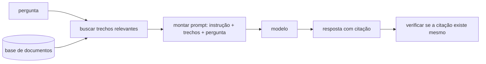

# 15 · Contexto e RAG — decidir o que entra na janela

**Nível:** intermediário → avançado · **Escrito em:** 19/08/2026

Em 2026, esta é **a** parte difícil do trabalho. A redação da instrução está
resolvida; o que separa um sistema que funciona de um que não funciona é o que
está na janela de contexto no momento da chamada.

---

## 15.1 · O orçamento de contexto

Toda chamada tem um orçamento. Ele parece grande (1 milhão de tokens nos
modelos de 2026) e é enganoso, porque há quatro impostos sobre ele:

| Imposto | Efeito |
|---|---|
| **Dinheiro** | você paga por token de entrada, em toda chamada |
| **Latência** | tempo até o primeiro token cresce com a entrada |
| **Diluição** | conteúdo irrelevante compete por atenção com o relevante |
| **Risco** | todo texto de terceiro no contexto é vetor de injeção ([35](35-seguranca-e-injecao.md)) |

Daí a formulação correta do problema:

> Dado um orçamento de N tokens, **quais** trechos maximizam a chance de a
> resposta estar certa?

Isso é um problema de recuperação de informação, não de escrita. É por isso
que a disciplina passou a se chamar **engenharia de contexto**.

---

## 15.2 · RAG em uma página

**RAG** (*Retrieval-Augmented Generation*, geração aumentada por recuperação):
em vez de pôr toda a base no prompt, você **busca** os trechos relevantes e põe
só eles.



**Por que não colocar tudo, se cabe?** Quatro motivos, na ordem em que doem:
custo (você paga a base inteira em toda pergunta), latência, diluição, e
segurança. E um quinto que só aparece depois: **manutenção** — uma base que
cabe hoje não cabe em um ano.

---

## 15.3 · As decisões que realmente importam

### Fatiamento (*chunking*)

| Estratégia | Quando |
|---|---|
| tamanho fixo (ex.: 500 tokens) com sobreposição de ~10% | corpus homogêneo, primeira versão |
| por estrutura (seção, artigo, cláusula, função) | **quase sempre melhor** — respeita a fronteira semântica |
| por documento inteiro | documentos curtos (FAQ, ficha de produto) |
| hierárquico (trecho + resumo do documento pai) | corpora grandes com muito contexto implícito |

**O erro clássico:** cortar no meio de uma tabela, de um artigo de lei ou de um
bloco de código. O trecho recuperado vira nonsense e o modelo, coerentemente,
responde nonsense. **Sempre olhe 20 trechos gerados pelo seu fatiador com os
próprios olhos** antes de confiar nele — é 20 minutos que economiza semanas.

### Busca

| Tipo | Como | Bom em | Ruim em |
|---|---|---|---|
| **Léxica** (BM25) | palavras em comum | termos exatos, códigos, nomes próprios, siglas | sinônimo e paráfrase |
| **Densa** (embeddings) | proximidade de sentido em espaço vetorial | paráfrase, pergunta em linguagem natural | termo exato, número de série |
| **Híbrida** | soma das duas, com pesos | ✅ é o padrão que eu recomendo | exige mais infraestrutura |
| **Reranking** | um modelo reordena os 50 melhores candidatos | ganho grande de precisão | custo e latência extras |

> **Embedding** é um vetor de números que representa o sentido de um trecho.
> Textos com sentido parecido ficam próximos no espaço. É o que permite a busca
> "por significado" — e é também por isso que o exemplo 10 do
> [06](06-exemplos.md), que usa só sobreposição de palavras, escolhe exemplos
> ruins: sem embedding, "boleto" e "cobrado" não têm nenhuma relação.

### Quantos trechos?

Comece com 3 a 5 e **meça**. Mais trechos aumentam a chance de a resposta estar
presente (recall) e aumentam o ruído. Existe um ponto ótimo, ele é específico
do seu corpus, e você só o encontra medindo.

---

## 15.4 · Avaliar recuperação separadamente da geração

Esta é a parte que quase todo mundo pula, e é a que resolve o problema.

Um sistema RAG erra por dois motivos independentes:

1. **A recuperação não trouxe o trecho certo.** Nenhum prompt salva.
2. **Trouxe, e o modelo respondeu errado assim mesmo.**

Se você mede só a resposta final, não sabe qual dos dois é. Meça os dois:

| Métrica | O que responde | Como medir |
|---|---|---|
| **Recall@k** | o trecho certo está entre os k recuperados? | anote, para cada pergunta do conjunto, qual trecho contém a resposta |
| **Precisão dos trechos** | quanto do que veio é lixo? | proporção de trechos relevantes entre os recuperados |
| **Fidelidade** (*faithfulness*) | a resposta se apoia nos trechos? | verificar cada afirmação contra os trechos |
| **Correção** | a resposta está certa? | comparação com o gabarito |

Regra que economiza meses: **se o Recall@5 é 60%, mexer no prompt é perda de
tempo.** O teto do seu sistema é 60%. Conserte a busca.

---

## 15.5 · Montar o contexto

Ordem que funciona, e o porquê de cada posição:

```
1. instrução, papel, regras          ← estável, cacheável, e define o quadro
2. exemplos                          ← estável, cacheável
3. trechos recuperados, numerados    ← volátil; numerados para permitir citação
4. histórico relevante da conversa   ← volátil
5. a pergunta                        ← por último: recência
```

Detalhes que mudam o resultado:

- **Numere e rotule os trechos:** `<trecho id="7" fonte="politica-reembolso.md">`.
  Sem id, você não consegue exigir citação verificável.
- **Exija citação e verifique.** "Cite o `id` de cada afirmação" — e um
  programa confere se o id existe e se o texto citado está mesmo lá. Sem a
  verificação, a citação também pode ser inventada.
- **Ordem dos trechos:** o mais relevante por último costuma ir melhor
  (recência), embora o efeito seja pequeno nos modelos de 2026. Meça.
- **Diga o que fazer quando não houver resposta nos trechos.** Sem isso, o
  modelo preenche com conhecimento próprio — e você perde a rastreabilidade,
  que era o ponto do RAG.

---

## 15.6 · Conversas longas: as três estratégias

Quando o histórico cresce além do orçamento:

| Estratégia | O que faz | Perde | Quando |
|---|---|---|---|
| **Janela deslizante** | mantém os N últimos turnos | tudo que é antigo, inclusive o pedido original | conversa curta e local |
| **Sumarização/compactação** | resume o histórico antigo em um bloco | detalhe e literalidade | conversa longa de atendimento |
| **Memória externa** | grava fatos num armazenamento e recupera sob demanda | complexidade | agentes de longa duração |

Duas armadilhas conhecidas:

- **Compactar destrói o cache.** O prefixo mudou; a próxima chamada paga tudo
  de novo. Compacte em pontos definidos, não a cada turno.
- **O que foi resumido não volta.** Se o resumo perdeu o número do pedido, o
  número sumiu para sempre. Extraia os **fatos-chave para campos estruturados**
  antes de resumir o resto.

---

## 15.7 · A degradação por contexto longo

Nome informal: *context rot*. Sintoma: um agente que ia bem começa a repetir
ações, ignorar instruções do começo e "esquecer" o objetivo depois de muitos
turnos.

Causas reais, todas mensuráveis:

1. **Diluição de atenção** — a instrução inicial é 1% do contexto e disputa
   com 99% de histórico.
2. **Contradição acumulada** — o histórico contém tentativas erradas, e elas
   agora são exemplos do que fazer.
3. **Ruído de ferramenta** — saídas volumosas (logs, HTML, JSON gigante)
   ocupam a janela sem contribuir.

Contramedidas, em ordem de eficácia:

1. **Podar saídas de ferramenta** antes de inserir (truncar log, extrair só o
   campo relevante).
2. **Repetir o objetivo e as regras críticas** periodicamente, perto do fim.
3. **Limpar tentativas fracassadas** do histórico em vez de arrastá-las.
4. **Compactar** com estrutura, preservando fatos em campos.
5. **Reiniciar** com um resumo estruturado — é o mais eficaz e o mais
   subutilizado.

Ver [agentes-de-ia §contexto e compactação](../agentes-de-ia/14-contexto-memoria-compactacao.md).

---

## 15.8 · Quando **não** usar RAG

| Situação | Alternativa |
|---|---|
| a base cabe folgada e muda pouco | ponha tudo no prompt e **cacheie** — mais simples e frequentemente mais barato |
| a resposta exige agregação ("quantos contratos vencem em setembro?") | consulta a banco de dados, não busca semântica |
| a base é um banco relacional | gere SQL ([06, exemplo 6](06-exemplos.md)), não embeddings |
| você precisa de garantia de completude | busca por similaridade **não** garante que trouxe tudo |

A última linha é a mais importante para quem trabalha com documento jurídico ou
regulatório: **RAG não prova que não existe um trecho relevante que ficou de
fora**. Para "encontrei todas as cláusulas que tratam de X", você precisa de
varredura completa, não de recuperação por similaridade.

---

## Autoteste

1. Se cabe 1 milhão de tokens, por que não colocar a base inteira? Dê quatro
   motivos.
2. Qual é o erro clássico de fatiamento e como você o detecta em 20 minutos?
3. Busca léxica e densa: em que cada uma é boa e em que é ruim?
4. Seu Recall@5 é 60%. Qual é o teto do sistema, e onde você **não** deve
   trabalhar?
5. Por que numerar os trechos, e por que verificar a citação por programa?
6. Cite duas armadilhas da compactação de histórico.
7. Liste três causas da degradação por contexto longo e a contramedida mais
   eficaz.
8. Em que situação RAG é a ferramenta errada — e por quê, no caso jurídico?
