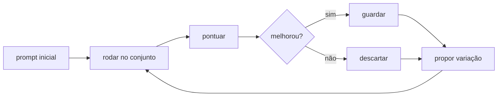

# 45 · Otimização automática — quando a máquina escreve o prompt

**Nível:** avançado → pesquisa · **Escrito em:** 19/08/2026

> **A pergunta que organiza este arquivo:** se você tem uma métrica, por que
> está escrevendo prompt à mão?

---

## 45.1 · A ideia

Escrever prompt à mão é **busca manual num espaço enorme**. Você tenta uma
variação, mede, tenta outra. É exatamente o tipo de tarefa que computadores
fazem melhor que gente — **desde que exista uma função de pontuação**.



O que muda entre os métodos é **como se propõe a variação** e **como se decide
o que guardar**.

**E o pré-requisito é absoluto:** sem conjunto de avaliação e métrica, nada
disso funciona. É por isso que [20-avaliacao](20-avaliacao-e-evals.md) vem
antes — a otimização automática é o retorno do investimento que você fez lá.

---

## 45.2 · Um otimizador de brinquedo, completo

Busca gulosa sobre "ingredientes" de prompt. Roda em Python puro, sem API:

```python
# otimizador.py — busca gulosa por composição de prompt. python3 otimizador.py
import itertools

# Cada ingrediente tem um custo em tokens e um efeito (desconhecido do
# otimizador) sobre a pontuação. Em uso real, "pontuar" chamaria o modelo
# no conjunto rotulado; aqui a função é simulada para o exemplo rodar sozinho.
INGREDIENTES = {
    "papel":      {"tokens": 20},
    "categorias": {"tokens": 60},
    "regras":     {"tokens": 80},
    "exemplos":   {"tokens": 300},
    "formato":    {"tokens": 40},
    "cortesia":   {"tokens": 25},   # inútil: existe para ser podado
    "cot":        {"tokens": 150},  # raciocínio escrito: atrai cedo, atrapalha depois
}

def pontuar(combo: frozenset) -> float:
    """Simula a avaliação. Em produção: rodar o conjunto e devolver o acerto."""
    s = 0.30
    if "categorias" in combo: s += 0.30
    if "formato" in combo:    s += 0.20
    if "regras" in combo:     s += 0.10
    if "exemplos" in combo:   s += 0.09
    if "papel" in combo:      s += 0.02
    if "cot" in combo:        s += 0.22
    # interações — é o que engana quem otimiza um item por vez:
    if "cot" in combo and "formato" in combo: s -= 0.15  # brigam pelo formato da saída
    if "cot" in combo and "regras" in combo:  s -= 0.10  # instruções concorrentes
    return round(min(s, 0.99), 4)

def custo(combo: frozenset) -> int:
    return sum(INGREDIENTES[i]["tokens"] for i in combo)

def busca_gulosa():
    atual, historico = frozenset(), []
    while True:
        candidatos = [atual | {i} for i in INGREDIENTES if i not in atual]
        if not candidatos:
            break
        melhor = max(candidatos, key=pontuar)
        if pontuar(melhor) <= pontuar(atual):
            break                      # nenhum acréscimo ajuda: pare
        atual = frozenset(melhor)
        historico.append((sorted(atual), pontuar(atual), custo(atual)))
    return atual, historico

TODOS = list(INGREDIENTES)
COMBOS = [frozenset(c) for r in range(len(TODOS) + 1)
          for c in itertools.combinations(TODOS, r)]

def busca_exaustiva():
    return max(COMBOS, key=lambda c: (pontuar(c), -custo(c)))

final, hist = busca_gulosa()
print("busca gulosa, passo a passo:")
for combo, p, c in hist:
    print(f"  + {combo!s:<58} acerto={p:.0%} custo={c} tokens")

exaustiva = busca_exaustiva()
print(f"\nguloso   : {sorted(final)}\n           → {pontuar(final):.0%}, {custo(final)} tokens")
print(f"exaustivo: {sorted(exaustiva)}\n           → {pontuar(exaustiva):.0%}, {custo(exaustiva)} tokens")

# Pareto: o melhor acerto para cada teto de custo
print("\nfronteira de Pareto (acerto x custo):")
frente = []
for c in sorted(COMBOS, key=custo):
    if not frente or pontuar(c) > frente[-1][1]:
        frente.append((sorted(c), pontuar(c), custo(c)))
for combo, p, cst in frente:
    print(f"  {cst:>4} tokens → {p:.0%}  {combo}")
```

```bash
python3 otimizador.py
```

Saída real (19/08/2026) — leia com atenção ao que a busca **descartou**:

```
busca gulosa, passo a passo:
  + ['categorias']                                             acerto=60% custo=60 tokens
  + ['categorias', 'cot']                                      acerto=82% custo=210 tokens
  + ['categorias', 'cot', 'exemplos']                          acerto=91% custo=510 tokens
  + ['categorias', 'cot', 'exemplos', 'formato']               acerto=96% custo=550 tokens
  + ['categorias', 'cot', 'exemplos', 'formato', 'papel']      acerto=98% custo=570 tokens

guloso   : ['categorias', 'cot', 'exemplos', 'formato', 'papel']
           → 98%, 570 tokens
exaustivo: ['categorias', 'exemplos', 'formato', 'regras']
           → 99%, 480 tokens

fronteira de Pareto (acerto x custo):
     0 tokens → 30%  []
    20 tokens → 32%  ['papel']
    40 tokens → 50%  ['formato']
    60 tokens → 60%  ['categorias']
    80 tokens → 62%  ['categorias', 'papel']
   100 tokens → 80%  ['categorias', 'formato']
   120 tokens → 82%  ['categorias', 'formato', 'papel']
   180 tokens → 90%  ['categorias', 'formato', 'regras']
   200 tokens → 92%  ['categorias', 'formato', 'papel', 'regras']
   480 tokens → 99%  ['categorias', 'exemplos', 'formato', 'regras']
```

Quatro lições, todas transferíveis para o caso real:

1. **A busca gulosa caiu numa armadilha.** No segundo passo, `cot` era a melhor
   adição isolada (+22 pontos). Só que `cot` **conflita** com `formato` e com
   `regras` — e, uma vez dentro, nunca sai, porque o guloso só acrescenta.
   Resultado: 98% a 570 tokens, quando existia 99% a **480 tokens**. Este é
   exatamente o erro que se comete otimizando prompt à mão, um item por vez:
   você adota cedo algo que parece bom e depois passa meses lutando com os
   efeitos colaterais dele.
2. **`cortesia` nunca entrou em nada.** Uma parte de prompt que não move a
   métrica é podada automaticamente. À mão, ela ficaria lá para sempre.
3. **A fronteira de Pareto é o entregável mais útil**, não "o melhor prompt":
   180 tokens compram 90%; os 9 pontos seguintes custam 2,7× mais. Essa é uma
   decisão de negócio, não de engenharia — e você só consegue apresentá-la
   assim se tiver a frente inteira.
4. **Interações existem e são invisíveis item a item.** É por isso que a
   ablação ([12 §12.10](12-anatomia-de-um-prompt.md)) precisa ser refeita
   depois de mudanças grandes: o que valia sozinho pode parar de valer junto.

---

## 45.3 · Os métodos de verdade

### Metaprompting

Um modelo escreve o prompt para outro modelo (ou para si). O mais simples e o
mais acessível: dê a tarefa, o conjunto de erros e peça a versão nova.

- **Vale:** ponto de partida rápido; ótimo para gerar variações que você não
  pensaria.
- **Limite:** sem métrica, é troca de opinião por opinião.

### DSPy

Framework do Stanford NLP (versão **3.3.0** em 19/08/2026, Python ≥ 3.10 e
< 3.15). A ideia central: **você declara a assinatura da tarefa** (entrada →
saída) e o framework **compila** um prompt otimizado.

```python
# Esqueleto conceitual — requer `pip install dspy` e uma chave de API.
import dspy

class Triar(dspy.Signature):
    """Classifica um chamado de suporte."""
    chamado: str = dspy.InputField()
    categoria: str = dspy.OutputField(desc="cobranca, bug, acesso ou duvida")

programa = dspy.Predict(Triar)

def metrica(exemplo, predito, traco=None):
    return exemplo.categoria == predito.categoria

otimizado = dspy.MIPROv2(metric=metrica).compile(
    programa, trainset=conjunto_de_treino)
```

O que os otimizadores fazem: escolhem **quais exemplos** entram no prompt,
reescrevem **as instruções**, e testam combinações no seu conjunto. Você para
de escrever texto e passa a escrever **assinaturas e métricas**.

### GEPA — evolução reflexiva

Publicado em 2025 (arXiv:2507.19457), **aceito como *oral* no ICLR 2026**.
Mecanismo: executa o sistema, **reflete em linguagem natural** sobre as
trajetórias (raciocínio, chamadas de ferramenta, saídas), diagnostica o
problema, propõe mutações do prompt e mantém uma **fronteira de Pareto** das
tentativas, em vez de seguir só a melhor.

Resultados relatados no paper: supera GRPO (aprendizado por reforço) em ~6% em
média e até 20%, com **até 35× menos execuções**; e supera o MIPROv2 em mais de
10%.

**Por que a fronteira de Pareto importa** — e essa é a ideia mais transferível
do trabalho: guardar só o melhor prompt leva a ótimos locais, porque prompts
diferentes acertam **casos diferentes**. Manter a frente preserva lições
complementares que depois se combinam. É exatamente o que o brinquedo do §45.2
imprime no fim.

### Gradientes textuais

Linha (TextGrad e derivados) que trata a crítica em linguagem natural como um
"gradiente": o erro é propagado de volta em forma de texto, e cada componente do
sistema é atualizado. Elegante conceitualmente; na prática, exige muitas
execuções.

---

## 45.4 · Quando vale e quando não vale

| Vale quando | Não vale quando |
|---|---|
| há métrica automática confiável | a qualidade só é julgável por humano |
| há ≥ 50 casos rotulados (idealmente centenas) | você tem 10 exemplos |
| o volume justifica o esforço | é um prompt usado três vezes por mês |
| o prompt será mantido por muito tempo | protótipo descartável |
| há orçamento de execuções | cada execução custa caro e o orçamento é apertado |

**Custo escondido:** otimizar consome **centenas a milhares de chamadas**. Faça
a conta antes: 500 execuções × 4.000 tokens de entrada em um modelo de US$ 5/M
≈ US$ 10 por rodada de otimização — barato. Com pensamento estendido e saída
longa, pode ser 20× isso.

---

## 45.5 · Os limites, e por que o cargo não some

1. **Alguém precisa definir a métrica.** Otimizador maximiza o que você mandou.
   Métrica errada → sistema otimizado para a coisa errada, com eficiência.
2. **Alguém precisa montar o conjunto.** É o ativo, e ninguém automatiza a
   rotulagem que depende de conhecimento de negócio.
3. **Superajuste é real.** O otimizador vai explorar peculiaridades do seu
   conjunto. Conjunto de validação separado é obrigatório aqui, não opcional.
4. **Prompt otimizado costuma ser ilegível.** Ele funciona e ninguém sabe
   explicar por quê. Isso é um problema em auditoria e em domínio regulado.
5. **Ele não descobre o que falta.** Se falta uma categoria na taxonomia,
   nenhum otimizador vai propor criá-la — ele otimiza dentro do que você
   definiu.

> **A conclusão que eu tiraria daqui:** a otimização automática move o trabalho
> humano do *texto do prompt* para a *definição do problema, da métrica e do
> conjunto*. Quem só sabia escrever texto perde valor; quem sabe definir e
> medir ganha.

---

## Autoteste

1. Qual é o pré-requisito absoluto de qualquer otimização automática?
2. No exemplo do §45.2, por que a busca gulosa não achou o ótimo?
3. Por que a fronteira de Pareto é mais útil que "o melhor prompt"?
4. O que o GEPA faz de diferente de uma busca gulosa, e qual é o resultado
   relatado?
5. Cinco situações em que otimizar automaticamente não vale a pena.
6. Cite três limites que garantem que ainda é preciso gente no processo.
