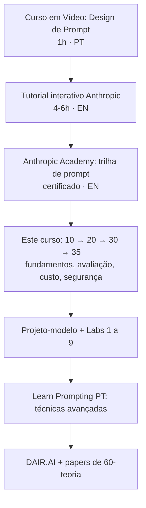

# 85 · Cursos gratuitos e certificações

**Nível:** todos
**Pesquisado na web em 19/08/2026.** Links e disponibilidade mudam; confirme
antes de investir tempo. Ordem: **português → inglês → francês**.

---

## 85.0 · O caminho mais curto, se você quiser só uma recomendação

1. **[Tutorial interativo de prompt da Anthropic](https://github.com/anthropics/prompt-eng-interactive-tutorial)** — 9 capítulos com exercícios. Gratuito, em inglês, com versão em Google Sheets que roda sem instalar nada.
2. **[Anthropic Academy](https://anthropic.skilljar.com)** — gratuita desde 02/03/2026, com certificado por curso.
3. **[Learn Prompting em português](https://learnprompting.org/pt/docs/introduction)** — o material aberto mais completo, traduzido.
4. **Este curso**, para a parte que os três acima não cobrem: avaliação,
   custo, segurança, carreira.

Custo total: **R$ 0**. Isso já coloca você acima da média do mercado — desde
que você faça o [projeto-modelo](07-projeto-modelo/README.md) e os
[laboratórios](70-pratica.md).

---

## 85.1 · Português 🇧🇷🇵🇹

| Curso | Autor / instituição | Formato | Duração | Nível | Ano | Vale? |
|---|---|---|---|---|---|---|
| [Learn Prompting — versão PT](https://learnprompting.org/pt/docs/introduction) | Learn Prompting (comunidade) | texto, +60 módulos | 10–20 h | iniciante → avançado | atualizado | ✅ **melhor material gratuito em português**; tradução boa; parte do conteúdo avançado só em inglês |
| [Design de Prompt — Introdução à Engenharia de Prompt](https://www.youtube.com/watch?v=ATp4Q4UD-c8) | Curso em Vídeo (Gustavo Guanabara) | vídeo | ~1 h | leigo total | 2024–2025 | ✅ melhor porta de entrada para quem nunca usou IA; didática excelente; não cobre produção |
| [Escola Virtual — trilha de IA e "Escrita de prompt com Copilot"](https://www.ev.org.br/cursos/fluencia) | Fundação Bradesco + Microsoft | texto/vídeo, com certificado | 4–20 h | iniciante | módulos novos em 2026 | ✅ gratuito e com certificado reconhecido no mercado brasileiro; **foco em Copilot/Microsoft 365**, não em API |
| [Bootcamps de IA generativa](https://www.dio.me/) | DIO + Bradesco | bootcamp com bolsas | 40–80 h | iniciante → intermediário | edições em 2026 | 🟡 bom se você pegar bolsa; cobre fundamentos, prompt e Python; qualidade varia por edição |
| [Curso Gratuito Engenharia de Prompt — Prompt Master](https://www.youtube.com/playlist?list=PLnTte7--UAGg4g-8GrS6RtdN3VqwKdb0x) | canal independente | playlist | 5–10 h | iniciante | 2025–2026 | 🟡 útil para uso de chatbot; **não** cobre avaliação nem API |
| [Resumo do curso de 7 h do Google de engenharia de prompts](https://www.youtube.com/watch?v=ixKOCQHrxgg) | canal independente | vídeo | ~20 min | iniciante | fev/2026 | 🟡 bom para visão geral rápida; é resumo de terceiro, não a fonte |

**Lacuna honesta do português:** não encontrei, em 19/08/2026, curso gratuito em
português que ensine **avaliação sistemática** (conjunto rotulado, métricas,
CI). É exatamente a lacuna que este curso preenche — e é a habilidade que o
mercado paga.

---

## 85.2 · Inglês 🇺🇸🇬🇧

| Curso | Autor / instituição | Formato | Duração | Nível | Ano | Vale? |
|---|---|---|---|---|---|---|
| [Prompt Engineering Interactive Tutorial](https://github.com/anthropics/prompt-eng-interactive-tutorial) | **Anthropic** | notebooks + Google Sheets | 4–6 h | iniciante → intermediário | mantido | ✅✅ **o melhor investimento de tempo da lista**; 9 capítulos com exercícios reais |
| [Anthropic Academy](https://anthropic.skilljar.com) | **Anthropic** | trilhas com vídeo e exercícios | 20 h+ | iniciante → avançado | aberta em 02/03/2026 | ✅✅ ~18 cursos; **certificado gratuito** por curso; cobre Claude, API, MCP, agentes |
| [Prompt Engineering Guide](https://www.promptingguide.ai/) · [DAIR.AI](https://github.com/dair-ai/Prompt-Engineering-Guide) | DAIR.AI | texto + papers | consulta | intermediário → pesquisa | atualizado | ✅ a melhor referência com ligação para os papers originais |
| [Learn Prompting](https://learnprompting.org/) | comunidade | texto | 10–20 h | todos | atualizado | ✅ amplo; o mais completo em cobertura de técnicas |
| Documentação oficial de prompt da Anthropic ([overview](https://platform.claude.com/docs/en/build-with-claude/prompt-engineering/overview)) | Anthropic | texto | 3–5 h | todos | viva | ✅ é a fonte; leia antes de qualquer tutorial de terceiro |
| Cursos curtos da [DeepLearning.AI](https://www.deeplearning.ai/short-courses/) | Andrew Ng e parceiros | vídeo + notebook | 1–3 h cada | iniciante → intermediário | 2023–2026 | 🟡 **vídeos gratuitos**; laboratórios, quizzes e certificado passaram a exigir assinatura (~US$ 25/mês no anual) |
| [Introduction to Generative AI](https://www.cloudskillsboost.google/) | Google Cloud Skills Boost | vídeo | ~2 h | leigo | atualizado | 🟡 gratuito com selo; superficial, e bem centrado no Google |

---

## 85.3 · Francês 🇫🇷

| Curso | Autor / instituição | Formato | Duração | Nível | Ano | Vale? |
|---|---|---|---|---|---|---|
| [L'intelligence artificielle générative et moi](https://www.fun-mooc.fr/en/cours/lintelligence-artificielle-generative-et-moi/) | FUN MOOC / Cnam | MOOC | 3 semanas | iniciante | ativo | ✅ institucional e sério; **não emite certificado nem badge** |
| [Pratiquer l'IA utile](https://www.fun-mooc.fr/en/cours/pratiquer-lia-utile/) | Cécile Dejoux (Cnam), FUN MOOC | MOOC | 3–4 semanas | iniciante → intermediário | ativo | ✅ foco em uso profissional; **sem certificado** |
| [Intelligence Artificielle et Société](https://www.fun-mooc.fr/en/cours/intelligence-artificielle-et-societe/) | FUN MOOC | MOOC | 4 semanas | iniciante | ativo | ✅ **emite badge** de conclusão com aproveitamento; foco social e ético |
| [Cours de prompt engineering](https://findskill.ai/fr/courses/prompt-engineering/) | FindSkill.ai | texto + exercícios | ~3 h | iniciante | 2026 | 🟡 gratuito com certificado verificável; plataforma comercial, conteúdo introdutório |
| Formations RNCP (Simplon, OpenClassrooms, Le Wagon) | diversos | formação longa | 3–6 meses | completo | 2026 | 💰 **pago**: € 2.000 a 6.000. Só faz sentido com financiamento (CPF) e para quem quer diploma reconhecido na França |

---

## 85.4 · Certificações — a conversa franca

### O que existe e emite certificado gratuito

| Certificador | Custo | O que exige | Valor de mercado real |
|---|---|---|---|
| **Anthropic Academy** | gratuito | concluir o curso | 🟢 **o melhor da lista**: emitido por quem faz o modelo, compartilhável no LinkedIn |
| **Fundação Bradesco (Escola Virtual)** | gratuito | concluir o curso e a avaliação | 🟡 reconhecido no Brasil como formação básica; não é credencial técnica |
| **Google Cloud Skills Boost** (selos) | gratuito no nível básico | trilha curta | 🟡 simbólico; as certificações Google **pagas** (Cloud) é que têm peso |
| **Microsoft Learn / AI-900** | trilha gratuita, **exame pago** (~US$ 99) | exame | 🟡 tem peso em ambientes Microsoft; é sobre IA em geral, não prompt |
| **FindSkill, plataformas comerciais** | gratuito | concluir | 🔴 simbólico |
| "Certificações de prompt engineer" de plataformas menores | US$ 50–500 | questionário | 🔴 **sem valor de mercado**; evite |

### A verdade desconfortável

> **Nenhuma certificação de engenharia de prompt, em agosto de 2026, tem peso
> de contratação comparável a um repositório com conjunto rotulado, métricas
> antes/depois e custo medido.**

Motivo estrutural: a área é nova demais para ter um certificador com autoridade
consolidada, e o trabalho é fácil de demonstrar diretamente. Um recrutador
técnico consegue avaliar seu projeto em cinco minutos — e nenhum certificado
diz mais do que isso.

**Onde certificado ajuda de verdade:**

- filtro de RH em empresa grande, onde alguém não técnico faz a triagem;
- concurso, edital, licitação e afins, que pontuam certificação;
- prova de esforço para migração de carreira;
- reembolso de treinamento pela empresa.

**Onde não ajuda:** entrevista técnica. Ali só conta o que você mediu.

---

## 85.5 · Ordem sugerida de estudo

---

## Autoteste

1. Qual é o caminho gratuito mais curto até um nível acima da média do mercado?
2. Qual lacuna existe no material gratuito em português — e por que ela importa
   para a carreira?
3. Que mudança recente afeta a gratuidade dos cursos da DeepLearning.AI?
4. Quais MOOCs franceses emitem certificado, e quais não emitem?
5. Certificação de prompt vale a pena? Em quais quatro situações específicas?
6. O que um recrutador técnico prefere ver, e por quê?

---

### Fontes consultadas (19/08/2026)

- Anthropic, tutorial interativo — <https://github.com/anthropics/prompt-eng-interactive-tutorial>
- Anthropic Academy — <https://anthropic.skilljar.com>
- Learn Prompting (PT) — <https://learnprompting.org/pt/docs/introduction>
- Curso em Vídeo, *Design de Prompt* — <https://www.youtube.com/watch?v=ATp4Q4UD-c8>
- Fundação Bradesco, Escola Virtual — <https://www.ev.org.br/cursos/fluencia>
- Microsoft News Brasil, parceria com a Fundação Bradesco — <https://news.microsoft.com/pt-br/iniciativa-da-microsoft-e-fundacao-bradesco-capacitou-mais-de-15-milhao-de-pessoas-e-agora-traz-novos-cursos-de-ia/>
- FUN MOOC, catálogo de IA — <https://www.fun-mooc.fr/en/categories/thematiques/numerique-et-technologie/intelligence-artificielle-ia/>
- DeepLearning.AI, cursos curtos — <https://www.deeplearning.ai/short-courses/>
- DAIR.AI, *Prompt Engineering Guide* — <https://github.com/dair-ai/Prompt-Engineering-Guide>
