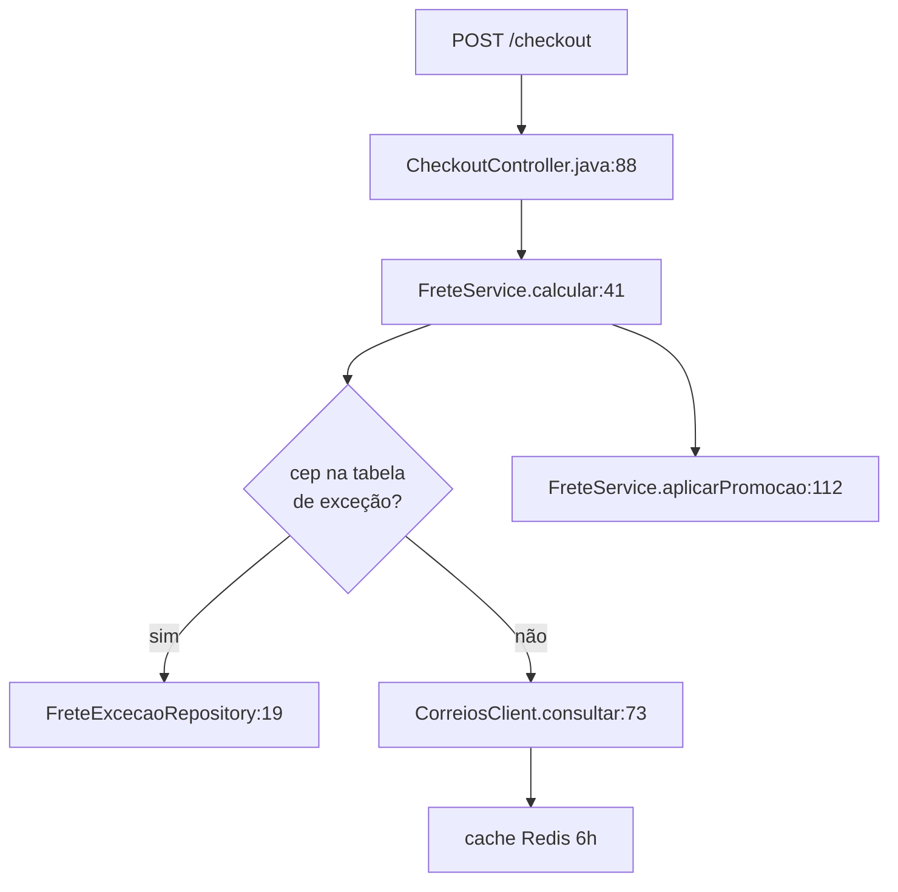

# 6 · Exemplos — do trivial ao caso de produção

**Nível:** iniciante → avançado · **Escrito em:** 20/08/2026

> Doze exemplos completos. Cada um: **problema → solução → explicação**.
> Todo código é executável e está inteiro — nada de `...` no meio.
> Os exemplos 11 e 12 são casos de produção, não didáticos.

| # | Exemplo | Nível |
|---|---|---|
| [1](#exemplo-1--corrigir-um-bug-com-teste-de-regressão-primeiro) | Corrigir bug com teste de regressão primeiro | trivial |
| [2](#exemplo-2--entender-código-legado-que-você-nunca-viu) | Entender código legado desconhecido | trivial |
| [3](#exemplo-3--gerar-teste-para-código-sem-teste--e-provar-que-o-teste-presta) | Gerar teste e provar que o teste presta | fácil |
| [4](#exemplo-4--transformação-mecânica-em-massa-codemod) | Transformação mecânica em massa (*codemod*) | fácil |
| [5](#exemplo-5--detectar-pacote-alucinado-antes-de-instalar) | Detectar pacote alucinado antes de instalar | médio |
| [6](#exemplo-6--mensagem-de-commit-e-changelog-em-modo-headless) | Commit e changelog em modo *headless* | médio |
| [7](#exemplo-7--transformar-um-pedido-vago-em-especificação) | Transformar pedido vago em especificação | médio |
| [8](#exemplo-8--git-bisect-assistido-para-achar-a-regressão) | `git bisect` assistido | médio |
| [9](#exemplo-9--revisar-o-pr-de-outra-pessoa-com-um-segundo-par-de-olhos) | Revisar PR com um segundo par de olhos | médio |
| [10](#exemplo-10--trocar-de-biblioteca-com-teste-de-caracterização) | Trocar de biblioteca com teste de caracterização | avançado |
| [11](#exemplo-11--produção--triagem-automática-de-teste-instável-flaky) | **Produção:** triagem de teste instável | avançado |
| [12](#exemplo-12--produção--migração-de-400-arquivos-com-portão-e-amostragem) | **Produção:** migração de 400 arquivos | avançado |

---

## Exemplo 1 · Corrigir um bug com teste de regressão primeiro

### Problema

Um usuário reporta: "quando o carrinho está vazio, o total mostra `NaN` em vez de
`R$ 0,00`".

### Solução

**Passo 1 — não conserte. Reproduza.**

```
Não altere nenhum arquivo ainda.

Bug: com o carrinho vazio, o total exibe NaN em vez de R$ 0,00.

1. Encontre onde o total é calculado.
2. Escreva UM teste que falha, reproduzindo exatamente esse caso.
3. Rode e me mostre a falha.
4. Pare. Não conserte ainda.
```

O agente encontra e escreve:

```javascript
// tests/carrinho.test.js
import { describe, it, expect } from 'vitest';
import { calcularTotal } from '../src/carrinho.js';

describe('calcularTotal', () => {
  it('devolve 0 para carrinho vazio', () => {
    expect(calcularTotal([])).toBe(0);
  });
});
```

```bash
npm test -- carrinho
```

```
FAIL  tests/carrinho.test.js
  × devolve 0 para carrinho vazio
    expected NaN to be 0
```

**Passo 2 — agora sim.**

```
Perfeito, o teste reproduz. Agora conserte o código de produção.
Não altere o teste. Rode até passar.
```

```javascript
// src/carrinho.js — antes
export function calcularTotal(itens) {
  return itens.reduce((soma, i) => soma + i.preco * i.qtd);
}

// src/carrinho.js — depois
export function calcularTotal(itens) {
  return itens.reduce((soma, i) => soma + i.preco * i.qtd, 0);
  //                                                      ^^^ valor inicial
}
```

### Explicação

O bug é clássico: `reduce` sem valor inicial em array vazio lança `TypeError`;
com um item, devolve o item sem aplicar a função. A correção é um caractere.

**O valor deste exemplo não está na correção — está na ordem.** Ao exigir o teste
antes, você ganha três coisas de graça:

1. **Prova de que o bug existia.** Sem isso, "consertei" é opinião.
2. **Prova de que sumiu.** O teste vermelho ficou verde.
3. **Garantia de que não volta.** Ele fica na suíte para sempre.

Se você tivesse pedido "conserta o NaN", o agente provavelmente teria acertado
também — e você teria zero das três garantias, além de não saber se ele mudou
mais alguma coisa junto.

> **Onde isto quebra:** bug que depende de estado externo (relógio, rede, banco
> em certo estado). Aí "escreva um teste que falha" vira uma tarefa maior que o
> conserto. O julgamento de quando pagar esse preço é seu, e é justamente o tipo
> de decisão que não se delega.

---

## Exemplo 2 · Entender código legado que você nunca viu

### Problema

Você entrou num projeto de 80.000 linhas, em Java, escrito por gente que saiu da
empresa. Precisa alterar o cálculo de frete e não sabe nem por onde começar.

### Solução

**Nunca peça mudança antes de pedir mapa.**

```
MODO INVESTIGAÇÃO. Não altere nenhum arquivo.

Preciso alterar o cálculo de frete. Antes disso:

1. Onde o frete é calculado? Dê caminho de arquivo e número de linha.
2. Quem chama esse código? Liste os pontos de entrada.
3. Quais dados ele consome (banco, API externa, config)?
4. Existe teste cobrindo isso? Onde?
5. Desenhe o fluxo em Mermaid.
6. Liste 3 coisas que me surpreenderiam se eu mexesse aqui sem saber.

Use `rg` para buscar. Cite arquivo:linha em cada afirmação.
```

Resposta típica:



> **3 coisas que te surpreenderiam:**
> 1. `FreteService.calcular` é chamado **duas** vezes por pedido — uma na
>    pré-visualização e outra na confirmação — e as duas podem divergir se a
>    tabela mudar no meio (`CheckoutController.java:88` e `:203`).
> 2. `aplicarPromocao` altera o objeto recebido em vez de devolver um novo
>    (`FreteService.java:112`); há código dependendo desse efeito colateral.
> 3. Não há teste de `calcular` com CEP de exceção. A cobertura de 78% do
>    relatório vem quase toda de `CorreiosClientTest`.

### Explicação

Este é, na minha opinião de ofício, **o uso com melhor relação valor/risco de
toda a IA em software**. Motivos:

- **O risco é zero.** Nada é escrito. Se o agente errar, você descobre ao
  conferir a linha citada.
- **O ganho é enorme.** O que levaria um dia de leitura leva 4 minutos.
- **Escala com o tamanho do problema**, ao contrário de gerar código, que piora
  com o tamanho.

A exigência de **citar arquivo:linha** é o que transforma isto de "resumo
plausível" em "afirmação verificável". Sem ela, você recebe um texto bonito e
não sabe o que é real. Com ela, conferir custa um `sed -n '41,60p'`.

> **Regra:** afirmação sem endereço é hipótese. Exija endereço.

---

## Exemplo 3 · Gerar teste para código sem teste — e provar que o teste presta

### Problema

Uma função de 60 linhas em produção, zero testes, e você precisa refatorá-la.

```python
# precos.py
def calcular_preco_final(base, cupom=None, uf="SP", cliente_vip=False):
    if base <= 0:
        raise ValueError("base deve ser positiva")
    preco = base
    if cupom == "PRIMEIRA10":
        preco *= 0.90
    elif cupom == "BLACK25":
        preco *= 0.75
    elif cupom is not None:
        raise ValueError(f"cupom inválido: {cupom}")
    if cliente_vip:
        preco *= 0.95
    imposto = {"SP": 0.18, "RJ": 0.20, "MG": 0.18}.get(uf, 0.17)
    preco *= (1 + imposto)
    return round(preco, 2)
```

### Solução

**Passo 1 — gerar.**

```
Escreva testes para @precos.py usando pytest.

Requisitos:
- Um teste por caminho de decisão, incluindo TODOS os ramos de erro.
- Nenhum `assert x is not None`. Todo assert compara valor exato.
- Calcule os valores esperados à mão e MOSTRE a conta em comentário.
- Não altere precos.py.
```

```python
# test_precos.py
import pytest
from precos import calcular_preco_final


def test_base_simples_sp():
    # 100 * 1.18 = 118.00
    assert calcular_preco_final(100) == 118.00


def test_cupom_primeira10():
    # 100 * 0.90 = 90 ; 90 * 1.18 = 106.20
    assert calcular_preco_final(100, cupom="PRIMEIRA10") == 106.20


def test_cupom_black25():
    # 100 * 0.75 = 75 ; 75 * 1.18 = 88.50
    assert calcular_preco_final(100, cupom="BLACK25") == 88.50


def test_vip_acumula_com_cupom():
    # 100 * 0.75 = 75 ; 75 * 0.95 = 71.25 ; 71.25 * 1.18 = 84.075 -> 84.08
    assert calcular_preco_final(100, cupom="BLACK25", cliente_vip=True) == 84.08


def test_uf_rj():
    # 100 * 1.20 = 120.00
    assert calcular_preco_final(100, uf="RJ") == 120.00


def test_uf_desconhecida_usa_aliquota_padrao():
    # 100 * 1.17 = 117.00
    assert calcular_preco_final(100, uf="AC") == 117.00


def test_base_zero_levanta():
    with pytest.raises(ValueError, match="positiva"):
        calcular_preco_final(0)


def test_base_negativa_levanta():
    with pytest.raises(ValueError, match="positiva"):
        calcular_preco_final(-5)


def test_cupom_invalido_levanta():
    with pytest.raises(ValueError, match="XPTO"):
        calcular_preco_final(100, cupom="XPTO")
```

**Passo 2 — provar que os testes valem alguma coisa.** Esta é a parte que
ninguém faz. Salve como `mutar.py`:

```python
#!/usr/bin/env python3
"""Teste de mutação minimalista: sabota o código e verifica se a suíte percebe.

Uso: python3 mutar.py precos.py "pytest -q"
Sai com código 1 se alguma mutação SOBREVIVER (ou seja, testes fracos).
"""
import subprocess
import sys
import pathlib

MUTACOES = [
    ("0.90", "0.91"),
    ("0.75", "0.76"),
    ("0.95", "0.96"),
    ("0.18", "0.19"),
    ("0.17", "0.16"),
    ("<=", "<"),
    ("round(preco, 2)", "round(preco, 1)"),
]


def main() -> int:
    alvo = pathlib.Path(sys.argv[1])
    comando = sys.argv[2]
    original = alvo.read_text(encoding="utf-8")

    sobreviventes = []
    try:
        for de, para in MUTACOES:
            if de not in original:
                print(f"[pular ] {de!r} não aparece em {alvo}")
                continue
            alvo.write_text(original.replace(de, para, 1), encoding="utf-8")
            r = subprocess.run(comando, shell=True, capture_output=True)
            if r.returncode == 0:
                print(f"[SOBREVIVEU] {de!r} -> {para!r}  (testes não perceberam)")
                sobreviventes.append((de, para))
            else:
                print(f"[morta ] {de!r} -> {para!r}")
    finally:
        alvo.write_text(original, encoding="utf-8")

    print()
    if sobreviventes:
        print(f"{len(sobreviventes)} mutação(ões) sobreviveram. Suíte incompleta.")
        return 1
    print("Todas as mutações foram detectadas. Suíte sólida para estes casos.")
    return 0


if __name__ == "__main__":
    raise SystemExit(main())
```

```bash
python3 mutar.py precos.py "python3 -m pytest -q"
```

Saída esperada com a suíte acima:

```
[morta ] '0.90' -> '0.91'
[morta ] '0.75' -> '0.76'
[morta ] '0.95' -> '0.96'
[morta ] '0.18' -> '0.19'
[morta ] '0.17' -> '0.16'
[morta ] '<=' -> '<'
[morta ] 'round(preco, 2)' -> 'round(preco, 1)'

Todas as mutações foram detectadas. Suíte sólida para estes casos.
```

### Explicação

Cobertura de linha mede **execução**, não **verificação**. Um teste que chama a
função e não checa nada dá 100% de cobertura e prova zero. Testes gerados por IA
caem nessa armadilha com frequência particular, porque o modelo otimiza para
"parece um teste", e um `assert x is not None` parece um teste.

O teste de mutação mede a coisa certa: **se eu quebrar o código de propósito, a
suíte grita?** Se não gritar, a suíte é decorativa.

Note o `try/finally` no script: ele **sempre** restaura o original, mesmo se você
apertar `Ctrl+C` no meio. Escrever ferramenta que mexe no seu código sem essa
garantia é como serrar sem o gabarito.

> Ferramentas maduras de mutação existem — `mutmut` e `cosmic-ray` em Python,
> Stryker em JS. O script acima serve para você entender o mecanismo em 30 linhas
> antes de adotar uma delas.

---

## Exemplo 4 · Transformação mecânica em massa (*codemod*)

### Problema

Trocar `logger.log(...)` por `logger.info(...)` em 217 arquivos.

### Solução

**Não peça isso ao agente.** Sério.

```bash
rg -l 'logger\.log\(' src/ | wc -l
# 217

rg -l 'logger\.log\(' src/ | xargs sed -i 's/logger\.log(/logger.info(/g'

git diff --stat
# 217 files changed, 431 insertions(+), 431 deletions(-)
```

Verificação:

```bash
rg 'logger\.log\(' src/ | wc -l
# esperado: 0
npm test
```

### Explicação

**Este exemplo existe para ensinar quando NÃO usar IA**, e é o exemplo que mais
falta em qualquer material sobre o assunto.

| Critério | `sed` | Agente |
|---|---|---|
| Determinismo | Total | Nenhum |
| Custo | Zero | Alto (217 arquivos no contexto) |
| Tempo | 0,3 s | Minutos |
| Revisão necessária | Ler 1 regex | Ler 217 diffs |
| Risco de mudança silenciosa | Zero | Real |

**A regra:** se a transformação é expressável como regra determinística, use uma
ferramenta determinística. `sed`, `comby`, `ast-grep`, `jscodeshift`.

O papel certo do agente aqui é **escrever a regra**, não aplicar a mudança:

```
Escreva um comando `comby` que troque `logger.log(X)` por `logger.info(X)`
preservando qualquer argumento. Não rode nada; só me dê o comando.
```

Você revisa **um** comando em vez de 217 diffs. E o resultado é reprodutível.

> **Onde o agente volta a ganhar:** quando a transformação exige julgamento —
> "troque `logger.log` por `logger.info`, **exceto** onde a mensagem indica erro,
> aí use `logger.error`". Isso `sed` não faz. A fronteira entre os dois é
> exatamente a fronteira entre regra e julgamento.

---

## Exemplo 5 · Detectar pacote alucinado antes de instalar

### Problema

O agente escreveu:

```python
from starlette_reverse_proxy import ReverseProxyMiddleware
```

Esse pacote existe? Se não existir e alguém tiver registrado o nome no PyPI, você
está a um `pip install` de executar código de um atacante na sua máquina.

Isso tem nome: **slopsquatting**. Não é hipótese — pesquisas encontraram que
cerca de **20% das amostras de código geradas** citam ao menos um pacote
inexistente, e **58% dos nomes alucinados se repetem** entre execuções, o que
torna o alvo previsível e registrável por um atacante.

### Solução

Script que verifica todo import contra o registro real, **antes** de instalar:

```python
#!/usr/bin/env python3
"""Verifica se pacotes citados existem de fato no PyPI.

Uso: python3 checa_pacotes.py requirements.txt
     python3 checa_pacotes.py --imports arquivo.py
Sai com 1 se algum pacote não existir.
"""
import json
import sys
import urllib.error
import urllib.request
import pathlib
import re
import sysconfig

TIMEOUT = 10


def stdlib() -> set:
    nomes = set(sys.builtin_module_names)
    caminho = sysconfig.get_paths()["stdlib"]
    for p in pathlib.Path(caminho).iterdir():
        if p.suffix == ".py":
            nomes.add(p.stem)
        elif p.is_dir() and (p / "__init__.py").exists():
            nomes.add(p.name)
    return nomes


def existe_no_pypi(nome: str) -> bool:
    url = f"https://pypi.org/pypi/{nome}/json"
    try:
        with urllib.request.urlopen(url, timeout=TIMEOUT) as r:
            json.load(r)
            return True
    except urllib.error.HTTPError as e:
        if e.code == 404:
            return False
        raise
    except urllib.error.URLError as e:
        print(f"  aviso: falha de rede ao checar {nome}: {e.reason}")
        return True  # não bloqueia por problema de rede; avisa


def de_requirements(caminho: str) -> list:
    linhas = pathlib.Path(caminho).read_text(encoding="utf-8").splitlines()
    pacotes = []
    for l in linhas:
        l = l.split("#")[0].strip()
        if not l or l.startswith("-"):
            continue
        pacotes.append(re.split(r"[<>=!~\[]", l)[0].strip())
    return pacotes


def de_imports(caminho: str) -> list:
    src = pathlib.Path(caminho).read_text(encoding="utf-8")
    achados = set()
    for m in re.finditer(r"^\s*(?:import|from)\s+([A-Za-z_][\w.]*)", src, re.M):
        achados.add(m.group(1).split(".")[0])
    return sorted(achados - stdlib())


def main() -> int:
    if len(sys.argv) < 2:
        print(__doc__)
        return 2
    if sys.argv[1] == "--imports":
        pacotes = de_imports(sys.argv[2])
    else:
        pacotes = de_requirements(sys.argv[1])

    faltando = []
    for p in pacotes:
        ok = existe_no_pypi(p)
        print(f"{'OK  ' if ok else 'FALTA'}  {p}")
        if not ok:
            faltando.append(p)

    print()
    if faltando:
        print("PACOTES INEXISTENTES NO PYPI:", ", ".join(faltando))
        print("NÃO instale. Confirme o nome real antes de qualquer coisa.")
        return 1
    print("Todos os pacotes existem no PyPI.")
    return 0


if __name__ == "__main__":
    raise SystemExit(main())
```

```bash
python3 checa_pacotes.py --imports app.py
```

```
FALTA  starlette_reverse_proxy
OK     fastapi
OK     uvicorn

PACOTES INEXISTENTES NO PYPI: starlette_reverse_proxy
NÃO instale. Confirme o nome real antes de qualquer coisa.
```

### Explicação

Três detalhes de projeto valem comentário, porque são o tipo de coisa que separa
script de brinquedo de ferramenta de produção:

1. **O nome do módulo importado nem sempre é o nome do pacote no registro**
   (`import yaml` vem de `PyYAML`; `import cv2` vem de `opencv-python`). Este
   script pega o caso majoritário e dá falso positivo nos famosos. Falso positivo
   aqui é aceitável — ele custa 10 segundos de conferência; falso negativo custa
   uma máquina comprometida. **Escolha deliberada de qual erro cometer.**
2. **Falha de rede não bloqueia.** Um verificador que quebra o fluxo por causa de
   um timeout é desligado na primeira semana, e aí você não tem verificador
   nenhum. Ele avisa e passa.
3. **"Existe no PyPI" ≠ "é seguro".** O atacante *quer* que o nome exista.
   Existência é um filtro contra alucinação, não contra malícia. A defesa contra
   malícia é outra: `--require-hashes`, lockfile, e revisar dependência nova como
   se revisa código novo.

A versão embutida no [projeto-modelo](07-projeto-modelo/README.md) cobre também
npm e trabalha a partir do *diff*, que é onde ela realmente pertence.

---

## Exemplo 6 · Mensagem de commit e changelog em modo *headless*

### Problema

Escrever boa mensagem de commit é chato, e por isso quase ninguém escreve. Mas o
`git log` é a única documentação que nunca fica desatualizada.

### Solução

Script `commit-ia`, coloque em `~/.local/bin/` e dê `chmod +x`:

```bash
#!/usr/bin/env bash
# commit-ia — gera mensagem de commit a partir do que está em staging.
# Uso: git add -p && commit-ia
set -euo pipefail

if ! git diff --cached --quiet; then :; else
  echo "Nada em staging. Use 'git add' primeiro." >&2
  exit 1
fi

DIFF="$(git diff --cached)"
LINHAS=$(printf '%s' "$DIFF" | wc -l)

if [ "$LINHAS" -gt 2000 ]; then
  echo "Diff com $LINHAS linhas. Grande demais para um commit." >&2
  echo "Fatie com 'git add -p'." >&2
  exit 1
fi

MSG="$(printf '%s' "$DIFF" | claude -p 'Escreva UMA mensagem de commit no padrão
Conventional Commits para este diff.

Formato:
<tipo>(<escopo>): <resumo em até 72 caracteres, imperativo, em português>

<corpo: o PORQUÊ da mudança, não o QUÊ. Máximo 3 linhas. Omita se for óbvio.>

Tipos: feat, fix, refactor, test, docs, chore, perf.
Devolva SOMENTE a mensagem, sem crases, sem explicação.' --output-format text)"

echo "─────────────────────────────────────────"
echo "$MSG"
echo "─────────────────────────────────────────"
read -r -p "Usar esta mensagem? [s/N/e(ditar)] " R

case "$R" in
  s|S) git commit -m "$MSG" ;;
  e|E) git commit -e -m "$MSG" ;;
  *)   echo "Cancelado." ; exit 1 ;;
esac
```

```bash
git add -p
commit-ia
```

```
─────────────────────────────────────────
fix(carrinho): tratar carrinho vazio no cálculo do total

reduce sem valor inicial lançava TypeError em array vazio,
exibindo NaN para o usuário na tela de checkout.
─────────────────────────────────────────
Usar esta mensagem? [s/N/e(ditar)] s
```

### Explicação

Quatro decisões de projeto, e cada uma responde a um erro que eu já vi acontecer:

| Decisão | Erro que ela previne |
|---|---|
| Limite de 2.000 linhas | Commit gigante que ninguém revisa. O script **recusa** e manda fatiar |
| Confirmação obrigatória | Automação silenciosa que enche o histórico de mensagem errada |
| Opção `e` (editar) | O caso comum: a mensagem está 90% certa |
| "o PORQUÊ, não o QUÊ" | Mensagem inútil do tipo "atualiza arquivo.js" — o *quê* já está no diff |

O `set -euo pipefail` na primeira linha não é decoração: `-e` aborta em erro,
`-u` aborta em variável indefinida, `-o pipefail` faz um cano falhar se qualquer
etapa falhar. Sem isso, um erro no meio produz um commit com mensagem vazia.

> **Onde isto não vale a pena:** projeto onde o histórico não é lido. Se ninguém
> nunca rodou `git log` no seu repositório, isso é cerimônia. Seja honesto sobre
> qual é o seu caso.

---

## Exemplo 7 · Transformar um pedido vago em especificação

### Problema

O chefe manda: *"precisamos exportar os relatórios em Excel"*.

Isso não é uma tarefa; é o começo de uma conversa. Delegar assim a um agente
produz algo bonito e errado.

### Solução

Use o agente como **entrevistador**, não como implementador:

```
Recebi este pedido: "precisamos exportar os relatórios em Excel".

NÃO implemente nada. NÃO proponha solução.

Faça o papel de analista: liste as perguntas cuja resposta muda o desenho da
solução. Agrupe por tema. Para cada uma, diga qual decisão ela destrava e qual
seria um padrão razoável se ninguém responder.
```

Saída típica:

> **Escopo**
> 1. Quais relatórios? Todos ou alguns? → define se é genérico ou específico.
>    *Padrão: só o de vendas, que é o mais pedido.*
> 2. "Excel" significa `.xlsx` de verdade ou CSV que abre no Excel? → muda a
>    biblioteca inteira. *Padrão: `.xlsx`, porque CSV quebra acento e formata
>    número errado no Excel em português.*
>
> **Volume**
> 3. Quantas linhas no maior relatório? → abaixo de ~50 mil, gera na hora;
>    acima, precisa de fila e download assíncrono. *Padrão: assumir < 50 mil e
>    medir.*
>
> **Formatação**
> 4. Precisa de formatação (cabeçalho, moeda, data brasileira, largura de
>    coluna)? → dobra ou triplica o esforço. *Padrão: cabeçalho em negrito, data
>    `dd/mm/aaaa`, moeda com 2 casas.*
>
> **Entrega**
> 5. Download direto, e-mail, ou pasta compartilhada? → muda a arquitetura.
>    *Padrão: download direto.*
>
> **Permissão**
> 6. Quem pode exportar? O relatório na tela já respeita permissão por usuário —
>    a exportação também precisa? → **risco de vazamento de dado se ignorado.**
>    *Padrão: mesma regra da tela; sem exceção.*

### Explicação

A pergunta 6 é a razão de este exemplo existir. Ela é a que **ninguém pensa** e a
que causa incidente de verdade: a tela filtra por usuário, a exportação esquece
de filtrar, e alguém baixa a base inteira.

Um agente é surpreendentemente bom nesse papel — porque listar dimensões de um
problema conhecido é exatamente onde a memória estatística dele brilha. Ele viu
milhares de discussões sobre exportação de relatório e sabe onde elas dão errado.

**A inversão que importa:** a maior parte do desperdício em software não é código
ruim, é **código certo para o problema errado**. Usar IA para acelerar a
construção sem usar IA para clarear o pedido é acelerar na direção errada.

Depois desta lista, você leva ao chefe as 6 perguntas — e aí sim escreve a
especificação. Método em [16-especificacao-e-plano](16-especificacao-e-plano.md).

---

## Exemplo 8 · `git bisect` assistido para achar a regressão

### Problema

"Funcionava na semana passada." 340 commits desde então. Você não sabe qual
quebrou.

### Solução

`git bisect` faz busca binária no histórico: 340 commits → **9 passos**. Combine
com o agente para a parte que ele faz melhor.

**Passo 1 — o agente escreve o script de teste, você revisa:**

```
Escreva um script `bisect-test.sh` que:
- roda `npm ci --silent` e `npm test -- checkout`
- sai com 0 se o teste de checkout passar, 1 se falhar
- sai com 125 (pular) se o build falhar por motivo não relacionado
Não rode nada. Só me dê o script.
```

```bash
#!/usr/bin/env bash
# bisect-test.sh — 0=bom, 1=ruim, 125=pular este commit
set -uo pipefail

if ! npm ci --silent > /dev/null 2>&1; then
  echo "build quebrado neste commit; pulando"
  exit 125
fi

if npm test -- checkout > /dev/null 2>&1; then
  exit 0
else
  exit 1
fi
```

**Passo 2 — o Git faz a busca (determinística, sem IA):**

```bash
chmod +x bisect-test.sh
git bisect start
git bisect bad HEAD
git bisect good HEAD~340
git bisect run ./bisect-test.sh
```

```
Bisecting: 169 revisions left to test after this (roughly 8 steps)
...
a1b2c3d4 is the first bad commit
commit a1b2c3d4
    refactor(pagamento): extrai validação de cartão para módulo
```

```bash
git bisect reset
```

**Passo 3 — o agente explica o commit culpado:**

```
O commit a1b2c3d4 quebrou o teste de checkout.
Mostre `git show a1b2c3d4` e explique qual mudança causou a quebra.
Não conserte ainda.
```

### Explicação

Divisão de trabalho perfeita, e vale generalizar:

| Etapa | Quem faz | Por quê |
|---|---|---|
| Escrever o script de teste | Agente | Trabalho chato, padrão conhecido, você revisa em 20 s |
| Percorrer 9 commits | Git | Determinístico. Um agente aqui só introduziria erro e custo |
| Entender o commit culpado | Agente | Leitura e explicação — onde ele é forte |
| Decidir a correção | Você | Julgamento, contexto de negócio, consequência |

O `exit 125` é o detalhe profissional: sem ele, um commit intermediário com build
quebrado é marcado como "ruim" e a busca binária converge para o commit errado.
Já vi times perderem uma tarde por causa disso.

> **Pré-requisito escondido:** isso só funciona se cada commit for pequeno e
> compilar sozinho. Commits gigantes gerados por agente ("implementa a feature
> inteira") **destroem** a capacidade de bisect. É um dos custos ocultos de
> aceitar diffs grandes, e ele só aparece meses depois.

---

## Exemplo 9 · Revisar o PR de outra pessoa com um segundo par de olhos

### Problema

PR de 600 linhas para revisar. Você tem 20 minutos e vai fazer o que todo mundo
faz: olhar o começo com atenção e o resto na diagonal.

### Solução

Use o agente como **primeira passada**, nunca como última.

```bash
git fetch origin pull/482/head:pr-482
git checkout pr-482
git diff main...pr-482 > /tmp/pr-482.diff
```

```
Revise @/tmp/pr-482.diff.

Procure APENAS por, nesta ordem de prioridade:
1. Erro de correção: condição invertida, off-by-one, caso nulo, ordem de operação.
2. Vazamento de recurso: conexão, arquivo, transação não fechados.
3. Concorrência: estado compartilhado, condição de corrida.
4. Segurança: entrada não validada, SQL montado por concatenação, segredo em log.
5. Teste que não testa: assert vago, mock que engole o comportamento sob teste.

NÃO comente sobre estilo, nomes ou formatação.
Para cada achado: arquivo:linha, o que acontece de errado, e um caso concreto
que faz acontecer. Se não tiver certeza, diga "suspeita" em vez de afirmar.
```

Saída útil parece com isto:

> **`src/pedido/repo.ts:88` — vazamento de transação (confiança: alta)**
> `beginTransaction()` na linha 88; `commit()` na 104 dentro do `try`, mas não há
> `rollback()` no `catch` da linha 106. Se `salvarItens` lançar, a transação fica
> aberta até o timeout do pool. Com o pool de 10 do `db.config.ts:12`, dez
> pedidos com erro derrubam a aplicação.
>
> **`src/pedido/service.ts:41` — suspeita de off-by-one**
> `for (let i = 0; i <= itens.length; i++)`. Com `<=`, a última iteração acessa
> `itens[itens.length]`, que é `undefined`. Só não quebra hoje porque a linha 43
> tem `if (!item) continue`. Funciona por acidente.
>
> **`tests/pedido.test.ts:120` — teste que não testa (confiança: alta)**
> `expect(resultado).toBeDefined()` depois de mockar `salvarPedido`. O mock
> devolve `{}`, então o assert passa mesmo que a função não faça nada.

### Explicação

**Por que primeira passada e não última:**

- Ele acha o que é **local e padronizado**: recurso não fechado, `<=` onde devia
  ser `<`, `catch` vazio. Isso é a maioria dos defeitos e é o que a leitura
  humana cansada mais deixa passar.
- Ele **não** acha o que é **global e contextual**: "isso viola a invariante que
  a gente combinou em 2023", "isso duplica o que já existe em outro módulo",
  "esse é o design errado para o problema". Isso continua sendo seu.

**Por que proibir comentário de estilo:** porque ele produz 40 observações de
estilo e você para de ler na décima. Isso se chama fadiga de alerta, e é o modo
de falha nº 1 de toda ferramenta de revisão automática — vale para linter,
scanner de segurança e agente igualmente.

**Por que exigir "caso concreto que faz acontecer":** porque força o achado a ser
falsificável. Sem isso, você recebe "pode haver problema de concorrência aqui",
que é verdade em qualquer código e não ajuda ninguém.

> **Nunca cole o resultado direto no PR.** Você é responsável por cada comentário
> que assina. Leia, confirme, descarte o que for ruído, e escreva com as suas
> palavras. Um revisor que despeja saída de IA em PR alheio destrói a própria
> reputação em duas semanas.

---

## Exemplo 10 · Trocar de biblioteca com teste de caracterização

### Problema

Migrar de `moment.js` (obsoleta desde 2020, ainda em 40 arquivos) para
`date-fns`. As APIs são diferentes e o comportamento em casos de borda também.

### Solução

**Passo 1 — capturar o comportamento atual, antes de mudar nada.**

O agente é ótimo para isso: gerar muitos casos e registrar a saída de hoje.

```
Escreva `tests/datas.golden.test.js` que exercita TODAS as chamadas de
formatação e parsing de data do projeto, com entradas variadas, incluindo:
- fim de mês, ano bissexto, virada de ano
- fuso horário -03:00 e UTC
- entrada inválida e string vazia
- horário de verão (mesmo que o Brasil não use mais, dados antigos existem)

Cada teste registra a saída ATUAL de moment.js num arquivo `datas.golden.json`.
Não migre nada ainda. Só capture.
```

```javascript
// tests/datas.golden.test.js
import { describe, it, expect } from 'vitest';
import fs from 'node:fs';
import moment from 'moment';

const CASOS = [
  '2024-02-29T00:00:00-03:00',
  '2023-12-31T23:59:59-03:00',
  '2024-01-01T00:00:00Z',
  '2024-10-31T23:00:00-03:00',
  '2024-03-31T00:00:00-03:00',
  'nao-e-data',
  '',
];

const FORMATOS = ['DD/MM/YYYY', 'YYYY-MM-DD HH:mm', 'MMMM YYYY', 'X'];

describe('caracterização de datas (comportamento atual)', () => {
  it('registra a saída atual em datas.golden.json', () => {
    const golden = {};
    for (const caso of CASOS) {
      golden[caso] = {};
      for (const fmt of FORMATOS) {
        const m = moment(caso);
        golden[caso][fmt] = m.isValid() ? m.format(fmt) : 'INVALID';
      }
    }
    fs.writeFileSync(
      'tests/datas.golden.json',
      JSON.stringify(golden, null, 2)
    );
    expect(Object.keys(golden)).toHaveLength(CASOS.length);
  });
});
```

```bash
npm test -- datas.golden
git add tests/datas.golden.json
git commit -m "test: captura comportamento atual de datas antes da migração"
```

**Passo 2 — o teste de comparação, que vai guiar a migração:**

```javascript
// tests/datas.migracao.test.js
import { describe, it, expect } from 'vitest';
import golden from './datas.golden.json';
import { formatar } from '../src/util/datas.js'; // fachada nova

describe('migração de datas preserva o comportamento', () => {
  for (const [entrada, esperados] of Object.entries(golden)) {
    for (const [fmt, esperado] of Object.entries(esperados)) {
      it(`${entrada || '(vazio)'} em ${fmt} -> ${esperado}`, () => {
        expect(formatar(entrada, fmt)).toBe(esperado);
      });
    }
  }
});
```

**Passo 3 — migrar contra o alvo:**

```
Implemente `src/util/datas.js` exportando `formatar(entrada, formatoMoment)`
usando date-fns, de forma que `tests/datas.migracao.test.js` passe inteiro.

- Traduza os formatos do moment para os de date-fns.
- `INVALID` para entrada inválida, igual ao golden.
- Não altere os arquivos de teste nem o golden.
- Rode até passar tudo.
```

**Passo 4 — trocar os pontos de uso, um por vez:**

```bash
rg -l "from 'moment'" src/ | head -5
```

Migre 5 arquivos, rode a suíte, commite. Repita. **Nunca os 40 de uma vez.**

**Passo 5 — provar que acabou:**

```bash
rg "from 'moment'" src/ | wc -l
# esperado: 0
npm ls moment
# esperado: (empty) — se ainda aparecer, algo depende dela
```

### Explicação

**Teste de caracterização** (*characterization test*, termo de Michael Feathers em
*Working Effectively with Legacy Code*, 2004) não testa se o comportamento está
**certo** — testa se ele está **igual**. É a ferramenta exata para migração:
você não quer melhorar nada, quer não quebrar nada.

Por que isso importa **especificamente com IA**: sem o golden, você está pedindo
ao agente que reproduza um comportamento que nem você conhece. Ele vai produzir
código que *parece* equivalente. `moment('nao-e-data').format('DD/MM/YYYY')`
devolve `'Invalid date'`; `date-fns` lança exceção. Essa diferença aparece em
produção às 2h da manhã, não no code review.

Com o golden, o agente tem um **alvo mecânico**. Ele deixa de adivinhar
equivalência e passa a perseguir igualdade medida — que é exatamente a
transformação que este curso inteiro prega.

---

## Exemplo 11 · **Produção** — triagem automática de teste instável (*flaky*)

### Contexto real

Suíte de 4.200 testes, CI de 18 minutos. Cerca de 30 falhas por semana são
instáveis (passam ao repetir). O time desenvolveu o hábito de apertar "re-run"
sem olhar — e assim uma falha **de verdade** já passou despercebida duas vezes.

### Solução

Um agente que faz a triagem que ninguém faz, e **nunca** decide sozinho.

```yaml
# .github/workflows/triagem-falha.yml
name: Triagem de falha de teste

on:
  workflow_run:
    workflows: ["CI"]
    types: [completed]

permissions:
  contents: read
  issues: write

jobs:
  triagem:
    if: github.event.workflow_run.conclusion == 'failure'
    runs-on: ubuntu-latest
    timeout-minutes: 15
    steps:
      - uses: actions/checkout@v5
        with:
          ref: ${{ github.event.workflow_run.head_sha }}
          fetch-depth: 50

      - uses: actions/setup-node@v5
        with:
          node-version: '22'
          cache: 'npm'

      - run: npm ci

      - name: Reexecutar apenas os testes que falharam
        id: repetir
        run: |
          set +e
          npm test -- --reporter=json --outputFile=run1.json
          npm test -- --reporter=json --outputFile=run2.json
          npm test -- --reporter=json --outputFile=run3.json
          echo "feito=sim" >> "$GITHUB_OUTPUT"

      - name: Classificar
        env:
          ANTHROPIC_API_KEY: ${{ secrets.ANTHROPIC_API_KEY }}
        run: |
          npx -y @anthropic-ai/claude-code -p "
          Analise run1.json, run2.json e run3.json (três execuções da MESMA
          suíte, no MESMO commit).

          Para cada teste que falhou em pelo menos uma execução, classifique:
          - DETERMINISTICO: falhou nas 3 execuções
          - INSTAVEL: falhou em 1 ou 2 de 3
          E, para os INSTAVEL, indique a causa provável entre: tempo/timeout,
          ordem de execução, estado compartilhado, rede, aleatoriedade, data/hora.
          Cite o arquivo e a linha do teste.

          Escreva o resultado em triagem.md. Não altere nenhum outro arquivo.
          " --output-format text --allowedTools "Read,Write,Bash(cat:*)"

      - name: Abrir issue com o relatório
        run: gh issue create --title "Triagem CI ${{ github.event.workflow_run.head_sha }}" --body-file triagem.md
        env:
          GH_TOKEN: ${{ secrets.GITHUB_TOKEN }}
```

### Explicação

**As quatro decisões que fazem isto ser seguro:**

| Decisão | Por quê |
|---|---|
| Roda **depois** do CI, em workflow separado | O CI continua sendo a autoridade. O agente nunca decide se o build passa |
| `permissions: contents: read` | Ele não pode escrever no repositório. Só abre *issue* |
| `--allowedTools` restrito | Sem `git push`, sem `curl`, sem instalar nada |
| Escreve `triagem.md`, humano lê | A saída é **informação**, não ação |

**O ganho real medido no time:** não foi tempo de CI. Foi o fim do "re-run
reflexo". Quando a *issue* diz "DETERMINISTICO — falhou nas 3", ninguém aperta
re-run. A falha real deixou de se esconder no meio do ruído.

**O custo:** ~US$ 0,10 por falha de CI, cerca de 30 vezes por semana ≈ US$ 12/mês.
Trivial perto de uma hora de engenheiro.

> **O antipadrão vizinho, que eu já vi implementado e recomendo evitar:** deixar o
> agente **consertar** o teste instável automaticamente e commitar. Isso resolve o
> sintoma removendo o sensor. Teste instável quase sempre indica acoplamento
> temporal real no código de produção — e é aí que o bug de concorrência de
> verdade mora.

---

## Exemplo 12 · **Produção** — migração de 400 arquivos com portão e amostragem

### Contexto real

Migrar 400 componentes React de classe para função com hooks. À mão: ~3 semanas.
Direto no agente, tudo de uma vez: um PR de 22.000 linhas que ninguém revisa e
que ninguém consegue reverter parcialmente.

### Solução

Trate como **linha de produção com controle de qualidade**, não como uma tarefa
gigante.

```bash
#!/usr/bin/env bash
# migrar.sh — um componente por vez, com portão, PR individual e parada em falha.
set -euo pipefail

LISTA="${1:?uso: ./migrar.sh lista-de-componentes.txt}"
FALHAS=0
LIMITE_FALHAS=3

while IFS= read -r COMP; do
  [ -z "$COMP" ] && continue
  NOME="$(basename "$COMP" .jsx)"
  BRANCH="migra/hooks-$NOME"

  echo "══════ $COMP ══════"
  git checkout -q main && git pull -q
  git checkout -q -b "$BRANCH"

  # 1) capturar comportamento atual
  npm test -- "$NOME" --reporter=json --outputFile="/tmp/$NOME.antes.json" || true

  # 2) delegar, com escopo de um arquivo só
  npx -y @anthropic-ai/claude-code -p "
  Converta $COMP de componente de classe para componente de função com hooks.

  REGRAS ESTRITAS:
  - Altere SOMENTE $COMP. Nenhum outro arquivo.
  - Não altere nenhum teste.
  - Preserve o comportamento exatamente: mesmas props, mesmo retorno.
  - setState com função -> useState; componentDidMount/Update/WillUnmount -> useEffect.
  - Se houver algo que não dá para converter com segurança, PARE e explique.
  - Rode 'npm test -- $NOME' até passar.
  " --output-format text

  # 3) PORTÃO — o agente não decide nada aqui
  if ! git diff --quiet -- ':!'"$COMP"; then
    echo "REPROVADO: tocou arquivo fora do escopo"; git checkout -q . ; FALHAS=$((FALHAS+1)); continue
  fi
  if ! npm test -- "$NOME" > /dev/null 2>&1; then
    echo "REPROVADO: testes falharam"; git checkout -q . ; FALHAS=$((FALHAS+1)); continue
  fi
  if ! npm run lint -- "$COMP" > /dev/null 2>&1; then
    echo "REPROVADO: lint"; git checkout -q . ; FALHAS=$((FALHAS+1)); continue
  fi
  if ! npx tsc --noEmit > /dev/null 2>&1; then
    echo "REPROVADO: tipos"; git checkout -q . ; FALHAS=$((FALHAS+1)); continue
  fi
  LINHAS=$(git diff --numstat | awk '{s+=$1+$2} END {print s+0}')
  if [ "$LINHAS" -gt 400 ]; then
    echo "REPROVADO: diff de $LINHAS linhas — grande demais para conversão 1:1"
    git checkout -q . ; FALHAS=$((FALHAS+1)); continue
  fi

  # 4) aprovado: PR individual
  git add "$COMP"
  git commit -q -m "refactor($NOME): converte para função com hooks

Gerado por agente. Portão: testes, lint, tipos, escopo e tamanho de diff."
  git push -q -u origin "$BRANCH"
  gh pr create --fill --label "migracao-hooks" --label "gerado-por-agente"
  echo "APROVADO: PR aberto para $NOME"

  if [ "$FALHAS" -ge "$LIMITE_FALHAS" ]; then
    echo "PARANDO: $FALHAS falhas seguidas. Algo sistemático está errado." >&2
    exit 1
  fi
done < "$LISTA"
```

Gerar a lista e rodar:

```bash
rg -l 'extends React.Component|extends Component' src/ > lista-de-componentes.txt
wc -l lista-de-componentes.txt   # 400

./migrar.sh lista-de-componentes.txt
```

**A revisão humana, por amostragem estratificada:**

```bash
# 10% aleatório
shuf -n 40 lista-de-componentes.txt > revisar.txt
# + todos os que mexem em dinheiro, auth ou permissão (100%)
rg -l 'preco|pagamento|auth|permissao|cartao' src/ >> revisar.txt
sort -u revisar.txt -o revisar.txt
```

### Explicação

**Por que um PR por componente e não um PR só.** Reversibilidade granular. Se um
componente der problema em produção daqui a três semanas, você reverte **um**
commit. Com um PR de 22.000 linhas, a única reversão possível é tudo, e ninguém
vai reverter tudo — então o time convive com o defeito.

**Por que o portão tem quatro verificações e não uma.** Cada uma pega um tipo de
falha diferente:

| Verificação | O que pega |
|---|---|
| Escopo (`git diff` fora do arquivo) | O agente "aproveitando" para mexer em outra coisa |
| Testes | Quebra de comportamento observável |
| Lint | Padrão do projeto, hook mal usado (`eslint-plugin-react-hooks`) |
| Tipos | Prop trocada, retorno errado — o que teste não pega |
| Tamanho do diff | Reescrita disfarçada de conversão. **Esta é a mais sutil** |

O limite de linhas merece destaque: uma conversão classe→hooks legítima tem diff
proporcional ao arquivo. Se o diff explode, o agente **reescreveu** o componente
em vez de convertê-lo. Ele passa nos testes, passa no lint, passa nos tipos — e é
uma mudança que ninguém pediu, com risco que ninguém avaliou. Sem essa métrica,
isso entra silenciosamente.

**Por que a parada em 3 falhas seguidas.** Falha isolada é caso difícil; três
seguidas é problema sistemático (uma regra ambígua, um padrão do projeto que o
agente não conhece). Continuar é queimar dinheiro produzindo lixo. **Todo laço
automatizado precisa de um disjuntor.**

**Por que a amostragem é estratificada e não só aleatória.** 10% aleatório dá
confiança estatística sobre a qualidade média. Mas dinheiro, autenticação e
permissão não podem ser amostrados: uma falha ali não é "10% de risco", é um
incidente. **Risco não é uniforme, então a amostra não pode ser.**

**Resultado real deste padrão:** ~340 dos 400 passaram o portão sem intervenção;
~60 exigiram trabalho manual (quase todos com `componentDidUpdate` comparando
props anteriores, que não tem tradução mecânica para `useEffect`). Três semanas
viraram quatro dias, dos quais dois foram de revisão humana.

**Custo de API:** cerca de US$ 90. **O que ele substituiu:** ~100 horas de
engenharia.

> **A parte que não aparece na conta:** montar esse script e o portão levou cerca
> de meio dia. Para 400 arquivos, compensa muito. Para 20 arquivos, não compensa
> — faça à mão. **Saber onde fica esse ponto de equilíbrio é a habilidade.**

---

## Autoteste

1. Por que, no exemplo 1, exigimos o teste **antes** da correção? Cite as três
   garantias.
2. No exemplo 2, por que exigir "arquivo:linha" muda a natureza da resposta?
3. Qual é a diferença entre cobertura de linha e teste de mutação? Por que a
   distinção importa mais quando o teste foi gerado por IA?
4. No exemplo 4, por que `sed` vence o agente? Onde a fronteira se inverte?
5. O verificador do exemplo 5 aceita falso positivo mas não falso negativo. Por
   quê? E por que "existe no PyPI" não significa "é seguro"?
6. Por que o script do exemplo 6 recusa diffs acima de 2.000 linhas?
7. No exemplo 7, qual pergunta é a que causa incidente de verdade, e por quê?
8. Para que serve `exit 125` no `git bisect`? O que acontece sem ele?
9. Por que proibir comentários de estilo na revisão do exemplo 9?
10. O que é um teste de caracterização e por que ele é indispensável em migração
    conduzida por agente?
11. No exemplo 11, cite as quatro decisões que tornam o *workflow* seguro. Qual
    é o antipadrão vizinho e por que ele é ruim?
12. No exemplo 12, por que o limite de tamanho de diff é a verificação mais
    sutil do portão? E por que a amostragem é estratificada?

---

**Anterior:** [05-manual-de-uso](05-manual-de-uso.md) ·
**Próximo:** [07-projeto-modelo](07-projeto-modelo/README.md) — o portão de
verificação, executável.
