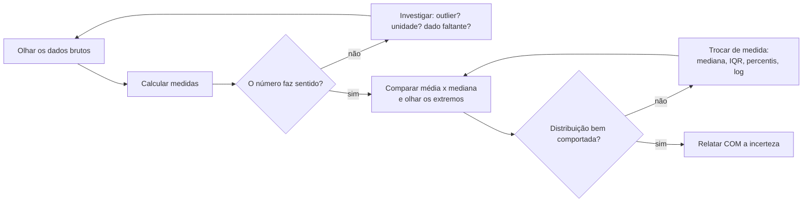

# 4. Como começar — do ambiente pronto ao primeiro resumo honesto

`Nível: iniciante` · `Tempo: 30 a 45 minutos` · `Última atualização: 20/08/2026`
`Todo o código deste arquivo foi executado em Python 3.10.12 (Ubuntu 22.04.5) em 20/08/2026.`
`As saídas mostradas são as reais, copiadas do terminal.`

> Este arquivo assume que você já tem Python funcionando —
> pelo [03-instalacao.md](03-instalacao.md) ou pelo navegador (Colab/JupyterLite).
> **Não repetimos instalação aqui.** Se `python3 --version` responde, você está pronto.
> Nenhum `pip install` é necessário: usamos só a biblioteca padrão.

---

## 4.1 O menor programa que já é estatística de verdade

Crie um arquivo `primeiro.py` e digite (digite, não copie — a primeira vez rende mais assim):

```python
import statistics as st

alturas = [1.62, 1.70, 1.58, 1.75, 1.68, 1.80, 1.66, 1.72, 1.61, 1.77]

print("n       :", len(alturas))
print("média   :", round(st.mean(alturas), 4))
print("mediana :", round(st.median(alturas), 4))
print("desvpad :", round(st.stdev(alturas), 4))
```

Rode:

```bash
python3 primeiro.py
```

```
n       : 10
média   : 1.689
mediana : 1.69
desvpad : 0.0726
```

**Como saber que deu certo:** os quatro números apareceram, e a média (1,689) está próxima da
mediana (1,690). Essa proximidade não é coincidência — ela diz que os dados são
aproximadamente **simétricos**. Guarde isso: *média ≈ mediana* é o primeiro diagnóstico que
um profissional faz, antes de qualquer outra coisa.

Tradução da saída em português comum:

> "São 10 pessoas. A altura típica é 1,69 m, e a distância típica de uma pessoa qualquer até
> essa média é de cerca de 7 cm. Ou seja: a maioria está entre 1,62 m e 1,76 m."

---

## 4.2 A mesma conta, sem biblioteca nenhuma

O `statistics` é uma caixa. Abra a caixa uma vez na vida — depois pode usar sem culpa.
Crie `na_mao.py`:

```python
alturas = [1.62, 1.70, 1.58, 1.75, 1.68, 1.80, 1.66, 1.72, 1.61, 1.77]

n = len(alturas)

# 1) MÉDIA: some tudo e divida pela quantidade
soma = sum(alturas)
media = soma / n

# 2) MEDIANA: ordene e pegue o do meio (com n par, a média dos dois centrais)
ordenado = sorted(alturas)
meio = n // 2
if n % 2 == 0:
    mediana = (ordenado[meio - 1] + ordenado[meio]) / 2
else:
    mediana = ordenado[meio]

# 3) DESVIO PADRÃO, em quatro passos explícitos
desvios   = [x - media for x in alturas]      # o quanto cada um se afasta da média
quadrados = [d ** 2 for d in desvios]         # eleva ao quadrado (some depois)
variancia = sum(quadrados) / (n - 1)          # média dos quadrados — dividindo por n-1
dp        = variancia ** 0.5                  # raiz: volta para a unidade original (metros)

print(f"n         = {n}")
print(f"soma      = {soma:.2f}")
print(f"média     = {media:.4f}")
print(f"mediana   = {mediana:.4f}")
print(f"variância = {variancia:.6f}")
print(f"desvpad   = {dp:.4f}")
print()
print("conferindo com a biblioteca padrão:")
import statistics as st
print(f"  st.mean   = {st.mean(alturas):.4f}")
print(f"  st.median = {st.median(alturas):.4f}")
print(f"  st.stdev  = {st.stdev(alturas):.4f}")
print(f"  st.pstdev = {st.pstdev(alturas):.4f}")
print()
print("soma dos desvios (deveria ser ~0):", round(sum(desvios), 12))
```

```bash
python3 na_mao.py
```

```
n         = 10
soma      = 16.89
média     = 1.6890
mediana   = 1.6900
variância = 0.005277
desvpad   = 0.0726

conferindo com a biblioteca padrão:
  st.mean   = 1.6890
  st.median = 1.6900
  st.stdev  = 0.0726
  st.pstdev = 0.0689

soma dos desvios (deveria ser ~0): -0.0
```

Três coisas para observar nessa saída, e nenhuma é detalhe:

**1. `st.stdev` = 0,0726 e `st.pstdev` = 0,0689 são números diferentes para os mesmos dados.**
`stdev` divide por `n−1` (desvio padrão *amostral*); `pstdev` divide por `n`
(*populacional*). Com n=10 a diferença é de 5%. Com n=4 seria de 15%. Com n=1000, desprezível.
Qual usar é decidido por uma pergunta, não por gosto: *estes 10 são todo o grupo que me
interessa, ou são uma amostra de um grupo maior?* Detalhe completo em
[13-medidas-de-dispersao.md](13-medidas-de-dispersao.md).

**2. A soma dos desvios deu `-0.0`.** Não é bug de exibição: é a propriedade que *define* a
média. Os afastamentos para cima cancelam exatamente os afastamentos para baixo — é a
gangorra do [arquivo 01](01-introducao-leigo.md) equilibrada. E é justamente por isso que não
dá para "tirar a média dos desvios" para medir dispersão: **daria sempre zero**. Elevar ao
quadrado no passo 2 existe para resolver esse problema (e o sinal `-0.0` aparece porque em
ponto flutuante existem dois zeros, +0.0 e −0.0; ver [75-armadilhas.md](75-armadilhas.md)).

**3. A variância (0,005277) está em metros *ao quadrado*.** Metro quadrado de altura não
significa nada no mundo. É por isso que se tira a raiz no fim: para voltar à unidade em que a
pergunta foi feita. **Variância é a conta; desvio padrão é a resposta.**

---

## 4.3 Agora com dados que mentem: o resumo honesto

Dados bonitinhos ensinam pouco. Vamos a algo real: tempos de resposta de um site.
Crie `resumo.py`:

```python
import statistics as st

# tempos de resposta de um site, em milissegundos (30 requisições)
tempos = [ 82,  91,  76, 104,  88,  95,  79, 110,  87,  93,
           85,  99,  81, 102,  90,  86,  97,  84, 108,  92,
           89,  94,  83, 101,  96, 1450,  88,  91, 2100,  87]

def percentil(dados, p):
    """Percentil p (0..100) pelo método do vizinho mais próximo."""
    ordenado = sorted(dados)
    n = len(ordenado)
    k = max(1, min(n, round(p / 100 * n)))
    return ordenado[k - 1]

n       = len(tempos)
media   = st.mean(tempos)
mediana = st.median(tempos)
dp      = st.stdev(tempos)
p90, p95, p99 = (percentil(tempos, p) for p in (90, 95, 99))

print(f"n              = {n}")
print(f"média          = {media:.1f} ms")
print(f"mediana        = {mediana:.1f} ms")
print(f"desvio padrão  = {dp:.1f} ms")
print(f"mínimo/máximo  = {min(tempos)} / {max(tempos)} ms")
print(f"p90 / p95 / p99= {p90} / {p95} / {p99} ms")
print()

razao = media / mediana
print(f"média / mediana = {razao:.2f}")
if razao > 1.2:
    print("AVISO: média muito maior que a mediana -> distribuição assimétrica à direita.")
    print("       Relatar a média como 'tempo típico' seria enganoso.")
print()

dentro = sum(1 for t in tempos if abs(t - media) <= dp)
print(f"valores a menos de 1 desvio padrão da média: {dentro}/{n} = {100*dentro/n:.0f}%")
print("(a regra do 68% supõe formato de sino; aqui ela não vale)")
```

```bash
python3 resumo.py
```

```
n              = 30
média          = 203.6 ms
mediana        = 91.0 ms
desvio padrão  = 435.7 ms
mínimo/máximo  = 76 / 2100 ms
p90 / p95 / p99= 108 / 110 / 2100 ms

média / mediana = 2.24
AVISO: média muito maior que a mediana -> distribuição assimétrica à direita.
       Relatar a média como 'tempo típico' seria enganoso.

valores a menos de 1 desvio padrão da média: 28/30 = 93%
(a regra do 68% supõe formato de sino; aqui ela não vale)
```

**Pare e olhe para esses números.** Aqui está quase tudo que este curso tem a ensinar:

- A **média (203,6 ms) é maior que 28 das 30 medições.** Um "valor típico" que é maior que
  93% dos dados não é típico de nada. Duas requisições lentas (1450 e 2100) sequestraram
  a medida — a gangorra em ação.
- O **desvio padrão (435,7 ms) é maior que a própria mediana.** Quando isso acontece, o
  desvio padrão parou de descrever "afastamento típico" e passou a descrever "existem
  outliers". Ele ainda é um número correto; deixou de ser um número informativo.
- A regra dos 68% previa ~20 valores dentro de 1 desvio padrão. **Deu 28 (93%).**
  Isso não é azar da amostra: é o que sempre acontece com dados de cauda longa. O desvio
  padrão fica inflado pelos extremos e passa a "cobrir" quase tudo. Você acabou de **medir**
  o limite de uma regra que a maioria dos cursos ensina como se fosse universal.
- O **p95 = 110 ms**, mas o **p99 = 2100 ms**. Entre 95% e 99% dos usuários, a experiência
  pula de "instantâneo" para "provavelmente desistiu". É essa faixa — e não a média — que
  gera reclamação, cancelamento e chamado de suporte.

**O que um profissional escreveria no relatório:**

> "Mediana de 91 ms e p95 de 110 ms; 2 das 30 requisições (7%) levaram mais de 1,4 s.
> A média (204 ms) não representa o comportamento típico e não deve ser usada como meta."

Essa frase tem quatro números e nenhuma mentira. É o padrão de qualidade deste curso.

> **Detalhe fino, e uma pegadinha real:** a função `percentil` acima usa `round()`, e o
> `round` do Python arredonda **meio para o par** (`round(28.5)` → `28`, `round(29.5)` → `30`).
> Não é bug: é a [IEEE 754](https://en.wikipedia.org/wiki/IEEE_754) e a norma
> [ISO 80000](https://en.wikipedia.org/wiki/ISO_80000-1), pensadas para que erros de
> arredondamento não se acumulem sempre para cima. Consequência prática: `round(2.675, 2)`
> devolve `2.67`, não `2.68` — porque 2,675 não existe exatamente em binário. Isso já causou
> divergência de centavos em fechamento contábil. Ver [75-armadilhas.md](75-armadilhas.md).

---

## 4.4 O ciclo de trabalho do dia a dia

O trabalho real não é escrever o script certo de primeira. É este laço, muitas vezes:



Duas regras de ofício, que não estão em livro nenhum e valem o curso inteiro:

1. **Olhe os dados brutos antes de calcular qualquer coisa.** `print(sorted(dados)[:5])` e
   `print(sorted(dados)[-5:])`. Os cinco menores e os cinco maiores revelam quase todo
   problema real: um `-999` que significava "sem resposta", uma medida em centímetros no meio
   de metros, uma data de 1900. Nenhuma média avisa você disso; ela apenas absorve o lixo e
   devolve um número plausível.
2. **Calcule sempre média *e* mediana.** São grátis. A razão entre elas é o seu detector de
   assimetria automático — o `AVISO` do script acima é exatamente isso, e você deveria
   colocá-lo em toda análise que fizer.

Modo interativo, para experimentar rápido:

```bash
python3
```
```
>>> import statistics as st
>>> st.mean([1, 2, 3, 100])
26.5
>>> st.median([1, 2, 3, 100])
2.5
>>> exit()
```

---

## 4.5 Os cinco primeiros erros de uso (não de instalação)

### Erro 1 — Dados como texto

```python
>>> import statistics as st
>>> st.mean(["1.5", "2.5"])
TypeError: can't convert type 'str' to numerator/denominator
```

Vem de ler CSV sem converter. **Correção:**

```python
numeros = [float(x) for x in linhas]
```

⚠️ Ainda pior é quando **não** dá erro: `sum(["1","2"])` falha, mas ordenar texto "funciona" e
mente — `sorted(["10", "9", "100"])` devolve `['10', '100', '9']`, porque texto ordena
alfabeticamente. Uma mediana calculada assim sai errada **sem nenhuma mensagem de erro**.
Erro silencioso é sempre pior que erro barulhento.

### Erro 2 — Valores ausentes tratados como zero

```python
vendas = [100, 250, 0, 180]   # o 0 era "loja fechada", não "vendeu nada"
```

A média cai de 176,7 para 132,5. **Correção:** use `None` e filtre explicitamente, deixando
registrado quantos você descartou.

```python
vendas = [100, 250, None, 180]
validos = [v for v in vendas if v is not None]
print(f"usando {len(validos)} de {len(vendas)} valores")
```

> **Isso é uma decisão estatística disfarçada de detalhe de programação.** Descartar ausentes
> só é inofensivo se eles faltam *por acaso*. Se as lojas fecham justamente nos dias ruins,
> descartá-las enviesa a média para cima. Ausência raramente é aleatória.

### Erro 3 — `stdev` com um único valor

```python
>>> st.stdev([5])
StatisticsError: stdev requires at least two data points
```

Não é implementação preguiçosa: com um dado só, **não existe** desvio padrão amostral
(a fórmula divide por `n−1` = 0). Um ponto não tem variabilidade a estimar. A mensagem de
erro está matematicamente correta.

### Erro 4 — Usar média com dados que não são números

```python
notas = ["ruim", "bom", "bom", "ótimo"]     # escala ordinal
```

Se você codificar como 1, 2, 2, 3 e tirar a média (2,0 = "bom"), assumiu sem perceber que a
distância de "ruim" a "bom" é igual à de "bom" a "ótimo". **Não é.** Para escala ordinal, a
medida certa é **mediana** ou **moda**. Isso é o assunto de escalas de medida em
[10-fundamentos.md](10-fundamentos.md), e é o pecado mais frequente em pesquisa de
satisfação: "nossa nota média é 4,2 de 5" costuma ser um número sem sentido definido.

### Erro 5 — Confundir precisão exibida com precisão real

```python
>>> st.mean([1.62, 1.70, 1.58])
1.6333333333333335
```

Suas fitas métricas medem centímetros. Reportar `1,6333333333333335 m` é afirmar precisão de
0,1 nanômetro. **Correção:** arredonde para a precisão do instrumento — aqui, `1,63 m`.

Regra prática: o resultado não pode ter mais algarismos significativos que a medida mais
grosseira que entrou nele. Ver [15-erro-e-incerteza.md](15-erro-e-incerteza.md).

E aquele `...35` no final não é erro seu: é ponto flutuante binário.
`0.1 + 0.2 == 0.3` é `False` em Python, em C, em Java e na sua planilha.

---

## 4.6 Lendo seus próprios dados de um CSV

```python
import csv, statistics as st

with open("dados.csv", newline="", encoding="utf-8") as f:
    leitor = csv.DictReader(f)
    valores = []
    ignorados = 0
    for linha in leitor:
        bruto = (linha["valor"] or "").strip().replace(",", ".")  # aceita 1,5 e 1.5
        try:
            valores.append(float(bruto))
        except ValueError:
            ignorados += 1

print(f"lidos: {len(valores)}   ignorados: {ignorados}")
if ignorados:
    print("ATENÇÃO: linhas ignoradas podem enviesar o resultado. Verifique quais foram.")
if valores:
    print(f"média   : {st.mean(valores):.3f}")
    print(f"mediana : {st.median(valores):.3f}")
    print(f"desvpad : {st.stdev(valores):.3f}" if len(valores) > 1 else "desvpad : n/d")
```

Três cuidados embutidos nesse trecho, todos deliberados:

- `encoding="utf-8"` — acentos em cabeçalho quebram a leitura sem isso (no Windows o padrão
  ainda costuma ser `cp1252`);
- `.replace(",", ".")` — CSVs brasileiros usam vírgula decimal, e `float("1,5")` falha;
- **contar e anunciar os ignorados** — silenciar linhas descartadas é como uma análise vira
  mentira sem ninguém mentir.

---

## 4.7 Confira que você entendeu, em 3 minutos

Rode isto e **preveja a saída antes**:

```python
import statistics as st
a = [10, 20, 30, 40, 50]
b = [10, 20, 30, 40, 500]
for nome, d in [("a", a), ("b", b)]:
    print(nome, "média:", st.mean(d), " mediana:", st.median(d),
          " desvpad:", round(st.stdev(d), 1))
```

```
a média: 30  mediana: 30  desvpad: 15.8
b média: 120  mediana: 30  desvpad: 212.1
```

Um único valor alterado: a média **quadruplicou**, o desvio padrão foi multiplicado por 13, e
a mediana **não se moveu um milímetro**. Se você previu isso, entendeu o essencial da diferença
entre medidas robustas e não robustas — que é o assunto de
[19-robustez-e-outliers.md](19-robustez-e-outliers.md).

---

## 4.8 Onde ir depois

| Se você quer… | Vá para |
|---|---|
| mais exemplos prontos, do trivial ao real | [06-exemplos.md](06-exemplos.md) |
| um programa completo que roda de verdade | [07-projeto-modelo/](07-projeto-modelo/README.md) |
| consultar sintaxe e notação | [05-manual-de-uso.md](05-manual-de-uso.md) |
| entender o que está por trás | [10-fundamentos.md](10-fundamentos.md) |
| a resposta sobre "erro" | [15-erro-e-incerteza.md](15-erro-e-incerteza.md) |
| não passar vergonha | [75-armadilhas.md](75-armadilhas.md) |

---

## Autoteste

1. Por que `st.stdev` e `st.pstdev` dão números diferentes para os mesmos dados?
2. Por que a soma dos desvios em relação à média dá sempre zero — e o que isso implica sobre
   como medir dispersão?
3. Em que unidade está a variância de alturas medidas em metros? E o desvio padrão?
4. No exemplo dos tempos de resposta, por que 93% dos valores caíram dentro de 1 desvio padrão
   em vez dos 68% da regra?
5. O que a razão média/mediana = 2,24 está lhe dizendo?
6. Qual é o problema de calcular a média de respostas "ruim/bom/ótimo" codificadas como 1/2/3?
7. Por que `sorted(["10","9","100"])` é perigoso numa análise?
8. Um relatório diz "tempo médio de 204 ms". Que dois números você pede antes de aceitar?

<details><summary>Respostas</summary>

1. `stdev` divide a soma dos quadrados por `n−1` (estimativa amostral, corrigida para viés);
   `pstdev` divide por `n` (quando os dados são a população inteira). Ver
   [13](13-medidas-de-dispersao.md).
2. Porque a média é o ponto de equilíbrio: por construção, os afastamentos positivos cancelam
   os negativos. Implicação: uma "média dos desvios" seria sempre 0 e inútil — daí elevar ao
   quadrado (variância) ou usar o valor absoluto (desvio absoluto médio).
3. Variância em **metros ao quadrado**; desvio padrão em **metros**. A raiz existe para
   devolver a medida à unidade da pergunta.
4. Porque a distribuição tem cauda longa: os dois valores extremos inflam o desvio padrão até
   ele "cobrir" quase todos os dados. A regra dos 68% pressupõe formato de sino.
5. Que há assimetria forte à direita — poucos valores muito altos puxando a média. A mediana
   descreve o comportamento típico; a média, não.
6. Assume que os intervalos entre as categorias são iguais, o que é uma invenção. Escala
   ordinal pede mediana ou moda.
7. Porque ordena como **texto**, não como número, e produz mediana e quartis errados **sem
   emitir erro algum**. Erro silencioso.
8. **Mediana** e um **percentil alto** (p95 ou p99). Se média e mediana forem muito diferentes,
   a média não descreve o caso típico.

</details>

---

**Próximo:** [05-manual-de-uso.md](05-manual-de-uso.md) — referência de notação, funções e
equivalências entre Python, R, planilha e SQL.
