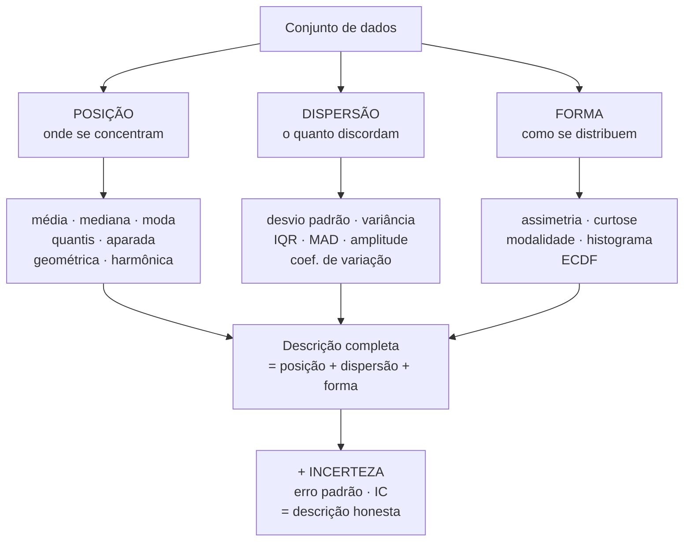

# 10. Fundamentos — o vocabulário e os modelos mentais

`Nível: iniciante → intermediário` · `Última atualização: 20/08/2026`

> Este é o arquivo que define os termos que todos os outros usam. Se em algum momento do
> curso uma palavra parecer escorregadia, é aqui que ela está fixada.

---

## 10.1 A pergunta de que tudo depende: população ou amostra?

**População** é o conjunto de *todas* as unidades sobre as quais você quer afirmar alguma
coisa. **Amostra** é o pedaço que você conseguiu observar.

```
        POPULAÇÃO  (o que você quer saber)
        ┌───────────────────────────────────┐
        │  ● ● ● ● ● ● ● ● ● ● ● ● ● ● ● ●  │      parâmetro:  μ, σ, ρ
        │  ● ● ●┌───────────┐● ● ● ● ● ● ●  │      (letras GREGAS)
        │  ● ● ●│ ● ● ● ● ● │● ● ● ● ● ● ●  │      verdadeiro, fixo, DESCONHECIDO
        │  ● ● ●│  AMOSTRA  │● ● ● ● ● ● ●  │
        │  ● ● ●└───────────┘● ● ● ● ● ● ●  │      estatística:  x̄, s, r
        │  ● ● ● ● ● ● ● ● ● ● ● ● ● ● ● ●  │      (letras LATINAS)
        └───────────────────────────────────┘      calculado, varia, CONHECIDO
```

Três consequências que organizam o campo inteiro:

1. **O parâmetro não varia; a estatística sim.** μ é um número fixo (que você não conhece).
   x̄ muda a cada amostra que você tirar. Essa variação **é** o erro amostral, e é
   mensurável — ver [15-erro-e-incerteza.md](15-erro-e-incerteza.md).
2. **Descrever ≠ inferir.** Se os dados *são* a população (todos os funcionários da sua
   empresa em 31/12), a média deles é a média, ponto final, sem incerteza amostral. Se são
   uma amostra, todo número é estimativa. Quase toda confusão de iniciante mora nessa
   fronteira.
3. **A pergunta define qual é a população, e ela quase nunca é óbvia.** "Todos os
   funcionários" é a população se você quer descrever a empresa hoje. Mas se você quer prever
   o custo da folha no ano que vem, os funcionários de hoje viram uma *amostra* de um
   processo que continua gerando dados. Mesmo conjunto, duas populações, duas análises.

> **Cinco porquês — por que o desvio padrão amostral divide por `n−1`?**
> Porque a soma dos quadrados dos desvios em relação a **x̄** é sistematicamente menor que em
> relação a **μ** (a média amostral está, por construção, no melhor lugar possível *para essa
> amostra*). Dividir por `n` subestimaria σ². Por quê exatamente `n−1`? Porque você "gastou"
> um grau de liberdade ao estimar x̄ a partir dos próprios dados: dados `n` desvios, apenas
> `n−1` são livres, já que o último fica determinado pela restrição de que a soma dos desvios
> é zero. Prova em [60-teoria-avancada.md](60-teoria-avancada.md).

---

## 10.2 Variável, observação, unidade

| Termo | Definição | Exemplo |
|---|---|---|
| **Unidade** (de observação) | a coisa sobre a qual você mede | um paciente, uma requisição HTTP, um município |
| **Variável** | uma característica que varia entre unidades | idade, tempo de resposta, população |
| **Observação** | um valor medido de uma variável numa unidade | 43 anos |
| **Conjunto de dados** | tabela: uma linha por unidade, uma coluna por variável | — |

Parece pedantismo, mas **errar a unidade de observação é o erro mais caro que existe em
análise de dados**, e ele é invisível na planilha. Exemplo real: um relatório de saúde
apresenta "média de mortalidade dos hospitais = 3,2%", tratando cada hospital como uma
unidade. Se um hospital com 20 leitos e outro com 2.000 pesam igual, a média não descreve o
risco de um paciente. A taxa correta (mortes totais / pacientes totais) pode ser muito
diferente — e é exatamente o mecanismo do paradoxo de Simpson
([exemplo 8 do arquivo 06](06-exemplos.md)).

**Regra prática:** antes de calcular qualquer média, termine esta frase em voz alta:
*"a média de ___ por ___"*. Se a segunda lacuna não for a unidade que interessa à decisão, a
média está errada.

---

## 10.3 Escalas de medida — o que decide quais contas são permitidas

Classificação de **Stanley Smith Stevens** (1946), o esqueleto conceitual da estatística
aplicada. Ela responde à pergunta "posso tirar média disto?" antes de você tirar.

| Escala | O que os números significam | Operações válidas | Posição adequada | Exemplos |
|---|---|---|---|---|
| **Nominal** | só rótulos, sem ordem | = , ≠ | **moda** | cor, estado civil, navegador, CID |
| **Ordinal** | há ordem, mas as distâncias não são comparáveis | = , ≠ , < , > | **mediana**, moda | escolaridade, Likert, patente militar, classificação de corrida |
| **Intervalar** | distâncias iguais, **zero arbitrário** | + , − | média, mediana, moda | temperatura °C/°F, ano do calendário, QI |
| **Razão** | distâncias iguais e **zero absoluto** | + , − , × , ÷ | todas, inclusive geométrica e harmônica | altura, massa, tempo decorrido, renda, contagem |

### Por que isso importa, com exemplos que doem

**Ordinal:** você pergunta a satisfação de 1 a 5 e obtém média 4,2. Para esse número ter
sentido, a distância entre "regular" (3) e "bom" (4) teria de ser igual à distância entre
"bom" (4) e "ótimo" (5). Não há razão nenhuma para isso ser verdade — e há evidência empírica
de que não é: as pessoas usam os extremos com muito mais parcimônia. O correto é relatar a
**distribuição de frequências** ("62% responderam 4 ou 5") ou a mediana.

> **Honestidade sobre a controvérsia:** essa regra de Stevens é ensinada como absoluta e é
> **disputada há décadas**. Na prática, psicometria e ciências sociais tiram médias de escalas
> Likert somadas o tempo todo, com defesa razoável: somar muitos itens ordinais produz algo
> que se comporta como intervalar, e os métodos são robustos a desvios moderados. Minha
> posição, e é opinião: **um único item Likert não tem média com sentido; uma escala somada de
> 10 itens tem, aproximadamente**. Em qualquer dos casos, mostre a distribuição junto — ela é
> grátis e resolve a discussão.

**Intervalar:** hoje faz 20 °C e ontem fez 10 °C. Está "duas vezes mais quente"? Não. O zero
do Celsius é uma convenção (o congelamento da água), não a ausência de calor. Em Fahrenheit
seriam 68 °F e 50 °F, razão 1,36. Em Kelvin, 293 K e 283 K, razão 1,04. **Três respostas para
a mesma pergunta significa que a pergunta não faz sentido nessa escala.** Por isso o
coeficiente de variação, que é uma razão, não se aplica a temperatura em °C.

**Razão:** aqui tudo vale, porque o zero significa "nada disso existe". 20 kg é o dobro de
10 kg em qualquer sistema de unidades.

### O caso especial das contagens e das proporções

- **Contagem** (número de acidentes, de cliques, de defeitos) é escala de razão, mas
  **discreta e não negativa**. Modelos que supõem normal produzem previsões negativas.
  A distribuição natural é Poisson ou binomial negativa.
- **Proporção** vive entre 0 e 1 e tem variância que depende da média (`p(1−p)/n`, máxima em
  p = 0,5). Isso significa que a suposição de "variância constante", que muitos métodos fazem,
  é falsa por construção. Ver [14-forma-e-distribuicoes.md](14-forma-e-distribuicoes.md).
- **Dado composicional** (percentuais que somam 100%) tem uma armadilha específica: as partes
  são forçadamente correlacionadas negativamente. Se uma sobe, outra desce. Correlação entre
  componentes de uma composição é artefato, não descoberta.

---

## 10.4 O que é, formalmente, uma "medida-resumo"

Uma medida-resumo é uma **função que leva um conjunto de dados a um único número**:

```
T : (x₁, x₂, …, xₙ)  ⟶  ℝ
```

Isso permite classificar qualquer medida por **propriedades**, e essas propriedades é que
explicam quando ela serve.

| Propriedade | Definição | Média | Mediana | Moda |
|---|---|---|---|---|
| **Equivariância a translação** | T(x + c) = T(x) + c | ✅ | ✅ | ✅ |
| **Equivariância a escala** | T(a·x) = a·T(x) | ✅ | ✅ | ✅ |
| **Simetria (permutação)** | a ordem dos dados não altera o resultado | ✅ | ✅ | ✅ |
| **Linearidade** | T(x + y) = T(x) + T(y) | ✅ | ❌ | ❌ |
| **Ponto de ruptura** | fração dos dados que pode ser corrompida sem destruir a medida | **0%** | **50%** | 50% |

A linha da **linearidade** explica por que a média domina a estatística clássica: ela permite
álgebra. "A média das somas é a soma das médias" é o que torna possível a variância se
decompor, a regressão ter solução fechada e o Teorema Central do Limite existir. A mediana
não tem isso — a mediana de x+y não é a mediana de x mais a mediana de y — e é por essa razão
histórica, não por superioridade, que a média venceu.

A linha do **ponto de ruptura** explica a robustez. Ponto de ruptura 0% significa: **basta
um** valor corrompido, arbitrariamente longe, para levar a média a qualquer lugar. A mediana
suporta que **quase metade** dos dados seja lixo. Ver
[19-robustez-e-outliers.md](19-robustez-e-outliers.md).

### As duas medidas como soluções de problemas de otimização

Este é o modelo mental mais útil de todo o curso, e vale decorar:

```
  MÉDIA    = o valor c que minimiza  Σ (xᵢ − c)²      ← soma dos QUADRADOS
  MEDIANA  = o valor c que minimiza  Σ |xᵢ − c|       ← soma dos MÓDULOS
  MODA     = o valor c que minimiza  Σ 1[xᵢ ≠ c]      ← contagem de erros
```

As três respondem à mesma pergunta — *"qual número único representa melhor este conjunto?"* —
e diferem apenas em **como se pune o erro**:

- **Ao quadrado**: um erro de 10 pune 100 vezes mais que um erro de 1. Errar muito uma vez é
  catastrófico. Por isso a média persegue os extremos.
- **Em módulo**: um erro de 10 pune 10 vezes mais que um erro de 1. Proporcional, sem drama.
  Por isso a mediana ignora o quão longe está o extremo.
- **Contagem**: errar por 0,01 pune igual a errar por 1.000. Só importa acertar em cheio.

> **Isto não é analogia — é a definição.** Derive `Σ(xᵢ − c)²` em relação a `c`, iguale a
> zero, e cai `c = x̄`. Prova em [12-medidas-de-posicao.md](12-medidas-de-posicao.md), §12.2.
> Quando alguém perguntar "por que a média é a média?", esta é a resposta.

---

## 10.5 As três famílias de medidas descritivas



**Regra mínima de honestidade:** nunca relate só a posição. O par
**posição + dispersão** é o mínimo; **posição + dispersão + n** é o mínimo publicável;
**posição + dispersão + n + incerteza** é o padrão profissional.

---

## 10.6 Estatística descritiva × inferencial × exploratória

| | Pergunta que responde | Ferramentas | Perigo |
|---|---|---|---|
| **Descritiva** | "como são estes dados?" | média, DP, histograma | achar que descreve mais do que os dados que você tem |
| **Exploratória** (EDA) | "o que há aqui que eu não esperava?" | gráficos, resumos, transformações | encontrar padrões no ruído |
| **Inferencial** | "o que estes dados dizem sobre o que eu não vi?" | IC, testes, modelos | supor que a amostra é representativa quando não é |
| **Preditiva** | "qual será o próximo valor?" | modelos, validação | confundir ajuste com previsão |
| **Causal** | "o que acontece se eu intervier?" | experimento, desenho causal | inferir causa de dados observacionais |

**A distinção entre exploratória e confirmatória é ética, não técnica.** John Tukey, que criou
a EDA em 1977, foi explícito: explorar é legítimo e necessário — desde que você **declare**
que explorou. O problema não é olhar 40 hipóteses; é olhar 40 e apresentar a vencedora como se
tivesse sido a única. Isso tem nome (HARKing — *Hypothesizing After Results are Known*) e é a
principal engrenagem da crise de replicação. Ver
[65-estado-da-arte.md](65-estado-da-arte.md).

> **Opinião profissional:** a maioria dos cursos passa 90% do tempo em inferencial e trata
> descritiva como aquecimento. Na prática de campo é o contrário: **a maior parte dos erros
> caros acontece na descrição** — unidade de observação errada, escala mal interpretada, dados
> ausentes ignorados, outlier não investigado. Um teste de hipótese sobre dados mal descritos
> é uma casa decimal a mais numa resposta errada.

---

## 10.7 Modelo mental: dados como amostra de um processo

O salto conceitual mais importante deste curso é este:

> **Você quase nunca quer descrever os dados. Você quer descrever o processo que os gerou.**

Os 30 tempos de resposta que você mediu não interessam por si. Interessam porque são uma
janela para *como o sistema se comporta*. Os 500 pacientes do estudo não interessam; interessa
*o efeito do tratamento*.

Isso muda tudo:

| Se os dados são o fim | Se os dados são uma janela |
|---|---|
| a média é a média | a média é uma **estimativa** da média do processo |
| não há erro | há erro padrão, IC, e a pergunta "quanto isso balança?" |
| `n` é só o tamanho da tabela | `n` determina **quanta** confiança você pode ter |
| outlier é um valor grande | outlier é uma **pergunta**: o processo mudou? o dado está errado? há dois processos? |
| reproduzir é copiar o arquivo | reproduzir é obter **outro** conjunto e chegar perto |

É por isso que este curso insiste em relatar `n` e incerteza sempre. Não é formalismo: é a
diferença entre descrever uma tabela e descrever o mundo.

---

## 10.8 Glossário mínimo deste arquivo

Todos os termos estão também no [GLOSSARIO.md](GLOSSARIO.md).

- **Parâmetro** — valor verdadeiro na população (μ, σ). Fixo e desconhecido.
- **Estatística** — valor calculado da amostra (x̄, s). Varia entre amostras.
- **Estimador** — a regra de cálculo; **estimativa** é o número que ela produz numa amostra.
- **Viés** (*bias*) — erro sistemático: o estimador acerta na média? `E[θ̂] − θ`.
- **Robustez** — resistência a valores extremos e a violações de suposição.
- **Grau de liberdade** — número de valores livres depois das restrições impostas.
- **iid** — independentes e identicamente distribuídas; a suposição por trás de quase tudo.
- **Ponto de ruptura** — fração de contaminação que a medida suporta.

---

## Autoteste

1. Os salários de todos os funcionários da sua empresa em 31/12: população ou amostra?
   Em que situação a resposta muda?
2. Por que a média é "o valor que minimiza a soma dos quadrados" e a mediana "a soma dos
   módulos"? O que isso explica sobre robustez?
3. Qual é a unidade de observação em "mortalidade média dos hospitais"? Qual deveria ser?
4. Por que não se pode dizer que 20 °C é o dobro de 10 °C, mas 20 kg é o dobro de 10 kg?
5. Você mede satisfação de 1 a 5. Qual medida de posição é defensável, e o que mais mostrar?
6. O que significa "ponto de ruptura 0%" da média?
7. Cite uma propriedade que a média tem e a mediana não, e diga por que ela foi decisiva
   historicamente.
8. Qual a diferença ética entre análise exploratória e confirmatória?

<details><summary>Respostas</summary>

1. **População**, se a pergunta é "como é a empresa hoje". Vira **amostra** se a pergunta é
   sobre o processo que gera contratações e salários — por exemplo, para prever a folha do ano
   que vem, ou para comparar com outra empresa.
2. Porque cada uma é a solução de um problema de minimização com uma punição diferente para o
   erro. O quadrado pune desproporcionalmente os erros grandes, então a média é arrastada
   pelos extremos; o módulo pune proporcionalmente, então a mediana ignora o quão longe está
   o extremo. **Robustez é consequência da função de perda escolhida.**
3. A unidade é o **hospital**; deveria ser o **paciente**, se a pergunta é sobre risco
   individual. Calcule mortes totais / pacientes totais, não a média das taxas.
4. Porque °C é escala **intervalar**: o zero é arbitrário. Razões só têm sentido em escala de
   **razão**, com zero absoluto.
5. **Mediana** e **moda**. Mostre também a **distribuição de frequências completa** — ela é
   grátis, não exige suposição nenhuma e responde a mais perguntas que qualquer resumo.
6. Que **um único** valor corrompido, colocado arbitrariamente longe, pode levar a média a
   qualquer valor. Nenhuma proporção de contaminação é tolerada.
7. **Linearidade**: a média das somas é a soma das médias. Isso permitiu álgebra — decomposição
   de variância, regressão com solução fechada, o Teorema Central do Limite. A mediana não tem
   essa propriedade, e por isso ficou de fora da estatística clássica por mais de um século,
   apesar de ser mais robusta.
8. Nenhuma diferença de técnica; a diferença é **declarar**. Explorar 40 hipóteses é legítimo;
   apresentar a vencedora como se fosse a única testada não é.

</details>

---

**Próximo:** [11-historia.md](11-historia.md) — de onde vieram essas ideias e que problema
cada uma resolveu.
