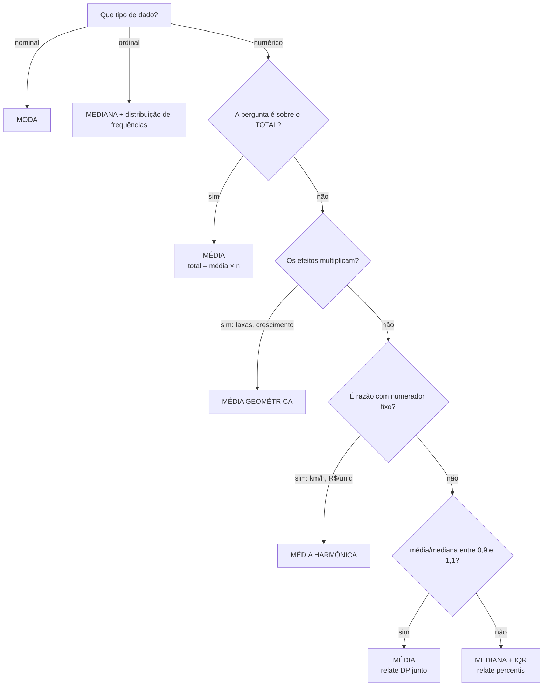

# 12. Medidas de posição — cada uma desmontada até o osso

`Nível: intermediário` · `Última atualização: 20/08/2026`
`Todo o código foi executado em Python 3.10.12 em 20/08/2026; as saídas são reais.`

> Este arquivo responde, para cada medida de posição: **o que ela minimiza**, de onde vem a
> fórmula, quando ela é a resposta certa, quando ela quebra, e o que se usa no lugar.

---

## 12.1 O mapa: sete medidas de "valor típico"

| Medida | Símbolo | Minimiza | Ponto de ruptura | Use quando |
|---|---|---|---|---|
| **Média aritmética** | x̄ | Σ(xᵢ−c)² | 0% | o **total** importa; dados simétricos |
| **Mediana** | Md, x̃ | Σ\|xᵢ−c\| | **50%** | o **caso típico** importa; há assimetria ou outliers |
| **Moda** | Mo | Σ1[xᵢ≠c] | 50% | dados **categóricos**; quer o mais frequente |
| **Média aparada** | x̄ₐ | — | proporção aparada | quer robustez sem descartar toda a magnitude |
| **Média winsorizada** | x̄w | — | proporção substituída | idem, mas mantendo `n` |
| **Média geométrica** | G | Σ(log xᵢ − log c)² | 0% | efeitos **multiplicam** (taxas, crescimento) |
| **Média harmônica** | H | — | 0% | razões com **numerador fixo** (km/h, R$/unidade) |

Relação sempre válida para dados positivos: **H ≤ G ≤ x̄**, com igualdade só se todos os
valores forem iguais.

---

## 12.2 A média: o que ela é, provado

### O que ela minimiza

Considere a pergunta: *qual número único `c` representa melhor este conjunto, se o custo de
errar for o **quadrado** do erro?*

```
minimizar   f(c) = Σ (xᵢ − c)²
```

Derive em relação a `c` e iguale a zero:

```
f'(c) = Σ 2(xᵢ − c)·(−1) = −2 Σ (xᵢ − c) = 0
     ⟹  Σ xᵢ − n·c = 0
     ⟹  c = (1/n) Σ xᵢ = x̄
```

**A média não é uma escolha; é a solução única desse problema.** E como `f''(c) = 2n > 0`, é
mínimo, não máximo.

Se você não gosta de derivada, o argumento geométrico é o mesmo: a soma dos quadrados é uma
parábola em `c`, e o vértice de uma parábola está no centro de massa dos pontos.

### Verificado numericamente

```python
import statistics as st

d = [3, 5, 8, 9, 20]
print("dados:", d, " media =", st.mean(d), " mediana =", st.median(d))
print()
print(f"{'c':>6} {'soma dos QUADRADOS':>20} {'soma dos MODULOS':>18}")
for c in [3, 5, 6, 7, 8, 9, 10, 11, 12, 20]:
    sq = sum((x - c) ** 2 for x in d)
    ab = sum(abs(x - c) for x in d)
    marca = ""
    if c == st.mean(d):
        marca += "  <- MEDIA"
    if c == st.median(d):
        marca += "  <- MEDIANA"
    print(f"{c:>6} {sq:>20.2f} {ab:>18.2f}{marca}")
```

```
dados: [3, 5, 8, 9, 20]  media = 9  mediana = 8

     c   soma dos QUADRADOS   soma dos MODULOS
     3               354.00              30.00
     5               254.00              24.00
     6               219.00              23.00
     7               194.00              22.00
     8               179.00              21.00  <- MEDIANA
     9               174.00              22.00  <- MEDIA
    10               179.00              25.00
    11               194.00              28.00
    12               219.00              31.00
    20               779.00              55.00
```

Leia a tabela devagar: a coluna dos **quadrados** tem seu mínimo (174) exatamente em `c = 9`,
a média. A coluna dos **módulos** tem seu mínimo (21) exatamente em `c = 8`, a mediana.
Uma busca fina em passos de 0,01 confirma: mínimo dos quadrados em 9,00; mínimo dos módulos
em 8,00.

**Cada medida é a resposta correta a uma pergunta diferente sobre como punir o erro.**

### As três propriedades que fazem a média dominar

1. **Σ(xᵢ − x̄) = 0.** Os desvios se cancelam exatamente. É a gangorra equilibrada. Foi essa
   propriedade que você viu como `-0.0` no [arquivo 04](04-como-comecar.md).
2. **Linearidade.** `média(x + y) = média(x) + média(y)` e `média(a·x) = a·média(x)`.
   Nenhuma outra medida de posição tem isso, e é o que permite toda a álgebra da estatística.
3. **x̄ · n = total.** A média é a única medida que "reconstitui" a soma. É por isso que folha
   de pagamento, faturamento, carga de rede e arrecadação exigem média, sem alternativa.

### Onde ela quebra

- **Assimetria.** Com cauda longa, a média sai do miolo dos dados. Regra prática: se
  `média/mediana` estiver fora de 0,9–1,1, não relate a média como "valor típico".
- **Outliers.** Ponto de ruptura 0%: um valor arbitrariamente grande leva a média a qualquer
  lugar.
- **Distribuições sem média definida.** A **Cauchy** (razão de duas normais) não tem média:
  a integral não converge. Na prática, a média de amostras Cauchy **não converge** conforme
  `n` cresce — ela continua pulando para sempre. Isso não é curiosidade: razões de quantidades
  ruidosas (ganho/perda, eficiência, "melhoria percentual") produzem caudas desse tipo com
  frequência. Ver [14-forma-e-distribuicoes.md](14-forma-e-distribuicoes.md).
- **Escala ordinal.** Média de "ruim/bom/ótimo" supõe distâncias iguais que ninguém verificou.

---

## 12.3 A mediana: robustez explicada, não afirmada

### O que ela minimiza

```
minimizar   g(c) = Σ |xᵢ − c|
```

A derivada de `|xᵢ − c|` em relação a `c` é `−1` se `c < xᵢ` e `+1` se `c > xᵢ`. Somando:

```
g'(c) = (nº de valores abaixo de c) − (nº de valores acima de c)
```

Isso zera exatamente quando há **tantos valores de um lado quanto do outro** — a definição de
mediana. E note: a derivada **não depende do quão longe** os valores estão, só de qual lado
estão. **Aí está a robustez, em uma linha de matemática.** Mover o maior valor de 20 para
20.000 não muda nada em `g'`, porque ele continua sendo "um valor à direita".

### Definição precisa

Com `n` ímpar, é o valor da posição `(n+1)/2` na lista ordenada.
Com `n` par, **qualquer** valor entre os dois centrais minimiza a soma dos módulos — o mínimo
é um platô, não um ponto. A convenção de tirar a média dos dois centrais é **arbitrária**
(escolhida por continuidade e por dar sempre um único número), e por isso existem
`median_low` e `median_high` na biblioteca padrão do Python.

> Quando o valor precisa **existir de fato** — um item de estoque, um paciente, um município —
> use `median_low`. Uma "mediana" de 2,5 filhos não é um valor que se possa apontar.

### O preço da robustez

| | Média | Mediana |
|---|---|---|
| Eficiência com dados **normais** | 100% | **64%** |
| Eficiência com dados de **cauda pesada** | pode ser péssima | muito melhor |
| Reconstitui o total | ✅ | ❌ |
| Álgebra (linearidade) | ✅ | ❌ |

"Eficiência 64%" significa: com dados perfeitamente normais, a mediana de 100 observações tem
a mesma precisão que a média de 64. Você **paga** pela robustez com dados extras — quando os
dados são bem-comportados. Quando não são, a conta se inverte, e às vezes brutalmente: no
[exemplo 7 do arquivo 06](06-exemplos.md), o intervalo de confiança da mediana ficou **2,4×
mais estreito** que o da média.

> **Isto derruba um mito comum:** não é verdade que "a média é sempre o estimador mais
> eficiente". Ela é ótima **sob normalidade**. Eficiência é uma propriedade do par
> (estimador, distribuição), nunca do estimador sozinho.

---

## 12.4 A moda

O valor mais frequente. Única medida de posição aplicável a dados **nominais** (cor, marca,
motivo de cancelamento).

Três armadilhas:

1. **Em dados contínuos, a moda não existe de forma útil.** Com alturas medidas em milímetros,
   é raro dois valores coincidirem. A "moda" passa a depender inteiramente de como você agrupou
   os dados em classes — ou seja, descreve sua escolha de histograma, não os dados.
2. **Pode não ser única.** `multimode([1,1,2,2,3])` devolve `[1, 2]`. Reportar "a moda é 1"
   nesse caso é escolher arbitrariamente.
3. **Bimodalidade é informação importante e a moda sozinha a esconde.** Se os dados têm dois
   picos, quase sempre há **duas populações misturadas** — dois grupos de usuários, dois
   processos, homens e mulheres. Nesse caso, nenhuma medida de posição única serve, e o certo
   é **separar e descrever cada grupo**. Ver [14](14-forma-e-distribuicoes.md).

⚠️ **A "relação empírica" que muitos livros ensinam — `moda ≈ média − 3(média − mediana)` — é
uma regra de bolso do início do século XX, válida apenas para distribuições unimodais de
assimetria moderada. Ela falha espetacularmente fora disso.** Com os salários do
[exemplo 1](06-exemplos.md), ela estima a moda em **−3.620,00**, um salário negativo, quando
a moda real é 2.300. Não use.

---

## 12.5 Médias aparada e winsorizada — o meio-termo que quase ninguém ensina

Você não precisa escolher entre "usar tudo" (média) e "usar só a ordem" (mediana). Há um
contínuo entre as duas.

- **Média aparada (*trimmed*) a `k`%**: descarte os `k`% menores e os `k`% maiores; tire a
  média do resto.
- **Média winsorizada a `k`%**: **substitua** os `k`% extremos de cada lado pelo valor do
  corte; tire a média de tudo. O `n` é preservado.

```python
import statistics as st, itertools

sal = [2100, 2300, 2300, 2500, 2800, 3000, 3200, 3500,
       4000, 4500, 5200, 6000, 7500, 9000, 48000]

o = sorted(sal)
n = len(o)
k = int(n * 0.10)
aparada = st.mean(o[k:n-k])
winsorizada = [o[k]] * k + o[k:n-k] + [o[n-k-1]] * k

print(f"n={n}, k={k}")
print(f"media          = {st.mean(sal):>10.2f}")
print(f"aparada 10%    = {aparada:>10.2f}   (descarta {k} de cada ponta)")
print(f"winsorizada10% = {st.mean(winsorizada):>10.2f}   (substitui {k} de cada ponta)")
print(f"mediana        = {st.median(sal):>10.2f}")

pares = [(a + b) / 2 for a, b in itertools.combinations_with_replacement(sal, 2)]
print(f"Hodges-Lehmann = {st.median(pares):>10.2f}   (mediana das medias de todos os pares)")
```

```
n=15, k=1
media          =    7060.00
aparada 10%    =    4292.31   (descarta 1 de cada ponta)
winsorizada10% =    4473.33   (substitui 1 de cada ponta)
mediana        =    3500.00

Hodges-Lehmann =    4125.00   (mediana das medias de todos os pares)
```

Repare no contínuo: **7.060 → 4.473 → 4.292 → 4.125 → 3.500**, da menos robusta à mais robusta.
Descartar **um único** valor de cada ponta (7% dos dados) já derruba a estimativa em 39%.

### Onde essas medidas são usadas de verdade

- **IPCA e outros índices de preços** usam **núcleos por médias aparadas** exatamente para
  impedir que um choque isolado (uma geada no café, um pico do combustível) contamine a
  leitura da inflação subjacente. O Banco Central do Brasil publica esse núcleo regularmente.
- **Esportes com juízes** (ginástica, saltos ornamentais, patinação) descartam a maior e a
  menor nota — média aparada institucionalizada, para reduzir o poder de um juiz mal
  intencionado.
- **A LIBOR** era calculada como média aparada das taxas informadas pelos bancos. Isso não
  impediu a manipulação de 2012 — porque o problema não era outlier acidental, era **conluio**.
  Robustez estatística não protege contra fraude coordenada. Lição que vale além do exemplo.

### E o **estimador de Hodges-Lehmann**

A mediana das médias de **todos os pares** de observações (incluindo cada valor consigo
mesmo). É notavelmente bom: ponto de ruptura de ~29% e eficiência de **96%** sob normalidade —
quase tão eficiente quanto a média e quase tão robusto quanto a mediana. É o melhor
custo-benefício das medidas de posição, e quase ninguém o conhece porque exige `n²` operações,
o que era proibitivo antes dos computadores.

---

## 12.6 Média geométrica e média harmônica — quando a aritmética está errada

### A regra que resolve a escolha

| A grandeza é… | Média correta | Exemplo |
|---|---|---|
| **somada** | aritmética | pesos, receitas, contagens |
| **multiplicada** | **geométrica** | taxas de crescimento, retornos, fatores, índices |
| **razão com numerador fixo** | **harmônica** | velocidade (distância fixa), P/L, custo por unidade |
| razão com denominador fixo | aritmética ponderada | densidade com áreas conhecidas |

### Média geométrica

```
G = (x₁ · x₂ · … · xₙ)^(1/n)   =   exp( (1/n) Σ ln xᵢ )
```

A segunda forma é a que se usa em código: multiplicar mil números estoura o expoente; somar
mil logaritmos não.

**Propriedade que a define:** `G` é o fator que, aplicado `n` vezes, chega ao mesmo resultado
que a sequência real. Por isso é a única correta para crescimento composto — ver o
[exemplo 3 do arquivo 06](06-exemplos.md), onde a média aritmética dizia "0%" enquanto o
investidor perdia 43,75%.

Também é a média correta para **combinar índices de escalas diferentes**. O **IDH da ONU**
passou, em 2010, de média aritmética para geométrica exatamente por isso: com a aritmética,
um país podia compensar educação péssima com renda altíssima; com a geométrica, um componente
próximo de zero derruba o índice inteiro. **A escolha da média embutiu um juízo de valor
explícito** — a de que as dimensões não são substituíveis entre si.

⚠️ Exige todos os valores **estritamente positivos**. Um zero anula tudo; um negativo torna o
resultado indefinido.

### Média harmônica

```
        n
H = ─────────
    Σ (1/xᵢ)
```

É a média aritmética **dos inversos**, invertida de volta. Use quando a grandeza é uma razão e
o **numerador** é o que se mantém fixo.

Casos reais além da velocidade:
- **P/L médio de uma carteira**: a média aritmética dos P/L superestima; a correta é a
  harmônica ponderada.
- **F1-score** em aprendizado de máquina é a média **harmônica** de precisão e revocação —
  escolhida de propósito porque a harmônica pune desequilíbrio: precisão 100% com revocação 1%
  dá F1 ≈ 2%, enquanto a aritmética daria 50,5%.
- **Custo médio por unidade** quando se gasta o mesmo valor em fornecedores de preços
  diferentes (o clássico *dollar-cost averaging*: comprar R$ 500 por mês de um ativo dá um
  preço médio **harmônico**, sempre ≤ ao aritmético — e é essa desigualdade que dá vantagem
  matemática ao aporte constante).

### A média quadrática (RMS), que quase não aparece nos livros de estatística

```
RMS = √( (1/n) Σ xᵢ² )
```

Usada onde a grandeza física relevante é a **energia**, proporcional ao quadrado: tensão
elétrica, potência acústica, rugosidade de superfície, aceleração de vibração. Vale sempre
`x̄ ≤ RMS`, e a diferença entre os dois **é** o desvio padrão (rigorosamente:
`RMS² = x̄² + σ²`, com σ populacional). É a mesma identidade de Pitágoras que aparece o tempo
todo neste curso.

---

## 12.7 Média ponderada — e o erro de esquecer o peso

```
        Σ wᵢ xᵢ
x̄w = ───────────
         Σ wᵢ
```

Onde ela é obrigatória e frequentemente esquecida:

- **Combinar médias de grupos.** A média das médias **só** é igual à média geral se todos os
  grupos tiverem o mesmo tamanho. Três turmas com médias 7, 8 e 9 e tamanhos 40, 10 e 10 têm
  média geral 7,5 — não 8. Este é o mecanismo aritmético por trás do
  [paradoxo de Simpson](06-exemplos.md#exemplo-8).
- **Índices de preço.** O IPCA é uma média ponderada pela participação de cada item na cesta
  de consumo. Se a sua cesta não é a média, a "sua" inflação é outra — e essa é a resposta
  técnica correta para "a inflação oficial não bate com o meu supermercado".
- **Pesquisas de opinião.** Amostras são reponderadas para corrigir sub-representação (idade,
  região, escolaridade). Isso **muda o erro padrão** — a fórmula `s/√n` deixa de valer, e usar
  o `n` bruto subestima a incerteza. Ver [17-amostragem-lgn-tcl.md](17-amostragem-lgn-tcl.md).
- **Notas de disciplina, avaliação de fornecedores, score de crédito**: qualquer composição
  com pesos.

---

## 12.8 Quantis: percentis, quartis, decis

O **quantil de ordem p** é o valor que deixa uma fração `p` dos dados abaixo dele.
Mediana = quantil 0,5. Quartis = 0,25 / 0,50 / 0,75. Percentis = ordens em centésimos.

### O problema das nove definições

Como mostrado em [05-manual-de-uso.md](05-manual-de-uso.md), §5.6, há **nove** convenções
(Hyndman & Fan, 1996) e ferramentas diferentes usam padrões diferentes. Com os mesmos oito
números, o terceiro quartil varia de 5,0 a 7,0 — **40% de diferença**.

Por que existe essa multiplicidade? Porque com `n` finito não há um "valor que deixa exatamente
25% abaixo": entre a 2ª e a 3ª observação de oito, qualquer número deixa 25% abaixo. **A
escolha é sobre como interpolar nesse vazio**, e cada convenção otimiza uma coisa (ser sempre
um dado real, ser não enviesada sob normalidade, ser contínua em `p`).

**Recomendação:** use o **tipo 7** (padrão de NumPy, pandas, R e Excel `PERCENTIL.INC`),
declare isso, e não compare quantis entre ferramentas sem conferir o método.

### Percentis altos são a medida que decide em operação

Em sistemas, SLA e saúde, o que interessa não é o centro: é a cauda.

| Percentil | Lido como |
|---|---|
| p50 (mediana) | "a experiência típica" |
| p90 | "os 10% piores" |
| **p95** | limite usual de SLA |
| **p99** | "o cliente irritado" |
| **p99,9** | "o incidente" |

⚠️ **Percentil alto exige muitos dados.** Para estimar o p99 com alguma estabilidade você
precisa de pelo menos algumas centenas de observações — com `n = 30`, o "p99" é essencialmente
o valor máximo, e o máximo é a estatística mais instável que existe. No
[arquivo 04](04-como-comecar.md), o `p99` de 30 requisições deu exatamente o maior valor, 2100.
Isso não é estimativa; é o extremo com outro nome.

⚠️ **Percentis não somam.** O p99 de uma soma **não** é a soma dos p99. Um sistema com duas
etapas, cada uma com p99 de 100 ms, não tem p99 de 200 ms — pode ter muito menos (se as
lentidões forem independentes, raramente coincidem) ou muito mais (se forem correlacionadas).
Este é um erro comum em dimensionamento de capacidade.

---

## 12.9 Como escolher, em uma árvore de decisão



E a regra que resume tudo: **calcule média e mediana sempre.** São grátis, e a comparação
entre as duas é o diagnóstico mais barato e mais informativo da estatística descritiva.

---

## Autoteste

1. Prove, em duas linhas, que a média minimiza a soma dos quadrados.
2. Por que a derivada da soma dos módulos não depende de **quão longe** está cada ponto — e o
   que isso explica?
3. Com `n` par, por que a mediana é uma convenção e não um valor determinado?
4. "A média é o estimador mais eficiente." Em que condição isso é verdade, e em que condição
   é falso?
5. Um fundo rendeu +30%, −20% e +10%. Qual média usar e qual o resultado?
6. Três turmas com médias 7, 8 e 9 e tamanhos 40, 10 e 10. Qual a média geral?
7. Por que o F1-score usa média harmônica em vez de aritmética?
8. Por que o p99 de 30 observações não é uma estimativa útil?
9. Seu sistema tem duas etapas em série, cada uma com p99 = 100 ms. O p99 total é 200 ms?
10. Por que o IDH mudou de média aritmética para geométrica em 2010?

<details><summary>Respostas</summary>

1. `d/dc Σ(xᵢ−c)² = −2Σ(xᵢ−c) = 0 ⟹ Σxᵢ = n·c ⟹ c = x̄`. Segunda derivada `2n > 0`,
   logo é mínimo.
2. Porque a derivada de `|xᵢ−c|` é apenas `±1` conforme o lado. A soma conta **quantos** estão
   de cada lado, não a distância. Isso **é** a robustez da mediana, em uma linha.
3. Porque qualquer valor entre os dois centrais minimiza igualmente a soma dos módulos — o
   mínimo é um platô. Tirar a média dos dois é convenção por continuidade.
4. Verdade **sob normalidade** (e para a família exponencial em geral). Falso com caudas
   pesadas ou contaminação: aí a mediana ou a média aparada podem ser muito mais eficientes.
   Eficiência é propriedade do par (estimador, distribuição).
5. **Geométrica** dos fatores: `(1,30 × 0,80 × 1,10)^(1/3) = 1,1440^(1/3) ≈ 1,0459`, ou
   **+4,59% ao ano**. A aritmética diria +6,67%, o que superestima.
6. `(40·7 + 10·8 + 10·9)/60 = (280+80+90)/60 = 7,5`. **Não é 8**: a média das médias só vale
   com grupos de tamanhos iguais.
7. Porque a harmônica pune o desequilíbrio: precisão 100% e revocação 1% dá F1 ≈ 2%, enquanto
   a aritmética daria 50,5% e premiaria um classificador inútil.
8. Porque com `n = 30` o "p99" cai essencialmente sobre o valor máximo, que é a estatística
   mais instável de todas. Percentis extremos exigem centenas de observações.
9. **Não.** Se as lentidões forem independentes, raramente coincidem, e o p99 total fica bem
   abaixo de 200 ms; se forem correlacionadas (mesma causa raiz), pode passar disso. Percentis
   não somam.
10. Para impedir que um componente muito alto compensasse outro muito baixo. A média geométrica
    torna as dimensões **não substituíveis**: um valor perto de zero derruba o índice. Foi uma
    decisão de valor, expressa numa escolha de média.

</details>

---

**Próximo:** [13-medidas-de-dispersao.md](13-medidas-de-dispersao.md) — desvio padrão, `n−1`,
MAD e por que a dispersão é a metade que decide.
