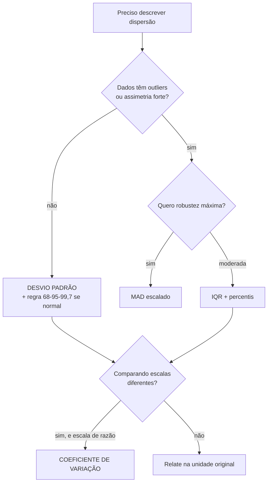

# 13. Medidas de dispersão — a metade que decide

`Nível: intermediário` · `Última atualização: 20/08/2026`
`Simulações executadas em Python 3.10.12 em 20/08/2026; as saídas são reais.`

> "Média 6" não descreve nada. Este arquivo é sobre a outra metade da informação:
> **o quanto os números discordam entre si** — e sobre a pergunta que mais trava
> iniciantes: por que dividir por `n−1`.

---

## 13.1 O mapa das medidas de dispersão

| Medida | Fórmula | Unidade | Ponto de ruptura | Use quando |
|---|---|---|---|---|
| **Amplitude** | máx − mín | original | 0% | nunca, praticamente (ver §13.2) |
| **Variância** | Σ(xᵢ−x̄)²/(n−1) | **ao quadrado** | 0% | como etapa de conta, não como resposta |
| **Desvio padrão** | √variância | original | 0% | padrão geral; dados razoavelmente simétricos |
| **Desvio absoluto médio** | Σ\|xᵢ−x̄\|/n | original | 0% | quando se quer interpretabilidade direta |
| **IQR** | Q₃ − Q₁ | original | **25%** | assimetria, outliers |
| **MAD** (mediana dos desvios) | 1,4826·med(\|xᵢ−med\|) | original | **50%** | máxima robustez |
| **Coef. de variação** | s/x̄ | adimensional | 0% | comparar escalas diferentes (só escala de razão) |
| **Erro padrão** | s/√n | original | 0% | **dispersão da média**, não dos dados |

⚠️ A última linha é uma medida de coisa **diferente** e está aqui só para marcar a diferença.
Ver [15-erro-e-incerteza.md](15-erro-e-incerteza.md).

---

## 13.2 Amplitude: por que quase nunca serve

`amplitude = máximo − mínimo`. Duas objeções, e a segunda é fatal:

1. **Usa só os dois valores mais extremos** — exatamente os dois em que você menos confia.
   Ponto de ruptura 0%, e do jeito mais literal possível.
2. **Cresce sozinha com `n`.** Colete mais dados e a amplitude aumenta, sempre, porque há mais
   chance de capturar um valor extremo. Uma medida que muda de valor só porque você mediu mais
   **não descreve o fenômeno; descreve o seu esforço**.

Isso não é opinião: a amplitude esperada de uma amostra normal cresce aproximadamente com
`√(2 ln n)`. De `n = 10` para `n = 1.000`, a amplitude esperada praticamente dobra, com a
mesma população.

**Onde ela ainda vale:** em controle de qualidade com subgrupos pequenos e de tamanho fixo
(as cartas R de Shewhart usam `n = 4` ou `5`). Como `n` é constante, o problema desaparece, e
calcular a amplitude à mão no chão de fábrica é instantâneo. É uma sobrevivência justificada
por ergonomia, não por estatística.

---

## 13.3 O caminho até o desvio padrão, em quatro perguntas

### Pergunta 1: por que não a média dos desvios?

Porque ela é **sempre zero**. Por construção: `Σ(xᵢ − x̄) = 0` é a propriedade que define a
média. Você já viu isso acontecer como `-0.0` no [arquivo 04](04-como-comecar.md).

### Pergunta 2: por que não a média dos **módulos** dos desvios?

Essa é uma medida legítima — chama-se **desvio absoluto médio** (MAD, no sentido *mean absolute
deviation*) — e é **mais fácil de interpretar** que o desvio padrão: é literalmente "a distância
média até a média".

Ela perdeu por três motivos, e vale conhecer os três porque só o terceiro é bom:

1. **Não é diferenciável** em zero, o que impedia soluções fechadas na era pré-computador.
2. **Não se decompõe.** Aqui está o motivo real: variâncias de variáveis independentes se
   **somam**; desvios absolutos médios não. Sem essa propriedade, não existe propagação de
   incerteza, não existe ANOVA, não existe `EP = σ/√n`.
3. **Não é a medida natural da normal.** Numa distribuição normal, μ e σ descrevem tudo. O
   desvio absoluto médio de uma normal é `σ·√(2/π) ≈ 0,7979σ` — informação redundante, com
   constante feia.

> **Ressalva honesta:** existe um debate real, reaberto por Nassim Taleb e outros, de que a
> preferência pelo desvio padrão é histórica e que o desvio absoluto médio seria mais robusto e
> mais interpretável para muitos usos práticos. **Concordo parcialmente**, e declaro que é
> opinião: para *comunicar* dispersão a um leigo, o desvio absoluto médio é melhor; para
> *fazer contas* que precisam se propagar, o desvio padrão é insubstituível.

### Pergunta 3: por que a raiz no fim?

Porque a variância está em **unidade ao quadrado**. Variância de alturas em metros está em
metros quadrados, o que não significa nada. A raiz devolve o número à unidade da pergunta.

> **Variância é a conta; desvio padrão é a resposta.** Toda álgebra (somar, decompor, propagar)
> acontece em variância; a comunicação acontece em desvio padrão.

### Pergunta 4: por que `n − 1`?

Esta é a pergunta que trava todo mundo na segunda semana. A resposta tem duas camadas.

**Camada intuitiva.** Você está estimando os desvios em relação a `x̄`, e não em relação a `μ`,
que você não conhece. Mas `x̄` foi calculada **a partir dos próprios dados** — ela é, por
construção, o ponto que **minimiza** a soma dos quadrados daquela amostra
([arquivo 12](12-medidas-de-posicao.md), §12.2). Ou seja: `Σ(xᵢ − x̄)²` é sistematicamente
**menor** que `Σ(xᵢ − μ)²`. Dividir por `n` herdaria essa subestimação. Dividir por `n − 1`
a corrige exatamente.

**Camada de graus de liberdade.** Dados `n` desvios `(xᵢ − x̄)`, apenas `n − 1` são livres:
sabendo `n − 1` deles, o último está determinado, porque a soma tem de ser zero. Você tem
`n − 1` informações independentes sobre dispersão, não `n`.

### Verificado por simulação

```python
import random, math
random.seed(2026)

MU, SIGMA = 100.0, 15.0
print(f"populacao: normal com mu={MU}, sigma={SIGMA}"
      f"  ->  variancia verdadeira = {SIGMA**2:.1f}")
print()
print(f"{'n':>4} {'media de s2 com /n':>20} {'media de s2 com /(n-1)':>24} {'media de s (n-1)':>18}")
for n in [2, 3, 5, 10, 30, 100]:
    REP = 200000 if n <= 10 else 50000
    soma_n = soma_n1 = soma_s = 0.0
    for _ in range(REP):
        am = [random.gauss(MU, SIGMA) for _ in range(n)]
        m = sum(am) / n
        sq = sum((x - m) ** 2 for x in am)
        soma_n  += sq / n
        soma_n1 += sq / (n - 1)
        soma_s  += math.sqrt(sq / (n - 1))
    print(f"{n:>4} {soma_n/REP:>20.2f} {soma_n1/REP:>24.2f} {soma_s/REP:>18.2f}")
print()
print(f"verdadeiro:            {SIGMA**2:>20.2f} {SIGMA**2:>24.2f} {SIGMA:>18.2f}")
```

```
populacao: normal com mu=100.0, sigma=15.0  ->  variancia verdadeira = 225.0

   n   media de s2 com /n   media de s2 com /(n-1)   media de s (n-1)
   2               112.26                   224.52              11.96
   3               149.94                   224.91              13.29
   5               179.66                   224.58              14.09
  10               201.94                   224.38              14.57
  30               217.31                   224.80              14.87
 100               222.67                   224.92              14.96

verdadeiro:                          225.00                   225.00              15.00
```

Leia as três colunas:

- **Coluna `/n`**: com `n = 2` estima 112, exatamente **metade** do valor verdadeiro (225).
  Com `n = 5`, 180 (20% baixo). Só converge quando `n` é grande. **A subestimação é
  sistemática, não aleatória** — repetir 200.000 vezes não a corrige, porque é viés.
- **Coluna `/(n−1)`**: 224,5 · 224,9 · 224,6 · 224,4 · 224,8 · 224,9. **Acerta para todo `n`.**
  É isso que "estimador não enviesado" significa, e você acabou de vê-lo funcionando.
- **Coluna `s`**: mesmo com `n−1`, o **desvio padrão** dá 11,96 quando σ = 15. Continua
  enviesado para baixo.

### A pegadinha que quase ninguém conta: `s` não é não enviesado

A correção de Bessel torna **s² não enviesada para σ²**. Mas `s = √(s²)` **não é** não
enviesada para σ, porque a raiz quadrada é uma função côncava e, pela desigualdade de Jensen,
`E[√X] < √E[X]`.

O viés é previsível: para `n = 2` e dados normais, `E[s] = σ·√(2/π) ≈ 0,7979σ = 11,97` —
exatamente o 11,96 medido acima. O fator de correção `c₄(n)` existe e é tabelado (é usado em
cartas de controle industriais), mas quase ninguém o aplica porque para `n > 25` o viés é
inferior a 1%.

> **A lição vale mais que o detalhe:** *"não enviesado" não sobrevive a transformações não
> lineares.* Se `θ̂` é não enviesado para `θ`, `f(θ̂)` em geral **não** é não enviesado para
> `f(θ)`. Isso vale para raiz, log, inverso, exponencial — e é a origem de erros silenciosos
> quando se transforma escala. Ver [60-teoria-avancada.md](60-teoria-avancada.md).

### E quando usar `/n`, então?

Quando os dados **são** a população. Se você tem os 15 funcionários da empresa e quer descrever
*aquela* empresa, não há inferência: use `pstdev`. Se eles são uma amostra de "empresas do
setor" ou de "a empresa ao longo do tempo", use `stdev`.

**Na dúvida, use `n − 1`.** Com `n > 30`, a diferença é menor que 2% e não muda decisão nenhuma.
Com `n < 10`, a escolha importa e você precisa saber qual pergunta está respondendo.

---

## 13.4 A regra 68–95–99,7 e onde ela falha

Numa distribuição **normal**:

```
   ┌─────────────────── 99,7% ───────────────────┐
        ┌───────────── 95% ─────────────┐
              ┌────── 68% ──────┐
   ─────┬─────┬─────┬─────┬─────┬─────┬─────
      μ−3σ  μ−2σ  μ−σ    μ    μ+σ   μ+2σ  μ+3σ
```

Isso é **exato e verificável**: `NormalDist().cdf(1) - NormalDist().cdf(-1) = 0,6827`.

**Mas é uma propriedade da normal, não dos dados.** Já medimos duas violações neste curso:

| Situação | Cobertura de 1 DP | Onde |
|---|---|---|
| normal teórica | 68,3% | — |
| alturas simuladas (bem comportadas) | 64% | [07-projeto-modelo](07-projeto-modelo/README.md) |
| tempos de resposta com 2 outliers | **93%** | [04-como-comecar](04-como-comecar.md) |
| rendas log-normais | **83%** | [exemplo 14](06-exemplos.md) |
| as mesmas rendas, em escala log | 67,8% | [exemplo 14](06-exemplos.md) |

O padrão é sempre o mesmo: **com cauda pesada, os extremos inflam o desvio padrão até ele
cobrir demais**. A faixa "média ± 1 DP" fica larga demais no miolo e ainda assim não alcança
os extremos que interessam.

**O que fazer em vez disso:** medir a cobertura empírica (uma linha de código) ou usar
**percentis diretos**. `p2,5` e `p97,5` delimitam 95% dos dados **sem supor formato nenhum**,
e são o que o projeto-modelo recomenda quando detecta desvio de normalidade.

### Chebyshev: o que vale para qualquer distribuição

Se você não quer supor nada, existe uma garantia universal (Pafnuty Chebyshev, 1867):

```
P( |X − μ| ≥ k·σ )  ≤  1/k²
```

| k | Chebyshev garante ao menos | A normal entrega |
|---|---|---|
| 1 | 0% (inútil) | 68,3% |
| 2 | **75%** | 95,4% |
| 3 | **88,9%** | 99,73% |
| 4 | 93,75% | 99,994% |

A desigualdade vale para **qualquer** distribuição com variância finita — nenhuma suposição de
formato. Em troca, é frouxa: garante 75% dentro de 2σ onde a normal entrega 95%.

> **Uso prático:** quando você não sabe nada sobre a forma dos dados e precisa de um limite
> defensável, Chebyshev é a resposta honesta. "Pelo menos 89% dos casos estão a 3 desvios da
> média" é uma afirmação que **ninguém pode contestar**, seja qual for a distribuição.

---

## 13.5 Medidas robustas: IQR e MAD

### IQR — amplitude interquartil

`IQR = Q₃ − Q₁`. Contém os **50% centrais**. Ponto de ruptura de 25%: você pode corromper um
quarto dos dados de cada lado sem afetá-lo.

É a base do boxplot e da cerca de Tukey (`Q₁ − 1,5·IQR`, `Q₃ + 1,5·IQR`). Ver
[19-robustez-e-outliers.md](19-robustez-e-outliers.md) e
[20-visualizacao-de-medidas.md](20-visualizacao-de-medidas.md).

### MAD — desvio absoluto **mediano**

```
MAD = mediana( |xᵢ − mediana(x)| )
```

Ponto de ruptura de **50%** — o máximo teoricamente possível. Metade dos seus dados pode ser
lixo arbitrário e o MAD ainda descreve a outra metade.

**A constante 1,4826.** O MAD bruto é sistematicamente menor que σ. Multiplicar por
`1/Φ⁻¹(0,75) ≈ 1,4826` faz com que, **em dados normais**, o MAD escalado estime o mesmo que o
desvio padrão — tornando os dois diretamente comparáveis.

E aí vem o uso mais valioso do MAD, que quase nenhum curso menciona:

> **Compare `s` com o MAD escalado. Se forem parecidos, os dados são bem comportados. Se `s`
> for muito maior, há caudas pesadas ou outliers.** É um teste de sanidade de duas linhas, sem
> nenhuma suposição, e mais informativo que qualquer teste formal de normalidade.

No [projeto-modelo](07-projeto-modelo/README.md), o teste
`test_mad_ignora_outlier_e_dp_nao` mede isso: acrescentar um valor absurdo faz o desvio padrão
crescer **mais de 10×** enquanto o MAD cresce **menos de 2×**.

Nos salários do [exemplo 1](06-exemplos.md): `s = 11.506` contra `MAD escalado = 1.779`.
Razão de 6,5×. Isso é um alarme, e ele dispensa gráfico.

### Comparativo honesto

| | Desvio padrão | IQR | MAD |
|---|---|---|---|
| Ponto de ruptura | 0% | 25% | **50%** |
| Eficiência sob normalidade | **100%** | ~37% | ~37% |
| Se decompõe (soma) | ✅ | ❌ | ❌ |
| Interpretação direta | média | 50% centrais | mediana dos afastamentos |
| Sensível a assimetria | sim | pouco | pouco |

A **eficiência de 37%** é o preço: para a mesma precisão de estimativa sob normalidade, você
precisa de quase três vezes mais dados usando MAD. Robustez nunca é grátis — é seguro, e
seguro tem prêmio.

---

## 13.6 Coeficiente de variação — dispersão relativa

```
CV = s / x̄       (multiplique por 100 para porcentagem)
```

Adimensional, permite comparar variabilidade entre grandezas de escalas ou unidades
diferentes — ver o [exemplo 5 do arquivo 06](06-exemplos.md), onde bebês e elefantes variam
igual (~10%) e o tempo de resposta varia seis vezes mais.

**Três condições para o CV ter sentido**, e todas são violadas com frequência:

1. **Escala de razão, com zero absoluto.** CV de temperatura em °C não significa nada (dá
   valores diferentes em °F e em K, para os mesmos dias).
2. **Todos os valores positivos.** Se a variável muda de sinal, a média pode ficar perto de
   zero por cancelamento e o CV explode artificialmente.
3. **Média longe de zero.** Mesmo com dados positivos, média próxima de zero infla o CV.

**Referências de leitura**, com a ressalva de que dependem fortemente do domínio:

| CV | Leitura usual |
|---|---|
| < 10% | muito homogêneo (medições de instrumento calibrado) |
| 10–30% | variação típica de fenômeno natural |
| 30–100% | alta variabilidade |
| **> 100%** | 🚩 quase sempre cauda pesada ou outliers — investigue antes de usar a média |

---

## 13.7 A propriedade que faz a variância dominar: ela soma

Para variáveis **independentes**:

```
Var(X + Y) = Var(X) + Var(Y)
DP(X + Y)  = √( DP(X)² + DP(Y)² )        ← NÃO é DP(X) + DP(Y)
```

E, para uma constante `a`:

```
Var(a·X) = a² · Var(X)          DP(a·X) = |a| · DP(X)
Var(X + c) = Var(X)             (deslocar não muda dispersão)
```

**Toda a estatística depende dessas quatro linhas.** Delas saem:

- **`EP = σ/√n`**: a média de `n` valores independentes tem variância `σ²/n`, logo desvio
  padrão `σ/√n`. É a lei da raiz quadrada inteira, em duas linhas de álgebra.
- **Propagação de incerteza** ([exemplo 13](06-exemplos.md)): incertezas somam em quadratura.
- **ANOVA**: a variância total se decompõe em "entre grupos" + "dentro dos grupos".
- **Decomposição viés–variância** em aprendizado de máquina.

> **Cinco porquês, até a parada.** *Por que variâncias somam?* Porque a variância é um produto
> interno num espaço vetorial de variáveis aleatórias, e **independência implica
> ortogonalidade** nesse espaço. Somar variâncias de variáveis independentes é literalmente o
> **teorema de Pitágoras**. Parada legítima: é um fato geométrico, não uma convenção.
> E é por isso que a incerteza combinada de dois erros de 1% é 1,41% e não 2%: os erros são
> catetos, não segmentos na mesma reta.

⚠️ **A palavra "independentes" é obrigatória.** Se `X` e `Y` forem correlacionados,
`Var(X+Y) = Var(X) + Var(Y) + 2·Cov(X,Y)`. Esquecer o termo de covariância é o erro que faz
gestores de risco subestimarem perdas: em crise, tudo se correlaciona, e a carteira
"diversificada" descobre que suas variâncias não eram independentes.

---

## 13.8 Variância combinada (*pooled*)

Ao juntar dois grupos, a variância combinada **não** é a média das variâncias:

```
        (n₁−1)s₁² + (n₂−1)s₂²
s²ₚ = ─────────────────────────
            n₁ + n₂ − 2
```

E, mais importante, **a variância do conjunto unido não é `s²ₚ`**: se as médias dos grupos
forem diferentes, essa diferença acrescenta variância. A identidade completa é a **lei da
variância total**:

```
Var(total) = média das variâncias dentro dos grupos
           + variância das médias entre os grupos
             └──── "dentro" ────┘   └──── "entre" ────┘
```

Isso é a ANOVA em uma linha, e é também o motivo de "juntar os dados" às vezes aumentar a
dispersão de forma surpreendente. Duas linhas de produção com desvio padrão 0,01 mm cada,
mas com médias distantes 0,5 mm, produzem um lote combinado com dispersão dominada pela
diferença entre elas — e o histograma sai bimodal.

---

## 13.9 Como escolher



E o hábito profissional de dois segundos: **calcule `s` e o MAD escalado juntos**. Se a razão
`s/MAD` passar de 1,5, olhe os dados antes de acreditar em qualquer coisa.

---

## Autoteste

1. Por que não se usa a média simples dos desvios como medida de dispersão?
2. Dê o motivo **decisivo** de o desvio padrão ter vencido o desvio absoluto médio.
3. Explique `n−1` de duas formas: por viés e por graus de liberdade.
4. Na simulação, `/n` com `n=2` estimou 112 quando o verdadeiro era 225. Por que exatamente
   metade, e por que repetir 200.000 vezes não corrigiu?
5. `s²` é não enviesado para `σ²`. `s` é não enviesado para `σ`? Por quê?
6. Chebyshev garante quanto dentro de 2 desvios padrão? A normal entrega quanto?
7. Você mede `s = 11.506` e `MAD escalado = 1.779`. O que isso significa?
8. Dois erros independentes de 1% cada. Qual a incerteza combinada, e por que não 2%?
9. Por que o CV de temperatura em °C não faz sentido?
10. Duas linhas de produção, cada uma com DP de 0,01 mm, mas médias distantes 0,5 mm. O que
    acontece com a dispersão do lote combinado?

<details><summary>Respostas</summary>

1. Porque ela é **sempre zero**, por construção da média: os desvios positivos cancelam
   exatamente os negativos.
2. **Variâncias de variáveis independentes se somam**, e desvios absolutos médios não. Sem
   isso não existiria `EP = σ/√n`, propagação de incerteza nem ANOVA.
3. **Viés:** `x̄` minimiza a soma dos quadrados *daquela amostra*, então `Σ(xᵢ−x̄)²` é
   sistematicamente menor que `Σ(xᵢ−μ)²`; dividir por `n−1` corrige. **Graus de liberdade:**
   dados `n` desvios que somam zero, só `n−1` são livres.
4. Porque o fator de viés é exatamente `(n−1)/n = 1/2` quando `n = 2`. Repetir não corrige
   porque é **viés** (erro sistemático), não erro aleatório — a média de milhares de
   estimativas enviesadas converge para o valor enviesado.
5. **Não.** A raiz quadrada é côncava e, por Jensen, `E[√X] < √E[X]`. Para `n=2` e dados
   normais, `E[s] = σ√(2/π) ≈ 0,798σ` — exatamente os 11,96 medidos contra σ = 15.
6. Chebyshev garante **≥ 75%**; a normal entrega **95,4%**. Chebyshev vale para qualquer
   distribuição, e por isso é frouxa.
7. Que a razão `s/MAD` é de 6,5×: há **outliers ou cauda muito pesada**. O desvio padrão não
   está descrevendo o afastamento típico; está descrevendo os extremos.
8. `√(1² + 1²) ≈ 1,41%`. Não é 2% porque **variâncias** somam, não desvios: os dois erros são
   catetos de um triângulo retângulo, não segmentos na mesma reta.
9. Porque °C é escala **intervalar** com zero arbitrário. O mesmo conjunto de dias dá CVs
   diferentes em °C, °F e K — três respostas para a mesma pergunta significam que a pergunta
   não faz sentido nessa escala.
10. A dispersão do lote combinado é dominada pela **diferença entre as médias**, não pela
    dispersão interna (lei da variância total). O histograma sai **bimodal**, e nenhuma medida
    de dispersão única o descreve bem — o certo é separar os grupos.

</details>

---

**Próximo:** [14-forma-e-distribuicoes.md](14-forma-e-distribuicoes.md) — assimetria, curtose
e as distribuições que você vai encontrar de verdade.
