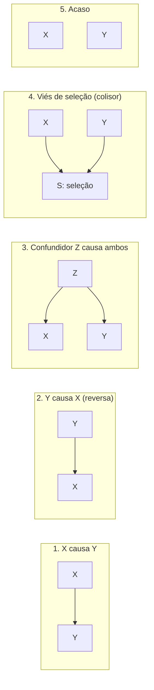

# 16. Relação entre variáveis — covariância, correlação e causa

`Nível: intermediário → avançado` · `Última atualização: 20/08/2026`
`Código executado em Python 3.10.12 em 20/08/2026; saídas reais.`

> Até aqui, uma variável de cada vez. Agora: **duas variáveis andam juntas?** — e a pergunta
> muito mais difícil que quase todo mundo responde por engano: **uma causa a outra?**

---

## 16.1 Covariância

```
              Σ (xᵢ − x̄)(yᵢ − ȳ)
Cov(X,Y) = ────────────────────────
                    n − 1
```

A leitura é direta: para cada ponto, veja se `x` e `y` estão do **mesmo lado** das respectivas
médias. Se sim, o produto é positivo; se em lados opostos, negativo. A covariância é a média
desses produtos.

- `Cov > 0`: quando um sobe, o outro tende a subir.
- `Cov < 0`: quando um sobe, o outro tende a descer.
- `Cov ≈ 0`: não há relação **linear**.

**O problema da covariância:** ela carrega o produto das duas unidades. Covariância entre
altura (m) e peso (kg) está em "metro-quilo", e o número muda inteiramente se você trocar
metros por centímetros. **Não dá para dizer se 4,7 é muito ou pouco.**

Note também que `Cov(X,X) = Var(X)`: a variância é a covariância de algo consigo mesmo.

---

## 16.2 Correlação de Pearson: covariância normalizada

```
            Cov(X,Y)
r = ───────────────────────      sempre entre −1 e +1
        s_x · s_y
```

Dividir pelos dois desvios padrão cancela as unidades e prende o resultado no intervalo
`[−1, +1]`. É a covariância medida "em desvios padrão".

| \|r\| | Leitura usual (varia muito por domínio) |
|---|---|
| 0,0 – 0,1 | desprezível |
| 0,1 – 0,3 | fraca |
| 0,3 – 0,5 | moderada |
| 0,5 – 0,7 | forte |
| > 0,7 | muito forte |

⚠️ Essas faixas são **convenção de ciências sociais** (aproximadamente as de Cohen). Em física
de laboratório, `r = 0,9` é decepcionante. Em epidemiologia, `r = 0,2` pode ser uma descoberta
importante que salva vidas. **Nunca importe faixas de outro campo.**

### r² — a interpretação que realmente significa algo

`r²` é a **fração da variância de `y` explicada linearmente por `x`**.

```
  r = 0.10  ->  r2 = 0.010  (1.0% da variancia explicada)
  r = 0.30  ->  r2 = 0.090  (9.0% da variancia explicada)
  r = 0.50  ->  r2 = 0.250  (25.0% da variancia explicada)
  r = 0.70  ->  r2 = 0.490  (49.0% da variancia explicada)
  r = 0.90  ->  r2 = 0.810  (81.0% da variancia explicada)
```

**Uma correlação "moderada" de 0,3 explica 9% da variação.** Noventa e um por cento continuam
sem explicação. Reportar `r²` junto com `r` é o antídoto mais barato contra o entusiasmo
indevido — e é por isso que muita gente prefere reportar só o `r`.

---

## 16.3 As cinco coisas que a correlação de Pearson não faz

### 1. Ela só enxerga relação LINEAR

```python
import statistics as st

x = list(range(-10, 11))
y = [v**2 for v in x]                 # relacao deterministica perfeita
print(f"  y = x^2:  Pearson r = {st.correlation(x, y):.4f}")

x2 = list(range(1, 21))
y2 = [v**3 for v in x2]
print(f"  y = x^3:  Pearson r = {st.correlation(x2, y2):.4f}  Spearman = 1.0000")
```

```
  y = x^2:  Pearson r = 0.0000
  y = x^3:  Pearson r = 0.9221  Spearman = 1.0000
```

`y = x²` é uma relação **perfeita e determinística** — dado `x`, `y` está completamente
determinado — e o `r` de Pearson é **exatamente zero**. Se você tivesse apenas o `r`,
concluiria "não há relação". Estaria completamente errado.

E `y = x³`, também perfeita e ainda por cima **monótona**, dá `r = 0,92`, não 1 — porque não
é *linear*.

> **`r = 0` significa "não há relação linear", nunca "não há relação".**

### 2. Ela é frágil a um único ponto

```python
import random, statistics as st
random.seed(4)

xa = [random.gauss(0, 1) for _ in range(30)]
ya = [random.gauss(0, 1) for _ in range(30)]
print(f"  30 pontos sem relacao:            r = {st.correlation(xa, ya):+.4f}")
xb, yb = xa + [12], ya + [12]
print(f"  + 1 ponto em (12,12):             r = {st.correlation(xb, yb):+.4f}")

random.seed(4)
xc = [random.gauss(0, 1) for _ in range(30)]
yc = [v + random.gauss(0, 0.3) for v in xc]
print(f"  30 pontos MUITO correlacionados:  r = {st.correlation(xc, yc):+.4f}")
xd, yd = xc + [8], yc + [-8]
print(f"  + 1 ponto em (8,-8):              r = {st.correlation(xd, yd):+.4f}")
```

```
  30 pontos sem relacao:            r = +0.3115
  + 1 ponto em (12,12):             r = +0.9081
  30 pontos MUITO correlacionados:  r = +0.9731
  + 1 ponto em (8,-8):              r = -0.4089
```

**Um único ponto transformou `r = 0,31` em `r = 0,91`, e outro transformou `r = +0,97` em
`r = −0,41`.** É o conjunto IV de Anscombe ([exemplo 9](06-exemplos.md)) acontecendo ao vivo.

Repare também no primeiro número: **30 pontos genuinamente independentes deram `r = 0,31`**,
uma correlação "moderada", só por acaso. Com `n` pequeno, correlações aparecem do nada.

### 3. Ela depende da amplitude dos dados (restrição de amplitude)

```python
random.seed(11)
X = [random.gauss(0, 1) for _ in range(5000)]
Y = [0.6*v + random.gauss(0, 0.8) for v in X]
print(f"  populacao inteira:                r = {st.correlation(X, Y):.4f}")
sel = [(a, b) for a, b in zip(X, Y) if a > 1.0]
print(f"  so quem tem X > 1 (n={len(sel)}):        "
      f"r = {st.correlation([a for a,b in sel], [b for a,b in sel]):.4f}")
```

```
  populacao inteira:                r = 0.6015
  so quem tem X > 1 (n=810):        r = 0.3433
```

A relação **não mudou** — o processo gerador é exatamente o mesmo. Só olhamos uma fatia
estreita de `x`, e `r` caiu de 0,60 para 0,34.

Isso tem consequências reais e recorrentes:

- **"O vestibular não prevê o desempenho na faculdade."** Você só observa quem **passou** —
  uma faixa estreita de notas. A correlação medida entre os aprovados subestima drasticamente
  a correlação na população de candidatos. Esse é o argumento clássico contra estudos que
  "provam" que testes de seleção não funcionam.
- **"A entrevista não prevê desempenho no trabalho."** Mesmo mecanismo: só se observa quem foi
  contratado.
- Qualquer análise feita sobre um grupo **selecionado** por uma das variáveis.

### 4. Ela não distingue relação de coincidência com `n` pequeno

Com `n = 10`, o valor crítico de `r` para `p < 0,05` é **0,63**. Com `n = 100`, é 0,20. Com
`n = 1.000`, é 0,062. Ou seja: com muitos dados, correlações minúsculas e irrelevantes viram
"estatisticamente significativas"; com poucos, correlações fortes podem ser puro acaso.

O site *Spurious Correlations*, de Tyler Vigen, coleciona pares como "consumo de queijo
mussarela per capita × doutorados em engenharia civil" com `r > 0,95`. O truque: séries
temporais que só **crescem** correlacionam-se com qualquer outra que cresça.

### 5. Ela não é causa. Nunca.

Ver §16.6 — merece seção própria.

---

## 16.4 Alternativas: Spearman, Kendall, e o resto

| Medida | O que mede | Robusta? | Use quando |
|---|---|---|---|
| **Pearson** `r` | relação **linear** | ❌ | dados aproximadamente normais, relação linear |
| **Spearman** `ρ` | relação **monótona** (correlação dos postos) | ✅ | assimetria, outliers, relação curva mas monótona |
| **Kendall** `τ` | concordância de pares | ✅✅ | `n` pequeno, muitos empates; interpretação mais direta |
| **Distância de correlação** | qualquer dependência | parcial | quer detectar relação não monótona |
| **Informação mútua** | qualquer dependência | — | relações arbitrárias; precisa de muitos dados |
| **Razão de chances / risco relativo** | associação entre categorias | — | variáveis binárias |

**Spearman** é simplesmente o `r` de Pearson calculado sobre os **postos** (posições na
ordenação). Por isso `y = x³` dá Spearman = 1,000: a ordem é perfeitamente preservada.

> **Recomendação prática:** calcule **os dois**, Pearson e Spearman. Se forem parecidos, a
> relação é aproximadamente linear e você pode usar Pearson. Se Spearman for muito maior,
> a relação é monótona mas **curva** — considere transformar. Se Pearson for muito maior,
> desconfie de **outlier** puxando a reta. É um diagnóstico de duas linhas.

**Kendall τ** tem a interpretação mais transparente de todas: é a probabilidade de dois pares
sorteados ao acaso concordarem menos a de discordarem. `τ = 0,3` significa que a concordância
supera a discordância em 30 pontos percentuais. Nenhuma outra medida de associação tem
significado tão direto — e mesmo assim quase ninguém a usa, por inércia.

---

## 16.5 O quarteto de Anscombe e o Datasaurus

Já demonstrado no [exemplo 9 do arquivo 06](06-exemplos.md): quatro conjuntos com `r = 0,816`
idêntico e formatos completamente diferentes.

A versão moderna é o **Datasaurus Dozen** (Matejka & Fitzmaurice, CHI 2017): treze conjuntos
com média, desvio padrão e correlação idênticos **até a segunda casa decimal** — um deles
desenha um dinossauro, outro é uma estrela, outro são linhas paralelas. Os autores mostraram
que é possível *construir* dados com qualquer aparência preservando as estatísticas, o que
encerra qualquer discussão sobre resumos serem suficientes.

**A conclusão operacional é uma frase:** *sempre desenhe o diagrama de dispersão.* Leva dois
segundos e é a única coisa que teria salvado qualquer um dos casos acima.

---

## 16.6 Correlação e causa: o que é preciso além dos dados

Todo mundo repete "correlação não é causalidade" e depois conclui causalidade assim mesmo.
A parte útil é saber **quais são as alternativas**, para poder descartá-las uma a uma.

Se `X` e `Y` estão correlacionados, uma destas coisas está acontecendo:



### 1 e 2 — Causa direta e causa reversa

"Pessoas que fazem exercício são mais saudáveis." Exercício causa saúde, ou saúde permite
exercício? Frequentemente **os dois**, com retroalimentação.

### 3 — Confundidor

O caso mais comum. `Z` causa `X` e `Y`, criando correlação entre eles sem qualquer ligação
direta.

- Venda de sorvete × afogamentos. Confundidor: **calor**.
- Número de bombeiros no incêndio × prejuízo. Confundidor: **tamanho do incêndio**.
- Uso de aplicativos de saúde × longevidade. Confundidor: **renda e escolaridade**.

### 4 — Colisor (o mais traiçoeiro, e o menos ensinado)

Quando `X` e `Y` **ambos causam** a seleção `S`, condicionar em `S` cria correlação onde não
havia nenhuma.

**O exemplo que fixa a ideia** (Berkson, 1946): entre pacientes **internados**, doenças
distintas aparecem correlacionadas negativamente. Motivo: cada uma sozinha já basta para
internar, então quem tem uma raramente tem a outra. A correlação é **criada pela internação**,
não existe na população.

Outra versão, cotidiana: entre pessoas com quem você sai, aparência e simpatia parecem
negativamente correlacionadas ("os bonitos são chatos"). Se você aceita sair com alguém que
seja bonito **ou** simpático, criou um colisor. Na população geral não há correlação nenhuma.

> **Isto derruba uma regra que muita gente ensina como universal:** "controle por tudo o que
> puder". **Controlar por um colisor *introduz* viés** em vez de remover. Não existe receita
> mecânica de quais variáveis incluir — você precisa de um modelo do que causa o quê. É
> exatamente o argumento de Judea Pearl, e o motivo de os grafos causais (DAGs) existirem.

### 5 — Acaso

Com muitos pares testados, correlações fortes aparecem sozinhas. Ver
[exemplo 12 do arquivo 06](06-exemplos.md) e as comparações múltiplas em
[18-inferencia-p-e-ic.md](18-inferencia-p-e-ic.md).

### O que **realmente** estabelece causa

| Método | Força | Custo/limite |
|---|---|---|
| **Experimento aleatorizado** | 🥇 padrão-ouro | caro, às vezes impossível ou antiético |
| Desenho quase-experimental (diferenças-em-diferenças, descontinuidade de regressão) | forte | exige situação apropriada |
| Variável instrumental | forte, se o instrumento for válido | validade raramente verificável |
| Ajuste por confundidores com DAG explícito | moderada | depende de você ter listado os confundidores certos |
| Critérios de Bradford Hill (1965) | orientação, não prova | julgamento |
| Correlação simples | **nenhuma** | — |

**Por que a aleatorização funciona?** Porque ela quebra, por construção, todas as setas que
entram em `X`. Se o tratamento é sorteado, nenhum confundidor pode estar causando a atribuição
— nem os que você conhece, nem os que você nunca imaginou. É a única técnica que protege
contra confundidores **desconhecidos**, e é por isso que ela é insubstituível. Fisher a
introduziu nos anos 1920, e continua sendo a ideia mais poderosa da inferência causal.

---

## 16.7 Paradoxo de Simpson, revisitado

Já visto com dados reais no [exemplo 8 do arquivo 06](06-exemplos.md): o tratamento A vence em
cálculos pequenos, vence em cálculos grandes, e "perde" no agregado.

Mecanismo aritmético: é média ponderada com pesos diferentes ([arquivo 12](12-medidas-de-posicao.md), §12.7).
Mecanismo causal: o tamanho do cálculo influencia **tanto** a escolha do tratamento **quanto**
o desfecho — é um confundidor.

**O ponto que costuma passar batido:** nem sempre a resposta é "olhe o estrato". Existe um
caso em que **o agregado é o correto** — quando a variável de estratificação é um **mediador**,
ou seja, está *no caminho causal* entre `X` e `Y`.

Exemplo: um remédio reduz o infarto, e parte do efeito ocorre por reduzir a pressão arterial.
Se você estratificar por pressão, remove justamente a parte do efeito que o remédio produz, e
o resultado por estrato **subestima** o benefício.

> **Conclusão desconfortável e verdadeira:** o paradoxo de Simpson **não tem solução
> estatística**. Dois números aritmeticamente corretos, e qual usar depende de um modelo causal
> que não está nos dados. Estatística descritiva revela que há uma decisão a tomar; ela não a
> toma.

---

## 16.8 Regressão à média (de novo, porque é importante)

Já simulada no [exemplo 10 do arquivo 06](06-exemplos.md). O ponto essencial:

> Sempre que `|r| < 1` entre duas medições, valores extremos da primeira são seguidos por
> valores **menos** extremos da segunda. Sem causa. Automaticamente.

A fórmula é simples: se `x` está a `k` desvios da média, o valor previsto de `y` está a
`r · k` desvios. Com `r = 0,5` e um resultado 2 desvios acima, o próximo é previsto a apenas
1 desvio acima.

Onde ainda engana profissionais:

- radar instalado em ponto de pico de acidentes;
- tratamento iniciado após um exame muito alterado;
- "reversão à média" em investimentos, esportes, avaliações de desempenho;
- **avaliação de programas sociais sem grupo de controle** — talvez o caso mais caro
  socialmente, porque programas são tipicamente implantados onde os indicadores estão piores.

**O antídoto é sempre o mesmo: grupo de controle.** Sem ele, você não consegue separar efeito
de regressão.

---

## 16.9 Como analisar duas variáveis, na ordem certa

1. **Desenhe o diagrama de dispersão.** Sempre. Antes de qualquer número.
2. **Calcule Pearson e Spearman.** Compare: diferença grande revela curvatura ou outlier.
3. **Reporte `r²`**, não só `r`.
4. **Reporte o IC de `r`.** Com `n = 30`, o IC de `r = 0,4` vai de aproximadamente 0,05 a 0,66.
   É enorme, e quase ninguém mostra.
5. **Verifique restrição de amplitude**: seus dados cobrem a faixa de interesse?
6. **Liste os confundidores plausíveis** antes de qualquer frase causal.
7. **Se falar em causa, diga qual desenho sustenta essa afirmação.**

---

## Autoteste

1. Por que a covariância entre altura e peso é difícil de interpretar?
2. `y = x²` com `x` de −10 a 10. Qual o `r` de Pearson? O que isso ensina?
3. Uma correlação de 0,3 explica quanto da variância?
4. Você tem `r = 0,97` e adiciona um único ponto. Ele pode virar `r = −0,41`?
5. Estudo conclui que "o vestibular não prevê desempenho na faculdade". Qual é o problema?
6. Quando Spearman é muito maior que Pearson, o que isso sugere? E o contrário?
7. Cite as cinco explicações possíveis para uma correlação observada.
8. O que é um colisor, e por que "controlar por tudo" é um conselho ruim?
9. Por que a aleatorização estabelece causa e a correlação não?
10. No paradoxo de Simpson, quando o **agregado** é a resposta certa?

<details><summary>Respostas</summary>

1. Porque ela carrega o produto das unidades (metro-quilo) e muda de valor conforme a escala
   escolhida. Não há como julgar se o número é grande ou pequeno. A correlação resolve isso
   normalizando pelos desvios padrão.
2. **`r = 0,0000` exatamente**, apesar de a relação ser perfeita e determinística. Ensina que
   `r = 0` significa "sem relação **linear**", nunca "sem relação".
3. `r² = 0,09` → **9%**. Noventa e um por cento da variação permanecem sem explicação.
4. **Sim** — foi medido acima. Pearson tem ponto de ruptura 0%: um único ponto alavanca o
   resultado inteiro.
5. **Restrição de amplitude**: só se observa quem foi aprovado, uma faixa estreita de notas.
   A correlação medida entre aprovados subestima drasticamente a da população de candidatos.
6. Spearman ≫ Pearson: relação **monótona mas curva** — considere transformar. Pearson ≫
   Spearman: provavelmente um **outlier** puxando a reta.
7. X causa Y; Y causa X; um confundidor Z causa ambos; viés de seleção (colisor); acaso.
8. Um **colisor** é uma variável causada por ambas as variáveis de interesse. Condicionar nele
   **cria** correlação espúria. Por isso "controle por tudo" é ruim: incluir um colisor
   introduz viés em vez de removê-lo. É preciso um modelo causal.
9. Porque a aleatorização **quebra todas as setas que entram no tratamento**, inclusive as de
   confundidores que você nunca imaginou. Nenhuma técnica de ajuste protege contra
   confundidores desconhecidos.
10. Quando a variável de estratificação é um **mediador** — está no caminho causal entre X e Y.
    Estratificar por ela removeria parte do próprio efeito que se quer medir.

</details>

---

**Próximo:** [17-amostragem-lgn-tcl.md](17-amostragem-lgn-tcl.md) — por que uma colher basta
para provar a sopa.
